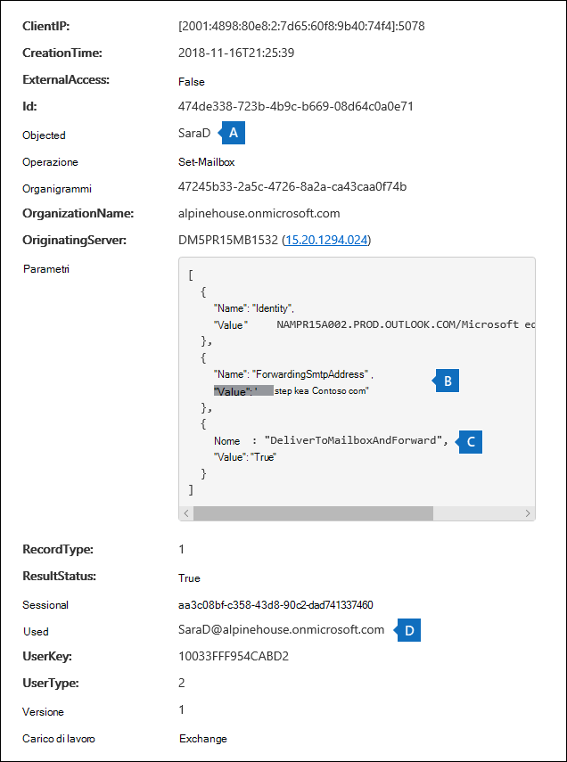
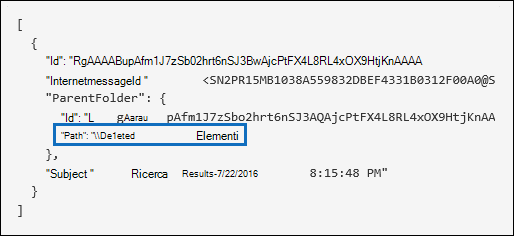

# <a name="search-the-audit-log-to-investigate-common-support-issues"></a>Cercare nel log di controllo per analizzare i problemi di supporto comuni

In questo articolo viene descritto come utilizzare lo strumento di ricerca dei log di controllo per analizzare i problemi di supporto comuni. Ciò include l'utilizzo del log di controllo per:

- Trovare l'indirizzo IP del computer utilizzato per accedere a un account compromesso
- Determinare chi ha configurato l'inoltro della posta elettronica per una cassetta postale
- Determinare se un utente ha eliminato gli elementi di posta elettronica nella propria cassetta postale
- Determinare se un utente ha creato una regola di Posta in arrivo
- Analizzare il motivo per cui un utente esterno all'organizzazione ha eseguito correttamente l'accesso
- Cercare le attività delle cassette postali eseguite da utenti con licenze non E5
- Cercare le attività delle cassette postali eseguite da utenti delegati

## <a name="using-the-audit-log-search-tool"></a>Utilizzo dello strumento di ricerca nei log di controllo

Ognuno degli scenari di risoluzione dei problemi descritti in questo articolo si basa sull'utilizzo dello strumento di ricerca dei log di controllo nel Centro sicurezza & conformità. In questa sezione vengono elencate le autorizzazioni necessarie per eseguire ricerche nel log di controllo e vengono descritti i passaggi per accedere ed eseguire le ricerche nei log di controllo. In ogni sezione dello scenario viene illustrato come configurare una query di ricerca del log di controllo e cosa cercare nelle informazioni dettagliate nei record di controllo che corrispondono ai criteri di ricerca.

### <a name="permissions-required-to-use-the-audit-log-search-tool"></a>Autorizzazioni necessarie per utilizzare lo strumento di ricerca nei log di controllo

È necessario disporre del ruolo View-Only log di controllo o log di controllo in Exchange Online per eseguire ricerche nel log di controllo. Per impostazione predefinita, questi ruoli sono assegnati ai gruppi di ruoli Gestione conformità e Gestione organizzazione nella pagina **Autorizzazioni** nell'Interfaccia di amministrazione di Exchange. Gli amministratori globali in Office 365 e Microsoft 365 vengono aggiunti automaticamente come membri del gruppo di ruoli Gestione organizzazione in Exchange Online. Per altre informazioni, vedere [Gestire i gruppi di ruoli in Exchange Online](/Exchange/permissions-exo/role-groups).

### <a name="running-audit-log-searches"></a>Esecuzione di ricerche nei log di controllo

In questa sezione vengono descritte le nozioni di base per la creazione e l'esecuzione di ricerche nei log di controllo. Utilizzare queste istruzioni come punto di partenza per ogni scenario di risoluzione dei problemi in questo articolo. Per istruzioni dettagliate, vedere Search [the audit log.](search-the-audit-log-in-security-and-compliance.md#step-1-run-an-audit-log-search)

1. Passare a [https://protection.office.com/unifiedauditlog](https://protection.office.com/unifiedauditlog) e accedere usando l'account aziendale o dell'istituto di istruzione.
    
    Viene visualizzata la pagina **Ricerca log di controllo**. 
    
    
  
4. È possibile configurare i criteri di ricerca seguenti. Ogni scenario di risoluzione dei problemi in questo articolo consiglia indicazioni specifiche per la configurazione di questi campi.
    
    a. **Attività:** Selezionare l'elenco a discesa per visualizzare le attività che è possibile cercare. Dopo aver eseguito la ricerca, vengono visualizzati solo i record di audit per le attività selezionate. Se **si seleziona Mostra risultati per tutte le attività,** verranno visualizzati i risultati di tutte le attività che soddisfano gli altri criteri di ricerca. È inoltre necessario lasciare vuoto questo campo in alcuni degli scenari di risoluzione dei problemi.
    
    b. **Data inizio** e **Data fine:** selezionare un intervallo di data e ora per visualizzare gli eventi che si sono verificati all'interno di tale periodo. Gli ultimi sette giorni sono selezionati per impostazione predefinita. La data e l'ora sono specificate in formato UTC (Coordinated Universal Time). L'intervallo massimo che è possibile specificare è 90 giorni.

    c. **Utenti:** Fare clic in questa casella e quindi selezionare uno o più utenti per cui visualizzare i risultati della ricerca. I record di controllo per l'attività selezionata eseguita dagli utenti selezionati in questa casella vengono visualizzati nell'elenco dei risultati. Lasciare la casella vuota per restituire le voci per tutti gli utenti (e gli account del servizio) nell'organizzazione.
    
    d. **File, cartella o sito:** Digitare parte o tutto il nome di un file o di una cartella per cercare le attività correlate al file della cartella contenente la parola chiave specificata. È anche possibile specificare un URL di un file o una cartella. Se usi un URL, assicurati di digitare il percorso completo dell'URL oppure, se si digita solo una parte dell'URL, non includere spazi o caratteri speciali. Lasciare questa casella vuota per restituire le voci per tutti i file e le cartelle nell'organizzazione. Questo campo viene lasciato vuoto in tutti gli scenari di risoluzione dei problemi descritti in questo articolo.
    
5. Selezionare **Cerca** per eseguire la ricerca utilizzando i criteri di ricerca. 
    
    I risultati della ricerca vengono caricati e dopo alcuni istanti vengono visualizzati in **Risultati** nella pagina **Ricerca log di** controllo. In ognuna delle sezioni di questo articolo vengono fornite indicazioni sugli elementi da cercare nel contesto dello scenario di risoluzione dei problemi specifico.

    Per ulteriori informazioni sulla visualizzazione, il filtro o l'esportazione dei risultati della ricerca nei log di controllo, vedere:

    - [Visualizzare i risultati della ricerca](search-the-audit-log-in-security-and-compliance.md#step-2-view-the-search-results)
    - [Filtrare i risultati della ricerca](search-the-audit-log-in-security-and-compliance.md#step-3-filter-the-search-results)
    - [Esportare i risultati della ricerca](search-the-audit-log-in-security-and-compliance.md#step-4-export-the-search-results-to-a-file)

## <a name="find-the-ip-address-of-the-computer-used-to-access-a-compromised-account"></a>Trovare l'indirizzo IP del computer utilizzato per accedere a un account compromesso

L'indirizzo IP corrispondente a un'attività eseguita da qualsiasi utente è incluso nella maggior parte dei record di controllo. Le informazioni sul client utilizzato sono incluse anche nel record di controllo.

Ecco come configurare una query di ricerca del log di controllo per questo scenario:

**Attività:** Se rilevante per il caso, selezionare un'attività specifica da cercare. Per la risoluzione dei problemi  relativi agli account compromessi, è consigliabile selezionare l'attività Accesso utente alla cassetta **postale Exchange attività della cassetta postale**. In questo modo vengono restituiti i record di controllo che mostrano l'indirizzo IP utilizzato per l'accesso alla cassetta postale. In caso contrario, lasciare vuoto questo campo per restituire i record di controllo per tutte le attività. 

> [!TIP]
> Se si lascia vuoto questo campo, verranno restituite le attività **UserLoggedIn,** ovvero un'attività Azure Active Directory che indica che un utente ha eseguito l'accesso a un account utente. Utilizzare il filtro nei risultati della ricerca per visualizzare i **record di controllo UserLoggedIn.**

**Data di** inizio **e Data di fine:** selezionare un intervallo di date applicabile all'indagine.

**Utenti:** Se stai analizzando un account compromesso, seleziona l'utente il cui account è stato compromesso. In questo modo vengono restituiti i record di controllo per le attività eseguite da tale account utente.

**File, cartella o sito:** Lasciare vuoto questo campo.

Dopo aver eseguito la ricerca, l'indirizzo IP di ogni attività viene visualizzato nella colonna **Indirizzo IP** nei risultati della ricerca. Selezionare il record nei risultati della ricerca per visualizzare informazioni più dettagliate nella pagina a comparsa.

## <a name="determine-who-set-up-email-forwarding-for-a-mailbox"></a>Determinare chi ha configurato l'inoltro della posta elettronica per una cassetta postale

Quando l'inoltro della posta elettronica è configurato per una cassetta postale, i messaggi di posta elettronica inviati alla cassetta postale vengono inoltrati a un'altra cassetta postale. I messaggi possono essere inoltrati agli utenti all'interno o all'esterno dell'organizzazione. Quando l'inoltro della posta elettronica è impostato su una cassetta postale, il cmdlet Exchange Online sottostante utilizzato è **Set-Mailbox**.

Ecco come configurare una query di ricerca del log di controllo per questo scenario:

**Attività:** Lasciare vuoto questo campo in modo che la ricerca restituisca record di controllo per tutte le attività. Questa operazione è necessaria per restituire tutti i record di controllo correlati al cmdlet **Set-Mailbox.**

**Data di** inizio **e Data di fine:** selezionare un intervallo di date applicabile all'indagine.

**Utenti:** A meno che non si sta esaminando un problema di inoltro della posta elettronica per un utente specifico, lasciare vuoto questo campo. Ciò consente di identificare se l'inoltro della posta elettronica è stato configurato per qualsiasi utente.

**File, cartella o sito:** Lasciare vuoto questo campo.

Dopo aver eseguito la ricerca, selezionare **Filtra risultati** nella pagina dei risultati della ricerca. Nella casella sotto Intestazione **colonna** Attività digitare **Set-Mailbox** in modo che siano visualizzati solo i record di controllo correlati al cmdlet **Set-Mailbox.**


A questo punto, è necessario esaminare i dettagli di ogni record di controllo per determinare se l'attività è correlata all'inoltro della posta elettronica. Selezionare il record di controllo per visualizzare **la pagina** a comparsa Dettagli e quindi selezionare **Altre informazioni.** Lo screenshot e le descrizioni seguenti evidenziano le informazioni che indicano che l'inoltro della posta elettronica è stato impostato sulla cassetta postale.



a. Nel campo **ObjectId** viene visualizzato l'alias della cassetta postale su cui è stato impostato l'inoltro della posta elettronica. Questa cassetta postale viene visualizzata anche nella colonna **Elemento** nella pagina dei risultati della ricerca.

b. Nel campo **Parametri** il valore *ForwardingSmtpAddress* indica che l'inoltro della posta elettronica è stato impostato sulla cassetta postale. In questo esempio, la posta viene inoltrata all'indirizzo di posta elettronica mike@contoso.com, che si trova all'esterno dell'alpinehouse.onmicrosoft.com organizzazione.

c. Il valore *True* per il parametro *DeliverToMailboxAndForward* indica che una copia del  messaggio viene recapitata a sarad@alpinehouse.onmicrosoft.com e inoltrata all'indirizzo di posta elettronica specificato dal parametro *ForwardingSmtpAddress,* che in questo esempio è mike@contoso.com. Se il valore del parametro *DeliverToMailboxAndForward* è impostato su *False,* la posta elettronica viene inoltrata solo all'indirizzo specificato dal parametro *ForwardingSmtpAddress.* Non viene recapitato alla cassetta postale specificata nel **campo ObjectId.**

d. Il **campo UserId** indica l'utente che ha impostato l'inoltro della posta elettronica sulla cassetta postale specificata nel **campo ObjectId.** Questo utente viene visualizzato anche nella colonna **Utente** della pagina dei risultati della ricerca. In questo caso, sembra che il proprietario della cassetta postale abbia impostato l'inoltro della posta elettronica sulla sua cassetta postale.

Se si determina che l'inoltro della posta elettronica non deve essere impostato sulla cassetta postale, è possibile rimuoverlo eseguendo il comando seguente in Exchange Online PowerShell:

```powershell
Set-Mailbox <mailbox alias> -ForwardingSmtpAddress $null 
```

Per ulteriori informazioni sui parametri relativi all'inoltro della posta elettronica, vedere [l'articolo Set-Mailbox.](/powershell/module/exchange/set-mailbox)

## <a name="determine-if-a-user-deleted-email-items"></a>Determinare se un utente ha eliminato elementi di posta elettronica

A partire da gennaio 2019, Microsoft attiva la registrazione di controllo delle cassette postali per impostazione predefinita per Office 365 e le organizzazioni Microsoft. Ciò significa che determinate azioni eseguite dai proprietari delle cassette postali vengono registrate automaticamente e i record di controllo delle cassette postali corrispondenti sono disponibili quando le si cerca nel registro di controllo delle cassette postali. Prima che il controllo delle cassette postali fosse attivato per impostazione predefinita, era necessario abilitarlo manualmente per ogni cassetta postale utente dell'organizzazione. 

Le azioni delle cassette postali registrate per impostazione predefinita includono le azioni SoftDelete e HardDelete eseguite dai proprietari delle cassette postali. Ciò significa che è possibile utilizzare la procedura seguente per cercare nel registro di controllo gli eventi correlati agli elementi di posta elettronica eliminati. Per ulteriori informazioni sul controllo delle cassette postali per impostazione predefinita, vedere [Manage mailbox auditing](enable-mailbox-auditing.md).

Ecco come configurare una query di ricerca del log di controllo per questo scenario:

**Attività:** In **Exchange delle cassette postali** selezionare una o entrambe le attività seguenti:

- **Messaggi eliminati dalla cartella Posta eliminata:** Questa attività corrisponde all'azione di controllo della cassetta postale **SoftDelete.** Questa attività viene registrata anche quando un utente elimina definitivamente un elemento selezionandolo e premendo **MAIUSC+CANC.** Dopo l'eliminazione definitiva di un elemento, l'utente può ripristinarlo fino alla scadenza del periodo di conservazione degli elementi eliminati.

- **Messaggi eliminati dalla cassetta postale:** Questa attività corrisponde all'azione **di controllo HardDelete** della cassetta postale. Questo viene registrato quando un utente elimina un elemento dalla cartella Elementi ripristinabili. Gli amministratori possono utilizzare lo strumento Ricerca contenuto nel Centro sicurezza e conformità per cercare e recuperare gli elementi eliminati fino alla scadenza o alla scadenza del periodo di conservazione degli elementi eliminati se la cassetta postale dell'utente è in attesa.

**Data di** inizio **e Data di fine:** selezionare un intervallo di date applicabile all'indagine.

**Utenti:** Se si seleziona un utente in questo campo, lo strumento di ricerca del log di controllo restituisce i record di controllo per gli elementi di posta elettronica eliminati (SoftDeleted o HardDeleted) dall'utente specificato. A volte l'utente che elimina un messaggio di posta elettronica potrebbe non essere il proprietario della cassetta postale.

**File, cartella o sito:** Lasciare vuoto questo campo.

Dopo aver eseguito la ricerca, è possibile filtrare i risultati della ricerca per visualizzare i record di controllo per gli elementi eliminati definitivamente o per gli elementi eliminati definitivamente. Selezionare il record di controllo per visualizzare **la pagina** a comparsa Dettagli e quindi selezionare **Altre informazioni.** Ulteriori informazioni sull'elemento eliminato, ad esempio la riga dell'oggetto e la posizione dell'elemento al momento dell'eliminazione, vengono visualizzate nel **campo AffectedItems.** Gli screenshot seguenti mostrano un esempio del **campo AffectedItems** di un elemento eliminato in modo recidiva e di un elemento eliminato definitivamente.

**Esempio di campo AffectedItems per l'elemento eliminato in modo recidiva**



**Esempio di campo AffectedItems per l'elemento eliminato definitivamente**


### <a name="recover-deleted-email-items"></a>Recuperare gli elementi di posta elettronica eliminati

Se il periodo di conservazione degli elementi eliminati non è scaduto, gli utenti possono ripristinare gli elementi eliminati in modo reverso. In Exchange Online, il periodo di conservazione predefinito degli elementi eliminati è di 14 giorni, ma gli amministratori possono aumentare questa impostazione fino a un massimo di 30 giorni. Fare in modo che gli utenti puntino all'articolo Recuperare gli elementi eliminati o la posta elettronica [Outlook sul Web](https://support.office.com/article/Recover-deleted-items-or-email-in-Outlook-Web-App-C3D8FC15-EEEF-4F1C-81DF-E27964B7EDD4) per istruzioni sul ripristino degli elementi eliminati.

Come spiegato in precedenza, gli amministratori possono essere in grado di ripristinare gli elementi eliminati definitivamente se il periodo di conservazione degli elementi eliminati non è scaduto o se la cassetta postale è in attesa, nel qual caso gli elementi vengono mantenuti fino alla scadenza della durata del blocco. Quando si esegue una ricerca di contenuto, gli elementi eliminati in modo reversibile e eliminati definitivamente nella cartella Elementi ripristinabili vengono restituiti nei risultati della ricerca se corrispondono alla query di ricerca. Per ulteriori informazioni sull'esecuzione di ricerche di contenuto, vedere [Ricerca contenuto in Office 365](content-search.md).

> [!TIP]
> Per cercare gli elementi di posta elettronica eliminati, cercare tutta o parte della riga dell'oggetto visualizzata nel campo **AffectedItems** nel record di controllo.

## <a name="determine-if-a-user-created-an-inbox-rule"></a>Determinare se un utente ha creato una regola di Posta in arrivo

Quando gli utenti creano una regola di posta in arrivo per Exchange Online cassetta postale, un record di controllo corrispondente viene salvato nel registro di controllo. Per ulteriori informazioni sulle regole della posta in arrivo, vedere:

- [Usare le regole di Posta in arrivo Outlook sul Web](https://support.office.com/article/use-inbox-rules-in-outlook-on-the-web-8400435c-f14e-4272-9004-1548bb1848f2)
- [Gestire i messaggi di posta elettronica Outlook tramite regole](https://support.office.com/article/Manage-email-messages-by-using-rules-C24F5DEA-9465-4DF4-AD17-A50704D66C59)

Ecco come configurare una query di ricerca del log di controllo per questo scenario:

**Attività:** In **Exchange delle cassette postali** selezionare **New-InboxRule Create/modify/enable/disable inbox rule**.

**Data di** inizio **e Data di fine:** selezionare un intervallo di date applicabile all'indagine.

**Utenti:** A meno che non si sta esaminando un utente specifico, lasciare vuoto questo campo. In questo modo è possibile identificare le nuove regole di Posta in arrivo impostate da qualsiasi utente.

**File, cartella o sito:** Lasciare vuoto questo campo.

Dopo aver eseguito la ricerca, tutti i record di controllo per questa attività vengono visualizzati nei risultati della ricerca. Selezionare un record di controllo per visualizzare la **pagina** a comparsa Dettagli e quindi selezionare **Altre informazioni.** Le informazioni sulle impostazioni delle regole di Posta in arrivo vengono visualizzate nel **campo** Parametri. Lo screenshot e le descrizioni seguenti evidenziano le informazioni sulle regole della posta in arrivo.


a. Nel campo **ObjectId** viene visualizzato il nome completo della regola di Posta in arrivo. Questo nome include l'alias della cassetta postale dell'utente (ad esempio, SaraD) e il nome della regola di posta in arrivo (ad esempio, "Spostare i messaggi dall'amministratore").

b. Nel campo **Parametri** viene visualizzata la condizione della regola di posta in arrivo. In questo esempio la condizione viene specificata dal *parametro From.* Il valore definito per il parametro *From* indica che la regola di posta in arrivo agisce sulla posta elettronica inviata da admin@alpinehouse.onmicrosoft.com. Per un elenco completo dei parametri che possono essere utilizzati per definire le condizioni delle regole di Posta in arrivo, vedere [l'articolo New-InboxRule.](/powershell/module/exchange/new-inboxrule)

c. Il *parametro MoveToFolder* consente di specificare l'azione per la regola di Posta in arrivo. In questo esempio, i messaggi ricevuti da admin@alpinehouse.onmicrosoft.com vengono spostati nella cartella *denominata AdminSearch.* Vedere anche [l'articolo New-InboxRule](/powershell/module/exchange/new-inboxrule) per un elenco completo dei parametri che possono essere utilizzati per definire l'azione di una regola di Posta in arrivo.

d. Il **campo UserId** indica l'utente che ha creato la regola di posta in arrivo specificata nel **campo ObjectId.** Questo utente viene visualizzato anche nella colonna **Utente** della pagina dei risultati della ricerca.

## <a name="investigate-why-there-was-a-successful-login-by-a-user-outside-your-organization"></a>Analizzare il motivo per cui un utente esterno all'organizzazione ha eseguito correttamente l'accesso

Quando si esaminano i record di controllo nel log di controllo, è possibile che venga visualizzato un record che indica che un utente esterno è stato autenticato da Azure Active Directory e ha eseguito correttamente l'accesso all'organizzazione. Ad esempio, un amministratore di contoso.onmicrosoft.com potrebbe visualizzare un record di controllo che mostra che un utente di un'organizzazione diversa (ad esempio, fabrikam.onmicrosoft.com) ha eseguito correttamente l'accesso a contoso.onmicrosoft.com. Analogamente, potrebbero essere visualizzati record di controllo che indicano che gli utenti con un account Microsoft (MSA), ad esempio Outlook.com o Live.com, hanno eseguito correttamente l'accesso all'organizzazione. In questi casi, l'attività di controllo è **Utente connesso.** 

Si tratta di un comportamento legato alla progettazione del prodotto. Azure Active Directory (Azure AD), il servizio directory, consente l'autenticazione *pass-through* quando un utente esterno tenta di accedere a un sito di SharePoint o a un percorso OneDrive nell'organizzazione. Quando l'utente esterno tenta di eseguire questa operazione, viene richiesto di immettere le proprie credenziali. Azure AD usa le credenziali per autenticare l'utente, ovvero solo Azure AD verifica che l'utente sia quello che afferma di essere. L'indicazione dell'accesso riuscito nel record di controllo è il risultato dell'autenticazione dell'utente da parte di Azure AD. L'accesso riuscito non significa che l'utente sia stato in grado di accedere alle risorse o di eseguire altre azioni nell'organizzazione. Indica solo che l'utente è stato autenticato da Azure AD. Per consentire a un utente pass-through di accedere alle risorse di SharePoint o OneDrive, un utente dell'organizzazione deve condividere esplicitamente una risorsa con l'utente esterno inviando un invito alla condivisione o un collegamento di condivisione anonimo. 

> [!NOTE]
> Azure AD consente l'autenticazione *pass-through* solo per le applicazioni di prima parte, ad esempio SharePoint Online e OneDrive for Business. Non è consentito per altre applicazioni di terze parti.

Ecco un esempio e le descrizioni delle proprietà rilevanti in un record di controllo per un evento **User logged In** che è il risultato dell'autenticazione pass-through. Selezionare il record di controllo per visualizzare **la pagina** a comparsa Dettagli e quindi selezionare **Altre informazioni.**


   a. Questo campo indica che l'utente che ha tentato di accedere a una risorsa nell'organizzazione non è stato trovato in Azure AD dell'organizzazione.

   b. In questo campo viene visualizzato l'UPN dell'utente esterno che ha tentato di accedere a una risorsa nell'organizzazione. Questo ID utente viene identificato anche nelle **proprietà User** e **UserId** nel record di controllo.

   c. La **proprietà ApplicationId** identifica l'applicazione che ha attivato la richiesta di accesso. Il valore 00000003-0000-0ff1-ce00-0000000000000 visualizzato nella proprietà ApplicationId in questo record di controllo indica SharePoint Online. OneDrive for Business ha lo stesso ApplicationId.

   d. Ciò indica che l'autenticazione pass-through è riuscita. In altre parole, l'utente è stato autenticato correttamente da Azure AD. 

   e. Il **valore RecordType** pari a **15** indica che l'attività verificata (UserLoggedIn) è un evento di accesso al servizio token di sicurezza (STS) in Azure AD.

Per ulteriori informazioni sulle altre proprietà visualizzate in un record di controllo UserLoggedIn, vedere le informazioni sullo schema correlate ad Azure AD in [Office 365 Management Activity API schema](/office/office-365-management-api/office-365-management-activity-api-schema#azure-active-directory-base-schema).

Di seguito sono riportati due scenari  di esempio che comportano l'esito positivo dell'attività di controllo dell'utente che ha eseguito l'accesso a causa dell'autenticazione pass-through: 

  - Un utente con un account Microsoft (ad esempio SaraD@outlook.com) ha tentato di accedere a un documento in un account OneDrive for Business in fourthcoffee.onmicrosoft.com e non esiste un account utente guest corrispondente per SaraD@outlook.com in fourthcoffee.onmicrosoft.com.

  - Un utente con un account aziendale o dell'istituto di istruzione in un'organizzazione (ad esempio pilarp@fabrikam.onmicrosoft.com) ha tentato di accedere a un sito di SharePoint in contoso.onmicrosoft.com e non esiste un account utente guest corrispondente per pilarp@fabrikam.com in contoso.onmicrosoft.com.

### <a name="tips-for-investigating-successful-logins-resulting-from-pass-through-authentication"></a>Suggerimenti per analizzare gli accessi riusciti risultanti dall'autenticazione pass-through

- Cercare nel log di controllo le attività eseguite dall'utente esterno identificato nel record di controllo Utente **connesso.** Digitare l'UPN per l'utente esterno nella **casella** Utenti e utilizzare un intervallo di date, se rilevante per il proprio scenario. Ad esempio, è possibile creare una ricerca utilizzando i criteri di ricerca seguenti:

   

    Oltre alle  attività utente connesso, possono essere restituiti altri record di controllo, ad esempio quelli che indicano che un utente dell'organizzazione ha condiviso risorse con l'utente esterno e se l'utente esterno ha eseguito l'accesso, modificato o scaricato un documento condiviso con loro.

- Cercare le SharePoint di condivisione che indichi che un file è stato condiviso con l'utente esterno identificato da un record di controllo Utente **connesso.** Per altre informazioni, vedere [Usare il controllo della condivisione nel log di controllo](use-sharing-auditing.md).

- Esportare i risultati della ricerca nel log di controllo contenenti record rilevanti per l'indagine, in modo da poter utilizzare Excel per cercare altre attività correlate all'utente esterno. Per ulteriori informazioni, vedere  [Export, configure, and view audit log records](export-view-audit-log-records.md).

## <a name="search-for-mailbox-activities-performed-by-users-with-non-e5-licenses"></a>Cercare le attività delle cassette postali eseguite da utenti con licenze non E5

Anche [](enable-mailbox-auditing.md) quando il controllo delle cassette postali è attivato per impostazione predefinita per l'organizzazione, è possibile notare che gli eventi di controllo delle cassette postali per alcuni utenti non vengono trovati nelle ricerche nei registri di controllo utilizzando il Centro conformità, il cmdlet **Search-UnifiedAuditLog** o l'API Office 365 Management Activity. Il motivo è che gli eventi di controllo delle cassette postali verranno restituiti solo per gli utenti con licenze E5 quando si utilizza uno dei metodi precedenti per eseguire ricerche nel registro di controllo unificato.

Per recuperare i record del registro di controllo delle cassette postali per gli utenti non E5, è possibile eseguire una delle soluzioni alternative seguenti:

- Abilitare manualmente il controllo delle cassette postali sulle singole cassette postali (eseguire il `Set-Mailbox -Identity <MailboxIdentity> -AuditEnabled $true` comando in Exchange Online PowerShell). Dopo aver eseguito questa operazione, cercare le attività di controllo delle cassette postali utilizzando il Centro conformità, il cmdlet **Search-UnifiedAuditLog** o l'API Office 365 Management Activity.
  
  > [!NOTE]
  > Se il controllo delle cassette postali sembra già abilitato nella cassetta postale, ma le ricerche non restituiscono risultati, modificare il valore del parametro _AuditEnabled_ in e quindi `$false` tornare a `$true` .
  
- Utilizzare i cmdlet seguenti in Exchange Online PowerShell:

  - [Search-MailboxAuditLog](/powershell/module/exchange/search-mailboxauditlog) per cercare utenti specifici nel registro di controllo delle cassette postali.

  - [New-MailboxAuditLogSearch](/powershell/module/exchange/new-mailboxauditlogsearch) per cercare utenti specifici nel registro di controllo delle cassette postali e per inviare i risultati tramite posta elettronica a destinatari specifici.

## <a name="search-for-mailbox-activities-performed-in-a-specific-mailbox-including-shared-mailboxes"></a>Cercare le attività delle cassette postali eseguite in una cassetta postale specifica (incluse le cassette postali condivise)

Quando si  utilizza l'elenco a discesa Utenti nello strumento di ricerca dei log di controllo nel Centro conformità o nel comando **Search-UnifiedAuditLog -UserIds** in Exchange Online PowerShell, è possibile cercare le attività eseguite da un utente specifico. Per le attività di controllo delle cassette postali, questo tipo di ricerca consente di cercare le attività eseguite dall'utente specificato. Non garantisce che tutte le attività eseguite nella stessa cassetta postale siano restituite nei risultati della ricerca. Ad esempio, una ricerca nel log di controllo non restituirà record di controllo per le attività eseguite da un utente delegato perché la ricerca delle attività delle cassette postali eseguite da un utente specifico non restituirà le attività eseguite da un utente delegato a cui sono state assegnate le autorizzazioni per accedere alla cassetta postale di un altro utente. Un utente delegato è un utente a cui è stata assegnata l'autorizzazione cassetta postale SendAs, SendOnBehalf o FullAccess per la cassetta postale di un altro utente.

Inoltre, l'utilizzo dell'elenco a discesa User nello strumento di ricerca del log di controllo o **search-UnifiedAuditLog -UserIds** non restituirà risultati per le attività eseguite in una cassetta postale condivisa. 

Per cercare le attività eseguite in una cassetta postale specifica o per cercare le attività eseguite in una cassetta postale condivisa, utilizzare la sintassi seguente quando si esegue il cmdlet **Search-UnifiedAuditLog:**

```powershell
Search-UnifiedAuditLog  -StartDate <date> -EndDate <date> -FreeText (Get-Mailbox <mailbox identity).ExchangeGuid
```

Ad esempio, il comando seguente restituisce i record di controllo per le attività eseguite nella cassetta postale condivisa del team di conformità contoso tra agosto 2020 e ottobre 2020:

```powershell
Search-UnifiedAuditLog  -StartDate 08/01/2020 -EndDate 10/31/2020 -FreeText (Get-Mailbox complianceteam@contoso.onmicrosoft.com).ExchangeGuid
```

In alternativa, è possibile utilizzare il cmdlet **Search-MailboxAuditLog** per cercare i record di controllo per le attività eseguite in una cassetta postale specifica. Ciò include la ricerca di attività eseguite in una cassetta postale condivisa.

Nell'esempio seguente vengono restituiti i record del registro di controllo delle cassette postali per le attività eseguite nella cassetta postale condivisa contoso Compliance Team:

```powershell
Search-MailboxAuditLog -Identity complianceteam@contoso.onmicrosoft.com -StartDate 08/01/2020 -EndDate 10/31/2020 -ShowDetails
```

Nell'esempio seguente vengono restituiti i record del registro di controllo delle cassette postali per le attività eseguite nella cassetta postale specificata dagli utenti delegati:

```powershell
Search-MailboxAuditLog -Identity <mailbox identity> -StartDate <date> -EndDate <date> -LogonTypes Delegate -ShowDetails
```

È inoltre possibile utilizzare il cmdlet **New-MailboxAuditLogSearch** per cercare nel registro di controllo una cassetta postale specifica e inviare i risultati tramite posta elettronica a destinatari specifici.