# <a name="manage-the-lifecycle-of-sharepoint-documents-with-retention-labels"></a>Gestire il ciclo di vita dei documenti di SharePoint con le etichette di conservazione

Questo articolo descrive come gestire il ciclo di vita dei documenti relativi a un prodotto archiviati in SharePoint Online attraverso le etichette di conservazione di Office 365, nello specifico tramite l'applicazione automatica e configurando la conservazione basata su eventi. La funzionalità di applicazione automatica sfrutta la classificazione dei documenti mediante l'uso dei metadati di SharePoint. Lo scenario esposto in questo articolo si basa sui documenti relativi al prodotto, ma gli stessi concetti risultano validi anche per altri scenari. Per esempio, nel settore petrolifero e del gas naturale, è possibile gestire il ciclo di vita dei documenti relativi alle risorse fisiche come le piattaforme petrolifere e le registrazioni di log geofisici oppure le licenze di produzione. Nel settore dei servizi finanziari, con questo sistema è possibile gestire i documenti relativi a conti bancari, mutui o contratti di assicurazione. Nel settore pubblico, permette gestire i documenti relativi ai permessi di costruzione o ai moduli fiscali.

Si passerà ora allo scenario oggetto di questo articolo. L'analisi partirà dall'architettura delle informazioni e dalla definizione delle etichette di conservazione. Dopodiché, si esaminerà la classificazione dei documenti attraverso l'applicazione automatica delle etichette e, infine, la generazione degli eventi che fanno scattare l'inizio del periodo di conservazione.

## <a name="information-architecture"></a>Architettura delle informazioni

In questo articolo, viene descritto lo scenario di un'azienda manifatturiera che usa SharePoint Online in Office 365 per archiviare tutti i documenti relativi ai prodotti che sviluppa. Tali documenti includono specifiche di prodotto, contratti con fornitori e manuali utenti. Quando un documento viene archiviato in SharePoint come indicato dai criteri di gestione dei contenuti aziendali, si definiscono e utilizzano i metadati specifici del documento per classificarlo. In termini di metadati, ogni documento ha le seguenti proprietà:

- **Tipo di documento** (come specifica di prodotto, contratto e manuale utente)

- **Nome del prodotto**

- **Stato** (bozza o finale)

Per tutti i documenti, i metadati formano la tipologia di contenuto di base denominata **Documento di produzione**.

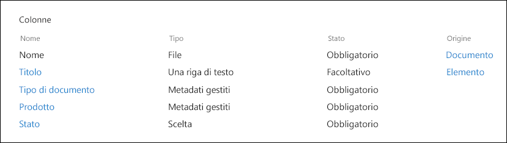

> [!NOTE]
> In una fase successiva di questo scenario, i criteri di conservazione useranno le proprietà **Tipo di documento** e **Stato** per classificare e applicare in modo automatico le etichette di conservazione.

È possibile avere varie tipologie di contenuti che rappresentano differenti tipi di documenti, ma ora si concentri l'attenzione sulla Documentazione del prodotto.

In questo scenario, si usa il Servizio metadati gestiti e l'Archivio termini per creare un set di termini per **Tipo di documento** e un altro set per **Nome del prodotto**. Per ogni set di termini, si crea un termine per ciascun valore. Nell'Archivio termini per la propria organizzazione di SharePoint, apparirà in modo simile a questo:

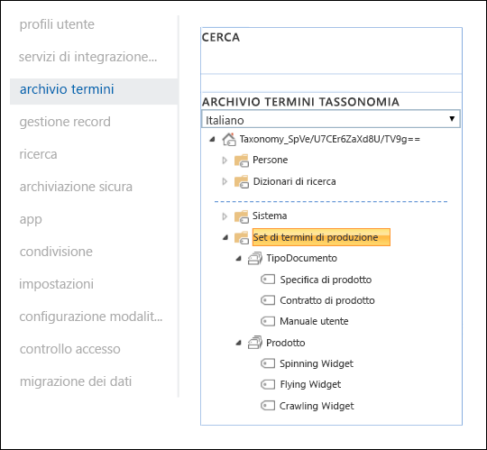

Le tipologie di contenuto possono essere create e pubblicate con l'[Hub tipo di contenuto](https://support.office.com/article/manage-content-type-publishing-06f39ac0-5576-4b68-abbc-82b68334889b). Un tipo di contenuto può essere creato e pubblicato anche con strumenti di provisioning del sito come l'apposito [framework PnP](https://docs.microsoft.com/sharepoint/dev/solution-guidance/pnp-provisioning-framework) o lo [schema JSON di progettazione del sito](https://docs.microsoft.com/sharepoint/dev/declarative-customization/site-design-json-schema#define-a-new-content-type).

Ciascun prodotto dispone di un sito di SharePoint Online dedicato, contenente una raccolta documenti con le corrette tipologie di contenuto abilitate. Tutti i documenti vengono archiviati in questa raccolta.

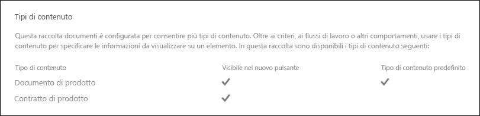

> [!NOTE]
> Invece di avere un sito di SharePoint Online per ogni prodotto, l'azienda manifatturiera di questo scenario potrebbe usare un Microsoft Teams per ogni prodotto, così da supportare la collaborazione con i membri del team, ad esempio con una chat permanente, e usare la scheda **File** per la gestione dei documenti all'interno del team. In questo articolo, il focus è diretto esclusivamente ai documenti, quindi si userà soltanto un sito.

Ecco visualizzata la raccolta di documenti per il prodotto Spinning Widget:

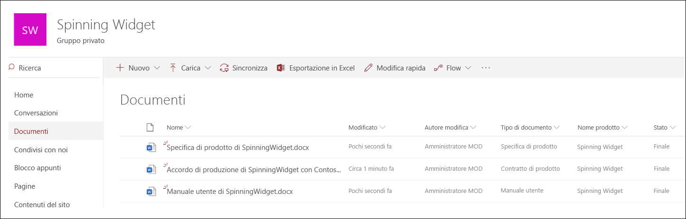

Ora che è stata definita l'architettura delle informazioni di base per la gestione dei documenti, si passerà all'esame della strategia di conservazione ed eliminazione dei documenti che usano i metadati e alla loro classificazione.

## <a name="retention-and-disposition"></a>Conservazione ed eliminazione

I criteri di conformità e governance dei dati dell'azienda manifatturiera stabiliscono le modalità di mantenimento ed eliminazione di tali dati. I documenti relativi al prodotto devono essere conservati per tutto il tempo della produzione e per un determinato periodo successivo. Il periodo in questione cambia a seconda che si tratti di specifiche di prodotto, contratti o manuali utenti. La tabella seguente indica i requisiti di conservazione ed eliminazione:

| **Tipo di documento**          | **Conservazione**                          | **Eliminazione**                              |
| -------------------------- | -------------------------------------- | -------------------------------------------- |
| Specifica di prodotto      | 5 anni dalla cessazione della produzione  | Eliminazione                                       |
| Contratto di prodotto          | 10 anni dalla cessazione della produzione | Revisione                                       |
| Manuale utente                | 5 anni dalla cessazione della produzione  | Eliminazione                                       |
| Tutti gli altri tipi di documenti | Non conservare attivamente altri documenti  | Eliminazione di documenti con più di 3 anni di esistenza<sup>\*</sup>  |
|||

> [!NOTE]
> <sup>\*</sup> Un documento si considera con più di 3 anni di esistenza se non ha subito modifiche durante gli ultimi 3 anni.

Tramite il Centro sicurezza e conformità, vengono create le seguenti etichette di conservazione:

  - Specifica di prodotto

  - Contratto di prodotto

  - Manuale utente

In questo articolo, si illustreranno le modalità di creazione e applicazione automatica dell'etichetta di conservazione Specifica di prodotto. Per implementare lo scenario completo, procedere alla creazione e applicazione automatica delle etichette di conservazione per le altre due tipologie di documento.

### <a name="settings-for-the-product-specification-retention-label"></a>Impostazioni per l'etichetta di conservazione Specifica di prodotto

Ecco il [piano di archiviazione](file-plan-manager.md) per l'etichetta di conservazione Specifica di prodotto: 

- **Nome:** Specifica di prodotto

- **Descrizione per gli amministratori:** etichetta relativa alle specifiche di prodotto; conservare fino a cinque anni dopo la cessazione della produzione, eliminazione automatica, conservazione basata su eventi, tipo di evento Cessazione del prodotto.

- **Descrizione per gli utenti:** mantenere per cinque anni dopo la cessazione della produzione.

- **Azione di conservazione:** mantenere ed eliminare.

- **Durata di conservazione:** cinque anni (1825 giorni).

- **Etichetta di record**: configurare l'etichetta di conservazione per classificare il contenuto come un [record](labels.md#using-retention-labels-for-records-management), i documenti classificati come record non possono essere modificati o eliminati dagli utenti.

- **Descrittori del piano di archiviazione:** (per semplificare lo scenario, non viene inserito alcun descrittore di archiviazione).

La seguente schermata mostra le impostazioni quando si crea l'[etichetta di conservazione](labels.md) Specifica di prodotto nel Centro sicurezza e conformità. È possibile creare la tipologia di evento **Cessazione del prodotto** al momento della creazione dell'etichetta di conservazione. Seguire i passaggi descritti di seguito.

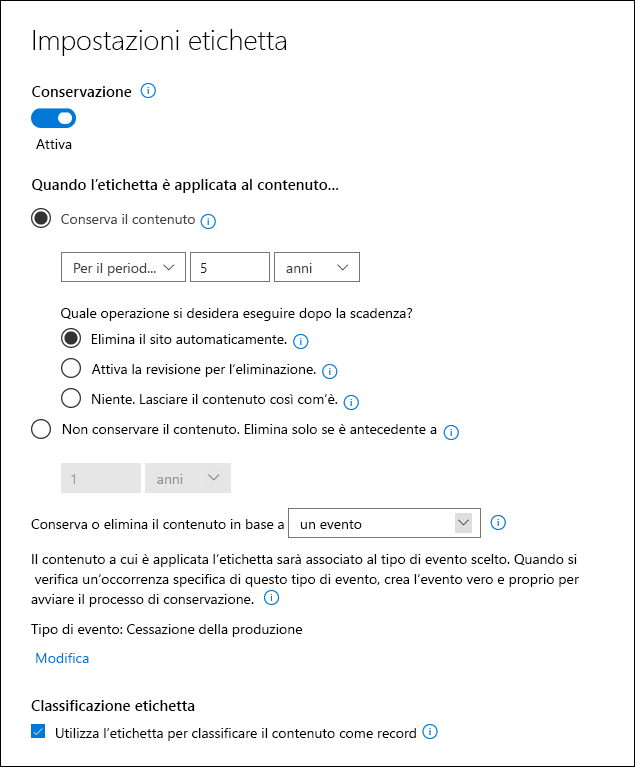

> [!NOTE]
> Per praticità e per evitare di dover attendere 5 anni per l'eliminazione automatica di un documento, impostare la durata di conservazione di 1 giorno se si intende ricreare questo scenario in ambiente di test.

### <a name="create-an-event-type-when-creating-a-retention-label"></a>Creare un tipo di evento quando si crea un'etichetta di conservazione

1. Nell'elenco a discesa **Conserva o elimina il contenuto in base a**, selezionare **un evento**.

2. Selezionare **Scegli un tipo di evento**.

   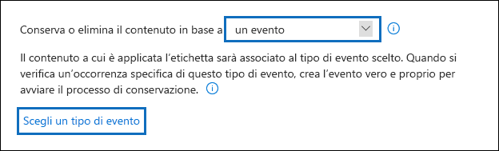

3. Nella pagina **Scegli un tipo di evento**, selezionare **È possibile creare nuovi tipi di evento qui**.

4. Creare un tipo di evento denominato **Cessazione del prodotto**, inserire una descrizione e selezionare **Fine** per procedere. 

5. Tornare alla pagina **Scegli il tipo di evento**, selezionare il tipo di evento appena creato **Cessazione del prodotto**, poi selezionare **Aggiungi**.

Ecco come appaiono le impostazioni per l'etichetta di conservazione Specifica di prodotto. Selezionare **Crea questa etichetta** per procedere alla sua creazione.

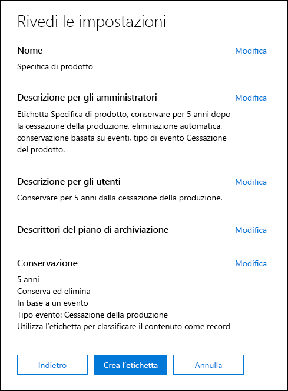

> [!TIP]
> Per informazioni più dettagliate sui vari passaggi, consultare [Creare un'etichetta il cui periodo di conservazione è basato su un evento](event-driven-retention.md#step-1-create-a-label-whose-retention-period-is-based-on-an-event).

Ora che l'etichetta di conservazione è stata creata, si passerà all'analisi dell'applicazione automatica dell'etichetta di conservazione al contenuto delle specifiche di prodotto.

## <a name="classifying-content-by-auto-applying-retention-labels"></a>Classificare il contenuto per l'applicazione automatica delle etichette di conservazione

Ora si procederà con l'[applicazione automatica](labels.md#applying-a-retention-label-automatically-based-on-conditions) delle etichette di conservazione create per questo scenario, usando Keyword Query Language (KQL). KQL è il linguaggio utilizzato per la creazione di query di ricerca. Con KQL è possibile compiere ricerche in base a parole chiave o proprietà gestite. Per ulteriori informazioni su KQL, consultare <https://docs.microsoft.com/sharepoint/dev/general-development/keyword-query-language-kql-syntax-reference>

A un livello elevato, si vuole dire a Office 365 che applichi l'etichetta di conservazione **Specifica di prodotto** a tutti i documenti che hanno **Finale** come **Stato** e **Specifica di prodotto** come **Tipo di documento**. Si ricordi che **Stato** e **Tipo di documento** sono le colonne del sito precedentemente definite per il tipo di contenuto Documentazione di prodotto nella sezione [Architettura delle informazioni](#information-architecture). Per compiere questa operazione, è necessario configurare lo schema di ricerca.

Quando SharePoint indicizza i contenuti, per ogni colonna del sito genera automaticamente delle proprietà sottoposte a ricerca per indicizzazione. In questo scenario, l'interesse si concentra sulle proprietà **Tipo di documento** e **Stato**. Affinché la ricerca crei delle proprietà sottoposte a ricerca per indicizzazione, all'interno della raccolta risulterà necessaria la presenza di documenti che usano il tipo di contenuto corretto e che le colonne del sito siano compilate.

Nell'interfaccia di amministrazione di SharePoint, è possibile aprire le configurazioni di ricerca e selezionare **Gestisci schema di ricerca** per visualizzare e configurare le proprietà sottoposte a ricerca per indicizzazione.

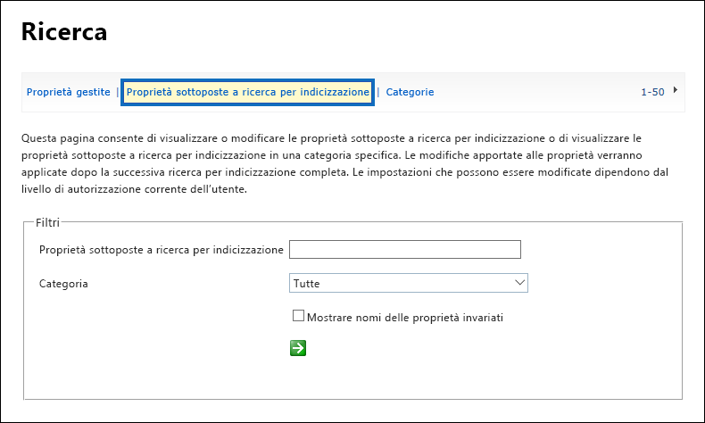

Se si digita **stato** nella casella **Proprietà sottoposte a ricerca per indicizzazione** e si seleziona la freccia verde, si visualizza un risultato simile a questo:

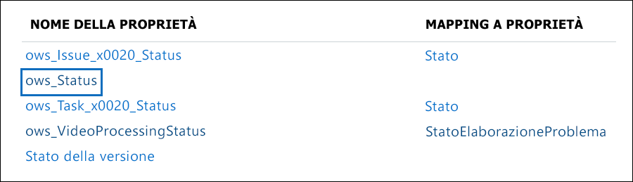

La proprietà **ows\_\_Status**, notare il doppio carattere di sottolineatura, è l'oggetto di interesse. Questa esegue il mapping alla proprietà **Stato** del tipo di contenuto Documento di produzione.

Ora, se si digita **ows\_doc** e si seleziona la freccia verde, si visualizza qualcosa di simile a questo:

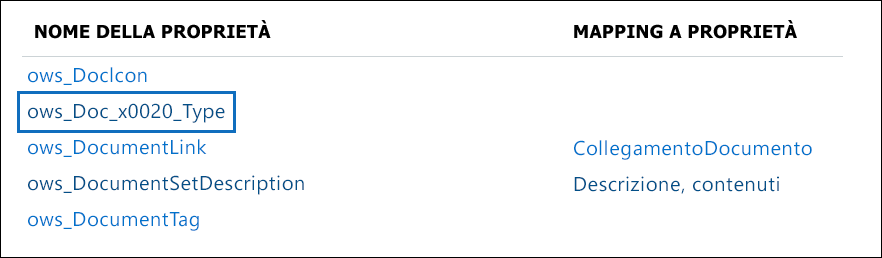

La proprietà **ows\_Doc\_x0020\_Type** è la seconda proprietà di interesse in questo scenario. Questa esegue il mapping alla proprietà **Tipo di documento** della tipologia di contenuto Documento di produzione.

> [!TIP]
> Per identificare il nome di una proprietà sottoposta a ricerca per indicizzazione per questo scenario, passare alla raccolta che contiene i documenti di produzione e accedere alle relative impostazioni. In **Colonne**, selezionare il nome della colonna, ad esempio, **Stato** o **Tipo di documento**, per aprire la pagina della colonna del sito. Il parametro **Campo** nell'URL della pagina contiene il nome del campo. Tale nome del campo, con prefisso "ows_", è il nome della proprietà sottoposta a ricerca per indicizzazione. Ad esempio, l'URL `https://tenantname.sharepoint.com/sites/SpinningWidget/_layouts/15/FldEdit.aspx?List=%7BC38C2F45-3BD6-4C3B-AA3B-EF5DF6B3D172%7D&Field=_Status` corrisponde alla proprietà sottoposta a ricerca per indicizzazione di **ows\_\_Status**.

Se le proprietà sottoposte a ricerca per indicizzazione non sono visualizzate nella sezione Gestisci schema di ricerca all'interno dell'interfaccia di amministrazione di SharePoint, è possibile che si sia verificata una delle seguenti situazioni:

- I documenti non sono stati indicizzati. È possibile forzare una reindicizzazione della raccolta andando su Impostazioni della raccolta documenti > Impostazioni avanzate.

- Se la raccolta documenti si trova in un sito moderno, verificare che l'amministratore di SharePoint sia anche un amministratore della raccolta siti.

Per ulteriori informazioni sulle proprietà sottoposte a ricerca per indicizzazione e sulle proprietà gestite, vedere [Proprietà gestite create automaticamente in SharePoint Server](https://docs.microsoft.com/sharepoint/technical-reference/automatically-created-managed-properties-in-sharepoint).

### <a name="mapping-crawled-properties-to-pre-defined-managed-properties"></a>Mapping delle proprietà sottoposte a ricerca per indicizzazione alle proprietà gestite predefinite

KQL non può fare uso delle proprietà sottoposte a ricerca per indicizzazione nelle query di ricerca. A tal fine, deve utilizzare una proprietà gestita. In un normale scenario di ricerca, si crea dunque una proprietà gestita e la si mappa alla proprietà sottoposta a ricerca per indicizzazione di cui si ha bisogno. Tuttavia, per l'applicazione automatica delle etichette di conservazione, è possibile solo specificare le proprietà gestite predefinite di KQL e non quelle personalizzate. Nel sistema esiste un set di proprietà gestite predefinite, già create, per le stringhe da RefinableString00 a RefinableString199 che possono essere usate. Per un elenco completo, vedere [Proprietà gestite non utilizzate predefinite](https://docs.microsoft.com/sharepoint/manage-search-schema#default-unused-managed-properties). Tali proprietà gestite predefinite vengono generalmente utilizzate per la definizione dei criteri di affinamento della ricerca.

Affinché la query KQL funzioni e applichi automaticamente l'etichetta di conservazione corretta al contenuto del documento di prodotto, è necessario eseguire il mapping delle proprietà sottoposte a ricerca per indicizzazione **ows\_Doc\_x0020\_Type** e **ows\_\_Status** a due proprietà gestite per affinamento ricerca. Nell'ambiente di test per questo scenario, si evita l'uso di **RefinableString00** e **RefinableString01**. Questa condotta è stata determinata osservando le **Proprietà gestite** nella sezione **Gestisci schema di ricerca** all'interno dell'interfaccia di amministrazione di SharePoint.

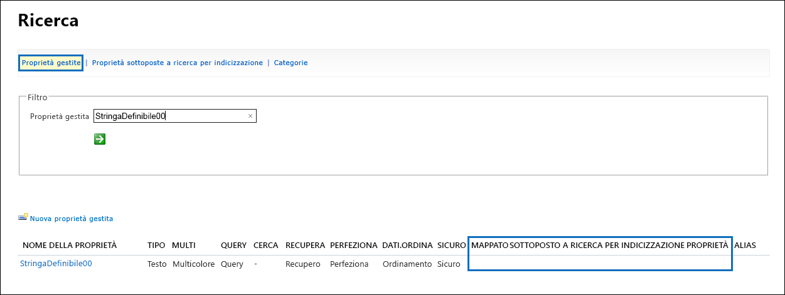

Notare che la colonna **Proprietà sottoposte a ricerca per indicizzazione** mostrata nella schermata precedente è vuota.

Per eseguire il mapping della proprietà sottoposta a ricerca per indicizzazione **ows\_Doc\_x0020\_Type**, eseguire le seguenti operazioni:

1. Nella casella del filtro **Proprietà gestita**, digitare **RefinableString00** e selezionare la freccia verde.

2. Nell'elenco dei risultati, selezionare il link **RefinableString00**, poi scorrere verso il basso fino alla sezione **Mapping alle proprietà sottoposte a ricerca per indicizzazione**.  

3. Selezionare **Aggiungi mapping** e poi digitare **ows\_Doc\_x0020\_Type** nella casella **Cerca un nome di proprietà sottoposta a ricerca per indicizzazione** all'interno della finestra **Selezione proprietà sottoposte a ricerca per indicizzazione**. Selezionare **Trova**.  

4. Nell'elenco dei risultati, selezionare **ows\_Doc\_x0020\_Type** e poi **OK**.

   Nella sezione **Proprietà sottoposte a ricerca per indicizzazione**, si dovrebbe visualizzare qualcosa di simile a quanto mostrato in questa schermata:

   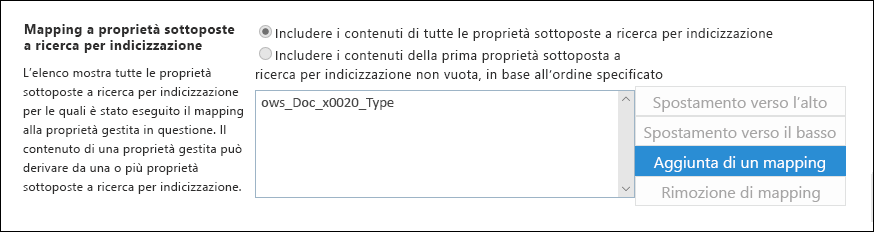

5. Per salvare il mapping, scorrere fino alla parte inferiore della pagina e selezionare **OK**.

Ripetere la medesima procedura per eseguire il mapping di RefinableString01 e ows\_\_Status.

A questo punto, si dovrebbe avere il mapping delle due proprietà gestite alle due proprietà sottoposte a ricerca per indicizzazione:

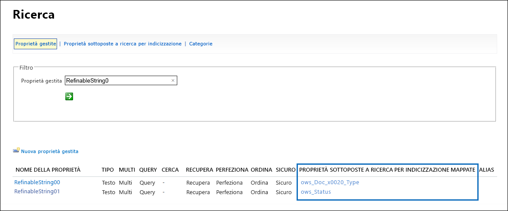

Verificare che sia tutto configurato correttamente eseguendo una Ricerca contenuti organizzazione. Aprire un browser e passare a https://yourtenant.sharepoint.com/search. Nella casella di ricerca, digitare **RefinableString00:"Specifica di prodotto"** e premere Invio. In questo modo, dovrebbero mostrarsi tutti i documenti che contengono tale Specifica di prodotto come **Tipo di documento**.

A questo punto, digitare **RefinableString00:"Specifica di prodotto" AND RefinableString01:Final** nella casella di ricerca, quindi premere Invio. In questo modo, dovrebbero mostrarsi tutti i documenti che contengono tale Specifica di prodotto come **Tipo di documento** e che hanno **Finale** come Stato.

### <a name="creating-the-auto-apply-label-policies"></a>Creare i criteri di applicazione automatica delle etichette

Dopo aver verificato il corretto funzionamento della query KQL, si potranno creare i criteri di etichetta che fanno uso di una query KQL per l'applicazione automatica dell'etichetta di conservazione della Specifica di prodotto ai documenti appropriati.

1. Nel [Centro sicurezza e conformità](https://protection.office.com), passare a **Classificazione** > **Etichette di conservazione** e poi selezionare **Applica automaticamente un'etichetta**. 

   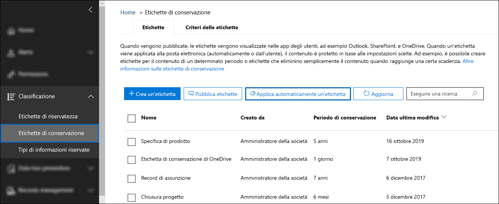

2. Nella pagina della procedura guidata **Scegliere un'etichetta da applicare automaticamente**, selezionare**Scegliere un'etichetta da applicare automaticamente**.

3. Nell'elenco delle etichette, selezionare **Specifica di prodotto**, selezionare **Aggiungi** e poi **Avanti**.

4. Selezionare **Applicare l'etichetta al contenuto che include parole o frasi specifiche o proprietà**, poi selezionare**Avanti**.

   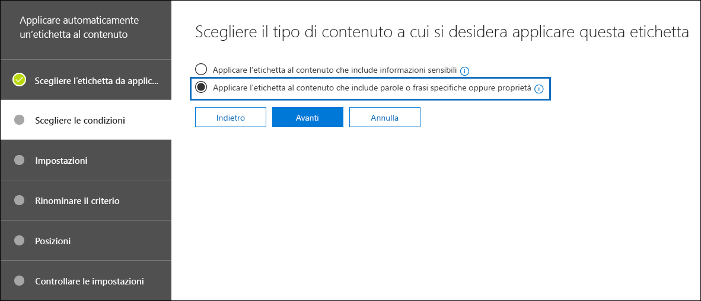

   Nel passaggio successivo, si dovrà fornire la stessa query di ricerca KQL testata nella sezione precedente. Come si ricorderà, tale query mostrerà come risultato tutti i documenti Specifica di prodotto che hanno Finale come Stato. L'uso della medesima query nei criteri di etichetta comporta l'applicazione automatica dell'etichetta di conservazione Specifica di prodotto a tutti i documenti che corrispondono a tale query di ricerca.

5. Nella casella **Editor di query con parole chiave**, digitare **RefinableString00:"Specifica di prodotto" AND RefinableString01:Final**, poi selezionare **Avanti**.

   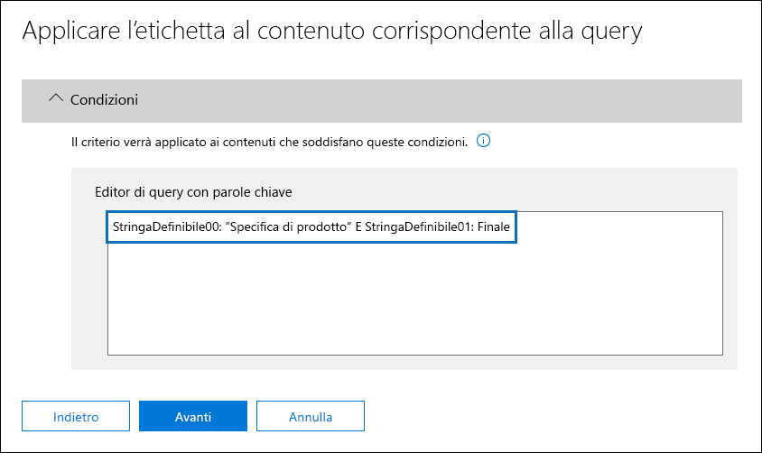

6. Inserire un nome per il criterio di etichetta, ad esempio, **Applicare automaticamente l'etichetta Specifica di prodotto**, e una descrizione facoltativa, poi selezionare **Avanti**. 

7. Nella pagina della procedura guidata **Scegli posizioni**, selezionare le posizioni dei contenuti a cui si desidera applicare il criterio. Per questo scenario, il criterio verrà applicato solo alle posizioni di SharePoint, poiché tutti i documenti di produzione sono archiviati solamente nelle raccolte documenti di SharePoint. Selezionare **Consenti la scelta di posizioni specifiche**, disattivare l'interruttore di stato per la posta elettronica di Exchange, gli account di OneDrive e i gruppi di Office 365, verificando che lo stato per i siti di SharePoint sia attivato. 

    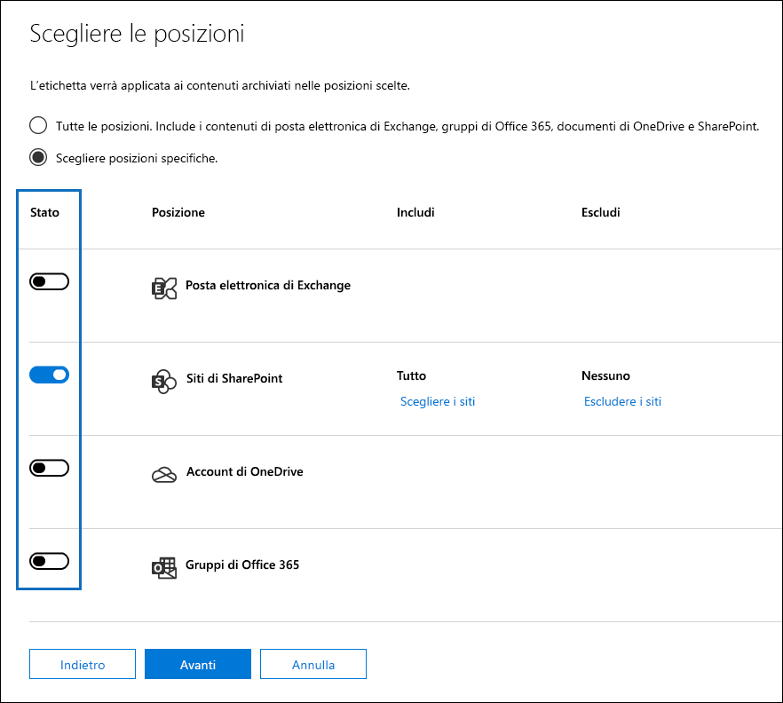

   > [!TIP]
   > Anziché applicare il criterio a tutti i siti di SharePoint, è possibile selezionare **Selezione siti** e aggiungere gli URL per i siti di SharePoint specifici.

8. Selezionare **Avanti** per mostrare la pagina **Controllare le impostazioni**. 

    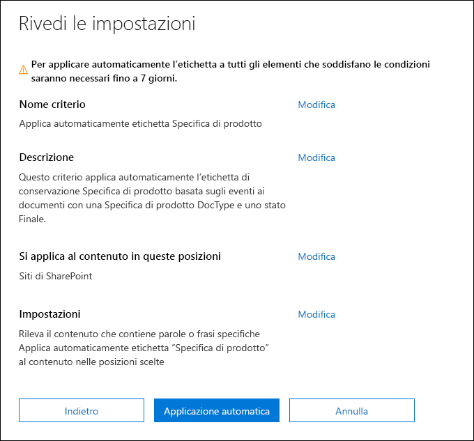

9. Per creare il criterio di etichetta, selezionare **Applica automaticamente**. Sono necessari fino a sette giorni per applicare automaticamente l'etichetta Specifica di prodotto a tutti i documenti che corrispondono alla query di ricerca KQL fornita.

### <a name="verifying-the-retention-label-was-automatically-applied"></a>Verificare l'applicazione automatica dell'etichetta di conservazione

Dopo sette giorni, usare la funzione [Esplora attività con etichette](view-label-activity-for-documents.md) nel Centro sicurezza e conformità per verificare che il criterio di etichetta creato in questo scenario sia stato applicato automaticamente alle etichette di conservazione per i documenti di prodotto. Nella schermata seguente, le etichette di conservazione sono state applicate anche a contratti di prodotto e manuali utente, nonostante in questo articolo non sia stata descritta la creazione di tali etichette di conservazione e dei criteri di etichetta.

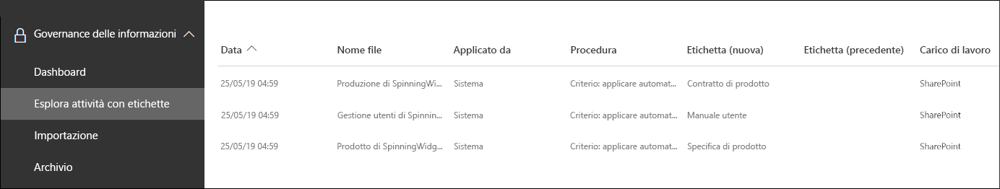

Un ulteriore controllo prevede la verifica delle proprietà del documento all'interno della Raccolta documenti. Nel riquadro delle informazioni, si può notare che l'etichetta di conservazione è applicata a un documento selezionato.

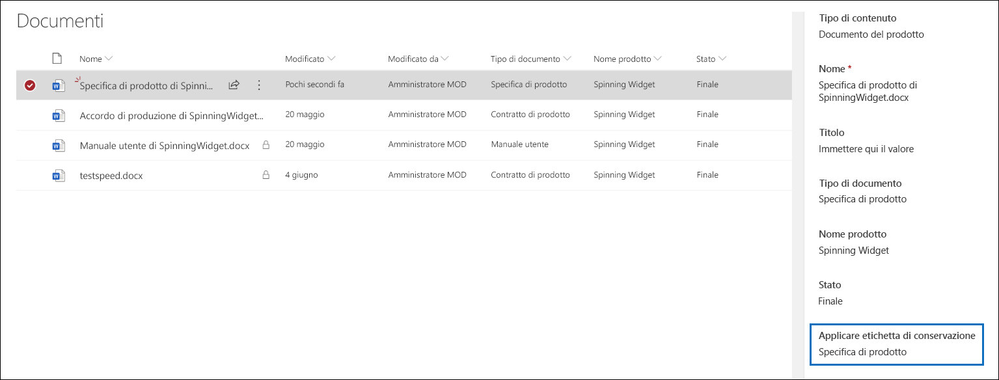

Siccome le etichette di conservazione sono state applicate automaticamente ai documenti, tali documenti risultano protetti da un'eventuale eliminazione poiché l'etichetta di conservazione è stata configurata in modo che i documenti venissero dichiarati come record. Come esempio di questa protezione, nella schermata seguente viene mostrato un messaggio di errore che appare quando si tenta di eliminare uno di questi documenti.

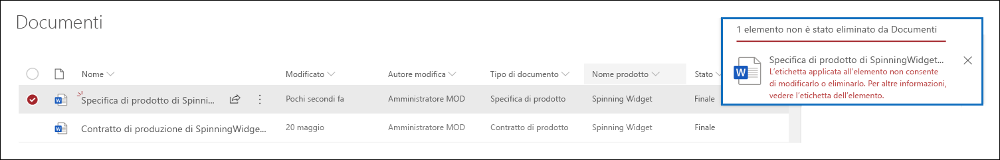

## <a name="generating-the-events-that-trigger-the-start-of-the-retention-period"></a>Generare gli eventi che attivano l'inizio del periodo di conservazione

Ora che le etichette di conservazione sono state applicate automaticamente con successo, il focus passa all'evento che indicherà la fine della produzione di un particolare prodotto. Al verificarsi di tale evento, verrà avviato il periodo di conservazione definito nelle etichette di conservazione applicate automaticamente ai documenti. Ad esempio, per i documenti delle specifiche di prodotto, il periodo di conservazione quinquennale inizia quando viene attivato l'evento "Fine della produzione".

È possibile creare manualmente l'evento all'interno del Centro sicurezza e conformità andando su **Gestione record** > **Eventi** e scegliendo il tipo di evento e impostando gli ID risorsa corretti e una data per l'evento. Per altre informazioni, vedere [Panoramica della conservazione basata su eventi](event-driven-retention.md).

Per questo scenario, l'evento verrà creato automaticamente, generandolo da un sistema di produzione esterno. In questo caso, il sistema che genera l'evento si compone di un semplice elenco di SharePoint che indica se un prodotto è in produzione e di un [Microsoft Flow](https://docs.microsoft.com/flow/getting-started) associato a tale elenco, che attiverà l'evento. In uno scenario reale, un qualsiasi sistema potrebbe generare l'evento, ad esempio un sistema HR o CRM. Microsoft Flow include numerose interazioni pronte all'uso e blocchi predefiniti per i carichi di lavoro di Office 365, ad esempio Exchange, SharePoint, Teams e Dynamics 365, e app di terze parti, come Twitter, Box, Salesforce e Workdays. Questo facilita l'integrazione di Flow con tali sistemi. Per ulteriori informazioni, vedere [Automatizzare la conservazione basata su eventi](automate-event-driven-retention.md).

La schermata seguente mostra l'elenco di SharePoint che verrà utilizzato per attivare l'evento: 

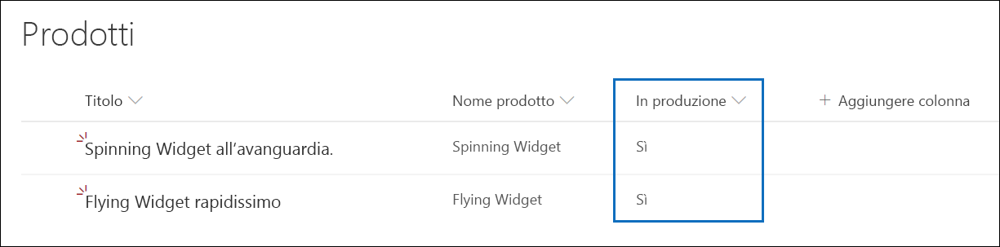

Attualmente, vi sono due prodotti in produzione come indicato dal valore **Sì** nella colonna **In produzione**. Se in questa colonna il valore corrispondente a un prodotto è impostato su **No**, il flusso associato all'elenco genererà automaticamente l'evento. Questo determinerà a sua volta l'inizio del periodo di conservazione per l'etichetta di conservazione che era stata applicata automaticamente ai documenti di prodotto corrispondenti.

Per questo scenario, si utilizza il seguente flusso per attivare l'evento:


Per creare questo flusso, iniziare da un connettore di SharePoint e selezionare il trigger **Quando viene creato o modificato un elemento**. Specificare l'indirizzo del sito e il nome dell'elenco, quindi aggiungere una condizione associata al valore **No** della colonna ** In produzione** (o al valore Falso nella scheda condizione). A questo punto, aggiungere un'azione basata sul modello HTTP predefinito. Per configurare l'azione HTTP, usare i valori della sezione seguente. È possibile copiare i valori delle proprietà URI e Corpo dalla sezione seguente e incollarli nel modello.

- **Metodo**: POST
- **URI**: https://ps.compliance.protection.outlook.com/psws/service.svc/ComplianceRetentionEvent
- **Intestazioni**: Chiave = Content-Type, Valore = application/atom+xml
- **Corpo**:

```HTML
<?xml version='1.0' encoding='utf-8' standalone='yes'>
<entry xmlns:d='https://schemas.microsoft.com/ado/2007/08/dataservices' xmlns:m='https://schemas.microsoft.com/ado/2007/08/dataservices/metadata' xmlns='https://www.w3.org/2005/Atom'>
<category scheme='https://schemas.microsoft.com/ado/2007/08/dataservices/scheme' term='Exchange.ComplianceRetentionEvent'>
<updated>9/9/2017 10:50:00 PM</updated>
<content type='application/xml'>
<m:properties>
<d:Name>Cessation Production @{triggerBody()?['Product_x0020_Name']?['Value']}</d:Name>
<d:EventType>Product Cessation&lt;</d:EventType>
<d:SharePointAssetIdQuery>ProductName:&quot;@{triggerBody()?['Product_x0020_Name']?['Value']}<d:SharePointAssetIdQuery>
<d:EventDateTime>@{formatDateTime(utcNow(),'yyyy-MM-dd')}</d:EventDateTime>
</m:properties>
</content&gt>
</entry>
```

La sezione seguente descrive i parametri interni alla proprietà *Corpo* relativi all'azione da configurarsi in modo specifico per questo scenario.

- **Name**: questo parametro specifica il nome dell'evento che verrà creato all'interno del Centro sicurezza e conformità. Per questo scenario, il nome è "Cessazione produzione xxx", dove xxx è il valore della proprietà gestita ProductName precedentemente creata.
- **EventType**: il valore di questo parametro corrisponde al tipo di evento a cui si applicherà l'evento creato. Questo tipo di evento è stato definito al momento della creazione dell'etichetta di conservazione. Per questo scenario, il tipo di evento è "Cessazione del prodotto".
- **SharePointAssetIdQuery**: questo parametro definisce l'ID risorsa per l'evento. La conservazione basata su eventi richiede che ogni documento abbia un identificatore univoco. È possibile usare gli ID risorsa per identificare i documenti a cui si applica un particolare evento oppure, come nel caso di questo scenario, una colonna di metadati, il Nome del prodotto. Per eseguire questa operazione, è necessario creare una nuova proprietà gestita denominata ProductName da poter usare nella query KQL, oppure si può utilizzare RefinableString00 anziché creare una nuova proprietà gestita. È necessario anche eseguire il mapping di questa nuova proprietà gestita alla proprietà sottoposta a ricerca per indicizzazione ows_Product_x0020_Name. Ecco una schermata di tale proprietà gestita.

    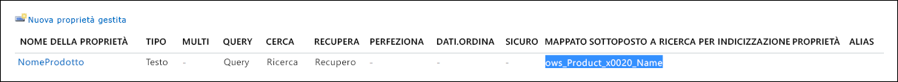

- **EventDateTime**: questo parametro definisce la data in cui si verifica l'evento. Usare il formato di data corrente: *formatDateTime(utcNow(),'yyyy-MM-dd'*)

### <a name="putting-it-all-together"></a>Riassumendo

Ora che l'etichetta di conservazione è stata creata e applicata automaticamente e che il flusso è stato configurato e generato, ecco cosa succede quando il valore della colonna **In produzione** per il prodotto Spinning Widget all'interno dell'Elenco prodotti viene cambiata da **Sì** a **No**. Il flusso viene attivato e genera l'evento. Per vedere tale evento nel Centro sicurezza e conformità, passare a **Gestione record** > **Eventi**.

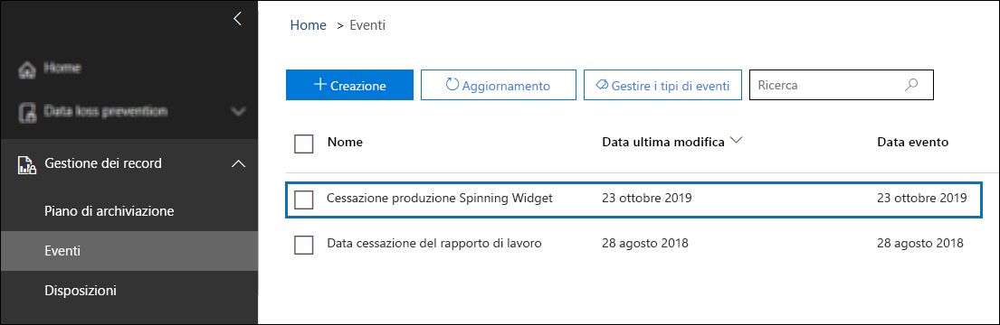

Selezionare l'evento per visualizzarne i dettagli nella pagina a comparsa. Notare che anche se l'evento è stato creato, i dettagli relativi al suo stato indicano che non è stato elaborato alcun sito o documento di SharePoint.

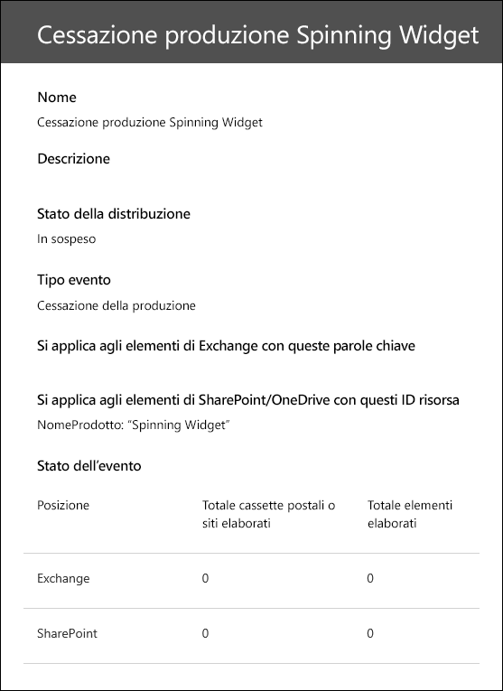

Dopo un certo periodo di tempo, la sezione di stato dell'evento indicherà l'elaborazione di un sito o documento di SharePoint.  

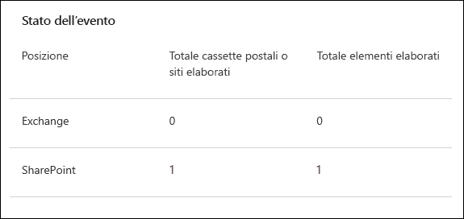
 
Questo significa che è stato avviato il periodo di conservazione per l'etichetta applicata al documento del prodotto Spinning Widget, sulla base della data dell'evento Cessazione produzione Spinning Widget. Ipotizzando che lo scenario sia stato implementato nell'ambiente di test configurando un periodo di conservazione pari a un giorno, è possibile passare alla raccolta dei propri documenti di prodotto alcuni giorni dopo la creazione dell'evento e verificare l'effettiva eliminazione di tale documento, in seguito al processo di eliminazione in SharePoint.

### <a name="more-about-asset-ids"></a>Altre informazioni sugli ID risorsa

Come descritto nella [Panoramica della conservazione basata su eventi](event-driven-retention.md), è importante comprendere la relazione tra le tipologie di evento, le etichette, gli eventi e gli ID risorsa. L'ID risorsa è semplicemente un'ulteriore proprietà di un documento in SharePoint e OneDrive. Consente di identificare con maggiore dettaglio quei documenti per cui l'evento darà avvio al periodo di conservazione. Come impostazione predefinita, SharePoint dispone di una proprietà ID risorsa utilizzabile per la conservazione basata su eventi:

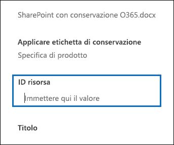

Come mostrato nella schermata seguente, la proprietà gestita ID risorsa è denominata **ComplianceAssetId**.

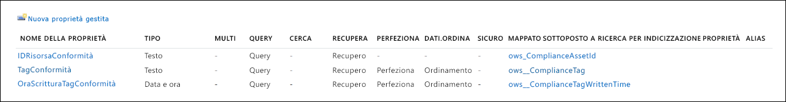

Invece di usare la proprietà ID risorsa predefinita, è possibile utilizzare qualsiasi altra proprietà, come mostrato in questo scenario. Tuttavia, è importante tenere presente che se per un evento non si specificano le parole chiave o un ID risorsa, l'evento attiverà il periodo di conservazione per ogni contenuto avente un'etichetta corrispondente a quel tipo di evento.

### <a name="using-advanced-search-in-sharepoint"></a>Usare la ricerca avanzata in SharePoint

Nella schermata precedente, si può vedere anche che esiste un'altra proprietà gestita relativa alle etichette di conservazione denominata **ComplianceTag** e che è mappata a una proprietà sottoposta a ricerca per indicizzazione. Anche la proprietà gestita **ComplianceAssetId** è mappata a una proprietà sottoposta a ricerca per indicizzazione. Questo significa che è possibile usare queste proprietà gestite nella ricerca avanzata per recuperare tutti i documenti contrassegnati con un'etichetta di conservazione.

## <a name="summary"></a>Riepilogo

Questo articolo ha illustrato uno scenario di gestione dei documenti in cui è stata applicata automaticamente un'etichetta di conservazione basata su una colonna del sito in SharePoint. In seguito, si è fatto ricorso alla conservazione basata su eventi e a Microsoft Flow per attivare in modo automatico l'inizio del periodo di conservazione in base a un evento esterno.

## <a name="credits"></a>Riconoscimenti

Questo scenario è stato realizzato da: 

Frederic Lapierre<br/>Principal Consultant presso Servizi Microsoft
