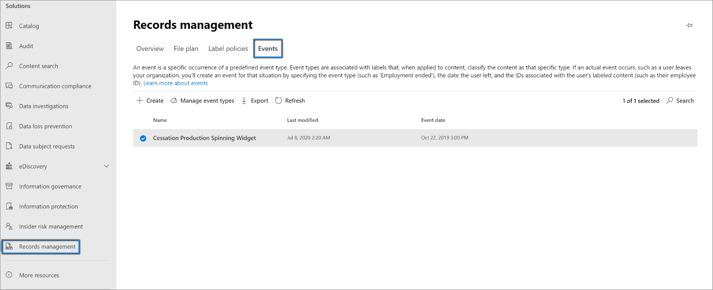

# <a name="use-retention-labels-to-manage-the-lifecycle-of-documents-stored-in-sharepoint"></a><span data-ttu-id="b6088-103">Usare le etichette di conservazione per gestire il ciclo di vita dei documenti archiviati in SharePoint</span><span class="sxs-lookup"><span data-stu-id="b6088-103">Use retention labels to manage the lifecycle of documents stored in SharePoint</span></span>

><span data-ttu-id="b6088-104">*[Indicazioni per l'assegnazione di licenze di Microsoft 365 per sicurezza e conformità](https://aka.ms/ComplianceSD).*</span><span class="sxs-lookup"><span data-stu-id="b6088-104">*[Microsoft 365 licensing guidance for security & compliance](https://aka.ms/ComplianceSD).*</span></span>

<span data-ttu-id="b6088-105">Questo articolo descrive come gestire il ciclo di vita dei documenti archiviati in SharePoint attraverso l’utilizzo delle etichette di conservazione applicate in automatico e la conservazione basata su eventi.</span><span class="sxs-lookup"><span data-stu-id="b6088-105">This article describes how you can manage the lifecycle of documents that are stored in SharePoint by using automatically applied retention labels and event-based retention.</span></span>

<span data-ttu-id="b6088-106">La funzionalità di applicazione automatica utilizza i metadati di SharePoint per la classificazione dei documenti.</span><span class="sxs-lookup"><span data-stu-id="b6088-106">The auto-apply functionality uses SharePoint metadata for document classification.</span></span> <span data-ttu-id="b6088-107">L’esempio esposto in questo articolo si riferisce ai documenti relativi al prodotto, ma gli stessi concetti risultano validi anche per altri scenari.</span><span class="sxs-lookup"><span data-stu-id="b6088-107">The example in this article is for product-related documents, but the same concepts can be used for other scenarios.</span></span> <span data-ttu-id="b6088-108">Per esempio, nel settore petrolifero e del gas naturale, è possibile utilizzarlo per gestire il ciclo di vita dei documenti relativi alle risorse fisiche come le piattaforme petrolifere e le registrazioni di log geofisici oppure le licenze di produzione.</span><span class="sxs-lookup"><span data-stu-id="b6088-108">For example, in the oil and gas industry, you could use it to manage the lifecycle of documents about physical assets such as oil platforms, well logs, or production licenses.</span></span> <span data-ttu-id="b6088-109">Nel settore dei servizi finanziari, è possibile gestire i documenti relativi a conti bancari, mutui o contratti di assicurazione.</span><span class="sxs-lookup"><span data-stu-id="b6088-109">In the financial services industry, you could manage bank account, mortgage, or insurance contract documents.</span></span> <span data-ttu-id="b6088-110">Nel settore pubblico, è possibile gestire i permessi di costruzione o i moduli fiscali.</span><span class="sxs-lookup"><span data-stu-id="b6088-110">In the public sector, you could manage construction permits or tax forms.</span></span>

<span data-ttu-id="b6088-111">In questo articolo, l'analisi partirà dall'architettura delle informazioni e dalla definizione delle etichette di conservazione.</span><span class="sxs-lookup"><span data-stu-id="b6088-111">In this article, we'll look at the information architecture and definition of the retention labels.</span></span> <span data-ttu-id="b6088-112">Poi classificheremo i documenti con l’applicazione automatica delle etichette.</span><span class="sxs-lookup"><span data-stu-id="b6088-112">Then we'll classify documents by auto-applying the labels.</span></span> <span data-ttu-id="b6088-113">E infine genereremo gli eventi che avviano il periodo di conservazione.</span><span class="sxs-lookup"><span data-stu-id="b6088-113">And finally we'll generate the events that initiate the retention period.</span></span>

## <a name="information-architecture"></a><span data-ttu-id="b6088-114">Architettura delle informazioni</span><span class="sxs-lookup"><span data-stu-id="b6088-114">Information architecture</span></span>

<span data-ttu-id="b6088-115">Il nostro scenario corrisponde a quello di un'azienda manifatturiera che usa SharePoint per archiviare tutti i documenti relativi ai prodotti che sviluppa.</span><span class="sxs-lookup"><span data-stu-id="b6088-115">Our scenario is a manufacturing company that uses SharePoint to store all the documents about the products that the company develops.</span></span> <span data-ttu-id="b6088-116">Tali documenti includono specifiche di prodotto, contratti con fornitori e manuali utenti.</span><span class="sxs-lookup"><span data-stu-id="b6088-116">These documents include product specifications, agreements with suppliers, and user manuals.</span></span> <span data-ttu-id="b6088-117">Quando un documento viene archiviato in SharePoint mediante i criteri di gestione dei contenuti aziendali, si definiscono i metadati specifici del documento, che vengono utilizzati per classificarlo.</span><span class="sxs-lookup"><span data-stu-id="b6088-117">When these documents are stored in SharePoint through Enterprise Content Management policies, document metadata is defined, which is used to classify them.</span></span> <span data-ttu-id="b6088-118">In termini di metadati, ogni documento ha le seguenti proprietà:</span><span class="sxs-lookup"><span data-stu-id="b6088-118">Each document has the following metadata properties:</span></span>

- <span data-ttu-id="b6088-119">**Tipo di documento** (come specifica di prodotto, contratto o manuale utente)</span><span class="sxs-lookup"><span data-stu-id="b6088-119">**Doc Type** (such as product specification, agreement, or user manual)</span></span>

- <span data-ttu-id="b6088-120">**Nome del prodotto**</span><span class="sxs-lookup"><span data-stu-id="b6088-120">**Product Name**</span></span>

- <span data-ttu-id="b6088-121">**Stato** (bozza o finale)</span><span class="sxs-lookup"><span data-stu-id="b6088-121">**Status** (draft or final)</span></span>

<span data-ttu-id="b6088-122">Per tutti i documenti, i metadati formano una tipologia di contenuto di base denominata *Documento di produzione*.</span><span class="sxs-lookup"><span data-stu-id="b6088-122">This metadata forms a base content type called *Production Document* for all the documents.</span></span>


> [!NOTE]
> <span data-ttu-id="b6088-124">In una fase successiva di questo scenario, i criteri di conservazione useranno le proprietà **Tipo di documento** e **Stato** per classificare e applicare in modo automatico le etichette di conservazione.</span><span class="sxs-lookup"><span data-stu-id="b6088-124">The **Doc Type** and **Status** properties are used by retention policies later in this scenario to classify and auto-apply retention labels.</span></span>

<span data-ttu-id="b6088-125">È possibile avere varie tipologie di contenuti che rappresentano differenti tipi di documenti, ma ora si concentri l'attenzione sulla documentazione del prodotto.</span><span class="sxs-lookup"><span data-stu-id="b6088-125">We might have several content types that represent different types of documents, but let's focus on the product documentation.</span></span>

<span data-ttu-id="b6088-126">In questo scenario, si usa il Servizio metadati gestiti e l'Archivio termini per creare un set di termini per *Tipo di documento* e un altro set per *Nome del prodotto*.</span><span class="sxs-lookup"><span data-stu-id="b6088-126">In this scenario, we use the Managed Metadata service and the Term Store to create a term set for *Doc Type* and another one for *Product Name*.</span></span> <span data-ttu-id="b6088-127">Per ogni set di termini, si crea un termine per ciascun valore.</span><span class="sxs-lookup"><span data-stu-id="b6088-127">For each term set, we create a term for each value.</span></span> <span data-ttu-id="b6088-128">Nell'Archivio termini per la propria organizzazione di SharePoint, apparirà in modo simile a questo:</span><span class="sxs-lookup"><span data-stu-id="b6088-128">It would look like something like this in Term Store for your SharePoint organization:</span></span>


<span data-ttu-id="b6088-130">Le *tipologie di contenuto* possono essere create e pubblicate con l'[Hub tipo di contenuto](https://support.office.com/article/manage-content-type-publishing-06f39ac0-5576-4b68-abbc-82b68334889b).</span><span class="sxs-lookup"><span data-stu-id="b6088-130">*Content Type* can be created and published by using the [Content Type Hub](https://support.office.com/article/manage-content-type-publishing-06f39ac0-5576-4b68-abbc-82b68334889b).</span></span> <span data-ttu-id="b6088-131">È anche possibile creare e pubblicare un tipo di contenuto utilizzando strumenti di provisioning del sito come l'apposito [framework PnP](https://docs.microsoft.com/sharepoint/dev/solution-guidance/pnp-provisioning-framework) o lo [schema JSON di progettazione del sito](https://docs.microsoft.com/sharepoint/dev/declarative-customization/site-design-json-schema#define-a-new-content-type).</span><span class="sxs-lookup"><span data-stu-id="b6088-131">You can also create and publish a content type by using site provisioning tools, such as the [PnP provisioning framework](https://docs.microsoft.com/sharepoint/dev/solution-guidance/pnp-provisioning-framework) or [site design JSON schema](https://docs.microsoft.com/sharepoint/dev/declarative-customization/site-design-json-schema#define-a-new-content-type).</span></span>

<span data-ttu-id="b6088-132">Ciascun prodotto dispone di un sito di SharePoint dedicato, contenente una raccolta documenti con le corrette tipologie di contenuto abilitate.</span><span class="sxs-lookup"><span data-stu-id="b6088-132">Each product has a dedicated SharePoint site that contains one document library that has the right content types enabled.</span></span> <span data-ttu-id="b6088-133">Tutti i documenti vengono archiviati in questa raccolta.</span><span class="sxs-lookup"><span data-stu-id="b6088-133">All documents are stored in this document library.</span></span>


> [!NOTE]
> <span data-ttu-id="b6088-135">Invece di avere un sito di SharePoint per ogni prodotto, l'azienda manifatturiera di questo scenario potrebbe usare un Microsoft Teams per ogni prodotto per supportare la collaborazione tra i membri del team, ad esempio con una chat permanente, e usare la scheda **File** per la gestione dei documenti all'interno di Teams.</span><span class="sxs-lookup"><span data-stu-id="b6088-135">Instead of having a SharePoint site per product, the manufacturing company in this scenario could use a Microsoft Team per product to support collaboration among members of the team, such as through persistent chat, and use the **Files** tab in Teams for document management.</span></span> <span data-ttu-id="b6088-136">In questo articolo, il focus è diretto esclusivamente ai documenti, quindi si userà soltanto un sito.</span><span class="sxs-lookup"><span data-stu-id="b6088-136">In this article we only focus on documents, so, we'll only use a site.</span></span>

<span data-ttu-id="b6088-137">Ecco visualizzata la raccolta di documenti per il prodotto Spinning Widget:</span><span class="sxs-lookup"><span data-stu-id="b6088-137">Here's a view of the document library for the Spinning Widget product:</span></span>


<span data-ttu-id="b6088-139">Ora che è stata definita l'architettura delle informazioni di base per la gestione dei documenti, si passerà all'esame della strategia di conservazione ed eliminazione dei documenti che usano i metadati e alla loro classificazione.</span><span class="sxs-lookup"><span data-stu-id="b6088-139">Now that we have the basic information architecture in place for document management, let's look at the retention and disposal strategy for the documents that use the metadata and how we classify those documents.</span></span>

## <a name="retention-and-disposition"></a><span data-ttu-id="b6088-140">Conservazione ed eliminazione</span><span class="sxs-lookup"><span data-stu-id="b6088-140">Retention and disposition</span></span>

<span data-ttu-id="b6088-141">I criteri di conformità e governance dei dati dell'azienda manifatturiera stabiliscono le modalità di mantenimento ed eliminazione di tali dati.</span><span class="sxs-lookup"><span data-stu-id="b6088-141">The manufacturing company's compliance and data governance policies dictate how data is preserved and disposed of.</span></span> <span data-ttu-id="b6088-142">I documenti relativi al prodotto devono essere conservati per tutto il tempo della produzione e per un determinato periodo aggiuntivo.</span><span class="sxs-lookup"><span data-stu-id="b6088-142">Product-related documents must be kept for as long as the product is manufactured and for a certain additional period.</span></span> <span data-ttu-id="b6088-143">Il periodo aggiuntivo in questione cambia a seconda che si tratti di specifiche di prodotto, contratti o manuali utenti.</span><span class="sxs-lookup"><span data-stu-id="b6088-143">The additional period differs for product specifications, agreements, and user manuals.</span></span> <span data-ttu-id="b6088-144">La tabella seguente indica i requisiti di conservazione ed eliminazione:</span><span class="sxs-lookup"><span data-stu-id="b6088-144">The following table indicates the retention and disposition requirements:</span></span>

| <span data-ttu-id="b6088-145">**Tipo di documento**</span><span class="sxs-lookup"><span data-stu-id="b6088-145">**Document type**</span></span>          | <span data-ttu-id="b6088-146">**Conservazione**</span><span class="sxs-lookup"><span data-stu-id="b6088-146">**Retention**</span></span>                          | <span data-ttu-id="b6088-147">**Eliminazione**</span><span class="sxs-lookup"><span data-stu-id="b6088-147">**Disposition**</span></span>                              |
| -------------------------- | -------------------------------------- | -------------------------------------------- |
| <span data-ttu-id="b6088-148">Specifiche del prodotto</span><span class="sxs-lookup"><span data-stu-id="b6088-148">Product specifications</span></span>      | <span data-ttu-id="b6088-149">5 anni dopo l'interruzione della produzione</span><span class="sxs-lookup"><span data-stu-id="b6088-149">5 years after production stops</span></span>  | <span data-ttu-id="b6088-150">Elimina</span><span class="sxs-lookup"><span data-stu-id="b6088-150">Delete</span></span>                                       |
| <span data-ttu-id="b6088-151">Contratti di prodotto</span><span class="sxs-lookup"><span data-stu-id="b6088-151">Product agreements</span></span>          | <span data-ttu-id="b6088-152">10 anni dopo l'interruzione della produzione</span><span class="sxs-lookup"><span data-stu-id="b6088-152">10 years after production stops</span></span> | <span data-ttu-id="b6088-153">Revisione</span><span class="sxs-lookup"><span data-stu-id="b6088-153">Review</span></span>                                       |
| <span data-ttu-id="b6088-154">Manuali per gli utenti</span><span class="sxs-lookup"><span data-stu-id="b6088-154">User manuals</span></span>                | <span data-ttu-id="b6088-155">5 anni dopo l'interruzione della produzione</span><span class="sxs-lookup"><span data-stu-id="b6088-155">5 years after production stops</span></span>  | <span data-ttu-id="b6088-156">Elimina</span><span class="sxs-lookup"><span data-stu-id="b6088-156">Delete</span></span>                                       |
| <span data-ttu-id="b6088-157">Tutti gli altri tipi di documenti</span><span class="sxs-lookup"><span data-stu-id="b6088-157">All other types of documents</span></span> | <span data-ttu-id="b6088-158">Non conservare attivamente</span><span class="sxs-lookup"><span data-stu-id="b6088-158">Don't actively retain</span></span>  | <span data-ttu-id="b6088-159">Eliminare i documenti vecchi di 3 anni</span><span class="sxs-lookup"><span data-stu-id="b6088-159">Delete when document is older than 3 years</span></span> <br /><br /> <span data-ttu-id="b6088-160">Un documento si considera vecchio di 3 anni se non ha subito modifiche durante gli ultimi 3 anni.</span><span class="sxs-lookup"><span data-stu-id="b6088-160">A document is considered older than 3 years if it hasn't been modified within the last 3 years.</span></span> |
|||

<span data-ttu-id="b6088-161">Utilizziamo il Centro conformità Microsoft 365 per creare le seguenti [etichette di conservazione](retention.md#retention-labels):</span><span class="sxs-lookup"><span data-stu-id="b6088-161">We use the Microsoft 365 compliance center to create the following [retention labels](retention.md#retention-labels):</span></span>

  - <span data-ttu-id="b6088-162">Specifica di prodotto</span><span class="sxs-lookup"><span data-stu-id="b6088-162">Product Specification</span></span>

  - <span data-ttu-id="b6088-163">Contratto di prodotto</span><span class="sxs-lookup"><span data-stu-id="b6088-163">Product Agreement</span></span>

  - <span data-ttu-id="b6088-164">Manuale utente</span><span class="sxs-lookup"><span data-stu-id="b6088-164">User Manual</span></span>

<span data-ttu-id="b6088-165">In questo articolo, si illustreranno le modalità di creazione e applicazione automatica dell'etichetta di conservazione Specifica di prodotto.</span><span class="sxs-lookup"><span data-stu-id="b6088-165">In this article, we only show how to create and auto-apply the Product Specification retention label.</span></span> <span data-ttu-id="b6088-166">Per implementare lo scenario completo, procedere anche alla creazione e applicazione automatica delle etichette di conservazione per le altre due tipologie di documento.</span><span class="sxs-lookup"><span data-stu-id="b6088-166">To implement the complete scenario, you would also create and auto-apply retention labels for the other two document types.</span></span>

### <a name="settings-for-the-product-specification-retention-label"></a><span data-ttu-id="b6088-167">Impostazioni per l'etichetta di conservazione Specifica di prodotto</span><span class="sxs-lookup"><span data-stu-id="b6088-167">Settings for the Product Specification retention label</span></span>

<span data-ttu-id="b6088-168">Ecco il [piano di archiviazione](file-plan-manager.md) per l'etichetta di conservazione Specifica di prodotto:</span><span class="sxs-lookup"><span data-stu-id="b6088-168">Here's the [file plan](file-plan-manager.md) for the Product Specification retention label:</span></span>

- <span data-ttu-id="b6088-169">**Nome:** Specifica di prodotto</span><span class="sxs-lookup"><span data-stu-id="b6088-169">**Name:** Product Specification</span></span>

- <span data-ttu-id="b6088-170">**Descrizione per gli amministratori:** conservare fino a 5 anni dopo l’arresto della produzione; eliminazione automatica; conservazione basata su eventi, con tipo di evento *Cessazione del prodotto*.</span><span class="sxs-lookup"><span data-stu-id="b6088-170">**Description for admins:** Retain for 5 years after production stops, auto delete, event-based retention, event type is *Product Cessation*.</span></span>

- <span data-ttu-id="b6088-171">**Descrizione per gli utenti:** mantenere per 5 anni dopo l’arresto della produzione.</span><span class="sxs-lookup"><span data-stu-id="b6088-171">**Description for users:** Retain for 5 years after production stops.</span></span>

- <span data-ttu-id="b6088-172">**Azione di conservazione:** conservare ed eliminare.</span><span class="sxs-lookup"><span data-stu-id="b6088-172">**Retention action:** Retain and delete.</span></span>

- <span data-ttu-id="b6088-173">**Durata di conservazione:** 5 anni (1.825 giorni).</span><span class="sxs-lookup"><span data-stu-id="b6088-173">**Retention duration:** 5 years (1,825 days).</span></span>

- <span data-ttu-id="b6088-174">**Etichetta record**: configurare l’etichetta di conservazione per classificare un contenuto come [*record*](records.md).</span><span class="sxs-lookup"><span data-stu-id="b6088-174">**Record label**: Configure the retention label to classify content as a [*record*](records.md).</span></span> <span data-ttu-id="b6088-175">(I documenti classificati come *record* non possono essere modificati o eliminati dagli utenti.)</span><span class="sxs-lookup"><span data-stu-id="b6088-175">(Documents that are classified as a *record* can't be modified or deleted by users.)</span></span>

- <span data-ttu-id="b6088-176">**Descrittori del piano di archiviazione:** (per semplificare lo scenario, non viene inserito alcun descrittore di archiviazione).</span><span class="sxs-lookup"><span data-stu-id="b6088-176">**File plan descriptors:** (for simplifying the scenario, no file descriptors are provided)</span></span>

<span data-ttu-id="b6088-177">La schermata seguente mostra le impostazioni quando si crea l'etichetta di conservazione Specifica di prodotto nel Centro conformità Microsoft 365.</span><span class="sxs-lookup"><span data-stu-id="b6088-177">The following screenshot shows the settings when you create the Product Specification retention label in the Microsoft 365 compliance center.</span></span> <span data-ttu-id="b6088-178">È possibile creare la tipologia di evento *Cessazione del prodotto* al momento della creazione dell'etichetta di conservazione.</span><span class="sxs-lookup"><span data-stu-id="b6088-178">You can create the *Product Cessation* event type when you create the retention label.</span></span> <span data-ttu-id="b6088-179">Vedere la procedura nella sezione seguente.</span><span class="sxs-lookup"><span data-stu-id="b6088-179">See the procedure in the following section.</span></span>


> [!NOTE]
> <span data-ttu-id="b6088-181">Per evitare un'attesa di 5 anni per l'eliminazione dei documenti, impostare la durata di conservazione su ***1 giorno*** se si ricrea questo scenario in un ambiente di test.</span><span class="sxs-lookup"><span data-stu-id="b6088-181">To avoid a 5-year wait for document deletion, set the retention duration to ***1 day*** if you're recreating this scenario in a test environment.</span></span>

### <a name="create-an-event-type-when-you-create-a-retention-label"></a><span data-ttu-id="b6088-182">Creare un tipo di evento quando si crea un'etichetta di conservazione</span><span class="sxs-lookup"><span data-stu-id="b6088-182">Create an event type when you create a retention label</span></span>

1. <span data-ttu-id="b6088-183">Dall'elenco a discesa **Conserva o elimina il contenuto in base a**, selezionare **un evento**.</span><span class="sxs-lookup"><span data-stu-id="b6088-183">From the **Retain or delete content based on** drop-down list, select **an event**.</span></span>

2. <span data-ttu-id="b6088-184">Selezionare **Scegli un tipo di evento**.</span><span class="sxs-lookup"><span data-stu-id="b6088-184">Select **Choose an event type**.</span></span>
    
    

3. <span data-ttu-id="b6088-186">Nella pagina **Scegli un tipo di evento**, selezionare **Scegli un tipo di evento**, quindi fare clic su **Crea nuovi tipi di evento**.</span><span class="sxs-lookup"><span data-stu-id="b6088-186">Select **Choose an event type**, and then select **Create new event types** on the **Choose an event type** page.</span></span>

4. <span data-ttu-id="b6088-187">Creare un tipo di evento denominato ***Cessazione del prodotto***, inserire una descrizione e selezionare **Fine**.</span><span class="sxs-lookup"><span data-stu-id="b6088-187">Create an event type named ***Product Cessation***, enter a description, and select **Finish**.</span></span>

5. <span data-ttu-id="b6088-188">Tornare alla pagina **Scegli il tipo di evento**, selezionare il tipo di evento appena creato **Cessazione del prodotto**, poi selezionare **Aggiungi**.</span><span class="sxs-lookup"><span data-stu-id="b6088-188">Back on the **Choose an event type** page, select the **Product Cessation** event type that you created, and then select **Add**.</span></span>

   <span data-ttu-id="b6088-189">Ecco come appaiono le impostazioni per l'etichetta di conservazione Specifica di prodotto.</span><span class="sxs-lookup"><span data-stu-id="b6088-189">Here's what the settings look like for the Product Specification retention label.</span></span> 

   

6. <span data-ttu-id="b6088-191">Selezionare **Crea l'etichetta**.</span><span class="sxs-lookup"><span data-stu-id="b6088-191">Select **Create this label**.</span></span> 
> [!TIP]
> <span data-ttu-id="b6088-192">Per informazioni più dettagliate sui vari passaggi, consultare [Creare un'etichetta il cui periodo di conservazione è basato su un evento](event-driven-retention.md#step-1-create-a-label-whose-retention-period-is-based-on-an-event).</span><span class="sxs-lookup"><span data-stu-id="b6088-192">For more detailed steps, see [Create a label whose retention period is based on an event](event-driven-retention.md#step-1-create-a-label-whose-retention-period-is-based-on-an-event).</span></span>

<span data-ttu-id="b6088-193">Ora si passerà all'analisi dell'applicazione automatica dell'etichetta di conservazione al contenuto delle specifiche di prodotto.</span><span class="sxs-lookup"><span data-stu-id="b6088-193">Now let's look at auto-applying the retention label to product-specification content.</span></span>

## <a name="auto-apply-retention-labels-to-classify-content"></a><span data-ttu-id="b6088-194">Applicare automaticamente le etichette di conservazione per classificare il contenuto</span><span class="sxs-lookup"><span data-stu-id="b6088-194">Auto-apply retention labels to classify content</span></span>

<span data-ttu-id="b6088-195">Ora si procederà con l'[applicazione automatica](apply-retention-labels-automatically.md) delle etichette di conservazione create, usando Keyword Query Language (KQL).</span><span class="sxs-lookup"><span data-stu-id="b6088-195">We're going to use Keyword Query Language (KQL) to [auto-apply](apply-retention-labels-automatically.md) the retention labels that we created.</span></span> <span data-ttu-id="b6088-196">KQL è il linguaggio che viene utilizzato per la creazione di query di ricerca.</span><span class="sxs-lookup"><span data-stu-id="b6088-196">KQL is the language that's used to build search queries.</span></span> <span data-ttu-id="b6088-197">Con KQL è possibile compiere ricerche in base a parole chiave o proprietà gestite.</span><span class="sxs-lookup"><span data-stu-id="b6088-197">In KQL, you can search by using keywords or managed properties.</span></span> <span data-ttu-id="b6088-198">Per maggiori informazioni, vedere le [informazioni di riferimento sulla sintassi KQL (Keyword Query Language)](https://docs.microsoft.com/sharepoint/dev/general-development/keyword-query-language-kql-syntax-reference).</span><span class="sxs-lookup"><span data-stu-id="b6088-198">For more information, see [Keyword Query Language (KQL) syntax reference](https://docs.microsoft.com/sharepoint/dev/general-development/keyword-query-language-kql-syntax-reference).</span></span>

<span data-ttu-id="b6088-199">In pratica, si vuole dire a Microsoft 365 che “applichi l'etichetta di conservazione *Specifica di prodotto* a tutti i documenti che hanno ***Finale*** come **Stato** e ***Specifica di prodotto*** come **Tipo di documento**”.</span><span class="sxs-lookup"><span data-stu-id="b6088-199">Basically, we want to tell Microsoft 365 to "apply the *Product Specification* retention label to all documents that have a **Status** of ***Final*** and a **Doc Type** of ***Product Specification***."</span></span> <span data-ttu-id="b6088-200">Si ricordi che **Stato** e **Tipo di documento** sono le colonne del sito definite per il tipo di contenuto Documentazione di prodotto nella sezione [Architettura delle informazioni](#information-architecture).</span><span class="sxs-lookup"><span data-stu-id="b6088-200">Recall that **Status** and **Doc Type** are the site columns that we defined for the Product Documentation content type in the [Information architecture](#information-architecture) section.</span></span> <span data-ttu-id="b6088-201">Per compiere questa operazione, è necessario configurare lo schema di ricerca.</span><span class="sxs-lookup"><span data-stu-id="b6088-201">To do this, we need to configure the search schema.</span></span>

<span data-ttu-id="b6088-202">Quando SharePoint indicizza i contenuti, per ogni colonna del sito genera automaticamente delle proprietà sottoposte a ricerca per indicizzazione.</span><span class="sxs-lookup"><span data-stu-id="b6088-202">When SharePoint indexes content, it automatically generates crawled properties for each site column.</span></span> <span data-ttu-id="b6088-203">In questo scenario, l'interesse si concentra sulle proprietà **Tipo di documento** e **Stato**.</span><span class="sxs-lookup"><span data-stu-id="b6088-203">For this scenario, we're interested in the **Doc Type** and **Status** properties.</span></span> <span data-ttu-id="b6088-204">Affinché la ricerca crei delle proprietà sottoposte a ricerca per indicizzazione, all'interno della raccolta risulterà necessaria la presenza di documenti che costituiscano il tipo di contenuto corretto e che le colonne del sito siano compilate.</span><span class="sxs-lookup"><span data-stu-id="b6088-204">We need documents in the library that are the right content type and have the site columns filled in for search to create the crawled properties.</span></span>

<span data-ttu-id="b6088-205">Nell'interfaccia di amministrazione di SharePoint, aprire le configurazioni di ricerca e selezionare **Gestisci schema di ricerca** per visualizzare e configurare le proprietà sottoposte a ricerca per indicizzazione.</span><span class="sxs-lookup"><span data-stu-id="b6088-205">In the SharePoint admin center, open the Search configuration, and select **Manage Search Schema** to view and configure the crawled properties.</span></span>


<span data-ttu-id="b6088-207">Se si digita ***stato*** nella casella **Proprietà sottoposte a ricerca per indicizzazione** e si seleziona la freccia verde, si visualizza un risultato simile a questo:</span><span class="sxs-lookup"><span data-stu-id="b6088-207">If we type ***status*** in the **Crawled properties** box and select the green arrow, we should see a result like this:</span></span>


<span data-ttu-id="b6088-209">La proprietà **ows\_\_Status**, notare il doppio carattere di sottolineatura, è l'oggetto di interesse.</span><span class="sxs-lookup"><span data-stu-id="b6088-209">The **ows\_\_Status** property (notice the double underscore) is the one that interests us.</span></span> <span data-ttu-id="b6088-210">Questa esegue il mapping alla proprietà **Stato** del tipo di contenuto Documento di produzione.</span><span class="sxs-lookup"><span data-stu-id="b6088-210">It maps to the **Status** property of the Production Document content type.</span></span>

<span data-ttu-id="b6088-211">Ora, se si digita ***ows\_doc*** e si seleziona la freccia verde, si visualizza qualcosa di simile a questo:</span><span class="sxs-lookup"><span data-stu-id="b6088-211">Now, if we type ***ows\_doc*** and select the green arrow, we should see something like this:</span></span>


<span data-ttu-id="b6088-213">La proprietà **ows\_Doc\_x0020\_Type** è la seconda proprietà di interesse in questo scenario.</span><span class="sxs-lookup"><span data-stu-id="b6088-213">The **ows\_Doc\_x0020\_Type** property is the second property that interests us.</span></span> <span data-ttu-id="b6088-214">Questa esegue il mapping alla proprietà **Tipo di documento** della tipologia di contenuto Documento di produzione.</span><span class="sxs-lookup"><span data-stu-id="b6088-214">It maps to the **Doc Type** property of the Production Document content type.</span></span>

> [!TIP]
> <span data-ttu-id="b6088-215">Per identificare il nome di una proprietà sottoposta a ricerca per indicizzazione per questo scenario, passare alla raccolta che contiene i documenti di produzione.</span><span class="sxs-lookup"><span data-stu-id="b6088-215">To identify the name of a crawled property for this scenario, go to the document library that contains the production documents.</span></span> <span data-ttu-id="b6088-216">Quindi accedere alle relative impostazioni.</span><span class="sxs-lookup"><span data-stu-id="b6088-216">Then go to the library settings.</span></span> <span data-ttu-id="b6088-217">Per **Colonne**, selezionare il nome della colonna, ad esempio, **Stato** o **Tipo di documento**, per aprire la pagina della colonna del sito.</span><span class="sxs-lookup"><span data-stu-id="b6088-217">For **Columns**, select the name of the column (for example, **Status** or **Doc Type**) to open the site column page.</span></span> <span data-ttu-id="b6088-218">Il parametro *Campo* nell'URL della pagina contiene il nome del campo.</span><span class="sxs-lookup"><span data-stu-id="b6088-218">The *Field* parameter in the URL for that page contains the name of the field.</span></span> <span data-ttu-id="b6088-219">Tale nome del campo, con prefisso "ows_", è il nome della proprietà sottoposta a ricerca per indicizzazione.</span><span class="sxs-lookup"><span data-stu-id="b6088-219">This field name, prefixed with "ows_", is the name of the crawled property.</span></span> <span data-ttu-id="b6088-220">Ad esempio, l'URL `https://tenantname.sharepoint.com/sites/SpinningWidget/_layouts/15/FldEdit.aspx?List=%7BC38C2F45-3BD6-4C3B-AA3B-EF5DF6B3D172%7D&Field=_Status` corrisponde alla proprietà sottoposta a ricerca per indicizzazione di *ows\_\_Status*.</span><span class="sxs-lookup"><span data-stu-id="b6088-220">For example, the URL `https://tenantname.sharepoint.com/sites/SpinningWidget/_layouts/15/FldEdit.aspx?List=%7BC38C2F45-3BD6-4C3B-AA3B-EF5DF6B3D172%7D&Field=_Status` corresponds to the *ows\_\_Status* crawled property.</span></span>

<span data-ttu-id="b6088-221">Se le proprietà sottoposte a ricerca per indicizzazione non sono visualizzate nella sezione Gestisci schema di ricerca all'interno dell'interfaccia di amministrazione di SharePoint:</span><span class="sxs-lookup"><span data-stu-id="b6088-221">If the crawled properties you're looking for don't appear in the Manage Search Schema section in SharePoint admin center:</span></span>

- <span data-ttu-id="b6088-222">Forse i documenti non sono stati indicizzati.</span><span class="sxs-lookup"><span data-stu-id="b6088-222">Maybe the documents haven't been indexed.</span></span> <span data-ttu-id="b6088-223">È possibile forzare una reindicizzazione della raccolta andando su **Impostazioni della raccolta documenti**  > **Impostazioni avanzate**.</span><span class="sxs-lookup"><span data-stu-id="b6088-223">You can force a reindex of the library by going to **Document library settings** > **Advanced Settings**.</span></span>

- <span data-ttu-id="b6088-224">Se la raccolta documenti si trova in un sito moderno, verificare che l'amministratore di SharePoint sia anche un amministratore della raccolta siti.</span><span class="sxs-lookup"><span data-stu-id="b6088-224">If the document library is in a modern site, make sure that the SharePoint admin is also a site collection admin.</span></span>

<span data-ttu-id="b6088-225">Per ulteriori informazioni sulle proprietà sottoposte a ricerca per indicizzazione e sulle proprietà gestite, vedere [Proprietà gestite create automaticamente in SharePoint Server](https://docs.microsoft.com/sharepoint/technical-reference/automatically-created-managed-properties-in-sharepoint).</span><span class="sxs-lookup"><span data-stu-id="b6088-225">For more information about crawled and managed properties, see [Automatically created managed properties in SharePoint Server](https://docs.microsoft.com/sharepoint/technical-reference/automatically-created-managed-properties-in-sharepoint).</span></span>

### <a name="map-crawled-properties-to-pre-defined-managed-properties"></a><span data-ttu-id="b6088-226">Mappare le proprietà sottoposte a ricerca per indicizzazione alle proprietà gestite predefinite</span><span class="sxs-lookup"><span data-stu-id="b6088-226">Map crawled properties to pre-defined managed properties</span></span>

<span data-ttu-id="b6088-227">KQL non può fare uso delle proprietà sottoposte a ricerca per indicizzazione nelle query di ricerca.</span><span class="sxs-lookup"><span data-stu-id="b6088-227">KQL can't use crawled properties in search queries.</span></span> <span data-ttu-id="b6088-228">A tal fine, deve utilizzare una proprietà gestita.</span><span class="sxs-lookup"><span data-stu-id="b6088-228">It has to use a managed property.</span></span> <span data-ttu-id="b6088-229">In un tipico scenario di ricerca, si crea dunque una proprietà gestita e la si mappa alla proprietà sottoposta a ricerca per indicizzazione di cui si ha bisogno.</span><span class="sxs-lookup"><span data-stu-id="b6088-229">In a typical search scenario, we create a managed property and map it to the crawled property that we need.</span></span> <span data-ttu-id="b6088-230">Tuttavia, per l'applicazione automatica delle etichette di conservazione, è possibile solo specificare le proprietà gestite predefinite in KQL e non quelle personalizzate.</span><span class="sxs-lookup"><span data-stu-id="b6088-230">However, for auto-applying retention labels, you can only specify pre-defined managed properties in KQL, not custom managed properties.</span></span> <span data-ttu-id="b6088-231">Nel sistema esiste un set di proprietà gestite predefinite per le stringhe da *RefinableString00* a *RefinableString199* che è possibile usare.</span><span class="sxs-lookup"><span data-stu-id="b6088-231">There's a set of predefined managed properties in the system for string *RefinableString00* to *RefinableString199* that you can use.</span></span> <span data-ttu-id="b6088-232">Per un elenco completo, vedere [Proprietà gestite non utilizzate predefinite](https://docs.microsoft.com/sharepoint/manage-search-schema#default-unused-managed-properties).</span><span class="sxs-lookup"><span data-stu-id="b6088-232">For a complete list, see [Default unused managed properties](https://docs.microsoft.com/sharepoint/manage-search-schema#default-unused-managed-properties).</span></span> <span data-ttu-id="b6088-233">Tali proprietà gestite predefinite vengono generalmente utilizzate per la definizione dei criteri di affinamento della ricerca.</span><span class="sxs-lookup"><span data-stu-id="b6088-233">These default managed properties are typically used for defining search refiners.</span></span>

<span data-ttu-id="b6088-234">Affinché la query KQL applichi automaticamente l'etichetta di conservazione corretta al contenuto del documento di prodotto, è necessario eseguire il mapping delle proprietà sottoposte a ricerca per indicizzazione **ows\_Doc\_x0020\_Type* e *ows\_\_Status** a due proprietà gestite per affinamento ricerca.</span><span class="sxs-lookup"><span data-stu-id="b6088-234">For the KQL query to automatically apply the correct retention label to product document content, we map the crawled properties **ows\_Doc\_x0020\_Type* and *ows\_\_Status** to two refinable managed properties.</span></span> <span data-ttu-id="b6088-235">Nell'ambiente di test per questo scenario, si evita l'uso di **RefinableString00** e **RefinableString01**.</span><span class="sxs-lookup"><span data-stu-id="b6088-235">In our test environment for this scenario, **RefinableString00** and **RefinableString01** aren't being used.</span></span> <span data-ttu-id="b6088-236">Questa condotta è stata determinata osservando le **Proprietà gestite** nella sezione **Gestisci schema di ricerca** all'interno dell'interfaccia di amministrazione di SharePoint.</span><span class="sxs-lookup"><span data-stu-id="b6088-236">We determined this by looking at **Managed Properties** in **Manage Search Schema** in the SharePoint admin center.</span></span>


<span data-ttu-id="b6088-238">Notare che la colonna **Proprietà sottoposte a ricerca per indicizzazione** mostrata nella schermata precedente è vuota.</span><span class="sxs-lookup"><span data-stu-id="b6088-238">Notice that the **Mapped Crawled Properties** column in the previous screenshot is empty.</span></span>

<span data-ttu-id="b6088-239">Per eseguire il mapping della proprietà sottoposta a ricerca per indicizzazione **ows\_Doc\_x0020\_Type**, procedere come segue:</span><span class="sxs-lookup"><span data-stu-id="b6088-239">To map the **ows\_Doc\_x0020\_Type** crawled property, follow these steps:</span></span>

1. <span data-ttu-id="b6088-240">Nella casella del filtro **Proprietà gestita**, digitare ***RefinableString00*** e selezionare la freccia verde.</span><span class="sxs-lookup"><span data-stu-id="b6088-240">In the **Managed property** filter box, type ***RefinableString00*** and select the green arrow.</span></span>

2. <span data-ttu-id="b6088-241">Nell'elenco dei risultati, selezionare il link **RefinableString00**, poi scorrere verso il basso fino alla sezione **Mapping alle proprietà sottoposte a ricerca per indicizzazione**.</span><span class="sxs-lookup"><span data-stu-id="b6088-241">In the results list, select the **RefinableString00** link, and then scroll down to the **Mappings to crawled properties** section.</span></span>  

3. <span data-ttu-id="b6088-242">Selezionare **Aggiungi mapping** e poi digitare ***ows\_Doc\_x0020\_Type*** nella casella **Cerca un nome di proprietà sottoposta a ricerca per indicizzazione** all'interno della finestra **Selezione proprietà sottoposte a ricerca per indicizzazione**.</span><span class="sxs-lookup"><span data-stu-id="b6088-242">Select **Add a Mapping**, and then type ***ows\_Doc\_x0020\_Type*** in the **Search for a crawled property name** box in the **Crawled property selection** window.</span></span> <span data-ttu-id="b6088-243">Selezionare **Trova**.</span><span class="sxs-lookup"><span data-stu-id="b6088-243">Select **Find**.</span></span>  

4. <span data-ttu-id="b6088-244">Nell'elenco dei risultati, selezionare **ows\_Doc\_x0020\_Type** e poi **OK**.</span><span class="sxs-lookup"><span data-stu-id="b6088-244">In the results list, select **ows\_Doc\_x0020\_Type** and then select **OK**.</span></span>

   <span data-ttu-id="b6088-245">Nella sezione **Proprietà sottoposte a ricerca per indicizzazione**, si dovrebbe visualizzare qualcosa di simile a quanto mostrato in questa schermata:</span><span class="sxs-lookup"><span data-stu-id="b6088-245">In the **Mapped Crawled Properties** section, you should see something similar to this screenshot:</span></span>

   

5. <span data-ttu-id="b6088-247">Per salvare il mapping, scorrere fino alla parte inferiore della pagina e selezionare **OK**.</span><span class="sxs-lookup"><span data-stu-id="b6088-247">Scroll to the bottom of the page and select **OK** to save the mapping.</span></span>

<span data-ttu-id="b6088-248">Ripetere questi passaggi per eseguire il mapping di **RefinableString01** e **ows\_\_Status**.</span><span class="sxs-lookup"><span data-stu-id="b6088-248">Repeat these steps to map **RefinableString01** and **ows\_\_Status**.</span></span>

<span data-ttu-id="b6088-249">A questo punto, si dovrebbe avere il mapping delle due proprietà gestite alle due proprietà sottoposte a ricerca per indicizzazione:</span><span class="sxs-lookup"><span data-stu-id="b6088-249">Now you should have two managed properties mapped to the two crawled properties:</span></span>


<span data-ttu-id="b6088-251">Verificare che sia tutto configurato correttamente eseguendo una Ricerca contenuti organizzazione.</span><span class="sxs-lookup"><span data-stu-id="b6088-251">Let's verify that our setup is correct by running an enterprise search.</span></span> <span data-ttu-id="b6088-252">Aprire un browser e andare su *https://\<your_tenant>sharepoint.com/search*.</span><span class="sxs-lookup"><span data-stu-id="b6088-252">In a browser, go to *https://\<your_tenant>.sharepoint.com/search*.</span></span> <span data-ttu-id="b6088-253">Nella casella di ricerca, digitare ***RefinableString00:"Specifica di prodotto"*** e premere Invio.</span><span class="sxs-lookup"><span data-stu-id="b6088-253">In the search box, type ***RefinableString00:"Product Specification"*** and press enter.</span></span> <span data-ttu-id="b6088-254">Questa ricerca dovrebbero mostrare tutti i documenti che contengono tale **Specifica di prodotto** come ***Tipo di documento***.</span><span class="sxs-lookup"><span data-stu-id="b6088-254">This search should return all documents that have a **Product Specification** of ***Doc Type***.</span></span>

<span data-ttu-id="b6088-255">A questo punto, digitare **RefinableString00:"Specifica di prodotto" AND RefinableString01:Final** nella casella di ricerca, quindi premere Invio.</span><span class="sxs-lookup"><span data-stu-id="b6088-255">Now in the search box, type **RefinableString00:"Product Specification" AND RefinableString01:Final** and press enter.</span></span> <span data-ttu-id="b6088-256">In questo modo, dovrebbero essere mostrati tutti i documenti che contengono tale **Specifica di prodotto** come ***Tipo di documento*** e che hanno ***Finale*** come **Stato**.</span><span class="sxs-lookup"><span data-stu-id="b6088-256">This should return all documents that have **Product Specification** of ***Doc Type*** and a **Status** of ***Final***.</span></span>

### <a name="create-auto-apply-label-policies"></a><span data-ttu-id="b6088-257">Creare i criteri per applicare automaticamente le etichette</span><span class="sxs-lookup"><span data-stu-id="b6088-257">Create auto-apply label policies</span></span>

<span data-ttu-id="b6088-258">Dopo aver verificato il funzionamento della query KQL, si potranno creare i criteri di etichetta che fanno uso di una query KQL per l'applicazione automatica dell'etichetta di conservazione della Specifica di prodotto ai documenti appropriati.</span><span class="sxs-lookup"><span data-stu-id="b6088-258">Now that we've verified that the KQL query is working, let's create a label policy that uses a KQL query to auto-apply the Product Specification retention label to the appropriate documents.</span></span>

1. <span data-ttu-id="b6088-259">Nel [Centro conformità](https://compliance.microsoft.com/homepage) passare a **Gestione dei record** > **Criteri etichetta** > **Applica automaticamente un'etichetta**.</span><span class="sxs-lookup"><span data-stu-id="b6088-259">In the [compliance center](https://compliance.microsoft.com/homepage), go to **Records management** > **Label policies** > **Auto-apply a label**.</span></span>

   

2. <span data-ttu-id="b6088-261">Nella pagina della procedura guidata **Scegliere un'etichetta da applicare automaticamente**, selezionare**Scegliere un'etichetta da applicare automaticamente**.</span><span class="sxs-lookup"><span data-stu-id="b6088-261">On the **Choose a label to auto-apply** wizard page, select **Choose a label to auto-apply**.</span></span>

3. <span data-ttu-id="b6088-262">Nell'elenco di etichette selezionare **Specifica di prodotto**.</span><span class="sxs-lookup"><span data-stu-id="b6088-262">From the list of labels, select **Product Specification**.</span></span> <span data-ttu-id="b6088-263">Selezionare **Aggiungi** e **Avanti**.</span><span class="sxs-lookup"><span data-stu-id="b6088-263">Then select **Add** and **Next**.</span></span>

4. <span data-ttu-id="b6088-264">Selezionare **Applicare l'etichetta al contenuto che include parole o frasi specifiche o proprietà**, poi selezionare**Avanti**.</span><span class="sxs-lookup"><span data-stu-id="b6088-264">Select **Apply label to content that contains specific words or phrases, or properties**, and then select **Next**.</span></span>

   

   <span data-ttu-id="b6088-266">Nel passaggio successivo, si dovrà fornire la stessa query di ricerca KQL testata nella sezione precedente.</span><span class="sxs-lookup"><span data-stu-id="b6088-266">In the next step, you'll provide the same KQL search query that we tested in the previous section.</span></span> <span data-ttu-id="b6088-267">Tale query mostra come risultato tutti i documenti Specifica di prodotto che hanno *Finale* come Stato.</span><span class="sxs-lookup"><span data-stu-id="b6088-267">This query returns all Product Specification documents that have a status of *Final*.</span></span> <span data-ttu-id="b6088-268">Quando utilizziamo la medesima query nei criteri di etichetta, l'etichetta di conservazione Specifica di prodotto sarà applicata automaticamente a tutti i documenti corrispondenti.</span><span class="sxs-lookup"><span data-stu-id="b6088-268">When we use this same query in the label policy, the Product Specification retention label will be automatically applied to all documents that match it.</span></span>

5. <span data-ttu-id="b6088-269">Nella casella **Editor di query con parole chiave**, digitare ***RefinableString00:"Specifica di prodotto" AND RefinableString01:Final***, poi selezionare **Avanti**.</span><span class="sxs-lookup"><span data-stu-id="b6088-269">In the **Keyword query editor** box, type ***RefinableString00:"Product Specification" AND RefinableString01:Final***, and then select **Next**.</span></span>

   

6. <span data-ttu-id="b6088-271">Inserire un nome per il criterio di etichetta, ad esempio, ***Applicare automaticamente l'etichetta Specifica di prodotto***, e una descrizione facoltativa, poi selezionare **Avanti**.</span><span class="sxs-lookup"><span data-stu-id="b6088-271">Type a name (for example, ***Auto apply Product Specification label***) and an optional description for the label policy, and then select **Next**.</span></span>

7. <span data-ttu-id="b6088-272">Nella pagina della procedura guidata **Scegli posizioni**, selezionare le posizioni dei contenuti a cui si desidera applicare il criterio.</span><span class="sxs-lookup"><span data-stu-id="b6088-272">On the **Choose locations** wizard page, you select the content locations that you want to apply the policy to.</span></span> <span data-ttu-id="b6088-273">Per questo scenario, il criterio verrà applicato solo alle posizioni di SharePoint, poiché tutti i documenti di produzione sono archiviati nelle raccolte documenti di SharePoint.</span><span class="sxs-lookup"><span data-stu-id="b6088-273">For this scenario, we apply the policy only to SharePoint locations, because all the production documents are stored in SharePoint document libraries.</span></span> <span data-ttu-id="b6088-274">Selezionare **Consenti la scelta di posizioni specifiche**, quindi disattiva l'interruttore di stato per la **posta elettronica di Exchange**, gli **account di OneDrive** e i **gruppi di Microsoft 365**.</span><span class="sxs-lookup"><span data-stu-id="b6088-274">Select **Let me choose specific locations** and then toggle the status for **Exchange email**, **OneDrive accounts**, and **Microsoft 365 Groups** to off.</span></span> <span data-ttu-id="b6088-275">Verificare che lo stato per i siti di SharePoint sia attivato.</span><span class="sxs-lookup"><span data-stu-id="b6088-275">Make sure that the status for SharePoint sites is set to on.</span></span> 

    

   > [!TIP]
   > <span data-ttu-id="b6088-277">Anziché applicare il criterio a tutti i siti di SharePoint, è possibile selezionare **Selezione siti** e aggiungere gli URL per i siti di SharePoint specifici.</span><span class="sxs-lookup"><span data-stu-id="b6088-277">Instead of applying the policy to all SharePoint sites, you can select **Choose sites** and add the URLs for specific SharePoint sites.</span></span>

8. <span data-ttu-id="b6088-278">Selezionare **Avanti** per mostrare la pagina **Controllare le impostazioni**.</span><span class="sxs-lookup"><span data-stu-id="b6088-278">Select **Next** to display the **Review your settings** page.</span></span>

    

9. <span data-ttu-id="b6088-280">Per creare il criterio di etichetta, selezionare **Applica automaticamente**.</span><span class="sxs-lookup"><span data-stu-id="b6088-280">Select **Auto-apply** to create the label policy.</span></span>

   >[!NOTE]
   ><span data-ttu-id="b6088-281">Sono necessari fino a 7 giorni per applicare automaticamente l'etichetta Specifica di prodotto a tutti i documenti che corrispondono alla query di ricerca KQL.</span><span class="sxs-lookup"><span data-stu-id="b6088-281">It takes up to 7 days to automatically apply the Product Specification label to all documents that match the KQL search query.</span></span>

### <a name="verify-that-the-retention-label-was-automatically-applied"></a><span data-ttu-id="b6088-282">Verificare che l'etichetta di conservazione sia stata applicata automaticamente</span><span class="sxs-lookup"><span data-stu-id="b6088-282">Verify that the retention label was automatically applied</span></span>

<span data-ttu-id="b6088-283">Dopo 7 giorni, usare [Esplora attività](data-classification-activity-explorer.md) nel Centro conformità per verificare che il criterio di etichetta creato abbia applicato automaticamente le etichette di conservazione ai documenti di prodotto.</span><span class="sxs-lookup"><span data-stu-id="b6088-283">After 7 days, use the [activity explorer](data-classification-activity-explorer.md) in the compliance center to verify that the label policy that we created  automatically applied the retention labels to the product documents.</span></span>

<span data-ttu-id="b6088-284">Verificare anche le proprietà dei documenti all'interno della Raccolta documenti.</span><span class="sxs-lookup"><span data-stu-id="b6088-284">Also look at the properties of the documents in the Document Library.</span></span> <span data-ttu-id="b6088-285">Nel riquadro delle informazioni, si può notare che l'etichetta di conservazione è applicata a un documento selezionato.</span><span class="sxs-lookup"><span data-stu-id="b6088-285">In the information panel, you can see that the retention label is applied to a selected document.</span></span>


<span data-ttu-id="b6088-287">Siccome le etichette di conservazione erano state applicate automaticamente ai documenti, tali documenti risultano protetti dall’eliminazione poiché l'etichetta di conservazione è stata configurata in modo che i documenti venissero dichiarati come *record*.</span><span class="sxs-lookup"><span data-stu-id="b6088-287">Because the retention labels were auto-applied to documents, those documents are protected from deletion because the retention label was configured to declare the documents as *records*.</span></span> <span data-ttu-id="b6088-288">Come esempio di questa protezione, viene mostrato il seguente messaggio di errore quando si tenta di eliminare uno di questi documenti:</span><span class="sxs-lookup"><span data-stu-id="b6088-288">As an example of this protection, we get the following error message when we try to delete one of these documents:</span></span>


## <a name="generate-the-event-that-triggers-the-retention-period"></a><span data-ttu-id="b6088-290">Generare l'evento che attiva il periodo di conservazione</span><span class="sxs-lookup"><span data-stu-id="b6088-290">Generate the event that triggers the retention period</span></span>

<span data-ttu-id="b6088-291">Ora che le etichette di conservazione sono state applicate, il focus passa all'evento che indicherà la fine della produzione di un particolare prodotto.</span><span class="sxs-lookup"><span data-stu-id="b6088-291">Now that the retention labels are applied, let's focus on the event that will indicate the end of production for a particular product.</span></span> <span data-ttu-id="b6088-292">Questo evento attiva l'inizio del periodo di conservazione definito nelle etichette di conservazione.</span><span class="sxs-lookup"><span data-stu-id="b6088-292">This event triggers the beginning of the retention period that's defined in the retention labels.</span></span> <span data-ttu-id="b6088-293">Ad esempio, per i documenti delle specifiche di prodotto, il periodo di conservazione quinquennale inizia quando viene attivato l'evento "Fine della produzione".</span><span class="sxs-lookup"><span data-stu-id="b6088-293">For example, for product specification documents, the 5-year retention period begins when the "end of production" event is triggered.</span></span>

<span data-ttu-id="b6088-294">È possibile creare manualmente l'evento nel Centro conformità Microsoft 365 passando a **Gestione dei record** > **Eventi**.</span><span class="sxs-lookup"><span data-stu-id="b6088-294">You can manually create the event in the Microsoft 365 compliance center by going to **Records Managements** > **Events**.</span></span> <span data-ttu-id="b6088-295">Scegliere il tipo di evento, impostare gli ID risorsa corretti e immettere una data per l'evento.</span><span class="sxs-lookup"><span data-stu-id="b6088-295">You would choose the event type, set the correct asset IDs, and enter a date for the event.</span></span> <span data-ttu-id="b6088-296">Per ulteriori informazioni, vedere [Avviare la conservazione al verificarsi di un evento](event-driven-retention.md).</span><span class="sxs-lookup"><span data-stu-id="b6088-296">For more information, see [Start retention when an event occurs](event-driven-retention.md).</span></span>

<span data-ttu-id="b6088-297">Ma per questo scenario l'evento verrà generato automaticamente da un sistema di produzione esterno.</span><span class="sxs-lookup"><span data-stu-id="b6088-297">But for this scenario, we'll automatically generate the event from an external production system.</span></span> <span data-ttu-id="b6088-298">Il sistema è un semplice elenco di SharePoint che indica se un prodotto è in produzione.</span><span class="sxs-lookup"><span data-stu-id="b6088-298">The system is a simple SharePoint list that indicates whether a product is in production.</span></span> <span data-ttu-id="b6088-299">L’evento sarà attivato da un flusso [Power Automate](https://docs.microsoft.com/flow/getting-started) che è associato all'elenco.</span><span class="sxs-lookup"><span data-stu-id="b6088-299">A [Power Automate](https://docs.microsoft.com/flow/getting-started) flow that's associated with the list will trigger the event.</span></span> <span data-ttu-id="b6088-300">In uno scenario reale, è possibile utilizzare vari sistemi per generare l'evento, ad esempio un sistema HR o CRM.</span><span class="sxs-lookup"><span data-stu-id="b6088-300">In a real-world scenario, you could use various systems to generate the event, such as an HR or CRM system.</span></span> <span data-ttu-id="b6088-301">Power Automate include numerose interazioni pronte all'uso e blocchi predefiniti per i carichi di lavoro di Microsoft 365, ad esempio Microsoft Exchange, SharePoint, Teams e Dynamics 365, oltre ad app di terze parti, come Twitter, Box, Salesforce e Workdays.</span><span class="sxs-lookup"><span data-stu-id="b6088-301">Power Automate contains many ready-to-use interactions and building block for Microsoft 365 workloads, such as Microsoft Exchange, SharePoint, Teams, and Dynamics 365, plus third-party apps such as Twitter, Box, Salesforce, and Workdays.</span></span> <span data-ttu-id="b6088-302">Questa caratteristica consente di integrare facilmente Power Automate all’interno di vari sistemi.</span><span class="sxs-lookup"><span data-stu-id="b6088-302">This feature makes it easy to integrate Power Automate with various systems.</span></span> <span data-ttu-id="b6088-303">Per ulteriori informazioni, vedere [Automatizzare la conservazione basata su eventi](automate-event-driven-retention.md).</span><span class="sxs-lookup"><span data-stu-id="b6088-303">For more information, see [Automate event-driven retention](automate-event-driven-retention.md).</span></span>

<span data-ttu-id="b6088-304">La schermata seguente mostra l'elenco di SharePoint che verrà utilizzato per attivare l'evento:</span><span class="sxs-lookup"><span data-stu-id="b6088-304">The following screenshot shows the SharePoint list that will be used the trigger the event:</span></span>


<span data-ttu-id="b6088-306">Attualmente, vi sono due prodotti in produzione come indicato dal valore ***Sì*** nella colonna **In produzione**.</span><span class="sxs-lookup"><span data-stu-id="b6088-306">There are two products currently in production, as indicated by the ***Yes*** in the **In Production** column.</span></span> <span data-ttu-id="b6088-307">Se in questa colonna il valore corrispondente a un prodotto è impostato su ***No***, il flusso associato all'elenco genererà automaticamente l'evento.</span><span class="sxs-lookup"><span data-stu-id="b6088-307">When the value in this column is set to ***No*** for a product, the flow associated with the list will automatically generate the event.</span></span> <span data-ttu-id="b6088-308">L’evento attiva l'inizio del periodo di conservazione per l'etichetta di conservazione che era stata applicata automaticamente ai documenti di prodotto corrispondenti.</span><span class="sxs-lookup"><span data-stu-id="b6088-308">The event triggers the start of the retention period for the retention label that was auto-applied to the corresponding product documents.</span></span>

<span data-ttu-id="b6088-309">Per questo scenario, si utilizza il seguente flusso per attivare l'evento:</span><span class="sxs-lookup"><span data-stu-id="b6088-309">For this scenario, we use the following flow to trigger the event:</span></span>


<span data-ttu-id="b6088-311">Per creare questo flusso, iniziare da un connettore di SharePoint e selezionare il trigger **Quando viene creato o modificato un elemento**.</span><span class="sxs-lookup"><span data-stu-id="b6088-311">To create this flow, start from a SharePoint connector and select the **When an item is created or modified** trigger.</span></span> <span data-ttu-id="b6088-312">Specificare l'indirizzo del sito e il nome dell'elenco.</span><span class="sxs-lookup"><span data-stu-id="b6088-312">Specify the site address and list name.</span></span> <span data-ttu-id="b6088-313">Quindi aggiungere una condizione associata al valore ***No*** della colonna **In produzione** (o al valore *Falso* nella scheda condizione).</span><span class="sxs-lookup"><span data-stu-id="b6088-313">Then add a condition based on when the **In Production** list column value is set to ***No*** (or equal to *false* on the condition card).</span></span> <span data-ttu-id="b6088-314">A questo punto, aggiungere un'azione basata sul modello HTTP predefinito.</span><span class="sxs-lookup"><span data-stu-id="b6088-314">Then add an action based on the built-in HTTP template.</span></span> <span data-ttu-id="b6088-315">Per configurare l'azione HTTP, usare i valori della sezione seguente.</span><span class="sxs-lookup"><span data-stu-id="b6088-315">Use the values in the following section to configure the HTTP action.</span></span> <span data-ttu-id="b6088-316">È possibile copiare i valori delle proprietà **URI** e **Corpo** dalla sezione seguente e incollarli nel modello.</span><span class="sxs-lookup"><span data-stu-id="b6088-316">You can copy the values for the **URI** and **Body** properties from the following section and paste them into the template.</span></span>

- <span data-ttu-id="b6088-317">**Metodo**: POST</span><span class="sxs-lookup"><span data-stu-id="b6088-317">**Method**: POST</span></span>
- <span data-ttu-id="b6088-318">**URI**: `https://ps.compliance.protection.outlook.com/psws/service.svc/ComplianceRetentionEvent`</span><span class="sxs-lookup"><span data-stu-id="b6088-318">**URI**: `https://ps.compliance.protection.outlook.com/psws/service.svc/ComplianceRetentionEvent`</span></span>
- <span data-ttu-id="b6088-319">**Intestazioni**: Chiave = Content-Type, Valore = application/atom+xml</span><span class="sxs-lookup"><span data-stu-id="b6088-319">**Headers**: Key = Content-Type, Value = application/atom+xml</span></span>
- <span data-ttu-id="b6088-320">**Corpo**:</span><span class="sxs-lookup"><span data-stu-id="b6088-320">**Body**:</span></span>
    
    ```HTML
    <?xml version='1.0' encoding='utf-8' standalone='yes'>
    <entry xmlns:d='http://schemas.microsoft.com/ado/2007/08/dataservices' xmlns:m='http://schemas.microsoft.com/ado/2007/08/dataservices/metadata' xmlns='https://www.w3.org/2005/Atom'>
    <category scheme='http://schemas.microsoft.com/ado/2007/08/dataservices/scheme' term='Exchange.ComplianceRetentionEvent'>
    <updated>9/9/2017 10:50:00 PM</updated>
    <content type='application/xml'>
    <m:properties>
    <d:Name>Cessation Production @{triggerBody()?['Product_x0020_Name']?['Value']}</d:Name>
    <d:EventType>Product Cessation&lt;</d:EventType>
    <d:SharePointAssetIdQuery>ProductName:&quot;@{triggerBody()?['Product_x0020_Name']?['Value']}<d:SharePointAssetIdQuery>
    <d:EventDateTime>@{formatDateTime(utcNow(),'yyyy-MM-dd')}</d:EventDateTime>
    </m:properties>
    </content&gt>
    </entry>
    ```

<span data-ttu-id="b6088-321">L’elenco descrive i parametri della proprietà **Corpo** relativi all'azione da configurarsi per questo scenario:</span><span class="sxs-lookup"><span data-stu-id="b6088-321">This list describes the parameters in the **Body** property of the action that must be configured for this scenario:</span></span>

- <span data-ttu-id="b6088-322">**Name**: questo parametro specifica il nome dell'evento che verrà creato all'interno del Centro conformità Microsoft 365.</span><span class="sxs-lookup"><span data-stu-id="b6088-322">**Name**: This parameter specifies the name of the event that will be created in the Microsoft 365 compliance center.</span></span> <span data-ttu-id="b6088-323">Per questo scenario, il nome è "Cessazione produzione *xxx*", dove *xxx* è il valore della proprietà gestita **ProductName** precedentemente creata.</span><span class="sxs-lookup"><span data-stu-id="b6088-323">For this scenario, the name is "Cessation Production *xxx*", where *xxx* is the value of the **ProductName** managed property that we created earlier.</span></span>
- <span data-ttu-id="b6088-324">**EventType**: il valore di questo parametro corrisponde al tipo di evento a cui si applicherà l'evento creato.</span><span class="sxs-lookup"><span data-stu-id="b6088-324">**EventType**: The value for this parameter corresponds to the event type that the created event will apply to.</span></span> <span data-ttu-id="b6088-325">Questo tipo di evento è stato definito al momento della creazione dell'etichetta di conservazione.</span><span class="sxs-lookup"><span data-stu-id="b6088-325">This event type was defined when you created the retention label.</span></span> <span data-ttu-id="b6088-326">Per questo scenario, il tipo di evento è "Cessazione del prodotto".</span><span class="sxs-lookup"><span data-stu-id="b6088-326">For this scenario, the event type is "Product Cessation."</span></span>
- <span data-ttu-id="b6088-327">**SharePointAssetIdQuery**: questo parametro definisce l'ID risorsa per l'evento.</span><span class="sxs-lookup"><span data-stu-id="b6088-327">**SharePointAssetIdQuery**: This parameter defines the asset ID for the event.</span></span> <span data-ttu-id="b6088-328">La conservazione basata su eventi richiede che ogni documento abbia un identificatore univoco.</span><span class="sxs-lookup"><span data-stu-id="b6088-328">Event-based retention needs a unique identifier for the document.</span></span> <span data-ttu-id="b6088-329">È possibile usare gli ID risorsa per identificare i documenti a cui si applica un particolare evento oppure, come nel caso di questo scenario, una colonna di metadati, il **Nome del prodotto**.</span><span class="sxs-lookup"><span data-stu-id="b6088-329">We can use asset IDs to identify the documents that a particular event applies to or, as in this scenario, the metadata column **Product Name**.</span></span> <span data-ttu-id="b6088-330">A tale scopo, è necessario creare una nuova proprietà gestita **ProductName** che può essere usata nella query KQL.</span><span class="sxs-lookup"><span data-stu-id="b6088-330">To do  this, we need to create a new **ProductName** managed property that can be used in the KQL query.</span></span> <span data-ttu-id="b6088-331">(In alternativa, è possibile usare **RefinableString00** anziché creare una nuova proprietà gestita).</span><span class="sxs-lookup"><span data-stu-id="b6088-331">(Alternatively, we could use **RefinableString00** instead of creating a new managed property).</span></span> <span data-ttu-id="b6088-332">È necessario anche eseguire il mapping di questa nuova proprietà gestita alla proprietà sottoposta a ricerca per indicizzazione **ows_Product_x0020_Name**.</span><span class="sxs-lookup"><span data-stu-id="b6088-332">We also need to map this new managed property to the **ows_Product_x0020_Name** crawled property.</span></span> <span data-ttu-id="b6088-333">Ecco una schermata di tale proprietà gestita.</span><span class="sxs-lookup"><span data-stu-id="b6088-333">Here's a screenshot of this managed property.</span></span>

    

- <span data-ttu-id="b6088-335">**EventDateTime**: questo parametro definisce la data in cui si verifica l'evento.</span><span class="sxs-lookup"><span data-stu-id="b6088-335">**EventDateTime**: This parameter defines the date that the event occurs.</span></span> <span data-ttu-id="b6088-336">Utilizzare il formato data corrente:</span><span class="sxs-lookup"><span data-stu-id="b6088-336">Use the current date format:</span></span><br/><br/><span data-ttu-id="b6088-337">*formatDateTime(utcNow(),'yyyy-MM-dd'*)</span><span class="sxs-lookup"><span data-stu-id="b6088-337">*formatDateTime(utcNow(),'yyyy-MM-dd'*)</span></span>

### <a name="putting-it-all-together"></a><span data-ttu-id="b6088-338">Riassumendo</span><span class="sxs-lookup"><span data-stu-id="b6088-338">Putting it all together</span></span>

<span data-ttu-id="b6088-339">Adesso è stata creata e applicata automaticamente l'etichetta di conservazione e il flusso è stato configurato e creato.</span><span class="sxs-lookup"><span data-stu-id="b6088-339">Now the retention label is created and auto-applied, and the flow is configured and created.</span></span> <span data-ttu-id="b6088-340">Se il valore nella colonna **In produzione** per il prodotto Spinning Widget nell’elenco Prodotti viene modificato da ***Sì*** a ***No***, il flusso viene attivato per generare l’evento.</span><span class="sxs-lookup"><span data-stu-id="b6088-340">When the value in the **In Production** column for the Spinning Widget product in the Products list is changed from ***Yes*** to ***No***, the flow is triggered to create the event.</span></span> <span data-ttu-id="b6088-341">Per vedere tale evento nel Centro conformità, passare a **Gestione record** > **Eventi**.</span><span class="sxs-lookup"><span data-stu-id="b6088-341">To see this event in the compliance center, go to **Records management** > **Events**.</span></span>



<span data-ttu-id="b6088-343">Selezionare l'evento per visualizzarne i dettagli nella pagina a comparsa.</span><span class="sxs-lookup"><span data-stu-id="b6088-343">Select the event to view the details on the flyout page.</span></span> <span data-ttu-id="b6088-344">Notare che anche se l'evento è stato creato, il relativo stato indica che non è stato elaborato alcun sito o documento di SharePoint.</span><span class="sxs-lookup"><span data-stu-id="b6088-344">Notice that even though the event is created, the event status shows that no SharePoint sites or documents have been processed.</span></span>


<span data-ttu-id="b6088-346">Dopo un periodo di tempo, lo stato dell’evento indica l'elaborazione di un sito e di un documento di SharePoint.</span><span class="sxs-lookup"><span data-stu-id="b6088-346">But after a delay, the event status shows that a SharePoint site and a SharePoint document have been processed.</span></span>  


 
<span data-ttu-id="b6088-348">Questo indica che sarà stato avviato il periodo di conservazione per l'etichetta applicata al documento del prodotto Spinning Widget, sulla base della data dell'evento *Cessazione produzione Spinning Widget*.</span><span class="sxs-lookup"><span data-stu-id="b6088-348">This shows that the retention period for the label applied to the Spinning Widget product document has been initiated, based on the event date of the *Cessation Production Spinning Widget* event.</span></span> <span data-ttu-id="b6088-349">Ipotizzando che lo scenario sia stato implementato nell'ambiente di test configurando un periodo di conservazione pari a un giorno, è possibile passare alla raccolta dei propri documenti di prodotto alcuni giorni dopo la creazione dell'evento e verificare l'effettiva eliminazione di tale documento, in seguito al processo di eliminazione in SharePoint.</span><span class="sxs-lookup"><span data-stu-id="b6088-349">Assuming that you implemented the scenario in your test environment by configuring a one-day retention period, you can go to the document library for your product documents a few days after the event was created and verify that the document was deleted (after the deletion job in SharePoint has run).</span></span>

### <a name="more-about-asset-ids"></a><span data-ttu-id="b6088-350">Altre informazioni sugli ID risorsa</span><span class="sxs-lookup"><span data-stu-id="b6088-350">More about asset IDs</span></span>

<span data-ttu-id="b6088-351">Come descritto nell’articolo [Avviare la conservazione al verificarsi di un evento](event-driven-retention.md), è importante comprendere la relazione tra le tipologie di evento, le etichette di conservazione, gli eventi e gli ID risorsa.</span><span class="sxs-lookup"><span data-stu-id="b6088-351">As the [Start retention when an event occurs](event-driven-retention.md) article explains, it's important to understand the relationship between event types, retention labels, events, and asset IDs.</span></span> <span data-ttu-id="b6088-352">L'ID risorsa è semplicemente una proprietà di un documento in SharePoint e OneDrive.</span><span class="sxs-lookup"><span data-stu-id="b6088-352">The asset ID is simply a document property in SharePoint and OneDrive.</span></span> <span data-ttu-id="b6088-353">Consente di identificare quei documenti per cui l'evento darà avvio al periodo di conservazione.</span><span class="sxs-lookup"><span data-stu-id="b6088-353">It helps you identify the documents whose retention period will be triggered by the event.</span></span> <span data-ttu-id="b6088-354">Come impostazione predefinita, SharePoint dispone di una proprietà **ID risorsa** utilizzabile per la conservazione basata su eventi:</span><span class="sxs-lookup"><span data-stu-id="b6088-354">By default, SharePoint has an **Asset Id** property that you can use for event-driven retention:</span></span>


<span data-ttu-id="b6088-356">Come mostra la schermata seguente, la proprietà gestita ID risorsa è denominata **ComplianceAssetId**.</span><span class="sxs-lookup"><span data-stu-id="b6088-356">As the following screenshot shows, the asset ID managed property is called **ComplianceAssetId**.</span></span>


<span data-ttu-id="b6088-358">Invece di usare la proprietà **ID risorsa predefinita** come mostrato in questo scenario, è possibile utilizzare qualsiasi altra proprietà.</span><span class="sxs-lookup"><span data-stu-id="b6088-358">Instead of using the default **Asset Id** property as we do in this scenario, you can use any other property.</span></span> <span data-ttu-id="b6088-359">Tuttavia, è importante tenere presente che se per un evento non si specificano le parole chiave o un ID risorsa, l'evento attiverà il periodo di conservazione per tutto il contenuto avente un'etichetta corrispondente a quel tipo di evento.</span><span class="sxs-lookup"><span data-stu-id="b6088-359">But it's important to understand that if you don't specify an asset ID or keywords for an event, all the content that has a label of that event type will get its retention period triggered by the event.</span></span>

### <a name="using-advanced-search-in-sharepoint"></a><span data-ttu-id="b6088-360">Usare la ricerca avanzata in SharePoint</span><span class="sxs-lookup"><span data-stu-id="b6088-360">Using advanced search in SharePoint</span></span>

<span data-ttu-id="b6088-361">Nella schermata precedente, si può vedere anche che esiste un'altra proprietà gestita relativa alle etichette di conservazione denominata **ComplianceTag** che è mappata a una proprietà sottoposta a ricerca per indicizzazione.</span><span class="sxs-lookup"><span data-stu-id="b6088-361">In the previous screenshot, you can see that there's another managed property related to retention labels called **ComplianceTag** that's mapped to a crawled property.</span></span> <span data-ttu-id="b6088-362">Anche la proprietà gestita **ComplianceAssetId** è mappata a una proprietà sottoposta a ricerca per indicizzazione.</span><span class="sxs-lookup"><span data-stu-id="b6088-362">The **ComplianceAssetId** managed property is also mapped to a crawled property.</span></span> <span data-ttu-id="b6088-363">Questo significa che è possibile usare queste proprietà gestite nella ricerca avanzata per recuperare tutti i documenti contrassegnati con un'etichetta di conservazione.</span><span class="sxs-lookup"><span data-stu-id="b6088-363">This means that you can use these managed properties in advanced search to retrieve all documents that have been tagged with a retention label.</span></span>

## <a name="credits"></a><span data-ttu-id="b6088-364">Riconoscimenti</span><span class="sxs-lookup"><span data-stu-id="b6088-364">Credits</span></span>

<span data-ttu-id="b6088-365">Questo scenario è stato realizzato da:</span><span class="sxs-lookup"><span data-stu-id="b6088-365">This scenario was authored by:</span></span> 

<span data-ttu-id="b6088-366">Frederic Lapierre</span><span class="sxs-lookup"><span data-stu-id="b6088-366">Frederic Lapierre</span></span><br/><span data-ttu-id="b6088-367">Principal Consultant presso Servizi Microsoft</span><span class="sxs-lookup"><span data-stu-id="b6088-367">Principal Consultant, Microsoft Services</span></span>
