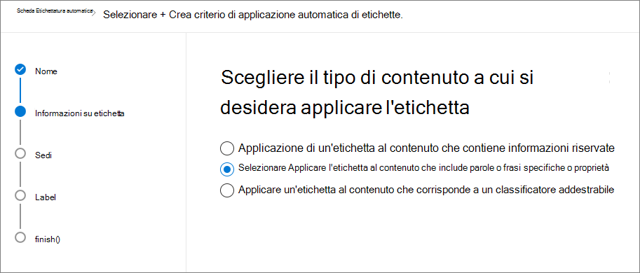

# <a name="manage-the-lifecycle-of-sharepoint-documents-with-retention-labels"></a><span data-ttu-id="33a0e-104">Gestire il ciclo di vita dei documenti di SharePoint con le etichette di conservazione</span><span class="sxs-lookup"><span data-stu-id="33a0e-104">Manage the lifecycle of SharePoint documents with retention labels</span></span>

><span data-ttu-id="33a0e-105">*[Indicazioni per l'assegnazione di licenze di Microsoft 365 per sicurezza e conformità](https://aka.ms/ComplianceSD).*</span><span class="sxs-lookup"><span data-stu-id="33a0e-105">*[Microsoft 365 licensing guidance for security & compliance](https://aka.ms/ComplianceSD).*</span></span>

<span data-ttu-id="33a0e-106">Questo articolo descrive come gestire il ciclo di vita dei documenti relativi a un prodotto archiviati in SharePoint Online attraverso le etichette di conservazione di Office 365, nello specifico tramite l'applicazione automatica e configurando la conservazione basata su eventi.</span><span class="sxs-lookup"><span data-stu-id="33a0e-106">This article describes how you can manage the lifecycle of product-related documents stored in SharePoint Online by using Office 365 retention labels, and specifically by auto-applying labels and configuring event-based retention.</span></span> <span data-ttu-id="33a0e-107">La funzionalità di applicazione automatica sfrutta la classificazione dei documenti mediante l'uso dei metadati di SharePoint.</span><span class="sxs-lookup"><span data-stu-id="33a0e-107">The auto-apply functionality leverages document classification by the use of SharePoint metadata.</span></span> <span data-ttu-id="33a0e-108">Lo scenario esposto in questo articolo si basa sui documenti relativi al prodotto, ma gli stessi concetti risultano validi anche per altri scenari.</span><span class="sxs-lookup"><span data-stu-id="33a0e-108">The scenario in this article is based on product-related documents, but the same concepts can be used for other scenarios.</span></span> <span data-ttu-id="33a0e-109">Per esempio, nel settore petrolifero e del gas naturale, è possibile gestire il ciclo di vita dei documenti relativi alle risorse fisiche come le piattaforme petrolifere e le registrazioni di log geofisici oppure le licenze di produzione.</span><span class="sxs-lookup"><span data-stu-id="33a0e-109">For example, in the oil and gas industry, you could manage the lifecycle of documents related to physical assets such as oil platforms, well logs, or production licenses.</span></span> <span data-ttu-id="33a0e-110">Nel settore dei servizi finanziari, con questo sistema è possibile gestire i documenti relativi a conti bancari, mutui o contratti di assicurazione.</span><span class="sxs-lookup"><span data-stu-id="33a0e-110">In the financial services industry, you can manage documents related to bank accounts, mortgages, or insurance contracts.</span></span> <span data-ttu-id="33a0e-111">Nel settore pubblico, permette gestire i documenti relativi ai permessi di costruzione o ai moduli fiscali.</span><span class="sxs-lookup"><span data-stu-id="33a0e-111">In the public sector, you can manage documents related to construction permits or tax forms.</span></span>

<span data-ttu-id="33a0e-112">Si passerà ora allo scenario oggetto di questo articolo.</span><span class="sxs-lookup"><span data-stu-id="33a0e-112">Let's look at the scenario for this article.</span></span> <span data-ttu-id="33a0e-113">L'analisi partirà dall'architettura delle informazioni e dalla definizione delle etichette di conservazione.</span><span class="sxs-lookup"><span data-stu-id="33a0e-113">We'll look at the information architecture and the definition of the retention labels.</span></span> <span data-ttu-id="33a0e-114">Dopodiché, si esaminerà la classificazione dei documenti attraverso l'applicazione automatica delle etichette e, infine, la generazione degli eventi che fanno scattare l'inizio del periodo di conservazione.</span><span class="sxs-lookup"><span data-stu-id="33a0e-114">Then we'll look at classifying documents by auto-applying the labels, and finally generating the events that initiate the start of the retention period.</span></span>

## <a name="information-architecture"></a><span data-ttu-id="33a0e-115">Architettura delle informazioni</span><span class="sxs-lookup"><span data-stu-id="33a0e-115">Information architecture</span></span>

<span data-ttu-id="33a0e-116">In questo articolo, viene descritto lo scenario di un'azienda manifatturiera che usa SharePoint Online in Office 365 per archiviare tutti i documenti relativi ai prodotti che sviluppa.</span><span class="sxs-lookup"><span data-stu-id="33a0e-116">The scenario for this article is based on a manufacturing company that uses Office 365 SharePoint Online to store all the documents related to the products the company develops.</span></span> <span data-ttu-id="33a0e-117">Tali documenti includono specifiche di prodotto, contratti con fornitori e manuali utenti.</span><span class="sxs-lookup"><span data-stu-id="33a0e-117">These documents include product specifications, agreements with suppliers, and user manuals.</span></span> <span data-ttu-id="33a0e-118">Quando un documento viene archiviato in SharePoint come indicato dai criteri di gestione dei contenuti aziendali, si definiscono e utilizzano i metadati specifici del documento per classificarlo.</span><span class="sxs-lookup"><span data-stu-id="33a0e-118">When these documents are stored in SharePoint as part of the Enterprise Content Management policies, document metadata is defined and used to classify them.</span></span> <span data-ttu-id="33a0e-119">In termini di metadati, ogni documento ha le seguenti proprietà:</span><span class="sxs-lookup"><span data-stu-id="33a0e-119">Each document has the following metadata properties:</span></span>

- <span data-ttu-id="33a0e-120">**Tipo di documento** (come specifica di prodotto, contratto e manuale utente)</span><span class="sxs-lookup"><span data-stu-id="33a0e-120">**Doc Type** (such as product specification, agreement, and user manual)</span></span>

- <span data-ttu-id="33a0e-121">**Nome del prodotto**</span><span class="sxs-lookup"><span data-stu-id="33a0e-121">**Product Name**</span></span>

- <span data-ttu-id="33a0e-122">**Stato** (bozza o finale)</span><span class="sxs-lookup"><span data-stu-id="33a0e-122">**Status** (draft or final)</span></span>

<span data-ttu-id="33a0e-123">Per tutti i documenti, i metadati formano la tipologia di contenuto di base denominata **Documento di produzione**.</span><span class="sxs-lookup"><span data-stu-id="33a0e-123">This metadata forms the base content type called **Production Document** for all documents.</span></span>


> [!NOTE]
> <span data-ttu-id="33a0e-125">In una fase successiva di questo scenario, i criteri di conservazione useranno le proprietà **Tipo di documento** e **Stato** per classificare e applicare in modo automatico le etichette di conservazione.</span><span class="sxs-lookup"><span data-stu-id="33a0e-125">The **Doc Type** and **Status** properties are used by retention policies later in the scenario to classify and auto-apply retention labels.</span></span>

<span data-ttu-id="33a0e-126">È possibile avere varie tipologie di contenuti che rappresentano differenti tipi di documenti, ma ora si concentri l'attenzione sulla Documentazione del prodotto.</span><span class="sxs-lookup"><span data-stu-id="33a0e-126">We can have several content types that represent different types of documents, but let's focus on the Product Documentation.</span></span>

<span data-ttu-id="33a0e-127">In questo scenario, si usa il Servizio metadati gestiti e l'Archivio termini per creare un set di termini per **Tipo di documento** e un altro set per **Nome del prodotto**.</span><span class="sxs-lookup"><span data-stu-id="33a0e-127">In this scenario, we use the Managed Metadata service and the Term store to create a term set for **Doc Type** and another one for **Product Name**.</span></span> <span data-ttu-id="33a0e-128">Per ogni set di termini, si crea un termine per ciascun valore.</span><span class="sxs-lookup"><span data-stu-id="33a0e-128">For each term set, we create a term for each value.</span></span> <span data-ttu-id="33a0e-129">Nell'Archivio termini per la propria organizzazione di SharePoint, apparirà in modo simile a questo:</span><span class="sxs-lookup"><span data-stu-id="33a0e-129">It would look like something like this in Term store for your SharePoint organization:</span></span>


<span data-ttu-id="33a0e-131">Le tipologie di contenuto possono essere create e pubblicate con l'[Hub tipo di contenuto](https://support.office.com/article/manage-content-type-publishing-06f39ac0-5576-4b68-abbc-82b68334889b).</span><span class="sxs-lookup"><span data-stu-id="33a0e-131">Content Type can be created and published using the [Content Type Hub](https://support.office.com/article/manage-content-type-publishing-06f39ac0-5576-4b68-abbc-82b68334889b).</span></span> <span data-ttu-id="33a0e-132">Un tipo di contenuto può essere creato e pubblicato anche con strumenti di provisioning del sito come l'apposito [framework PnP](https://docs.microsoft.com/sharepoint/dev/solution-guidance/pnp-provisioning-framework) o lo [schema JSON di progettazione del sito](https://docs.microsoft.com/sharepoint/dev/declarative-customization/site-design-json-schema#define-a-new-content-type).</span><span class="sxs-lookup"><span data-stu-id="33a0e-132">A content type can also be created and published using site provisioning tools such as the [PnP provisioning framework](https://docs.microsoft.com/sharepoint/dev/solution-guidance/pnp-provisioning-framework) or the [site design JSON schema](https://docs.microsoft.com/sharepoint/dev/declarative-customization/site-design-json-schema#define-a-new-content-type).</span></span>

<span data-ttu-id="33a0e-133">Ciascun prodotto dispone di un sito di SharePoint Online dedicato, contenente una raccolta documenti con le corrette tipologie di contenuto abilitate.</span><span class="sxs-lookup"><span data-stu-id="33a0e-133">Each product has a dedicated SharePoint Online site that contains one document library, with the right content types enabled.</span></span> <span data-ttu-id="33a0e-134">Tutti i documenti vengono archiviati in questa raccolta.</span><span class="sxs-lookup"><span data-stu-id="33a0e-134">All documents are stored in this document library.</span></span>


> [!NOTE]
> <span data-ttu-id="33a0e-136">Invece di avere un sito di SharePoint Online per ogni prodotto, l'azienda manifatturiera di questo scenario potrebbe usare un Microsoft Teams per ogni prodotto, così da supportare la collaborazione con i membri del team, ad esempio con una chat permanente, e usare la scheda **File** per la gestione dei documenti all'interno del team.</span><span class="sxs-lookup"><span data-stu-id="33a0e-136">Instead of having a SharePoint Online site per product, the manufacturing company in this scenario could use a Microsoft Team per product that would support collaboration with members of the team, such as persistent chat and use the **Files** tab in the team for document management.</span></span> <span data-ttu-id="33a0e-137">In questo articolo, il focus è diretto esclusivamente ai documenti, quindi si userà soltanto un sito.</span><span class="sxs-lookup"><span data-stu-id="33a0e-137">In this article we only focus on documents, therefore we will only use a site.</span></span>

<span data-ttu-id="33a0e-138">Ecco visualizzata la raccolta di documenti per il prodotto Spinning Widget:</span><span class="sxs-lookup"><span data-stu-id="33a0e-138">Here's a view of the document library for the Spinning Widget product:</span></span>


<span data-ttu-id="33a0e-140">Ora che è stata definita l'architettura delle informazioni di base per la gestione dei documenti, si passerà all'esame della strategia di conservazione ed eliminazione dei documenti che usano i metadati e alla loro classificazione.</span><span class="sxs-lookup"><span data-stu-id="33a0e-140">Now that we have the basic information architecture in place for document management, let's look at the retention and disposal strategy of the documents that use the metadata and classification of documents.</span></span>

## <a name="retention-and-disposition"></a><span data-ttu-id="33a0e-141">Conservazione ed eliminazione</span><span class="sxs-lookup"><span data-stu-id="33a0e-141">Retention and disposition</span></span>

<span data-ttu-id="33a0e-142">I criteri di conformità e governance dei dati dell'azienda manifatturiera stabiliscono le modalità di mantenimento ed eliminazione di tali dati.</span><span class="sxs-lookup"><span data-stu-id="33a0e-142">The manufacturing company's compliance and data governance policies dictate the way data is preserved and disposed of.</span></span> <span data-ttu-id="33a0e-143">I documenti relativi al prodotto devono essere conservati per tutto il tempo della produzione e per un determinato periodo successivo.</span><span class="sxs-lookup"><span data-stu-id="33a0e-143">Product-related documents must be kept for as long as the product is manufactured, and for a certain period after that.</span></span> <span data-ttu-id="33a0e-144">Il periodo in questione cambia a seconda che si tratti di specifiche di prodotto, contratti o manuali utenti.</span><span class="sxs-lookup"><span data-stu-id="33a0e-144">This period is different for product specifications, agreements, and user manuals.</span></span> <span data-ttu-id="33a0e-145">La tabella seguente indica i requisiti di conservazione ed eliminazione:</span><span class="sxs-lookup"><span data-stu-id="33a0e-145">The following table indicates the retention and disposition requirements:</span></span>

| <span data-ttu-id="33a0e-146">**Tipo di documento**</span><span class="sxs-lookup"><span data-stu-id="33a0e-146">**Document type**</span></span>          | <span data-ttu-id="33a0e-147">**Conservazione**</span><span class="sxs-lookup"><span data-stu-id="33a0e-147">**Retention**</span></span>                          | <span data-ttu-id="33a0e-148">**Eliminazione**</span><span class="sxs-lookup"><span data-stu-id="33a0e-148">**Disposition**</span></span>                              |
| -------------------------- | -------------------------------------- | -------------------------------------------- |
| <span data-ttu-id="33a0e-149">Specifica di prodotto</span><span class="sxs-lookup"><span data-stu-id="33a0e-149">Product specification</span></span>      | <span data-ttu-id="33a0e-150">5 anni dalla cessazione della produzione</span><span class="sxs-lookup"><span data-stu-id="33a0e-150">5 years after cessation of production</span></span>  | <span data-ttu-id="33a0e-151">Eliminazione</span><span class="sxs-lookup"><span data-stu-id="33a0e-151">Delete</span></span>                                       |
| <span data-ttu-id="33a0e-152">Contratto di prodotto</span><span class="sxs-lookup"><span data-stu-id="33a0e-152">Product agreement</span></span>          | <span data-ttu-id="33a0e-153">10 anni dalla cessazione della produzione</span><span class="sxs-lookup"><span data-stu-id="33a0e-153">10 years after cessation of production</span></span> | <span data-ttu-id="33a0e-154">Revisione</span><span class="sxs-lookup"><span data-stu-id="33a0e-154">Review</span></span>                                       |
| <span data-ttu-id="33a0e-155">Manuale utente</span><span class="sxs-lookup"><span data-stu-id="33a0e-155">User manual</span></span>                | <span data-ttu-id="33a0e-156">5 anni dalla cessazione della produzione</span><span class="sxs-lookup"><span data-stu-id="33a0e-156">5 years after cessation of production</span></span>  | <span data-ttu-id="33a0e-157">Eliminazione</span><span class="sxs-lookup"><span data-stu-id="33a0e-157">Delete</span></span>                                       |
| <span data-ttu-id="33a0e-158">Tutti gli altri tipi di documenti</span><span class="sxs-lookup"><span data-stu-id="33a0e-158">All other types of documents</span></span> | <span data-ttu-id="33a0e-159">Non conservare attivamente altri documenti</span><span class="sxs-lookup"><span data-stu-id="33a0e-159">Don't actively retain other documents</span></span>  | <span data-ttu-id="33a0e-160">Eliminazione di documenti con più di 3 anni di esistenza<sup>\*</sup></span><span class="sxs-lookup"><span data-stu-id="33a0e-160">Delete when document is older than 3 years<sup>\*</sup></span></span>  |
|||

> [!NOTE]
> <span data-ttu-id="33a0e-161"><sup>\*</sup> Un documento si considera con più di 3 anni di esistenza se non ha subito modifiche durante gli ultimi 3 anni.</span><span class="sxs-lookup"><span data-stu-id="33a0e-161"><sup>\*</sup> A document is considered older than 3 years if it hasn't been modified within the last 3 years.</span></span>

<span data-ttu-id="33a0e-162">Tramite il Centro sicurezza e conformità, vengono create le seguenti etichette di conservazione:</span><span class="sxs-lookup"><span data-stu-id="33a0e-162">Using the security and compliance center, we create the following retention labels:</span></span>

  - <span data-ttu-id="33a0e-163">Specifica di prodotto</span><span class="sxs-lookup"><span data-stu-id="33a0e-163">Product Specification</span></span>

  - <span data-ttu-id="33a0e-164">Contratto di prodotto</span><span class="sxs-lookup"><span data-stu-id="33a0e-164">Product Agreement</span></span>

  - <span data-ttu-id="33a0e-165">Manuale utente</span><span class="sxs-lookup"><span data-stu-id="33a0e-165">User Manual</span></span>

<span data-ttu-id="33a0e-166">In questo articolo, si illustreranno le modalità di creazione e applicazione automatica dell'etichetta di conservazione Specifica di prodotto.</span><span class="sxs-lookup"><span data-stu-id="33a0e-166">In this article, we only show how to create and auto-apply the Product Specification retention label.</span></span> <span data-ttu-id="33a0e-167">Per implementare lo scenario completo, procedere alla creazione e applicazione automatica delle etichette di conservazione per le altre due tipologie di documento.</span><span class="sxs-lookup"><span data-stu-id="33a0e-167">To implement the complete scenario, you would create and auto-apply retention labels for the other two document types.</span></span>

### <a name="settings-for-the-product-specification-retention-label"></a><span data-ttu-id="33a0e-168">Impostazioni per l'etichetta di conservazione Specifica di prodotto</span><span class="sxs-lookup"><span data-stu-id="33a0e-168">Settings for the Product Specification retention label</span></span>

<span data-ttu-id="33a0e-169">Ecco il [piano di archiviazione](file-plan-manager.md) per l'etichetta di conservazione Specifica di prodotto:</span><span class="sxs-lookup"><span data-stu-id="33a0e-169">Here's the [file plan](file-plan-manager.md) for the Product Specification retention label:</span></span> 

- <span data-ttu-id="33a0e-170">**Nome:** Specifica di prodotto</span><span class="sxs-lookup"><span data-stu-id="33a0e-170">**Name:** Product Specification</span></span>

- <span data-ttu-id="33a0e-171">**Descrizione per gli amministratori:** etichetta relativa alle specifiche di prodotto; conservare fino a cinque anni dopo la cessazione della produzione, eliminazione automatica, conservazione basata su eventi, tipo di evento Cessazione del prodotto.</span><span class="sxs-lookup"><span data-stu-id="33a0e-171">**Description for admins:** Product Specification Label, retain for five years after cessation of production, auto delete, event-based retention, event type is Product Cessation.</span></span>

- <span data-ttu-id="33a0e-172">**Descrizione per gli utenti:** mantenere per cinque anni dopo la cessazione della produzione.</span><span class="sxs-lookup"><span data-stu-id="33a0e-172">**Description for users:** Retain for five years after cessation of production.</span></span>

- <span data-ttu-id="33a0e-173">**Azione di conservazione:** mantenere ed eliminare.</span><span class="sxs-lookup"><span data-stu-id="33a0e-173">**Retention action:** Keep and delete</span></span>

- <span data-ttu-id="33a0e-174">**Durata di conservazione:** cinque anni (1825 giorni).</span><span class="sxs-lookup"><span data-stu-id="33a0e-174">**Retention duration:** Five years (1825 days)</span></span>

- <span data-ttu-id="33a0e-175">**Etichetta di record**: configurare l'etichetta di conservazione per classificare il contenuto come un [record](labels.md#using-retention-labels-for-records-management), i documenti classificati come record non possono essere modificati o eliminati dagli utenti.</span><span class="sxs-lookup"><span data-stu-id="33a0e-175">**Record label**: Configure the retention label to classify content as a [record](labels.md#using-retention-labels-for-records-management) (documents that are classified as a record can't be modified or deleted by users)</span></span>

- <span data-ttu-id="33a0e-176">**Descrittori del piano di archiviazione:** (per semplificare lo scenario, non viene inserito alcun descrittore di archiviazione).</span><span class="sxs-lookup"><span data-stu-id="33a0e-176">**File plan descriptors:** (for simplifying the scenario, no file descriptors are provided)</span></span>

<span data-ttu-id="33a0e-177">La seguente schermata mostra le impostazioni quando si crea l'[etichetta di conservazione](labels.md) Specifica di prodotto nel Centro sicurezza e conformità.</span><span class="sxs-lookup"><span data-stu-id="33a0e-177">The following screenshot shows the settings when you create the Product Specification [retention label](labels.md) in the security and compliance center.</span></span> <span data-ttu-id="33a0e-178">È possibile creare la tipologia di evento **Cessazione del prodotto** al momento della creazione dell'etichetta di conservazione.</span><span class="sxs-lookup"><span data-stu-id="33a0e-178">You can create the **Product Cessation** event type when you create the retention label.</span></span> <span data-ttu-id="33a0e-179">Seguire i passaggi descritti di seguito.</span><span class="sxs-lookup"><span data-stu-id="33a0e-179">See the steps below.</span></span>


> [!NOTE]
> <span data-ttu-id="33a0e-181">Per praticità e per evitare di dover attendere 5 anni per l'eliminazione automatica di un documento, impostare la durata di conservazione di 1 giorno se si intende ricreare questo scenario in ambiente di test.</span><span class="sxs-lookup"><span data-stu-id="33a0e-181">For the practical purposes and to avoid having to wait 5 years to see a document automatically deleted, set the retention duration to 1 day if you're recreating this scenario in your test environment.</span></span>

### <a name="create-an-event-type-when-creating-a-retention-label"></a><span data-ttu-id="33a0e-182">Creare un tipo di evento quando si crea un'etichetta di conservazione</span><span class="sxs-lookup"><span data-stu-id="33a0e-182">Create an event type when creating a retention label</span></span>

1. <span data-ttu-id="33a0e-183">Nell'elenco a discesa **Conserva o elimina il contenuto in base a**, selezionare **un evento**.</span><span class="sxs-lookup"><span data-stu-id="33a0e-183">In the **Retain or delete content based** on dropdown list, select **an event**.</span></span>

2. <span data-ttu-id="33a0e-184">Selezionare **Scegli un tipo di evento**.</span><span class="sxs-lookup"><span data-stu-id="33a0e-184">Select **Choose an event type**.</span></span>

   

3. <span data-ttu-id="33a0e-186">Nella pagina **Scegli un tipo di evento**, selezionare **È possibile creare nuovi tipi di evento qui**.</span><span class="sxs-lookup"><span data-stu-id="33a0e-186">On the **Choose an event type** page, select **You can create new event types here**.</span></span>

4. <span data-ttu-id="33a0e-187">Creare un tipo di evento denominato **Cessazione del prodotto**, inserire una descrizione e selezionare **Fine** per procedere.</span><span class="sxs-lookup"><span data-stu-id="33a0e-187">Create an event type named **Product Cessation**, give a description, and select **Finish** to create it.</span></span> 

5. <span data-ttu-id="33a0e-188">Tornare alla pagina **Scegli il tipo di evento**, selezionare il tipo di evento appena creato **Cessazione del prodotto**, poi selezionare **Aggiungi**.</span><span class="sxs-lookup"><span data-stu-id="33a0e-188">Back on the **Choose an event type** page, select the **Product Cessation** event type that you created, and then select **Add**.</span></span>

<span data-ttu-id="33a0e-189">Ecco come appaiono le impostazioni per l'etichetta di conservazione Specifica di prodotto.</span><span class="sxs-lookup"><span data-stu-id="33a0e-189">Here's what the settings look like for the Product Specification retention label.</span></span> <span data-ttu-id="33a0e-190">Selezionare **Crea questa etichetta** per procedere alla sua creazione.</span><span class="sxs-lookup"><span data-stu-id="33a0e-190">Select **Create this label** to create it.</span></span>


> [!TIP]
> <span data-ttu-id="33a0e-192">Per informazioni più dettagliate sui vari passaggi, consultare [Creare un'etichetta il cui periodo di conservazione è basato su un evento](event-driven-retention.md#step-1-create-a-label-whose-retention-period-is-based-on-an-event).</span><span class="sxs-lookup"><span data-stu-id="33a0e-192">For more detailed steps, see [Create a label whose retention period is based on an event](event-driven-retention.md#step-1-create-a-label-whose-retention-period-is-based-on-an-event).</span></span>

<span data-ttu-id="33a0e-193">Ora che l'etichetta di conservazione è stata creata, si passerà all'analisi dell'applicazione automatica dell'etichetta di conservazione al contenuto delle specifiche di prodotto.</span><span class="sxs-lookup"><span data-stu-id="33a0e-193">Now that the retention label is created, let's look at auto-applying the retention label to product specification content.</span></span>

## <a name="classifying-content-by-auto-applying-retention-labels"></a><span data-ttu-id="33a0e-194">Classificare il contenuto per l'applicazione automatica delle etichette di conservazione</span><span class="sxs-lookup"><span data-stu-id="33a0e-194">Classifying content by auto-applying retention labels</span></span>

<span data-ttu-id="33a0e-195">Ora si procederà con l'[applicazione automatica](labels.md#applying-a-retention-label-automatically-based-on-conditions) delle etichette di conservazione create per questo scenario, usando Keyword Query Language (KQL).</span><span class="sxs-lookup"><span data-stu-id="33a0e-195">We're going to [auto-apply](labels.md#applying-a-retention-label-automatically-based-on-conditions) the retention labels that we've created for this scenario by using Keyword Query Language (KQL).</span></span> <span data-ttu-id="33a0e-196">KQL è il linguaggio utilizzato per la creazione di query di ricerca.</span><span class="sxs-lookup"><span data-stu-id="33a0e-196">KQL is the language used to build search queries.</span></span> <span data-ttu-id="33a0e-197">Con KQL è possibile compiere ricerche in base a parole chiave o proprietà gestite.</span><span class="sxs-lookup"><span data-stu-id="33a0e-197">In KQL, you can search by using keywords or managed properties.</span></span> <span data-ttu-id="33a0e-198">Per ulteriori informazioni su KQL, consultare <https://docs.microsoft.com/sharepoint/dev/general-development/keyword-query-language-kql-syntax-reference></span><span class="sxs-lookup"><span data-stu-id="33a0e-198">For more information about KQL, see <https://docs.microsoft.com/sharepoint/dev/general-development/keyword-query-language-kql-syntax-reference></span></span>

<span data-ttu-id="33a0e-199">A un livello elevato, si vuole dire a Office 365 che applichi l'etichetta di conservazione **Specifica di prodotto** a tutti i documenti che hanno **Finale** come **Stato** e **Specifica di prodotto** come **Tipo di documento**.</span><span class="sxs-lookup"><span data-stu-id="33a0e-199">At a high level, we want to tell Office 365 to "apply the **Product Specification** retention label to all documents that have a **Status** of **Final** and a **Doc Type** of **Product Specification**.</span></span> <span data-ttu-id="33a0e-200">Si ricordi che **Stato** e **Tipo di documento** sono le colonne del sito precedentemente definite per il tipo di contenuto Documentazione di prodotto nella sezione [Architettura delle informazioni](#information-architecture).</span><span class="sxs-lookup"><span data-stu-id="33a0e-200">Recall that **Status** and **Doc Type** are the site columns we previously defined for Product Documentation content type in the [Information architecture](#information-architecture) section.</span></span> <span data-ttu-id="33a0e-201">Per compiere questa operazione, è necessario configurare lo schema di ricerca.</span><span class="sxs-lookup"><span data-stu-id="33a0e-201">To achieve this, we need to configure the search schema.</span></span>

<span data-ttu-id="33a0e-202">Quando SharePoint indicizza i contenuti, per ogni colonna del sito genera automaticamente delle proprietà sottoposte a ricerca per indicizzazione.</span><span class="sxs-lookup"><span data-stu-id="33a0e-202">When SharePoint indexes content, it automatically generates crawled properties for each site column.</span></span> <span data-ttu-id="33a0e-203">In questo scenario, l'interesse si concentra sulle proprietà **Tipo di documento** e **Stato**.</span><span class="sxs-lookup"><span data-stu-id="33a0e-203">For this scenario, we're interested in the **Doc Type** and **Status** properties.</span></span> <span data-ttu-id="33a0e-204">Affinché la ricerca crei delle proprietà sottoposte a ricerca per indicizzazione, all'interno della raccolta risulterà necessaria la presenza di documenti che usano il tipo di contenuto corretto e che le colonne del sito siano compilate.</span><span class="sxs-lookup"><span data-stu-id="33a0e-204">We need documents in the library using the right content type and have the site columns filled in, in order for search to create the crawled properties.</span></span>

<span data-ttu-id="33a0e-205">Nell'interfaccia di amministrazione di SharePoint, è possibile aprire le configurazioni di ricerca e selezionare **Gestisci schema di ricerca** per visualizzare e configurare le proprietà sottoposte a ricerca per indicizzazione.</span><span class="sxs-lookup"><span data-stu-id="33a0e-205">In the SharePoint admin center, we can open the Search configuration, and select **Manage Search Schema** to view and configure the crawled properties.</span></span>


<span data-ttu-id="33a0e-207">Se si digita **stato** nella casella **Proprietà sottoposte a ricerca per indicizzazione** e si seleziona la freccia verde, si visualizza un risultato simile a questo:</span><span class="sxs-lookup"><span data-stu-id="33a0e-207">If we type **status** in the **Crawled properties** box, and select the green arrow, we should see a result like this:</span></span>


<span data-ttu-id="33a0e-209">La proprietà **ows\_\_Status**, notare il doppio carattere di sottolineatura, è l'oggetto di interesse.</span><span class="sxs-lookup"><span data-stu-id="33a0e-209">The property **ows\_\_Status** (notice the double underscore) is the one that interests us.</span></span> <span data-ttu-id="33a0e-210">Questa esegue il mapping alla proprietà **Stato** del tipo di contenuto Documento di produzione.</span><span class="sxs-lookup"><span data-stu-id="33a0e-210">This maps to the **Status** property of the Production Document content type.</span></span>

<span data-ttu-id="33a0e-211">Ora, se si digita **ows\_doc** e si seleziona la freccia verde, si visualizza qualcosa di simile a questo:</span><span class="sxs-lookup"><span data-stu-id="33a0e-211">Now if we type **ows\_doc** and select the green arrow we should see something like this:</span></span>


<span data-ttu-id="33a0e-213">La proprietà **ows\_Doc\_x0020\_Type** è la seconda proprietà di interesse in questo scenario.</span><span class="sxs-lookup"><span data-stu-id="33a0e-213">The property **ows\_Doc\_x0020\_Type** is the second property that interests us.</span></span> <span data-ttu-id="33a0e-214">Questa esegue il mapping alla proprietà **Tipo di documento** della tipologia di contenuto Documento di produzione.</span><span class="sxs-lookup"><span data-stu-id="33a0e-214">This maps to the **Doc Type** property of the Production Document content type.</span></span>

> [!TIP]
> <span data-ttu-id="33a0e-215">Per identificare il nome di una proprietà sottoposta a ricerca per indicizzazione per questo scenario, passare alla raccolta che contiene i documenti di produzione e accedere alle relative impostazioni.</span><span class="sxs-lookup"><span data-stu-id="33a0e-215">To identify the name of a crawled property for this scenario, go the document library that contains the production documents and then go to the library settings.</span></span> <span data-ttu-id="33a0e-216">In **Colonne**, selezionare il nome della colonna, ad esempio, **Stato** o **Tipo di documento**, per aprire la pagina della colonna del sito.</span><span class="sxs-lookup"><span data-stu-id="33a0e-216">In the **Columns**, select the name of the column (for example, **Status** or **Doc Type**) to open the site column page.</span></span> <span data-ttu-id="33a0e-217">Il parametro **Campo** nell'URL della pagina contiene il nome del campo.</span><span class="sxs-lookup"><span data-stu-id="33a0e-217">The **Field** parameter in the URL for that page contains the name of the field.</span></span> <span data-ttu-id="33a0e-218">Tale nome del campo, con prefisso "ows_", è il nome della proprietà sottoposta a ricerca per indicizzazione.</span><span class="sxs-lookup"><span data-stu-id="33a0e-218">This field name, prefixed with "ows_", is the name of the crawled property.</span></span> <span data-ttu-id="33a0e-219">Ad esempio, l'URL `https://tenantname.sharepoint.com/sites/SpinningWidget/_layouts/15/FldEdit.aspx?List=%7BC38C2F45-3BD6-4C3B-AA3B-EF5DF6B3D172%7D&Field=_Status` corrisponde alla proprietà sottoposta a ricerca per indicizzazione di **ows\_\_Status**.</span><span class="sxs-lookup"><span data-stu-id="33a0e-219">For example, the URL `https://tenantname.sharepoint.com/sites/SpinningWidget/_layouts/15/FldEdit.aspx?List=%7BC38C2F45-3BD6-4C3B-AA3B-EF5DF6B3D172%7D&Field=_Status` corresponds to the **ows\_\_Status** crawled property.</span></span>

<span data-ttu-id="33a0e-220">Se le proprietà sottoposte a ricerca per indicizzazione non sono visualizzate nella sezione Gestisci schema di ricerca all'interno dell'interfaccia di amministrazione di SharePoint, è possibile che si sia verificata una delle seguenti situazioni:</span><span class="sxs-lookup"><span data-stu-id="33a0e-220">If the crawled properties you're looking for don't appear in the Manage Search Schema section in the SharePoint admin center, it could be for one of the following reasons:</span></span>

- <span data-ttu-id="33a0e-221">I documenti non sono stati indicizzati.</span><span class="sxs-lookup"><span data-stu-id="33a0e-221">The documents haven't been indexed.</span></span> <span data-ttu-id="33a0e-222">È possibile forzare una reindicizzazione della raccolta andando su Impostazioni della raccolta documenti > Impostazioni avanzate.</span><span class="sxs-lookup"><span data-stu-id="33a0e-222">You can force a re-index of the library by going to Document library settings > Advanced Settings.</span></span>

- <span data-ttu-id="33a0e-223">Se la raccolta documenti si trova in un sito moderno, verificare che l'amministratore di SharePoint sia anche un amministratore della raccolta siti.</span><span class="sxs-lookup"><span data-stu-id="33a0e-223">If the document library is in a modern site, make sure that the SharePoint admin is also a site collection admin.</span></span>

<span data-ttu-id="33a0e-224">Per ulteriori informazioni sulle proprietà sottoposte a ricerca per indicizzazione e sulle proprietà gestite, vedere [Proprietà gestite create automaticamente in SharePoint Server](https://docs.microsoft.com/sharepoint/technical-reference/automatically-created-managed-properties-in-sharepoint).</span><span class="sxs-lookup"><span data-stu-id="33a0e-224">For more information about crawled and managed properties, see [Automatically created managed properties in SharePoint Server](https://docs.microsoft.com/sharepoint/technical-reference/automatically-created-managed-properties-in-sharepoint).</span></span>

### <a name="mapping-crawled-properties-to-pre-defined-managed-properties"></a><span data-ttu-id="33a0e-225">Mapping delle proprietà sottoposte a ricerca per indicizzazione alle proprietà gestite predefinite</span><span class="sxs-lookup"><span data-stu-id="33a0e-225">Mapping crawled properties to pre-defined managed properties</span></span>

<span data-ttu-id="33a0e-226">KQL non può fare uso delle proprietà sottoposte a ricerca per indicizzazione nelle query di ricerca.</span><span class="sxs-lookup"><span data-stu-id="33a0e-226">KQL can't use crawled properties in search queries.</span></span> <span data-ttu-id="33a0e-227">A tal fine, deve utilizzare una proprietà gestita.</span><span class="sxs-lookup"><span data-stu-id="33a0e-227">It has to use a managed property.</span></span> <span data-ttu-id="33a0e-228">In un normale scenario di ricerca, si crea dunque una proprietà gestita e la si mappa alla proprietà sottoposta a ricerca per indicizzazione di cui si ha bisogno.</span><span class="sxs-lookup"><span data-stu-id="33a0e-228">In a normal search scenario, we create a managed property and map it to the crawled property that we need.</span></span> <span data-ttu-id="33a0e-229">Tuttavia, per l'applicazione automatica delle etichette di conservazione, è possibile solo specificare le proprietà gestite predefinite di KQL e non quelle personalizzate.</span><span class="sxs-lookup"><span data-stu-id="33a0e-229">However, for auto-applying retention labels, you can only specify in KQL pre-defined managed properties and not custom managed properties.</span></span> <span data-ttu-id="33a0e-230">Nel sistema esiste un set di proprietà gestite predefinite, già create, per le stringhe da RefinableString00 a RefinableString199 che possono essere usate.</span><span class="sxs-lookup"><span data-stu-id="33a0e-230">There's a set of predefined managed properties already created in the system for string RefinableString00 to RefinableString199 that can be used.</span></span> <span data-ttu-id="33a0e-231">Per un elenco completo, vedere [Proprietà gestite non utilizzate predefinite](https://docs.microsoft.com/sharepoint/manage-search-schema#default-unused-managed-properties).</span><span class="sxs-lookup"><span data-stu-id="33a0e-231">For a complete list, see [Default unused managed properties](https://docs.microsoft.com/sharepoint/manage-search-schema#default-unused-managed-properties).</span></span> <span data-ttu-id="33a0e-232">Tali proprietà gestite predefinite vengono generalmente utilizzate per la definizione dei criteri di affinamento della ricerca.</span><span class="sxs-lookup"><span data-stu-id="33a0e-232">These default managed properties are typically used for defining search refiners.</span></span>

<span data-ttu-id="33a0e-233">Affinché la query KQL funzioni e applichi automaticamente l'etichetta di conservazione corretta al contenuto del documento di prodotto, è necessario eseguire il mapping delle proprietà sottoposte a ricerca per indicizzazione **ows\_Doc\_x0020\_Type** e **ows\_\_Status** a due proprietà gestite per affinamento ricerca.</span><span class="sxs-lookup"><span data-stu-id="33a0e-233">For the KQL query to work and automatically apply the correct retention label to product document content, we map the crawled properties **ows\_Doc\_x0020\_Type** and **ows\_\_Status** to two refinable managed properties.</span></span> <span data-ttu-id="33a0e-234">Nell'ambiente di test per questo scenario, si evita l'uso di **RefinableString00** e **RefinableString01**.</span><span class="sxs-lookup"><span data-stu-id="33a0e-234">In our test environment for this scenario, **RefinableString00** and **RefinableString01** aren't being used.</span></span> <span data-ttu-id="33a0e-235">Questa condotta è stata determinata osservando le **Proprietà gestite** nella sezione **Gestisci schema di ricerca** all'interno dell'interfaccia di amministrazione di SharePoint.</span><span class="sxs-lookup"><span data-stu-id="33a0e-235">We determined this by looking at **Managed Properties** in the **Manage Search Schema** in the SharePont admin center.</span></span>


<span data-ttu-id="33a0e-237">Notare che la colonna **Proprietà sottoposte a ricerca per indicizzazione** mostrata nella schermata precedente è vuota.</span><span class="sxs-lookup"><span data-stu-id="33a0e-237">Notice that the **Mapped Crawled Properties** column in the previous screenshot is empty.</span></span>

<span data-ttu-id="33a0e-238">Per eseguire il mapping della proprietà sottoposta a ricerca per indicizzazione **ows\_Doc\_x0020\_Type**, eseguire le seguenti operazioni:</span><span class="sxs-lookup"><span data-stu-id="33a0e-238">To map the **ows\_Doc\_x0020\_Type** crawled property, do the following:</span></span>

1. <span data-ttu-id="33a0e-239">Nella casella del filtro **Proprietà gestita**, digitare **RefinableString00** e selezionare la freccia verde.</span><span class="sxs-lookup"><span data-stu-id="33a0e-239">In the **Managed property** filter box, type **RefinableString00** and select the green arrow.</span></span>

2. <span data-ttu-id="33a0e-240">Nell'elenco dei risultati, selezionare il link **RefinableString00**, poi scorrere verso il basso fino alla sezione **Mapping alle proprietà sottoposte a ricerca per indicizzazione**.</span><span class="sxs-lookup"><span data-stu-id="33a0e-240">In the results list, select the **RefinableString00** link, and then scroll down to the **Mappings to crawled properties** section.</span></span>  

3. <span data-ttu-id="33a0e-241">Selezionare **Aggiungi mapping** e poi digitare **ows\_Doc\_x0020\_Type** nella casella **Cerca un nome di proprietà sottoposta a ricerca per indicizzazione** all'interno della finestra **Selezione proprietà sottoposte a ricerca per indicizzazione**.</span><span class="sxs-lookup"><span data-stu-id="33a0e-241">Select **Add a Mapping**, and then type **ows\_Doc\_x0020\_Type** in the **Search for a crawled property name** box in the **Crawled property selection** window.</span></span> <span data-ttu-id="33a0e-242">Selezionare **Trova**.</span><span class="sxs-lookup"><span data-stu-id="33a0e-242">Select **Find**.</span></span>  

4. <span data-ttu-id="33a0e-243">Nell'elenco dei risultati, selezionare **ows\_Doc\_x0020\_Type** e poi **OK**.</span><span class="sxs-lookup"><span data-stu-id="33a0e-243">In the results list, select **ows\_Doc\_x0020\_Type** and then select **OK**.</span></span>

   <span data-ttu-id="33a0e-244">Nella sezione **Proprietà sottoposte a ricerca per indicizzazione**, si dovrebbe visualizzare qualcosa di simile a quanto mostrato in questa schermata:</span><span class="sxs-lookup"><span data-stu-id="33a0e-244">In the **Mapped Crawled Properties** section, you should see something similar to this screenshot:</span></span>

   

5. <span data-ttu-id="33a0e-246">Per salvare il mapping, scorrere fino alla parte inferiore della pagina e selezionare **OK**.</span><span class="sxs-lookup"><span data-stu-id="33a0e-246">Scroll to the bottom of the page and select **OK** to save the mapping.</span></span>

<span data-ttu-id="33a0e-247">Ripetere la medesima procedura per eseguire il mapping di RefinableString01 e ows\_\_Status.</span><span class="sxs-lookup"><span data-stu-id="33a0e-247">Repeat this same procedure to map RefinableString01 and ows\_\_Status.</span></span>

<span data-ttu-id="33a0e-248">A questo punto, si dovrebbe avere il mapping delle due proprietà gestite alle due proprietà sottoposte a ricerca per indicizzazione:</span><span class="sxs-lookup"><span data-stu-id="33a0e-248">Now you should have two managed properties mapped to the two crawled properties:</span></span>


<span data-ttu-id="33a0e-250">Verificare che sia tutto configurato correttamente eseguendo una Ricerca contenuti organizzazione.</span><span class="sxs-lookup"><span data-stu-id="33a0e-250">Let's verify that all this is set up correctly by running an enterprise search.</span></span> <span data-ttu-id="33a0e-251">Aprire un browser e passare a https://yourtenant.sharepoint.com/search.</span><span class="sxs-lookup"><span data-stu-id="33a0e-251">In a browser, go to https://yourtenant.sharepoint.com/search.</span></span> <span data-ttu-id="33a0e-252">Nella casella di ricerca, digitare **RefinableString00:"Specifica di prodotto"** e premere Invio.</span><span class="sxs-lookup"><span data-stu-id="33a0e-252">In the search box, type **RefinableString00:"Product Specification"** and press enter.</span></span> <span data-ttu-id="33a0e-253">In questo modo, dovrebbero mostrarsi tutti i documenti che contengono tale Specifica di prodotto come **Tipo di documento**.</span><span class="sxs-lookup"><span data-stu-id="33a0e-253">This should return all documents that have Product Specification as **Doc Type**.</span></span>

<span data-ttu-id="33a0e-254">A questo punto, digitare **RefinableString00:"Specifica di prodotto" AND RefinableString01:Final** nella casella di ricerca, quindi premere Invio.</span><span class="sxs-lookup"><span data-stu-id="33a0e-254">Now in the search box, type **RefinableString00:"Product Specification" AND RefinableString01:Final** and press enter.</span></span> <span data-ttu-id="33a0e-255">In questo modo, dovrebbero mostrarsi tutti i documenti che contengono tale Specifica di prodotto come **Tipo di documento** e che hanno **Finale** come Stato.</span><span class="sxs-lookup"><span data-stu-id="33a0e-255">This should return all documents that have Product Specification as **Doc Type** and a Status of **Final**.</span></span>

### <a name="creating-the-auto-apply-label-policies"></a><span data-ttu-id="33a0e-256">Creare i criteri di applicazione automatica delle etichette</span><span class="sxs-lookup"><span data-stu-id="33a0e-256">Creating the auto-apply label policies</span></span>

<span data-ttu-id="33a0e-257">Dopo aver verificato il corretto funzionamento della query KQL, si potranno creare i criteri di etichetta che fanno uso di una query KQL per l'applicazione automatica dell'etichetta di conservazione della Specifica di prodotto ai documenti appropriati.</span><span class="sxs-lookup"><span data-stu-id="33a0e-257">Now that we verified that the KQL query is working correctly, let's create the label policy that uses a KQL query to auto-apply the Product Specification retention label to the appropriate documents.</span></span>

1. <span data-ttu-id="33a0e-258">Nel [Centro sicurezza e conformità](https://protection.office.com), passare a **Classificazione** > **Etichette di conservazione** e poi selezionare **Applica automaticamente un'etichetta**.</span><span class="sxs-lookup"><span data-stu-id="33a0e-258">In the [security and compliance center](https://protection.office.com), go to **Classification** > **Retention labels**, and then select **Auto-apply a label**.</span></span> 

   

2. <span data-ttu-id="33a0e-260">Nella pagina della procedura guidata **Scegliere un'etichetta da applicare automaticamente**, selezionare**Scegliere un'etichetta da applicare automaticamente**.</span><span class="sxs-lookup"><span data-stu-id="33a0e-260">On the **Choose a label to auto-apply** wizard page, select **Choose a label to auto-apply**.</span></span>

3. <span data-ttu-id="33a0e-261">Nell'elenco delle etichette, selezionare **Specifica di prodotto**, selezionare **Aggiungi** e poi **Avanti**.</span><span class="sxs-lookup"><span data-stu-id="33a0e-261">In the list of labels, select **Product Specification**, select **Add**, and then select **Next**.</span></span>

4. <span data-ttu-id="33a0e-262">Selezionare **Applicare l'etichetta al contenuto che include parole o frasi specifiche o proprietà**, poi selezionare**Avanti**.</span><span class="sxs-lookup"><span data-stu-id="33a0e-262">Select **Apply label to content that contains specific words or phrases, or properties**, and then select **Next**.</span></span>

   

   <span data-ttu-id="33a0e-264">Nel passaggio successivo, si dovrà fornire la stessa query di ricerca KQL testata nella sezione precedente.</span><span class="sxs-lookup"><span data-stu-id="33a0e-264">In the next step, you will provide the same KQL search query that we tested in the previous section.</span></span> <span data-ttu-id="33a0e-265">Come si ricorderà, tale query mostrerà come risultato tutti i documenti Specifica di prodotto che hanno Finale come Stato.</span><span class="sxs-lookup"><span data-stu-id="33a0e-265">As you recall, this query returned all Product Specification documents that have a status of Final.</span></span> <span data-ttu-id="33a0e-266">L'uso della medesima query nei criteri di etichetta comporta l'applicazione automatica dell'etichetta di conservazione Specifica di prodotto a tutti i documenti che corrispondono a tale query di ricerca.</span><span class="sxs-lookup"><span data-stu-id="33a0e-266">The result of using this same query in the label policy means that the Product Specification retention label will be automatically applied to all documents that match this search query.</span></span>

5. <span data-ttu-id="33a0e-267">Nella casella **Editor di query con parole chiave**, digitare **RefinableString00:"Specifica di prodotto" AND RefinableString01:Final**, poi selezionare **Avanti**.</span><span class="sxs-lookup"><span data-stu-id="33a0e-267">In the **Keyword query editor** box, type **RefinableString00:"Product Specification" AND RefinableString01:Final**, and then select **Next**.</span></span>

   

6. <span data-ttu-id="33a0e-269">Inserire un nome per il criterio di etichetta, ad esempio, **Applicare automaticamente l'etichetta Specifica di prodotto**, e una descrizione facoltativa, poi selezionare **Avanti**.</span><span class="sxs-lookup"><span data-stu-id="33a0e-269">Type a name (for example, **Auto apply Product Specification label**) and an optional description for the label policy, and then select **Next**.</span></span> 

7. <span data-ttu-id="33a0e-270">Nella pagina della procedura guidata **Scegli posizioni**, selezionare le posizioni dei contenuti a cui si desidera applicare il criterio.</span><span class="sxs-lookup"><span data-stu-id="33a0e-270">On the **Choose locations** wizard page, you select the content locations that you want to apply the policy to.</span></span> <span data-ttu-id="33a0e-271">Per questo scenario, il criterio verrà applicato solo alle posizioni di SharePoint, poiché tutti i documenti di produzione sono archiviati solamente nelle raccolte documenti di SharePoint.</span><span class="sxs-lookup"><span data-stu-id="33a0e-271">For this scenario, we apply the policy only to SharePoint locations because all production documents are stored only in SharePoint document libraries.</span></span> <span data-ttu-id="33a0e-272">Selezionare **Consenti la scelta di posizioni specifiche**, disattivare l'interruttore di stato per la posta elettronica di Exchange, gli account di OneDrive e i gruppi di Office 365, verificando che lo stato per i siti di SharePoint sia attivato.</span><span class="sxs-lookup"><span data-stu-id="33a0e-272">Select **Let me choose specific locations**, toggle the status for Exchange email, OneDrive accounts, and Office 365 groups to off and make sure the status for SharePoint sites is toggled on.</span></span> 

    

   > [!TIP]
   > <span data-ttu-id="33a0e-274">Anziché applicare il criterio a tutti i siti di SharePoint, è possibile selezionare **Selezione siti** e aggiungere gli URL per i siti di SharePoint specifici.</span><span class="sxs-lookup"><span data-stu-id="33a0e-274">Instead of applying the policy to all SharePoint sites, you can select **Choose sites** and add the URLs for specific SharePoint sites.</span></span>

8. <span data-ttu-id="33a0e-275">Selezionare **Avanti** per mostrare la pagina **Controllare le impostazioni**.</span><span class="sxs-lookup"><span data-stu-id="33a0e-275">Select **Next** to display the **Review your settings** page.</span></span> 

    

9. <span data-ttu-id="33a0e-277">Per creare il criterio di etichetta, selezionare **Applica automaticamente**.</span><span class="sxs-lookup"><span data-stu-id="33a0e-277">Select **Auto-apply** to create the label policy.</span></span> <span data-ttu-id="33a0e-278">Sono necessari fino a sette giorni per applicare automaticamente l'etichetta Specifica di prodotto a tutti i documenti che corrispondono alla query di ricerca KQL fornita.</span><span class="sxs-lookup"><span data-stu-id="33a0e-278">It takes up to seven days to automatically apply the Product Specification label to all documents that match the KQL search query that you provided.</span></span>

### <a name="verifying-the-retention-label-was-automatically-applied"></a><span data-ttu-id="33a0e-279">Verificare l'applicazione automatica dell'etichetta di conservazione</span><span class="sxs-lookup"><span data-stu-id="33a0e-279">Verifying the retention label was automatically applied</span></span>

<span data-ttu-id="33a0e-280">Dopo sette giorni, usare la funzione [Esplora attività con etichette](view-label-activity-for-documents.md) nel Centro sicurezza e conformità per verificare che il criterio di etichetta creato in questo scenario sia stato applicato automaticamente alle etichette di conservazione per i documenti di prodotto.</span><span class="sxs-lookup"><span data-stu-id="33a0e-280">After seven days, use the [Label activity explorer](view-label-activity-for-documents.md) in the security and compliance center to see that the label policy that we created has automatically applied the retention labels in this scenario to the product documents.</span></span> <span data-ttu-id="33a0e-281">Nella schermata seguente, le etichette di conservazione sono state applicate anche a contratti di prodotto e manuali utente, nonostante in questo articolo non sia stata descritta la creazione di tali etichette di conservazione e dei criteri di etichetta.</span><span class="sxs-lookup"><span data-stu-id="33a0e-281">In the following screenshot, retention labels have also been applied to product agreements and user manuals, even though we didn't cover creating those retention labels and label policies in this article.</span></span>


<span data-ttu-id="33a0e-283">Un ulteriore controllo prevede la verifica delle proprietà del documento all'interno della Raccolta documenti.</span><span class="sxs-lookup"><span data-stu-id="33a0e-283">Another verification step is to look at the properties of the document in the Document Library.</span></span> <span data-ttu-id="33a0e-284">Nel riquadro delle informazioni, si può notare che l'etichetta di conservazione è applicata a un documento selezionato.</span><span class="sxs-lookup"><span data-stu-id="33a0e-284">In the information panel, you can see that the retention label is applied to a selected document.</span></span>


<span data-ttu-id="33a0e-286">Siccome le etichette di conservazione sono state applicate automaticamente ai documenti, tali documenti risultano protetti da un'eventuale eliminazione poiché l'etichetta di conservazione è stata configurata in modo che i documenti venissero dichiarati come record.</span><span class="sxs-lookup"><span data-stu-id="33a0e-286">Because the retention labels have been auto-applied to documents, the documents are protected from being deleted because the retention label was configured to declare the documents as records.</span></span> <span data-ttu-id="33a0e-287">Come esempio di questa protezione, nella schermata seguente viene mostrato un messaggio di errore che appare quando si tenta di eliminare uno di questi documenti.</span><span class="sxs-lookup"><span data-stu-id="33a0e-287">As an example of this protection, we receive an error message shown in the following screenshot when we try to delete one of these documents.</span></span>


## <a name="generating-the-events-that-trigger-the-start-of-the-retention-period"></a><span data-ttu-id="33a0e-289">Generare gli eventi che attivano l'inizio del periodo di conservazione</span><span class="sxs-lookup"><span data-stu-id="33a0e-289">Generating the events that trigger the start of the retention period</span></span>

<span data-ttu-id="33a0e-290">Ora che le etichette di conservazione sono state applicate automaticamente con successo, il focus passa all'evento che indicherà la fine della produzione di un particolare prodotto.</span><span class="sxs-lookup"><span data-stu-id="33a0e-290">Now that the retention labels were successfully automatically applied, let's focus on the event that will indicate the end of production for a particular product.</span></span> <span data-ttu-id="33a0e-291">Al verificarsi di tale evento, verrà avviato il periodo di conservazione definito nelle etichette di conservazione applicate automaticamente ai documenti.</span><span class="sxs-lookup"><span data-stu-id="33a0e-291">When this event occurs, it triggers the beginning of the retention period defined in retention labels auto-applied to documents.</span></span> <span data-ttu-id="33a0e-292">Ad esempio, per i documenti delle specifiche di prodotto, il periodo di conservazione quinquennale inizia quando viene attivato l'evento "Fine della produzione".</span><span class="sxs-lookup"><span data-stu-id="33a0e-292">For example, for product specification documents, the five-year retention period begins when the "end of production" event is triggered.</span></span>

<span data-ttu-id="33a0e-293">È possibile creare manualmente l'evento all'interno del Centro sicurezza e conformità andando su **Gestione record** > **Eventi** e scegliendo il tipo di evento e impostando gli ID risorsa corretti e una data per l'evento.</span><span class="sxs-lookup"><span data-stu-id="33a0e-293">You can manually create the event in the security and compliance center by going to **Records Managements** > **Events** and choosing the event type, setting the correct Asset Ids, and entering a date for the event.</span></span> <span data-ttu-id="33a0e-294">Per altre informazioni, vedere [Panoramica della conservazione basata su eventi](event-driven-retention.md).</span><span class="sxs-lookup"><span data-stu-id="33a0e-294">For more information, see [Overview of event-driven retention](event-driven-retention.md).</span></span>

<span data-ttu-id="33a0e-295">Per questo scenario, l'evento verrà creato automaticamente, generandolo da un sistema di produzione esterno.</span><span class="sxs-lookup"><span data-stu-id="33a0e-295">For this scenario, we'll automatically create the event by generating it from an external production system.</span></span> <span data-ttu-id="33a0e-296">In questo caso, il sistema che genera l'evento si compone di un semplice elenco di SharePoint che indica se un prodotto è in produzione e di un [Microsoft Flow](https://docs.microsoft.com/flow/getting-started) associato a tale elenco, che attiverà l'evento.</span><span class="sxs-lookup"><span data-stu-id="33a0e-296">In this case, the system that generates the event is a simple SharePoint list that indicates whether a product is in production and a [Microsoft Flow](https://docs.microsoft.com/flow/getting-started) that's associated with the list and will trigger the event.</span></span> <span data-ttu-id="33a0e-297">In uno scenario reale, un qualsiasi sistema potrebbe generare l'evento, ad esempio un sistema HR o CRM.</span><span class="sxs-lookup"><span data-stu-id="33a0e-297">In a real-world scenario, it could be any system that generates the event, such as an HR or CRM system.</span></span> <span data-ttu-id="33a0e-298">Microsoft Flow include numerose interazioni pronte all'uso e blocchi predefiniti per i carichi di lavoro di Office 365, ad esempio Exchange, SharePoint, Teams e Dynamics 365, e app di terze parti, come Twitter, Box, Salesforce e Workdays.</span><span class="sxs-lookup"><span data-stu-id="33a0e-298">Flow contains many ready-to-use interactions and building block for Office 365 workloads such as Exchange, SharePoint, Teams, and Dynamics 365, and third-party apps such as Twitter, Box, Salesforce, and Workdays.</span></span> <span data-ttu-id="33a0e-299">Questo facilita l'integrazione di Flow con tali sistemi.</span><span class="sxs-lookup"><span data-stu-id="33a0e-299">This makes it easy to integrate Flow with these systems.</span></span> <span data-ttu-id="33a0e-300">Per ulteriori informazioni, vedere [Automatizzare la conservazione basata su eventi](automate-event-driven-retention.md).</span><span class="sxs-lookup"><span data-stu-id="33a0e-300">For more information, see [Automate event-driven retention](automate-event-driven-retention.md).</span></span>

<span data-ttu-id="33a0e-301">La schermata seguente mostra l'elenco di SharePoint che verrà utilizzato per attivare l'evento:</span><span class="sxs-lookup"><span data-stu-id="33a0e-301">The following screenshot shows the SharePoint list that will be used the trigger the event:</span></span> 


<span data-ttu-id="33a0e-303">Attualmente, vi sono due prodotti in produzione come indicato dal valore **Sì** nella colonna **In produzione**.</span><span class="sxs-lookup"><span data-stu-id="33a0e-303">There are two products currently in production, which is indicated by the value of **Yes** in the **In Production** column.</span></span> <span data-ttu-id="33a0e-304">Se in questa colonna il valore corrispondente a un prodotto è impostato su **No**, il flusso associato all'elenco genererà automaticamente l'evento.</span><span class="sxs-lookup"><span data-stu-id="33a0e-304">When the value in this column is set to **No** for a product, the flow associated with the list will automatically generate the event.</span></span> <span data-ttu-id="33a0e-305">Questo determinerà a sua volta l'inizio del periodo di conservazione per l'etichetta di conservazione che era stata applicata automaticamente ai documenti di prodotto corrispondenti.</span><span class="sxs-lookup"><span data-stu-id="33a0e-305">This in turn triggers the start of the retention period for the retention label that was auto-applied to the corresponding product documents.</span></span>

<span data-ttu-id="33a0e-306">Per questo scenario, si utilizza il seguente flusso per attivare l'evento:</span><span class="sxs-lookup"><span data-stu-id="33a0e-306">For this scenario, we use the following flow to trigger the event:</span></span>


<span data-ttu-id="33a0e-308">Per creare questo flusso, iniziare da un connettore di SharePoint e selezionare il trigger **Quando viene creato o modificato un elemento**.</span><span class="sxs-lookup"><span data-stu-id="33a0e-308">To create this flow, start from a SharePoint connector and select the **When an item is created or modified** trigger.</span></span> <span data-ttu-id="33a0e-309">Specificare l'indirizzo del sito e il nome dell'elenco, quindi aggiungere una condizione associata al valore **No** della colonna \*\* In produzione\*\* (o al valore Falso nella scheda condizione).</span><span class="sxs-lookup"><span data-stu-id="33a0e-309">Specify the site address and list name, and then add a condition based on when the **In Production** list column value is set to **No** (or equal to false in the condition card).</span></span> <span data-ttu-id="33a0e-310">A questo punto, aggiungere un'azione basata sul modello HTTP predefinito.</span><span class="sxs-lookup"><span data-stu-id="33a0e-310">Then add an action based on the built-in HTTP template.</span></span> <span data-ttu-id="33a0e-311">Per configurare l'azione HTTP, usare i valori della sezione seguente.</span><span class="sxs-lookup"><span data-stu-id="33a0e-311">Use the values in the following section to configure the HTTP action.</span></span> <span data-ttu-id="33a0e-312">È possibile copiare i valori delle proprietà URI e Corpo dalla sezione seguente e incollarli nel modello.</span><span class="sxs-lookup"><span data-stu-id="33a0e-312">You can copy the values for the URI and Body properties from the section below and then paste them into the template.</span></span>

- <span data-ttu-id="33a0e-313">**Metodo**: POST</span><span class="sxs-lookup"><span data-stu-id="33a0e-313">**Method**: POST</span></span>
- <span data-ttu-id="33a0e-314">**URI**: https://ps.compliance.protection.outlook.com/psws/service.svc/ComplianceRetentionEvent</span><span class="sxs-lookup"><span data-stu-id="33a0e-314">**URI**: https://ps.compliance.protection.outlook.com/psws/service.svc/ComplianceRetentionEvent</span></span>
- <span data-ttu-id="33a0e-315">**Intestazioni**: Chiave = Content-Type, Valore = application/atom+xml</span><span class="sxs-lookup"><span data-stu-id="33a0e-315">**Headers**: Key = Content-Type, Value = application/atom+xml</span></span>
- <span data-ttu-id="33a0e-316">**Corpo**:</span><span class="sxs-lookup"><span data-stu-id="33a0e-316">**Body**:</span></span>

```HTML
<?xml version='1.0' encoding='utf-8' standalone='yes'>
<entry xmlns:d='https://schemas.microsoft.com/ado/2007/08/dataservices' xmlns:m='https://schemas.microsoft.com/ado/2007/08/dataservices/metadata' xmlns='https://www.w3.org/2005/Atom'>
<category scheme='https://schemas.microsoft.com/ado/2007/08/dataservices/scheme' term='Exchange.ComplianceRetentionEvent'>
<updated>9/9/2017 10:50:00 PM</updated>
<content type='application/xml'>
<m:properties>
<d:Name>Cessation Production @{triggerBody()?['Product_x0020_Name']?['Value']}</d:Name>
<d:EventType>Product Cessation&lt;</d:EventType>
<d:SharePointAssetIdQuery>ProductName:&quot;@{triggerBody()?['Product_x0020_Name']?['Value']}<d:SharePointAssetIdQuery>
<d:EventDateTime>@{formatDateTime(utcNow(),'yyyy-MM-dd')}</d:EventDateTime>
</m:properties>
</content&gt>
</entry>
```

<span data-ttu-id="33a0e-317">La sezione seguente descrive i parametri interni alla proprietà *Corpo* relativi all'azione da configurarsi in modo specifico per questo scenario.</span><span class="sxs-lookup"><span data-stu-id="33a0e-317">The following section describes the parameters within the *Body* property of the action that must be configured specifically for this scenario.</span></span>

- <span data-ttu-id="33a0e-318">**Name**: questo parametro specifica il nome dell'evento che verrà creato all'interno del Centro sicurezza e conformità.</span><span class="sxs-lookup"><span data-stu-id="33a0e-318">**Name**: This parameter specifies the name of the event that will be created in the security and compliance center.</span></span> <span data-ttu-id="33a0e-319">Per questo scenario, il nome è "Cessazione produzione xxx", dove xxx è il valore della proprietà gestita ProductName precedentemente creata.</span><span class="sxs-lookup"><span data-stu-id="33a0e-319">For this scenario, the name is "Cessation Production xxx", where xxx is the value of the ProductName managed property that we created earlier.</span></span>
- <span data-ttu-id="33a0e-320">**EventType**: il valore di questo parametro corrisponde al tipo di evento a cui si applicherà l'evento creato.</span><span class="sxs-lookup"><span data-stu-id="33a0e-320">**EventType**: The value for this parameter corresponds to the event type that the created event will apply to.</span></span> <span data-ttu-id="33a0e-321">Questo tipo di evento è stato definito al momento della creazione dell'etichetta di conservazione.</span><span class="sxs-lookup"><span data-stu-id="33a0e-321">This event type was defined when you created the retention label.</span></span> <span data-ttu-id="33a0e-322">Per questo scenario, il tipo di evento è "Cessazione del prodotto".</span><span class="sxs-lookup"><span data-stu-id="33a0e-322">For this scenario, the event type is "Product Cessation".</span></span>
- <span data-ttu-id="33a0e-323">**SharePointAssetIdQuery**: questo parametro definisce l'ID risorsa per l'evento.</span><span class="sxs-lookup"><span data-stu-id="33a0e-323">**SharePointAssetIdQuery**:This parameter defines the Asset Id for the event.</span></span> <span data-ttu-id="33a0e-324">La conservazione basata su eventi richiede che ogni documento abbia un identificatore univoco.</span><span class="sxs-lookup"><span data-stu-id="33a0e-324">Event-based retention needs a unique identifier for the document.</span></span> <span data-ttu-id="33a0e-325">È possibile usare gli ID risorsa per identificare i documenti a cui si applica un particolare evento oppure, come nel caso di questo scenario, una colonna di metadati, il Nome del prodotto.</span><span class="sxs-lookup"><span data-stu-id="33a0e-325">We can use Asset Ids to identify the documents that a particular event applies to, or as we do for this scenario, a metadata column, our own Product Name.</span></span> <span data-ttu-id="33a0e-326">Per eseguire questa operazione, è necessario creare una nuova proprietà gestita denominata ProductName da poter usare nella query KQL, oppure si può utilizzare RefinableString00 anziché creare una nuova proprietà gestita.</span><span class="sxs-lookup"><span data-stu-id="33a0e-326">To do  this, we have to create a new managed property named ProductName that can be used in the KQL query (or we could have used RefinableString00 instead of creating a new managed property).</span></span> <span data-ttu-id="33a0e-327">È necessario anche eseguire il mapping di questa nuova proprietà gestita alla proprietà sottoposta a ricerca per indicizzazione ows_Product_x0020_Name.</span><span class="sxs-lookup"><span data-stu-id="33a0e-327">We also need to map this new managed property to the ows_Product_x0020_Name crawled property.</span></span> <span data-ttu-id="33a0e-328">Ecco una schermata di tale proprietà gestita.</span><span class="sxs-lookup"><span data-stu-id="33a0e-328">Here's a screenshot of this managed property.</span></span>

    

- <span data-ttu-id="33a0e-330">**EventDateTime**: questo parametro definisce la data in cui si verifica l'evento.</span><span class="sxs-lookup"><span data-stu-id="33a0e-330">**EventDateTime**: This parameter defines the date the event occurs.</span></span> <span data-ttu-id="33a0e-331">Usare il formato di data corrente: *formatDateTime(utcNow(),'yyyy-MM-dd'*)</span><span class="sxs-lookup"><span data-stu-id="33a0e-331">Use the current date format: *formatDateTime(utcNow(),'yyyy-MM-dd'*)</span></span>

### <a name="putting-it-all-together"></a><span data-ttu-id="33a0e-332">Riassumendo</span><span class="sxs-lookup"><span data-stu-id="33a0e-332">Putting it all together</span></span>

<span data-ttu-id="33a0e-333">Ora che l'etichetta di conservazione è stata creata e applicata automaticamente e che il flusso è stato configurato e generato, ecco cosa succede quando il valore della colonna **In produzione** per il prodotto Spinning Widget all'interno dell'Elenco prodotti viene cambiata da **Sì** a **No**.</span><span class="sxs-lookup"><span data-stu-id="33a0e-333">Now that the retention label is created and auto-applied and the flow is configured and created, here's what happens when the value in the **In Production** column for the Spinning Widget product in the Products list is changed from **Yes** to **No**.</span></span> <span data-ttu-id="33a0e-334">Il flusso viene attivato e genera l'evento.</span><span class="sxs-lookup"><span data-stu-id="33a0e-334">The flow is triggered and creates the event.</span></span> <span data-ttu-id="33a0e-335">Per vedere tale evento nel Centro sicurezza e conformità, passare a **Gestione record** > **Eventi**.</span><span class="sxs-lookup"><span data-stu-id="33a0e-335">To see this event in the security and compliance center, go to **Records management** > **Events**.</span></span>


<span data-ttu-id="33a0e-337">Selezionare l'evento per visualizzarne i dettagli nella pagina a comparsa.</span><span class="sxs-lookup"><span data-stu-id="33a0e-337">Select the event to view the details on the flyout page.</span></span> <span data-ttu-id="33a0e-338">Notare che anche se l'evento è stato creato, i dettagli relativi al suo stato indicano che non è stato elaborato alcun sito o documento di SharePoint.</span><span class="sxs-lookup"><span data-stu-id="33a0e-338">Notice that even though the event is created, the details in the event status show that no SharePoint sites or documents have been processed.</span></span>


<span data-ttu-id="33a0e-340">Dopo un certo periodo di tempo, la sezione di stato dell'evento indicherà l'elaborazione di un sito o documento di SharePoint.</span><span class="sxs-lookup"><span data-stu-id="33a0e-340">But after some time, the event status section shows that for a SharePoint site and a SharePoint document have been processed.</span></span>  


 
<span data-ttu-id="33a0e-342">Questo significa che è stato avviato il periodo di conservazione per l'etichetta applicata al documento del prodotto Spinning Widget, sulla base della data dell'evento Cessazione produzione Spinning Widget.</span><span class="sxs-lookup"><span data-stu-id="33a0e-342">This means the retention period for the label applied to the Spinning Widget product document has been initiated, based on the event date of the Cessation Production Spinning Widget event.</span></span> <span data-ttu-id="33a0e-343">Ipotizzando che lo scenario sia stato implementato nell'ambiente di test configurando un periodo di conservazione pari a un giorno, è possibile passare alla raccolta dei propri documenti di prodotto alcuni giorni dopo la creazione dell'evento e verificare l'effettiva eliminazione di tale documento, in seguito al processo di eliminazione in SharePoint.</span><span class="sxs-lookup"><span data-stu-id="33a0e-343">Assuming you implemented the scenario in your test environment by configuring a one-day retention period, you can go to the document library for your product documents a few days after the event was created and verify that the document is deleted (after the deletion job in SharePoint has run).</span></span>

### <a name="more-about-asset-ids"></a><span data-ttu-id="33a0e-344">Altre informazioni sugli ID risorsa</span><span class="sxs-lookup"><span data-stu-id="33a0e-344">More about Asset Ids</span></span>

<span data-ttu-id="33a0e-345">Come descritto nella [Panoramica della conservazione basata su eventi](event-driven-retention.md), è importante comprendere la relazione tra le tipologie di evento, le etichette, gli eventi e gli ID risorsa.</span><span class="sxs-lookup"><span data-stu-id="33a0e-345">As explained in the [overview of event-driven retention](event-driven-retention.md), it's important to understand the relationship between event types, labels, events, and asset Ids.</span></span> <span data-ttu-id="33a0e-346">L'ID risorsa è semplicemente un'ulteriore proprietà di un documento in SharePoint e OneDrive.</span><span class="sxs-lookup"><span data-stu-id="33a0e-346">The Asset Id is simply another document property in SharePoint and OneDrive.</span></span> <span data-ttu-id="33a0e-347">Consente di identificare con maggiore dettaglio quei documenti per cui l'evento darà avvio al periodo di conservazione.</span><span class="sxs-lookup"><span data-stu-id="33a0e-347">It helps you to further identify the documents whose retention period will be triggered by the event.</span></span> <span data-ttu-id="33a0e-348">Come impostazione predefinita, SharePoint dispone di una proprietà ID risorsa utilizzabile per la conservazione basata su eventi:</span><span class="sxs-lookup"><span data-stu-id="33a0e-348">By default, SharePoint has an Asset Id property that you can use for event-driven retention:</span></span>


<span data-ttu-id="33a0e-350">Come mostrato nella schermata seguente, la proprietà gestita ID risorsa è denominata **ComplianceAssetId**.</span><span class="sxs-lookup"><span data-stu-id="33a0e-350">As shown in the following screenshot, the Asset Id managed property is called **ComplianceAssetId**.</span></span>


<span data-ttu-id="33a0e-352">Invece di usare la proprietà ID risorsa predefinita, è possibile utilizzare qualsiasi altra proprietà, come mostrato in questo scenario.</span><span class="sxs-lookup"><span data-stu-id="33a0e-352">Instead of using the default Asset Id property, you can also use any other property, as we do in this scenario.</span></span> <span data-ttu-id="33a0e-353">Tuttavia, è importante tenere presente che se per un evento non si specificano le parole chiave o un ID risorsa, l'evento attiverà il periodo di conservazione per ogni contenuto avente un'etichetta corrispondente a quel tipo di evento.</span><span class="sxs-lookup"><span data-stu-id="33a0e-353">But it's important to understand that if you don't specify an asset ID or keywords for an event, all of the content with a label of that event type will have its retention period triggered by the event.</span></span>

### <a name="using-advanced-search-in-sharepoint"></a><span data-ttu-id="33a0e-354">Usare la ricerca avanzata in SharePoint</span><span class="sxs-lookup"><span data-stu-id="33a0e-354">Using advanced search in SharePoint</span></span>

<span data-ttu-id="33a0e-355">Nella schermata precedente, si può vedere anche che esiste un'altra proprietà gestita relativa alle etichette di conservazione denominata **ComplianceTag** e che è mappata a una proprietà sottoposta a ricerca per indicizzazione.</span><span class="sxs-lookup"><span data-stu-id="33a0e-355">In the previous screenshot, we can also see that there's another managed property related to retention labels called **ComplianceTag** and that it's mapped to a crawled property.</span></span> <span data-ttu-id="33a0e-356">Anche la proprietà gestita **ComplianceAssetId** è mappata a una proprietà sottoposta a ricerca per indicizzazione.</span><span class="sxs-lookup"><span data-stu-id="33a0e-356">The **ComplianceAssetId** managed property is also mapped to a crawled property.</span></span> <span data-ttu-id="33a0e-357">Questo significa che è possibile usare queste proprietà gestite nella ricerca avanzata per recuperare tutti i documenti contrassegnati con un'etichetta di conservazione.</span><span class="sxs-lookup"><span data-stu-id="33a0e-357">This means you can use these managed properties in advanced search to retrieve all documents that have been tagged with a retention label.</span></span>

## <a name="summary"></a><span data-ttu-id="33a0e-358">Riepilogo</span><span class="sxs-lookup"><span data-stu-id="33a0e-358">Summary</span></span>

<span data-ttu-id="33a0e-359">Questo articolo ha illustrato uno scenario di gestione dei documenti in cui è stata applicata automaticamente un'etichetta di conservazione basata su una colonna del sito in SharePoint.</span><span class="sxs-lookup"><span data-stu-id="33a0e-359">This article illustrated a document management scenario where we automatically applied a retention label based on a site column in SharePoint.</span></span> <span data-ttu-id="33a0e-360">In seguito, si è fatto ricorso alla conservazione basata su eventi e a Microsoft Flow per attivare in modo automatico l'inizio del periodo di conservazione in base a un evento esterno.</span><span class="sxs-lookup"><span data-stu-id="33a0e-360">Then we used event-based retention and Microsoft Flow to automatically trigger the start of the retention period based on an external event.</span></span>

## <a name="credits"></a><span data-ttu-id="33a0e-361">Riconoscimenti</span><span class="sxs-lookup"><span data-stu-id="33a0e-361">Credits</span></span>

<span data-ttu-id="33a0e-362">Questo scenario è stato realizzato da:</span><span class="sxs-lookup"><span data-stu-id="33a0e-362">This scenario was authored by:</span></span> 

<span data-ttu-id="33a0e-363">Frederic Lapierre</span><span class="sxs-lookup"><span data-stu-id="33a0e-363">Frederic Lapierre</span></span><br/><span data-ttu-id="33a0e-364">Principal Consultant presso Servizi Microsoft</span><span class="sxs-lookup"><span data-stu-id="33a0e-364">Principal Consultant, Microsoft Services</span></span>
