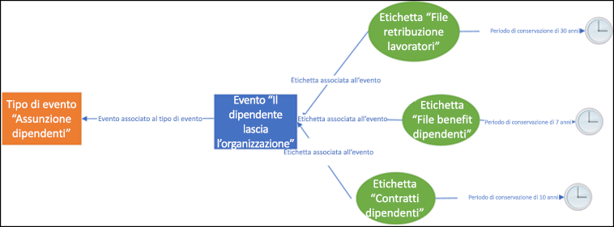
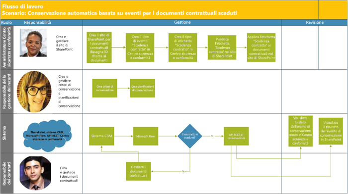
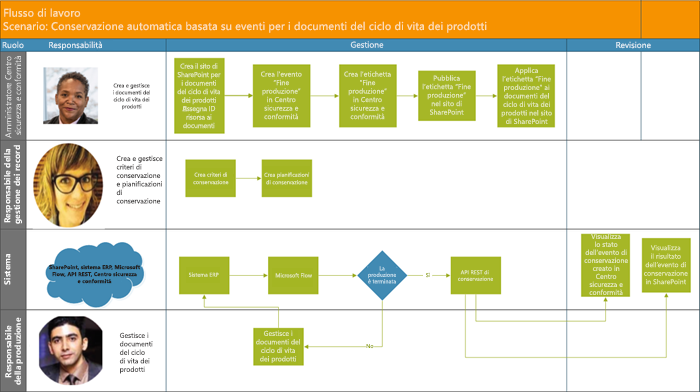

# Automatizzare la conservazione basata su eventiAutomate event-based retention

>*[Indicazioni per l'assegnazione di licenze di Microsoft 365 per sicurezza e conformità](https://aka.ms/ComplianceSD).**[Microsoft 365 licensing guidance for security & compliance](https://aka.ms/ComplianceSD).*

L'esplosione del contenuto nelle organizzazioni e il modo in cui può diventare ROT (redundant, obsolete, trivial, cioè ridondante, obsoleto e banale), è una cosa seria. Per continuare a soddisfare gli obblighi di conformità normativa, legale e finanziaria, le organizzazioni devono poter conservare e proteggere le informazioni importanti e trovare rapidamente ciò che conta. Conservare solo informazioni importanti e pertinenti è fondamentale per il successo di un’organizzazione.The explosion of content in organizations and how it can become ROT (redundant, obsolete, trivial) is serious business. To continue to meet legal, business, and regulatory compliance challenges, organizations must be able to keep and protect important information and quickly find what’s relevant. Retaining only important, pertinent information is key to an organization's success.

Per riuscirci, le organizzazioni possono sfruttare le soluzioni di conservazione nel Centro sicurezza e conformità di Office 365. La conservazione può essere attivata usando [etichette di conservazione](labels.md), che consentono di [basare il periodo di conservazione su un evento specifico](event-driven-retention.md). In genere, il periodo di conservazione si basa su una data nota, come la data di creazione o dell'ultima modifica del contenuto. Tuttavia, le organizzazioni fanno fronte anche a requisiti di smaltimento dei contenuti in base al verificarsi di un evento, ad esempio sette anni dopo che un dipendente ha lasciato l’organizzazione.To help meet this need, organizations can take advantage of retention solutions in the Office 365 Security & Compliance Center. Retention can be triggered by using [retention labels](labels.md). A retention label has the option to [base the retention period on a specific event](event-driven-retention.md). Typically, the retention period is based on a known date, such as the creation date or last modified date for the content. However, organizations also have requirements to dispose of content based on the occurrence of an event, such as seven years after an employee leaves an organization.

Per garantire lo smaltimento conforme del contenuto, è fondamentale conoscere la data in cui si verifica un evento. Con il rapido aumento del volume di contenuti, diventa sempre più difficile conservare e smaltire i contenuti in maniera puntuale e conforme.To ensure compliant disposal of content, it's imperative to know when an event takes place. With the volume of content increasing rapidly, it's becoming challenging to retain and dispose content in a timely and compliant manner.

La conservazione basata sugli eventi è la soluzione a questo problema. Questo argomento illustra come configurare i flussi di processo aziendale in modo da automatizzare la conservazione attraverso gli eventi usando l'API REST di Microsoft 365.Event-based retention solves this problem. This topic explains how to set up your business process flows to automate retention through events by using the Microsoft 365 REST API.

## Informazioni sulla conservazione basata su eventiAbout event-based retention

Un'organizzazione può avere dimensioni piccole, medie o grandi. Il numero di documenti aziendali e legali, dossier del personale, contratti e documenti sul prodotto che vengono creati e gestiti su base quotidiana è in drastico aumento.An organization can be small, medium, or large. The number of business documents, legal documents, employee files, contracts, and product documents that get created and managed on a day-to-day basis is increasing dramatically.

Ad esempio, ogni giorno decine o centinaia di dipendenti entrano a far parte delle organizzazioni o le lasciano. Il reparto Risorse umane continua a creare, aggiornare o eliminare i documenti relativi ai dipendenti in base ai requisiti aziendali. Questo processo è soggetto ai diversi criteri di conservazione indicati per l'azienda:For example, each day, tens and hundreds of employees are joining and leaving organizations. The HR department continues to create, update, or delete employee-related documents as per business requirements. This process is subject to the different retention policies outlined for the business:

- **Il periodo di conservazione del contenuto può essere una data nota**, ad esempio la data di creazione, dell'ultima modifica o dell'assegnazione di un'etichetta al contenuto. Ad esempio, si potrebbero conservare documenti per sette anni dalla creazione per poi eliminarli.**The period of retention for content can be a known date** such as the date the content was created, last modified, or labeled. For example, you might retain documents for seven years after they're created and then delete them.

- **Il periodo di conservazione del contenuto può essere anche una data sconosciuta**. Ad esempio, con le etichette di conservazione è anche possibile basare anche un periodo di conservazione sul momento in cui si verifica un determinato tipo di evento, ad esempio quando un dipendente lascia l'organizzazione.**The period of retention of content can also be an unknown date**. For example, with retention labels, you can also base a retention period on when a specific type of event occurs, such as an employee leaving the organization.

L'evento fa scattare l'inizio del periodo di conservazione e tutto il contenuto con un'etichetta applicata per quel tipo di evento riceve le azioni di conservazione dell'etichetta applicate su di esso. È ciò che si intende con conservazione basata sugli eventi. Per altre informazioni, vedere [Panoramica della conservazione basata su eventi](event-driven-retention.md).The event triggers the start of the retention period, and all content with a label applied for that type of event get the label's retention actions enforced on them. This is called event-based retention. To learn more, see [Overview of event-driven retention](event-driven-retention.md).

## Configurare la conservazione basata su eventiSet up event-based retention

Questa sezione descrive le operazioni da eseguire prima della conservazione del contenuto.This section describes what needs to be done before retaining content.

### Identificare i ruoliIdentify roles

Identificare i diversi ruoli in un'organizzazione che eseguono attività di Gestione record e che sarebbero i responsabili della conservazione efficace ed efficiente dei documenti aziendali.Identify the different roles in an organization that perform Record Management tasks and would be responsible for effective and efficient retention of business documents.

  | **Persona****Persona**| **Ruolo****Role**|
  | - | - |
  | AmministratoreAdmin | Crea tipi di eventi di conservazione, etichette di conservazione e repository dei record in SharePointCreates Retention Event types, Retention labels and Record repositories in SharePoint |
  | Responsabile della gestione dei recordRecords Manager                                  | Fornisce linee guida su criteri di conservazione e pianificazioni della conservazione, oltre a informazioni dettagliate sulla conformitàProvides Retention Policies and Retention Schedules guidance and compliance details   |
  | Amministratore di sistema (azienda)System Admin (business)                          | Configura e gestisce i sistemi esterni in modo da utilizzare Microsoft 365Sets up and manages external systems to work with Microsoft 365                       |
  | Information WorkerInformation Worker                               | Gestisce il ciclo di vita del proprio processo aziendale (risorse umane, finanza, IT ecc.)Manages the lifecycle of their business process (HR, Finance, IT, and so on)                 |

### Configurare il Centro sicurezza e conformitàSet up the Security & Compliance Center
  
1. L'amministratore di conformità crea un tipo di evento, &ndash;ad esempio Licenziamento dipendente, Scadenza contratto oppure Fine produzione.Compliance admin creates an event type &ndash; for example, Employee Termination or Contract Expiration or End of Product Manufacturing. Vedere il processo dettagliato in [Conservazione basata su eventi](event-driven-retention.md).(See the step-by-step process in [Event-driven retention](event-driven-retention.md).
    
2. L'amministratore di conformità crea un'etichetta di conservazione in base a un evento e la associa a un tipo di evento.Compliance admin creates a retention label based on an event and associates the label with an event type.
    
    Ci sono quattro tipi di trigger per le etichette di conservazione:There are four types of triggers for retention labels:
            
    1. Data creazioneCreate date
                
    2. Data ultima modificaLast modified
                
    3. Data etichetta (quando il contenuto è stato etichettato)Label date (when the content was labeled)
                
    4. Basata su eventiEvent-based
    
3. L'amministratore di conformità pubblica l'etichetta.Compliance admin publishes the retention label.

### Configurare SharePointSet up SharePoint
   
Per creare un repository dei record, l'amministratore di conformità deve:To create a records repository, the compliance admin:

1. Creare un sito di SharePoint.Creates a SharePoint site.

2. Eseguire una delle operazioni seguenti:Does one of the following:
        
    - Creare una raccolta di SharePoint: configurare un'etichetta basata su eventi a livello di raccolta. Per altre informazioni, vedere [Applicazione di un'etichetta di conservazione predefinita a tutto il contenuto in una raccolta, una cartella o un set di documenti di SharePoint](labels.md#applying-a-default-retention-label-to-all-content-in-a-sharepoint-library-folder-or-document-set).Creates a SharePoint library: Set event-based label at the library level. For more information, see [Applying a default retention label to all content in a SharePoint library, folder, or document set](labels.md#applying-a-default-retention-label-to-all-content-in-a-sharepoint-library-folder-or-document-set).
          
    - Configura un set di documenti in SharePoint.Sets up a document set in SharePoint. Per ulteriori informazioni, vedere [Introduzione ai set di documenti](https://support.office.com/article/3DBCD93E-0BED-46B7-B1BA-B31DE2BCD234).For more information, see [Introduction to document sets](https://support.office.com/article/3DBCD93E-0BED-46B7-B1BA-B31DE2BCD234).
      
3. Assegna un ID risorsa a ogni set di documenti dei dipendenti.Assigns an asset ID to each employee document set. Un ID risorsa è il nome o codice di un prodotto usato dall'organizzazione, ad esempio il Numero dipendente può essere un ID risorsa.An asset ID is a product name or code used by the organization, for example, Employee number can be an asset ID. Assegnando l'ID risorsa alla cartella, ogni elemento nella cartella eredita automaticamente lo stesso ID risorsa.By assigning the asset ID to the folder, every item in that folder automatically inherits the same asset ID. Di conseguenza, il periodo di conservazione di tutti gli elementi nella cartella sarà generato dallo stesso evento.This means all the items can have their retention period triggered by the same event.

## Modi per attivare la conservazione basata su eventiWays to trigger event-based retention

Esistono due modi in cui è possibile attivare la conservazione basata su eventi:There are two ways in which event-based retention can be triggered:

- **Uso dell'interfaccia di amministrazione** Si tratta di un processo che può essere sfruttato per conservare meno contenuto alla volta o per ridurre la frequenza di attivazione della conservazione e renderla, ad esempio, mensile o annuale.**Using the admin center UI** This is a process that can be used to retain less content at a time or the frequency to trigger retention isn't often, such as monthly or yearly. Per ulteriori informazioni su questo processo, vedere [Panoramica della conservazione basata su eventi](event-driven-retention.md).For more information about this method, see [Overview of event-driven retention](event-driven-retention.md). Tuttavia, questo metodo di attivazione della conservazione può richiedere tempo e causare errori, e diminuire così la scalabilità.However, this method of triggering retention can be time consuming and prone to error, thus stunting scalability. Di conseguenza, una soluzione automatica e semplice per attivare la conservazione può aumentare la sicurezza e la conformità dei dati.Therefore, an automated, seamless solution to trigger retention can enhance data security and compliance.

- **Con l'API REST di M365**: questo processo è utile quando occorre conservare grandi quantità di contenuto contemporaneamente e/o la frequenza di attivazione della conservazione è alta, ad esempio giornaliera o settimanale. Il flusso rileva il verificarsi di un evento nel sistema line-of-business e crea automaticamente un evento correlato nel Centro di sicurezza e conformità. Non è necessario creare manualmente un evento nell'interfaccia ogni volta che se ne verifica uno.**Using a M365 REST API** This process can be used when large amounts of content are to be retained at a time and/or the frequency to trigger retention is often such as daily or weekly. The flow detects when an event occurs in your line-of-business system, and then automatically creates a related event in the Security & Compliance Center. You don't need to manually create an event in the UI each time one occurs.

Sono disponibili due opzioni per usare l'API REST:There are two options for using the REST API:

- **Microsoft Flow o delle applicazioni simili** possono essere usate per attivare automaticamente la ricorrenza di un evento.**Microsoft Flow or a similar application** can be used to trigger the occurrence of an event automatically. Microsoft Flow è un agente di orchestrazione per la connessione ad altri sistemi.Microsoft Flow is an orchestrator for connecting to other systems. L'uso di Microsoft Flow non richiede una soluzione personalizzata.Using Microsoft Flow doesn't require a custom solution.

- **PowerShell o un client HTTP per le chiamate all'API REST**: usare PowerShell (versione 6 o successive) per chiamare l'API REST di Microsoft 365 per creare eventi.**PowerShell or an HTTP client to call REST API** Using PowerShell (version 6 or higher) to call Microsoft 365 REST API to create events. 

Un'API Rest è un endpoint di servizio che supporta set di operazioni HTTP (metodi), che forniscono l'accesso alle risorse del servizio per la creazione, il ripristino, l’aggiornamento e l’eliminazione.A Rest API is a service endpoint that supports sets of HTTP operations (methods), which provide create/retrieve/update/delete access to the service's resources. Per altre informazioni, vedere [Componenti di una richiesta/risposta dell'API REST](https://docs.microsoft.com/rest/api/gettingstarted/#components-of-a-rest-api-requestresponse).For more information, see [Components of a REST API request/response](https://docs.microsoft.com/rest/api/gettingstarted/#components-of-a-rest-api-requestresponse). In questo caso, con l'API REST di Microsoft 365, è possibile creare e recuperare gli eventi usando le operazioni (metodi) POST e GET.In this case, by using the Microsoft 365 REST API, events can be created and retrieved using operations (methods) POST and GET.

## Scenari di esempioExample scenarios

Considerare i seguenti scenari.Let’s consider the following scenarios.

### Scenario 1: Dipendenti che lasciano l'organizzazioneScenario 1: Employees leaving the organization 

Un’organizzazione crea e archivia numerosi documenti relativi all’impiego di ogni singolo dipendente.An organization creates and stores numerous employee-related documents per employee. Questi documenti sono gestiti e conservati durante il periodo di lavoro di ogni dipendente.These documents are managed and retained during the employment of each employee. Tuttavia, quando il dipendente lascia l'organizzazione o quando termina il periodo di lavoro, l'organizzazione è tenuta a rispettare i requisiti legali e aziendali e a mantenere i documenti di tale dipendente per un lasso di tempo concordato.However, when the employee leaves the organization or the employment is terminated, the organization is obligated by legal and business requirements to retain the documents of that employee for a stipulated period.

Quindi, se più dipendenti lasciassero l'organizzazione ogni giorno, l'organizzazione dovrebbe attivare quotidianamente l'intervallo di conservazione per centinaia o migliaia di documenti.Now if multiple employees leave the organization every day, the organization must trigger the retention clock of hundreds if not thousands of documents each day.

Oltre a tutto questo, occorre calcolare il periodo di conservazione per ciascun dipendente in base alla formula Data licenziamento dipendente + numero di giorni, mesi o anni in base al tipo di record del dipendente.In addition to this, the retention period needs to be calculated for each of these employees as Employee termination date + number of days, months, or years based on the type of the employee record. Ad esempio, il periodo di conservazione dei documenti relativi alla retribuzione del lavoratore e ai benefit dipendenti potrebbe differire.For example, worker’s compensation of the employee vs. benefits filings of the same employee may need different retention.

Il diagramma di seguito illustra come possano essere presenti più etichette associate a un singolo evento.The diagram below shows how there can be multiple labels that are associated with a single event. In questo caso, tutti i file con l’etichetta Assicurazione contro gli infortuni sul lavoro e tutti i file con l’etichetta Benefit dipendenti sono associati a un singolo evento, ossia il licenziamento del dipendente dall'organizzazione.Here all the files under Worker’s compensation label and all the files under Employee benefits label are both associated with a single event, which is the employee leaving the organization. Ognuno dei vari file ha intervalli di conservazione diversi.Each of these different files has different retention clocks. Quindi, quando un dipendente lascia l'organizzazione, i file raggruppati sotto ogni etichetta hanno un periodo di conservazione diverso.So, when an employee leaves the organization, these files within each label experience a different retention period. L'attivazione di tutti questi intervalli di conservazione, diversi per ogni tipo di file o etichetta e per ogni dipendente, è un'operazione molto complessa.Triggering all these different retention clocks for each file type or label for each employee is a very challenging task. Ancora di più lo è eseguire questa operazione per più dipendenti.Imagine doing this for multiple employees.

Di conseguenza, un processo automatizzato per attivare i diversi intervalli di conservazione per più dipendenti consente di risparmiare tempo, è privo di errori ed estremamente efficiente.Hence an automated process to trigger these different retention clocks for multiple employees will be time-saving, error-free, and extremely efficient.

**Configurazione della conservazione basata su eventi automatizzata per questo scenario:****Configuring Automated Event Based Retention for this scenario:**

  - L'amministratore crea le cartelle del dipendente nel set di documenti, ad esempio Angela Barbariol, Luca Udinesi.Admin creates employee folders to the Document set such as Jane Doe, John Smith.

  - L'amministratore aggiunge i documenti dei dipendenti, ad esempio Benefit, Paghe, Assicurazione contro gli infortuni sul lavoro, a ogni cartella dipendente.Admin adds employee files such as Benefits, Payroll, Worker’s Compensation to each employee folder.

  - L'amministratore assegna l'ID risorsa a ogni cartella dipendente.Admin assigns Asset ID to each employee folder. 

  - L'amministratore SCC accede al Centro sicurezza e conformità.SCC Admin logs into the Security & Compliance Center.

  - L'amministratore SCC crea tipi di eventi correlati al dipendente, come "Licenziamento del dipendente", "Assunzione del dipendente".SCC Admin creates employee-related events types such as “Employee Termination”, “Employee Hire” events.

  - L'amministratore SCC crea l'etichetta "Conservazione dipendente".SCC Admin creates “Employee Retention” label.

  - L'etichetta "Conservazione dipendente" viene pubblicata e applicata manualmente o automaticamente ai documenti dei dipendenti in SharePoint.This “Employee Retention” label is published and applied manually or automatically to the employee files in SharePoint.

  - Un sistema di gestione delle risorse umane come Workday può eseguire periodicamente Microsoft Flow per gestire i documenti dei dipendenti.HR Management System like Workday can work with Microsoft Flow to run periodically to manage employee files.

  - Se un dipendente ha lasciato l'organizzazione, Flow attiverà l'API REST di conservazione basata sugli eventi di M365 che avvierà l'intervallo di conservazione nei documenti del dipendente specifico.If an employee has left the organization, the Flow will trigger the M365 Event Based Retention REST API that will begin the retention clock on the specific employee’s files.

#### Uso di Microsoft FlowUsing Microsoft Flow

Passaggio 1: Creare un flusso per creare un evento usando le API REST di Microsoft 365Step 1- Create a flow to create an event using the Microsoft 365 REST API

##### Creare un eventoCreate an event

Codice di esempio per chiamare l'API RESTSample code to call the REST API

<table>
<thead>
<tr class="header">
<th>MetodoMethod</th>
<th>POSTPOST</th>
<th></th>
</tr>
</thead>
<tbody>
<tr class="odd">
<td>URLURL</td>
<td>https://ps.compliance.protection.outlook.com/psws/service.svc/ComplianceRetentionEvent</td>
<td></td>
</tr>
<tr class="even">
<td>IntestazioniHeaders</td>
<td>Content-TypeContent-Type</td>
<td>application/atom+xmlapplication/atom+xml</td>
</tr>
<tr class="odd">
<td>CorpoBody</td>
<td>
&lt;?xml version='1.0' encoding='utf-8' standalone='yes'?&gt;&lt;?xml version='1.0' encoding='utf-8' standalone='yes'?&gt;

&lt;entry xmlns:d='https://schemas.microsoft.com/ado/2007/08/dataservices'&lt;entry xmlns:d='https://schemas.microsoft.com/ado/2007/08/dataservices'

xmlns:m='https://schemas.microsoft.com/ado/2007/08/dataservices/metadata'xmlns:m='https://schemas.microsoft.com/ado/2007/08/dataservices/metadata'

xmlns='https://www.w3.org/2005/Atom'&gt;xmlns='https://www.w3.org/2005/Atom'&gt;

&lt;category scheme='https://schemas.microsoft.com/ado/2007/08/dataservices/scheme' term='Exchange.ComplianceRetentionEvent' /&gt;&lt;category scheme='https://schemas.microsoft.com/ado/2007/08/dataservices/scheme' term='Exchange.ComplianceRetentionEvent' /&gt;

&lt;updated&gt;9/9/2017 10:50:00 PM&lt;/updated&gt;&lt;updated&gt;9/9/2017 10:50:00 PM&lt;/updated&gt;

&lt;content type='application/xml'&gt;&lt;content type='application/xml'&gt;

&lt;m:properties&gt;&lt;m:properties&gt;

&lt;d:Name&gt;Employee Termination &lt;/d:Name&gt;&lt;d:Name&gt;Employee Termination &lt;/d:Name&gt;

&lt;d:EventType&gt;99e0ae64-a4b8-40bb-82ed-645895610f56&lt;/d:EventType&gt;&lt;d:EventType&gt;99e0ae64-a4b8-40bb-82ed-645895610f56&lt;/d:EventType&gt;

&lt;d:SharePointAssetIdQuery&gt;1234&lt;/d:SharePointAssetIdQuery&gt;&lt;d:SharePointAssetIdQuery&gt;1234&lt;/d:SharePointAssetIdQuery&gt;

&lt;d:EventDateTime&gt;2018-12-01T00:00:00Z &lt;/d:EventDateTime&gt;&lt;d:EventDateTime&gt;2018-12-01T00:00:00Z &lt;/d:EventDateTime&gt;

&lt;/m:properties&gt;&lt;/m:properties&gt;

&lt;/content&gt;&lt;/content&gt;

&lt;/entry&gt;&lt;/entry&gt;
</td>
<td></td>
</tr>
<tr class="even">
<td>AutenticazioneAuthentication</td>
<td>Di baseBasic</td>
<td></td>
</tr>
<tr class="odd">
<td>Nome utenteUsername</td>
<td>“Complianceuser”“Complianceuser”</td>
<td></td>
</tr>
<tr class="even">
<td>PasswordPassword</td>
<td>“Compliancepassword”“Compliancepassword”</td>
<td></td>
</tr>
</tbody>
</table>

##### Parametri disponibiliAvailable parameters

<table>
<thead>
<tr class="header">
<th><strong>Parametri</strong><strong>Parameters</strong></th>
<th><strong>Descrizione</strong><strong>Description</strong></th>
<th><strong>Note</strong><strong>Notes</strong></th>
</tr>
</thead>
<tbody>
<tr class="odd">
<td>&lt;d:Name&gt;&lt;/d:Name&gt;&lt;d:Name&gt;&lt;/d:Name&gt;</td>
<td>Immettere un nome univoco per l'evento,Provide a unique name for the event,</td>
<td>Non può contenere spazi e i caratteri seguenti: % \* \ &amp; &lt; &gt; | # ? , : ,Cannot contain trailing spaces, and the following characters: % \* \ &amp; &lt; &gt; | # ? , : ;</td>
</tr>
<tr class="even">
<td>&lt;d:EventType&gt;&lt;/d:EventType&gt;&lt;d:EventType&gt;&lt;/d:EventType&gt;</td>
<td>Immettere il nome del tipo di evento (o Guid)Enter event type name (or Guid),</td>
<td>Esempio: "Licenziamento dipendente". Il tipo di evento deve essere associato a un'etichetta di conservazione.Example: “Employee termination”. Event type has to be associated with a retention label.</td>
</tr>
<tr class="odd">
<td>&lt;d:SharePointAssetIdQuery&gt;&lt;/d:SharePointAssetIdQuery&gt;&lt;d:SharePointAssetIdQuery&gt;&lt;/d:SharePointAssetIdQuery&gt;</td>
<td>Immettere "ComplianceAssetId:" + ID dipendenteEnter “ComplianceAssetId:” + employee Id</td>
<td>Esempio:&quot;ComplianceAssetId:12345&quot;Example:&quot;ComplianceAssetId:12345&quot;</td>
</tr>
<tr class="even">
<td>&lt;d:EventDateTime&gt;&lt;/d:EventDateTime&gt;&lt;d:EventDateTime&gt;&lt;/d:EventDateTime&gt;</td>
<td>Data e ora eventoEvent Date and Time</td>
<td>
Formato: aaaa-MM-ggTHH:mm:ssZ, esempio:Format: yyyy-MM-ddTHH:mm:ssZ, Example:

2018-12-01T00:00:00Z2018-12-01T00:00:00Z
</td>
</tr>
</tbody>
</table>

##### Codici di rispostaResponse codes

| **Codice di risposta****Response Code** | **Descrizione****Description**       |
| ----------------- | --------------------- |
| 302302               | ReindirizzareRedirect              |
| 201201               | CreatoCreated               |
| 403403               | Autorizzazione non riuscitaAuthorization Failed  |
| 401401               | Autenticazione non riuscitaAuthentication Failed |

##### Ricevere gli eventi in base all'intervallo di tempoGet Events based on time range

<table>
<thead>
<tr class="header">
<th>MetodoMethod</th>
<th>GETGET</th>
<th></th>
</tr>
</thead>
<tbody>
<tr class="odd">
<td>URLURL</td>
<td><ol start="4" type="1">
<li>
https://ps.compliance.protection.outlook.com/psws/service.svc/ComplianceRetentionEvent?BeginDateTime=2019-01-11&amp;EndDateTime=2019-01-16https://ps.compliance.protection.outlook.com/psws/service.svc/ComplianceRetentionEvent?BeginDateTime=2019-01-11&amp;EndDateTime=2019-01-16
</li>
</ol></td>
<td></td>
</tr>
<tr class="even">
<td>IntestazioniHeaders</td>
<td>Content-TypeContent-Type</td>
<td>application/atom+xmlapplication/atom+xml</td>
</tr>
<tr class="odd">
<td></td>
<td></td>
<td></td>
</tr>
<tr class="even">
<td>AutenticazioneAuthentication</td>
<td>Di baseBasic</td>
<td></td>
</tr>
<tr class="odd">
<td>Nome utenteUsername</td>
<td>“Complianceuser”“Complianceuser”</td>
<td></td>
</tr>
<tr class="even">
<td>PasswordPassword</td>
<td>“Compliancepassword”“Compliancepassword”</td>
<td></td>
</tr>
</tbody>
</table>

##### Codici di rispostaResponse codes

| **Codice di risposta****Response Code** | **Descrizione****Description**                   |
| ----------------- | --------------------------------- |
| 200200               | OK, un elenco di eventi in atom+ xmlOK, A list of events in atom+ xml |
| 404404               | Non trovatoNot found                         |
| 302302               | ReindirizzareRedirect                          |
| 401401               | Autorizzazione non riuscitaAuthorization Failed              |
| 403403               | Autenticazione non riuscitaAuthentication Failed             |

##### Ottenere un evento in base all'IDGet an event by ID

| MetodoMethod         | GETGET   |                      |
| -------------- | ------------------------------------------------------------------------------------------------------------------------------------------------------------------------------------------------------------------------------------------------------------------ | -------------------- |
| URLURL            | [https://ps.compliance.protection.outlook.com/psws/service.svc/ComplianceRetentionEvent(‘174e9a86-74ff-4450-8666-7c11f7730f66’)](https://ps.compliance.protection.outlook.com/psws/service.svc/ComplianceRetentionEvent\('174e9a86-74ff-4450-8666-7c11f7730f66'\))[https://ps.compliance.protection.outlook.com/psws/service.svc/ComplianceRetentionEvent(‘174e9a86-74ff-4450-8666-7c11f7730f66’)](https://ps.compliance.protection.outlook.com/psws/service.svc/ComplianceRetentionEvent\('174e9a86-74ff-4450-8666-7c11f7730f66'\)) |                      |
| IntestazioneHeader         | Content-TypeContent-Type                                                                                                                                                                                                                                                       | application/atom+xmlapplication/atom+xml |
| AutenticazioneAuthentication | Di baseBasic                                                                                                                                                                                                                                                              |                      |
| Nome utenteUsername       | “Complianceuser”“Complianceuser”                                                                                                                                                                                                                                                   |                      |
| PasswordPassword       | “Compliancepassword”“Compliancepassword”                                                                                                                                                                                                                                               |                      |

##### Codici di rispostaResponse codes

| **Codice di risposta****Response Code** | **Descrizione****Description**                                      |
| ----------------- | ---------------------------------------------------- |
| 200200               | OK, il corpo della risposta contiene l'evento in atom+xmlOK, The response body contains the event in atom+xml |
| 404404               | Non trovatoNot found                                            |
| 302302               | ReindirizzareRedirect                                             |
| 401401               | Autorizzazione non riuscitaAuthorization Failed                                 |
| 403403               | Autenticazione non riuscitaAuthentication Failed                                |

##### Ottenere un evento in base al nomeGet an event by name

| MetodoMethod         | GETGET       |                      |
| -------------- | -------------------------------------------------------------------------------------------------------------------------------------------- | -------------------- |
| URLURL            | <https://ps.compliance.protection.outlook.com/psws/service.svc/ComplianceRetentionEvent('EventByRESTPost-2226bfebcc2841a8968ba71f9516b763')> |                      |
| IntestazioniHeaders        | Content-TypeContent-Type                                                                                                                                 | application/atom+xmlapplication/atom+xml |
| AutenticazioneAuthentication | Di baseBasic                                                                                                                                        |                      |
| Nome utenteUsername       | “Complianceuser”“Complianceuser”                                                                                                                             |                      |
| PasswordPassword       | “Compliancepassword”“Compliancepassword”                                                                                                                         |                      |

##### Codici di rispostaResponse codes

| **Codice di risposta****Response Code** | **Descrizione****Description**                                      |
| ----------------- | ---------------------------------------------------- |
| 200200               | OK, il corpo della risposta contiene l'evento in atom+xmlOK, The response body contains the event in atom+xml |
| 404404               | Non trovatoNot found                                            |
| 302302               | ReindirizzareRedirect                                             |
| 401401               | Autorizzazione non riuscitaAuthorization Failed                                 |
| 403403               | Autenticazione non riuscitaAuthentication Failed                                |

#### Uso di PowerShell (versione 6 o successiva) o un client HTTPUsing PowerShell (ver.6 or higher) or any HTTP client

Passaggio 1: Connettersi a PowerShell.Step 1: Connect to PowerShell.

Passaggio 2: Eseguire lo script seguente.Step 2: Run the following script.

<table>
<tbody>
<tr class="odd">
<td>
param([string]$baseUri)param([string]$baseUri)

$userName = &quot;UserName&quot;$userName = &quot;UserName&quot;

$password = &quot;Password&quot;$password = &quot;Password&quot;

$securePassword = ConvertTo-SecureString $password -AsPlainText -Force$securePassword = ConvertTo-SecureString $password -AsPlainText -Force

$credentials = New-Object System.Management.Automation.PSCredential($userName, $securePassword)$credentials = New-Object System.Management.Automation.PSCredential($userName, $securePassword)

$EventName=&quot;EventByRESTPost-$(([Guid]::NewGuid()).ToString('N'))&quot;$EventName=&quot;EventByRESTPost-$(([Guid]::NewGuid()).ToString('N'))&quot;

Write-Host &quot;Start to create an event with name: $EventName&quot;Write-Host &quot;Start to create an event with name: $EventName&quot;

$body = &quot;&lt;?xml version='1.0' encoding='utf-8' standalone='yes'?&gt;$body = &quot;&lt;?xml version='1.0' encoding='utf-8' standalone='yes'?&gt;

&lt;entry xmlns:d='https://schemas.microsoft.com/ado/2007/08/dataservices'&lt;entry xmlns:d='https://schemas.microsoft.com/ado/2007/08/dataservices'

xmlns:m='https://schemas.microsoft.com/ado/2007/08/dataservices/metadata'xmlns:m='https://schemas.microsoft.com/ado/2007/08/dataservices/metadata'

xmlns='https://www.w3.org/2005/Atom'&gt;xmlns='https://www.w3.org/2005/Atom'&gt;

&lt;category scheme='https://schemas.microsoft.com/ado/2007/08/dataservices/scheme' term='Exchange.ComplianceRetentionEvent' /&gt;&lt;category scheme='https://schemas.microsoft.com/ado/2007/08/dataservices/scheme' term='Exchange.ComplianceRetentionEvent' /&gt;

&lt;updated&gt;7/14/2017 2:03:36 PM&lt;/updated&gt;&lt;updated&gt;7/14/2017 2:03:36 PM&lt;/updated&gt;

&lt;content type='application/xml'&gt;&lt;content type='application/xml'&gt;

&lt;m:properties&gt;&lt;m:properties&gt;

&lt;d:Name&gt;$EventName&lt;/d:Name&gt;&lt;d:Name&gt;$EventName&lt;/d:Name&gt;

&lt;d:EventType&gt;e823b782-9a07-4e30-8091-034fc01f9347&lt;/d:EventType&gt;&lt;d:EventType&gt;e823b782-9a07-4e30-8091-034fc01f9347&lt;/d:EventType&gt;

&lt;d:SharePointAssetIdQuery&gt;'ComplianceAssetId:123'&lt;/d:SharePointAssetIdQuery&gt;&lt;d:SharePointAssetIdQuery&gt;'ComplianceAssetId:123'&lt;/d:SharePointAssetIdQuery&gt;

&lt;/m:properties&gt;&lt;/m:properties&gt;

&lt;/content&gt;&lt;/content&gt;

&lt;/entry&gt;&quot;&lt;/entry&gt;&quot;

$event = $null$event = $null

trytry

{{

$event = Invoke-RestMethod -Body $body -Method 'POST' -Uri &quot;$baseUri/ComplianceRetentionEvent&quot; -ContentType &quot;application/atom+xml&quot; -Authentication Basic -Credential $credentials -MaximumRedirection 0$event = Invoke-RestMethod -Body $body -Method 'POST' -Uri &quot;$baseUri/ComplianceRetentionEvent&quot; -ContentType &quot;application/atom+xml&quot; -Authentication Basic -Credential $credentials -MaximumRedirection 0

}}

catchcatch

{{

$response = $_.Exception.Response$response = $_.Exception.Response

if($response.StatusCode -eq &quot;Redirect&quot;)if($response.StatusCode -eq &quot;Redirect&quot;)

{{

$url = $response.Headers.Location$url = $response.Headers.Location

Write-Host &quot;redirected to $url&quot;Write-Host &quot;redirected to $url&quot;

$event = Invoke-RestMethod -Body $body -Method 'POST' -Uri $url -ContentType &quot;application/atom+xml&quot; -Authentication Basic -Credential $credentials -MaximumRedirection 0$event = Invoke-RestMethod -Body $body -Method 'POST' -Uri $url -ContentType &quot;application/atom+xml&quot; -Authentication Basic -Credential $credentials -MaximumRedirection 0

}}

}}

$event | fl \*$event | fl \*
</td>
</tr>
</tbody>
</table>

#### Verificare il risultato in entrambe le opzioniVerify the outcome in both options

Passaggio 1: Passare al Centro sicurezza e conformità.Step 1: Go to the Security & Compliance Center.

Passaggio 2: Scegliere **Eventi** in **Governance delle informazioni**.Step 2: Select **Events** under **Information governance**.

Passaggio 3: Verificare di aver creato l'evento.Step 3: Verify Event has been created.

È possibile usare le opzioni precedenti per automatizzare la conservazione basata sugli eventi anche per gli scenari seguenti.Similarly, the above options to automate event-based retention can be used for the following scenarios as well.

### Scenario 2: Contratti in scadenzaScenario 2: Contracts Expiring

Un'organizzazione può avere più record per un singolo contratto con clienti, fornitori e partner.An organization can have multiple records for a single contract with customers, vendors, and partners. Questi documenti possono trovarsi in una raccolta documenti come SharePoint.These documents can reside in a document library like SharePoint. Il termine di un contratto determina l'inizio del periodo di conservazione dei documenti associati al contratto.The end of a contract determines the start of the retention period of the documents associated with the contract. Ad esempio, tutti i record relativi ai contratti devono essere conservati per cinque anni dalla data di scadenza del contratto.For example, all records related to contracts need to be retained for five years from the time the contract expires. L'evento che attiva il periodo di conservazione di cinque anni è la scadenza del contratto.The event that triggers the five-year retention period is the expiration of the contract.

Un sistema di Customer Relationship Management (CRM) può interagire con Microsoft 365 per attivare la conservazione dei documenti contrattualiA Customer Relationship Management (CRM) system can work with Microsoft 365 and trigger retention of Contract documents

**Configurazione della conservazione basata su eventi automatizzata per questo scenario:****Configuring Automated Event Based Retention for this scenario:**

  - L'amministratore crea una raccolta di SharePoint con varie cartelle per ogni tipo di contratto.Admin creates a SharePoint library with various folders for each contract type.

  - L'amministratore aggiunge i documenti contrattuali, ad esempio Contratti di licenza e Contratti di sviluppo, a ogni cartella di contratto.Admin adds contract files such as License Contracts, Development Contracts to each contract folder.

  - L'amministratore assegna l'ID risorsa a ogni cartella di contratto.Admin assigns Asset ID to each contract folder.

  - L'amministratore SCC accede al Centro sicurezza e conformità.SCC Admin logs into the Security & Compliance Center.

  - L'amministratore SCC crea tipi di eventi correlati al contratto, come "Creazione contratto" o "Scadenza contratto".SCC Admin creates contract-related events types such as “Contract Creation”, “Contract Expiration” events.

  - L'amministratore SCC crea l'etichetta "Scadenza contratto".SCC Admin creates “Contract Expiration” label.

  - L'etichetta "Scadenza contratto" viene pubblicata e applicata manualmente o automaticamente ai documenti contrattuali in SharePoint.This “ Contract Expiration” label is published and applied manually or automatically to the contract files in SharePoint.

  - Il sistema di gestione dei contratti può eseguire periodicamente Microsoft Flow o un'applicazione simile per gestire i documenti contrattuali.Contract Management System can work with Microsoft Flow or a similar application to run periodically to manage contract files.

  - Se un contratto scade, Microsoft Flow attiverà l'API REST di conservazione basata sugli eventi di M365 che avvierà l'intervallo di conservazione nei documenti del contratto specifico.If a contract expires, Microsoft Flow will trigger the M365 Event Based Retention REST API that will begin the retention clock on the specific contract’s files.

### Scenario 3: Fine produzioneScenario 3: End of Product Manufacturing

Un'impresa che produce diverse linee di prodotti crea molte specifiche di produzione e tariffari. Quando il prodotto esce fuori produzione, tutte le specifiche e i documenti a esso collegati devono essere conservati per un determinato periodo di tempo dopo la fine del ciclo di vita del prodotto.A manufacturing company that produces different lines of products creates many manufacturing specifications and pricing documents. When the product is no longer manufactured, all specifications and documents linked to this product need to be retained for a specific period after the end of the lifetime of the product.

Un sistema ERP (Enterprise Resource Planning) può utilizzare Microsoft 365 e Microsoft Flow per attivare la conservazione.An Enterprise Resource Planning (ERP) system can work with Microsoft 365 and Microsoft Flow to trigger retention.

**Configurazione della conservazione basata su eventi automatizzata per questo scenario:****Configuring Automated Event Based Retention for this scenario:**

  - L'amministratore crea delle cartelle di prodotto nel set di documenti, ad esempio Prodotto 1, Prodotto 2, ecc.Admin creates product folders in the Document set such as Product 1, Product 2, and so on.

  - L'amministratore aggiunge i documenti del prodotto, ad esempio Specifiche di produzione, Prezzi del prodotto, Licenze del prodotto a ogni cartella.Admin adds product files such as Manufacturing Specifications, Product Pricing, Product licensing to each product folder.

  - L'amministratore assegna l'ID risorsa a ogni cartella di prodotto.Admin assigns Asset ID to each product folder.

  - L'amministratore SCC accede al Centro sicurezza e conformità.SCC Admin logs into the Security & Compliance Center.

  - L'amministratore SCC crea tipi di eventi correlati al prodotto, come "Inizio produzione", "Fine produzione".SCC Admin creates employee-related events types such as “Start of Product Manufacturing”, “End of Product Manufacturing” events.

  - L'amministratore SCC crea l'etichetta "Fine produzione".SCC Admin creates “End of Product Manufacturing” label.

  - L'etichetta "Fine produzione" viene pubblicata e applicata manualmente o automaticamente ai documenti del prodotto in SharePoint.This “ End of Product Manufacturing” label is published and applied manually or automatically to the product files in SharePoint.

  - I sistemi ERP possono eseguire periodicamente Microsoft Flow o applicazioni simili per gestire i documenti del prodotto.ERP Systems can work with Microsoft Flow or similar applications to run periodically to manage product files.

  - Se un prodotto esce fuori produzione, Microsoft Flow attiverà l'API REST di conservazione basata sugli eventi di M365 che avvierà l'intervallo di conservazione nei documenti del prodotto specifico.If the manufacturing of a product ends, Microsoft Flow will trigger the M365 Event Based Retention REST API that will begin the retention clock on the specific product’s files.

## AppendiceAppendix

### Uso dei risultati della risposta Redirect 302 per chiamare l'API RESTUsing Redirect 302 response results to call the REST API

1. Chiamare un evento di conservazione POST usando l'URL dell'API REST <https://ps.compliance.protection.outlook.com/psws/service.svc/ComplianceRetentionEvent> (sono necessarie le autorizzazioni di amministratore globale)Invoke a POST retention event call using the REST API URL <https://ps.compliance.protection.outlook.com/psws/service.svc/ComplianceRetentionEvent> (Global Admin permissions are required)

2. Controllare il codice di risposta. Se è 302, ottenere l'URL reindirizzato dalla proprietà Posizione dell'intestazione della rispostaCheck the response code. If it’s 302, then get the redirected URL from Location property of the response header

3. Chiamare nuovamente l'evento di conservazione POST usando l'URL reindirizzato.Invoke the POST retention event call again using the redirected URL.

## RiconoscimentiCredits

Questo argomento è stato rivisto da:This topic was reviewed by:

Antonio MaioAntonio Maio MVP App e servizi di Microsoft OfficeMicrosoft Office Apps and Services MVP  Antonio.Maio@Protiviti.comAntonio.Maio@Protiviti.com
