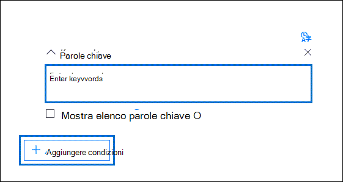

# Generare query insieme di ricerca in Advanced eDiscoveryBuild search collection queries in Advanced eDiscovery

Durante la creazione di query di ricerca per la raccolta di dati in un caso avanzato di eDiscovery, è possibile utilizzare parole chiave per trovare contenuti e condizioni specifici per limitare l'ambito della ricerca per restituire gli elementi più rilevanti per la propria indagine legale.When building search queries to collect data in an Advanced eDiscovery case, you can use keywords to find specific content and conditions to narrow the scope of the search to return items that are most relevant to your legal investigation.

## Ricerche di parole chiaveKeyword searches

Digitare una query di parole chiave nella casella **Keywords** della query di ricerca.Type a keyword query in the **Keywords** box in the search query. È possibile specificare le parole chiave, le proprietà del messaggio di posta elettronica, ad esempio le date inviate e ricevute, o le proprietà del documento, ad esempio i nomi di file o la data dell'Ultima modifica di un documento.You can specify keywords, email message properties, such as sent and received dates, or document properties, such as file names or the date that a document was last changed. È anche possibile usare query più complesse che usano un operatore booleano, ad esempio **AND**, **OR**, **NOT** o **NEAR**.You can use more complex queries that use a Boolean operator, such as **AND**, **OR**, **NOT**, and **NEAR**. È inoltre possibile cercare informazioni riservate (ad esempio i numeri di previdenza sociale) nei documenti di SharePoint e OneDrive (non nei messaggi di posta elettronica) oppure cercare documenti che sono stati condivisi esternamente.You can also search for sensitive information (such as social security numbers) in documents in SharePoint and OneDrive (not in email messages), or search for documents that have been shared externally. Se si lascia vuota la casella **parole chiave** , tutto il contenuto che si trova nei percorsi di contenuto specificato è incluso nei risultati della ricerca.If you leave the **Keywords** box empty, all content located in the specified content locations is in the search results.

## Elenco di parole chiaveKeyword list

In alternativa, è possibile selezionare la casella di controllo **Mostra elenco parole chiave** e digitare una parola chiave o una frase di parole chiave in ogni riga.Alternatively, you can select the **Show keyword list** check box and the type a keyword or keyword phrase in each row. Le parole chiave in ogni riga sono connesse da un operatore logico, rappresentato come *c:s* nella sintassi della query di ricerca, che è simile alla funzionalità all'operatore **or** nella query di ricerca creata.The keywords in each row are connected by a logical operator (which is represented as *c:s* in the search query syntax) that is similar in functionality to the **OR** operator in the search query that's created. Questo significa che gli elementi che contengono qualsiasi parola chiave in qualsiasi riga sono inclusi nei risultati della ricerca.This means items that contain any keyword in any row are in the search results. È possibile aggiungere fino a 180 righe nell'elenco delle parole chiave nelle query avanzate di ricerca di eDiscovery.You can add up to 180 rows in the keyword list in Advanced eDiscovery search queries.

Perché usare l'elenco di parole chiave?Why use the keyword list? È possibile ottenere statistiche che mostrano quanti elementi corrispondono a ciascuna parola chiave nell'elenco delle parole chiave.You can get statistics that show how many items match each keyword in the keyword list. In questo modo è possibile identificare rapidamente le parole chiave più (e meno) effettive.This can help you quickly identify the keywords that are the most (and least) effective. È inoltre possibile utilizzare una frase parola chiave (racchiusa tra parentesi) in una riga dell'elenco parole chiave.You can also use a keyword phrase (surrounded by parentheses) in a row in the keywords list. Per ulteriori informazioni sulle statistiche di ricerca, vedere [Search Statistics](search-statistics-in-advanced-ediscovery.md).For more information about search statistics, see [Search statistics](search-statistics-in-advanced-ediscovery.md).

## CondizioniConditions

È possibile aggiungere condizioni di ricerca per limitare l'ambito di una ricerca e restituire un insieme di risultati più raffinato.You can add search conditions to narrow the scope of a search and return a more refined set of results. Ogni condizione aggiunge una clausola alla query di ricerca creata ed eseguita all'avvio della ricerca.Each condition adds a clause to the search query that is created and run when you start the search. Una condizione è connessa logicamente alla query di parole chiave specificata nella casella parola chiave da un operatore logico (rappresentato come *c:c* nella sintassi della query di ricerca) simile alla funzionalità all'operatore **and** .A condition is logically connected to the keyword query specified in the keyword box by a logical operator (which is represented as *c:c* in the search query syntax) that is similar in functionality to the **AND** operator. Questo significa che gli elementi devono soddisfare sia la query con parole chiave sia una o più condizioni da includere nei risultati della ricerca.That means items have to satisfy both the keyword query and one or more conditions to be included in the search results. Ecco in che modo le condizioni aiutano a limitare i risultati.This is how conditions help to narrow your results. Per un elenco e una descrizione delle condizioni che è possibile utilizzare in una query di ricerca, vedere la sezione "condizioni di ricerca" in [query di parole chiave e condizioni di ricerca](keyword-queries-and-search-conditions.md#search-conditions).For a list and description of conditions that you can use in a search query, see the "Search conditions" section in [Keyword queries and search conditions](keyword-queries-and-search-conditions.md#search-conditions).
