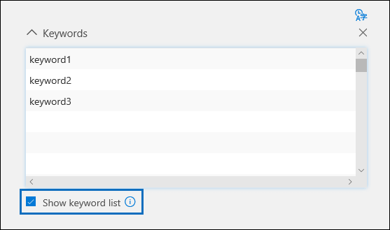

# Creare query di raccolta di ricerca in Advanced eDiscoveryBuild search collection queries in Advanced eDiscovery

Quando si compilano query di ricerca per raccogliere dati in un caso di Advanced eDiscovery, è possibile utilizzare le parole chiave per trovare contenuti e condizioni specifici per restringere l'ambito della ricerca per restituire gli elementi più rilevanti per l'indagine legale.When building search queries to collect data in an Advanced eDiscovery case, you can use keywords to find specific content and conditions to narrow the scope of the search to return items that are most relevant to your legal investigation.

## Ricerche con parole chiaveKeyword searches

Digitare una query con parole chiave nella **casella Parole** chiave della query di ricerca.Type a keyword query in the **Keywords** box in the search query. È possibile specificare parole chiave, proprietà dei messaggi di posta elettronica, ad esempio date di invio e ricezione, oppure proprietà del documento, ad esempio i nomi di file o la data dell'ultima modifica di un documento.You can specify keywords, email message properties, such as sent and received dates, or document properties, such as file names or the date that a document was last changed. È anche possibile usare query più complesse che usano un operatore booleano, ad esempio **AND**, **OR**, **NOT** o **NEAR**.You can use more complex queries that use a Boolean operator, such as **AND**, **OR**, **NOT**, and **NEAR**. È inoltre possibile cercare informazioni riservate (ad esempio numeri di previdenza sociale) nei documenti in SharePoint e OneDrive (non nei messaggi di posta elettronica) o cercare documenti condivisi esternamente.You can also search for sensitive information (such as social security numbers) in documents in SharePoint and OneDrive (not in email messages), or search for documents that have been shared externally. Se si lascia vuota **la casella Parole** chiave, tutto il contenuto che si trova nei percorsi di contenuto specificati si trova nei risultati della ricerca.If you leave the **Keywords** box empty, all content located in the specified content locations is in the search results.

## Elenco di parole chiaveKeyword list

In alternativa, è  possibile selezionare la casella di controllo Mostra elenco parole chiave e digitare una parola chiave o una frase parola chiave in ogni riga.Alternatively, you can select the **Show keyword list** check box and the type a keyword or keyword phrase in each row. Le parole chiave in ogni riga sono connesse da un operatore logico (rappresentato come *c:s* nella sintassi della query di ricerca) che ha funzionalità simili all'operatore **OR** nella query di ricerca creata.The keywords in each row are connected by a logical operator (which is represented as *c:s* in the search query syntax) that is similar in functionality to the **OR** operator in the search query that's created. Ciò significa che gli elementi che contengono qualsiasi parola chiave in qualsiasi riga sono presenti nei risultati della ricerca.This means items that contain any keyword in any row are in the search results. È possibile aggiungere fino a 180 righe nell'elenco delle parole chiave nelle query di ricerca advanced eDiscovery.You can add up to 180 rows in the keyword list in Advanced eDiscovery search queries.

Perché usare l'elenco di parole chiave?Why use the keyword list? Puoi ottenere statistiche che mostrano il numero di elementi che corrispondono a ogni parola chiave nell'elenco delle parole chiave.You can get statistics that show how many items match each keyword in the keyword list. Ciò consente di identificare rapidamente le parole chiave più (e meno efficaci).This can help you quickly identify the keywords that are the most (and least) effective. È inoltre possibile utilizzare una frase parola chiave (racchiusa tra parentesi) in una riga dell'elenco delle parole chiave.You can also use a keyword phrase (surrounded by parentheses) in a row in the keywords list. Per ulteriori informazioni sulle statistiche di ricerca, vedere [Statistiche della ricerca.](search-statistics-in-advanced-ediscovery.md)For more information about search statistics, see [Search statistics](search-statistics-in-advanced-ediscovery.md).

## CondizioniConditions

È possibile aggiungere condizioni di ricerca per restringere l'ambito di una ricerca e restituire un set di risultati più perfezionato.You can add search conditions to narrow the scope of a search and return a more refined set of results. Ogni condizione aggiunge una clausola alla query di ricerca creata ed eseguita all'avvio della ricerca.Each condition adds a clause to the search query that is created and run when you start the search. Una condizione è collegata logicamente alla query con parole chiave specificata nella casella delle parole chiave da un operatore logico (rappresentato come *c:c* nella sintassi della query di ricerca) che ha funzionalità simili all'operatore **AND.**A condition is logically connected to the keyword query specified in the keyword box by a logical operator (which is represented as *c:c* in the search query syntax) that is similar in functionality to the **AND** operator. Ciò significa che gli elementi devono soddisfare sia la query con parole chiave che una o più condizioni da includere nei risultati della ricerca.That means items have to satisfy both the keyword query and one or more conditions to be included in the search results. Ecco in che modo le condizioni aiutano a limitare i risultati.This is how conditions help to narrow your results. Per un elenco e una descrizione delle condizioni che è possibile utilizzare in una query di ricerca, vedere la sezione "Condizioni di ricerca" in Query con parole chiave [e condizioni di ricerca.](keyword-queries-and-search-conditions.md#search-conditions)For a list and description of conditions that you can use in a search query, see the "Search conditions" section in [Keyword queries and search conditions](keyword-queries-and-search-conditions.md#search-conditions).
