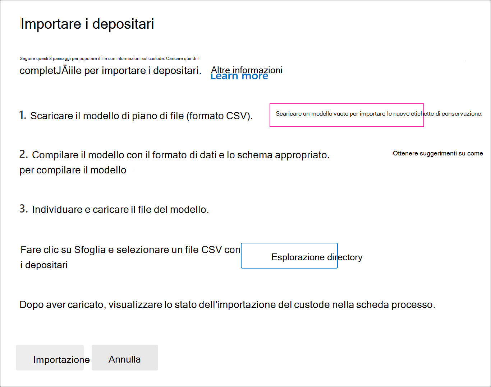

# Importare i responsabile in un caso di Advanced eDiscovery

Per i casi di Advanced eDiscovery che coinvolgono molti amministratori, è possibile importare più amministratori contemporaneamente utilizzando un file CSV contenente le informazioni necessarie per aggiungerli a un caso.

## Importare i responsabile

1. Aprire il caso advanced eDiscovery e selezionare la **scheda Origini** dati.

2. Fare **clic su Aggiungi responsabile dell'importazione**  >  **dell'origine dati.**

3. Nella pagina **a comparsa Importa i responsabile** fare clic su Scarica un modello **vuoto** per scaricare un file CSV del modello di responsabile.

   

4. Aggiungere le informazioni del responsabile al file CSV e salvarle nel computer locale. Per informazioni sulle proprietà necessarie nel [file CSV,](#custodian-csv-file) vedere la sezione relativa al file CSV del responsabile.

5. Dopo aver preparato il file CSV con le informazioni  del responsabile, tornare alla scheda Origini dati e fare di nuovo clic su Aggiungi responsabile dell'importazione  >  **dell'origine** dati.

6. Nella pagina **a comparsa Importa i responsabile** fare clic su **Sfoglia** e quindi caricare il file CSV contenente le informazioni sui responsabile.

   Dopo il caricamento del file CSV, viene creato e visualizzato un processo denominato **BulkAddCustodian** nella **scheda Processi.** Il processo convalida i responsabile e le origini dati associate e quindi li aggiunge alla **pagina Origini** dati del caso.

## File CSV del responsabile

Dopo aver scaricato il modello di responsabile CSV, è possibile aggiungere i responsabile e l'origine dati corrispondente in ogni riga. Assicurarsi di non modificare i nomi delle colonne nella riga di intestazione. Utilizzare le colonne tipo di carico di lavoro e posizione del carico di lavoro per associare altre origini dati a un responsabile.

| Nome colonna|Descrizione|
|:------- |:------------------------------------------------------------|
|**Contatto responsabileEmail**     |Indirizzo di posta elettronica UPN del responsabile. Ad esempio, sarad@contoso.onmicrosoft.com.           |
|**Exchange abilitato** | Valore TRUE/FALSE per includere o non includere la cassetta postale del responsabile.      |
|**OneDrive abilitato** | Valore TRUE/FALSE per includere o non includere l'account OneDrive for Business del responsabile. |
|**Is OnHold**        | Valore TRUE/FALSE per indicare se le origini dati del responsabile devono essere in attesa.       |
|**Tipo Carico di lavoro1**         |Valore stringa che indica il tipo di origine dati da associare al responsabile. I valori possibili includono:  - ExchangeMailbox  - SharePointSite - TeamsMailbox - TeamsSite  - YammerMailbox - YammerSite |
|**Posizione carico di lavoro 1**     | A seconda del tipo di carico di lavoro, si tratta della posizione dell'origine dati. Ad esempio, l'indirizzo di posta elettronica per una cassetta postale di Exchange o l'URL di un sito di SharePoint. |
|||

Ecco un esempio di un file CSV con le informazioni del responsabile:  

|Contatto responsabileEmail      | Exchange abilitato | OneDrive abilitato | Is OnHold | Tipo Carico di lavoro1 | Posizione carico di lavoro 1             |
| ----------------- | ---------------- | ---------------- | --------- | -------------- | ------------------------------ |
|robinc@onmicrosoft.contoso.com | TRUE             | TRUE             | TRUE      | SharePointSite | https://contoso.sharepoint.com |
|pillarp@onmicrosoft.contoso.com | TRUE             | TRUE             | TRUE      | |  |
||||||

## Convalida del responsabile e dell'origine dati

Dopo aver caricato il file CSV del responsabile, Advanced eDiscovery esegue le operazioni seguenti:

1. Convalida i responsabile e le relative origini dati.

2. Indicizza tutte le origini dati per ogni responsabile e le mette in attesa (se la proprietà **Is OnHold** nel file CSV è impostata su TRUE).

### Convalida del responsabile

Attualmente, microsoft supporta solo l'importazione di responsabile inclusi in Azure Active Directory (Azure AD) dell'organizzazione.

Lo strumento di importazione dei responsabile trova e convalida i responsabile utilizzando il valore UPN nella colonna **ContactEmail** del responsabile nel file CSV. I responsabile convalidati vengono aggiunti automaticamente al caso ed elencati nella **scheda Origini** dati del caso. Se un responsabile non può essere convalidato, viene elencato nel registro errori per il  processo BulkAddCustodian elencato nella scheda Processi. I responsabile non convalidati non vengono aggiunti al caso o elencati nella **scheda Origini** dati.

### Convalida dell'origine dati

Dopo che i responsabile vengono convalidati e aggiunti al caso, vengono aggiunti ogni cassetta postale principale e ogni account di OneDrive associato a un responsabile.

Tuttavia, se non è possibile trovare altre origini dati (ad esempio siti di SharePoint, Microsoft Teams, gruppi di Microsoft 365 o gruppi di  Yammer) associate a un  responsabile, nessuna di esse viene assegnata al responsabile e il valore Non convalidato viene visualizzato nella colonna Stato accanto al responsabile nella scheda Origini **dati.**

Per aggiungere origini dati convalidate per un responsabile:

1. Nella scheda **Origini dati** selezionare un responsabile che contiene origini dati non convalidate.

2. Nella pagina del riquadro a comparsa  del responsabile scorrere fino alla sezione Posizioni del responsabile per visualizzare sia le origini dati convalidate che le origini dati non convalidate associate al responsabile.

3. Fare **clic su** Modifica nella parte superiore della pagina a comparsa per rimuovere origini dati non valide o aggiungerne di nuove.

4. Dopo aver rimosso le origini dati non convalidate o averne  aggiunto una nuova, il valore **Attivo** viene visualizzato nella colonna Stato del responsabile nella **scheda Origini** dati. Per aggiungere origini che in precedenza non erano valide, segui i passaggi di correzione seguenti per aggiungerle manualmente a un responsabile.

### Correzione di origini dati non valide

Per aggiungere e associare manualmente un'origine dati precedentemente non valida:

1. Nella scheda **Origini dati selezionare** un responsabile per aggiungere e associare manualmente un'origine dati precedentemente non valida.

2. Fare **clic** su Modifica nella parte superiore della pagina del riquadro a comparsa per associare cassette postali, siti, gruppi di Teams o Yammer al responsabile. A tale scopo, fare **clic su Modifica** accanto al tipo di percorso dati appropriato.

3. Fare **clic su** Avanti per visualizzare la pagina delle impostazioni **di** blocco e configurare l'impostazione di blocco per le origini dati aggiunte.

4. Fare **clic** su Avanti per visualizzare **la pagina Rivedi** i revisori e quindi su **Invia** per salvare le modifiche.
