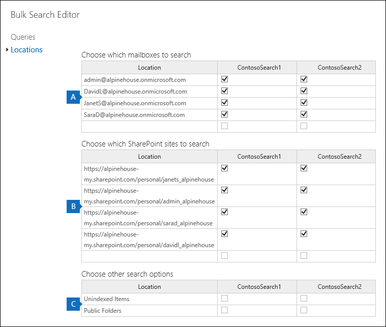

# Modifica in blocco delle ricerche di contenuto

È possibile utilizzare l'editor di ricerca in blocco nello strumento Ricerca contenuto per modificare più ricerche contemporaneamente. L'utilizzo di questo strumento consente di modificare rapidamente i percorsi delle query e del contenuto per una o più ricerche. È quindi possibile eseguire di nuovo le ricerche e ottenere nuovi risultati di ricerca stimati per le ricerche riviste. L'editor consente inoltre di copiare e incollare query e percorsi di contenuto da un file o da un file di testo di Microsoft Excel. Ciò significa che è possibile utilizzare lo strumento Statistiche di ricerca per visualizzare le statistiche di una o più ricerche, esportare le statistiche in un file CSV, dove è possibile modificare le query e i percorsi dei contenuti in Excel. È quindi possibile utilizzare l'editor di ricerca in blocco per aggiungere le query riviste e i percorsi del contenuto alle ricerche. Dopo aver rivisto una o più ricerche, è possibile riavviarle e ottenere nuovi risultati di ricerca stimati.
  
Per ulteriori informazioni sull'utilizzo dello strumento Statistiche di ricerca, vedere Visualizzare le statistiche [delle parole chiave per i risultati della ricerca di contenuto.](view-keyword-statistics-for-content-search.md)
  
## Utilizzare l'editor di ricerca in blocco per modificare le query

1. Passare a [https://protection.office.com](https://protection.office.com) e  quindi selezionare Ricerca \> **contenuto.**
    
2. Nell'elenco delle ricerche, selezionare una o più ricerche, quindi selezionare il pulsante **Bulk Search Editor** Bulk Search Editor  .
    
    
  
    Le informazioni seguenti vengono visualizzate nella pagina **Query** dell'editor di ricerca in blocco. 
    
    
  
    a. Nella **colonna Ricerca** viene visualizzato il nome della ricerca di contenuto. Come indicato in precedenza, è possibile modificare la query per più ricerche. 
    
    b. Nella **colonna Query** viene visualizzata la query per la ricerca di contenuto elencata nella colonna **Ricerca.** Se la query è stata creata utilizzando la caratteristica elenco di parole chiave, le parole chiave sono separate dal testo ** `(c:s)` **. Ciò indica che le parole chiave sono connesse dall'operatore **OR.** Inoltre, se la query `(c:c)` include condizioni,** le parole chiave e le condizioni sono separate dal testo ** . Ciò indica che le parole chiave (o le fasi delle parole chiave) sono connesse alle condizioni dall'operatore **AND.** Ad esempio, nello screenshot precedente la query di ricerca ContosoSearch1, la query KQL equivalente  `customer (c:s) pricing(c:c)(date=2000-01-01..2016-09-30)` a sarebbe  `(customer OR pricing) AND (date=2002-01-01..2016-09-30)` .
    
3. Per modificare una query, selezionare nella cella della query che si desidera modificare ed eseguire una delle operazioni seguenti. Quando viene selezionata, alla cella viene visualizzata una casella blu.
    
   - Digitare la nuova query nella cella. Non è possibile modificare una parte della query. È necessario digitare l'intera query.
    
      Oppure
    
    - Incollare una nuova query nella cella. Si presuppone che il testo della query sia stato copiato da un file, ad esempio un file di testo o un file di Excel.
    
4. Dopo aver modificato una o più query nella **pagina** Query, selezionare **Salva.**
    
    La query modificata viene visualizzata nella colonna **Query** per la ricerca selezionata. 
    
5. Selezionare **Chiudi** per chiudere l'editor di ricerca in blocco. 
    
6. Nella pagina **Ricerca contenuto** selezionare la ricerca modificata  e quindi avviare la ricerca per riavviare la ricerca utilizzando la query modificata. 
    
Ecco alcuni suggerimenti per la modifica delle query tramite l'editor di ricerca in blocco:
  
- Copiare la query esistente utilizzando **CTRL+C** in un file di testo. Modificare la query nel file di testo, quindi copiare la query modificata e incollarla (utilizzando **CTRL+V)** di nuovo nella cella della **pagina** Query. 
    
- È inoltre possibile copiare query da altre applicazioni, ad esempio Microsoft Word o Microsoft Excel. Tuttavia, è possibile aggiungere inavvertitamente caratteri non supportati a una query utilizzando l'editor di ricerca in blocco. Il modo migliore per evitare caratteri non supportati è semplicemente digitare la query in una cella della **pagina** Query. Oppure è possibile copiare una query da Word o Excel e quindi incollarla in un file in un editor di testo normale, ad esempio Blocco note Microsoft. Salvare quindi il file di testo e selezionare **ANSI** **nell'elenco a** discesa Codifica. In questo modo viene rimossa la formattazione e i caratteri non supportati. È quindi possibile copiare e incollare la query dal file di testo alla **pagina** Query. 
    
  
## Utilizzare l'editor di ricerca in blocco per modificare i percorsi dei contenuti

1. Nell'editor di ricerca in blocco per una o più ricerche  selezionate, selezionare Abilita **l'editor** delle posizioni in blocco e quindi selezionare il collegamento Posizioni visualizzato nella pagina. 
    
    Le informazioni seguenti vengono visualizzate nella pagina **Percorsi** dell'editor di ricerca in blocco. 
    
    
  
    a. **Cassette postali in cui eseguire la ricerca** In questa sezione viene visualizzata una colonna per ogni ricerca contenuto selezionata e una riga per ogni cassetta postale inclusa nella ricerca. Un segno di spunta indica che la cassetta postale è inclusa nella ricerca. È possibile aggiungere cassette postali a una ricerca digitando l'indirizzo di posta elettronica della cassetta postale in una riga vuota e quindi selezionando la casella di controllo per la Ricerca contenuto a cui si desidera aggiungerla. Oppure è possibile rimuovere una cassetta postale da una ricerca deselezionando la casella di controllo.
    
    b. **Siti di SharePoint in cui eseguire la ricerca** In questa sezione viene visualizzata una riga per ogni sito di SharePoint e OneDrive incluso in ogni ricerca contenuto selezionata. Un segno di spunta indica che il sito è incluso nella ricerca. È possibile aggiungere siti a una ricerca digitando l'URL del sito in una riga vuota e quindi selezionando la casella di controllo per la ricerca di contenuto a cui si desidera aggiungerlo. In altri termini, è possibile rimuovere un sito da una ricerca deselezionando la casella di controllo.
    
    c. **Altre opzioni di ricerca** Questa sezione indica se gli elementi non indicizzati e le cartelle pubbliche sono inclusi nella ricerca. Per includerle, verificare che la casella di controllo sia selezionata. Per rimuoverli, deselezionare la casella di controllo.
    
2. Dopo aver modificato una o più sezioni nella **pagina** Posizioni, selezionare **Salva.**
    
    I percorsi dei contenuti rivisti vengono visualizzati nella sezione appropriata per le ricerche selezionate.
    
3. Selezionare **Chiudi** per chiudere l'editor di ricerca in blocco. 
    
4. Nella pagina **Ricerca contenuto** selezionare la ricerca modificata  e quindi avviare la ricerca per riavviare la ricerca utilizzando i percorsi dei contenuti modificati. 
    
Ecco alcuni suggerimenti per la modifica dei percorsi di contenuto tramite l'editor di ricerca in blocco:
  
- È possibile modificare le ricerche di contenuto per eseguire ricerche in tutte  le cassette postali o in tutti i siti dell'organizzazione digitando **Tutto** in una riga vuota nella sezione Cassette postali in cui eseguire la ricerca o nei siti di **SharePoint** in cui eseguire la ricerca e quindi selezionando la casella di controllo. 
    
- È possibile aggiungere più percorsi di contenuto a una o più ricerche copiando più righe da un file di testo o da un file di Excel e incollandole in una sezione della **pagina** Percorsi. Dopo aver aggiunto nuove posizioni, assicurarsi di selezionare la casella di controllo per ogni ricerca a cui si desidera aggiungere la posizione. 
    
    > [!TIP]
    > Per generare un elenco di indirizzi di posta elettronica per tutti gli utenti dell'organizzazione, eseguire il comando PowerShell nel passaggio 2 del [passaggio 2:](search-the-mailbox-and-onedrive-for-business-for-a-list-of-users.md#step-2-generate-a-list-of-users)generare un elenco di utenti. Oppure seguire i passaggi descritti in Ottenere un elenco di tutti gli URL di [OneDrive](https://docs.microsoft.com/onedrive/list-onedrive-urls) dell'utente nell'organizzazione per generare un elenco di tutti i siti di OneDrive for Business nell'organizzazione. Si noti che sarà necessario aggiungere l'URL per il dominio MySite dell'organizzazione (ad esempio, ai siti di OneDrive for Business creati https://contoso-my.sharepoint.com) dallo script. Dopo aver creato un elenco di indirizzi di posta elettronica o  siti di OneDrive for Business, è possibile copiarli e incollarli nella pagina Posizioni nell'editor di ricerca in blocco. 
  
- Dopo aver selezionato **Salva per** salvare le modifiche nell'editor di ricerca in blocco, verrà convalidato l'indirizzo di posta elettronica per le cassette postali aggiunte a una ricerca. Se l'indirizzo di posta elettronica non esiste, viene visualizzato un messaggio di errore che indica che non è possibile trovare la cassetta postale. Gli URL dei siti non vengono convalidati. 
  

