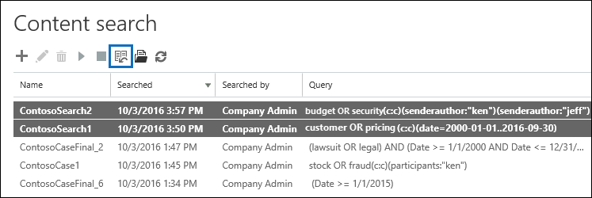

# Modifica in blocco delle ricerche di contenutoBulk edit Content Searches

È possibile utilizzare l'editor ricerca in blocco nello strumento ricerca contenuto per modificare più ricerche contemporaneamente.You can use the Bulk Search Editor in the Content Search tool to edit multiple searches at the same time. L'utilizzo di questo strumento consente di modificare rapidamente la query e i percorsi di contenuto per una o più ricerche.Using this tool lets you quickly change the query and content locations for one or more searches. È quindi possibile eseguire di nuovo le ricerche e ottenere nuovi risultati della ricerca stimati per le ricerche rivedute.Then you can rerun the searches and get new estimated search results for the revised searches. L'editor consente inoltre di copiare e incollare query e percorsi di contenuto da un file di testo o da un file di Microsoft Excel.The editor also lets you copy and paste queries and content locations from a Microsoft Excel file or text file. Questo significa che è possibile utilizzare lo strumento Statistiche di ricerca per visualizzare le statistiche di una o più ricerche, esportare le statistiche in un file CSV, in cui è possibile modificare le query e i percorsi di contenuto in Excel.This means you can use the Search Statistics tool to view the statistics of one or more searches, export the statistics to a CSV file, where you can edit the queries and content locations in Excel. Successivamente, utilizzare l'editor ricerche in blocco per aggiungere le query e i percorsi di contenuto rivisti alle ricerche.Then you use the Bulk Search Editor to add the revised queries and content locations to the searches. Dopo aver rivisto una o più ricerche, è possibile riavviarle e ottenere nuovi risultati della ricerca stimati.After you've revised one or more searches, you can restart them and get new estimated search results.
  
Per ulteriori informazioni sull'utilizzo dello strumento Statistiche di ricerca, vedere [View keyword Statistics for content search results](view-keyword-statistics-for-content-search.md).For more information about using the Search Statistics tool, see [View keyword statistics for Content Search results](view-keyword-statistics-for-content-search.md).
  
## Utilizzare l'editor ricerche in blocco per modificare le queryUse the Bulk Search Editor to change queries

1. Andare a [https://protection.office.com](https://protection.office.com), quindi selezionare ricerca **Search** \> **contenuto**ricerca.Go to [https://protection.office.com](https://protection.office.com), and then select **Search** \> **Content search**.
    
2. Nell'elenco delle ricerche, selezionare una o più ricerche, quindi selezionare il pulsante **Bulk Search Editor** editor ricerca bulk editor ricerche in blocco.In the list of searches, select one or more searches, and then select **Bulk Search Editor** .
    
    
  
    Nella pagina **query** dell'editor ricerche in blocco vengono visualizzate le informazioni seguenti.The following information is displayed on the **Queries** page of the Bulk Search Editor. 
    
    
  
    a.a. Nella colonna **ricerca** viene visualizzato il nome della ricerca di contenuto.The **Search** column displays the name of the Content Search. Come indicato in precedenza, è possibile modificare la query per più ricerche.As previously stated, you can edit the query for multiple searches. 
    
    b.b. La colonna **query** Visualizza la query per la ricerca di contenuto elencata nella colonna **ricerca** .The **Query** column displays the query for the Content Search listed in the **Search** column. Se la query è stata creata utilizzando la caratteristica elenco di parole chiave, la parola chiave viene separata dal `(c:s)`testo \* \* \*\*. Ciò indica che le parole chiave sono connesse tramite l'operatore **or** . Inoltre, se la query include condizioni, le parole chiave e le condizioni sono separate dal testo \* \* `(c:c)` \*\*.If the query was created using the keyword list feature, the keywords are separated by the text \*\* `(c:s)`**. This indicates that the keywords are connected by the **OR** operator. Additionally, if the query includes conditions, the keywords and the conditions are separated by the text \*\* `(c:c)`**. Ciò indica che le parole chiave (o fasi parola chiave) sono connesse alle condizioni dall'operatore **and** .This indicates that the keywords (or keyword phases) are connected to the conditions by the **AND** operator. Ad esempio, nella schermata precedente per la ricerca ContosoSearch1, la query KQL equivalente a `customer (c:s) pricing(c:c)(date=2000-01-01..2016-09-30)` sarebbe. `(customer OR pricing) AND (date=2002-01-01..2016-09-30)`For example, in the previous screenshot the for search ContosoSearch1, the KQL query that is equivalent to  `customer (c:s) pricing(c:c)(date=2000-01-01..2016-09-30)` would be  `(customer OR pricing) AND (date=2002-01-01..2016-09-30)`.
    
3. Per modificare una query, selezionare nella cella della query che si desidera modificare e quindi eseguire una delle operazioni seguenti.To edit a query, select in the cell of the query that you want to change and doing one of the following things. La cella è delimitata da una casella blu quando la si seleziona.The cell is bordered by a blue box when you select it.
    
   - Digitare la nuova query nella cella.Type the new query in the cell. Non è possibile modificare una parte della query.You can't edit a portion of the query. È necessario digitare l'intera query.You have to type the entire query.
    
      OppureOr
    
    - Incollare una nuova query nella cella.Paste a new query in the cell. In questo modo si presuppone che il testo della query sia stato copiato da un file, ad esempio un file di testo o un file di Excel.This assumes that you've copied the query text from a file, such as a text file or an Excel file.
    
4. Dopo aver modificato una o più query nella pagina **query** , fare clic su **Salva**.After you've edited one or more queries on the **Queries** page, select **Save**.
    
    La query riveduta viene visualizzata nella colonna **query** per la ricerca selezionata.The revised query is displayed in the **Query** column for the selected search. 
    
5. Selezionare **Chiudi** per chiudere l'editor ricerche in blocco.Select **Close** to close the Bulk Search Editor. 
    
6. Nella pagina **Ricerca contenuto** , selezionare la ricerca modificata e quindi fare clic su **Avvia** ricerca per riavviare la ricerca utilizzando la query riveduta.On the **Content search** page, select the search that you edited, and select **Start** search to restart the search using the revised query. 
    
Di seguito sono riportate alcune indicazioni per la modifica delle query tramite l'editor ricerca in blocco:Here are some tips for editing queries using the Bulk Search Editor:
  
- Copiare la query esistente (tramite **CTRL C** ) in un file di testo.Copy the existing query (by using **Ctrl C** ) to a text file. Modificare la query nel file di testo e quindi copiare la query riveduta e incollarla (utilizzando **CTRL V** ) nuovamente nella cella della pagina **query** .Edit the query in the text file, and then copy the revised query and paste it (using **Ctrl V** ) back into the cell on the **Queries** page. 
    
- È anche possibile copiare le query da altre applicazioni, ad esempio Microsoft Word o Microsoft Excel.You can also copy queries from other applications (such as Microsoft Word or Microsoft Excel). Tuttavia, è possibile aggiungere inavvertitamente caratteri non supportati a una query utilizzando l'editor ricerche in blocco.However, you might inadvertently add unsupported characters to a query using the Bulk Search Editor. Il modo migliore per evitare che i caratteri non supportati consiste nel digitare semplicemente la query in una cella della pagina **query** .The best way to prevent unsupported characters is to just type the query in a cell on the **Queries** page. In alternativa, è possibile copiare una query da Word o Excel e incollarla nel file in un editor di testo normale, ad esempio il blocco note Microsoft.Or you can copy a query from Word or Excel and then paste it to file in a plain text editor, such as Microsoft Notepad. Salvare quindi il file di testo e selezionare **ANSI** nell'elenco a discesa **Encoding** .Then save the text file and select **ANSI** in the **Encoding** drop-down list. In questo caso vengono rimossi tutti i caratteri di formattazione e non supportati.This removes any formatting and unsupported characters. È quindi possibile copiare e incollare la query dal file di testo alla pagina **query** .Then you can copy and paste the query from the text file to the **Queries** page. 
    
  
## Utilizzare l'editor ricerche in blocco per modificare le posizioni di contenutoUse the Bulk Search Editor to change content locations

1. Nell'editor ricerche di massa per una o più ricerche selezionate selezionare **Abilita editor percorso di massa**e quindi selezionare il collegamento **percorsi** visualizzato nella pagina.In the Bulk Search Editor for one or more selected searches, select **Enable bulk location editor**, and then select the **Locations** link that is displayed on the page. 
    
    Nella pagina **percorsi** dell'editor ricerche in blocco vengono visualizzate le informazioni seguenti.The following information is displayed on the **Locations** page of the Bulk Search Editor. 
    
    
  
    a.a. **Cassette postali da cercare** In questa sezione viene visualizzata una colonna per ogni ricerca di contenuto selezionata e una riga per ogni cassetta postale inclusa nella ricerca.**Mailboxes to search** This section displays a column for each selected Content Search and a row for each mailbox that's included in the search. Un segno di spunta indica che la cassetta postale è inclusa nella ricerca.A check mark indicates that the mailbox is included in the search. È possibile aggiungere cassette postali a una ricerca digitando l'indirizzo di posta elettronica della cassetta postale in una riga vuota e quindi selezionando la casella di controllo per la ricerca di contenuto a cui si desidera aggiungerla.You can add mailboxes to a search by typing the email address of the mailbox in a blank row and then selecting the check box for the Content Search that you want to add it to. In alternativa, è possibile rimuovere una cassetta postale da una ricerca deselezionando la casella di controllo.Or you can remove a mailbox from a search by clearing the check box.
    
    b.b. **Siti di SharePoint da cercare** In questa sezione viene visualizzata una riga per ogni sito di SharePoint e OneDrive incluso in ogni ricerca contenuto selezionata.**SharePoint sites to search** This section displays a row for each SharePoint and OneDrive site that's included in each selected Content Search. Un segno di spunta indica che il sito è incluso nella ricerca.A check mark indicates that the site is included in the search. È possibile aggiungere siti a una ricerca digitando l'URL del sito in una riga vuota e quindi selezionando la casella di controllo per la ricerca di contenuto a cui si desidera aggiungerla.You can add sites to a search by typing the URL for the site in a blank row and then selecting the check box for the Content Search that you want to add it to. In alternativa, è possibile rimuovere un sito da una ricerca deselezionando la casella di controllo.Or you can remove a site from a search by clearing the check box.
    
    c.c. **Altre opzioni di ricerca** In questa sezione viene indicato se nella ricerca vengono inclusi gli elementi non indicizzati e le cartelle pubbliche.**Other search options** This section indicates whether unindexed items and public folders are included in the search. Per includerle, verificare che sia selezionata la casella di controllo.To include them, make sure the check box is selected. Per rimuoverle, deselezionare la casella di controllo.To remove them, clear the check box.
    
2. Dopo aver modificato una o più sezioni della pagina **posizioni** , selezionare **Salva**.After you've edited one or more of the sections on the **Locations** page, select **Save**.
    
    I percorsi di contenuto rivisti sono visualizzati nella sezione appropriata per le ricerche selezionate.The revised content locations are displayed in the appropriate section for the selected searches.
    
3. Selezionare **Chiudi** per chiudere l'editor ricerche in blocco.Select **Close** to close the Bulk Search Editor. 
    
4. Nella pagina **Ricerca contenuto** , selezionare la ricerca modificata e quindi fare clic su **Avvia** ricerca per riavviare la ricerca utilizzando i percorsi di contenuto riveduti.On the **Content search** page, select the search that you edited, and select **Start** search to restart the search using the revised content locations. 
    
Di seguito sono riportate alcune indicazioni per la modifica delle posizioni di contenuto tramite l'editor ricerca in blocco:Here are some tips for editing content locations using the Bulk Search Editor:
  
- È possibile modificare le ricerche di contenuto per eseguire la ricerca in tutte le cassette postali o i siti dell'organizzazione digitando **tutto** in una riga vuota nelle **cassette postali per cercare** i **siti di SharePoint** e la sezione ricerca e quindi selezionando la casella di controllo.You can edit Content Searches to search all mailboxes or sites in the organization by typing **All** in a blank row in the **Mailboxes to search** or **SharePoint sites to search** section and then selecting the check box. 
    
- È possibile aggiungere più percorsi di contenuto a una o più ricerche copiando più righe da un file di testo o da un file di Excel e quindi incollando tali posizioni in una sezione della pagina **percorsi** .You can add multiple content locations to one or more searches by copying multiple rows from a text file or an Excel file and then pasting them in a section on the **Locations** page. Dopo aver aggiunto nuove posizioni, assicurarsi di selezionare la casella di controllo per ogni ricerca per la quale si desidera aggiungere il percorso.After you add new locations, be sure to select the check box for each search that you want add the location to. 
    
    > [!TIP]
    > Per generare un elenco di indirizzi di posta elettronica per tutti gli utenti dell'organizzazione, eseguire il comando PowerShell nel passaggio 2 del [passaggio 2: generazione di un elenco di utenti](search-the-mailbox-and-onedrive-for-business-for-a-list-of-users.md#step-2-generate-a-list-of-users).To generate a list of email addresses for all the users in your organization, run the PowerShell command in Step 2 in [Step 2: Generate a list of users](search-the-mailbox-and-onedrive-for-business-for-a-list-of-users.md#step-2-generate-a-list-of-users). In alternativa, seguire la procedura illustrata in [ottenere un elenco di tutti gli URL di OneDrive utente nell'organizzazione](https://docs.microsoft.com/onedrive/list-onedrive-urls) per generare un elenco di tutti i siti di OneDrive for business nell'organizzazione.Or follow the steps in [Get a list of all user OneDrive URLs in your organization](https://docs.microsoft.com/onedrive/list-onedrive-urls) to generate a list of all OneDrive for Business sites in your organization. Tenere presente che è necessario aggiungere l'URL per il dominio del sito Web dell'organizzazione (ad esempio, https://contoso-my.sharepoint.com) per i siti di OneDrive for business creati dallo script.Note that you'll have to append the URL for your organization's MySite domain (for example, https://contoso-my.sharepoint.com) to the OneDrive for Business sites that's created by the script. Dopo aver ricevuto un elenco di indirizzi di posta elettronica o siti di OneDrive for business, è possibile copiarli e incollarli nella pagina **percorsi** nell'editor ricerche in blocco.After you have list of email addresses or OneDrive for Business sites, you can copy and paste them to the **Locations** page in the Bulk Search Editor. 
  
- Dopo aver selezionato **Salva** per salvare le modifiche apportate all'editor ricerche in blocco, l'indirizzo di posta elettronica per le cassette postali aggiunte a una ricerca verrà convalidato.After you select **Save** to save changes in Bulk Search Editor, the email address for mailboxes that you added to a search will be validated. Se l'indirizzo di posta elettronica non esiste, viene visualizzato un messaggio di errore che indica che la cassetta postale non può essere individuata.If the email address doesn't exist, an error message is displayed saying the mailbox can't be located. Gli URL dei siti non vengono convalidati.URLs for sites aren't validated. 
  

