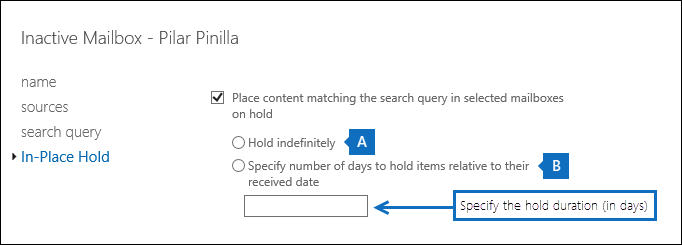

# <a name="change-the-hold-duration-for-an-inactive-mailbox"></a>Modificare la durata del blocco per una cassetta postale inattiva

Una cassetta postale inattiva viene utilizzata per conservare la posta elettronica di un precedente dipendente dopo che quest'ultimo ha lasciato l'organizzazione. Una cassetta postale diventa inattiva quando un blocco per controversia legale, un blocco sul posto, un criterio di conservazione di Microsoft 365 o un blocco associato a un caso di eDiscovery viene inserito nella cassetta postale e l'account utente corrispondente viene eliminato. I contenuti di una cassetta postale inattiva vengono mantenuti per tutta la durata del blocco applicato alla cassetta postale prima che fosse resa inattiva. La durata del blocco definisce per quanto tempo gli elementi nella cartella Elementi ripristinabili vengono conservati. Quando la durata del blocco per un elemento nella cartella Elementi ripristinabili scade, questo viene eliminato definitivamente (cancellato) dalla cassetta postale inattiva. Dopo aver reso inattiva una cassetta postale, è possibile modificare la durata del criterio di conservazione del blocco o del Microsoft 365 assegnato alla cassetta postale inattiva.
  
> [!IMPORTANT]
> Continuando a investire in modi diversi per conservare il contenuto delle cassette postali, si annuncia la prepensionamento delle archiviazioni sul posto nell'interfaccia di amministrazione di Exchange. Questo significa che è necessario utilizzare i criteri di conservazione per controversia legale e Microsoft 365 per creare una cassetta postale inattiva. A partire dal 1 ° aprile 2020 non è possibile creare nuove archiviazioni sul posto in Exchange Online. Tuttavia, sarà comunque possibile modificare la durata del blocco di un blocco sul posto posto in una cassetta postale inattiva. Tuttavia, a partire dal 1 ° luglio 2020, non sarà possibile modificare la durata del blocco. È possibile eliminare una cassetta postale inattiva solo rimuovendo il blocco sul posto. Le cassette postali inattive esistenti che si trovano sul blocco sul posto continueranno a essere conservate finché il blocco non viene rimosso. Per ulteriori informazioni sul pensionamento delle archiviazioni sul posto, vedere [pensionamento degli strumenti di eDiscovery legacy](legacy-ediscovery-retirement.md).
  
## <a name="connect-to-powershell"></a>Connettersi a PowerShell

- You have to use Exchange Online PowerShell to change the hold duration for a Litigation Hold on an inactive mailbox. You can't use the Exchange admin center (EAC). But you can use Exchange Online PowerShell or the EAC to change the hold duration for an In-Place Hold. È possibile utilizzare il Centro sicurezza e conformità o il Centro sicurezza & Compliance Center PowerShell per modificare la durata del blocco per un criterio di conservazione di Microsoft 365.
    
- Per connettersi a PowerShell di Exchange Online o al centro sicurezza & Compliance, vedere uno dei seguenti argomenti:
    
  - [Connettersi a PowerShell per Exchange Online](https://go.microsoft.com/fwlink/p/?linkid=396554)
    
  - [Connettersi a PowerShell in Centro sicurezza e conformità](https://go.microsoft.com/fwlink/?linkid=799771)
    
- Le esenzioni associate ai casi di eDiscovery sono detenute infinite, il che significa che non è possibile modificare la durata del blocco. Gli elementi vengono conservati all'infinito o finché il blocco non viene rimosso e la cassetta postale non viene eliminata.
    
- Per ulteriori informazioni sulle cassette postali inattive, vedere [inactive Mailboxes in Microsoft 365](inactive-mailboxes-in-office-365.md).
    
## <a name="step-1-identify-the-holds-on-an-inactive-mailbox"></a>Passaggio 1: identificare i blocchi su una cassetta postale inattiva

Poiché i diversi tipi di esenzioni o uno o più criteri di conservazione di Microsoft 365 potrebbero essere inseriti in una cassetta postale inattiva, il primo passaggio consiste nell'identificare le esenzioni su una cassetta postale inattiva.
  
Eseguire il seguente comando in Exchange Online per visualizzare le informazioni sul blocco per tutte le cassette postali inattive dell'organizzazione.
  
```powershell
Get-Mailbox -InactiveMailboxOnly | FL DisplayName,Name,IsInactiveMailbox,LitigationHoldEnabled,LitigationHoldDuration,InPlaceHolds
```

Il valore di **True** per la proprietà **LitigationHoldEnabled** indica che la cassetta postale inattiva ha un blocco per controversia legale. Se un blocco sul posto, il blocco eDiscovery o il criterio di conservazione Microsoft 365 viene inserito in una cassetta postale inattiva, viene visualizzato un GUID per il blocco o il criterio di conservazione come valore per la proprietà **InPlaceHolds** . Ad esempio, di seguito vengono illustrati i risultati per cinque cassette postali inattive. 
  
```text
DisplayName           : Ann Beebe
Name                  : annb
IsInactiveMailbox     : True
LitigationHoldEnabled : True
LitigationHoldDuration: 365.00:00:00
InPlaceHolds          : {}
...
DisplayName           : Pilar Pinilla
Name                  : pilarp
IsInactiveMailbox     : True
LitigationHoldEnabled : False
LitigationHoldDuration: Unlimited
InPlaceHolds          : {c0ba3ce811b6432a8751430937152491}
...
DisplayName           : Mario Necaise
Name                  : marion
IsInactiveMailbox     : True
LitigationHoldEnabled : False
LitigationHoldDuration: Unlimited
InPlaceHolds          : {}
...
DisplayName           : Carol Olson
Name                  : carolo
IsInactiveMailbox     : True
LitigationHoldEnabled : False
LitigationHoldDuration: Unlimited
InPlaceHolds          : {mbxcdbbb86ce60342489bff371876e7f224}
...
DisplayName           : Abraham McMahon
Name                  : abrahamm
IsInactiveMailbox     : True
LitigationHoldEnabled : False
LitigationHoldDuration: Unlimited
InPlaceHolds          : {UniH7d895d48-7e23-4a8d-8346-533c3beac15d}
```

Nella tabella seguente vengono identificati i cinque tipi diversi di blocco utilizzati per rendere inattiva ogni cassetta postale.
  
|**Cassetta postale inattiva**|**Tipo di blocco**|**Come identificare il blocco sulla cassetta postale inattiva**|
|:-----|:-----|:-----|
|Ann Beebe  <br/> |Blocco per controversia legale  <br/> |La proprietà  *LitigationHoldEnabled*  è impostata su  `True`.  <br/> |
|Pilar Pinilla  <br/> |Blocco sul posto  <br/> |La proprietà  *InPlaceHolds*  contiene il GUID del blocco sul posto applicato alla cassetta postale inattiva. È possibile stabilire che si tratta di un blocco sul posto perché l'ID non inizia con un prefisso.  <br/> È possibile utilizzare il comando  `Get-MailboxSearch -InPlaceHoldIdentity <hold GUID> | FL` in Exchange Online PowerShell per ottenere informazioni sul blocco sul posto della cassetta postale inattiva.  <br/> |
|Mario Necaise  <br/> |Criterio di conservazione Microsoft 365 a livello di organizzazione nel centro sicurezza & conformità  <br/> |La proprietà  *InPlaceHolds*  è vuota. Ciò indica che uno o più criteri di conservazione Microsoft 365 a livello di organizzazione o (Exchange) vengono applicati alla cassetta postale inattiva. In questo caso, è possibile eseguire il `Get-OrganizationConfig | Select-Object -ExpandProperty InPlaceHolds` comando in Exchange Online PowerShell per ottenere un elenco dei GUID per i criteri di conservazione Microsoft 365 a livello dell'organizzazione. Il GUID per i criteri di conservazione a livello dell'organizzazione applicati alle cassette postali di Exchange inizia con il `mbx` prefisso, ad esempio `mbxa3056bb15562480fadb46ce523ff7b02` .  <br/> <br/>Per identificare i criteri di conservazione Microsoft 365 applicati alla cassetta postale inattiva, eseguire il comando seguente in PowerShell Centro sicurezza & Compliance.  <br/><br/> `Get-RetentionCompliancePolicy <retention policy GUID without prefix> | FL Name`<br/><br/>
|Carol Olson  <br/> |Microsoft 365 criteri di conservazione nel centro sicurezza & Compliance applicato a cassette postali specifiche  <br/> |La proprietà *InPlaceHolds* contiene il GUID del criterio di conservazione Microsoft 365 applicato alla cassetta postale inattiva. È possibile stabilire che si tratta di un criterio di conservazione applicato a specifiche cassette postali perché il GUID inizia con il prefisso  `mbx`. Se il GUID del criterio di conservazione applicato alla cassetta postale inattiva è iniziato con il `skp` prefisso, indica che il criterio di conservazione viene applicato alle conversazioni di Skype for business.  <br/><br/> Per identificare i criteri di conservazione Microsoft 365 applicati alla cassetta postale inattiva, eseguire il comando seguente in PowerShell Centro sicurezza & Compliance.<br/><br/> `Get-RetentionCompliancePolicy <retention policy GUID without prefix> | FL Name` <br/><br/>Assicurarsi di rimuovere il prefisso  `mbx` o  `skp` quando si esegue questo comando.  <br/> |
|Abraham McMahon  <br/> |blocco del caso di eDiscovery nel centro sicurezza & Compliance  <br/> |La proprietà  *InPlaceHolds*  contiene il GUID del blocco caso eDiscovery applicato alla cassetta postale inattiva. È possibile stabilire che si tratta di un blocco caso eDiscovery perché il GUID inizia con il prefisso  `UniH`.  <br/> È possibile utilizzare il `Get-CaseHoldPolicy` cmdlet in PowerShell per la sicurezza & Compliance Center per ottenere informazioni sul caso di eDiscovery a cui è associato il blocco sulla cassetta postale inattiva. For example, you can run the command  `Get-CaseHoldPolicy <hold GUID without prefix> | FL Name` to display the name of the case hold that's on the inactive mailbox. Be sure to remove the  `UniH` quando si esegue questo comando.  <br/><br/> Per identificare il caso eDiscovery a cui è associato il blocco applicato alla cassetta postale inattiva, eseguire i seguenti comandi.  <br/><br/> `$CaseHold = Get-CaseHoldPolicy <hold GUID without prefix>`<br/><br/> `Get-ComplianceCase $CaseHold.CaseId | FL Name`<br/><br/><br/> **Nota:** Non è consigliabile utilizzare eDiscovery per le cassette postali inattive. That's because eDiscovery cases are intended for specific, time-bound cases related to a legal issue. A un certo punto, probabilmente si concluderà un caso legale e le esenzioni associate al caso verranno rimosse e il caso di eDiscovery verrà chiuso (o eliminato). Infatti, se una conservazione inserita in una cassetta postale inattiva è associata a un caso di eDiscovery e il blocco viene rilasciato o se il caso eDiscovery è chiuso o eliminato, la cassetta postale inattiva viene eliminata definitivamente. 

Per ulteriori informazioni sui criteri di conservazione di Microsoft 365, vedere informazioni [sui criteri di conservazione e sulle etichette di conservazione](retention.md).
  
## <a name="step-2-change-the-hold-duration-for-an-inactive-mailbox"></a>Passaggio 2: modificare la durata del blocco per una cassetta postale inattiva

Dopo aver identificato il tipo di blocco applicato alla cassetta postale inattiva (e se sono presenti più blocchi), il passaggio successivo consiste nel modificare la durata del blocco. 
  
### <a name="change-the-duration-for-a-litigation-hold"></a>Modificare la durata di un blocco per controversia legale

Ecco come utilizzare Exchange Online PowerShell per modificare la durata di un blocco per controversia legale applicato a una cassetta postale inattiva. Non è possibile usare l'interfaccia di amministrazione di Exchange. Eseguire il comando seguente per modificare la durata del blocco. In questo esempio, la durata del blocco viene impostata su un periodo di tempo illimitato.
  
```powershell
Set-Mailbox -InactiveMailbox -Identity <identity of inactive mailbox> -LitigationHoldDuration unlimited
```

Il risultato è che gli elementi nella cassetta postale inattiva vengono conservati per sempre o finché il blocco non viene rimosso o la durata del blocco non viene modificata.
  
> [!TIP]
> Il modo migliore per identificare una cassetta postale inattiva consiste nell'utilizzare il relativo valore **Distinguished Name** o **Exchange GUID**. L'utilizzo di uno di questi valori consente di non specificare accidentalmente la cassetta postale errata. 
  
### <a name="change-the-duration-for-an-in-place-hold"></a>Modificare la durata del blocco sul posto

 È possibile utilizzare l'interfaccia di amministrazione di Exchange o Exchange Online PowerShell per modificare la durata di un blocco sul posto. 
  
#### <a name="use-the-eac-to-change-the-hold-duration"></a>Modifica della durata del blocco tramite l'interfaccia di amministrazione di Exchange

1. Se si conosce il nome del blocco sul posto che si desidera modificare, è possibile passare al passaggio successivo. In caso contrario, eseguire il seguente comando per ottenere il nome del blocco sul posto applicato alla cassetta postale inattiva. Utilizzare il GUID del blocco sul posto ottenuto nel [passaggio 1](#step-1-identify-the-holds-on-an-inactive-mailbox).

    ```powershell
    Get-MailboxSearch -InPlaceHoldIdentity <In-Place Hold GUID> | FL Name
    ```

2. In the EAC, go to **Compliance management** \> **In-Place eDiscovery &amp; Hold**.
    
3. Selezionare il blocco sul posto che si desidera modificare, quindi selezionare **modifica**  .
    
4. Nella pagina delle proprietà **di conservazione &amp; eDiscovery sul posto** , selezionare **blocco sul posto**. 
    
5. Eseguire una delle operazioni seguenti in base alla durata del blocco corrente:
    
    1. Selezionare **blocca** illimitatamente per conservare gli elementi per un periodo di tempo illimitato. 
    
    2. Selezionare **specifica il numero di giorni in cui mantenere gli elementi relativi alla data di ricezione** in modo da contenere gli elementi per un periodo specifico. Specificare il numero dei giorni per i quali bloccare gli elementi. 
    
    
  
6. Seleziona **Salva**.
    
#### <a name="use-exchange-online-powershell-to-change-the-hold-duration"></a>Utilizzare Exchange Online PowerShell per modificare la durata del blocco

1. Se si conosce il nome del blocco sul posto che si desidera modificare, è possibile passare al passaggio successivo. In caso contrario, eseguire il seguente comando per ottenere il nome del blocco sul posto applicato alla cassetta postale inattiva. Utilizzare il GUID del blocco sul posto ottenuto nel [passaggio 1](#step-1-identify-the-holds-on-an-inactive-mailbox).

    ```powershell
    Get-MailboxSearch -InPlaceHoldIdentity <In-Place Hold GUID> | FL Name
    ```

2. Eseguire il comando seguente per modificare la durata del blocco. In questo esempio, la durata del blocco viene modificata in 2.555 giorni (circa 7 anni). 
    
    ```powershell
    Set-MailboxSearch <identity of In-Place Hold> -ItemHoldPeriod 2555
    ```

     Per impostare la durata del blocco su un periodo di tempo illimitato, utilizzare  _-ItemHoldPeriod unlimited_
  
## <a name="more-information"></a>Ulteriori informazioni

- **Come viene calcolata la durata del blocco per un elemento in una cassetta postale inattiva** La durata viene calcolata a partire dalla data originale di ricezione o creazione dell'elemento della cassetta postale. 
    
- **Effetti della scadenza della durata del blocco** Quando la durata del blocco scade per un elemento della cassetta postale nella cartella elementi ripristinabili, l'elemento viene eliminato definitivamente (eliminato) dalla cassetta postale inattiva. Se non è specificata alcuna durata per il blocco applicato alla cassetta postale inattiva, gli elementi nella cartella elementi ripristinabili non vengono mai eliminati, a meno che non venga modificata la durata del blocco per la cassetta postale inattiva. 
    
- **Un criterio di conservazione di Exchange è ancora elaborato nelle cassette postali inattive?** Se un criterio di conservazione di Exchange (la funzionalità di Gestione record di messaggistica o MRM in Exchange Online) è stato applicato alla cassetta postale quando era inattiva, i criteri di eliminazione (che sono configurati con tag di conservazione in un'azione conservazione **Delete** ) continuerà a essere elaborato nella cassetta postale inattiva. Questo significa che gli elementi che sono contrassegnati con un criterio di eliminazione verranno spostati nella cartella Elementi ripristinabili quando scade il periodo di conservazione. Questi elementi vengono eliminati dalla cassetta postale inattiva quando scade la durata del blocco. 
    
    Al contrario, qualsiasi criterio di archiviazione (vale a dire tag di conservazione configurati con un'azione conservazione **MoveToArchive** ) incluso in un criterio di conservazione assegnato a una cassetta postale inattiva viene ignorato. Questo significa che gli elementi in una cassetta postale inattiva contrassegnati con un criterio di archiviazione rimarranno nella cassetta postale principale quando scade il periodo di conservazione. Non vengono spostati nella cassetta postale di archiviazione o nella cartella Elementi ripristinabili nella cassetta postale di archiviazione. Poiché un utente non può accedere a una cassetta postale inattiva, non c'è motivo di consumare risorse del centro dati per elaborare criteri di archiviazione. 
    
- **Per controllare la nuova durata del blocco, eseguire uno dei seguenti comandi.** Il primo comando è per il blocco per controversia legale, il secondo per il blocco sul posto. 

    ```powershell
    Get-Mailbox -InactiveMailboxOnly -Identity <identity of inactive mailbox> | FL LitigationHoldDuration
    ```

    ```powershell
    Get-MailboxSearch <identity of In-Place Hold> | FL ItemHoldPeriod
    ```

- **Come per le cassette postali normali, l'Assistente cartelle gestite elabora anche le cassette postali inattive.** In Exchange Online, l'AMF elabora le cassette postali approssimativamente una volta ogni sette giorni. Dopo aver modificato la durata del blocco per una cassetta postale inattiva, è possibile utilizzare il cmdlet **Start-ManagedFolderAssistant** per avviare immediatamente l'elaborazione della nuova durata del blocco per la cassetta postale inattiva. Eseguire il comando riportato di seguito. 

    ```powershell
    Start-ManagedFolderAssistant -InactiveMailbox <identity of inactive mailbox>
    ```
   
- **Se molte esenzioni vengono inserite in una cassetta postale inattiva, non verranno visualizzati tutti i GUID di blocco.** È possibile eseguire il seguente comando per visualizzare i GUID per tutti i blocchi (ad eccezione dei blocchi per controversia legale) che vengono applicati a una cassetta postale inattiva. 
    
    ```powershell
    Get-Mailbox -InactiveMailboxOnly -Identity <identity of inactive mailbox> | Select-Object -ExpandProperty InPlaceHolds
    ```
