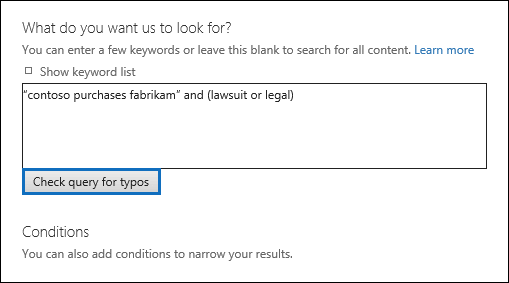

# Verificare la presenza di errori nella query di Ricerca contenutoCheck your Content Search query for errors

Quando si crea o si modifica una ricerca di contenuto, è possibile fare in modo che Microsoft 365 controlli la query per verificare la presenza di caratteri non supportati e operatori booleani minuscoli.When you create or edit a Content Search, you can have Microsoft 365 check your query for unsupported characters and lowercase Boolean operators. Come?How? È sufficiente **fare clic su Controlla errori di digitazione** nella pagina di query di una ricerca di contenuto.Just click **Check query for typos** on the query page of a Content Search. 
  

  
Ecco un elenco dei caratteri non supportati che controlliamo.Here's a list of the unsupported characters that we check for. I caratteri non supportati sono spesso nascosti e in genere causano un errore di ricerca o restituiscono risultati indesiderati.Unsupported characters are often hidden, and they typically cause a search error or return unintended results.
  
- **Virgolette inglesi** - Le virgolette singole e doppie intelligenti (denominate anche virgolette inglesi) non sono supportate.**Smart quotation marks** - Smart single and double quotation marks (also called curly quotes) aren't supported. In una query di ricerca è possibile utilizzare solo le virgolette semplici.Only straight quotation marks can be used in a search query. 
    
- **Caratteri non stampabili** e di controllo: i caratteri non stampabili e di controllo non rappresentano un simbolo scritto, ad esempio un carattere alfanumerico.**Non-printable and control characters** - Non-printable and control characters don't represent a written symbol, such as an alpha-numeric character. Tra gli esempi di caratteri non stampabili e di controllo sono inclusi i caratteri che formattano il testo o righe di testo separate.Examples of non-printable and control characters include characters that format text or separate lines of text. 
    
- Segni da sinistra a destra e da destra a **sinistra-** Questi segni sono caratteri di controllo utilizzati per indicare la direzione del testo per le lingue da sinistra a destra (ad esempio inglese e spagnolo) e lingue da destra a sinistra (ad esempio arabo ed ebraico).**Left-to-right and right-to-left marks** - These marks are control characters used to indicate text direction for left-to-right languages (such as English and Spanish) and right-to-left languages (such as Arabic and Hebrew).
    
- **Operatori booleani minuscoli:** se si utilizza un operatore booleano, ad esempio **AND**, **OR** e **NOT** in una query di ricerca, è necessario che sia maiuscolo.**Lowercase Boolean operators** - If you use a Boolean operator, such as **AND**, **OR**, and **NOT** in a search query, it must be uppercase. Quando viene verificata la presenza di errori di digitazione in una query, la sintassi della query spesso indica che viene utilizzato un operatore booleano anche se è possibile utilizzare operatori minuscoli. ad esempio  `(WordA or WordB) and (WordC or WordD)` .When we check a query for typos, the query syntax will often indicate that a Boolean operator is being used even though lowercase operators might be used; for example,  `(WordA or WordB) and (WordC or WordD)`.
    
## Cosa succede se una query contiene un carattere non supportato?What happens if a query has an unsupported character?

Se nella query vengono trovati caratteri non supportati, viene visualizzato un messaggio di avviso che indica che sono stati trovati caratteri non supportati e suggerisce un'alternativa.If unsupported characters are found in your query, a warning message is displayed that says unsupported characters were found and suggests an alternative. È quindi possibile mantenere la query originale o sostituirla con la query modificata suggerita.You then have the option keep the original query or replace it with the suggested revised query. Ecco un esempio del messaggio di avviso visualizzato dopo aver fatto clic su Controlla **query** per errori di digitazione per la query di ricerca nello screenshot precedente.Here's an example of the warning message that's displayed after you click **Check query for typos** for the search query in the previous screenshot. Si noti che la query originale contiene virgolette intelligenti e operatori booleani minuscoli.Notice that the original query contains smart quotes and lowercase Boolean operators. 
  

  
## Come impedire i caratteri non supportati nelle query di ricercaHow to prevent unsupported characters in your search queries

I caratteri non supportati vengono in genere aggiunti a una query quando si copia la query o parti di tale query da altre applicazioni, ad esempio Microsoft Word o Microsoft Excel, e li si incolla nella casella delle parole chiave nella pagina della query di una ricerca di contenuto.Unsupported characters are typically added to a query when you copy the query or parts of the query from other applications (such as Microsoft Word or Microsoft Excel) and paste them in the keyword box on the query page of a Content Search. Il modo migliore per impedire i caratteri non supportati è semplicemente digitare la query nella casella della parola chiave.The best way to prevent unsupported characters is to just type the query in the keyword box. Oppure è possibile copiare una query da Word o Excel e quindi incollarla in un editor di testo normale, ad esempio Blocco note Microsoft.Or you can copy a query from Word or Excel, and then paste it in a plain text editor, such as Microsoft Notepad. Salvare il file di testo e selezionare **ANSI** **nell'elenco a** discesa Codifica.Save the text file and select **ANSI** in the **Encoding** drop-down list. In questo modo verranno rimosso tutti i caratteri di formattazione e non supportati.This will remove any formatting and unsupported characters. È quindi possibile copiare e incollare la query dal file di testo alla casella di query con parole chiave.Then you can copy and paste the query from the text file to the keyword query box. 
