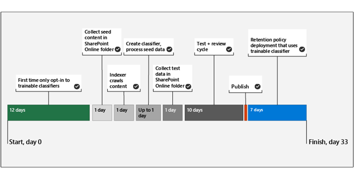

# Creazione di un classificatore addestrabile (anteprima)Creating a trainable classifier (preview)

Utilizzare i classificatori addestrabili quando uno dei classificatori fuori campo non soddisfa le proprie esigenze.Use trainable classifiers when one of the out of the box classifiers won't meet your needs. Un classificatore Microsoft 365 è uno strumento che è possibile addestrare per riconoscere vari tipi di contenuto fornendo esempi da esaminare.A Microsoft 365 classifier is a tool you can train to recognize various types of content by giving it samples to look at. Formazione il classificatore implica la prima assegnazione di campioni che sono selezionati in modo umano e corrispondono positivamente alla categoria.Training the classifier involves first giving it samples that are human picked and positively match the category. Successivamente, dopo averli elaborati, si verificano le stime conferendole una combinazione di esempi positivi e negativi.Then, after it has processed those, you test the predictions by giving it a mix of positive and negative samples.

Per ulteriori informazioni sui diversi tipi di classificatori, vedere [Guida introduttiva ai classificatori addestrabili (anteprima)](classifier-getting-started-with.md)To learn more about the different types of classifiers, see [Getting started with trainable classifiers (preview)](classifier-getting-started-with.md)

Questa sequenza temporale riflette una distribuzione di esempio.This timeline reflects a sample deployment.

> [!TIP]
> L'opzione opt-in è necessaria per la prima volta per i classificatori addestrabili.Opt-in is required the first time for trainable classifiers. Per completare una valutazione di base del contenuto delle organizzazioni, sono necessari dodici giorni per Microsoft 365.It takes twelve days for Microsoft 365 to complete a baseline evaluation of your organizations content. Contattare l'amministratore globale per iniziare a utilizzare il processo di opt-in.Contact your global administrator to kick off the opt-in process.

## Contenuto del seedingSeed content

Quando si desidera che un classificatore addestrabile sia in grado di identificare in modo indipendente e accurato un elemento come in particolare la categoria di contenuto, è necessario innanzitutto presentarlo con numerosi esempi del tipo di contenuto nella categoria.When you want a trainable classifier to independently and accurately identify an item as being in particular category of content, you first have to present it with many samples of the type of content that are in the category. L'alimentazione dei campioni al classificatore addestrabile è nota come *seeding*.This feeding of samples to the trainable classifier is known as *seeding*. Il contenuto del seeding viene selezionato da un essere umano e viene giudicato per rappresentare la categoria di contenuto.Seed content is selected by a human and is judged to represent the category of content.

> [!TIP]
> È necessario avere almeno 50 campioni positivi e ben 500.You need to have at least 50 positive samples and as many as 500. Il classificatore addestrativo elaborerà fino a 500 campioni creati più recenti (per data e timestamp creati dal file).The trainable classifier will process up to the 500 most recent created samples (by file created date/time stamp). Più esempi vengono forniti, maggiore è la precisione delle stime che verranno apportate dal classificatore.The more samples you provide, the more accurate the predictions the classifier will make.

## Test del contenutoTesting content

Dopo che il classificatore addestratore ha elaborato campioni positivi sufficienti per creare un modello di stima, è necessario verificare le stime che consente di verificare se il classificatore può distinguere correttamente tra gli elementi che corrispondono alla categoria e gli elementi che non lo fanno.Once the trainable classifier has processed enough positive samples to build a prediction model, you need to test the predictions it makes to see if the classifier can correctly distinguish between items that match the category and items that don't. A tale scopo, è necessario nutrirlo con un altro, che si spera più grande, insieme di contenuto umano raccolto che è costituito da campioni che devono rientrare nella categoria e campioni che non lo faranno.You do this by feeding it another, hopefully larger, set of human picked content that consists of samples that should fall into the category and samples that won't. Dopo averli elaborati, si procede manualmente ai risultati e si verifica se ogni previsione è corretta, non corretta o non si è certi.Once it processes those, you manually go through the results and verify whether each prediction is correct, incorrect, or you aren't sure. Il classificatore addestrabile utilizza questi commenti e suggerimenti per migliorare il modello di stima.The trainable classifier uses this feedback to improve its prediction model.

> [!TIP]
> Per ottenere risultati ottimali, avere 10.000 elementi nel set di campioni di test con una distribuzione uniforme di corrispondenze positive e negative.For best results, have 10,000 items in your test sample set with an even distribution of positive and negative matches.

## Come creare un classificatore addestrabileHow to create a trainable classifier

1. Raccogliere tra gli elementi di contenuto di 50-500 Seed.Collect between 50-500 seed content items. Questi devono essere solo campioni che rappresentano fortemente il tipo di contenuto che si desidera che il classificatore addestrabile identifichi positivamente come nella Categoria classificazione.These must be only samples that strongly represent the type of content you want the trainable classifier to positively identify as being in the classification category. Per i tipi di file supportati, vedere le estensioni di file sottoposte [a ricerca per indicizzazione e i tipi di file analizzati in SharePoint Server](https://docs.microsoft.com/sharepoint/technical-reference/default-crawled-file-name-extensions-and-parsed-file-types) .See, [Default crawled file name extensions and parsed file types in SharePoint Server](https://docs.microsoft.com/sharepoint/technical-reference/default-crawled-file-name-extensions-and-parsed-file-types) for the supported file types.

> [!IMPORTANT]
> Gli elementi di esempio Seed e test non devono essere crittografati e devono essere in inglese.The seed and test sample items must not be encrypted and they must be in English.

> [!IMPORTANT]
> Verificare che gli elementi del set di Seed siano esempi **forti** della categoria.Make sure the items in your seed set are **strong** examples of the category. Il classificatore addestrabile crea inizialmente il modello in base alle operazioni con cui viene eseguito il seeding.The trainable classifier initially builds its model based on what you seed it with. Il classificatore presuppone che tutti gli esempi di sementi siano forti positivi e che non sia possibile sapere se un campione è una corrispondenza debole o negativa per la categoria.The classifier assumes all seed samples are strong positives and has no way of knowing if a sample is a weak or negative match to the category.

2. Inserire il contenuto di inizializzazione in una cartella di SharePoint Online dedicata a contenere *solo il contenuto del seeding*.Place the seed content in a SharePoint Online folder that is dedicated to holding *the seed content only*. Prendere nota dell'URL del sito, della raccolta e della cartella.Make note of the site, library, and folder URL.

> [!TIP]
> Se si crea un nuovo sito e una nuova cartella per i dati di seeding, è possibile eseguire l'indicizzazione di almeno un'ora affinché tale percorso venga indicizzato prima di creare il classificatore addestrabile che utilizzerà tali dati.If you create a new site and folder for your seed data, allow at least an hour for that location to be indexed before creating the trainable classifier that will use that seed data.

3. Accedere a Microsoft 365 Compliance Center with Compliance admin or Security admin Role Access e Open **Microsoft 365 Compliance Center** or **Microsoft 365 Security Center** > **Data Classification**Sign in to Microsoft 365 compliance center with compliance admin or security admin role access and open **Microsoft 365 compliance center** or **Microsoft 365 security center** > **Data classification**

4. Scegliere la scheda **classificatori addestrabili** .Choose the **Trainable classifiers** tab.

5. Scegliere **Crea classificatore addestrabile**.Choose **Create trainable classifier**.

6. Inserire i valori adeguati per `Name`i campi `Description` e la categoria di elementi che si desidera vengano identificati dal classificatore addestrabile.Fill in appropriate values for the `Name`, and `Description` fields of the category of items you want this trainable classifier to identify.

7. Immettere il sito, la raccolta e l'URL della cartella di SharePoint Online esatti per il sito di contenuto Seed del passaggio 2.Enter the exact SharePoint Online site, library, and folder URL for the seed content site from step 2. Scegliere `Add`.Choose `Add`.

8. Rivedere le impostazioni e scegliere `Create trainable classifier`.Review the settings and choose `Create trainable classifier`.

9. Entro 24 ore, il classificatore addestrativo elaborerà i dati di seeding e realizzerà un modello di stima.Within 24 hours the trainable classifier will process the seed data and build a prediction model. Lo stato del classificatore `In progress` è durante l'elaborazione dei dati di seeding.The classifier status is `In progress` while it processes the seed data. Quando il classificatore ha terminato di elaborare i dati di seeding, lo `Need test items`stato cambia in.When the classifier is finished processing the seed data, the status changes to `Need test items`.

10. È ora possibile visualizzare la pagina dei dettagli scegliendo il classificatore.You can now view the details page by choosing the classifier.

11. Raccogliere almeno 200 elementi di contenuto di test.Collect at least 200 test content items. Microsoft consiglia 10.000 per ottenere risultati ottimali.Microsoft recommends 10,000 for best results. Queste devono essere una combinazione di elementi che sono forti positivi, negativi forti e alcuni che sono un po' meno evidenti nella loro natura.These should be a mix of items that are strong positives, strong negatives and some that are a little less obvious in their nature. Per i tipi di file supportati, vedere le estensioni di file sottoposte [a ricerca per indicizzazione e i tipi di file analizzati in SharePoint Server](https://docs.microsoft.com/sharepoint/technical-reference/default-crawled-file-name-extensions-and-parsed-file-types) .See, [Default crawled file name extensions and parsed file types in SharePoint Server](https://docs.microsoft.com/sharepoint/technical-reference/default-crawled-file-name-extensions-and-parsed-file-types) for the supported file types.

> [!IMPORTANT]
> Gli elementi di esempio non devono essere crittografati e devono essere in inglese.The sample items must not be encrypted and they must be in English.

12. Inserire il contenuto del test in una cartella di SharePoint Online dedicata alla conservazione *del solo contenuto del test*.Place the test content in a SharePoint Online folder that is dedicated to holding *the test content only*. Prendere nota del sito, della raccolta e dell'URL della cartella di SharePoint Online.Make note of the SharePoint Online site, library, and folder URL.

> [!TIP]
> Se si crea un nuovo sito e una nuova cartella per i dati di test, è possibile che la posizione venga indicizzata per almeno un'ora prima di creare il classificatore addestrabile che utilizzerà tali dati.If you create a new site and folder for your test data, allow at least an hour for that location to be indexed before creating the trainable classifier that will use that seed data.

13. Scegliere `Add items to test`.Choose `Add items to test`.

14. Immettere il sito, la raccolta e l'URL della cartella di SharePoint Online esatti per il sito di contenuto di test del passaggio 12.Enter the exact SharePoint Online site, library, and folder URL for the test content site from step 12. Scegliere `Add`.Choose `Add`.

15. Completare la procedura guidata scegliendo `Done`.Finish the wizard by choosing `Done`. Il classificatore addestrabile richiederà fino a un'ora per l'elaborazione dei file di test.Your trainable classifier will take up to an hour to process the test files.

16. Quando si esegue l'elaborazione dei file di test da `Ready to review`parte del classificatore addestrabile, lo stato nella pagina dei dettagli cambia.When the trainable classifier is done processing your test files, the status on the details page will change to `Ready to review`. Se è necessario aumentare le dimensioni del campione di test, `Add items to test` scegliere e consentire al classificatore addestrabile di elaborare gli elementi aggiuntivi.If you need to increase the test sample size, choose `Add items to test` and allow the trainable classifier to process the additional items.

17. Scegliere `Tested items to review` la scheda per esaminare gli elementi.Choose `Tested items to review` tab to review items.

18. Microsoft 365 presenterà 30 elementi alla volta.Microsoft 365 will present 30 items at a time. Verificarli e nella casella `We predict this item is "Relevant". Do you agree?` scegliere uno `Yes` o `No` più o `Not sure, skip to next item`.Review them and in the `We predict this item is "Relevant". Do you agree?` box choose either `Yes` or `No` or `Not sure, skip to next item`. L'accuratezza del modello viene aggiornata automaticamente dopo ogni 30 elementi.Model accuracy is automatically updated after every 30 items.

19. Esaminare *almeno 200 elementi* .Review *at least* 200 items.

<!-- insert Analyze steps here-->

20. Continuare a esaminare fino a quando l'accuratezza raggiunge almeno il 70 `Publish the classifier` % e `Ready to use`lo stato è.Continue to review until the accuracy reaches at least 70% and the `Publish the classifier` status is `Ready to use`.

21. Pubblicare il classificatore.Publish the classifier.

22. Una volta pubblicato, il classificatore sarà disponibile come condizione nel criterio di etichetta di conservazione per l' [applicazione automatica in base a una condizione](labels.md#applying-a-retention-label-automatically-based-on-conditions) e in [conformità alla comunicazione](communication-compliance.md).Once published your classifier will be available as a condition in the [auto-apply retention label policy based on a condition](labels.md#applying-a-retention-label-automatically-based-on-conditions) and in [Communication compliance](communication-compliance.md).

> [!CAUTION]
> Dopo la pubblicazione di un classificatore, non è possibile eseguire ulteriori corsi di formazione, quindi accertarsi di aver testato e Recensito il maggior numero possibile di elementi per garantire la massima accuratezza possibile.Once a classifier is published, it can't go through any additional training, so be very sure that you have tested and reviewed as many items as possible to ensure that the accuracy is as high as possible.

## Vedere ancheSee also

- [Introduzione ai classificatori sottoponibili a training (anteprima)Getting started with trainable classifiers (preview)](classifier-getting-started-with.md)
- [Estensioni dei nomi di file sottoposti a ricerca per indicizzazione e tipi di file analizzati predefiniti in SharePoint ServerDefault crawled file name extensions and parsed file types in SharePoint Server](https://docs.microsoft.com/sharepoint/technical-reference/default-crawled-file-name-extensions-and-parsed-file-types)
