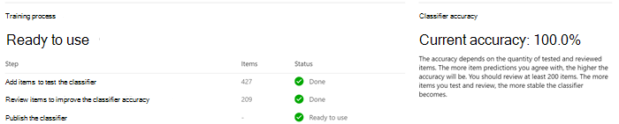

# <a name="get-started-with-trainable-classifiers-preview"></a><span data-ttu-id="117cf-104">Introduzione ai classificatori sottoponibili a training (anteprima)</span><span class="sxs-lookup"><span data-stu-id="117cf-104">Get started with trainable classifiers (preview)</span></span>

<span data-ttu-id="117cf-105">Un classificatore addestrabile di Microsoft 365 è uno strumento che è possibile addestrare per riconoscere vari tipi di contenuto fornendo esempi da esaminare.</span><span class="sxs-lookup"><span data-stu-id="117cf-105">A Microsoft 365 trainable classifier is a tool you can train to recognize various types of content by giving it samples to look at.</span></span> <span data-ttu-id="117cf-106">Una volta addestrato, è possibile utilizzarlo per identificare gli elementi per l'applicazione delle etichette di sensibilità di Office, i criteri di conformità delle comunicazioni e i criteri etichette di conservazione.</span><span class="sxs-lookup"><span data-stu-id="117cf-106">Once trained, you can use it to identify item for application of Office sensitivity labels, Communications compliance policies, and retention label policies.</span></span>

<span data-ttu-id="117cf-107">La creazione di un classificatore addestrabile personalizzato comporta innanzitutto l'assegnazione di campioni che sono scelti dall'uomo e corrispondono positivamente alla categoria.</span><span class="sxs-lookup"><span data-stu-id="117cf-107">Creating a custom trainable classifier first involves giving it samples that are human picked and positively match the category.</span></span> <span data-ttu-id="117cf-108">Successivamente, dopo averli elaborati, è possibile testare la capacità dei classificatori di predire assegnando un insieme di esempi positivi e negativi.</span><span class="sxs-lookup"><span data-stu-id="117cf-108">Then, after it has processed those, you test the classifiers ability to predict by giving it a mix of positive and negative samples.</span></span> <span data-ttu-id="117cf-109">In questo articolo viene illustrato come creare e formare un classificatore personalizzato e come migliorare le prestazioni di classificatori addestrabili personalizzati e classificatori preformati nel corso della loro durata tramite la riqualificazione.</span><span class="sxs-lookup"><span data-stu-id="117cf-109">This article shows you how to create and train a custom classifier and how to improve the performance of custom trainable classifiers and pre-trained classifiers over their lifetime through retraining.</span></span>

<span data-ttu-id="117cf-110">Per ulteriori informazioni sui diversi tipi di classificatori, vedere [informazioni sui classificatori addestrabili (Preview)](classifier-learn-about.md).</span><span class="sxs-lookup"><span data-stu-id="117cf-110">To learn more about the different types of classifiers, see [Learn about trainable classifiers (preview)](classifier-learn-about.md).</span></span>

## <a name="prerequisites"></a><span data-ttu-id="117cf-111">Prerequisiti</span><span class="sxs-lookup"><span data-stu-id="117cf-111">Prerequisites</span></span>

### <a name="licensing-requirements"></a><span data-ttu-id="117cf-112">Requisiti per la licenza</span><span class="sxs-lookup"><span data-stu-id="117cf-112">Licensing requirements</span></span>

<span data-ttu-id="117cf-113">I classificatori sono una funzionalità di conformità di Microsoft 365 E5 o E5.</span><span class="sxs-lookup"><span data-stu-id="117cf-113">Classifiers are a Microsoft 365 E5, or E5 Compliance feature.</span></span> <span data-ttu-id="117cf-114">È necessario disporre di uno di questi abbonamenti per utilizzarli.</span><span class="sxs-lookup"><span data-stu-id="117cf-114">You must have one of these subscriptions to make use of them.</span></span>

### <a name="permissions"></a><span data-ttu-id="117cf-115">Autorizzazioni</span><span class="sxs-lookup"><span data-stu-id="117cf-115">Permissions</span></span>

<span data-ttu-id="117cf-116">Per accedere ai classificatori nell'interfaccia utente:</span><span class="sxs-lookup"><span data-stu-id="117cf-116">To access classifiers in the UI:</span></span> 

- <span data-ttu-id="117cf-117">l'amministratore globale deve optare per il tenant per creare classificatori personalizzati.</span><span class="sxs-lookup"><span data-stu-id="117cf-117">the Global admin needs to opt in for the tenant to create custom classifiers.</span></span>
- <span data-ttu-id="117cf-118">L'amministratore della conformità o il ruolo di analisi dei dati è necessario per formare un classificatore.</span><span class="sxs-lookup"><span data-stu-id="117cf-118">Compliance Administrator or Data Investigation role is required to train a classifier.</span></span>

<span data-ttu-id="117cf-119">Sono necessari account con queste autorizzazioni per l'utilizzo dei classificatori in questi scenari:</span><span class="sxs-lookup"><span data-stu-id="117cf-119">You'll need accounts with these permissions to use classifiers in these scenarios:</span></span>

- <span data-ttu-id="117cf-120">Scenario dei criteri per l'etichetta di conservazione: ruoli Gestione record e gestione conservazione</span><span class="sxs-lookup"><span data-stu-id="117cf-120">Retention label policy scenario: Record Management and Retention Management roles</span></span> 
- <span data-ttu-id="117cf-121">Scenario di criteri per le etichette di riservatezza: amministratore della sicurezza, amministratore conformità, amministratore dei dati di conformità</span><span class="sxs-lookup"><span data-stu-id="117cf-121">Sensitivity label policy scenario: Security Administrator, Compliance Administrator, Compliance Data Administrator</span></span>
- <span data-ttu-id="117cf-122">Scenario di criteri di conformità della comunicazione: amministratore di gestione dei rischi Insider, Responsabile Revisione di supervisione</span><span class="sxs-lookup"><span data-stu-id="117cf-122">Communication compliance policy scenario: Insider Risk Management Admin, Supervisory Review Administrator</span></span> 

> [!IMPORTANT]
> <span data-ttu-id="117cf-123">Per impostazione predefinita, solo l'utente che crea un classificatore personalizzato può formare ed esaminare le stime eseguite dal classificatore.</span><span class="sxs-lookup"><span data-stu-id="117cf-123">By default, only the user who creates a custom classifier can train and review predictions made by that classifier.</span></span> <span data-ttu-id="117cf-124">Se si desidera che gli altri utenti siano in grado di formare e rivedere le stime del classificatore, vedere [Give others Train and Review Rights](#give-others-train-and-review-rights).</span><span class="sxs-lookup"><span data-stu-id="117cf-124">If you want others to be able to train and review classifier predictions, see [Give others train and review rights](#give-others-train-and-review-rights).</span></span>

## <a name="prepare-for-a-custom-trainable-classifier"></a><span data-ttu-id="117cf-125">Prepararsi per un classificatore addestrabile personalizzato</span><span class="sxs-lookup"><span data-stu-id="117cf-125">Prepare for a custom trainable classifier</span></span> 

<span data-ttu-id="117cf-126">È utile comprendere cosa è coinvolto nella creazione di un classificatore addestrabile personalizzato prima dell'immersione.</span><span class="sxs-lookup"><span data-stu-id="117cf-126">It's helpful to understand what's involved in creating a custom trainable classifier before you dive in.</span></span> 

### <a name="timeline"></a><span data-ttu-id="117cf-127">Sequenza temporale</span><span class="sxs-lookup"><span data-stu-id="117cf-127">Timeline</span></span>

<span data-ttu-id="117cf-128">Questa sequenza temporale riflette una distribuzione di esempio dei classificatori addestrabili.</span><span class="sxs-lookup"><span data-stu-id="117cf-128">This timeline reflects a sample deployment of trainable classifiers.</span></span>


> [!TIP]
> <span data-ttu-id="117cf-130">L'opzione opt-in è necessaria per la prima volta per i classificatori addestrabili.</span><span class="sxs-lookup"><span data-stu-id="117cf-130">Opt-in is required the first time for trainable classifiers.</span></span> <span data-ttu-id="117cf-131">Per completare una valutazione di base del contenuto delle organizzazioni, sono necessari dodici giorni per Microsoft 365.</span><span class="sxs-lookup"><span data-stu-id="117cf-131">It takes twelve days for Microsoft 365 to complete a baseline evaluation of your organizations content.</span></span> <span data-ttu-id="117cf-132">Contattare l'amministratore globale per iniziare a utilizzare il processo di opt-in.</span><span class="sxs-lookup"><span data-stu-id="117cf-132">Contact your global administrator to kick off the opt-in process.</span></span>

### <a name="overall-workflow"></a><span data-ttu-id="117cf-133">Flusso di lavoro globale</span><span class="sxs-lookup"><span data-stu-id="117cf-133">Overall workflow</span></span>

<span data-ttu-id="117cf-134">Per ulteriori informazioni sul flusso di lavoro globale della creazione di classificatori addestrabili personalizzati, vedere [flow Process per la creazione di classificatori addestrabili per i clienti](classifier-learn-about.md#process-flow-for-creating-custom-classifiers).</span><span class="sxs-lookup"><span data-stu-id="117cf-134">To understand more about the overall workflow of creating custom trainable classifiers, see [Process flow for creating customer trainable classifiers](classifier-learn-about.md#process-flow-for-creating-custom-classifiers).</span></span>

### <a name="seed-content"></a><span data-ttu-id="117cf-135">Contenuto del seeding</span><span class="sxs-lookup"><span data-stu-id="117cf-135">Seed content</span></span>

<span data-ttu-id="117cf-136">Quando si desidera che un classificatore addestrabile sia in grado di identificare in modo indipendente e accurato un elemento come in particolare la categoria di contenuto, è necessario innanzitutto presentarlo con numerosi esempi del tipo di contenuto nella categoria.</span><span class="sxs-lookup"><span data-stu-id="117cf-136">When you want a trainable classifier to independently and accurately identify an item as being in particular category of content, you first have to present it with many samples of the type of content that are in the category.</span></span> <span data-ttu-id="117cf-137">L'alimentazione dei campioni al classificatore addestrabile è nota come *seeding*.</span><span class="sxs-lookup"><span data-stu-id="117cf-137">This feeding of samples to the trainable classifier is known as *seeding*.</span></span> <span data-ttu-id="117cf-138">Il contenuto del seeding viene selezionato da un essere umano e viene giudicato per rappresentare la categoria di contenuto.</span><span class="sxs-lookup"><span data-stu-id="117cf-138">Seed content is selected by a human and is judged to represent the category of content.</span></span>

> [!TIP]
> <span data-ttu-id="117cf-139">È necessario avere almeno 50 campioni positivi e ben 500.</span><span class="sxs-lookup"><span data-stu-id="117cf-139">You need to have at least 50 positive samples and as many as 500.</span></span> <span data-ttu-id="117cf-140">Il classificatore addestrativo elaborerà fino a 500 campioni creati più recenti (per data e timestamp creati dal file).</span><span class="sxs-lookup"><span data-stu-id="117cf-140">The trainable classifier will process up to the 500 most recent created samples (by file created date/time stamp).</span></span> <span data-ttu-id="117cf-141">Più esempi vengono forniti, maggiore è la precisione delle stime che verranno apportate dal classificatore.</span><span class="sxs-lookup"><span data-stu-id="117cf-141">The more samples you provide, the more accurate the predictions the classifier will make.</span></span>

### <a name="testing-content"></a><span data-ttu-id="117cf-142">Test del contenuto</span><span class="sxs-lookup"><span data-stu-id="117cf-142">Testing content</span></span>

<span data-ttu-id="117cf-143">Dopo che il classificatore addestratore ha elaborato campioni positivi sufficienti per creare un modello di stima, è necessario verificare le stime che consente di verificare se il classificatore può distinguere correttamente tra gli elementi che corrispondono alla categoria e gli elementi che non lo fanno.</span><span class="sxs-lookup"><span data-stu-id="117cf-143">Once the trainable classifier has processed enough positive samples to build a prediction model, you need to test the predictions it makes to see if the classifier can correctly distinguish between items that match the category and items that don't.</span></span> <span data-ttu-id="117cf-144">A tale scopo, selezionare un altro gruppo di contenuto umano raccolto, che è costituito da esempi che devono rientrare nella categoria e gli esempi che non sono necessari.</span><span class="sxs-lookup"><span data-stu-id="117cf-144">You do this by selecting another, hopefully larger, set of human picked content that consists of samples that should fall into the category and samples that won't.</span></span> <span data-ttu-id="117cf-145">È consigliabile eseguire il test con dati diversi rispetto ai dati di inizializzazione iniziali forniti per la prima volta.</span><span class="sxs-lookup"><span data-stu-id="117cf-145">You should test with different data than the initial seed data you first provided.</span></span> <span data-ttu-id="117cf-146">Dopo averli elaborati, si procede manualmente ai risultati e si verifica se ogni previsione è corretta, non corretta o non si è certi.</span><span class="sxs-lookup"><span data-stu-id="117cf-146">Once it processes those, you manually go through the results and verify whether each prediction is correct, incorrect, or you aren't sure.</span></span> <span data-ttu-id="117cf-147">Il classificatore addestrabile utilizza questi commenti e suggerimenti per migliorare il modello di stima.</span><span class="sxs-lookup"><span data-stu-id="117cf-147">The trainable classifier uses this feedback to improve its prediction model.</span></span>

> [!TIP]
> <span data-ttu-id="117cf-148">Per ottenere risultati ottimali, è necessario che almeno 200 elementi del campione di test siano distribuiti con una distribuzione uniforme di corrispondenze positive e negative.</span><span class="sxs-lookup"><span data-stu-id="117cf-148">For best results, have at least 200 items in your test sample set with an even distribution of positive and negative matches.</span></span>

## <a name="how-to-create-a-trainable-classifier"></a><span data-ttu-id="117cf-149">Come creare un classificatore addestrabile</span><span class="sxs-lookup"><span data-stu-id="117cf-149">How to create a trainable classifier</span></span>

1. <span data-ttu-id="117cf-150">Raccogliere tra gli elementi di contenuto di 50-500 Seed.</span><span class="sxs-lookup"><span data-stu-id="117cf-150">Collect between 50-500 seed content items.</span></span> <span data-ttu-id="117cf-151">Questi devono essere solo campioni che rappresentano fortemente il tipo di contenuto che si desidera che il classificatore addestrabile identifichi positivamente come nella Categoria classificazione.</span><span class="sxs-lookup"><span data-stu-id="117cf-151">These must be only samples that strongly represent the type of content you want the trainable classifier to positively identify as being in the classification category.</span></span> <span data-ttu-id="117cf-152">Per i tipi di file supportati, vedere le estensioni di file sottoposte [a ricerca per indicizzazione e i tipi di file analizzati in SharePoint Server](https://docs.microsoft.com/sharepoint/technical-reference/default-crawled-file-name-extensions-and-parsed-file-types) .</span><span class="sxs-lookup"><span data-stu-id="117cf-152">See, [Default crawled file name extensions and parsed file types in SharePoint Server](https://docs.microsoft.com/sharepoint/technical-reference/default-crawled-file-name-extensions-and-parsed-file-types) for the supported file types.</span></span>

   > [!IMPORTANT]
   > <span data-ttu-id="117cf-153">Gli elementi di esempio Seed e test non devono essere crittografati e devono essere in inglese.</span><span class="sxs-lookup"><span data-stu-id="117cf-153">The seed and test sample items must not be encrypted and they must be in English.</span></span>

   > [!IMPORTANT]
   > <span data-ttu-id="117cf-154">Verificare che gli elementi del set di Seed siano esempi **forti** della categoria.</span><span class="sxs-lookup"><span data-stu-id="117cf-154">Make sure the items in your seed set are **strong** examples of the category.</span></span> <span data-ttu-id="117cf-155">Il classificatore addestrabile crea inizialmente il modello in base alle operazioni con cui viene eseguito il seeding.</span><span class="sxs-lookup"><span data-stu-id="117cf-155">The trainable classifier initially builds its model based on what you seed it with.</span></span> <span data-ttu-id="117cf-156">Il classificatore presuppone che tutti gli esempi di sementi siano forti positivi e che non sia possibile sapere se un campione è una corrispondenza debole o negativa per la categoria.</span><span class="sxs-lookup"><span data-stu-id="117cf-156">The classifier assumes all seed samples are strong positives and has no way of knowing if a sample is a weak or negative match to the category.</span></span>

2. <span data-ttu-id="117cf-157">Inserire il contenuto di inizializzazione in una cartella di SharePoint Online dedicata a contenere *solo il contenuto del seeding*.</span><span class="sxs-lookup"><span data-stu-id="117cf-157">Place the seed content in a SharePoint Online folder that is dedicated to holding *the seed content only*.</span></span> <span data-ttu-id="117cf-158">Prendere nota dell'URL del sito, della raccolta e della cartella.</span><span class="sxs-lookup"><span data-stu-id="117cf-158">Make note of the site, library, and folder URL.</span></span>

   > [!TIP]
   > <span data-ttu-id="117cf-159">Se si crea un nuovo sito e una nuova cartella per i dati di seeding, è possibile eseguire l'indicizzazione di almeno un'ora affinché tale percorso venga indicizzato prima di creare il classificatore addestrabile che utilizzerà tali dati.</span><span class="sxs-lookup"><span data-stu-id="117cf-159">If you create a new site and folder for your seed data, allow at least an hour for that location to be indexed before creating the trainable classifier that will use that seed data.</span></span>

3. <span data-ttu-id="117cf-160">Accedere a Microsoft 365 Compliance Center with Compliance admin or Security admin Role Access e aprire **Microsoft 365 Compliance Center** o **Microsoft 365 Security Center**  >  **Data Classification**.</span><span class="sxs-lookup"><span data-stu-id="117cf-160">Sign in to Microsoft 365 compliance center with compliance admin or security admin role access and open **Microsoft 365 compliance center** or **Microsoft 365 security center** > **Data classification**.</span></span>

4. <span data-ttu-id="117cf-161">Scegliere la scheda **classificatori addestrabili** .</span><span class="sxs-lookup"><span data-stu-id="117cf-161">Choose the **Trainable classifiers** tab.</span></span>

5. <span data-ttu-id="117cf-162">Scegliere **Crea classificatore addestrabile**.</span><span class="sxs-lookup"><span data-stu-id="117cf-162">Choose **Create trainable classifier**.</span></span>

6. <span data-ttu-id="117cf-163">Inserire i valori adatti per i `Name` `Description` campi e della categoria di elementi che si desidera vengano identificati dal classificatore addestrabile.</span><span class="sxs-lookup"><span data-stu-id="117cf-163">Fill in appropriate values for the `Name` and `Description` fields of the category of items you want this trainable classifier to identify.</span></span>

7. <span data-ttu-id="117cf-164">Scegliere il sito di SharePoint Online, la raccolta e l'URL della cartella per il sito di contenuto Seed del passaggio 2.</span><span class="sxs-lookup"><span data-stu-id="117cf-164">Pick the SharePoint Online site, library, and folder URL for the seed content site from step 2.</span></span> <span data-ttu-id="117cf-165">Scegliere `Add` .</span><span class="sxs-lookup"><span data-stu-id="117cf-165">Choose `Add`.</span></span>

8. <span data-ttu-id="117cf-166">Rivedere le impostazioni e scegliere `Create trainable classifier` .</span><span class="sxs-lookup"><span data-stu-id="117cf-166">Review the settings and choose `Create trainable classifier`.</span></span>

9. <span data-ttu-id="117cf-167">Entro 24 ore, il classificatore addestrativo elaborerà i dati di seeding e realizzerà un modello di stima.</span><span class="sxs-lookup"><span data-stu-id="117cf-167">Within 24 hours the trainable classifier will process the seed data and build a prediction model.</span></span> <span data-ttu-id="117cf-168">Lo stato del classificatore è `In progress` durante l'elaborazione dei dati di seeding.</span><span class="sxs-lookup"><span data-stu-id="117cf-168">The classifier status is `In progress` while it processes the seed data.</span></span> <span data-ttu-id="117cf-169">Quando il classificatore ha terminato di elaborare i dati di seeding, lo stato cambia in `Need test items` .</span><span class="sxs-lookup"><span data-stu-id="117cf-169">When the classifier is finished processing the seed data, the status changes to `Need test items`.</span></span>

10. <span data-ttu-id="117cf-170">È ora possibile visualizzare la pagina dei dettagli scegliendo il classificatore.</span><span class="sxs-lookup"><span data-stu-id="117cf-170">You can now view the details page by choosing the classifier.</span></span>

    > [!div class="mx-imgBorder"]
    > <span data-ttu-id="117cf-171"></span><span class="sxs-lookup"><span data-stu-id="117cf-171"></span></span>

11. <span data-ttu-id="117cf-172">Raccogliere almeno 200 elementi di contenuto di prova (10.000 max) per ottenere risultati ottimali.</span><span class="sxs-lookup"><span data-stu-id="117cf-172">Collect at least 200 test content items (10,000 max) for best results.</span></span> <span data-ttu-id="117cf-173">Queste devono essere una combinazione di elementi che sono forti positivi, negativi forti e alcuni che sono un po' meno evidenti nella loro natura.</span><span class="sxs-lookup"><span data-stu-id="117cf-173">These should be a mix of items that are strong positives, strong negatives and some that are a little less obvious in their nature.</span></span> <span data-ttu-id="117cf-174">Per i tipi di file supportati, vedere le estensioni di file sottoposte [a ricerca per indicizzazione e i tipi di file analizzati in SharePoint Server](https://docs.microsoft.com/sharepoint/technical-reference/default-crawled-file-name-extensions-and-parsed-file-types) .</span><span class="sxs-lookup"><span data-stu-id="117cf-174">See, [Default crawled file name extensions and parsed file types in SharePoint Server](https://docs.microsoft.com/sharepoint/technical-reference/default-crawled-file-name-extensions-and-parsed-file-types) for the supported file types.</span></span>

    > [!IMPORTANT]
    > <span data-ttu-id="117cf-175">Gli elementi di esempio non devono essere crittografati e devono essere in inglese.</span><span class="sxs-lookup"><span data-stu-id="117cf-175">The sample items must not be encrypted and they must be in English.</span></span>

12. <span data-ttu-id="117cf-176">Inserire il contenuto del test in una cartella di SharePoint Online dedicata alla conservazione *del solo contenuto del test*.</span><span class="sxs-lookup"><span data-stu-id="117cf-176">Place the test content in a SharePoint Online folder that is dedicated to holding *the test content only*.</span></span> <span data-ttu-id="117cf-177">Prendere nota del sito, della raccolta e dell'URL della cartella di SharePoint Online.</span><span class="sxs-lookup"><span data-stu-id="117cf-177">Make note of the SharePoint Online site, library, and folder URL.</span></span>

    > [!TIP]
    > <span data-ttu-id="117cf-178">Se si crea un nuovo sito e una nuova cartella per i dati di test, è possibile che la posizione venga indicizzata per almeno un'ora prima di creare il classificatore addestrabile che utilizzerà tali dati.</span><span class="sxs-lookup"><span data-stu-id="117cf-178">If you create a new site and folder for your test data, allow at least an hour for that location to be indexed before creating the trainable classifier that will use that seed data.</span></span>

13. <span data-ttu-id="117cf-179">Scegliere `Add items to test` .</span><span class="sxs-lookup"><span data-stu-id="117cf-179">Choose `Add items to test`.</span></span>

14. <span data-ttu-id="117cf-180">Scegliere il sito di SharePoint Online, la raccolta e l'URL della cartella per il sito di contenuto di test dal passaggio 12.</span><span class="sxs-lookup"><span data-stu-id="117cf-180">Pick the SharePoint Online site, library, and folder URL for the test content site from step 12.</span></span> <span data-ttu-id="117cf-181">Scegliere `Add` .</span><span class="sxs-lookup"><span data-stu-id="117cf-181">Choose `Add`.</span></span>

15. <span data-ttu-id="117cf-182">Completare la procedura guidata scegliendo `Done` .</span><span class="sxs-lookup"><span data-stu-id="117cf-182">Finish the wizard by choosing `Done`.</span></span> <span data-ttu-id="117cf-183">Il classificatore addestrabile richiederà fino a un'ora per l'elaborazione dei file di test.</span><span class="sxs-lookup"><span data-stu-id="117cf-183">Your trainable classifier will take up to an hour to process the test files.</span></span>

16. <span data-ttu-id="117cf-184">Quando si esegue l'elaborazione dei file di test da parte del classificatore addestrabile, lo stato nella pagina dei dettagli cambia `Ready to review` .</span><span class="sxs-lookup"><span data-stu-id="117cf-184">When the trainable classifier is done processing your test files, the status on the details page will change to `Ready to review`.</span></span> <span data-ttu-id="117cf-185">Se è necessario aumentare le dimensioni del campione di test, scegliere `Add items to test` e consentire al classificatore addestrabile di elaborare gli elementi aggiuntivi.</span><span class="sxs-lookup"><span data-stu-id="117cf-185">If you need to increase the test sample size, choose `Add items to test` and allow the trainable classifier to process the additional items.</span></span>

    > [!div class="mx-imgBorder"]
    > <span data-ttu-id="117cf-186"></span><span class="sxs-lookup"><span data-stu-id="117cf-186"></span></span>

17. <span data-ttu-id="117cf-187">Scegliere la `Tested items to review` scheda per esaminare gli elementi.</span><span class="sxs-lookup"><span data-stu-id="117cf-187">Choose `Tested items to review` tab to review items.</span></span>

18. <span data-ttu-id="117cf-188">Microsoft 365 presenterà 30 elementi alla volta.</span><span class="sxs-lookup"><span data-stu-id="117cf-188">Microsoft 365 will present 30 items at a time.</span></span> <span data-ttu-id="117cf-189">Verificarli e nella `We predict this item is "Relevant". Do you agree?` casella scegliere uno `Yes` o più `No` o `Not sure, skip to next item` .</span><span class="sxs-lookup"><span data-stu-id="117cf-189">Review them and in the `We predict this item is "Relevant". Do you agree?` box choose either `Yes` or `No` or `Not sure, skip to next item`.</span></span> <span data-ttu-id="117cf-190">L'accuratezza del modello viene aggiornata automaticamente dopo ogni 30 elementi.</span><span class="sxs-lookup"><span data-stu-id="117cf-190">Model accuracy is automatically updated after every 30 items.</span></span>

    > [!div class="mx-imgBorder"]
    > <span data-ttu-id="117cf-191"></span><span class="sxs-lookup"><span data-stu-id="117cf-191"></span></span>

19. <span data-ttu-id="117cf-192">Esaminare *almeno 200 elementi* .</span><span class="sxs-lookup"><span data-stu-id="117cf-192">Review *at least* 200 items.</span></span> <span data-ttu-id="117cf-193">Dopo che il Punteggio di accuratezza si è stabilizzato, l'opzione **pubblicazione** diventerà disponibile e lo stato del classificatore diventerà `Ready to use` .</span><span class="sxs-lookup"><span data-stu-id="117cf-193">Once the accuracy score has stabilized, the **publish** option will become available and the classifier status will say `Ready to use`.</span></span>

    > [!div class="mx-imgBorder"]
    > <span data-ttu-id="117cf-194"></span><span class="sxs-lookup"><span data-stu-id="117cf-194"></span></span>

20. <span data-ttu-id="117cf-195">Pubblicare il classificatore.</span><span class="sxs-lookup"><span data-stu-id="117cf-195">Publish the classifier.</span></span>

21. <span data-ttu-id="117cf-196">Dopo aver pubblicato il classificatore sarà disponibile come condizione in [Office auto-Labeling con etichette di riservatezza](apply-sensitivity-label-automatically.md), [applicare automaticamente i criteri delle etichette di conservazione in base a una condizione](apply-retention-labels-automatically.md#configuring-conditions-for-auto-apply-retention-labels) e in [conformità alla comunicazione](communication-compliance.md).</span><span class="sxs-lookup"><span data-stu-id="117cf-196">Once published your classifier will be available as a condition in [Office auto-labeling with sensitivity labels](apply-sensitivity-label-automatically.md), [auto-apply retention label policy based on a condition](apply-retention-labels-automatically.md#configuring-conditions-for-auto-apply-retention-labels) and in [Communication compliance](communication-compliance.md).</span></span>

## <a name="give-others-train-and-review-rights"></a><span data-ttu-id="117cf-197">Concedere a altri i diritti di treno e Revisione</span><span class="sxs-lookup"><span data-stu-id="117cf-197">Give others train and review rights</span></span>

<span data-ttu-id="117cf-198">Utilizzare questa procedura per concedere ad altri utenti le autorizzazioni per la formazione, la revisione e la ottimizzazione del classificatore addestrabile personalizzato.</span><span class="sxs-lookup"><span data-stu-id="117cf-198">Use this procedure to give others permissions to train, review and tune your custom trainable classifier.</span></span>  
 
1. <span data-ttu-id="117cf-199">In qualità di creatore del classificatore, un amministratore globale o un amministratore di eDiscovery si connettono al centro conformità tramite PowerShell utilizzando le procedure descritte in [Connect to Security & Compliance Center PowerShell](https://docs.microsoft.com/powershell/exchange/connect-to-scc-powershell?view=exchange-ps&preserve-view=true).</span><span class="sxs-lookup"><span data-stu-id="117cf-199">As the creator of the classifier, a global admin or eDiscovery admin connect to the Compliance center using PowerShell using the procedures in [Connect to Security & Compliance Center PowerShell](https://docs.microsoft.com/powershell/exchange/connect-to-scc-powershell?view=exchange-ps&preserve-view=true).</span></span>

2. <span data-ttu-id="117cf-200">Eseguire questo comando:</span><span class="sxs-lookup"><span data-stu-id="117cf-200">Run this command:</span></span>

   ```powershell
   Add-ComplianceCaseMember -Case "<classifier name>" -Member "<user or role group>"
   ```
   
   <span data-ttu-id="117cf-201">Ad esempio:</span><span class="sxs-lookup"><span data-stu-id="117cf-201">For example:</span></span>
   
   `Add-ComplianceCaseMember -Case "Financial Contract Classifier" -Member johnevans@contoso.com`

   <span data-ttu-id="117cf-202">È possibile eseguire questo comando più volte per aggiungere più utenti.</span><span class="sxs-lookup"><span data-stu-id="117cf-202">You can run this command multiple times to add multiple users.</span></span> <span data-ttu-id="117cf-203">Si noti che è possibile aggiungere solo gruppi di ruoli di Exchange Online Protection (EOP) e non gruppi di ruoli di Azure.</span><span class="sxs-lookup"><span data-stu-id="117cf-203">Note that you can only add Exchange Online Protection (EOP) Role Groups and not Azure Role Groups.</span></span>
