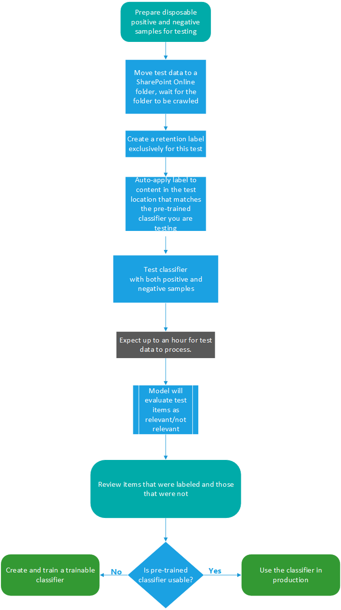

# Introduzione ai classificatori sottoponibili a training (anteprima)

Classificare ed etichettare il contenuto in modo che possa essere protetto e gestito correttamente è il punto di partenza per la disciplina di protezione delle informazioni. Microsoft 365 ha tre modi per classificare il contenuto.

## Manualmente

Questo metodo richiede il giudizio umano e l'azione. Un amministratore può utilizzare le etichette preesistenti e i tipi di informazioni riservate oppure crearne di propri e quindi pubblicarli. Gli utenti e gli amministratori li applicano al contenuto quando lo incontrano. È quindi possibile proteggere il contenuto e gestirne la disposizione.

## Corrispondenza del modello automatizzata

Questa categoria di meccanismi di classificazione include la ricerca di contenuto per:

- Parole chiave o valori di metadati (parola chiave Query Language)
- utilizzo di modelli di informazioni riservate in precedenza identificati come la sicurezza sociale, la carta di credito o il conto corrente bancario [(tipi di informazioni riservate)](what-the-sensitive-information-types-look-for.md)
- Riconoscere un elemento perché è una variante su un modello [(stampa su un dito del documento)](document-fingerprinting.md)
- utilizzo della presenza di stringhe esatte [(corrispondenza esatta dei dati)](create-custom-sensitive-information-types-with-exact-data-match-based-classification.md).

È quindi possibile applicare automaticamente le etichette di riservatezza e conservazione per rendere il contenuto disponibile per l'utilizzo in [prevenzione della perdita di dati (DLP)](data-loss-prevention-policies.md) e nei [criteri di conservazione](retention-policies.md).

## Classificatori addestrabili

Questo metodo di classificazione è particolarmente adatto ai contenuti che non sono facilmente identificabili tramite i metodi di corrispondenza dei modelli manuale o automatico. Questo metodo di classificazione è più relativo all'addestramento di un classificatore per identificare un elemento in base a ciò che l'elemento è, non per elementi che si trovano nell'elemento (pattern matching). Un classificatore apprende come identificare un tipo di contenuto esaminando centinaia di esempi del contenuto che si desidera classificare. Si inizia con l'alimentazione di esempi che sono definitivamente nella categoria. Dopo averli elaborati, è possibile testarli conferendogli una combinazione di esempi di corrispondenza e non corrispondenti. Il classificatore effettua quindi stime per determinare se un determinato elemento rientra nella categoria che si sta creando. Sono quindi convalidati i risultati, vengono ordinati gli aspetti positivi, negativi, falsi positivi e falsi negativi per aumentare l'accuratezza delle stime. Quando si pubblica il classificatore addestrato, l'ordinamento viene ordinato tramite gli elementi in posizioni come SharePoint Online, Exchange e OneDrive e classifica il contenuto.

> [!IMPORTANT]
> Sia i classificatori incorporati che i classificatori addestrati sono disponibili come condizione per [l'applicazione automatica dei criteri delle etichette di conservazione in base a una condizione](labels.md#applying-a-retention-label-automatically-based-on-conditions) e alla [conformità della comunicazione](communication-compliance.md). Le etichette di riservatezza possono utilizzare solo classificatori incorporati come condizione, vedere [applicazione automatica di un'etichetta di riservatezza al contenuto](apply-sensitivity-label-automatically.md).

> [!IMPORTANT]
> I classificatori addestrabili funzionano solo con elementi che non sono crittografati e sono in lingua inglese.

### Requisiti per la licenza

I classificatori addestrabili sono una funzionalità di conformità di Microsoft 365 E5 o E5. È necessario disporre di uno di questi abbonamenti per utilizzarli.

## Tipi di classificatori

Esistono classificatori incorporati e classificatori addestrabili. Ottenere un classificatore addestrabile a uno stato di pubblicazione richiede un investimento di tempo per addestrarlo. Per iniziare a utilizzare i classificatori, Microsoft 365 viene fornito con alcuni classificatori incorporati.

> [!NOTE]
> Prima di utilizzare un classificatore incorporato nel flusso di lavoro di classificazione e etichettatura, è consigliabile verificarlo in base a un campione del contenuto delle organizzazioni che si adatta alla categoria per verificare che le stime di classificazione soddisfino le proprie aspettative.

### Informazioni sui classificatori incorporati

Microsoft 365 viene fornito con cinque classificatori incorporati consigliati:

> [!CAUTION]
> Il classificatore incorporato del **linguaggio offensivo** è obsoleto perché produce un numero elevato di falsi positivi. Non utilizzarlo e, se lo si sta attualmente utilizzando, è consigliabile spostarne i processi aziendali. È consigliabile utilizzare invece i classificatori incorporati per la **minaccia**, la **profanità**e la **molestia** .

- **Resumes**: rileva gli elementi che sono account testuali di qualifiche personali, didattiche, professionali del richiedente, esperienze lavorative e altre informazioni di identificazione personale
- **Codice sorgente**: consente di rilevare gli elementi che contengono una serie di istruzioni e istruzioni scritte nella Top 25 linguaggi di programmazione utilizzati su GitHub

|nome della lingua|||||
|---------|---------|---------|---------|---------|
|ActionScript|C        |C #       |C++     |Clojure  |
|CoffeeScript|CSS     |Andare       |Haskell |HTML     |
|Java     |JavaScript|Lua      |MATLAB   |Objective-C|
|Perl     |PHP      |Python   |R        |Trascizione fonetica     |
|Scala    |Shell    |Swift    |Tex      |Script VIM|

> [!NOTE]
> Il codice sorgente è addestrato per rilevare quando la maggior parte del testo è codice sorgente. Non rileva il testo del codice sorgente intervallato da testo normale.

- **Molestie**: rileva una categoria specifica di elementi di testo di lingua offensiva relativi alla condotta offensiva che mira a una o più persone in base alle caratteristiche seguenti: razza, etnia, religione, origine nazionale, genere, orientamento sessuale, età, disabilità
- **Parolacce**: rileva una categoria specifica di elementi di testo di lingua offensiva che contengono espressioni che imbarazzano la maggior parte delle persone
- **Threat**: rileva una categoria specifica di elementi di testo offensivi relativi alle minacce per commettere violenze o arrecare danni fisici a una persona o a una proprietà

Questi vengono visualizzati nella visualizzazione classificazione dei classificati di **Microsoft 365 Compliance Center**  >  **Data Classification (Preview)**  >  **Trainable classifiers** con lo stato di `Ready to use` .

> [!IMPORTANT]
> Si noti che la lingua offensiva, la molestia, la profanità e i classificatori di minacce funzionano solo con il testo ricercabile non sono esaustivi o completi.  Inoltre, gli standard linguistici e culturali cambiano continuamente e, alla luce di queste realtà, Microsoft si riserva il diritto di aggiornare questi classificatori a sua discrezione. Anche se i classificatori possono assistere la propria organizzazione nel monitoraggio di un'offensiva e di altre lingue utilizzate, i classificatori non affrontano le conseguenze di tale lingua e non sono destinati a fornire il solo mezzo di monitoraggio o di risposta dell'organizzazione all'uso di tale lingua. La propria organizzazione e non Microsoft o le sue affiliate resta responsabile di tutte le decisioni relative al monitoraggio, all'applicazione, al blocco, alla rimozione e alla conservazione di qualsiasi contenuto identificato da un classificatore preformato.

#### Flusso di processo per l'utilizzo dei classificatori incorporati

I classificatori incorporati non devono essere addestrati, ma è necessario verificare che vengano identificati i tipi di contenuto a cui sono necessari prima di utilizzarli nelle soluzioni di conformità. Il testing di un classificatore preconfigurato segue questo flusso.

### Informazioni sui classificatori addestrabili

Quando i classificatori incorporati non soddisfano le proprie esigenze, è possibile creare e formare i propri classificatori. È molto più necessario collaborare con la creazione dei propri utenti, ma sarà molto meglio adattare le proprie esigenze alle organizzazioni. Per ulteriori informazioni su come utilizzare un classificatore preconfigurato, vedere Utilizzo di [un classificatore incorporato](classifier-using-a-ready-to-use-classifier.md)

> [!IMPORTANT]
> Solo l'utente che crea un classificatore addestrabile può formare e rivedere le stime eseguite dal classificatore.

#### Flusso di processo per la creazione di classificatori addestrabili

La creazione e la pubblicazione di un classificatore addestrabile per l'utilizzo in soluzioni di conformità, ad esempio i criteri di conservazione e la supervisione della comunicazione, seguono questo flusso. Per ulteriori informazioni sulla creazione di un classificatore addestrabile, vedere [creazione di un classificatore addestrabile](classifier-creating-a-trainable-classifier.md).

## Vedere anche

- [etichette di conservazione](labels.md)
- [criteri di conservazione](retention-policies.md)
- [prevenzione della perdita di dati (DLP)](data-loss-prevention-policies.md)
- [etichette di riservatezza](sensitivity-labels.md)
- [tipi di informazioni riservate](what-the-sensitive-information-types-look-for.md)
- [stampa di impronte digitali del documento](document-fingerprinting.md)
- [corrispondenza esatta dei dati](create-custom-sensitive-information-types-with-exact-data-match-based-classification.md)