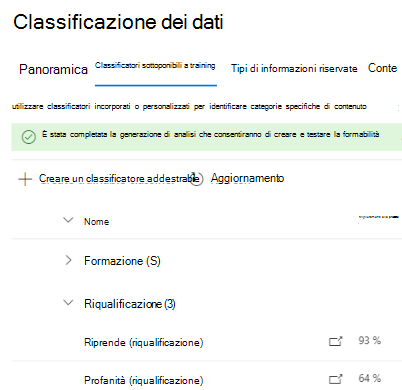

# Come ripetere il training di un classificatore in Conformità alle comunicazioni

Un classificatore addestrabile di Microsoft 365 è uno strumento che è possibile addestrare per riconoscere vari tipi di contenuto fornendo esempi da esaminare. Una volta addestrato, è possibile utilizzarlo per identificare gli elementi per l'applicazione delle etichette di sensibilità di Office, i criteri di conformità delle comunicazioni e i criteri etichette di conservazione.

In questo articolo viene illustrato come migliorare le prestazioni dei classificatori addestrabili personalizzati e di alcuni classificatori preformati fornendo loro commenti e suggerimenti aggiuntivi.

Per ulteriori informazioni sui diversi tipi di classificatori, vedere [informazioni sui classificatori addestrabili](classifier-learn-about.md).

## Autorizzazioni

Per accedere ai classificatori nel centro conformità di Microsoft 365:

- il ruolo di amministratore conformità o l'amministratore dei dati di conformità è necessario per formare un classificatore

Sono necessari account con queste autorizzazioni per l'utilizzo dei classificatori in questi scenari:

- Scenario di criteri di conformità della comunicazione: amministratore di gestione dei rischi Insider, Responsabile Revisione di supervisione 

## Flusso di lavoro globale

> [!IMPORTANT]
> È possibile fornire commenti e suggerimenti nella soluzione di conformità che utilizza il classificatore come condizione. **Se non si dispone di un criterio di conformità per le comunicazioni che utilizza un classificatore come condizione, interrompere qui.**

Quando si utilizzano i classificatori, è possibile aumentare la precisione delle classificazioni che stanno facendo. A tale scopo, valutare la qualità delle classificazioni eseguite per gli elementi identificati come una corrispondenza o non una corrispondenza. Dopo aver eseguito 30 valutazioni per un classificatore, è necessario che i commenti e suggerimenti vengano riaddestrati automaticamente.

Per ulteriori informazioni sul flusso di lavoro globale di riqualificazione di un classificatore, vedere [Process Flow for retraining a Classificator](classifier-learn-about.md#retraining-classifiers).

> [!NOTE]
> Un classificatore deve essere già pubblicato e in uso prima che possa essere riaddestrato.

## Come riqualificare un classificatore nei criteri di conformità della comunicazione

1. Aprire il criterio di conformità della comunicazione che utilizza un classificatore come condizione e scegliere uno degli elementi identificati dall'elenco **in sospeso** .
2. Scegliere i puntini di sospensione e **migliorare la classificazione**.
3. Nel riquadro dei **commenti e suggerimenti dettagliati** , se l'elemento è un valore true positive, scegliere **match**.  Se l'elemento è un falso positivo, ovvero non è stato incluso in modo errato nella categoria, scegliere **non una corrispondenza**.
4. Se è presente un altro classificatore più appropriato per l'elemento, è possibile sceglierlo nell'elenco **Suggerisci altri classificatori addestrabili** . Questo attiverà l'altro classificatore per valutare l'elemento.

> [!TIP]
> È possibile fornire commenti e suggerimenti su più elementi contemporaneamente, scegliendo tutti e quindi scegliendo **Fornisci commenti e suggerimenti dettagliati** sulla barra dei comandi.

5. Scegliere **Invia commenti e suggerimenti** per inviare la valutazione `match` delle `not a match` classificazioni e suggerire altri classificatori addestrabili. Quando sono state fornite 30 istanze di commenti e suggerimenti a un classificatore, la riqualificazione viene automaticamente. La riqualificazione può richiedere da 1-4 ore. I classificatori possono essere riaddestrati solo due volte al giorno.

> [!IMPORTANT]
> Queste informazioni passano al classificatore del tenant, **ma non tornano a Microsoft**.

6.  Aprire la pagina di **classificazione dei dati** nel **centro conformità di Microsoft 365**.
7. Aprire **classificatori addestrabili**.
8. Il classificatore che è stato utilizzato nei criteri di conformità delle comunicazioni verrà visualizzato nell'intestazione **riqualificazione** .

9. Una volta completata la riqualificazione, scegliere il classificatore per aprire la panoramica sulla riqualificazione.

10. Esaminare l'azione consigliata e i confronti di stima delle versioni riqualificate e attualmente pubblicate del classificatore.
11. Se si è soddisfatti dei risultati della riqualificazione, scegliere **ripubblicare**.
12. Se non si è soddisfatti dei risultati della riqualificazione, è possibile scegliere di fornire ulteriori commenti e suggerimenti al classificatore nell'interfaccia di conformità delle comunicazioni e avviare un altro ciclo di riqualificazione o non eseguire alcuna operazione nel qual caso la versione attualmente pubblicata del classificatore continuerà a essere utilizzata. 

## Informazioni dettagliate sulla ripubblicazione dei suggerimenti

Ecco alcune informazioni su come formulare la raccomandazione di ripubblicare un classificatore riaddestrato o suggerire ulteriori ricorsi. Ciò richiede una conoscenza più approfondita del funzionamento dei classificatori addestrabili.

Dopo una riqualificazione, vengono valutate le prestazioni del classificatore sia sugli elementi con feedback, sia su tutti gli elementi originariamente utilizzati per formare il classificatore. 

- Per i modelli incorporati, gli elementi utilizzati per la formazione del classificatore sono gli elementi utilizzati da Microsoft per creare il modello.
- Per i modelli personalizzati, gli elementi utilizzati nell'allenamento originale il classificatore è compreso tra i siti aggiunti per il test e la revisione.

Vengono confrontati i numeri di prestazioni su entrambi i set di elementi per il classificatore riaddestrato e pubblicato per fornire una raccomandazione sull'eventuale ripubblicazione del miglioramento. 

## Vedere anche

- [Informazioni sui classificatori sottoponibili a training](classifier-learn-about.md)
- [Estensioni dei nomi di file sottoposti a ricerca per indicizzazione e tipi di file analizzati predefiniti in SharePoint Server](https://docs.microsoft.com/sharepoint/technical-reference/default-crawled-file-name-extensions-and-parsed-file-types)
