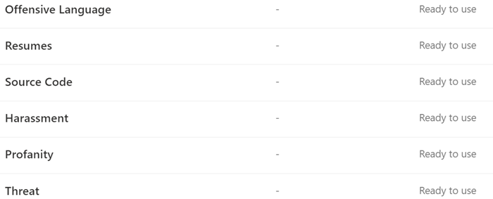

# Informazioni sui classificatori sottoponibili a trainingLearn about trainable classifiers

Classificare ed etichettare il contenuto in modo che possa essere protetto e gestito correttamente è il punto di partenza per la disciplina di protezione delle informazioni.Classifying and labeling content so it can be protected and handled properly is the starting place for the information protection discipline. Microsoft 365 ha tre modi per classificare il contenuto.Microsoft 365 has three ways to classify content.

## ManualmenteManually

Questo metodo richiede il giudizio umano e l'azione.This method requires human judgment and action. Un amministratore può utilizzare le etichette preesistenti e i tipi di informazioni riservate oppure crearne di propri e quindi pubblicarli.An admin may either use the pre-existing labels and sensitive information types or create their own and then publish them. Gli utenti e gli amministratori li applicano al contenuto quando lo incontrano.Users and admins apply them to content as they encounter it. È quindi possibile proteggere il contenuto e gestirne la disposizione.You can then protect the content and manage its disposition.

## Corrispondenza del modello automatizzataAutomated pattern matching

Questa categoria di meccanismi di classificazione include la ricerca di contenuto per:This category of classification mechanisms include finding content by:

- Parole chiave o valori di metadati (linguaggio di query con parole chiave).Keywords or metadata values (keyword query language).
- Utilizzo di modelli di informazioni riservate in precedenza identificati come la sicurezza sociale, la carta di credito o il conto corrente bancario [(definizioni di entità tipo di informazioni riservate)](sensitive-information-type-entity-definitions.md).Using previously identified patterns of sensitive information like social security, credit card or bank account numbers [(Sensitive information type entity definitions)](sensitive-information-type-entity-definitions.md).
- Riconoscere un elemento perché è una variante su un modello [(stampa su un dito del documento)](document-fingerprinting.md).Recognizing an item because it's a variation on a template [(document finger printing)](document-fingerprinting.md).
- Utilizzo della presenza di stringhe esatte [(corrispondenza esatta dei dati)](create-custom-sensitive-information-types-with-exact-data-match-based-classification.md).Using the presence of exact strings [(exact data match)](create-custom-sensitive-information-types-with-exact-data-match-based-classification.md).

Le etichette di conservazione e di sensibilità possono quindi essere applicate automaticamente per rendere il contenuto disponibile per l'utilizzo in [prevenzione della perdita di dati (DLP)](data-loss-prevention-policies.md) e [per l'applicazione automatica delle politiche per le etichette di conservazione](apply-retention-labels-automatically.md).Sensitivity and retention labels can then be automatically applied to make the content available for use in [data loss prevention (DLP)](data-loss-prevention-policies.md) and [auto-apply polices for retention labels](apply-retention-labels-automatically.md).

## ClassificatoriClassifiers

Questo metodo di classificazione è particolarmente adatto ai contenuti che non sono facilmente identificabili tramite i metodi di corrispondenza dei modelli manuale o automatico.This classification method is particularly well suited to content that isn't easily identified by either the manual or automated pattern matching methods. Questo metodo di classificazione è più relativo all'addestramento di un classificatore per identificare un elemento in base a ciò che l'elemento è, non per elementi che si trovano nell'elemento (pattern matching).This method of classification is more about training a classifier to identify an item based on what the item is, not by elements that are in the item (pattern matching). Un classificatore apprende come identificare un tipo di contenuto esaminando centinaia di esempi del contenuto che si desidera classificare.A classifier learns how to identify a type of content by looking at hundreds of examples of the content you're interested in classifying. Si inizia con l'alimentazione di esempi che sono definitivamente nella categoria.You start by feeding it examples that are definitely in the category. Dopo averli elaborati, è possibile testarli conferendogli una combinazione di esempi di corrispondenza e non corrispondenti.Once it processes those, you test it by giving it a mix of both matching and non-matching examples. Il classificatore effettua quindi stime per determinare se un determinato elemento rientra nella categoria che si sta creando.The classifier then makes predictions as to whether any given item falls into the category you're building. È quindi necessario confermare i risultati, ordinare i veri positivi, i negativi veri, i falsi positivi e i falsi negativi per aumentare l'accuratezza delle stime.You then confirm its results, sorting out the true positives, true negatives, false positives, and false negatives to help increase the accuracy of its predictions. 

Quando si pubblica il classificatore, l'ordinamento viene ordinato tramite gli elementi in posizioni come SharePoint Online, Exchange e OneDrive e classifica il contenuto.When you publish the classifier, it sorts through items in locations like SharePoint Online, Exchange, and OneDrive, and classifies the content. Dopo aver pubblicato il classificatore, è possibile continuare a addestrarlo utilizzando un processo di commenti e suggerimenti analogo al processo di formazione iniziale.After you publish the classifier, you can continue to train it using a feedback process that is similar to the initial training process.

### Dove è possibile utilizzare i classificatori addestrabiliWhere you can use trainable classifiers
Sia i classificatori incorporati che i classificatori addestrati sono disponibili come condizione per [Office autolabeling con etichette di riservatezza](apply-sensitivity-label-automatically.md), [applicare automaticamente i criteri delle etichette di conservazione in base a una condizione](apply-retention-labels-automatically.md#configuring-conditions-for-auto-apply-retention-labels) e in [conformità alla comunicazione](communication-compliance.md).Both built-in classifiers and trainable classifiers are available as a condition for [Office autolabeling with sensitivity labels](apply-sensitivity-label-automatically.md), [auto-apply retention label policy based on a condition](apply-retention-labels-automatically.md#configuring-conditions-for-auto-apply-retention-labels) and in [communication compliance](communication-compliance.md). 

Le etichette di riservatezza possono utilizzare i classificatori come condizioni, vedere [applicazione automatica di un'etichetta di riservatezza al contenuto](apply-sensitivity-label-automatically.md).Sensitivity labels can use classifiers as conditions, see [Apply a sensitivity label to content automatically](apply-sensitivity-label-automatically.md).

> [!IMPORTANT]
> I classificatori funzionano solo con elementi che non sono crittografati e sono in lingua inglese.Classifiers only work with items that are not encrypted and are in English.

## Tipi di classificatoriTypes of classifiers

- **classificatori** preformati-Microsoft ha creato e preparato un certo numero di classificatori che è possibile iniziare a usare senza addestrarli.**pre-trained classifiers** - Microsoft has created and pre-trained a number of classifiers that you can start using without training them. Questi classificatori verranno visualizzati con lo stato di `Ready to use` .These classifiers will appear with the status of `Ready to use`.
- **classificatori personalizzati** : se si dispone di esigenze di classificazione che si estendono oltre a quelle prequalificate, è possibile creare e formare i propri classificatori.**custom classifiers** - If you have classification needs that extend beyond what the pre-trained classifiers cover, you can create and train your own classifiers.

### Classificatori prequalificatiPre-trained classifiers

Microsoft 365 viene fornito con cinque classificatori prequalificati:Microsoft 365 comes with five pre-trained classifiers:

> [!CAUTION]
> Il classificatore preconfigurato per la **lingua offensiva** è obsoleto perché produce un numero elevato di falsi positivi.We are deprecating the **Offensive Language** pre-trained classifier because it has been producing a high number of false positives. Non utilizzarlo e, se lo si sta attualmente utilizzando, è consigliabile spostarne i processi aziendali.Don't use it and if you are currently using it, you should move your business processes off of it. Si consiglia di utilizzare invece la **minaccia**, la **profanità** e le **molestie** prequalificate.We recommend using the **Threat**, **Profanity**, and **Harassment** pre-trained classifiers instead.

- **Resumes**: rileva gli elementi che sono account testuali di qualifiche personali, didattiche, professionali del richiedente, esperienze lavorative e altre informazioni di identificazione personale**Resumes**: detects items that are textual accounts of an applicant's personal, educational, professional qualifications, work experience, and other personally identifying information
- **Codice sorgente**: consente di rilevare gli elementi che contengono una serie di istruzioni e istruzioni scritte nella Top 25 linguaggi di programmazione utilizzati su GitHub**Source Code**: detects items that contain a set of instructions and statements written in the top 25 used computer programming languages on GitHub
    - ActionScriptActionScript
    - CC
    - C #C#
    - C++C++
    - ClojureClojure
    - CoffeeScriptCoffeeScript
    - AndareGo
    - HaskellHaskell
    - JavaJava
    - JavaScriptJavaScript
    - LuaLua
    - MATLABMATLAB
    - Objective-CObjective-C
    - PerlPerl
    - PHPPHP
    - PythonPython
    - RR
    - Trascizione foneticaRuby
    - ScalaScala
    - ShellShell
    - SwiftSwift
    - TexTex
    - Script VIMVim Script

> [!NOTE]
> Il codice sorgente è addestrato per rilevare quando la maggior parte del testo è codice sorgente.Source Code is trained to detect when the bulk of the text is source code. Non rileva il testo del codice sorgente intervallato da testo normale.It does not detect source code text that is interspersed with plain text.

- **Molestie**: rileva una categoria specifica di elementi di testo di lingua offensiva relativi alla condotta offensiva che mira a una o più persone in base alle caratteristiche seguenti: razza, etnia, religione, origine nazionale, genere, orientamento sessuale, età, disabilità**Harassment**: detects a specific category of offensive language text items related to offensive conduct targeting one or multiple individuals based on the following traits: race, ethnicity, religion, national origin, gender, sexual orientation, age, disability
- **Parolacce**: rileva una categoria specifica di elementi di testo di lingua offensiva che contengono espressioni che imbarazzano la maggior parte delle persone**Profanity**: detects a specific category of offensive language text items that contain expressions that embarrass most people
- **Threat**: rileva una categoria specifica di elementi di testo offensivi relativi alle minacce per commettere violenze o arrecare danni fisici a una persona o a una proprietà**Threat**: detects a specific category of offensive language text items related to threats to commit violence or do physical harm or damage to a person or property

Questi vengono visualizzati nella   >  visualizzazione **classificazione** dei  >  **classificatori addestrabili** del centro conformità Microsoft 365 con lo stato di `Ready to use` .These appear in the **Microsoft 365 compliance center** > **Data classification** > **Trainable classifiers** view with the status of `Ready to use`.

> [!IMPORTANT]
> Si noti che la lingua offensiva, la molestia, la profanità e i classificatori di minacce funzionano solo con il testo ricercabile non sono esaustivi o completi.Please note that the offensive language, harassment, profanity, and threat classifiers only work with searchable text are not exhaustive or complete.  Inoltre, gli standard linguistici e culturali cambiano continuamente e, alla luce di queste realtà, Microsoft si riserva il diritto di aggiornare questi classificatori a sua discrezione.Further, language and cultural standards continually change, and in light of these realities, Microsoft reserves the right to update these classifiers in its discretion. Anche se i classificatori possono assistere la propria organizzazione nel monitoraggio di un'offensiva e di altre lingue utilizzate, i classificatori non affrontano le conseguenze di tale lingua e non sono destinati a fornire il solo mezzo di monitoraggio o di risposta dell'organizzazione all'uso di tale lingua.While the classifiers may assist your organization in monitoring offensive and other language used, the classifiers do not address consequences of such language and are not intended to provide your organization's sole means of monitoring or responding to the use of such language. La propria organizzazione e non Microsoft o le sue affiliate resta responsabile di tutte le decisioni relative al monitoraggio, all'applicazione, al blocco, alla rimozione e alla conservazione di qualsiasi contenuto identificato da un classificatore preformato.Your organization, and not Microsoft or its subsidiaries, remains responsible for all decisions related to monitoring, enforcement, blocking, removal and retention of any content identified by a pre-trained classifier.

### Classificatori personalizzatiCustom classifiers

Quando i classificatori prequalificati non soddisfano le proprie esigenze, è possibile creare e formare i propri classificatori.When the pre-trained classifiers don't meet your needs, you can create and train your own classifiers. È molto più necessario collaborare con la creazione dei propri utenti, ma sarà molto meglio adattare le proprie esigenze alle organizzazioni.There's significantly more work involved with creating your own, but they'll be much better tailored to your organizations needs. 

Ad esempio, è possibile creare classificatori addestrabili per:For example you could create trainable classifiers for:
 
- Documenti legali, ad esempio Privilege client, set di chiusura, dichiarazione del lavoroLegal documents - such as attorney client privilege, closing sets, statement of work
- Documenti aziendali strategici-come comunicati stampa, fusioni e acquisizioni, offerte, piani aziendali o di marketing, proprietà intellettuale, brevetti, progettazione documentiStrategic business documents - like press releases, merger and acquisition, deals, business or marketing plans, intellectual property, patents, design docs
- Informazioni sui prezzi-come fatture, quotazioni, ordini di lavoro, documenti di offertaPricing information - like invoices, price quotes, work orders, bidding documents 
- Informazioni finanziarie-come gli investimenti organizzativi, i risultati trimestrali o annualiFinancial information - such as organizational investments, quarterly or annual results    

#### Flusso di processo per la creazione di classificatori personalizzatiProcess flow for creating custom classifiers

La creazione e la pubblicazione di un classificatore per l'utilizzo in soluzioni di conformità, ad esempio i criteri di conservazione e la supervisione della comunicazione, seguono questo flusso.Creating and publishing a classifier for use in compliance solutions, such as retention policies and communication supervision, follows this flow. Per ulteriori informazioni sulla creazione di un classificatore addestrabile personalizzato, vedere [creazione di un classificatore personalizzato](classifier-get-started-with.md).For more detail on creating a custom trainable classifier see, [Creating a custom classifier](classifier-get-started-with.md).

### Riqualificazione di classificazioneRetraining classifiers

È possibile migliorare l'accuratezza di tutti i classificatori personalizzati e alcuni classificatori prequalificati fornendo loro commenti e suggerimenti sull'accuratezza della classificazione che eseguono.You can help improve the accuracy of all custom classifiers and some pre-trained classifiers by providing them with feedback on the accuracy of the classification that they perform. Si tratta della riqualificazione e del flusso di lavoro.This is called retraining and follow this workflow.

## Vedere ancheSee also

- [Etichette di conservazioneRetention labels](retention.md)
- [Data loss prevention (DLP)Data loss prevention (DLP)](data-loss-prevention-policies.md)
- [Etichette di riservatezzaSensitivity labels](sensitivity-labels.md)
- [Definizioni delle entità tipo di informazioni sensibiliSensitive information type entity definitions](sensitive-information-type-entity-definitions.md)
- [Stampa di impronte digitali del documentoDocument finger printing](document-fingerprinting.md)
- [Corrispondenza esatta dei datiExact data match](create-custom-sensitive-information-types-with-exact-data-match-based-classification.md)
