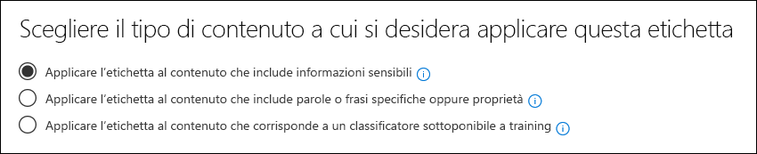

# Utilizzo di un classificatore pronto all'uso (anteprima)

Microsoft ha formato e testato un certo numero di classificatori che utilizzano set di dati di esempio molto grandi, che possono essere utili per identificare determinate categorie di contenuto. Vedere [Guida introduttiva ai classificatori addestrabili (Preview)](classifier-getting-started-with.md). Questi classificatori vengono visualizzati nel `Ready to use` gruppo per impostazione predefinita.

- **Lingua offensiva**: consente di rilevare gli elementi di testo che contengono parolacce, legature, scherni e espressioni mascherate (ovvero espressioni che hanno lo stesso significato di un termine più offensivo).
- **Resumes**: rileva gli elementi che sono account testuali di qualifiche personali, didattiche, professionali del richiedente, esperienze lavorative e altre informazioni di identificazione personale.
- **Codice sorgente**: consente di rilevare gli elementi che contengono una serie di istruzioni e istruzioni scritte nei linguaggi di programmazione ampiamente utilizzati.
- **Molestie**: rileva una categoria specifica di elementi di testo di lingua offensiva relativi alla condotta offensiva che mira a una o più persone in base alle caratteristiche seguenti: razza, etnia, religione, origine nazionale, genere, orientamento sessuale, età, disabilità.
- **Parolacce**: rileva una categoria specifica di elementi di testo di lingua offensiva che contengono espressioni che imbarazzano la maggior parte delle persone.
- **Threat**: rileva una categoria specifica di elementi di testo offensivi relativi alle minacce per commettere violenze o arrecare danni fisici a una persona o a una proprietà,

> [!NOTE]
> Prima di utilizzare i classificatori pronti per l'utilizzo nel flusso di lavoro di classificazione e etichettatura, è consigliabile testarlo su un campione del contenuto dell'organizzazione che si adatta alla categoria per verificare che le stime di classificazione soddisfino le proprie aspettative.

> [!IMPORTANT]
> Si noti che la lingua offensiva, la molestia, la profanità e i classificatori di minacce funzionano solo con il testo ricercabile non sono esaustivi o completi. Inoltre, gli standard linguistici e culturali cambiano continuamente e, alla luce di queste realtà, Microsoft si riserva il diritto di aggiornare questi classificatori a sua discrezione. Anche se i classificatori possono assistere la propria organizzazione nel monitoraggio di un'offensiva e di altre lingue utilizzate, i classificatori non affrontano le conseguenze di tale lingua e non sono destinati a fornire il solo mezzo di monitoraggio o di risposta dell'organizzazione all'utilizzo di tale lingua. La propria organizzazione e non Microsoft o le sue affiliate resta responsabile di tutte le decisioni relative al monitoraggio, all'applicazione, al blocco, alla rimozione e alla conservazione di qualsiasi contenuto identificato da un classificatore preformato.

## Come prepararsi e usare un classificatore pronto per l'uso

1. Raccogliere gli elementi di contenuto di prova monouso che si ritiene appartenenti alla categoria del classificatore pronto per l'uso (corrispondenze positive) e quelli che non devono essere inclusi (corrispondenze negative) nella categoria che si sta testando.

> [!IMPORTANT]
> Gli elementi di esempio non devono essere crittografati e devono essere in inglese.

2. Creare una cartella di SharePoint Online dedicata. attendere almeno un'ora che la cartella venga aggiunta all'indice di ricerca. Prendere nota dell'URL della cartella.

3. Accedere a Microsoft 365 Compliance Center with Compliance admin or Security admin Role Access e aprire **Microsoft 365 Compliance Center** > **Records Management (Preview)** > **Label Policies** Tab.

4. Scegliere `Auto-apply a label`.

5. Scegliere `Choose a label to auto-apply`.

6. Scegliere `Create new labels` e creare un'etichetta per l'utilizzo solo con questo test. Quando si esegue questa operazione, `Retention` lasciare impostato su disattivato. Non si desidera abilitare alcuna conservazione o altre azioni. In questo caso, l'etichetta di conservazione verrà utilizzata semplicemente come etichetta di testo, senza applicare alcuna azione. Ad esempio, è possibile creare un'etichetta di conservazione denominata "test di classificazione del codice sorgente" senza azioni e quindi applicarla automaticamente a contenuto con classificazione del codice sorgente come condizione. Per ulteriori informazioni sulla creazione di etichette di conservazione, vedere [Overview of retention labels](labels.md).
  
7. Scegliere `Auto-apply a label` e quindi `Choose a label to auto-apply`. Per ulteriori informazioni sull'utilizzo di una condizione di applicazione automatica di un'etichetta, vedere [applicazione automatica dei criteri delle etichette di conservazione in base a una condizione](labels.md#applying-a-retention-label-automatically-based-on-conditions).

8. Scegliere l'etichetta di test dall'elenco e scegliere `Next`.

9. Scegliere `Apply label to content that matches a trainable classifier`.

.

10. Scegliere il classificatore dall'elenco, in questo caso`Source Code`

11. Denominare il criterio, ad esempio "codice sorgente pronto per l'uso del test di classificazione".

12. Scegliere `Let me choose specific locations`.

13. Disattiva tutti i percorsi tranne `SharePoint sites` e scegli `Choose sites`.

14. Immettere l'URL del sito dal passaggio 2.

15. Terminare la procedura guidata e scegliere`Auto-apply`

16. Inserire gli elementi di test nella cartella dedicata di SharePoint Online.

17. Consenti l'applicazione dell'etichetta per un'ora.

18. Controllare le proprietà dei documenti per l'etichetta per verificare se il classificatore ha incluso ed escluso il contenuto del test come previsto.

19. Esaminare gli elementi etichettati.

20. Eliminare il contenuto e i criteri di etichetta se il testing è stato completato.

Vedere anche:

- [Introduzione ai classificatori sottoponibili a training (anteprima)](classifier-getting-started-with.md)
- [Panoramica delle etichette di conservazione](labels.md)
- [Applicazione automatica del criterio delle etichette di conservazione in base a una condizione](labels.md#applying-a-retention-label-automatically-based-on-conditions)
