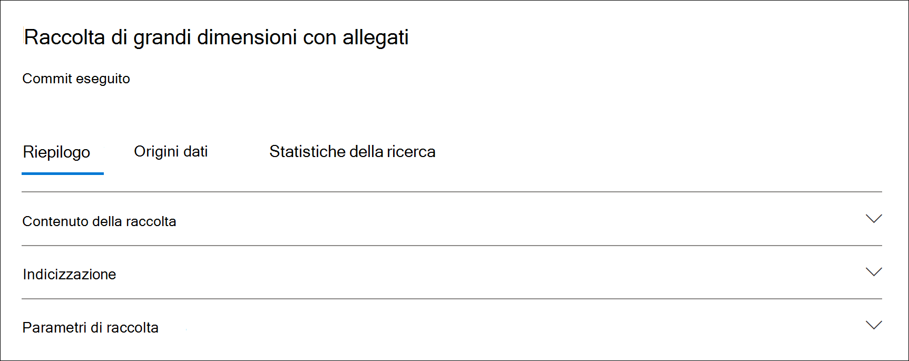

# Statistiche di raccolta e report in Advanced eDiscoveryCollection statistics and reports in Advanced eDiscovery

Dopo aver creato una bozza di raccolta, è possibile visualizzare le statistiche sugli elementi recuperati, ad esempio le posizioni del contenuto che contengono la maggior parte degli elementi corrispondenti ai criteri di ricerca e il numero di elementi restituiti dalla query di ricerca.After you create a draft collection, you can view statistics on the retrieved items, such as the content locations that contain the most items that matched the search criteria and the number of items returned by the search query. È inoltre possibile visualizzare un'anteprima di un sottoinsieme dei risultati.You can also preview a subset of the results.

Dopo aver identificato il set di documenti che si desidera esaminare ulteriormente, è possibile aggiungere i risultati della ricerca a un set di revisione da raccogliere ed elaborare.When you've identified the set of documents you want to further examine, you can add the search results to a review set to collect and process.

## Statistiche e report per le bozze di raccolteStatistics and reports for draft collections

In questa sezione vengono descritte le statistiche disponibili per le bozze delle raccolte.This section describes the statistics that are available for draft collections. Queste statistiche sono disponibili nella scheda **Statistiche** di ricerca nella pagina a comparsa di una bozza di raccolta.These statistics are available on the **Search statistics** tab on the flyout page of a draft collection.

### Stime di raccoltaCollection estimates

In questa sezione viene visualizzato un riepilogo grafico degli elementi stimati restituiti dall'insieme.This section displays a graphical summary of the estimated items returned by the collection. Indica il numero di elementi che soddisfano i criteri di ricerca dell'insieme.This indicates the number of items that match the search criteria of the collection. Queste informazioni danno un'idea del numero stimato di elementi restituiti dall'insieme.This information gives you an idea about the estimated number of items returned by the collection.

- **Elementi stimati in base alle** posizioni : numero totale di elementi stimati restituiti dall'insieme.**Estimated items by locations**: The total number of estimated items returned by the collection. Viene inoltre visualizzato il numero specifico di elementi presenti nelle cassette postali e nei siti.The specific number of items located in mailboxes and located in sites is also displayed.

- **Posizioni stimate con riscontri**: numero totale di percorsi di contenuto che contengono elementi restituiti dalla raccolta.**Estimated locations with hits**: The total number of content locations that contain items returned by the collection. Viene inoltre visualizzato il numero specifico di posizioni di cassette postali e siti.The specific number of mailbox and site locations is also displayed.

- **Volume di dati per posizione (in MB):** dimensione totale di tutti gli elementi stimati restituiti dalla raccolta.**Data volume by location (in MB)**: The total size of all estimated items returned by the collection. Vengono inoltre visualizzate le dimensioni specifiche degli elementi delle cassette postali e degli elementi del sito.The specific size of mailbox items and site items is also displayed.

### Rapporto condizioniCondition report

In questa sezione vengono visualizzate le statistiche relative alla query di ricerca di raccolta e al numero di elementi stimati corrispondenti a parti diverse della query di ricerca.This section displays statistics about the collection search query and the number of estimated items that matched different parts of the search query. È possibile utilizzare queste statistiche per analizzare il numero di elementi che corrispondono a ogni componente della query di ricerca.You can use these statistics to analyze the number of items that match each component of search query. In questo modo è possibile perfezionare i criteri di ricerca per la raccolta e, se necessario, limitare l'ambito della raccolta.This can help you refine the search criteria for the collection and if necessary narrow the scope of the collection.

- **Tipo di percorso**: Tipo di percorso del contenuto a cui sono applicabili le statistiche della query.**Location type**: The type of content location that the query statistics are applicable to. Il valore di **Exchange** indica la posizione di una cassetta postale; il valore **SharePoint** indica la posizione di un sito.The value of **Exchange** indicates a mailbox location; a value of **SharePoint** indicates a site location.

- **Parte**: parte della query di ricerca a cui sono applicabili le statistiche.**Part**: The part of the search query the statistics are applicable to. **Primary** indica l'intera query di ricerca.**Primary** indicates the entire search query. **Keyword** indica che le statistiche nella riga sono relative a una parola chiave specifica.**Keyword** indicates the statistics in the row are for a specific keyword. Se si utilizza un elenco di parole chiave per la query di ricerca nell'insieme, le statistiche per ogni componente della query vengono incluse in questa tabella.If you use a keyword list when for the search query in the collection, statistics for each component of the query are included in this table.

- **Condition**: Componente effettivo (parola chiave o condizione) della query di ricerca eseguita per la raccolta draft che ha restituito le statistiche visualizzate nella riga corrispondente.**Condition**: The actual component (keyword or condition) of the search query that was run for the draft collection that returned the statistics displayed in the corresponding row.

- **Posizioni con risultati**: Numero delle posizioni  del contenuto (specificate dalla colonna Tipo percorso) che contengono gli elementi che corrispondono alla query principale o parola chiave elencata nella **colonna** Condizione.**Locations with hits**: The number of the content locations (specified by the **Location type** column) that contain items that match the primary or keyword query listed in the **Condition** column.

- **Elementi**: numero di elementi (dal percorso di contenuto specificato) che corrispondono alla query elencata nella **colonna** Condizione.**Items**: The number of items (from the specified content location) that match the query listed in the **Condition** column. Come spiegato in precedenza, se un elemento contiene più istanze di una parola chiave in fase di ricerca, viene conteggiato una sola volta in questa colonna.As previously explained, if an item contains multiple instances of a keyword that is being searched for, it's only counted once in this column.

- **Dimensione (MB):** dimensione totale di tutti gli elementi trovati (nel percorso di contenuto specificato) che corrispondono alla query di ricerca nella **colonna** Condizione.**Size (MB)**: The total size of all items that were found (in the specified content location) that match the search query in the **Condition** column.

### Posizioni principaliTop locations

In questa sezione vengono visualizzate le statistiche relative ai percorsi di contenuto specifici con la maggior parte degli elementi restituiti dalla raccolta.This section displays statistics about the specific content locations with the most items returned by the collection.

- Nome del nome della posizione (l'indirizzo di posta elettronica delle cassette postali e l'URL per i siti).The name of the location name (the email address of mailboxes and the URL for sites).

- Tipo di posizione (una cassetta postale o un sito).Location type (a mailbox or site).

- Numero stimato di elementi nel percorso del contenuto restituito dalla raccolta.Estimated number of items in the content location returned by the collection.

- Dimensione totale degli elementi stimati in ogni percorso di contenuto.The total size of estimated items in each content location.

## Statistiche e report per le raccolte di cui è stato eseguito il commitStatistics and reports for committed collections

In questa sezione vengono descritte le statistiche disponibili dopo il commit di una raccolta in un set di recensioni, incluso il numero effettivo di elementi aggiunti al set di recensioni.This section describes the statistics that are available after you commit a collection to a review set, including the actual number of items added to the review set. Queste statistiche, oltre alle informazioni sul set di caricamento, forniscono informazioni cronologiche sul contenuto aggiunto a un caso.These statistics (in addition to load set information) provide historical information about content added to a case.

Dopo aver eseguito il commit di una raccolta in un set di revisione, nella pagina a comparsa della connessione di cui è stato eseguito il commit vengono visualizzate le schede seguenti.After you commit a collection to a review set, the following tabs are displayed on the flyout page of the committed connection. Ognuna di queste schede contiene diversi tipi di informazioni sull'insieme.Each of these tabs contains different types of information about the collection.

### Contenuto della raccoltaCollection contents

Questa sezione della **scheda Riepilogo** contiene statistiche e altre informazioni sugli elementi raccolti dalle origini dati nella raccolta e aggiunti al set di revisioni.This section of the **Summary** tab contains statistics and other information about the items that were collected from the data sources in the collection and added to the review set.

- **Totale elementi estratti**.**Total extracted items**. Numero totale di elementi aggiunti al set di revisioni.The total number of items added to the review set. Questo numero indica la somma degli elementi padre e figlio aggiunti al set di revisioni.This number indicates the sum of parent items and child items added to the review set.

  > [!TIP]
  > Posizionare il puntatore del mouse sulle barre degli elementi padre o figlio per visualizzare il numero totale di elementi padre o figlio.Hover the cursor over the parent or child item bars to display the total number of parent or child items.

- **Elementi padre**.**Parent items**. Numero di elementi restituiti dall'insieme utilizzati per raccogliere gli elementi aggiunti al set di revisione.The number of items returned by the collection that was used to collect the items that were added to the review set. Questo numero corrisponde (ed è uguale al) numero stimato di elementi visualizzato nella **sezione Parametri raccolta.**This number corresponds  to (and is equal to) the estimated number of items that is displayed in the **Collection parameters** section. Numero di elementi padre che raccoglie le informazioni utilizzate per raccogliere gli elementi aggiunti al set di revisioni.The number of parent items he collection information that was used to collect the items that were added to the review set.
 
   Un elemento padre può contenere più elementi figlio.A parent item might contain multiple child items. Ad esempio, un messaggio di posta elettronica è un elemento padre se contiene un file allegato o ha un allegato cloud.For example, an email message is a parent item if it contains an attached file or has a cloud attachment. In questo caso, il file allegato o la destinazione dell'allegato cloud sono considerati elementi figlio.In this case, the attached file or the target of the cloud attachment are considered child items. Quando si esegue il commit di una raccolta, gli elementi padre e gli elementi figlio corrispondenti vengono aggiunti al set di revisione come singoli elementi o file.When you commit a collection, parent items and any corresponding child items are added to the review set as individual items or files.

- **Elementi figlio**.**Child items**. Numero di elementi figlio aggiunti al set di revisioni.The number of child items added to the review set. Gli elementi figlio sono allegati o altre parti di un elemento padre.Child items are attachments or other parts of a parent item. Gli elementi figlio includono file allegati, allegati cloud, immagini e firme di posta elettronica.Child items include attached files, cloud attachments, images, and email signatures. Quando si esegue il commit di una raccolta in un set di revisione, gli elementi figlio vengono estratti, indicizzati e aggiunti al set di revisione come singoli file.When you commit a collection to a review set, child items are extracted, indexed, and added to the review set as individual files.

- **Elementi univoci**.**Unique items**. Numero di elementi univoci aggiunti al set di revisioni.The number of unique items added to the review set. Gli elementi univoci sono univoci per il set di recensioni.Unique items are unique to the review set. Tutti gli elementi sono univoci quando la prima raccolta viene aggiunta a un nuovo set di revisioni perché non sono presenti elementi precedenti nel set di recensioni.All items are unique when the first collection is added to a new review set because there were no previous items in the review set.

- **Elementi duplicati identificati**.**Identified duplicate items**. Numero di elementi della raccolta che non sono stati aggiunti al set di revisioni perché lo stesso elemento esiste già nel set di revisione.The number of items from the collection that were not added to the review set because the same item already exists in the review set. Le statistiche sugli elementi duplicati consentono di spiegare le differenze tra il numero di elementi stimati di una raccolta di bozze e il numero effettivo di elementi aggiunti al set di recensioni.Statistics about duplicate items can help explain the differences between the number of estimated items from a draft collection and the actual number of items added to the review set.

### IndicizzazioneIndexing

La **sezione Indicizzazione** nella scheda Riepilogo **di** un set di revisioni di cui è stato eseguito il commit contiene informazioni di indicizzazione sugli elementi aggiunti al set di revisione.The **Indexing** section on the **Summary** tab of a committed review set contains indexing information about the items added to the review set.

**Nuovi elementi indicizzati**.**New indexed items**. Numero di elementi appena indicizzati prima di essere aggiunti al set di revisioni.The number of items that were newly indexed before they were added to the review set. Un esempio di elemento appena indicizzato sono gli elementi figlio estratti da un elemento padre e quindi indicizzati prima di essere aggiunti al set di revisioni.An example of a newly indexed item are child items that are extracted from a parent item then indexed before they're added to the review set. Inoltre, gli elementi che non si trovano nelle origini dati di  archiviazione e nei percorsi di contenuto non depositario elencati nella scheda Origini dati nel caso vengono indicizzati prima di essere aggiunti alla revisione.Also, items that aren't located in custodial data sources and non-custodial content locations listed on the **Data sources** tab in the case are indexed before they're added to the review. Ad esempio, i nuovi elementi indicizzati includerebbero gli elementi raccolti da posizioni aggiuntive.For example, newly indexed items would include items collected from additional locations.

**Elementi indicizzati aggiornati**.**Updated indexed items**. Numero di elementi parzialmente indicizzati correttamente indicizzati e aggiunti al set di revisioni.The number of partially indexed items that were successfully indexed and added to the review set. In questo modo, gli elementi parzialmente indicizzati da  posizioni di contenuto di tipo depositario e non depositario vengono indicizzati correttamente quando è stato eseguito il commit della raccolta nel set di revisioni.This would partially indexed items from custodial and non-custodial content locations **Data sources** tab that were successfully indexed when the collection was committed to the review set.

**Errori di indicizzazione**.**Indexing errors**. Numero di elementi parzialmente indicizzati che non è stato possibile indicizzare prima di essere aggiunti al set di revisioni.The number of partially indexed items that couldn't be indexed before they were added to the review set. Questi elementi potrebbero richiedere la correzione degli errori.These items might require error remediation.

### Parametri di raccoltaCollection parameters

In questa sezione vengono visualizzate le informazioni sulla raccolta utilizzate per raccogliere gli elementi aggiunti al set di revisioni.This section displays the collection information that was used to collect the items that were added to the review set. In questa scheda vengono visualizzate informazioni simili a quelle della **scheda Statistiche di** ricerca. In questa sezione viene fornita una rapida panoramica della query di ricerca utilizzata dalla raccolta, dei percorsi di contenuto in cui è stata eseguita la ricerca e dei risultati stimati della raccolta.This tab displays information that is similar to the information on the **Search statistics** tab. This section provides a quick snap shot of the search query used by the collection, the content locations that were searched, and the estimated collection results. Come spiegato in precedenza, il numero di elementi stimati in questa sezione sarà uguale al numero di elementi padre visualizzati nella **sezione Contenuto raccolta.**As previously explained, the number of estimated items in this section would be equal to the number of parent items shown in the **Collection contents** section.

### Scheda Statistiche di ricercaSearch statistics tab

Le statistiche visualizzate nella scheda **Statistiche** di ricerca sono le stesse dell'ultima volta che è stata eseguita una bozza di raccolta.The statistics displayed on the **Search statistics** tab are the same statistics from the last time that a draft collection was run. Sono incluse le stime di raccolta, il report delle condizioni e le posizioni principali.This includes collection estimates, condition report, and top locations. Queste informazioni vengono conservate dalla raccolta di bozze per riferimento cronologico e possono essere confrontate con la raccolta effettiva di cui è stato eseguito il commit nel set di revisione.This information is preserved from the draft collection for historical reference, and can be compared to the actual collection that was committed to the review set.

## Differenze tra le stime di raccolta bozze e la raccolta di cui è stato eseguito il commit effettivoDifferences between draft collection estimates and the actual committed collection

Quando si esegue una bozza di raccolta, nella scheda Riepilogo e nella sezione Stime raccolta della  scheda Statistiche di  ricerca viene visualizzata una stima del numero di elementi (e delle relative dimensioni totali) che soddisfano i criteri di raccolta.  Dopo aver eseguito il commit di una raccolta di bozze in un set di recensioni, il numero effettivo di elementi (e le relative dimensioni totali) aggiunti al set di recensioni è spesso diverso dalle stime.When you run a draft collection, an estimate of the number of items (and their total size) that meet the collection criteria is displayed on the **Summary** tab and in **Collection estimates** section of the **Search statistics** tab. After you commit a draft collection to a review set, the actual number of items (and their total size) added the review set are often different from the estimates. Nella maggior parte dei casi, al set di revisioni vengono aggiunti più elementi di quelli stimati dalla raccolta delle bozze.In most cases, more items are added to the review set than were estimated from the draft collection. Nell'elenco seguente vengono descritti i motivi più comuni per queste differenze e i suggerimenti per identificarle:The following list describes the most common reasons for these differences and tips for identifying them:

- **Elementi figlio**.**Child items**. Elementi figlio estratti dagli elementi padre e aggiunti come singoli file.Child items that are extracted from their parent items and added as individual files. Il numero di elementi figlio può aumentare in modo significativo il numero di elementi effettivamente aggiunti al set di revisioni.The number of child items may significantly increase the number of items that are actually added to the review set. In generale, il numero di  elementi padre identificati  nella sezione Contenuto raccolta nella scheda Riepilogo di una raccolta di cui è stato eseguito il commit deve essere uguale al numero di elementi stimati della raccolta bozza.In general, the number of parent items identified in the **Collection contents** section on the **Summary** tab of a committed collection should be equal to the number of estimated items from the draft collection.

- **Elementi duplicati**.**Duplicate items**. Gli elementi della raccolta di bozze già aggiunti al set di recensioni in una raccolta precedente non verranno aggiunti.Items from the draft collection that have already been added to the review set in a previous collection won't be added. Come spiegato in precedenza, il numero di elementi duplicati nell'insieme viene visualizzato nella **sezione Contenuto** raccolta della **scheda** Riepilogo.As previously explained, the number of duplicate items in the collection is displayed in the **Collection contents** section on the **Summary** tab.

- **Opzioni di configurazione della raccolta**.**Collection configuration options**. Quando si esegue il commit di una raccolta di bozze in un insieme di revisioni, è necessario scegliere di includere thread di conversazione, allegati cloud e versioni di documenti.When you commit a draft collection to a review set, you have to option to include conversation threads, cloud attachments, and document versions. Uno di questi elementi aggiunti al set di revisione non è incluso nelle stime della raccolta di bozze.Any of these items that are added to the review set aren't included in the estimates of the draft collection. Vengono identificati e raccolti solo quando si esegue il commit della raccolta.They are identified and collected only when you commit the collection. La selezione di queste opzioni probabilmente aumenterà il numero di elementi aggiunti al set di recensioni.Selecting these options will most likely increase the number of items added to the review set. 

    Ad esempio, più versioni SharePoint documenti non sono incluse nella stima per la raccolta bozze.For example, multiple versions of SharePoint documents aren't included in the estimate for the draft collection. Tuttavia, se si seleziona l'opzione per includere tutte le versioni dei documenti quando si esportano i risultati della ricerca, il numero effettivo (e la dimensione totale) degli elementi aggiunti al set di revisioni aumenta.But if you select the option to include all document versions when you export the search results, which will increase the actual number (and total size) of items added to the review set. 

    Per ulteriori informazioni su queste opzioni, vedere [Commit a draft collection to a review set](commit-draft-collection.md#commit-a-draft-collection-to-a-review-set-in-advanced-ediscovery).For more information about these options, see [Commit a draft collection to a review set](commit-draft-collection.md#commit-a-draft-collection-to-a-review-set-in-advanced-ediscovery). 

Ecco altri motivi per cui i risultati stimati di una bozza di raccolta possono essere diversi rispetto ai risultati effettivi di cui è stato eseguito il commit.Here are other reasons why the estimated results from a draft collection can be different that the actual committed results.

- **Il modo in cui i risultati vengono stimati per le bozze delle raccolte**.**The way results are estimated for draft collections**. Una stima dei risultati della ricerca restituiti da una bozza di raccolta è semplicemente una stima (e non un conteggio effettivo) degli elementi che soddisfano i criteri di query di raccolta.An estimate of the search results returned by a draft collection is just that, an estimate (and not an actual count) of the items that meet the collection query criteria. Per compilare la stima degli elementi di posta elettronica, viene richiesto un elenco degli ID dei messaggi che soddisfano i criteri di ricerca dal database Exchange di posta elettronica.To compile the estimate of email items, a list of the message IDs that meet the search criteria is requested from the Exchange database. Tuttavia, quando si esegue il commit della raccolta in un insieme di revisioni, la raccolta viene rieseguita e i messaggi effettivi vengono recuperati dal database Exchange revisione.But when you commit the collection to a review set, the collection is rerun and the actual messages are retrieved from the Exchange database. Di conseguenza, le differenze potrebbero derivare dal modo in cui vengono determinati il numero stimato di elementi e il numero effettivo di elementi.So differences might result because of how the estimated number of items and the actual number of items are determined.

- **Modifiche che si verificano tra il momento in cui si esegue la stima e il commit delle raccolte di bozze.****Changes that happen between the time when estimating and committing draft collections**. Quando si esegue il commit di una bozza di raccolta in un set di revisione, la ricerca viene rieseguita per raccogliere gli elementi più recenti nell'indice di ricerca che soddisfano i criteri di ricerca.When you commit a draft collection to a review set, the search is rerun to collect that most recent items in the search index that meet the search criteria. È possibile che altri elementi sono stati creati, inviati o eliminati che soddisfano i criteri di ricerca nel periodo compreso tra l'ultima esecuzione della raccolta bozze e il commit della raccolta bozze in un set di revisione.It's possible that additional items were created, sent, or deleted that meet the search criteria in the time between when the draft collection was last run and when the draft collection is committed to a review set. È inoltre possibile che gli elementi presenti nell'indice di ricerca quando sono stati stimati i risultati della bozza della raccolta non siano più presenti perché sono stati eliminati da un'origine dati prima di eseguire il commit della raccolta.It's also possible that items that were in the search index when the draft collection results were estimated are no longer there because they were purged from a data source before committing the collection. Un modo per ovviare a questo problema è specificare un intervallo di date per una raccolta.One way to mitigate this issue is to specify a date range for a collection. Un altro modo è quello di conservare i percorsi del contenuto in modo che gli elementi siano conservati e non possano essere eliminati.Another way is to place a hold on content locations so that items are preserved and can't be purged.

- **Elementi non indicizzati**.**Unindexed items**. Se la raccolta di bozze includeva la ricerca in tutte le cassette postali di Exchange o in tutti i siti di SharePoint, solo gli elementi non indicizzati delle posizioni di contenuto contenenti elementi che soddisfano i criteri di raccolta verranno aggiunti al set di revisioni.If the draft collection included searching all Exchange mailboxes or all SharePoint sites, then only unindexed items from content locations that contain items that match the collection criteria will be added to the review set. In altre parole, se non vengono trovati risultati in una cassetta postale o in un sito, gli eventuali elementi non indicizzati in tale cassetta postale o sito non verranno aggiunti al set di revisione.In other words, if no results are found in a mailbox or site, then any unindexed items in that mailbox or site won't be added to the review set. Tuttavia, gli elementi non indicizzati da tutti i percorsi di contenuto (anche quelli che non contengono elementi che corrispondono alla query di raccolta) verranno inclusi nei risultati stimati della raccolta.However, unindexed items from all content locations (even those that don't contain items that match the collection query) will be included in the estimated collection results.

    In alternativa, se la raccolta di bozze include percorsi di contenuto  specifici (ovvero cassette postali o siti specifici in cui è specificato nella pagina Percorsi aggiuntivi nella procedura guidata di raccolta delle bozze), verranno esportati gli elementi non indicizzati (non esclusi dai criteri di raccolta) dai percorsi di contenuto specificati nella ricerca.Alternatively, if the draft collection included specific content locations (which means that specific mailboxes or sites where specified on the **Additional locations** page in the draft collection wizard), then unindexed items (that aren't excluded by the collection criteria) from the content locations specified in the search will be exported. In questo caso, il numero stimato di elementi non indicizzati e il numero di elementi non indicizzati aggiunti al set di revisioni devono essere uguali.In this case, the estimated number of unindexed items and the number of unindexed items that are added to the review set should be the same.
