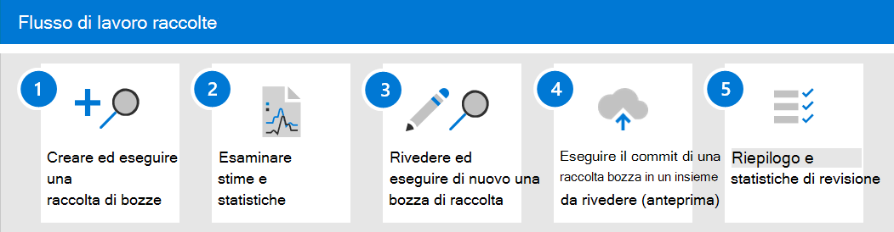

# Informazioni sulle raccolte in Advanced eDiscovery

> [!NOTE]
> Stiamo implementazione di una nuova esperienza di raccolta in Advanced eDiscovery, descritta in questo articolo. Questa implementazione avrà un certo numero di settimane prima che sia disponibile per tutte le organizzazioni. Se la nuova esperienza di raccolta non è disponibile nell'organizzazione, è comunque possibile raccogliere il contenuto del caso con lo strumento di ricerca [avanzata di eDiscovery.](create-search-to-collect-data.md)

Quando le organizzazioni devono raccogliere le comunicazioni e i contenuti che possono essere rilevanti per un'indagine o un potenziale contenzioso, devono affrontare una sfida significativa nelle migliori circostanze. Nell'ambiente di lavoro moderno di oggi, il volume, la varietà e la velocità dei contenuti consentono l'innovazione e il lavoro remoto, espandendo allo stesso tempo i requisiti e il processo di gestione delle raccolte per le indagini di eDiscovery.

Il flusso di lavoro della raccolta pone significative sfide tecniche per l'estrazione di contenuto da posizioni e origini native. È anche un punto critico nella valutazione e nella strategia per scenari comuni di controversie o indagini. Quando le organizzazioni iniziano a valutare un'indagine, le prime domande sono chi è stato coinvolto? Dopo aver identificato chi è stato coinvolto, questi custodi possono essere messi in attesa rapidamente per conservare il contenuto pertinente. La domanda successiva è cosa è avvenuto? Per rispondere a questa seconda domanda fondamentale di qualsiasi indagine, i responsabili devono rivolgersi ai dati. Per valutare rapidamente il contenuto più rilevante per la questione di ciò che è avvenuto, i manager iniziano a perfezionare l'obiettivo della domanda per garantire che i risultati della raccolta siano completi senza essere troppo ampi.

Le raccolte in Advanced eDiscovery consentono ai responsabili di eDiscovery di individuare rapidamente il contenuto di posta elettronica, documenti e altro contenuto in Microsoft 365. Le raccolte forniscono ai responsabili una stima del contenuto che potrebbe essere rilevante per il caso. In questo modo i responsabili possono prendere decisioni rapide e informate sulle dimensioni e l'ambito del contenuto rilevante per un caso. I responsabili di eDiscovery possono creare una raccolta per cercare origini dati di archiviazione (ad esempio cassette postali e siti di SharePoint) e utilizzando criteri di ricerca specifici (ad esempio parole chiave e intervalli di date) per definire rapidamente l'ambito della raccolta.

Dopo aver definito la raccolta, i responsabili di eDiscovery possono salvare la raccolta come bozza e ottenere stime, incluse le stime per il volume di dati, le posizioni del contenuto che contengono risultati e il numero di risultati per la condizione di query di ricerca. Queste informazioni dettagliate consentono di determinare se la raccolta deve essere rivista per restringere o espandere l'ambito della raccolta prima di passare alla revisione e analizzare le fasi del flusso di lavoro di eDiscovery.

Quando il responsabile è soddisfatto dell'ambito della raccolta e della quantità stimata di  contenuto che potrebbe rispondere, il responsabile può aggiungere o confermare il contenuto in un set di recensioni. Quando si esegue il commit di una raccolta in un set di revisioni, tale responsabile ha anche le opzioni per includere conversazioni in chat, allegati cloud e versioni di documenti. Il contenuto della raccolta passa anche attraverso un altro livello di elaborazione durante l'inserimento nel set di revisione. e la raccolta verrà aggiornata con il riepilogo finale della raccolta. Dopo l'aggiunta del contenuto al set di revisione, i responsabili di eDiscovery possono continuare a eseguire query, raggruppare e perfezionare il contenuto per facilitare la minimizzazione e la revisione. Inoltre, la raccolta viene aggiornata con informazioni e statistiche sul contenuto di cui è stato eseguito il commit nel set di revisioni. In questo modo viene fornito un riferimento cronologico sul contenuto dell'insieme.

Con il rilascio delle raccolte in  advanced eDiscovery, la scheda Ricerche è stata rinominata **Raccolte** in un caso advanced eDiscovery nel Centro conformità Microsoft 365. I passaggi per definire l'ambito e le dimensioni della raccolta seguono lo stesso processo della ricerca per definire posizioni e condizioni. Salva come bozza e ottieni stime di anteprima consente di convalidare rapidamente l'ambito di destinazione delle raccolte prima di eseguire una ricerca e una raccolta complete nel set di revisione. In questo modo è possibile migliorare la gestione dei processi e le iterazioni mirate per iniziare a ridurre al minimo il contenuto durante il processo di ricerca e raccolta.

## Flusso di lavoro raccolte

Per iniziare a usare le raccolte in Advanced eDiscovery, ecco un flusso di lavoro di base e le descrizioni di ogni passaggio del processo.

1. **Creare ed eseguire una bozza di raccolta**. Il primo passaggio consiste nel creare una bozza di raccolta e definire le origini dati di custodia e non di custodia in cui eseguire la ricerca. È inoltre possibile eseguire ricerche in altre origini dati che non sono state aggiunte al caso. Dopo aver aggiunto le origini dati, configurare la query di ricerca per cercare nelle origini dati il contenuto rilevante per il caso. È possibile utilizzare parole chiave, proprietà e condizioni per creare query di ricerca che restituiscono contenuto probabilmente più rilevante per il caso. Per ulteriori informazioni, vedere [Create a draft collection.](create-draft-collection.md)

2. **Esaminare stime e statistiche**. Dopo aver creato ed eseguito una raccolta di bozze, il passaggio successivo consiste nel visualizzare le statistiche della raccolta per verificare se viene trovato contenuto pertinente e i percorsi di contenuto con il maggior numero di risultati. È inoltre possibile visualizzare in anteprima un campione dei risultati della ricerca per determinare ulteriormente se il contenuto rientra nell'ambito dell'indagine. Per ulteriori informazioni, vedere [Statistics and reports for draft collections.](collection-statistics-reports.md#statistics-and-reports-for-draft-collections)

3. **Rivedere ed eseguire di nuovo una bozza di raccolta**. In base alle stime e alle statistiche restituite dall'insieme, è possibile modificare la raccolta bozza modificando le origini dati in cui viene eseguita la ricerca e la query di ricerca per espandere o restringere la raccolta. Puoi aggiornare ed eseguire di nuovo la raccolta bozze finché non sei sicuro che la raccolta contenga il contenuto più rilevante per il tuo caso.

4. **Eseguire il commit di una bozza di raccolta in un insieme di revisione.** Quando si è soddisfatti che la raccolta restituisca il contenuto del tipo rilevante per il caso, è possibile eseguire il commit della raccolta nel set di revisione. Quando si esegue il commit di una raccolta, è possibile aggiungere thread di conversazione, allegati cloud e versioni di documenti al set di revisione, tutti elementi che potrebbero essere rilevanti per il caso. Quando si esegue il commit di una raccolta, si verificano le operazioni seguenti:

   - Gli elementi figlio ( ad esempio allegati di posta elettronica, firme di posta elettronica e immagini) vengono estratti da un elemento padre (ad esempio un messaggio di posta elettronica, un messaggio di chat o un documento), indicizzati (in un processo denominato *indicizzazione* completa) e aggiunti al set di revisioni come file separati.

   - L'indicizzazione approfondita viene eseguita sugli elementi raccolti da origini dati aggiuntive. Questi tipi di origini dati sono percorsi di contenuto diversi da quelli di custodia e non di custodia aggiunti in precedenza al caso.

   Per ulteriori informazioni, vedere [Commit a draft collection to a review set](commit-draft-collection.md).

5. **Esaminare il riepilogo e le statistiche della raccolta.** Dopo aver eseguito il commit di una raccolta in un set di revisione, vengono mantenute le informazioni sulla raccolta, ad esempio le statistiche sugli elementi estratti, l'indicizzazione completa, la query di ricerca utilizzata per la raccolta e i percorsi di contenuto da cui sono stati raccolti gli elementi. Inoltre, le raccolte di cui è stato eseguito il commit non possono essere modificate o rieseguite. È possibile copiarli o eliminarli. La conservazione delle raccolte fornisce un record cronologico degli elementi raccolti che sono stati aggiunti a un set di revisione. Per ulteriori informazioni, vedere [Statistics and reports for committed collections.](collection-statistics-reports.md#statistics-and-reports-for-committed-collections)
