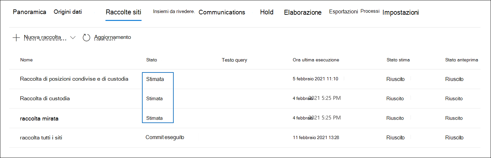

# Eseguire il commit di una bozza di raccolta in un set di revisione in Advanced eDiscovery

Quando sei soddisfatto degli elementi raccolti in una raccolta di bozze e sei pronto per analizzarli, contrassegnarli e rivedirli, puoi aggiungere una raccolta a un set di recensioni nel caso. Quando si esegue il commit di una raccolta di bozze in un set di recensioni, gli elementi raccolti vengono copiati dalla posizione del contenuto originale Microsoft 365 in un set di recensioni. Un set di recensioni è una posizione sicura e Archiviazione di Azure microsoft nel cloud Microsoft.

## Eseguire il commit di una raccolta bozza in un insieme da rivedere

1. Nel Centro Microsoft 365 conformità aprire il caso Advanced eDiscovery e quindi selezionare la **scheda** Raccolte per visualizzare un elenco delle raccolte nel caso.

   

   > [!TIP]
   > Il valore di `Estimated` nella **colonna Stato** identifica le raccolte di bozze che possono essere aggiunte a un set di recensioni. Lo stato di `Committed` indica che una raccolta è già stata aggiunta a un set di revisioni.

2. Nella pagina **Raccolte** selezionare la bozza di raccolta di cui si desidera eseguire il commit in un set di revisioni.

3. Nella parte inferiore della pagina a comparsa selezionare **Azioni**  >  **Modifica raccolta.**

4. Nella procedura guidata di modifica della raccolta fare **clic su Avanti** finché non viene visualizzata la pagina Salva **bozza** o Raccolta.

5. Configurare le seguenti impostazioni:

   1. Seleziona **Raccogli elementi e aggiungi al set di revisione.**

   2. Decidere se aggiungere la raccolta a un nuovo set di revisione (che viene creato dopo l'invio della raccolta) o a un set di revisione esistente. Completa questa sezione in base alla tua decisione.

   3. Configurare le impostazioni di raccolta aggiuntive:

       - **Teams e Yammer** messaggi : selezionare questa opzione per aggiungere thread di conversazione alla raccolta che includono gli elementi di chat restituiti dalla query di ricerca nella raccolta. Ciò significa che viene ricostruita la conversazione di chat che contiene elementi che corrispondono ai criteri di ricerca. In questo modo è possibile esaminare gli elementi della chat nel contesto della conversazione precedente. Per ulteriori informazioni, vedere [Threading delle conversazioni in Advanced eDiscovery](conversation-review-sets.md).

       - **Allegati cloud:** selezionare questa opzione per includere allegati moderni o file collegati quando i risultati della raccolta vengono aggiunti al set di revisioni. Ciò significa che il file di destinazione di un allegato moderno o di un file collegato viene aggiunto al set di revisione.

       - **SharePoint versioni**: selezionare questa opzione per abilitare la raccolta di tutte le versioni di un documento SharePoint in base ai limiti di versione e ai parametri di ricerca della raccolta. Se si seleziona questa opzione, le dimensioni degli elementi aggiunti al set di revisioni verranno notevolmente aumentate.

   4. Configurare le impostazioni per definire la scala della raccolta da aggiungere al set di revisione:

      - **Aggiungi tutti i risultati della raccolta**: selezionare questa opzione per aggiungere tutti gli elementi che corrispondono ai criteri di ricerca della raccolta al set di revisione.

      - **Aggiungere un esempio dei risultati della raccolta:** selezionare questa opzione per aggiungere un campione dei risultati della raccolta al set di revisione anziché aggiungere tutti i risultati. Se si seleziona questa opzione, fare clic **su Modifica parametri di esempio** e scegliere una delle opzioni seguenti:

         - **Esempio in base alla** probabilità: gli elementi della raccolta vengono aggiunti al set di recensioni dipende dai parametri statistici impostati. Se in genere si utilizzano un livello di confidenza e un intervallo durante il campionamento dei risultati, specificarli nelle caselle di riepilogo a discesa. In caso contrario, utilizzare le impostazioni predefinite.

         - **Esempio casuale**: gli elementi della raccolta vengono aggiunti al set di recensioni in base a una selezione casuale della percentuale specificata del numero totale di elementi restituiti dalla ricerca.

6. Nella pagina **Rivedi raccolta** è possibile esaminare le impostazioni di raccolta configurate nella pagina precedente. Fare **clic su** Modifica se si desidera modificarli.

7. Fare **clic su** Invia per creare la raccolta bozze. Viene visualizzata una pagina che conferma la creazione della raccolta.

## Cosa succede dopo il commit di una bozza di raccolta

Quando si esegue il commit di una bozza di raccolta in un insieme di recensioni, si verificano le operazioni seguenti:

- La query di ricerca della raccolta viene eseguita di nuovo. Ciò significa che i risultati della ricerca effettivi copiati nel set di revisione potrebbero essere diversi dai risultati stimati restituiti all'ultima esecuzione della ricerca di raccolta.

- Tutti gli elementi nei risultati della ricerca vengono copiati dall'origine dati originale nel servizio live e copiati in un percorso Archiviazione di Azure sicuro nel cloud Microsoft.

- Tutti gli elementi (inclusi il contenuto e i metadati) che non si trovano in origini dati di tipo depositario o non depositario vengono reindicizzati (in un processo denominato *indicizzazione* completa) in modo che tutti i dati nel set di revisione siano completamente ricercabili durante la revisione dei dati del caso. La reindicizzazione del contenuto di una raccolta comporta ricerche approfondite e veloci quando si esegue una ricerca o si filtra il contenuto nel set di revisione durante l'indagine del caso.

- I documenti SharePoint e OneDrive crittografati e i messaggi di posta elettronica allegati ai file crittografati restituiti nei risultati della ricerca vengono decrittografati quando si esegue il commit della raccolta in un set di revisione. È possibile esaminare ed eseguire query per i file decrittografati nel set di revisione. Per ulteriori informazioni, vedere [Decryption in Microsoft 365 eDiscovery tools](ediscovery-decryption.md).

- La funzionalità di riconoscimento ottico dei caratteri (OCR) estrae il testo dalle immagini e include il testo dell'immagine con il contenuto aggiunto a un set di recensioni. Per ulteriori informazioni, vedere la sezione [Riconoscimento ottico](#optical-character-recognition) dei caratteri in questo articolo.

- Al termine del commit, il valore della colonna stato della **scheda** Raccolte viene modificato in `Committed` .

## Riconoscimento ottico dei caratteri

Quando si esegue il commit di una raccolta in un set di revisione, la funzionalità OCR (Optical Character Recognition) in Advanced eDiscovery estrae automaticamente il testo dalle immagini e include il testo dell'immagine con il contenuto aggiunto a un set di recensioni. È possibile visualizzare il testo estratto nel visualizzatore di testo del file di immagine selezionato nel set di revisioni. In questo modo è possibile eseguire ulteriori revisioni e analisi del testo nelle immagini. OCR è supportato per file liberi, allegati di posta elettronica e immagini incorporate. Per un elenco dei formati di file di immagine supportati per OCR, visualizzare [Tipi di file supportati in Advanced eDiscovery](supported-filetypes-ediscovery20.md#image).

È necessario abilitare la funzionalità OCR per ogni caso creato in Advanced eDiscovery. Per ulteriori informazioni, vedere [Configure search and analytics settings.](configure-search-and-analytics-settings-in-advanced-ediscovery.md#optical-character-recognition-ocr)
