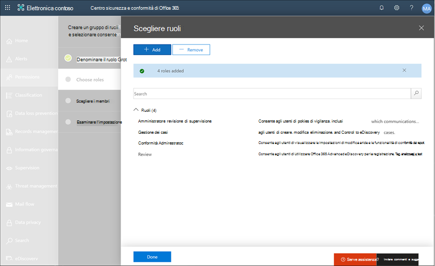

# Case Study-Contoso configura rapidamente un criterio di lingua offensivo per Microsoft teams e le comunicazioni di ExchangeCase study - Contoso quickly configures an offensive language policy for Microsoft Teams and Exchange communications

La conformità alla comunicazione in Microsoft 365 consente di ridurre al minimo i rischi di comunicazione contribuendo a rilevare, acquisire e intraprendere azioni correttive per i messaggi inopportuni nell'organizzazione.Communication compliance in Microsoft 365 helps minimize communication risks by helping you detect, capture, and take remediation actions for inappropriate messages in your organization. I criteri predefiniti e personalizzati consentono di analizzare le comunicazioni interne ed esterne per le corrispondenze dei criteri in modo che possano essere esaminate da revisori designati.Pre-defined and custom policies allow you to scan internal and external communications for policy matches so they can be examined by designated reviewers. I revisori possono esaminare la posta elettronica digitalizzata, Microsoft teams o le comunicazioni di terze parti nell'organizzazione e intraprendere le azioni correttive appropriate per assicurarsi che siano conformi agli standard dei messaggi dell'organizzazione.Reviewers can investigate scanned email, Microsoft Teams, or third-party communications in your organization and take appropriate remediation actions to make sure they're compliant with your organization's message standards.

Contoso Corporation è un'organizzazione fittizia che deve configurare rapidamente un criterio da monitorare per il linguaggio offensivo.The Contoso Corporation is a fictional organization that needs to quickly configure a policy to monitor for offensive language. Sono stati utilizzati Microsoft 365 principalmente per il supporto di posta elettronica e Microsoft teams per i dipendenti, ma hanno nuovi requisiti per applicare la politica aziendale in merito alle molestie sul posto di lavoro.They have been using Microsoft 365 primarily for email and Microsoft Teams support for their employees but have new requirements to enforce company policy around workplace harassment. Gli amministratori IT di Contoso e gli specialisti della conformità hanno una conoscenza di base dei concetti fondamentali relativi all'utilizzo di Microsoft 365 e sono alla ricerca di linee guida end-to-end su come iniziare rapidamente a utilizzare la conformità alla comunicazione.Contoso IT administrators and compliance specialists have a basic understanding of the fundamentals of working with Microsoft 365 and are looking for end-to-end guidance for how to quickly get started with communication compliance.

Questo caso di studio riguarderà le nozioni di base per la configurazione rapida di un criterio di conformità comunicazione per monitorare le comunicazioni per il linguaggio offensivo.This case study will cover the basics for quickly configuring a communication compliance policy to monitor communications for offensive language. In questa guida sono incluse le seguenti:This guidance includes:

- Passaggio 1-pianificazione della conformità della comunicazioneStep 1 - Planning for communication compliance
- Passaggio 2: accesso alla conformità della comunicazione in Microsoft 365Step 2 - Accessing communication compliance in Microsoft 365
- Passaggio 3: Configuring Prerequisites e Creating a Communication Compliance PolicyStep 3 - Configuring prerequisites and creating a communication compliance policy
- Passaggio 4: analisi e correzione degli avvisiStep 4 - Investigation and remediation of alerts

## Passaggio 1-pianificazione della conformità della comunicazioneStep 1 - Planning for communication compliance

Gli amministratori IT di Contoso e gli specialisti della conformità hanno partecipato a webinar online sulle soluzioni di conformità in Microsoft 365 e hanno deciso che i criteri di conformità della comunicazione consentiranno di soddisfare i requisiti dei criteri aziendali aggiornati per la riduzione delle molestie sul postoContoso IT administrators and compliance specialists attended online webinars about compliance solutions in Microsoft 365 and decided that communication compliance policies will help them meet the updated corporate policy requirements for reducing workplace harassment. Lavorando insieme, hanno sviluppato un piano per creare e abilitare un criterio di conformità della comunicazione che monitorerà la lingua offensiva per le chat inviate in Microsoft Teams nei messaggi di posta elettronica inviati in Exchange Online.Working together, they've developed a plan to create and enable a communication compliance policy that will monitor for offensive language for chats sent in Microsoft Teams in email messages sent in Exchange Online. Il piano include l'identificazione:Their plan includes identifying:

- Gli amministratori IT che devono accedere alle funzionalità di conformità della comunicazione.The IT administrators that need access to communication compliance features.
- Gli specialisti della conformità che devono creare e gestire i criteri di comunicazione.The compliance specialists that need to create and manage communication policies.
- Gli specialisti del Compliance e altri colleghi in altri reparti (risorse umane, legali e così via) che devono indagare e correggere gli avvisi di conformità alla comunicazione.The compliance specialists and other colleague in other departments (Human Resources, Legal, etc.) that need to investigate and remediate communication compliance alerts.
- Gli utenti che rientrano nell'ambito dei criteri del linguaggio offensivo per la conformità di comunicazione.The users that will be in-scope for the communication compliance offensive language policy.

### LicenzeLicensing

Il primo passaggio consiste nel confermare che la licenza Microsoft 365 di Contoso include il supporto per la soluzione di conformità alla comunicazione.The first step is to confirm that Contoso's Microsoft 365 licensing includes support for the communication compliance solution. Per accedere e utilizzare la conformità di comunicazione, gli amministratori IT di Contoso devono verificare che Contoso abbia uno dei seguenti elementi:To access and use communication compliance, Contoso IT administrators need to verify that Contoso has one of the following:

- Sottoscrizione Microsoft 365 E5 (a pagamento o versione di valutazione)Microsoft 365 E5 subscription (paid or trial version)
- Sottoscrizione Microsoft 365 E3 + il componente aggiuntivo Microsoft 365 E5 ComplianceMicrosoft 365 E3 subscription + the Microsoft 365 E5 Compliance add-on
- Sottoscrizione Microsoft 365 E3 + componente aggiuntivo Microsoft 365 E5 Insider Risk ManagementMicrosoft 365 E3 subscription + the Microsoft 365 E5 Insider Risk Management add-on
- Sottoscrizione Microsoft 365 a5 (a pagamento o versione di valutazione)Microsoft 365 A5 subscription (paid or trial version)
- Sottoscrizione Microsoft 365 a3 + componente aggiuntivo Microsoft 365 a5 ComplianceMicrosoft 365 A3 subscription + the Microsoft 365 A5 Compliance add-on
- Sottoscrizione Microsoft 365 a3 + componente aggiuntivo Microsoft 365 a5 Insider Risk ManagementMicrosoft 365 A3 subscription + the Microsoft 365 A5 Insider Risk Management add-on
- Sottoscrizione Microsoft 365 G5 (a pagamento o versione di valutazione)Microsoft 365 G5 subscription (paid or trial version)
- Sottoscrizione Microsoft 365 G5 + componente aggiuntivo Microsoft 365 G5 ComplianceMicrosoft 365 G5 subscription + the Microsoft 365 G5 Compliance add-on
- Microsoft 365 G5 Subscription + Microsoft 365 G5 Insider Risk Management componente aggiuntivoMicrosoft 365 G5 subscription + the Microsoft 365 G5 Insider Risk Management add-on
- Abbonamento a Office 365 Enterprise E5 (a pagamento o versione di valutazione)Office 365 Enterprise E5 subscription (paid or trial version)
- Abbonamento a Office 365 Enterprise E3 + il componente aggiuntivo Office 365 Advanced Compliance (non più disponibile per le nuove sottoscrizioni, vedere note)Office 365 Enterprise E3 subscription + the Office 365 Advanced Compliance add-on (no longer available for new subscriptions, see note)

È inoltre necessario confermare che agli utenti inclusi nei criteri di conformità della comunicazione deve essere assegnata una delle licenze sopra riportate.They must also confirm that users included in communication compliance policies must be assigned one of the licenses above.

>[!IMPORTANT]
>La conformità avanzata di Office 365 non viene più venduta come sottoscrizione autonoma.Office 365 Advanced Compliance is no longer sold as a standalone subscription. Quando le sottoscrizioni correnti scadono, i clienti devono passare a una delle sottoscrizioni precedenti, che contengono le stesse funzionalità di conformità o aggiuntive.When current subscriptions expire, customers should transition to one of the subscriptions above, which contain the same or additional compliance features.

Gli amministratori IT di Contoso eseguono la procedura seguente per verificare il supporto delle licenze per contoso:Contoso IT administrators take the following steps to verify the licensing support for Contoso:

1. Gli amministratori IT possono accedere all'interfaccia di **amministrazione di Microsoft 365** [(https://admin.microsoft.com) ](https://admin.microsoft.com) e passare a **Microsoft 365 Admin Center** > **Billing** > **licenses**.IT administrators sign in to the **Microsoft 365 admin center** [(https://admin.microsoft.com)](https://admin.microsoft.com) and navigate to **Microsoft 365 admin center** > **Billing** > **Licenses**.

2. Qui confermano di disporre di una delle [Opzioni di licenza](https://docs.microsoft.com/microsoft-365/compliance/communication-compliance-configure?view=o365-worldwide#before-you-begin) che include il supporto per la conformità alla comunicazione.Here they confirm that they have one of the [license options](https://docs.microsoft.com/microsoft-365/compliance/communication-compliance-configure?view=o365-worldwide#before-you-begin) that includes support for communication compliance.

### Autorizzazioni per la conformità alla comunicazionePermissions for communication compliance

Per impostazione predefinita, gli amministratori globali non possono accedere alle funzionalità di conformità della comunicazione.By default, Global Administrators do not have access to communication compliance features. Le [autorizzazioni devono essere configurate](https://docs.microsoft.com/microsoft-365/compliance/communication-compliance-configure?view=o365-worldwide#step-1-required-enable-permissions-for-communication-compliance) in modo che gli amministratori IT di Contoso e gli specialisti della conformità abbiano accesso alla conformità della comunicazione.[Permissions must be configured](https://docs.microsoft.com/microsoft-365/compliance/communication-compliance-configure?view=o365-worldwide#step-1-required-enable-permissions-for-communication-compliance) so that Contoso IT administrators and compliance specialists have access to communication compliance.

1. Gli amministratori IT di Contoso possono accedere alla pagina delle autorizzazioni del **Centro sicurezza e conformità di Office 365** [(https://protection.office.com/permissions) ](https://protection.office.com/permissions) utilizzando le credenziali per un account di amministratore globale e selezionare il collegamento per visualizzare e gestire i ruoli in Office 365.Contoso IT administrators sign into the **Office 365 Security and Compliance center** permissions page [(https://protection.office.com/permissions)](https://protection.office.com/permissions) using credentials for a global administrator account and select the link to view and manage roles in Office 365.
2. Dopo aver selezionato **Crea**, assegnare al nuovo gruppo di ruoli un nome descrittivo di "*conformità alla comunicazione*" e selezionare **Avanti**.After selecting **Create**, they give the new role group a friendly name of "*Communication compliance*" and select **Next**.
3. Selezionano **Scegli ruoli** , quindi seleziona **Aggiungi**.They select **Choose roles** and then select **Add**. Aggiungono i ruoli necessari selezionando la casella di controllo per l' *amministratore della revisione di supervisione*, la *gestione dei casi*, l' *amministratore della conformità*e la *Revisione*, quindi selezionare **Aggiungi**, **fatto** e **Avanti**.They add the required roles by selecting the checkbox for *Supervisory Review Administrator*, *Case Management*, *Compliance Administrator*, and *Review*, then they select **Add**, **Done,** and **Next**.

4. Successivamente, gli amministratori IT selezionano **Scegli membri** , quindi seleziona **Aggiungi**.Next, the IT administrators select **Choose members** then select **Add**. Selezionare la casella di controllo per tutti gli utenti e i gruppi che desiderano creare criteri e gestire i messaggi con le corrispondenze di criteri.The select the checkbox for all the users and groups that they want to create policies and manage messages with policy matches. Aggiungono gli amministratori IT, gli specialisti della conformità e altri colleghi nelle risorse umane e nei reparti giuridici individuati nella pianificazione iniziale, quindi selezionare **Aggiungi**, **fatto**e **successivo**.They add the IT administrators, compliance specialists, and other colleagues in Human Resources and Legal departments that they identified in the initial planning, then select **Add**, **Done**, and **Next**.
5. Per completare le autorizzazioni, gli amministratori IT selezionano **Crea gruppo di ruoli** da terminare.To finalize the permissions, the IT administrators select **Create role group** to finish. Il servizio Microsoft 365 di Contoso richiede circa 30 minuti affinché i ruoli siano efficaci.It will take about 30 minutes for the roles to be effective in Contoso's Microsoft 365 service.

## Passaggio 2: accesso alla conformità della comunicazione in Microsoft 365Step 2 - Accessing communication compliance in Microsoft 365

Dopo aver configurato le autorizzazioni per la conformità della comunicazione, gli amministratori IT di Contoso e gli specialisti di conformità definiti nel nuovo gruppo di ruoli possono accedere alla soluzione di conformità della comunicazione in Microsoft 365.After configuring the permissions for communication compliance, Contoso IT administrators and compliance specialists defined in the new role group can access the communication compliance solution in Microsoft 365. Gli amministratori IT di Contoso e gli specialisti della conformità dispongono di diversi modi per accedere alla conformità della comunicazione e per iniziare a creare un nuovo criterio:Contoso IT administrators and compliance specialists have several ways to access communication compliance and get started creating a new policy:

- Partendo direttamente dalla soluzione di conformità della comunicazioneStarting directly from the communication compliance solution
- Partendo dal centro conformità di Microsoft 365Starting from the Microsoft 365 compliance center
- A partire dal catalogo della soluzione Microsoft 365Starting from the Microsoft 365 solution catalog
- A partire dall'interfaccia di amministrazione di Microsoft 365Starting from the Microsoft 365 admin center

### Partendo direttamente dalla soluzione di conformità della comunicazioneStarting directly from the communication compliance solution

Il modo più rapido per accedere alla soluzione consiste nell'eseguire l'accesso direttamente alla soluzione **Communication Compliance** (<https://compliance.microsoft.com/supervisoryreview>).The quickest way to access the solution is to sign in directly to the **Communication compliance** (<https://compliance.microsoft.com/supervisoryreview>) solution. Se si utilizza questo collegamento, contoso IT Administrators and Compliance Specialists verrà indirizzato al Dashboard Overview di Communication Compliance, in cui è possibile esaminare rapidamente lo stato degli avvisi e creare nuovi criteri dai modelli predefiniti.Using this link, Contoso IT administrators and compliance specialists will be directed to the communication compliance Overview dashboard where you can quickly review the status of alerts and create new policies from the pre-defined templates.

### Partendo dal centro conformità di Microsoft 365Starting from the Microsoft 365 compliance center

Un altro modo semplice per gli amministratori IT di Contoso e gli specialisti di conformità per accedere alla soluzione di conformità alla comunicazione consiste nell'eseguire l'accesso direttamente al **centro conformità di Microsoft 365** [(https://compliance.microsoft.com)](https://compliance.microsoft.com).Another easy way for Contoso IT administrators and compliance specialists to access the communication compliance solution is to sign in directly to the **Microsoft 365 compliance center** [(https://compliance.microsoft.com)](https://compliance.microsoft.com). Dopo aver eseguito l'accesso, gli utenti devono semplicemente selezionare il controllo **Mostra tutto** per visualizzare tutte le soluzioni di conformità e quindi selezionare la soluzione di conformità per la **comunicazione** per iniziare.After signing in, users simply need to select the **Show all** control to display all the compliance solutions and then select the **Communication compliance** solution to get started.

### A partire dal catalogo della soluzione Microsoft 365Starting from the Microsoft 365 solution catalog

Gli amministratori IT di Contoso e gli specialisti della conformità possono anche scegliere di accedere alla soluzione di conformità della comunicazione selezionando il catalogo della soluzione Microsoft 365.Contoso IT administrators and compliance specialists could also choose to access the communication compliance solution by selecting the Microsoft 365 solution catalog. Scegliendo **Catalogo** nella sezione **soluzioni** del riquadro di spostamento sinistro, mentre nel **centro conformità di Microsoft 365**, è possibile aprire il catalogo della soluzione che elenca tutte le soluzioni di conformità di Microsoft 365.By selecting **Catalog** in **Solutions** section of the left navigation while in the **Microsoft 365 compliance center**, they can open the solution catalog listing all Microsoft 365 compliance solutions. Scorrere verso il basso fino alla sezione **gestione dei rischi Insider** , contoso IT Administrators è in grado di selezionare la conformità della comunicazione per iniziare.Scrolling down to the **Insider risk management** section, Contoso IT administrators can select Communication compliance to get started. Gli amministratori IT di Contoso decidono inoltre di utilizzare la funzionalità Mostra nel controllo di spostamento per aggiungere la soluzione di conformità alla comunicazione al riquadro di spostamento a sinistra per un accesso più rapido quando firmano per andare avanti.Contoso IT administrators also decide to use the Show in navigation control to pin the communication compliance solution to the left-navigation pane for quicker access when they sign in going forward.

### A partire dall'interfaccia di amministrazione di Microsoft 365Starting from the Microsoft 365 admin center

Per accedere alla conformità della comunicazione quando si parte dall'interfaccia di amministrazione di Microsoft 365, gli amministratori IT di Contoso e gli specialisti della conformità accedono all'interfaccia di amministrazione di Microsoft 365 [(https://admin.microsoft.com) ](https://admin.microsoft.com) e accedono a **Microsoft 365 Admin Center** > **Compliance**.To access communication compliance when starting from the Microsoft 365 admin center, Contoso IT administrators and compliance specialists sign in to the Microsoft 365 admin center [(https://admin.microsoft.com)](https://admin.microsoft.com) and navigate to **Microsoft 365 admin center** > **Compliance**.

Questo apre il **Centro sicurezza e conformità di Office 365**e deve selezionare il collegamento al **centro conformità di Microsoft 365** fornito nel banner nella parte superiore della pagina.This opens the **Office 365 Security and Compliance center**, and they must select the link to the **Microsoft 365 compliance center** provided in the banner at the top of the page.

Una volta nel **centro conformità di Microsoft 365**, gli amministratori IT di Contoso selezionano **Mostra tutto** per visualizzare l'elenco completo delle soluzioni di conformità.Once in the **Microsoft 365 compliance center**, Contoso IT administrators select **Show all** to display the full list of compliance solutions.

Dopo aver selezionato **Mostra tutto**, gli amministratori IT di Contoso possono accedere alla soluzione di conformità della comunicazione.After selecting **Show all**, the Contoso IT administrators can access the communication compliance solution.

## Passaggio 3: Configuring Prerequisites e Creating a Communication Compliance PolicyStep 3 - Configuring prerequisites and creating a communication compliance policy

Per iniziare a utilizzare un criterio di conformità della comunicazione, sono disponibili diversi prerequisiti che gli amministratori IT di Contoso devono configurare prima di impostare il nuovo criterio per il monitoraggio per la lingua offensiva.To get started with a communication compliance policy, there are several prerequisites that Contoso IT administrators need to configure before setting up the new policy to monitor for offensive language. Una volta completati questi prerequisiti, contoso IT Administrators and Compliance Specialists è in grado di configurare il nuovo criterio e gli specialisti della conformità possono avviare indagini e correggere eventuali avvisi generati.After these prerequisites have been completed, Contoso IT administrators and compliance specialists can configure the new policy and compliance specialists can start investigation and remediating any generated alerts.

### Abilitazione del controllo in Office 365Enabling auditing in Office 365

La conformità alla comunicazione richiede i registri di controllo per visualizzare gli avvisi e tenere presenti le azioni di correzione eseguite dai revisori.Communication compliance requires audit logs to show alerts and track remediation actions taken by reviewers. I registri di controllo sono un riepilogo di tutte le attività associate a un criterio organizzativo definito o in qualsiasi momento si verifica una modifica a un criterio di conformità della comunicazione.The audit logs are a summary of all activities associated with a defined organizational policy or anytime there is a change to a communication compliance policy.

Gli amministratori IT di Contoso esaminano e completano le [istruzioni dettagliate](https://docs.microsoft.com/microsoft-365/compliance/turn-audit-log-search-on-or-off) per l'attivazione del controllo.Contoso IT administrators review and complete the [step-by-step instructions](https://docs.microsoft.com/microsoft-365/compliance/turn-audit-log-search-on-or-off) to turn on auditing. Dopo aver attivato il controllo, viene visualizzato un messaggio che indica che il registro di controllo viene preparato e che è possibile eseguire una ricerca in un paio d'ore dopo il completamento della preparazione.After they turn on auditing, a message is displayed that says the audit log is being prepared and that they can run a search in a couple of hours after the preparation is complete. Gli amministratori IT di Contoso devono eseguire questa azione solo una volta.The Contoso IT administrators only have to do this action once.

### Configurazione di un gruppo per gli utenti in ambitoSetting up a group for in-scope users

Gli specialisti della conformità di Contoso desiderano aggiungere tutti i dipendenti ai criteri di comunicazione che verranno monitorati per la lingua offensiva.Contoso compliance specialists want to add all employee to the communication policy that will monitor for offensive language. È possibile decidere di aggiungere tutti gli account utente dei dipendenti ai criteri separatamente, ma sono stati decisi che è molto più semplice e consente di risparmiare molto tempo per utilizzare un gruppo di distribuzione **tutti i dipendenti** per gli utenti per questo criterio.They could decide to add each employee user account to the policy separately, but they've decided it is much easier and saves a lot of time to use an **All Employees** distribution group for the users for this policy.

È necessario creare un nuovo gruppo per includere tutti i dipendenti di Contoso, in modo da eseguire le operazioni seguenti:They need to create a new group to include all Contoso employees, so they take the following steps:

1. Amministratori IT di Contoso è possibile accedere all'interfaccia di **amministrazione di Microsoft 365** [(https://admin.microsoft.com) ](https://admin.microsoft.com) e accedere ai**gruppi**di**gruppi** > di interfaccia di **Amministrazione** > di Microsoft 365.Contoso IT administrators IT sign in to the **Microsoft 365 admin center** [(https://admin.microsoft.com)](https://admin.microsoft.com) and navigate to **Microsoft 365 admin center** > **Groups** > **Groups**.
2. Selezionare **Aggiungi un gruppo** e completare la procedura guidata per creare un nuovo gruppo o gruppo di *distribuzione*di *Office 365* .They select **Add a group** and complete the wizard to create a new *Office 365 group* or *Distribution group*.

3. Dopo aver creato il nuovo gruppo, è necessario aggiungere tutti gli utenti di Contoso al nuovo gruppo.After the new group is created, they need to add all Contoso users to the new group. Aprire l'interfaccia **di amministrazione** [https://outlook.office365.com/ecp) di Exchange e accedere](https://outlook.office365.com/ecp) ai**gruppi**di**destinatari** > dell'interfaccia di **Amministrazione** > di Exchange.They open the **Exchange admin center** [(https://outlook.office365.com/ecp)](https://outlook.office365.com/ecp) and navigate to **Exchange admin center** > **recipients** > **groups**. Gli amministratori IT di Contoso selezionano l'area di appartenenza e il nuovo gruppo *tutti i dipendenti* che hanno creato e selezionano il controllo di **modifica** per aggiungere tutti i dipendenti di Contoso al nuovo gruppo nella procedura guidata.The Contoso IT administrators select the Membership area and the new *All Employees* group they created and select the **Edit** control to add all Contoso employees to the new group in the wizard.

### Creazione dei criteri da monitorare per il linguaggio offensivoCreating the policy to monitor for offensive language

Con tutti i prerequisiti completati, gli amministratori IT e gli specialisti di conformità per Contoso sono pronti per configurare i criteri di conformità della comunicazione da monitorare per il linguaggio offensivo.With all the prerequisites completed, the IT administrators and the compliance specialists for Contoso are ready to configure the communication compliance policy to monitor for offensive language. Se si utilizza il nuovo modello di criteri per il linguaggio offensivo, la configurazione di questo criterio è semplice e veloce.Using the new offensive language policy template, configuring this policy is simple and quick.

1. Gli amministratori IT di Contoso e gli specialisti della conformità vengono registrati nel **centro conformità Microsoft 365** e seleziona **conformità comunicazione** dal riquadro di spostamento a sinistra.The Contoso IT administrators and compliance specialists sign into the **Microsoft 365 compliance center** and select **Communication compliance** from the left navigation pane. Questa azione consente di aprire il dashboard **Panoramica** con collegamenti rapidi per i modelli di criteri di conformità della comunicazione.This action opens the **Overview** dashboard that has quick links for communication compliance policy templates. Scelgono il **Monitor per** il modello di lingua offensiva selezionando **inizia** per il modello.They choose the **Monitor for offensive language** template by selecting **Get started** for the template.

2. Nella procedura guidata dei modelli di criteri, gli amministratori IT di Contoso e gli specialisti della conformità si confrontano per completare i tre campi obbligatori: **nome del criterio**, **utenti o gruppi da supervisionare**e **revisori**.On the policy template wizard, the Contoso IT administrators and compliance specialists work together to complete the three required fields: **Policy name**, **Users or groups to supervise**, and **Reviewers**.
3. Poiché la procedura guidata ha già suggerito un nome per il criterio, gli amministratori IT e gli specialisti della conformità decidono di mantenere il nome suggerito e lo stato attivo nei campi rimanenti.Since the policy wizard has already suggested a name for the policy, the IT administrators and compliance specialists decide to keep the suggested name and focus on the remaining fields. Selezionano il gruppo *tutti i dipendenti* per gli **utenti o i gruppi per sorvegliare** il campo e selezionare gli specialisti di conformità che devono esaminare e correggere gli avvisi dei criteri per il campo **revisori** .They select the *All employees* group for the **Users or groups to supervise** field and select the compliance specialists that should investigate and remediate policy alerts for the **Reviewers** field. L'ultimo passaggio per configurare il criterio e iniziare a raccogliere informazioni sugli avvisi consiste nel selezionare **Crea criterio**.The last step to configure the policy and start gathering alert information is to select **Create policy**.

## Passaggio 4: indagare e correggere gli avvisiStep 4 – Investigate and remediate alerts

Dopo aver configurato il criterio di conformità della comunicazione per il monitoraggio per la lingua offensiva, il passaggio successivo per gli specialisti della conformità di Contoso consiste nell'esaminare e correggere gli eventuali avvisi generati dal criterio.Now that the communication compliance policy to monitor for offensive language is configured, the next step for the Contoso compliance specialists will be to investigate and remediate any alerts generated by the policy. Il criterio richiederà fino a 24 ore per elaborare completamente le comunicazioni in tutti i canali di origine della comunicazione e per visualizzare gli avvisi nel **dashboard di avviso**.It will take up to 24 hours for the policy to fully process communications in all the communication source channels and for alerts to show up in the **Alert dashboard**.

Dopo la generazione degli avvisi, gli specialisti della conformità di Contoso seguiranno le [istruzioni relative al flusso di lavoro](https://docs.microsoft.com/microsoft-365/compliance/communication-compliance-investigate-remediate) per esaminare e correggere i problemi di lingua offensiva.After alerts are generated, Contoso compliance specialists will follow the [workflow instructions](https://docs.microsoft.com/microsoft-365/compliance/communication-compliance-investigate-remediate) to investigate and remediate offensive language issues.
