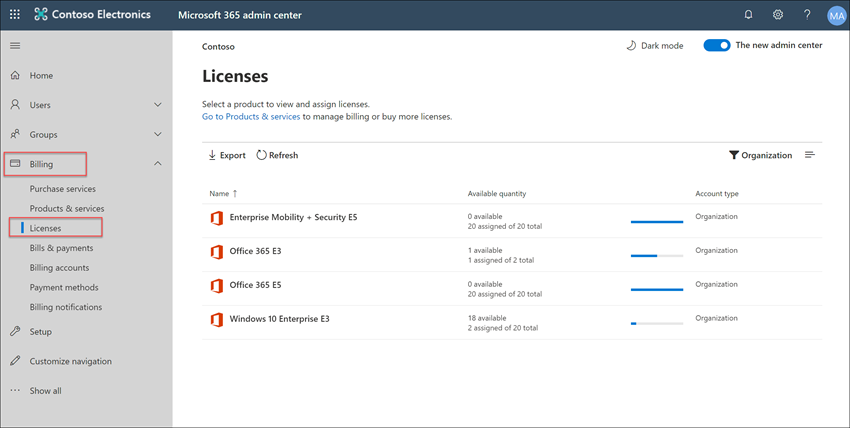
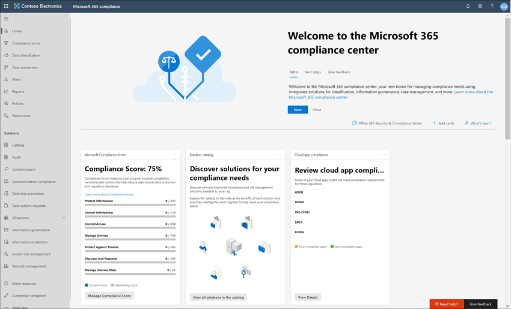
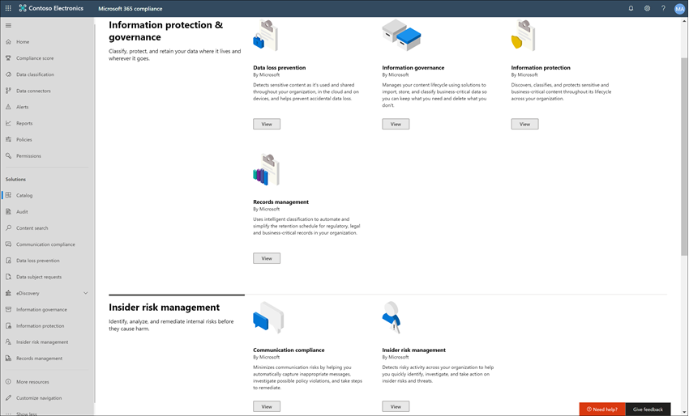
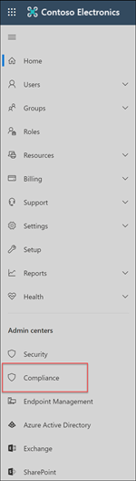
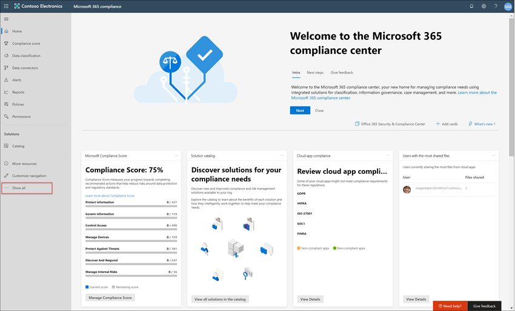
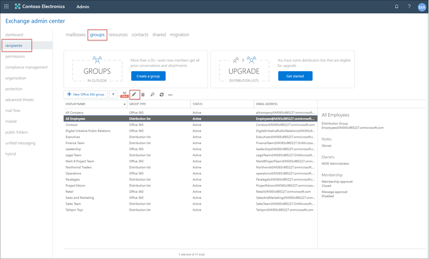

# Case study: Contoso configura rapidamente un criterio linguistico offensivo per Microsoft Teams, Exchange e Yammer comunicazioniCase study - Contoso quickly configures an offensive language policy for Microsoft Teams, Exchange, and Yammer communications

La conformità delle comunicazioni in Microsoft 365 consente di ridurre al minimo i rischi di comunicazione consentendo di rilevare, acquisire e agire su messaggi inappropriati nell'organizzazione.Communication compliance in Microsoft 365 helps minimize communication risks by helping you detect, capture, and act on inappropriate messages in your organization. I criteri predefiniti e personalizzati consentono di scansionare le comunicazioni interne ed esterne per trovare corrispondenze con i criteri, in modo che siano esaminate dai revisori designati. Pre-defined and custom policies allow you to scan internal and external communications for policy matches so they can be examined by designated reviewers. I revisori possono analizzare la posta elettronica analizzata, Microsoft Teams, Yammer o comunicazioni di terze parti nell'organizzazione e intraprendere azioni di correzione appropriate per assicurarsi che siano conformi agli standard dei messaggi dell'organizzazione.Reviewers can investigate scanned email, Microsoft Teams, Yammer, or third-party communications in your organization and take appropriate remediation actions to make sure they're compliant with your organization's message standards.

Contoso Corporation è un'organizzazione fittizia che deve configurare rapidamente un criterio per il monitoraggio del linguaggio offensivo.The Contoso Corporation is a fictional organization that needs to quickly configure a policy to monitor for offensive language. Hanno usato il Microsoft 365 principalmente per il supporto di posta elettronica, Microsoft Teams e Yammer per gli utenti, ma hanno nuovi requisiti per applicare i criteri aziendali sulle molestie sul luogo di lavoro.They have been using Microsoft 365 primarily for email, Microsoft Teams, and Yammer support for their users but have new requirements to enforce company policy around workplace harassment. Gli amministratori IT e gli esperti di conformità di Contoso hanno una conoscenza di base delle nozioni fondamentali dell'utilizzo di Microsoft 365 e cercano indicazioni end-to-end su come iniziare rapidamente a usare la conformità alle comunicazioni.Contoso IT administrators and compliance specialists have a basic understanding of the fundamentals of working with Microsoft 365 and are looking for end-to-end guidance for how to quickly get started with communication compliance.

Questo case study tratterà le nozioni di base per configurare rapidamente un criterio di conformità delle comunicazioni per monitorare la presenza di linguaggio offensivo nelle comunicazioni.This case study will cover the basics for quickly configuring a communication compliance policy to monitor communications for offensive language. Le linee guida includono:This guidance includes:

- Passaggio 1: Pianificazione della conformità delle comunicazioniStep 1 - Planning for communication compliance
- Passaggio 2: Accesso alla conformità delle comunicazioni in Microsoft 365Step 2 - Accessing communication compliance in Microsoft 365
- Passaggio 3: Configurazione dei prerequisiti e creazione di un criterio di conformità delle comunicazioniStep 3 - Configuring prerequisites and creating a communication compliance policy
- Passaggio 4: Indagine e correzione degli avvisiStep 4 - Investigation and remediation of alerts

## Passaggio 1: Pianificazione della conformità delle comunicazioniStep 1: Planning for communication compliance

Gli amministratori IT e gli esperti di conformità di Contoso hanno partecipato a webinar online sulle soluzioni di conformità in Microsoft 365 e hanno deciso che i criteri di conformità delle comunicazioni li aiuteranno a soddisfare i requisiti dei criteri aziendali aggiornati per ridurre le molestie sul luogo di lavoro.Contoso IT administrators and compliance specialists attended online webinars about compliance solutions in Microsoft 365 and decided that communication compliance policies will help them meet the updated corporate policy requirements for reducing workplace harassment. Collaborando, hanno sviluppato un piano per creare e abilitare criteri di conformità delle comunicazioni che monitoreranno la lingua offensiva per le chat inviate in Microsoft Teams, i messaggi privati e le conversazioni della community in Yammer e nei messaggi di posta elettronica inviati in Exchange Online.Working together, they've developed a plan to create and enable a communication compliance policy that will monitor for offensive language for chats sent in Microsoft Teams, private messages and community conversations in Yammer, and in email messages sent in Exchange Online. Il piano include l'identificazione di:Their plan includes identifying:

- Gli amministratori IT che necessitano dell'accesso alle funzionalità di conformità delle comunicazioni.The IT administrators that need access to communication compliance features.
- Gli esperti di conformità che devono creare e gestire i criteri di comunicazione.The compliance specialists that need to create and manage communication policies.
- Gli esperti di conformità e altri colleghi di altri reparti (Risorse umane, Legali e così via) che devono analizzare e correggere gli avvisi di conformità delle comunicazioni.The compliance specialists and other colleague in other departments (Human Resources, Legal, etc.) that need to investigate and remediate communication compliance alerts.
- Gli utenti che saranno nell'ambito del criterio linguistico offensivo per la conformità delle comunicazioni.The users that will be in-scope for the communication compliance offensive language policy.

### LicenzeLicensing

Il primo passaggio consiste nel verificare che le licenze Microsoft 365 contoso includano il supporto per la soluzione di conformità delle comunicazioni.The first step is to confirm that Contoso's Microsoft 365 licensing includes support for the communication compliance solution. Per accedere e utilizzare la conformità delle comunicazioni, gli amministratori IT di Contoso devono verificare che Contoso abbia uno dei seguenti elementi:To access and use communication compliance, Contoso IT administrators need to verify that Contoso has one of the following:

- Microsoft 365 E5 (versione di valutazione o a pagamento)Microsoft 365 E5 subscription (paid or trial version)
- Microsoft 365 E3 abbonamento + Microsoft 365 E5 Compliance componente aggiuntivoMicrosoft 365 E3 subscription + the Microsoft 365 E5 Compliance add-on
- Microsoft 365 E3 e il Microsoft 365 E5 Insider Risk ManagementMicrosoft 365 E3 subscription + the Microsoft 365 E5 Insider Risk Management add-on
- Microsoft 365 Sottoscrizione A5 (versione di valutazione o a pagamento)Microsoft 365 A5 subscription (paid or trial version)
- Microsoft 365 Sottoscrizione A3 + componente aggiuntivo Microsoft 365 conformità A5Microsoft 365 A3 subscription + the Microsoft 365 A5 Compliance add-on
- Microsoft 365 Sottoscrizione A3 + il Microsoft 365 A5 Insider Risk ManagementMicrosoft 365 A3 subscription + the Microsoft 365 A5 Insider Risk Management add-on
- Microsoft 365 Abbonamento G5 (versione di valutazione o a pagamento)Microsoft 365 G5 subscription (paid or trial version)
- Microsoft 365 Sottoscrizione G5 + componente aggiuntivo Microsoft 365 conformità G5Microsoft 365 G5 subscription + the Microsoft 365 G5 Compliance add-on
- Microsoft 365 Sottoscrizione G5 + il Microsoft 365 G5 Insider Risk ManagementMicrosoft 365 G5 subscription + the Microsoft 365 G5 Insider Risk Management add-on
- Office 365 Enterprise Abbonamento E5 (versione di valutazione o a pagamento)Office 365 Enterprise E5 subscription (paid or trial version)
- Office 365 Enterprise Sottoscrizione E3 + Office 365 Advanced Compliance componente aggiuntivo (non più disponibile per le nuove sottoscrizioni, vedere nota)Office 365 Enterprise E3 subscription + the Office 365 Advanced Compliance add-on (no longer available for new subscriptions, see note)

Devono inoltre confermare che agli utenti inclusi nei criteri di conformità delle comunicazioni deve essere assegnata una delle licenze precedenti.They must also confirm that users included in communication compliance policies must be assigned one of the licenses above.

>[!IMPORTANT]
>Office 365 Advanced Compliance non viene più venduto come abbonamento autonomo.Office 365 Advanced Compliance is no longer sold as a standalone subscription. Quando le sottoscrizioni correnti scadono, i clienti devono passare a una delle sottoscrizioni precedenti, che contengono le stesse o ulteriori funzionalità di conformità.When current subscriptions expire, customers should transition to one of the subscriptions above, which contain the same or additional compliance features.

Gli amministratori IT di Contoso esereranno i passaggi seguenti per verificare il supporto delle licenze per Contoso:Contoso IT administrators take the following steps to verify the licensing support for Contoso:

1. Gli amministratori IT a sign in to the **Microsoft 365 admin center** [( https://admin.microsoft.com)](https://admin.microsoft.com) and navigate to **Microsoft 365 admin center**  >  **Billing**  >  **Licenses**.IT administrators sign in to the **Microsoft 365 admin center** [(https://admin.microsoft.com)](https://admin.microsoft.com) and navigate to **Microsoft 365 admin center** > **Billing** > **Licenses**.

2. Qui confermano di avere una delle opzioni [di licenza](communication-compliance-configure.md#subscriptions-and-licensing) che include il supporto per la conformità delle comunicazioni.Here they confirm that they have one of the [license options](communication-compliance-configure.md#subscriptions-and-licensing) that includes support for communication compliance.

### Autorizzazioni per la conformità delle comunicazioniPermissions for communication compliance

Esistono cinque gruppi di ruoli utilizzati per configurare le autorizzazioni per gestire le funzionalità di conformità delle comunicazioni.There are five role groups used to configure permissions to manage communication compliance features. Per rendere **la conformità delle** comunicazioni disponibile come opzione di menu nel Centro conformità Microsoft 365 e per continuare con questi passaggi di configurazione, agli amministratori di Contoso viene assegnato il ruolo Di amministratore di conformità *della* comunicazione.To make **Communication compliance** available as a menu option in Microsoft 365 compliance center and to continue with these configuration steps, Contoso administrators are assigned the *Communication Compliance Admin* role.

Contoso decide di utilizzare il gruppo di ruoli *Conformità* comunicazione assegna al gruppo tutti gli amministratori, gli analisti, gli investigatori e i visualizzatori della conformità delle comunicazioni.Contoso decides to use the *Communication Compliance* role group assign all the communication compliance administrators, analysts, investigators, and viewers  to the group. Ciò rende più semplice per Contoso iniziare rapidamente e soddisfare al meglio i requisiti di gestione della conformità.This makes it easier for Contoso to get started quickly and best fits their compliance management requirements.

|**Ruolo****Role**|**Autorizzazioni del ruolo****Role permissions**|
|:-----|:-----|
| **Conformità delle comunicazioni****Communication Compliance** | Utilizzare questo gruppo di ruoli per gestire la conformità delle comunicazioni per l'organizzazione in un singolo gruppo.Use this role group to manage communication compliance for your organization in a single group. Aggiungendo tutti gli account utente per amministratori, analisti, investigatori e visualizzatori designati, è possibile configurare le autorizzazioni di conformità delle comunicazioni in un singolo gruppo.By adding all user accounts for designated administrators, analysts, investigators, and viewers, you can configure communication compliance permissions in a single group. Questo gruppo di ruoli contiene tutti i ruoli di autorizzazione di conformità delle comunicazioni.This role group contains all the communication compliance permission roles. Questa configurazione è il modo più semplice per iniziare rapidamente a utilizzare la conformità delle comunicazioni ed è adatta per le organizzazioni che non necessitano di autorizzazioni separate definite per gruppi di utenti distinti.This configuration is the easiest way to quickly get started with communication compliance and is a good fit for organizations that do not need separate permissions defined for separate groups of users. |
| **Amministratore per la conformità delle comunicazioni****Communication Compliance Admin** | Utilizzare questo gruppo di ruoli per configurare inizialmente la conformità delle comunicazioni e successivamente per separare gli amministratori di conformità delle comunicazioni in un gruppo definito.Use this role group to initially configure communication compliance and later to segregate communication compliance administrators into a defined group. Gli utenti assegnati a questo gruppo di ruoli possono creare, leggere, aggiornare ed eliminare criteri di conformità delle comunicazioni, impostazioni globali e assegnazioni di gruppi di ruoli.Users assigned to this role group can create, read, update, and delete communication compliance policies, global settings, and role group assignments. Gli utenti assegnati a questo gruppo di ruoli non possono visualizzare gli avvisi dei messaggi.Users assigned to this role group cannot view message alerts. |
| **Communication Compliance Analyst****Communication Compliance Analyst** | Utilizzare questo gruppo per assegnare autorizzazioni agli utenti che fungeranno da analisti della conformità delle comunicazioni.Use this group to assign permissions to users that will act as communication compliance analysts. Gli utenti assegnati a questo gruppo di ruoli possono visualizzare i criteri in cui sono assegnati come revisori, visualizzare i metadati dei messaggi (non il contenuto del messaggio), inoltrare ad altri revisori o inviare notifiche agli utenti.Users assigned to this role group can view policies where they are assigned as Reviewers, view message metadata (not message content), escalate to additional reviewers, or send notifications to users. Gli analisti non possono risolvere gli avvisi in sospeso.Analysts cannot resolve pending alerts. |
| **Communication Compliance Investigator****Communication Compliance Investigator** | Utilizzare questo gruppo per assegnare autorizzazioni agli utenti che agiranno come investigatori della conformità delle comunicazioni.Use this group to assign permissions to users that will act as communication compliance investigators. Gli utenti assegnati a questo gruppo di ruoli possono visualizzare i metadati e il contenuto dei messaggi, inoltrare a revisori aggiuntivi, inoltrare a un caso di Advanced eDiscovery, inviare notifiche agli utenti e risolvere l'avviso.Users assigned to this role group can view message metadata and content, escalate to additional reviewers, escalate to an Advanced eDiscovery case, send notifications to users, and resolve the alert. |
| **Visualizzatore della conformità delle comunicazioni****Communication Compliance Viewer** | Utilizzare questo gruppo per assegnare autorizzazioni agli utenti che gestiranno i report di comunicazione.Use this group to assign permissions to users that will manage communication reports. Gli utenti assegnati a questo gruppo di ruoli possono accedere a tutti i widget di report nella home page di conformità delle comunicazioni e possono visualizzare tutti i report di conformità delle comunicazioni.Users assigned to this role group can access all reporting widgets on the communication compliance home page and can view all communication compliance reports. |

1. Gli amministratori IT di Contoso a accedere alla pagina delle autorizzazioni del Centro sicurezza e conformità di **Office 365 Security &** [( https://protection.office.com/permissions)](https://protection.office.com/permissions) utilizzando le credenziali per un account amministratore globale e selezionare il collegamento per visualizzare e gestire i ruoli in Microsoft 365.Contoso IT administrators sign into the **Office 365 Security & Compliance center** permissions page [(https://protection.office.com/permissions)](https://protection.office.com/permissions) using credentials for a global administrator account and select the link to view and manage roles in Microsoft 365.
2. Nel **Centro sicurezza & conformità,** passare a **Autorizzazioni** e selezionare il collegamento per visualizzare e gestire i ruoli in Office 365.In the **Security & Compliance Center**, they go to **Permissions** and select the link to view and manage roles in Office 365.
3. Gli amministratori selezionano il *gruppo di ruoli Conformità* comunicazione, quindi **selezionaNo Modifica gruppo di ruoli.**The administrators select the *Communication Compliance* role group, then select **Edit role group**.
4. Gli amministratori **selezionano Scegli** membri nel riquadro di spostamento sinistro, quindi seleziona **Modifica**.The administrators select **Choose members** from the left navigation pane, then select **Edit**.
5. SelezionaNo **Aggiungi** e quindi selezionano la casella di controllo per tutti gli utenti di Contoso che gestiranno la conformità delle comunicazioni, analizzano ed esaminano gli avvisi.They select **Add** and then select the checkbox for all Contoso users that will manage communication compliance, investigate, and review alerts.
6. Gli amministratori **selezionano Aggiungi,** quindi seleziona **Fatto.**The administrators select **Add**, then select **Done**.
7. Selezionare Salva **per** aggiungere utenti Contoso al gruppo di ruoli.They select **Save** to add Contoso users to the role group. Seleziona Chiudi **per** completare i passaggi.They select **Close** to complete the steps.

## Passaggio 2: Accesso alla conformità delle comunicazioni in Microsoft 365Step 2: Accessing communication compliance in Microsoft 365

Dopo aver configurato le autorizzazioni per la conformità delle comunicazioni, gli amministratori IT di Contoso e gli esperti di conformità assegnati al gruppo di ruoli Conformità comunicazione possono accedere alla soluzione di conformità delle comunicazioni in Microsoft 365.After configuring the permissions for communication compliance, Contoso IT administrators and compliance specialists assigned to the Communication Compliance role group can access the communication compliance solution in Microsoft 365. Gli amministratori IT e gli esperti di conformità di Contoso hanno diversi modi per accedere alla conformità delle comunicazioni e iniziare a creare un nuovo criterio:Contoso IT administrators and compliance specialists have several ways to access communication compliance and get started creating a new policy:

- A partire direttamente dalla soluzione di conformità delle comunicazioniStarting directly from the communication compliance solution
- A partire dal Centro Microsoft 365 conformitàStarting from the Microsoft 365 compliance center
- A partire dal catalogo Microsoft 365 soluzioneStarting from the Microsoft 365 solution catalog
- A partire dall'Microsoft 365 di amministrazioneStarting from the Microsoft 365 admin center

### A partire direttamente dalla soluzione di conformità delle comunicazioniStarting directly from the communication compliance solution

Il modo più rapido per accedere alla soluzione consiste nell'accedere direttamente alla **soluzione conformità** alle comunicazioni ( <https://compliance.microsoft.com/supervisoryreview> ).The quickest way to access the solution is to sign in directly to the **Communication compliance** (<https://compliance.microsoft.com/supervisoryreview>) solution. Utilizzando questo collegamento, gli amministratori IT di Contoso e gli esperti di conformità verranno indirizzati al dashboard panoramica sulla conformità delle comunicazioni in cui è possibile esaminare rapidamente lo stato degli avvisi e creare nuovi criteri dai modelli predefiniti.Using this link, Contoso IT administrators and compliance specialists will be directed to the communication compliance Overview dashboard where you can quickly review the status of alerts and create new policies from the pre-defined templates.

### A partire dal Centro Microsoft 365 conformitàStarting from the Microsoft 365 compliance center

Un altro modo semplice per gli amministratori IT **e** gli esperti di conformità di Contoso per accedere alla soluzione di conformità delle comunicazioni consiste nell'accedere direttamente al Centro conformità Microsoft 365 [conformità ( https://compliance.microsoft.com)](https://compliance.microsoft.com).Another easy way for Contoso IT administrators and compliance specialists to access the communication compliance solution is to sign in directly to the **Microsoft 365 compliance center** [(https://compliance.microsoft.com)](https://compliance.microsoft.com). Dopo l'accesso, gli utenti devono semplicemente selezionare il controllo **Mostra tutte** per visualizzare tutte le soluzioni di conformità e quindi selezionare la soluzione **Conformità delle comunicazioni** per iniziare.After signing in, users simply need to select the **Show all** control to display all the compliance solutions and then select the **Communication compliance** solution to get started.

### A partire dal catalogo Microsoft 365 soluzioneStarting from the Microsoft 365 solution catalog

Gli amministratori IT di Contoso e gli esperti di conformità possono anche scegliere di accedere alla soluzione di conformità delle comunicazioni selezionando il Microsoft 365 catalogo delle soluzioni.Contoso IT administrators and compliance specialists could also choose to access the communication compliance solution by selecting the Microsoft 365 solution catalog. Selezionando **Catalogo** nella **sezione Soluzioni** del riquadro di spostamento sinistro mentre si è nel Centro conformità Microsoft 365 **,** è possibile aprire il catalogo delle soluzioni elencando tutte le Microsoft 365 di conformità.By selecting **Catalog** in **Solutions** section of the left navigation while in the **Microsoft 365 compliance center**, they can open the solution catalog listing all Microsoft 365 compliance solutions. Scorrendo verso il basso fino alla sezione Gestione dei rischi **Insider,** gli amministratori IT di Contoso possono selezionare Conformità delle comunicazioni per iniziare.Scrolling down to the **Insider risk management** section, Contoso IT administrators can select Communication compliance to get started. Gli amministratori IT di Contoso decidono inoltre di utilizzare il controllo Mostra nel riquadro di spostamento per aggiungere la soluzione di conformità delle comunicazioni al riquadro di spostamento sinistro per un accesso più rapido quando accedono in futuro.Contoso IT administrators also decide to use the Show in navigation control to pin the communication compliance solution to the left-navigation pane for quicker access when they sign in going forward.

### A partire dall'Microsoft 365 di amministrazioneStarting from the Microsoft 365 admin center

Per accedere alla conformità delle comunicazioni all'avvio dall'interfaccia di amministrazione di Microsoft 365, gli amministratori IT di Contoso e gli esperti di conformità accedono all'interfaccia di amministrazione di Microsoft 365 [( https://admin.microsoft.com)](https://admin.microsoft.com) e **passano Microsoft 365** Interfaccia di amministrazione  >  **conformità**.To access communication compliance when starting from the Microsoft 365 admin center, Contoso IT administrators and compliance specialists sign in to the Microsoft 365 admin center [(https://admin.microsoft.com)](https://admin.microsoft.com) and navigate to **Microsoft 365 admin center** > **Compliance**.

Questa azione apre il Centro sicurezza e conformità di **Office 365** e deve selezionare il collegamento al Centro conformità **Microsoft 365** disponibile nel banner nella parte superiore della pagina.This action opens the **Office 365 Security and Compliance center**, and they must select the link to the **Microsoft 365 compliance center** provided in the banner at the top of the page.

Una volta nel **centro Microsoft 365 conformità,** gli amministratori IT di Contoso selezionano **Mostra** tutto per visualizzare l'elenco completo delle soluzioni di conformità.Once in the **Microsoft 365 compliance center**, Contoso IT administrators select **Show all** to display the full list of compliance solutions.

Dopo aver **selezionato Mostra tutto,** gli amministratori IT di Contoso possono accedere alla soluzione di conformità delle comunicazioni.After selecting **Show all**, the Contoso IT administrators can access the communication compliance solution.

## Passaggio 3: Configurazione dei prerequisiti e creazione di un criterio di conformità delle comunicazioniStep 3: Configuring prerequisites and creating a communication compliance policy

Per iniziare a usare un criterio di conformità delle comunicazioni, gli amministratori IT di Contoso devono configurare diversi prerequisiti prima di configurare il nuovo criterio per il monitoraggio della presenza di linguaggio offensivo.To get started with a communication compliance policy, there are several prerequisites that Contoso IT administrators need to configure before setting up the new policy to monitor for offensive language. Una volta completati i prerequisiti, gli amministratori IT di Contoso e gli esperti della conformità possono configurare i nuovi specialisti dei criteri e della conformità e iniziare l'analisi e la correzione di eventuali avvisi generati.After these prerequisites have been completed, Contoso IT administrators and compliance specialists can configure the new policy and compliance specialists can start investigation and remediating any generated alerts.

### Abilitazione del controllo in Microsoft 365Enabling auditing in Microsoft 365

Conformità delle comunicazioni richiede log di audit per visualizzare gli avvisi e tenere traccia delle azioni di correzione intraprese dai revisori.Communication compliance requires audit logs to show alerts and track remediation actions taken by reviewers. I log di audit sono un riepilogo di tutte le attività associate a un criterio aziendale definito o delle modifiche apportate a un criteri di conformità delle comunicazioni.The audit logs are a summary of all activities associated with a defined organizational policy or anytime there is a change to a communication compliance policy.

Gli amministratori IT di Contoso esaminano e completano le [istruzioni dettagliate](turn-audit-log-search-on-or-off.md) per attivare il controllo.Contoso IT administrators review and complete the [step-by-step instructions](turn-audit-log-search-on-or-off.md) to turn on auditing. Dopo l'attivazione del controllo, verrà visualizzato un messaggio che indica che è in corso la preparazione del log di audit e che sarà possibile eseguire una ricerca nel giro di qualche ora, al completamento della preparazione.After they turn on auditing, a message is displayed that says the audit log is being prepared and that they can run a search in a couple of hours after the preparation is complete. Gli amministratori IT di Contoso devono eseguire questa operazione una sola volta.The Contoso IT administrators only have to do this action once.

### Configurazione di Yammer tenant per la modalità nativaConfiguring Yammer tenant for Native Mode

La conformità delle comunicazioni richiede che il tenant Yammer per un'organizzazione sia in modalità nativa per monitorare il linguaggio offensivo nei messaggi privati e nelle conversazioni della community pubblica.Communication compliance requires that the Yammer tenant for an organization is in Native Mode to monitor for offensive language in private messages and public community conversations.

Gli amministratori IT di Contoso assicurarsi di esaminare le informazioni nell'articolo Panoramica della modalità nativa di [Yammer in Microsoft 365](/yammer/configure-your-yammer-network/overview-native-mode) e seguire i passaggi per l'esecuzione dello strumento di migrazione nell'articolo Configure your Yammer network for Native Mode for [Microsoft 365.](/yammer/configure-your-yammer-network/native-mode)Contoso IT administrators make sure they review the information in the [Overview of Yammer Native Mode in Microsoft 365 article](/yammer/configure-your-yammer-network/overview-native-mode) and follow the steps for running the migration tool in the [Configure your Yammer network for Native Mode for Microsoft 365](/yammer/configure-your-yammer-network/native-mode) article.

### Configurazione di un gruppo per gli utenti nell'ambitoSetting up a group for in-scope users

Gli esperti di conformità di Contoso desiderano aggiungere tutti gli utenti ai criteri di comunicazione che monitoreranno il linguaggio offensivo.Contoso compliance specialists want to add all users to the communication policy that will monitor for offensive language. Potrebbero decidere di aggiungere separatamente ogni account utente al criterio, ma hanno deciso che è molto più semplice e consente di risparmiare tempo per l'utilizzo di un gruppo di distribuzione **Tutti** gli utenti per gli utenti per questo criterio.They could decide to add each user account to the policy separately, but they've decided it is much easier and saves time to use an **All Users** distribution group for the users for this policy.

È necessario creare un nuovo gruppo per includere tutti gli utenti di Contoso, in modo da eseguire la procedura seguente:They need to create a new group to include all Contoso users, so they take the following steps:

1. Contoso IT administrators IT sign in to the **Microsoft 365 admin center** [ https://admin.microsoft.com) (](https://admin.microsoft.com) and navigate to Microsoft 365 admin **center**  >    >  **Groups**.Contoso IT administrators IT sign in to the **Microsoft 365 admin center** [(https://admin.microsoft.com)](https://admin.microsoft.com) and navigate to **Microsoft 365 admin center** > **Groups** > **Groups**.
2. SelezionaNo **Aggiungi un gruppo e** completano la procedura guidata per creare un nuovo Microsoft 365 gruppo *o* gruppo *di distribuzione.*They select **Add a group** and complete the wizard to create a new *Microsoft 365 group* or *Distribution group*.

    

3. Dopo aver creato il nuovo gruppo, devono aggiungere tutti gli utenti di Contoso al nuovo gruppo.After the new group is created, they need to add all Contoso users to the new group. Aprono **l'Exchange di amministrazione** [( https://outlook.office365.com/ecp)](https://outlook.office365.com/ecp) e passano a Exchange gruppi di destinatari   >  **dell'interfaccia di**  >  **amministrazione**.They open the **Exchange admin center** [(https://outlook.office365.com/ecp)](https://outlook.office365.com/ecp) and navigate to **Exchange admin center** > **recipients** > **groups**. Gli amministratori IT di Contoso selezionano l'area Appartenenza  e il nuovo gruppo Tutti i dipendenti creati e selezionano il controllo Modifica per aggiungere tutti gli utenti contoso al nuovo gruppo nella procedura guidata. The Contoso IT administrators select the Membership area and the new *All Employees* group they created and select the **Edit** control to add all Contoso users to the new group in the wizard.

    

### Creazione del criterio per il monitoraggio del linguaggio offensivoCreating the policy to monitor for offensive language

Una volta completati tutti i prerequisiti, gli amministratori IT e gli esperti di conformità di Contoso sono pronti a configurare i criteri di conformità delle comunicazioni per il monitoraggio del linguaggio offensivo.With all the prerequisites completed, the IT administrators and the compliance specialists for Contoso are ready to configure the communication compliance policy to monitor for offensive language. Grazie al nuovo modello di criteri per il linguaggio offensivo, la configurazione di questo criterio è semplice e rapida.Using the new offensive language policy template, configuring this policy is simple and quick.

1. Gli amministratori IT e gli specialisti della conformità di Contoso effettuano l'accesso al **Centro conformità Microsoft 365** e selezionano **Conformità delle comunicazioni** da riquadro di spostamento sinistro.The Contoso IT administrators and compliance specialists sign into the **Microsoft 365 compliance center** and select **Communication compliance** from the left navigation pane. Questa azione apre il dashboard **Panoramica** che contiene collegamenti rapidi per i modelli dei criteri di conformità delle comunicazioni.This action opens the **Overview** dashboard that has quick links for communication compliance policy templates. Scelgono il modello **Monitorare il linguaggio offensivo** selezionando **Inizia** per il modello.They choose the **Monitor for offensive language** template by selecting **Get started** for the template.

    

2. Nella procedura guidata del modello di criteri gli amministratori IT e gli esperti di conformità di Contoso lavorano insieme per completare i tre campi obbligatori: **Nome criterio**, **Utenti o gruppi da supervisionare** e **Revisori**.On the policy template wizard, the Contoso IT administrators and compliance specialists work together to complete the three required fields: **Policy name**, **Users or groups to supervise**, and **Reviewers**.
3. Poiché la creazione guidata criteri ha già suggerito un nome per il criterio, gli amministratori IT e gli esperti di conformità decidono di mantenere il nome suggerito e concentrarsi sui campi rimanenti.Since the policy wizard has already suggested a name for the policy, the IT administrators and compliance specialists decide to keep the suggested name and focus on the remaining fields. Selezionano il *campo Tutti* gli utenti del campo Utenti o gruppi da supervisionare e selezionano gli esperti di conformità che devono analizzare e correggere gli avvisi dei criteri per il **campo Revisori.** They select the *All users* group for the **Users or groups to supervise** field and select the compliance specialists that should investigate and remediate policy alerts for the **Reviewers** field. L'ultimo passaggio per configurare il criterio e avviare la raccolta di informazioni sugli avvisi consiste nel selezionare **Crea criterio**.The last step to configure the policy and start gathering alert information is to select **Create policy**.

    

## Passaggio 4: analizzare e correggere gli avvisiStep 4: Investigate and remediate alerts

Una volta configurato il criterio di conformità delle comunicazioni per il monitoraggio del linguaggio offensivo, gli esperti di conformità di Contoso doeranno esaminare e correggere gli eventuali avvisi generati dal criterio.Now that the communication compliance policy to monitor for offensive language is configured, the next step for the Contoso compliance specialists will be to investigate and remediate any alerts generated by the policy. Saranno necessarie fino a 24 ore prima che il criterio elabori completamente le comunicazioni in tutti i canali di comunicazione di origine e che gli avvisi siano visualizzati nel **dashboard degli avvisi**.It will take up to 24 hours for the policy to fully process communications in all the communication source channels and for alerts to show up in the **Alert dashboard**.

Dopo la generazione degli avvisi, gli esperti di conformità di Contoso seguiranno le istruzioni del [flusso di lavoro](communication-compliance-investigate-remediate.md) per analizzare e correggere i problemi di linguaggio offensivi.After alerts are generated, Contoso compliance specialists will follow the [workflow instructions](communication-compliance-investigate-remediate.md) to investigate and remediate offensive language issues.