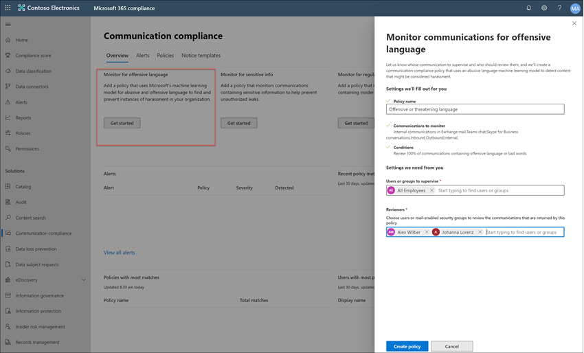

# Case study: Contoso configura rapidamente un criterio linguistico offensivo per Microsoft Teams, Exchange e Yammer comunicazioni

La conformità delle comunicazioni in Microsoft 365 consente di ridurre al minimo i rischi di comunicazione consentendo di rilevare, acquisire e agire su messaggi inappropriati nell'organizzazione. I criteri predefiniti e personalizzati consentono di scansionare le comunicazioni interne ed esterne per trovare corrispondenze con i criteri, in modo che siano esaminate dai revisori designati.  I revisori possono analizzare la posta elettronica analizzata, Microsoft Teams, Yammer o comunicazioni di terze parti nell'organizzazione e intraprendere azioni di correzione appropriate per assicurarsi che siano conformi agli standard dei messaggi dell'organizzazione.

Contoso Corporation è un'organizzazione fittizia che deve configurare rapidamente un criterio per il monitoraggio del linguaggio offensivo. Hanno usato il Microsoft 365 principalmente per il supporto di posta elettronica, Microsoft Teams e Yammer per gli utenti, ma hanno nuovi requisiti per applicare i criteri aziendali sulle molestie sul luogo di lavoro. Gli amministratori IT e gli esperti di conformità di Contoso hanno una conoscenza di base delle nozioni fondamentali dell'utilizzo di Microsoft 365 e cercano indicazioni end-to-end su come iniziare rapidamente a usare la conformità alle comunicazioni.

Questo case study tratterà le nozioni di base per configurare rapidamente un criterio di conformità delle comunicazioni per monitorare la presenza di linguaggio offensivo nelle comunicazioni. Le linee guida includono:

- Passaggio 1: Pianificazione della conformità delle comunicazioni
- Passaggio 2: Accesso alla conformità delle comunicazioni in Microsoft 365
- Passaggio 3: Configurazione dei prerequisiti e creazione di un criterio di conformità delle comunicazioni
- Passaggio 4: Indagine e correzione degli avvisi

## Passaggio 1: Pianificazione della conformità delle comunicazioni

Gli amministratori IT e gli esperti di conformità di Contoso hanno partecipato a webinar online sulle soluzioni di conformità in Microsoft 365 e hanno deciso che i criteri di conformità delle comunicazioni li aiuteranno a soddisfare i requisiti dei criteri aziendali aggiornati per ridurre le molestie sul luogo di lavoro. Collaborando, hanno sviluppato un piano per creare e abilitare criteri di conformità delle comunicazioni che monitoreranno la lingua offensiva per le chat inviate in Microsoft Teams, i messaggi privati e le conversazioni della community in Yammer e nei messaggi di posta elettronica inviati in Exchange Online. Il piano include l'identificazione di:

- Gli amministratori IT che necessitano dell'accesso alle funzionalità di conformità delle comunicazioni.
- Gli esperti di conformità che devono creare e gestire i criteri di comunicazione.
- Gli esperti di conformità e altri colleghi di altri reparti (Risorse umane, Legali e così via) che devono analizzare e correggere gli avvisi di conformità delle comunicazioni.
- Gli utenti che saranno nell'ambito del criterio linguistico offensivo per la conformità delle comunicazioni.

### Licenze

Il primo passaggio consiste nel verificare che le licenze Microsoft 365 contoso includano il supporto per la soluzione di conformità delle comunicazioni. Per accedere e utilizzare la conformità delle comunicazioni, gli amministratori IT di Contoso devono verificare che Contoso abbia uno dei seguenti elementi:

- Microsoft 365 E5 (versione di valutazione o a pagamento)
- Microsoft 365 E3 abbonamento + Microsoft 365 E5 Compliance componente aggiuntivo
- Microsoft 365 E3 e il Microsoft 365 E5 Insider Risk Management
- Microsoft 365 A5 abbonamento (versione di valutazione o a pagamento)
- Microsoft 365 A3 abbonamento + il Microsoft 365 A5 conformità
- Microsoft 365 A3 e il Microsoft 365 A5 Insider Risk Management
- Microsoft 365 Abbonamento G5 (versione di valutazione o a pagamento)
- Microsoft 365 Sottoscrizione G5 + componente aggiuntivo Microsoft 365 conformità G5
- Microsoft 365 Sottoscrizione G5 + il Microsoft 365 G5 Insider Risk Management
- Office 365 Enterprise Abbonamento E5 (versione di valutazione o a pagamento)
- Office 365 Enterprise Sottoscrizione E3 + Office 365 Advanced Compliance componente aggiuntivo (non più disponibile per le nuove sottoscrizioni, vedere nota)

Devono inoltre confermare che agli utenti inclusi nei criteri di conformità delle comunicazioni deve essere assegnata una delle licenze precedenti.

> [!IMPORTANT]
> Office 365 Advanced Compliance non viene più venduto come abbonamento autonomo. Quando le sottoscrizioni correnti scadono, i clienti devono passare a una delle sottoscrizioni precedenti, che contengono le stesse o ulteriori funzionalità di conformità.

Gli amministratori IT di Contoso esereranno i passaggi seguenti per verificare il supporto delle licenze per Contoso:

1. Gli amministratori IT a questo **interfaccia di amministrazione di Microsoft 365** accedere a interfaccia di amministrazione di Microsoft 365 <https://admin.microsoft.com> licenze   >  **di**  >  **fatturazione.**

2. Qui confermano di avere una delle opzioni [di licenza](communication-compliance-configure.md#subscriptions-and-licensing) che include il supporto per la conformità delle comunicazioni.

### Autorizzazioni per la conformità delle comunicazioni

Esistono cinque gruppi di ruoli utilizzati per configurare le autorizzazioni per gestire le funzionalità di conformità delle comunicazioni. Per rendere **disponibile la conformità** delle comunicazioni come opzione di menu in Centro conformità Microsoft 365 e per continuare con questi passaggi di configurazione, agli amministratori di Contoso viene assegnato il ruolo Di amministratore conformità *comunicazione.*

Contoso decide di utilizzare il gruppo di ruoli *Conformità* comunicazione assegna al gruppo tutti gli amministratori, gli analisti, gli investigatori e i visualizzatori della conformità delle comunicazioni. Ciò rende più semplice per Contoso iniziare rapidamente e soddisfare al meglio i requisiti di gestione della conformità.

|**Ruolo**|**Autorizzazioni del ruolo**|
|:-----|:-----|
| **Conformità delle comunicazioni** | Utilizzare questo gruppo di ruoli per gestire la conformità delle comunicazioni per l'organizzazione in un singolo gruppo. Aggiungendo tutti gli account utente per amministratori, analisti, investigatori e visualizzatori designati, è possibile configurare le autorizzazioni di conformità delle comunicazioni in un singolo gruppo. Questo gruppo di ruoli contiene tutti i ruoli di autorizzazione di conformità delle comunicazioni. Questa configurazione è il modo più semplice per iniziare rapidamente a utilizzare la conformità delle comunicazioni ed è adatta per le organizzazioni che non necessitano di autorizzazioni separate definite per gruppi di utenti distinti. |
| **Amministratore per la conformità delle comunicazioni** | Utilizzare questo gruppo di ruoli per configurare inizialmente la conformità delle comunicazioni e successivamente per separare gli amministratori di conformità delle comunicazioni in un gruppo definito. Gli utenti assegnati a questo gruppo di ruoli possono creare, leggere, aggiornare ed eliminare criteri di conformità delle comunicazioni, impostazioni globali e assegnazioni di gruppi di ruoli. Gli utenti assegnati a questo gruppo di ruoli non possono visualizzare gli avvisi dei messaggi. |
| **Communication Compliance Analyst** | Utilizzare questo gruppo per assegnare autorizzazioni agli utenti che fungeranno da analisti della conformità delle comunicazioni. Gli utenti assegnati a questo gruppo di ruoli possono visualizzare i criteri in cui sono assegnati come revisori, visualizzare i metadati dei messaggi (non il contenuto del messaggio), inoltrare ad altri revisori o inviare notifiche agli utenti. Gli analisti non possono risolvere gli avvisi in sospeso. |
| **Communication Compliance Investigator** | Utilizzare questo gruppo per assegnare autorizzazioni agli utenti che agiranno come investigatori della conformità delle comunicazioni. Gli utenti assegnati a questo gruppo di ruoli possono visualizzare i metadati e il contenuto dei messaggi, inoltrare a revisori aggiuntivi, inoltrare a un caso di Advanced eDiscovery, inviare notifiche agli utenti e risolvere l'avviso. |
| **Visualizzatore della conformità delle comunicazioni** | Utilizzare questo gruppo per assegnare autorizzazioni agli utenti che gestiranno i report di comunicazione. Gli utenti assegnati a questo gruppo di ruoli possono accedere a tutti i widget di report nella home page di conformità delle comunicazioni e possono visualizzare tutti i report di conformità delle comunicazioni. |

1. Gli amministratori IT di Contoso a accedere alla pagina delle autorizzazioni del Centro sicurezza e conformità di **Office 365 Security &** [( https://compliance.microsoft.com/permissions)](https://compliance.microsoft.com/permissions) utilizzando le credenziali per un account amministratore globale e selezionare il collegamento per visualizzare e gestire i ruoli in Microsoft 365.
2. Nel **Centro sicurezza & conformità,** passare a **Autorizzazioni** e selezionare il collegamento per visualizzare e gestire i ruoli in Office 365.
3. Gli amministratori selezionano il *gruppo di ruoli Conformità* comunicazione, quindi **selezionaNo Modifica gruppo di ruoli.**
4. Gli amministratori **selezionano Scegli** membri nel riquadro di spostamento sinistro, quindi seleziona **Modifica**.
5. SelezionaNo **Aggiungi** e quindi selezionano la casella di controllo per tutti gli utenti di Contoso che gestiranno la conformità delle comunicazioni, analizzano ed esaminano gli avvisi.
6. Gli amministratori **selezionano Aggiungi,** quindi seleziona **Fatto.**
7. Selezionare Salva **per** aggiungere utenti Contoso al gruppo di ruoli. Seleziona Chiudi **per** completare i passaggi.

## Passaggio 2: Accesso alla conformità delle comunicazioni in Microsoft 365

Dopo aver configurato le autorizzazioni per la conformità delle comunicazioni, gli amministratori IT di Contoso e gli esperti di conformità assegnati al gruppo di ruoli Conformità comunicazione possono accedere alla soluzione di conformità delle comunicazioni in Microsoft 365. Gli amministratori IT e gli esperti di conformità di Contoso hanno diversi modi per accedere alla conformità delle comunicazioni e iniziare a creare un nuovo criterio:

- A partire direttamente dalla soluzione di conformità delle comunicazioni
- A partire dal Centro conformità Microsoft 365
- A partire dal catalogo Microsoft 365 soluzione
- A partire dal interfaccia di amministrazione di Microsoft 365

### A partire direttamente dalla soluzione di conformità delle comunicazioni

Il modo più rapido per accedere alla soluzione consiste nell'accedere direttamente alla **soluzione conformità** alle comunicazioni ( <https://compliance.microsoft.com/supervisoryreview> ). Utilizzando questo collegamento, gli amministratori IT di Contoso e gli esperti di conformità verranno indirizzati al dashboard panoramica sulla conformità delle comunicazioni in cui è possibile esaminare rapidamente lo stato degli avvisi e creare nuovi criteri dai modelli predefiniti.

### A partire dal Centro conformità Microsoft 365

Un altro modo semplice per gli amministratori IT e gli esperti di  conformità di Contoso per accedere alla soluzione di conformità delle comunicazioni consiste nell'accedere direttamente al Centro conformità Microsoft 365 [( https://compliance.microsoft.com) ](https://compliance.microsoft.com). Dopo l'accesso, gli utenti devono semplicemente selezionare il controllo **Mostra tutte** per visualizzare tutte le soluzioni di conformità e quindi selezionare la soluzione **Conformità delle comunicazioni** per iniziare.

### A partire dal catalogo Microsoft 365 soluzione

Gli amministratori IT di Contoso e gli esperti di conformità possono anche scegliere di accedere alla soluzione di conformità delle comunicazioni selezionando il Microsoft 365 catalogo delle soluzioni. Selezionando **Catalogo** nella **sezione Soluzioni** del riquadro di spostamento sinistro nella Centro conformità Microsoft 365 **,** è possibile aprire il catalogo delle soluzioni elencando tutte le Microsoft 365 di conformità. Scorrendo verso il basso fino alla sezione Gestione dei rischi **Insider,** gli amministratori IT di Contoso possono selezionare Conformità delle comunicazioni per iniziare. Gli amministratori IT di Contoso decidono inoltre di utilizzare il controllo Mostra nel riquadro di spostamento per aggiungere la soluzione di conformità delle comunicazioni al riquadro di spostamento sinistro per un accesso più rapido quando accedono in futuro.

### A partire dal interfaccia di amministrazione di Microsoft 365

Per accedere alla conformità delle comunicazioni a partire dal interfaccia di amministrazione di Microsoft 365, gli amministratori IT di Contoso e gli esperti di conformità accedono al interfaccia di amministrazione di Microsoft 365 [( https://admin.microsoft.com)](https://admin.microsoft.com) e passano a interfaccia di amministrazione di Microsoft 365  >  **Conformità**.

Questa azione apre il **Office 365** Sicurezza e conformità e deve selezionare  il collegamento al Centro conformità Microsoft 365 indicato nel banner nella parte superiore della pagina.

Una volta **nella** Centro conformità Microsoft 365 , gli amministratori IT di Contoso **selezionano Mostra tutto** per visualizzare l'elenco completo delle soluzioni di conformità.

Dopo aver **selezionato Mostra tutto,** gli amministratori IT di Contoso possono accedere alla soluzione di conformità delle comunicazioni.

## Passaggio 3: Configurazione dei prerequisiti e creazione di un criterio di conformità delle comunicazioni

Per iniziare a usare un criterio di conformità delle comunicazioni, gli amministratori IT di Contoso devono configurare diversi prerequisiti prima di configurare il nuovo criterio per il monitoraggio della presenza di linguaggio offensivo. Una volta completati i prerequisiti, gli amministratori IT di Contoso e gli esperti della conformità possono configurare i nuovi specialisti dei criteri e della conformità e iniziare l'analisi e la correzione di eventuali avvisi generati.

### Abilitazione del controllo in Microsoft 365

Conformità delle comunicazioni richiede log di audit per visualizzare gli avvisi e tenere traccia delle azioni di correzione intraprese dai revisori. I log di audit sono un riepilogo di tutte le attività associate a un criterio aziendale definito o delle modifiche apportate a un criteri di conformità delle comunicazioni.

Gli amministratori IT di Contoso esaminano e completano le [istruzioni dettagliate](turn-audit-log-search-on-or-off.md) per attivare il controllo. Dopo l'attivazione del controllo, verrà visualizzato un messaggio che indica che è in corso la preparazione del log di audit e che sarà possibile eseguire una ricerca nel giro di qualche ora, al completamento della preparazione. Gli amministratori IT di Contoso devono eseguire questa operazione una sola volta.

### Configurazione di Yammer tenant per la modalità nativa

La conformità delle comunicazioni richiede che il tenant Yammer per un'organizzazione sia in modalità nativa per monitorare il linguaggio offensivo nei messaggi privati e nelle conversazioni della community pubblica.

Gli amministratori IT di Contoso assicurarsi di esaminare le informazioni nell'articolo Panoramica della modalità nativa di [Yammer in Microsoft 365](/yammer/configure-your-yammer-network/overview-native-mode) e seguire i passaggi per l'esecuzione dello strumento di migrazione nell'articolo Configure your Yammer network for Native Mode for [Microsoft 365.](/yammer/configure-your-yammer-network/native-mode)

### Configurazione di un gruppo per gli utenti nell'ambito

Gli esperti di conformità di Contoso desiderano aggiungere tutti gli utenti ai criteri di comunicazione che monitoreranno il linguaggio offensivo. Potrebbero decidere di aggiungere separatamente ogni account utente al criterio, ma hanno deciso che è molto più semplice e consente di risparmiare tempo per l'utilizzo di un gruppo di distribuzione **Tutti** gli utenti per gli utenti per questo criterio.

È necessario creare un nuovo gruppo per includere tutti gli utenti di Contoso, in modo da eseguire la procedura seguente:

1. Contoso IT administrators IT sign in to the **interfaccia di amministrazione di Microsoft 365** [ https://admin.microsoft.com) (](https://admin.microsoft.com) and navigate to **interfaccia di amministrazione di Microsoft 365**  >  **Groups** Groups  >  .
2. SelezionaNo **Aggiungi un gruppo e** completano la procedura guidata per creare un nuovo Microsoft 365 gruppo *o* gruppo *di distribuzione.*

    

3. Dopo aver creato il nuovo gruppo, devono aggiungere tutti gli utenti di Contoso al nuovo gruppo. Aprono **l'Exchange di amministrazione** [( https://outlook.office365.com/ecp)](https://outlook.office365.com/ecp) e passano a Exchange gruppi di destinatari   >  **dell'interfaccia di**  >  **amministrazione**. Gli amministratori IT di Contoso selezionano l'area Appartenenza  e il nuovo gruppo Tutti i dipendenti creati e selezionano il controllo Modifica per aggiungere tutti gli utenti contoso al nuovo gruppo nella procedura guidata. 

    

### Creazione del criterio per il monitoraggio del linguaggio offensivo

Una volta completati tutti i prerequisiti, gli amministratori IT e gli esperti di conformità di Contoso sono pronti a configurare i criteri di conformità delle comunicazioni per il monitoraggio del linguaggio offensivo. Grazie al nuovo modello di criteri per il linguaggio offensivo, la configurazione di questo criterio è semplice e rapida.

1. Gli amministratori IT e gli specialisti della conformità di Contoso effettuano l'accesso al **Centro conformità Microsoft 365** e selezionano **Conformità delle comunicazioni** da riquadro di spostamento sinistro. Questa azione apre il dashboard **Panoramica** che contiene collegamenti rapidi per i modelli dei criteri di conformità delle comunicazioni. Scelgono il modello **Monitorare il linguaggio offensivo** selezionando **Inizia** per il modello.

    

2. Nella procedura guidata del modello di criteri gli amministratori IT e gli esperti di conformità di Contoso lavorano insieme per completare i tre campi obbligatori: **Nome criterio**, **Utenti o gruppi da supervisionare** e **Revisori**.
3. Poiché la creazione guidata criteri ha già suggerito un nome per il criterio, gli amministratori IT e gli esperti di conformità decidono di mantenere il nome suggerito e concentrarsi sui campi rimanenti. Selezionano il *campo Tutti* gli utenti del campo Utenti o gruppi da supervisionare e selezionano gli esperti di conformità che devono analizzare e correggere gli avvisi dei criteri per il **campo Revisori.**  L'ultimo passaggio per configurare il criterio e avviare la raccolta di informazioni sugli avvisi consiste nel selezionare **Crea criterio**.

    

## Passaggio 4: analizzare e correggere gli avvisi

Una volta configurato il criterio di conformità delle comunicazioni per il monitoraggio del linguaggio offensivo, gli esperti di conformità di Contoso doeranno esaminare e correggere gli eventuali avvisi generati dal criterio. Saranno necessarie fino a 24 ore prima che il criterio elabori completamente le comunicazioni in tutti i canali di comunicazione di origine e che gli avvisi siano visualizzati nel **dashboard degli avvisi**.

Dopo la generazione degli avvisi, gli esperti di conformità di Contoso seguiranno le istruzioni del [flusso di lavoro](communication-compliance-investigate-remediate.md) per analizzare e correggere i problemi di linguaggio offensivi.