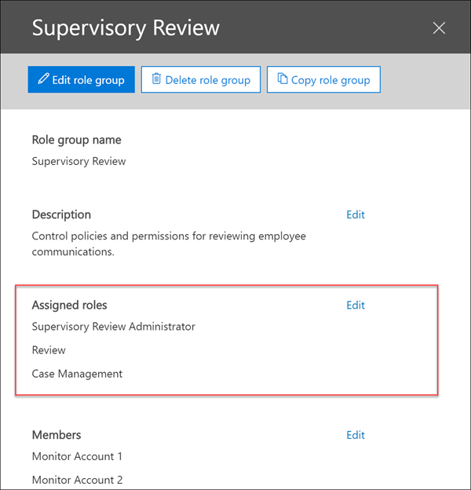

# Configurare la conformità delle comunicazioni in Microsoft 365 (anteprima)Configure communication compliance in Microsoft 365 (preview)

> [!IMPORTANT]
> Questo argomento si applica alla configurazione della conformità di comunicazione in un abbonamento a Microsoft 365.This topic applies to configuring communication compliance in a Microsoft 365 subscription. Se si desidera configurare i criteri di supervisione per una sottoscrizione a Office 365, vedere [Configure supervisioning for office 365](supervision-policies.md).If you want to configure Supervision policies for an Office 365 subscription, see [Configure supervision for Office 365](supervision-policies.md).

Utilizzare i criteri di conformità della comunicazione per acquisire le comunicazioni dei dipendenti per l'esame da revisori interni o esterni.Use communication compliance policies to capture employee communications for examination by internal or external reviewers. Per ulteriori informazioni su come i criteri di conformità della comunicazione consentono di monitorare le comunicazioni nell'organizzazione, vedere [Communication Compliance Policies in Microsoft 365](communication-compliance.md).For more information about how communication compliance policies can help you monitor communications in your organization, see [communication compliance policies in Microsoft 365](communication-compliance.md).

> [!NOTE]
> Gli utenti monitorati dai criteri di conformità della comunicazione devono avere una licenza di conformità Microsoft 365 E5, una licenza di Office 365 Enterprise E3 con il componente aggiuntivo per la conformità avanzato oppure essere inclusi in un abbonamento a Office 365 Enterprise E5.Users monitored by communication compliance policies must have either a Microsoft 365 E5 Compliance license, an Office 365 Enterprise E3 license with the Advanced Compliance add-on, or be included in an Office 365 Enterprise E5 subscription.
> Se non si dispone di un piano Enterprise E5 esistente e si vuole provare la conformità alla comunicazione, è possibile [iscriversi per una versione di valutazione di Office 365 Enterprise E5](https://go.microsoft.com/fwlink/p/?LinkID=698279).If you don't have an existing Enterprise E5 plan and want to try communication compliance, you can [sign up for a trial of Office 365 Enterprise E5](https://go.microsoft.com/fwlink/p/?LinkID=698279).
  
Seguire questa procedura per configurare e usare la conformità della comunicazione nell'organizzazione Microsoft 365:Follow these steps to set up and use communication compliance in your Microsoft 365 organization:
  
- **Passaggio 1 (facoltativo)**: [configurare i gruppi per la conformità della comunicazione](#step-1-set-up-groups-for-communication-compliance-optional)**Step 1 (optional)**: [Set up groups for communication compliance](#step-1-set-up-groups-for-communication-compliance-optional) 

    Prima di iniziare a utilizzare la conformità alla comunicazione, determinare gli utenti che devono esaminare le comunicazioni e che eseguono le revisioni.Before you start using communication compliance, determine who needs communications reviewed and who performs reviews. Se si desidera iniziare a usare solo alcuni utenti per vedere come funziona la conformità di comunicazione, è possibile ignorare la configurazione dei gruppi per il momento.If you want to get started with just a few users to see how communication compliance works, you can skip setting up groups for now.

- **Passaggio 2 (obbligatorio)**: [rendere la conformità della comunicazione disponibile nell'organizzazione](#step-2-make-communication-compliance-available-in-your-organization-required)**Step 2 (required)**: [Make communication compliance available in your organization](#step-2-make-communication-compliance-available-in-your-organization-required)

    Aggiungersi al ruolo **amministratore revisione di supervisione** per impostare i criteri.Add yourself to the **Supervisory Review Administrator** role so you can set up policies. È inoltre necessario creare un nuovo gruppo con l' **amministratore revisione di supervisione**, la **gestione dei casi**e i ruoli di **Revisione** per persone o gruppi che avranno un'azione di verifica e correzione nei messaggi con corrispondenze di criteri.You'll also need to create a new group with the **Supervisory Review Administrator**, **Case Management**, and **Review** roles to people or groups that will take investigative and remediation action on messages with policy matches. Tutti gli utenti a cui è assegnato questo ruolo possono accedere alla pagina **conformità comunicazione** nel centro conformità di Microsoft 365.Anyone who has these roles assigned can access the **Communication compliance** page in the Microsoft 365 compliance center. Se il messaggio di posta elettronica rivisualizzabile è ospitato in Exchange Online, ogni revisore deve disporre dell' [accesso remoto a PowerShell a Exchange Online](https://docs.microsoft.com/powershell/exchange/exchange-online/disable-access-to-exchange-online-powershell).If reviewable email is hosted on Exchange Online, each reviewer must have [remote PowerShell access to Exchange Online](https://docs.microsoft.com/powershell/exchange/exchange-online/disable-access-to-exchange-online-powershell).

- **Passaggio 3 (obbligatorio)**: [impostare un criterio di conformità della comunicazione](#step-3-create-a-communication-compliance-policy-required)**Step 3 (required)**: [Set up a communication compliance policy](#step-3-create-a-communication-compliance-policy-required)

    È possibile creare criteri di conformità della comunicazione nel centro conformità di Microsoft 365.You create communication compliance policies in the Microsoft 365 compliance center. Questi criteri definiscono le comunicazioni soggette a revisione nell'organizzazione e specifica chi esegue le revisioni.These policies define which communications are subject to review in your organization and specifies who performs reviews. Le comunicazioni includono la posta elettronica, Microsoft teams, Skype for business e le comunicazioni della piattaforma di terze parti (come Facebook, Twitter e così via).Communications include email, Microsoft Teams, Skype for Business, and third-party platform communications (such as Facebook, Twitter, etc.).

- **Passaggio 4 (facoltativo)**: [creare modelli di avviso](#step-4-create-employee-notice-templates-optional) per i dipendenti**Step 4 (optional)**: [Create employee notice templates](#step-4-create-employee-notice-templates-optional)

    Creare modelli di avviso personalizzati per inviare notifiche tramite posta elettronica ai dipendenti come opzione di correzione per le corrispondenze di criteri.Create custom notice templates to send email notifications to employees as a remediation option for policy matches.

- **Passaggio 5 (facoltativo)**: [testare i criteri di conformità della comunicazione](#step-5-test-your-communication-compliance-policy-optional)**Step 5 (optional)**: [Test your communication compliance policy](#step-5-test-your-communication-compliance-policy-optional)

    Testare i criteri di conformità della comunicazione per assicurarsi che funzioni come desiderato.Test your communication compliance policy to make sure it functions as desired. È importante garantire che la strategia di conformità soddisfi gli standard.It's important to ensure that your compliance strategy is meeting your standards.

- **Passaggio 6 (facoltativo)**: [abilitare il controllo per i criteri di conformità della comunicazione](#step-6-enable-auditing-for-your-communication-compliance-policies-optional)**Step 6 (optional)**: [Enable auditing for your communication compliance policies](#step-6-enable-auditing-for-your-communication-compliance-policies-optional)

    Abilitare il controllo per l'organizzazione per registrare le attività di gestione per i criteri di conformità della comunicazione.Enable auditing for your organization to record managment activities for communication compliance policies.

## Passaggio 1: configurare i gruppi per la conformità delle comunicazioni (facoltativo)Step 1: Set up groups for communication compliance (optional)

 Quando si crea un criterio di conformità della comunicazione, è possibile definire gli utenti che hanno esaminato le comunicazioni e che eseguono le revisioni.When you create a communication compliance policy, you define who has their communications reviewed and who performs reviews. Nei criteri si utilizzeranno gli indirizzi di posta elettronica per identificare singoli o gruppi di persone.In the policy, you'll use email addresses to identify individuals or groups of people. Per semplificare la configurazione, è possibile creare gruppi per gli utenti che hanno la propria comunicazione riesaminata e i gruppi per gli utenti che esaminano tali comunicazioni.To simplify your setup, you can create groups for people who have their communication reviewed and groups for people who review those communications. Se si utilizzano i gruppi, potrebbero essere necessari diversi.If you're using groups, you may need several. Ad esempio, se si desidera monitorare le comunicazioni tra due gruppi distinti di persone o se si desidera specificare un gruppo che non verrà controllato.For example, if you want to monitor communications between two distinct groups of people or if you want to specify a group that isn't going to be supervised.

Utilizzare il seguente grafico per facilitare la configurazione dei gruppi nell'organizzazione per i criteri di conformità della comunicazione:Use the following chart to help you configure groups in your organization for communication compliance policies:

| **Membro del criterio****Policy Member** | **Gruppi supportati****Supported Groups** | **Gruppi non supportati****Unsupported Groups** |
|:-----|:-----|:-----|
|Utenti controllatiSupervised users   Utenti non controllatiNon-supervised users | Gruppi di distribuzioneDistribution groups   Gruppi di Office 365Office 365 groups | Gruppi di distribuzione dinamiciDynamic distribution groups |
| RevisoriReviewers | Gruppi di sicurezza abilitati alla posta elettronicaMail-enabled security groups  | Gruppi di distribuzioneDistribution groups   Gruppi di distribuzione dinamiciDynamic distribution groups |
  
Quando si seleziona un gruppo di Office 365 per gli utenti controllati, il criterio monitora il contenuto della cassetta postale di Office 365 condivisa e dei canali Microsoft teams associati al gruppo.When you select an Office 365 group for supervised users, the policy monitors the content of the shared Office 365 mailbox and the Microsoft Teams channels associated with the group. Quando si seleziona una lista di distribuzione, il criterio monitora le singole cassette postali degli utenti.When you select a distribution list, the policy monitors individual user mailboxes.

Per ulteriori informazioni sulla configurazione dei gruppi, vedere:For more information about setting up groups, see:

- [Creazione e gestione dei gruppi di distribuzioneCreate and manage distribution groups](https://docs.microsoft.com/Exchange/recipients-in-exchange-online/manage-distribution-groups/manage-distribution-groups)
- [Gestire i gruppi di protezione abilitati alla posta elettronicaManage mail-enabled security groups](https://docs.microsoft.com/Exchange/recipients-in-exchange-online/manage-mail-enabled-security-groups)
- [Panoramica dei gruppi di Office 365Overview of Office 365 Groups](https://docs.microsoft.com/office365/admin/create-groups/office-365-groups?view=o365-worldwide)

## Passaggio 2: rendere la conformità della comunicazione disponibile nell'organizzazione (obbligatorio)Step 2: Make communication compliance available in your organization (required)

> [!Important]
> Per impostazione predefinita, gli amministratori globali non possono accedere alle funzionalità di conformità della comunicazione.By default, Global Administrators do not have access to communication compliance features. I ruoli assegnati a questo passaggio sono necessari prima che vengano accessibili tutte le funzionalità di conformità della comunicazione.The roles assigned in this step are required before any communication compliance features will be accessible.

Per rendere la **conformità di comunicazione** disponibile come opzione di menu in Microsoft 365 Compliance Center, è necessario essere assegnati al ruolo di **amministratore revisione di supervisione** .To make **Communication compliance** available as a menu option in Microsoft 365 compliance center, you must be assigned the **Supervisory Review Administrator** role. Inoltre, per esaminare e correggere i messaggi con le corrispondenze di criteri, è necessario creare un gruppo per i revisori con l' **amministratore revisione di supervisione**, la **gestione dei casi**e i ruoli di **Revisione** .Additionally, to investigate and remediate messages with policy matches, you must create a group for reviewers with the **Supervisory Review Administrator**, **Case Management**, and **Review** roles.

### Creare un nuovo gruppo di ruoliCreate a new role group

1. Accedere [https://protection.office.com/permissions](https://protection.office.com/permissions) con le credenziali per un account di amministratore nell'organizzazione Microsoft 365.Sign into [https://protection.office.com/permissions](https://protection.office.com/permissions) using credentials for an admin account in your Microsoft 365 organization.

2. Nel centro sicurezza e conformità di Microsoft Office 365 accedere a **autorizzazioni**.In the Microsoft Office 365 security and compliance center, go to **Permissions**. Selezionare il collegamento per visualizzare e gestire i ruoli in Office 365.Select the link to view and manage roles in Office 365.

3. Selezionare **Crea**.Select **Create**.

4. Nel campo **nome** assegnare un nome descrittivo al nuovo gruppo di ruoli.In the **Name** field, give the new role group a friendly name.  Select **Next**. Select **Next**.

5. Selezionare **Scegli ruoli** e quindi **Aggiungi**.Select **Choose roles** and then select **Add**. Selezionare la casella di controllo per l' **amministratore revisione di supervisione**, la **gestione dei casi**e la **Revisione**, quindi selezionare **Aggiungi** e **Chiudi**.Select the checkbox for **Supervisory Review Administrator**, **Case Management**, and **Review**, then select **Add** and **Done**.  Select **Next**. Select **Next**.

    

6. Selezionare **Scegli membri** e quindi **Aggiungi**.Select **Choose members** and then select **Add**. Selezionare la casella di controllo per tutti gli utenti e i gruppi che si desidera creare criteri e gestire i messaggi con le corrispondenze di criteri, quindi fare clic su **Aggiungi** e **Chiudi**.Select the checkbox for all the users and groups you want create policies and manage messages with policy matches, then select **Add** and **Done**.  Select **Next**. Select **Next**.

7. Selezionare **Crea gruppo di ruoli** per terminare.Select **Create role group** to finish.

Per ulteriori informazioni sui gruppi di ruoli e sulle autorizzazioni, vedere [Permissions in the Compliance Center](../security/office-365-security/protect-against-threats.md).For more information about role groups and permissions, see [Permissions in the Compliance Center](../security/office-365-security/protect-against-threats.md).

## Passaggio 3: creare un criterio di conformità della comunicazione (obbligatorio)Step 3: Create a communication compliance policy (required)
  
1. Accedere [https://compliance.microsoft.com](https://compliance.microsoft.com) con le credenziali per un account di amministratore nell'organizzazione Microsoft 365.Sign into [https://compliance.microsoft.com](https://compliance.microsoft.com) using credentials for an admin account in your Microsoft 365 organization.

2. Nel centro conformità di Microsoft 365 selezionare **conformità comunicazione**.In the Microsoft 365 compliance center, select **Communication compliance**.
  
3. Selezionare la scheda **criteri** .Select the **Policies** tab.

4. Selezionare **create Policy** per creare e configurare un nuovo criterio da un modello o per creare e configurare un criterio personalizzato.Select **Create policy** to create and configure a new policy from a template or to create and configure a custom policy.

    Se si sceglie un modello di criteri per creare un criterio, sarà necessario:If you choose a policy template to create a policy, you will:

    - Confermare o aggiornare il nome del criterio.Confirm or update the policy name. Non è possibile modificare i nomi dei criteri dopo la creazione del criterio.Policy names cannot be changed once the policy is created.
    - Scegliere gli utenti o i gruppi da controllare, inclusa la scelta degli utenti o dei gruppi che si desidera escludere.Choose the users or groups to supervise, including choosing users or groups you'd like to exclude.
    - Scegliere i revisori per il criterio.Choose the reviewers for the policy. I revisori possono essere singoli utenti o [gruppi di sicurezza abilitati alla posta elettronica](https://docs.microsoft.com/Exchange/recipients-in-exchange-online/manage-mail-enabled-security-groups#create-a-mail-enabled-security-group).Reviewers can be individual users or [mail-enabled security groups](https://docs.microsoft.com/Exchange/recipients-in-exchange-online/manage-mail-enabled-security-groups#create-a-mail-enabled-security-group). Tutti i revisori devono disporre di cassette postali ospitate in Exchange Online.All reviewers must have mailboxes hosted on Exchange Online.
    - Scegliere un campo di condizioni limitate, in genere un tipo di informazioni riservate o un dizionario di parole chiave da applicare al criterio.Choose a limited condition field, usually a sensitive info type or keyword dictionary to apply to the policy.

    Se si sceglie di utilizzare la procedura guidata dei criteri per creare un criterio personalizzato, sarà necessario:If you choose to use the policy wizard to create a custom policy, you will:

    - Assegnare al criterio un nome e una descrizione.Give the policy a name and description. Non è possibile modificare i nomi dei criteri dopo la creazione del criterio.Policy names can't be changed once the policy is created.
    - Scegliere gli utenti o i gruppi da controllare, inclusi tutti gli utenti dell'organizzazione, utenti e gruppi specifici o altri utenti e gruppi che si desidera escludere.Choose the users or groups to supervise, including all users in your organization, specific users and groups, or other users and groups you'd like to exclude. -
    - Scegliere i revisori per il criterio.Choose the reviewers for the policy. I revisori possono essere singoli utenti o [gruppi di sicurezza abilitati alla posta elettronica](https://docs.microsoft.com/Exchange/recipients-in-exchange-online/manage-mail-enabled-security-groups#create-a-mail-enabled-security-group).Reviewers can be individual users or [mail-enabled security groups](https://docs.microsoft.com/Exchange/recipients-in-exchange-online/manage-mail-enabled-security-groups#create-a-mail-enabled-security-group). Tutti i revisori devono disporre di cassette postali ospitate in Exchange Online.All reviewers must have mailboxes hosted on Exchange Online.
    - Scegliere i canali di comunicazione da analizzare, tra cui Exchange, Microsoft teams o Skype for business.Choose the communication channels to scan, including Exchange, Microsoft Teams, or Skype for Business. Se si è configurato un connettore in Microsoft 365, è inoltre possibile scegliere di eseguire l'analisi delle origini di terze parti.You'll also choose to scan third-party sources if you've configured a connector in Microsoft 365.
    - Scegliere la direzione di comunicazione da monitorare, incluse le comunicazioni in ingresso, in uscita o interne.Choose the communication direction to monitor, including inbound, outbound, or internal communications.
    - Definire le [condizioni](communication-compliance-feature-reference.md#ConditionalSettings)dei criteri di conformità della comunicazione.Define the communication compliance policy [conditions](communication-compliance-feature-reference.md#ConditionalSettings). È possibile scegliere tra l'indirizzo del messaggio, la parola chiave, i tipi di file e le condizioni di corrispondenza delle dimensioni.You can choose from message address, keyword, file types, and size match conditions.
    - Scegliere se si desidera includere tipi di informazioni riservate.Choose if you'd like to include sensitive information types. In questo passaggio è possibile selezionare i tipi di informazioni riservate predefinite e personalizzate.This step is where you can select default and custom sensitive info types. Scegliere tra tipi di informazioni riservate personalizzate esistenti o dizionari di parole chiave personalizzati nella procedura guidata criteri di conformità della comunicazione.Pick from existing custom sensitive information types or custom keyword dictionaries in the communication compliance policy wizard. È possibile creare questi elementi prima di eseguire la procedura guidata, se necessario.You can create these items before running the wizard if needed. È inoltre possibile creare nuovi tipi di informazioni riservate dall'interno della procedura guidata criteri di conformità della comunicazione.You can also create new sensitive information types from within the communication compliance policy wizard.
    - Scegliere se si desidera abilitare il classificatore di lingua offensivo.Choose if you'd like to enable the offensive language classifier. Questo classificatore rileva la lingua inappropriata inviata o ricevuta nel corpo dei messaggi di posta elettronica.This  classifier detects inappropriate language sent or received in the body of email messages.
    - Definire la percentuale di comunicazioni da esaminare.Define the percentage of communications to review.
    - Esaminare le selezioni dei criteri e creare il criterio.Review your policy selections and create the policy.

5. Selezionare **Crea criterio** quando si utilizzano i modelli o **Invia** quando si utilizza la procedura guidata per i criteri personalizzati.Select **Create policy** when using the templates or **Submit** when using the custom policy wizard.

6. La pagina **criteri è stata creata** viene visualizzata con linee guida su quando verranno attivati i criteri e quali comunicazioni verranno acquisite.The **Your policy was created** page is displayed with guidelines on when policy will be activated and which communications will be captured.

## Passaggio 4: creare modelli di avviso per i dipendenti (facoltativo)Step 4: Create employee notice templates (optional)

Se si desidera avere la possibilità di rispondere a un avviso di criteri inviando un avviso di sollecito al dipendente associato, è necessario creare almeno un modello di avviso nell'organizzazione.If you want to have the option of responding to a policy alert by sending a reminder notice to the associated employee, you'll need to create at least one notice template in your organization. I campi del modello di avviso sono modificabili prima di essere inviati come parte del processo di correzione degli avvisi e la creazione di un modello di avviso personalizzato per ogni criterio di conformità della comunicazione è consigliata.The notice template fields are editable before they're sent as part of the alert remediation process, and creating a customized notice template for each communication compliance policy is recommended.

1. Accedere [https://compliance.microsoft.com](https://compliance.microsoft.com) con le credenziali per un account di amministratore nell'organizzazione Microsoft 365.Sign into [https://compliance.microsoft.com](https://compliance.microsoft.com) using credentials for an admin account in your Microsoft 365 organization.

2. Nel centro conformità di Microsoft 365, passare a **conformità comunicazione**.In the Microsoft 365 compliance center, go to **Communication compliance**.

3. Selezionare la scheda **modelli di avviso** e quindi fare clic su **Crea modello di avviso**.Select the **Notice templates** tab and then select **Create notice template**.

4. Nella pagina **modifica modello di avviso** completare i seguenti campi:On the **Modify a notice template** page, complete the following fields:

    - Nome del modello di avviso (obbligatorio)Notice template name (required)
    - Invia da (obbligatorio)Send from (required)
    - CC e Ccn (facoltativo)Cc and Bcc (optional)
    - Subject (obbligatorio)Subject (required)
    - Corpo del messaggio (obbligatorio)Message body (required)

5. Selezionare **Salva** per creare e salvare il modello di avviso.Select **Save** to create and save the notice template.

## Passaggio 5: testare i criteri di conformità della comunicazione (facoltativo)Step 5: Test your communication compliance policy (optional)

Dopo aver creato un criterio di conformità della comunicazione, è consigliabile testarlo per assicurarsi che le condizioni definite vengano applicate correttamente dal criterio.After you create a communication compliance policy, it's a good idea to test it to make sure that the conditions you defined are being properly enforced by the policy. È inoltre possibile [testare i criteri di prevenzione della perdita di dati (DLP)](create-test-tune-dlp-policy.md) se i criteri di conformità della comunicazione includono tipi di informazioni riservate.You may also want to [test your data loss prevention (DLP) policies](create-test-tune-dlp-policy.md) if your communication compliance policies include sensitive information types. Assicurarsi di fornire i criteri per l'attivazione in modo che le comunicazioni che si desidera testare vengano acquisite.Make sure you give your policies time to activate so that the communications you want to test are captured.

Eseguire la procedura seguente per testare i criteri di conformità della comunicazione:Follow these steps to test your communication compliance policy:

1. Aprire un client di posta elettronica o Microsoft teams mentre è stato eseguito l'accesso come utente controllato definito nel criterio che si desidera sottoporre a test.Open an email client or Microsoft Teams while signed in as a supervised user defined in the policy you want to test.
2. Inviare un messaggio di posta elettronica o Microsoft teams chat che soddisfi i criteri definiti nel criterio di conformità della comunicazione.Send an email or Microsoft Teams chat that meets the criteria you've defined in the communication compliance policy. Questo test può essere una parola chiave, le dimensioni degli allegati, il dominio e così via. Assicurarsi di determinare se le impostazioni condizionali configurate nel criterio sono troppo restrittive o troppo indulgenti.This test can be a keyword, attachment size, domain, etc. Make sure you determine if your configured conditional settings in the policy are too restrictive or too lenient.

    > [!NOTE]
    > Le comunicazioni in tutti i canali di origine possono richiedere fino a 24 ore per il processo completo in un criterio.Communications in all source channels can take up to 24 hours to fully process in a policy.

3. Accedere a Microsoft 365 come un revisore designato nei criteri di conformità della comunicazione.Sign in to Microsoft 365 as a reviewer designated in the communication compliance policy. Passare a > **avvisi** **conformità comunicazione**per visualizzare gli avvisi per i criteri.Navigate to **Communication compliance** > **Alerts** to view the alerts for your policies.

4. Correggere l'avviso utilizzando i controlli di correzione e verificare che l'avviso sia stato risolto correttamente.Remediate the alert using the remediation controls and verify that the alert is properly resolved.

## Passaggio 6: abilitare il controllo per i criteri di conformità della comunicazione (facoltativo)Step 6: Enable auditing for your communication compliance policies (optional)

Dopo aver testato i criteri, è possibile abilitare il controllo in modo che le attività associate alla gestione della conformità della comunicazione vengano registrate.After you've tested your policies, you may want to enable auditing so that activities associated with communication compliance management are recorded. Può trattarsi di un riepilogo di tutte le attività associate a un criterio organizzativo definito o in qualsiasi momento in cui cambia il criterio di conformità della comunicazione.This may be a summary of all activities associated with a defined organizational policy or anytime a communication compliance policy changes.

Quando il controllo è abilitato, i criteri di conformità della comunicazione hanno percorsi di controllo incorporati per una completa preparazione per i controlli interni o esterni.When auditing is enabled, communication compliance policies have built-in audit trails for complete readiness for internal or external audits. È possibile utilizzare il controllo **Esporta attività di revisione** nella pagina principale per qualsiasi criterio per generare un file di controllo o per visualizzare le attività di controllo nel log di controllo unificato se il controllo è abilitato.You can use the **Export review activities** control on the main page for any policy to generate an audit file or view audit activities in the unified audit log if auditing is enabled.

Per attivare il controllo, fare clic su **Avvia registrazione attività utente e amministratore** nella pagina di **ricerca del registro di controllo** nel centro sicurezza & conformità di Office 365.To turn auditing on, click **Start recording user and admin activity** on the **Audit log search** page in the Office 365 Security & Compliance Center. Se questo collegamento non è visualizzato, il controllo è già stato attivato per l'organizzazione.If you don't see this link, auditing has already been turned on for your organization. Dopo aver attivato il controllo, viene visualizzato un messaggio che indica che il registro di controllo viene preparato e che è possibile eseguire una ricerca in un paio d'ore dopo il completamento della preparazione.After you turn auditing on, a message is displayed that says the audit log is being prepared and that you can run a search in a couple of hours after the preparation is complete. Questa procedura deve essere eseguita una sola volta.You only have to do this once. Per ulteriori informazioni sul log di controllo, vedere [Search the audit log](search-the-audit-log-in-security-and-compliance.md).For more information about the audit log, see [Search the audit log](search-the-audit-log-in-security-and-compliance.md).

