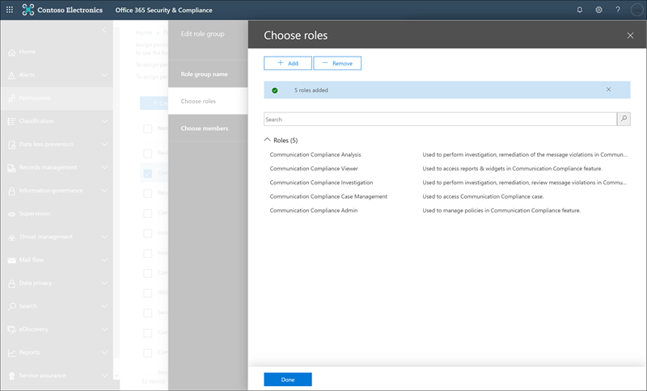

# Introduzione alla conformità delle comunicazioni

Utilizzare i criteri di conformità della comunicazione per identificare le comunicazioni degli utenti per l'esame da parte di revisori interni o esterni. Per ulteriori informazioni su come i criteri di conformità della comunicazione consentono di monitorare le comunicazioni nell'organizzazione, vedere [Communication Compliance Policies in Microsoft 365](communication-compliance.md). Se si desidera esaminare in che modo Contoso ha configurato rapidamente un criterio di conformità della comunicazione per il monitoraggio per la lingua offensiva in Microsoft teams, Exchange Online e Yammer Communications, vedere questo [caso di studio](communication-compliance-case-study.md).

## Prima di iniziare

Prima di iniziare a utilizzare la conformità alla comunicazione, è necessario confermare la [sottoscrizione Microsoft 365](https://www.microsoft.com/microsoft-365/compare-all-microsoft-365-plans) e i componenti aggiuntivi. Per accedere e utilizzare la conformità di comunicazione, è necessario che l'organizzazione disponga di una delle sottoscrizioni o dei componenti aggiuntivi seguenti:

- Sottoscrizione Microsoft 365 E5 (a pagamento o versione di valutazione)
- Sottoscrizione Microsoft 365 E3 + il componente aggiuntivo Microsoft 365 E5 Compliance
- Sottoscrizione Microsoft 365 E3 + componente aggiuntivo Microsoft 365 E5 Insider Risk Management
- Sottoscrizione Microsoft 365 a5 (a pagamento o versione di valutazione)
- Sottoscrizione Microsoft 365 a3 + componente aggiuntivo Microsoft 365 a5 Compliance
- Sottoscrizione Microsoft 365 a3 + componente aggiuntivo Microsoft 365 a5 Insider Risk Management
- Sottoscrizione Microsoft 365 G5 (a pagamento o versione di valutazione)
- Sottoscrizione Microsoft 365 G5 + componente aggiuntivo Microsoft 365 G5 Compliance
- Microsoft 365 G5 Subscription + Microsoft 365 G5 Insider Risk Management componente aggiuntivo
- Abbonamento a Office 365 Enterprise E5 (a pagamento o versione di valutazione)
- Abbonamento a Office 365 Enterprise E3 + il componente aggiuntivo Office 365 Advanced Compliance (non più disponibile per le nuove sottoscrizioni, vedere note)

Agli utenti inclusi nei criteri di conformità della comunicazione deve essere assegnata una delle licenze sopra riportate.

>[!IMPORTANT]
>La conformità avanzata di Office 365 non viene più venduta come sottoscrizione autonoma. Quando le sottoscrizioni correnti scadono, i clienti devono passare a una delle sottoscrizioni precedenti, che contengono le stesse funzionalità di conformità o aggiuntive.

Se non si dispone di un piano di Office 365 Enterprise E5 esistente e si desidera tentare la gestione dei rischi Insider, è possibile [aggiungere Microsoft 365](https://docs.microsoft.com/office365/admin/try-or-buy-microsoft-365) alla sottoscrizione esistente oppure [iscriversi a una versione di valutazione](https://www.microsoft.com/microsoft-365/enterprise) di Office 365 Enterprise E5.

## Passaggio 1 (obbligatorio): abilitare le autorizzazioni per la conformità della comunicazione

>[!Important]
>Per impostazione predefinita, gli amministratori globali non possono accedere alle funzionalità di conformità della comunicazione. I ruoli assegnati a questo passaggio sono necessari prima che vengano accessibili tutte le funzionalità di conformità della comunicazione.

Sono disponibili cinque ruoli che consentono di configurare le autorizzazioni per la gestione delle funzionalità di conformità della comunicazione. Per rendere la **conformità di comunicazione** disponibile come opzione di menu nel centro conformità di Microsoft 365 e continuare con questi passaggi di configurazione, è necessario essere assegnati al ruolo di *amministratore conformità comunicazione* .

A seconda del modo in cui si desidera gestire i criteri di comunicazione e gli avvisi, è necessario creare uno o più nuovi gruppi di ruoli per gli amministratori, i revisori e gli investigatori. È possibile assegnare gli utenti a specifici gruppi di ruoli per gestire diverse aree di funzionalità di conformità della comunicazione. In alternativa, è possibile decidere di creare un gruppo di ruoli e assegnare tutti i ruoli di conformità alla comunicazione al gruppo. Creare un singolo gruppo di ruoli o più gruppi di ruoli per soddisfare al meglio i requisiti di gestione della conformità.

Scegliere tra queste opzioni di ruolo quando si configurano i gruppi di ruoli di conformità della comunicazione:

|**Ruolo**|**Autorizzazioni di ruolo**|
|:-----|:-----|
| **Amministratore della conformità alla comunicazione** | Gli utenti assegnati a questo ruolo possono creare, leggere, aggiornare ed eliminare i criteri di conformità della comunicazione, le impostazioni globali e le assegnazioni dei gruppi di ruoli. Gli utenti assegnati a questo ruolo non possono visualizzare gli avvisi dei messaggi. |
| **Analisi di conformità della comunicazione** | Gli utenti assegnati a questo ruolo possono visualizzare i criteri in cui vengono assegnati come revisori, visualizzare i metadati dei messaggi (non il contenuto del messaggio), inoltrare a revisori aggiuntivi o inviare notifiche agli utenti. Gli analisti non sono in grado di risolvere gli avvisi in sospeso. |
| **Indagine di conformità della comunicazione** | Gli utenti assegnati a questo ruolo possono visualizzare i metadati e il contenuto del messaggio, inoltrare ai revisori aggiuntivi, inoltrare a un caso avanzato di eDiscovery, inviare notifiche agli utenti e risolvere l'avviso. |
| **Visualizzatore conformità comunicazione** | Gli utenti assegnati a questo ruolo possono accedere a tutti i widget per la creazione di report nella Home page conformità di comunicazione e visualizzare tutti i report di conformità della comunicazione. |
| **Gestione dei casi di conformità alla comunicazione** | Gli utenti assegnati a questo ruolo possono gestire i casi e agire sugli avvisi. Questo ruolo è necessario per la creazione di gruppi di ruoli personalizzati per amministratori, analisti e ricercatori. Non è necessario che questo ruolo sia assegnato ai gruppi personalizzati per i visualizzatori. |

### Opzione 1: creare un nuovo gruppo di ruoli con tutti i ruoli di conformità di comunicazione

1. Accedere [https://protection.office.com/permissions](https://protection.office.com/permissions) con le credenziali per un account di amministratore nell'organizzazione Microsoft 365.

2. Nel centro sicurezza &amp; e conformità, accedere a **autorizzazioni**. Selezionare il collegamento per visualizzare e gestire i ruoli in Office 365.

3. Selezionare **Crea**.

4. Nel campo **nome** assegnare un nome descrittivo al nuovo gruppo di ruoli. Selezionare **Avanti**.

5. Selezionare **Scegli ruoli** e quindi **Aggiungi**. Selezionare le caselle di controllo per i ruoli seguenti:

    - Amministratore della conformità alla comunicazione
    - Analisi di conformità della comunicazione
    - Indagine di conformità della comunicazione
    - Visualizzatore conformità comunicazione
    - Gestione dei casi di conformità alla comunicazione

    

6. Selezionare **Aggiungi** e **Chiudi**, quindi fare clic su **Avanti** per continuare.

7. Selezionare **Scegli membri** e quindi **Aggiungi**. Selezionare la casella di controllo per tutti gli utenti e i gruppi che si desidera creare criteri e gestire i messaggi con le corrispondenze di criteri, quindi fare clic su **Aggiungi** e **Chiudi**. Selezionare **Avanti**.

8. Selezionare **Crea gruppo di ruoli** per terminare.

### Opzione 2: creare nuovi gruppi di ruoli con ruoli di conformità di comunicazione diversi

Creare più gruppi di ruoli per segmentare l'accesso e le responsabilità per la conformità delle comunicazioni tra diversi utenti dell'organizzazione. Per ogni nuovo gruppo di ruoli, verranno assegnati diversi ruoli di conformità della comunicazione.

1. Accedere [https://protection.office.com/permissions](https://protection.office.com/permissions) con le credenziali per un account di amministratore nell'organizzazione Microsoft 365.

2. Nel centro sicurezza &amp; e conformità, accedere a **autorizzazioni**. Selezionare il collegamento per visualizzare e gestire i ruoli in Office 365.

3. Selezionare **Crea**.

4. Nel campo **nome** assegnare un nome descrittivo al nuovo gruppo di ruoli. Selezionare **Avanti**.

5. Selezionare **Scegli ruoli** e quindi **Aggiungi**. Selezionare la casella di controllo per i ruoli di conformità di comunicazione che si desidera assegnare al gruppo. Ad esempio, se questo gruppo di ruoli è per gli analisti di conformità nell'organizzazione, è necessario selezionare i ruoli di *gestione* delle *comunicazioni* di conformità di comunicazione e di conformità di comunicazione. Se questo gruppo di ruoli è per gli investigatori di conformità, è necessario selezionare i ruoli di *gestione dei casi* di verifica della conformità di *comunicazione* e della comunicazione.

    

6. Selezionare **Aggiungi** e **Chiudi**, quindi fare clic su **Avanti** per continuare.

7. Selezionare **Scegli membri** e quindi **Aggiungi**. Selezionare la casella di controllo per tutti gli utenti e i gruppi che si desidera creare criteri e gestire i messaggi con le corrispondenze di criteri, quindi fare clic su **Aggiungi** e **Chiudi**. Selezionare **Avanti**.

8. Selezionare **Crea gruppo di ruoli** per terminare.

9. Creare gruppi di ruoli di conformità di comunicazione aggiuntivi in base alle esigenze.

Per ulteriori informazioni sui gruppi di ruoli e sulle autorizzazioni, vedere [Permissions in the Compliance Center](../security/office-365-security/protect-against-threats.md).

## Passaggio 2 (obbligatorio): abilitare il log di controllo

La conformità alla comunicazione richiede i registri di controllo per visualizzare gli avvisi e tenere presenti le azioni di correzione eseguite dai revisori. I registri di controllo sono un riepilogo di tutte le attività associate a un criterio organizzativo definito o in qualsiasi momento di un criterio di conformità comunicazione modifiche.

Per istruzioni dettagliate su come abilitare il controllo, vedere [attivazione o disattivazione della ricerca del registro di controllo](turn-audit-log-search-on-or-off.md). Dopo aver attivato il controllo, viene visualizzato un messaggio che indica che il registro di controllo viene preparato e che è possibile eseguire una ricerca in un paio d'ore dopo il completamento della preparazione. È sufficiente eseguire questa operazione una sola volta. Per ulteriori informazioni sull'utilizzo del log di controllo, vedere [Search the audit log](search-the-audit-log-in-security-and-compliance.md).

## Passaggio 3 (facoltativo): configurare i gruppi per la conformità della comunicazione

 Quando si crea un criterio di conformità della comunicazione, è possibile definire gli utenti che hanno esaminato le comunicazioni e che eseguono le revisioni. Nei criteri si utilizzeranno gli indirizzi di posta elettronica per identificare singoli o gruppi di persone. Per semplificare la configurazione, è possibile creare gruppi per gli utenti che hanno la propria comunicazione riesaminata e i gruppi per gli utenti che esaminano tali comunicazioni. Se si utilizzano i gruppi, potrebbero essere necessari diversi. Ad esempio, se si desidera monitorare le comunicazioni tra due gruppi distinti di persone o se si desidera specificare un gruppo che non verrà controllato.

Utilizzare il seguente grafico per facilitare la configurazione dei gruppi nell'organizzazione per i criteri di conformità della comunicazione:

| **Membro del criterio** | **Gruppi supportati** | **Gruppi non supportati** |
|:-----|:-----|:-----|
|Utenti controllati   Utenti non controllati | Gruppi di distribuzione   Gruppi di Microsoft 365 | Gruppi di distribuzione dinamici |
| Revisori | Nessuno | Gruppi di distribuzione   Gruppi di distribuzione dinamici   Gruppi di sicurezza abilitati alla posta elettronica |
  
Quando si assegna un gruppo di distribuzione nel criterio, il criterio monitora tutti i messaggi di posta elettronica di ogni utente del gruppo di distribuzione. Quando si assegna un gruppo di Microsoft 365 nel criterio, il criterio monitora tutti i messaggi di posta elettronica inviati a quel gruppo, non i singoli messaggi di posta elettronica ricevuti da ogni membro del gruppo.

Se si è un'organizzazione che dispone di una distribuzione locale di Exchange o di un provider di posta elettronica esterno e si desidera monitorare le chat di Microsoft teams per gli utenti, è necessario creare un gruppo di distribuzione per gli utenti che dispongono di cassette postali locali o esterne da monitorare. Più avanti in questa procedura, si assegna questo gruppo di distribuzione come selezione di **utenti e gruppi sorvegliati** nella procedura guidata per i criteri.

>[!IMPORTANT]
>È necessario presentare una richiesta con il supporto tecnico Microsoft per consentire all'organizzazione di utilizzare l'interfaccia utente grafica nel centro sicurezza & conformità per cercare i dati di chat dei team per gli utenti locali. Per ulteriori informazioni, vedere [ricerca di cassette postali basate sul cloud per gli utenti locali](search-cloud-based-mailboxes-for-on-premises-users.md).

Per ulteriori informazioni sulla configurazione dei gruppi, vedere:

- [Creazione e gestione dei gruppi di distribuzione](https://docs.microsoft.com/Exchange/recipients-in-exchange-online/manage-distribution-groups/manage-distribution-groups)
- [Panoramica dei gruppi di Microsoft 365](https://docs.microsoft.com/office365/admin/create-groups/office-365-groups?view=o365-worldwide)

## Passaggio 4 (facoltativo): verificare che il tenant di Yammer sia in modalità nativa

In modalità nativa, tutti gli utenti di Yammer sono in Azure Active Directory (AAD), tutti i gruppi sono gruppi di Office 365 e tutti i file vengono archiviati in SharePoint Online. Il tenant di Yammer deve essere in modalità nativa per i criteri di conformità della comunicazione per analizzare e identificare le conversazioni rischiose nei messaggi privati e nelle conversazioni della community in Yammer.

Per ulteriori informazioni sulla configurazione di Yammer in modalità nativa, vedere:

- [Panoramica della modalità nativa di Yammer in Microsoft 365](https://docs.microsoft.com/yammer/configure-your-yammer-network/overview-native-mode)
- [Configurare la rete Yammer per la modalità nativa per Microsoft 365](https://docs.microsoft.com/yammer/configure-your-yammer-network/native-mode)

## Passaggio 5 (obbligatorio): creare un criterio di conformità della comunicazione
  
>[!Important]
>L'utilizzo di PowerShell per la creazione e la gestione di criteri di conformità della comunicazione non è supportato. Per creare e gestire questi criteri, è necessario utilizzare i controlli di gestione dei criteri nella [soluzione Microsoft 365 Communication Compliance](https://compliance.microsoft.com/supervisoryreview).

1. Accedere [https://compliance.microsoft.com](https://compliance.microsoft.com) con le credenziali per un account di amministratore nell'organizzazione Microsoft 365.

2. Nel centro conformità di Microsoft 365 selezionare **conformità comunicazione**.
  
3. Selezionare la scheda **criteri** .

4. Selezionare **create Policy** per creare e configurare un nuovo criterio da un modello o per creare e configurare un criterio personalizzato.

    Se si sceglie un modello di criteri per creare un criterio, sarà necessario:

    - Confermare o aggiornare il nome del criterio. Non è possibile modificare i nomi dei criteri dopo la creazione del criterio.
    - Scegliere gli utenti o i gruppi da controllare, inclusa la scelta degli utenti o dei gruppi che si desidera escludere.
    - Scegliere i revisori per il criterio. I revisori sono utenti singoli e tutti i revisori devono disporre di cassette postali ospitate in Exchange Online. Revisori aggiunti qui sono i revisori che è possibile scegliere quando si effettua l'escalation di un avviso nel flusso di lavoro di analisi e correzione. Quando i revisori vengono aggiunti a un criterio, ricevono automaticamente un messaggio di posta elettronica che informa gli utenti dell'assegnazione ai criteri e fornisce collegamenti alle informazioni sul processo di revisione.
    - Scegliere un campo di condizioni limitate, in genere un tipo di informazioni riservate o un dizionario di parole chiave da applicare al criterio.

    Se si sceglie di utilizzare la procedura guidata dei criteri per creare un criterio personalizzato, sarà necessario:

    - Assegnare al criterio un nome e una descrizione. Non è possibile modificare i nomi dei criteri dopo la creazione del criterio.
    - Scegliere gli utenti o i gruppi da controllare, inclusi tutti gli utenti dell'organizzazione, utenti e gruppi specifici o altri utenti e gruppi che si desidera escludere.
    - Scegliere i revisori per il criterio. I revisori sono utenti singoli e tutti i revisori devono disporre di cassette postali ospitate in Exchange Online. Revisori aggiunti qui sono i revisori che è possibile scegliere quando si effettua l'escalation di un avviso nel flusso di lavoro di analisi e correzione. Quando i revisori vengono aggiunti a un criterio, ricevono automaticamente un messaggio di posta elettronica che informa gli utenti dell'assegnazione ai criteri e fornisce collegamenti alle informazioni sul processo di revisione.
    - Scegliere i canali di comunicazione da analizzare, tra cui Exchange, Microsoft teams, Yammer o Skype for business. Se si è configurato un connettore in Microsoft 365, è inoltre possibile scegliere di eseguire l'analisi delle origini di terze parti.
    - Scegliere la direzione di comunicazione da monitorare, incluse le comunicazioni in ingresso, in uscita o interne.
    - Definire le [condizioni](communication-compliance-feature-reference.md#ConditionalSettings)dei criteri di conformità della comunicazione. È possibile scegliere tra l'indirizzo del messaggio, la parola chiave, i tipi di file e le condizioni di corrispondenza delle dimensioni.
    - Scegliere se si desidera includere tipi di informazioni riservate. In questo passaggio è possibile selezionare i tipi di informazioni riservate predefinite e personalizzate. Scegliere tra tipi di informazioni riservate personalizzate esistenti o dizionari di parole chiave personalizzati nella procedura guidata criteri di conformità della comunicazione. È possibile creare questi elementi prima di eseguire la procedura guidata, se necessario. È inoltre possibile creare nuovi tipi di informazioni riservate dall'interno della procedura guidata criteri di conformità della comunicazione.
    - Scegliere se si desidera abilitare i classificatori. I classificatori possono rilevare la lingua e le immagini inappropriate inviate o ricevute nel corpo dei messaggi di posta elettronica o di altri tipi di testo. È possibile scegliere i seguenti classificatori incorporati: *minaccia*, *profanità*, *molestie mirate*, *Immagini per adulti*, *Immagini*in fila e *immagini cruente*.

    >[!CAUTION]
    >Il classificatore predefinito **Linguaggio offensivo** è stato deprecato perché generava un numero elevato di falsi positivi. Non utilizzarlo e, se lo si sta attualmente utilizzando, è consigliabile spostarne i processi aziendali. È consigliabile utilizzare invece la **minaccia**, la **profanità**e i classificatori incorporati per **molestie mirate** .

    - Definire la percentuale di comunicazioni da esaminare.
    - Esaminare le selezioni dei criteri e creare il criterio.

5. Selezionare **Crea criterio** quando si utilizzano i modelli o **Invia** quando si utilizza la procedura guidata per i criteri personalizzati.

6. La pagina **criteri è stata creata** viene visualizzata con linee guida su quando verranno attivati i criteri e quali comunicazioni verranno acquisite.

## Passaggio 6 (facoltativo): creare modelli di avviso e configurare gli utenti di Anonymization

Se si desidera avere la possibilità di rispondere a un avviso di criteri inviando un avviso di sollecito all'utente associato, è necessario creare almeno un modello di avviso nell'organizzazione. I campi del modello di avviso sono modificabili prima di essere inviati come parte del processo di correzione degli avvisi e la creazione di un modello di avviso personalizzato per ogni criterio di conformità della comunicazione è consigliata.

È inoltre possibile scegliere di abilitare Anonymization per i nomi utente visualizzati quando si esaminano le corrispondenze di criteri e si attivano i messaggi.

1. Accedere [https://compliance.microsoft.com](https://compliance.microsoft.com) con le credenziali per un account di amministratore nell'organizzazione Microsoft 365.

2. Nel centro conformità di Microsoft 365, passare a **conformità comunicazione**.

3. Per configurare Anonymization per i nomi utente, selezionare la scheda **privacy** .

4. Per abilitare Anonymization, selezionare **Mostra le versioni di anonimi dei nomi utente**.

5. Seleziona **Salva**.

6. Passare alla scheda **modelli di avviso** e quindi selezionare **Crea modello di avviso**.

7. Nella pagina **modifica modello di avviso** completare i seguenti campi:

    - Nome modello (obbligatorio)
    - Invia da (obbligatorio)
    - CC e Ccn (facoltativo)
    - Subject (obbligatorio)
    - Corpo del messaggio (obbligatorio)

8. Selezionare **Salva** per creare e salvare il modello di avviso.

## Passaggio 7 (facoltativo): testare i criteri di conformità della comunicazione

Dopo aver creato un criterio di conformità della comunicazione, è consigliabile testarlo per assicurarsi che le condizioni definite vengano applicate correttamente dal criterio. È inoltre possibile [testare i criteri di prevenzione della perdita di dati (DLP)](create-test-tune-dlp-policy.md) se i criteri di conformità della comunicazione includono tipi di informazioni riservate. Assicurarsi di fornire i criteri per l'attivazione in modo che le comunicazioni che si desidera testare vengano acquisite.

Eseguire la procedura seguente per testare i criteri di conformità della comunicazione:

1. Aprire un client di posta elettronica, Microsoft teams o Yammer mentre è stato eseguito l'accesso come utente controllato definito nel criterio che si desidera sottoporre a test.
2. Inviare un messaggio di posta elettronica, Microsoft teams chat o Yammer che soddisfi i criteri definiti nel criterio di conformità della comunicazione. Questo test può essere una parola chiave, le dimensioni degli allegati, il dominio e così via. Assicurarsi di determinare se le impostazioni condizionali configurate nel criterio sono troppo restrittive o troppo indulgenti.

    > [!NOTE]
    > Le comunicazioni in tutti i canali di origine possono richiedere fino a 24 ore per il processo completo in un criterio.

3. Accedere a Microsoft 365 come un revisore designato nei criteri di conformità della comunicazione. Passare a **avvisi conformità comunicazione**  >  **Alerts** per visualizzare gli avvisi per i criteri.

4. Correggere l'avviso utilizzando i controlli di correzione e verificare che l'avviso sia stato risolto correttamente.

## Passaggi successivi

Dopo aver completato questa procedura per creare il primo criterio di conformità della comunicazione, si inizierà a ricevere avvisi da indicatori di attività dopo circa 24 ore. Configurare criteri aggiuntivi in base alle esigenze utilizzando le indicazioni riportate nel passaggio 5 di questo articolo.

Per ulteriori informazioni su come esaminare gli avvisi relativi alla conformità della comunicazione, vedere [indagare e correggere gli avvisi di conformità della comunicazione](communication-compliance-investigate-remediate.md).
