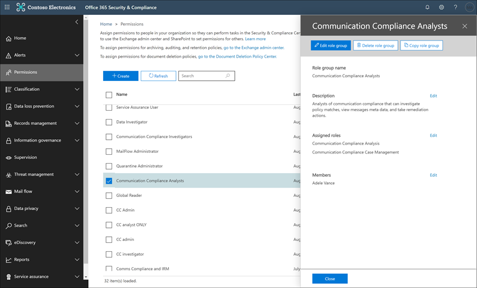

# Introduzione alla conformità delle comunicazioniGet started with communication compliance

Utilizzare i criteri di conformità della comunicazione per identificare le comunicazioni degli utenti per l'esame da parte di revisori interni o esterni.Use communication compliance policies to identify user communications for examination by internal or external reviewers. Per ulteriori informazioni su come i criteri di conformità della comunicazione consentono di monitorare le comunicazioni nell'organizzazione, vedere [Communication Compliance Policies in Microsoft 365](communication-compliance.md).For more information about how communication compliance policies can help you monitor communications in your organization, see [communication compliance policies in Microsoft 365](communication-compliance.md). Se si desidera esaminare in che modo Contoso ha configurato rapidamente un criterio di conformità della comunicazione per il monitoraggio per la lingua offensiva in Microsoft teams, Exchange Online e Yammer Communications, vedere questo [caso di studio](communication-compliance-case-study.md).If you'd like to review how Contoso quickly configured a communication compliance policy to monitor for offensive language in Microsoft Teams, Exchange Online, and Yammer communications, check out this [case study](communication-compliance-case-study.md).

## Prima di iniziareBefore you begin

Prima di iniziare a utilizzare la conformità alla comunicazione, è necessario confermare la [sottoscrizione Microsoft 365](https://www.microsoft.com/microsoft-365/compare-all-microsoft-365-plans) e i componenti aggiuntivi.Before you get started with communication compliance, you should confirm your [Microsoft 365 subscription](https://www.microsoft.com/microsoft-365/compare-all-microsoft-365-plans) and any add-ons. Per accedere e utilizzare la conformità di comunicazione, è necessario che l'organizzazione disponga di una delle sottoscrizioni o dei componenti aggiuntivi seguenti:To access and use communication compliance, your organization must have one of the following subscriptions or add-ons:

- Sottoscrizione Microsoft 365 E5 (a pagamento o versione di valutazione)Microsoft 365 E5 subscription (paid or trial version)
- Sottoscrizione Microsoft 365 E3 + il componente aggiuntivo Microsoft 365 E5 ComplianceMicrosoft 365 E3 subscription + the Microsoft 365 E5 Compliance add-on
- Sottoscrizione Microsoft 365 E3 + componente aggiuntivo Microsoft 365 E5 Insider Risk ManagementMicrosoft 365 E3 subscription + the Microsoft 365 E5 Insider Risk Management add-on
- Sottoscrizione Microsoft 365 a5 (a pagamento o versione di valutazione)Microsoft 365 A5 subscription (paid or trial version)
- Sottoscrizione Microsoft 365 a3 + componente aggiuntivo Microsoft 365 a5 ComplianceMicrosoft 365 A3 subscription + the Microsoft 365 A5 Compliance add-on
- Sottoscrizione Microsoft 365 a3 + componente aggiuntivo Microsoft 365 a5 Insider Risk ManagementMicrosoft 365 A3 subscription + the Microsoft 365 A5 Insider Risk Management add-on
- Sottoscrizione Microsoft 365 G5 (a pagamento o versione di valutazione)Microsoft 365 G5 subscription (paid or trial version)
- Sottoscrizione Microsoft 365 G5 + componente aggiuntivo Microsoft 365 G5 ComplianceMicrosoft 365 G5 subscription + the Microsoft 365 G5 Compliance add-on
- Microsoft 365 G5 Subscription + Microsoft 365 G5 Insider Risk Management componente aggiuntivoMicrosoft 365 G5 subscription + the Microsoft 365 G5 Insider Risk Management add-on
- Abbonamento a Office 365 Enterprise E5 (a pagamento o versione di valutazione)Office 365 Enterprise E5 subscription (paid or trial version)
- Abbonamento a Office 365 Enterprise E3 + il componente aggiuntivo Office 365 Advanced Compliance (non più disponibile per le nuove sottoscrizioni, vedere note)Office 365 Enterprise E3 subscription + the Office 365 Advanced Compliance add-on (no longer available for new subscriptions, see note)

Agli utenti inclusi nei criteri di conformità della comunicazione deve essere assegnata una delle licenze sopra riportate.Users included in communication compliance policies must be assigned one of the licenses above.

>[!IMPORTANT]
>La conformità avanzata di Office 365 non viene più venduta come sottoscrizione autonoma.Office 365 Advanced Compliance is no longer sold as a standalone subscription. Quando le sottoscrizioni correnti scadono, i clienti devono passare a una delle sottoscrizioni precedenti, che contengono le stesse funzionalità di conformità o aggiuntive.When current subscriptions expire, customers should transition to one of the subscriptions above, which contain the same or additional compliance features.

Se non si dispone di un piano di Office 365 Enterprise E5 esistente e si desidera tentare la gestione dei rischi Insider, è possibile [aggiungere Microsoft 365](https://docs.microsoft.com/office365/admin/try-or-buy-microsoft-365) alla sottoscrizione esistente oppure [iscriversi a una versione di valutazione](https://www.microsoft.com/microsoft-365/enterprise) di Office 365 Enterprise E5.If you don't have an existing Office 365 Enterprise E5 plan and want to try insider risk management, you can [add Microsoft 365](https://docs.microsoft.com/office365/admin/try-or-buy-microsoft-365) to your existing subscription or [sign up for a trial](https://www.microsoft.com/microsoft-365/enterprise) of Office 365 Enterprise E5.

## Passaggio 1 (obbligatorio): abilitare le autorizzazioni per la conformità della comunicazioneStep 1 (required): Enable permissions for communication compliance

>[!Important]
>Per impostazione predefinita, gli amministratori globali non possono accedere alle funzionalità di conformità della comunicazione.By default, Global Administrators do not have access to communication compliance features. I ruoli assegnati a questo passaggio sono necessari prima che vengano accessibili tutte le funzionalità di conformità della comunicazione.The roles assigned in this step are required before any communication compliance features will be accessible.

Sono disponibili cinque ruoli che consentono di configurare le autorizzazioni per la gestione delle funzionalità di conformità della comunicazione.There are five roles used to configure permissions to manage communication compliance features. Per rendere la **conformità di comunicazione** disponibile come opzione di menu nel centro conformità di Microsoft 365 e continuare con questi passaggi di configurazione, è necessario essere assegnati al ruolo di *amministratore conformità comunicazione* .To make **Communication compliance** available as a menu option in Microsoft 365 compliance center and to continue with these configuration steps, you must be assigned the *Communication Compliance Admin* role.

A seconda del modo in cui si desidera gestire i criteri di comunicazione e gli avvisi, è necessario creare uno o più nuovi gruppi di ruoli per gli amministratori, i revisori e gli investigatori.Depending on how you wish to manage communication policies and alerts, you'll need to create one or more new role groups for administrators, reviewers, and investigators. È possibile assegnare gli utenti a specifici gruppi di ruoli per gestire diverse aree di funzionalità di conformità della comunicazione.You have the option to assign users to specific role groups to manage different areas of communication compliance features. In alternativa, è possibile decidere di creare un gruppo di ruoli e assegnare tutti i ruoli di conformità alla comunicazione al gruppo.Or you may decide to create one role group and assign all the communication compliance roles to the group. Creare un singolo gruppo di ruoli o più gruppi di ruoli per soddisfare al meglio i requisiti di gestione della conformità.Create a single role group or multiple role groups to best fit your compliance management requirements.

Scegliere tra queste opzioni di ruolo quando si configurano i gruppi di ruoli di conformità della comunicazione:Choose from these role options when configuring your communication compliance role groups:

|**Ruolo****Role**|**Autorizzazioni di ruolo****Role permissions**|
|:-----|:-----|
| **Amministratore della conformità alla comunicazione****Communication Compliance Admin** | Gli utenti assegnati a questo ruolo possono creare, leggere, aggiornare ed eliminare i criteri di conformità della comunicazione, le impostazioni globali e le assegnazioni dei gruppi di ruoli.Users assigned this role can create, read, update, and delete communication compliance policies, global settings, and role group assignments. Gli utenti assegnati a questo ruolo non possono visualizzare gli avvisi dei messaggi.Users assigned this role cannot view message alerts. |
| **Analisi di conformità della comunicazione****Communication Compliance Analysis** | Gli utenti assegnati a questo ruolo possono visualizzare i criteri in cui vengono assegnati come revisori, visualizzare i metadati dei messaggi (non il contenuto del messaggio), inoltrare a revisori aggiuntivi o inviare notifiche agli utenti.Users assigned this role can view policies where they are assigned as Reviewers, view message metadata (not message content), escalate to additional reviewers, or send notifications to users. Gli analisti non sono in grado di risolvere gli avvisi in sospeso.Analysts cannot resolve pending alerts. |
| **Indagine di conformità della comunicazione****Communication Compliance Investigation** | Gli utenti assegnati a questo ruolo possono visualizzare i metadati e il contenuto del messaggio, inoltrare ai revisori aggiuntivi, inoltrare a un caso avanzato di eDiscovery, inviare notifiche agli utenti e risolvere l'avviso.Users assigned this role can view message metadata and content, escalate to additional reviewers, escalate to an Advanced eDiscovery case, send notifications to users, and resolve the alert. |
| **Visualizzatore conformità comunicazione****Communication Compliance Viewer** | Gli utenti assegnati a questo ruolo possono accedere a tutti i widget per la creazione di report nella Home page conformità di comunicazione e visualizzare tutti i report di conformità della comunicazione.Users assigned this role can access all reporting widgets on the communication compliance home page and can view all communication compliance reports. |
| **Gestione dei casi di conformità alla comunicazione****Communication Compliance Case Management** | Gli utenti assegnati a questo ruolo possono gestire i casi e agire sugli avvisi.Users assigned this role can manage cases and act on alerts. Questo ruolo è necessario per la creazione di gruppi di ruoli personalizzati per amministratori, analisti e ricercatori.This role is required for when creating custom role groups for administrators, analysts, and investigators. Non è necessario che questo ruolo sia assegnato ai gruppi personalizzati per i visualizzatori.Custom groups for viewers do not need this role assigned. |

### Opzione 1: creare un nuovo gruppo di ruoli con tutti i ruoli di conformità di comunicazioneOption 1: Create a new role group with all communication compliance roles

1. Accedere [https://protection.office.com/permissions](https://protection.office.com/permissions) con le credenziali per un account di amministratore nell'organizzazione Microsoft 365.Sign into [https://protection.office.com/permissions](https://protection.office.com/permissions) using credentials for an admin account in your Microsoft 365 organization.

2. Nel centro sicurezza &amp; e conformità, accedere a **autorizzazioni**.In the Security &amp; Compliance Center, go to **Permissions**. Selezionare il collegamento per visualizzare e gestire i ruoli in Office 365.Select the link to view and manage roles in Office 365.

3. Selezionare **Crea**.Select **Create**.

4. Nel campo **nome** assegnare un nome descrittivo al nuovo gruppo di ruoli.In the **Name** field, give the new role group a friendly name. Selezionare **Avanti**.Select **Next**.

5. Selezionare **Scegli ruoli** e quindi **Aggiungi**.Select **Choose roles** and then select **Add**. Selezionare le caselle di controllo per i ruoli seguenti:Select the checkboxes for the following roles:

    - Amministratore della conformità alla comunicazioneCommunication Compliance Admin
    - Analisi di conformità della comunicazioneCommunication Compliance Analysis
    - Indagine di conformità della comunicazioneCommunication Compliance Investigation
    - Visualizzatore conformità comunicazioneCommunication Compliance Viewer
    - Gestione dei casi di conformità alla comunicazioneCommunication Compliance Case Management

    

6. Selezionare **Aggiungi** e **Chiudi**, quindi fare clic su **Avanti** per continuare.select **Add** and **Done**, then select **Next** to continue.

7. Selezionare **Scegli membri** e quindi **Aggiungi**.Select **Choose members** and then select **Add**. Selezionare la casella di controllo per tutti gli utenti e i gruppi che si desidera creare criteri e gestire i messaggi con le corrispondenze di criteri, quindi fare clic su **Aggiungi** e **Chiudi**.Select the checkbox for all the users and groups you want create policies and manage messages with policy matches, then select **Add** and **Done**. Selezionare **Avanti**.Select **Next**.

8. Selezionare **Crea gruppo di ruoli** per terminare.Select **Create role group** to finish.

### Opzione 2: creare nuovi gruppi di ruoli con ruoli di conformità di comunicazione diversiOption 2: Create new role groups with different communication compliance roles

Creare più gruppi di ruoli per segmentare l'accesso e le responsabilità per la conformità delle comunicazioni tra diversi utenti dell'organizzazione.Create multiple role groups to segment communication compliance access and responsibilities among different users in your organization. Per ogni nuovo gruppo di ruoli, verranno assegnati diversi ruoli di conformità della comunicazione.For each new role group, you'll assign different communication compliance roles.

1. Accedere [https://protection.office.com/permissions](https://protection.office.com/permissions) con le credenziali per un account di amministratore nell'organizzazione Microsoft 365.Sign into [https://protection.office.com/permissions](https://protection.office.com/permissions) using credentials for an admin account in your Microsoft 365 organization.

2. Nel centro sicurezza &amp; e conformità, accedere a **autorizzazioni**.In the Security &amp; Compliance Center, go to **Permissions**. Selezionare il collegamento per visualizzare e gestire i ruoli in Office 365.Select the link to view and manage roles in Office 365.

3. Selezionare **Crea**.Select **Create**.

4. Nel campo **nome** assegnare un nome descrittivo al nuovo gruppo di ruoli.In the **Name** field, give the new role group a friendly name. Selezionare **Avanti**.Select **Next**.

5. Selezionare **Scegli ruoli** e quindi **Aggiungi**.Select **Choose roles** and then select **Add**. Selezionare la casella di controllo per i ruoli di conformità di comunicazione che si desidera assegnare al gruppo.Select the checkbox for the communication compliance roles you want to assign to this group. Ad esempio, se questo gruppo di ruoli è per gli analisti di conformità nell'organizzazione, è necessario selezionare i ruoli di *gestione* delle *comunicazioni* di conformità di comunicazione e di conformità di comunicazione.For example, if this role group is for compliance analysts in your organization, you would select the *Communication Compliance Analysis* and *Communication Compliance Case Management* roles. Se questo gruppo di ruoli è per gli investigatori di conformità, è necessario selezionare i ruoli di *gestione dei casi* di verifica della conformità di *comunicazione* e della comunicazione.If this role group is for compliance investigators, you would select the *Communication Compliance Investigation* and *Communication Compliance Case Management* roles.

    

6. Selezionare **Aggiungi** e **Chiudi**, quindi fare clic su **Avanti** per continuare.Select **Add** and **Done**, then select **Next** to continue.

7. Selezionare **Scegli membri** e quindi **Aggiungi**.Select **Choose members** and then select **Add**. Selezionare la casella di controllo per tutti gli utenti e i gruppi che si desidera creare criteri e gestire i messaggi con le corrispondenze di criteri, quindi fare clic su **Aggiungi** e **Chiudi**.Select the checkbox for all the users and groups you want create policies and manage messages with policy matches, then select **Add** and **Done**. Selezionare **Avanti**.Select **Next**.

8. Selezionare **Crea gruppo di ruoli** per terminare.Select **Create role group** to finish.

9. Creare gruppi di ruoli di conformità di comunicazione aggiuntivi in base alle esigenze.Create additional communication compliance role groups as needed.

Per ulteriori informazioni sui gruppi di ruoli e sulle autorizzazioni, vedere [Permissions in the Compliance Center](../security/office-365-security/protect-against-threats.md).For more information about role groups and permissions, see [Permissions in the Compliance Center](../security/office-365-security/protect-against-threats.md).

## Passaggio 2 (obbligatorio): abilitare il log di controlloStep 2 (required): Enable the audit log

La conformità alla comunicazione richiede i registri di controllo per visualizzare gli avvisi e tenere presenti le azioni di correzione eseguite dai revisori.Communication compliance requires audit logs to show alerts and track remediation actions taken by reviewers. I registri di controllo sono un riepilogo di tutte le attività associate a un criterio organizzativo definito o in qualsiasi momento di un criterio di conformità comunicazione modifiche.The audit logs are a summary of all activities associated with a defined organizational policy or anytime a communication compliance policy changes.

Per istruzioni dettagliate su come abilitare il controllo, vedere [attivazione o disattivazione della ricerca del registro di controllo](turn-audit-log-search-on-or-off.md).For step-by-step instructions to turn on auditing, see [Turn audit log search on or off](turn-audit-log-search-on-or-off.md). Dopo aver attivato il controllo, viene visualizzato un messaggio che indica che il registro di controllo viene preparato e che è possibile eseguire una ricerca in un paio d'ore dopo il completamento della preparazione.After you turn on auditing, a message is displayed that says the audit log is being prepared and that you can run a search in a couple of hours after the preparation is complete. È sufficiente eseguire questa operazione una sola volta.You only have to do this action once. Per ulteriori informazioni sull'utilizzo del log di controllo, vedere [Search the audit log](search-the-audit-log-in-security-and-compliance.md).For more information about the using the audit log, see [Search the audit log](search-the-audit-log-in-security-and-compliance.md).

## Passaggio 3 (facoltativo): configurare i gruppi per la conformità della comunicazioneStep 3 (optional): Set up groups for communication compliance

 Quando si crea un criterio di conformità della comunicazione, è possibile definire gli utenti che hanno esaminato le comunicazioni e che eseguono le revisioni.When you create a communication compliance policy, you define who has their communications reviewed and who performs reviews. Nei criteri si utilizzeranno gli indirizzi di posta elettronica per identificare singoli o gruppi di persone.In the policy, you'll use email addresses to identify individuals or groups of people. Per semplificare la configurazione, è possibile creare gruppi per gli utenti che hanno la propria comunicazione riesaminata e i gruppi per gli utenti che esaminano tali comunicazioni.To simplify your setup, you can create groups for people who have their communication reviewed and groups for people who review those communications. Se si utilizzano i gruppi, potrebbero essere necessari diversi.If you're using groups, you may need several. Ad esempio, se si desidera monitorare le comunicazioni tra due gruppi distinti di persone o se si desidera specificare un gruppo che non verrà controllato.For example, if you want to monitor communications between two distinct groups of people or if you want to specify a group that isn't going to be supervised.

Utilizzare il seguente grafico per facilitare la configurazione dei gruppi nell'organizzazione per i criteri di conformità della comunicazione:Use the following chart to help you configure groups in your organization for communication compliance policies:

| **Membro del criterio****Policy Member** | **Gruppi supportati****Supported Groups** | **Gruppi non supportati****Unsupported Groups** |
|:-----|:-----|:-----|
|Utenti controllatiSupervised users   Utenti non controllatiNon-supervised users | Gruppi di distribuzioneDistribution groups   Gruppi di Microsoft 365Microsoft 365 Groups | Gruppi di distribuzione dinamiciDynamic distribution groups |
| RevisoriReviewers | NessunoNone | Gruppi di distribuzioneDistribution groups   Gruppi di distribuzione dinamiciDynamic distribution groups   Gruppi di sicurezza abilitati alla posta elettronicaMail-enabled security groups |
  
Quando si assegna un gruppo di distribuzione nel criterio, il criterio monitora tutti i messaggi di posta elettronica di ogni utente del gruppo di distribuzione.When you assign a distribution group in the policy, the policy monitors all emails from each user in distribution group. Quando si assegna un gruppo di Microsoft 365 nel criterio, il criterio monitora tutti i messaggi di posta elettronica inviati a quel gruppo, non i singoli messaggi di posta elettronica ricevuti da ogni membro del gruppo.When you assign a Microsoft 365 group in the policy, the policy monitors all emails sent to that group, not the individual emails received by each group member.

Se si è un'organizzazione che dispone di una distribuzione locale di Exchange o di un provider di posta elettronica esterno e si desidera monitorare le chat di Microsoft teams per gli utenti, è necessario creare un gruppo di distribuzione per gli utenti che dispongono di cassette postali locali o esterne da monitorare.If you're an organization with an Exchange on-premises deployment or an external email provider and you want to monitor Microsoft Teams chats for your users, you must create a distribution group for the users with on-premises or external mailboxes to monitor. Più avanti in questa procedura, si assegna questo gruppo di distribuzione come selezione di **utenti e gruppi sorvegliati** nella procedura guidata per i criteri.Later in these steps, you'll assign this distribution group as the **Supervised users and groups** selection in the policy wizard.

>[!IMPORTANT]
>È necessario presentare una richiesta con il supporto tecnico Microsoft per consentire all'organizzazione di utilizzare l'interfaccia utente grafica nel centro sicurezza & conformità per cercare i dati di chat dei team per gli utenti locali.You must file a request with Microsoft Support to enable your organization to use the graphical user interface in the Security & Compliance Center to search for Teams chat data for on-premises users. Per ulteriori informazioni, vedere [ricerca di cassette postali basate sul cloud per gli utenti locali](search-cloud-based-mailboxes-for-on-premises-users.md).For more information, see [Searching cloud-based mailboxes for on-premises users](search-cloud-based-mailboxes-for-on-premises-users.md).

Per ulteriori informazioni sulla configurazione dei gruppi, vedere:For more information about setting up groups, see:

- [Creazione e gestione dei gruppi di distribuzioneCreate and manage distribution groups](https://docs.microsoft.com/Exchange/recipients-in-exchange-online/manage-distribution-groups/manage-distribution-groups)
- [Panoramica dei gruppi di Microsoft 365Overview of Microsoft 365 Groups](https://docs.microsoft.com/office365/admin/create-groups/office-365-groups?view=o365-worldwide)

## Passaggio 4 (facoltativo): verificare che il tenant di Yammer sia in modalità nativaStep 4 (optional): Verify your Yammer tenant is in Native Mode

In modalità nativa, tutti gli utenti di Yammer sono in Azure Active Directory (AAD), tutti i gruppi sono gruppi di Office 365 e tutti i file vengono archiviati in SharePoint Online.In Native Mode, all Yammer users are in Azure Active Directory (AAD), all groups are Office 365 Groups, and all files are stored in SharePoint Online. Il tenant di Yammer deve essere in modalità nativa per i criteri di conformità della comunicazione per analizzare e identificare le conversazioni rischiose nei messaggi privati e nelle conversazioni della community in Yammer.Your Yammer tenant must be in Native Mode for communication compliance policies to scan and identify risky conversations in private messages and community conversations in Yammer.

Per ulteriori informazioni sulla configurazione di Yammer in modalità nativa, vedere:For more information about configuring Yammer in Native Mode, see:

- [Panoramica della modalità nativa di Yammer in Microsoft 365Overview of Yammer Native Mode in Microsoft 365](https://docs.microsoft.com/yammer/configure-your-yammer-network/overview-native-mode)
- [Configurare la rete Yammer per la modalità nativa per Microsoft 365Configure your Yammer network for Native Mode for Microsoft 365](https://docs.microsoft.com/yammer/configure-your-yammer-network/native-mode)

## Passaggio 5 (obbligatorio): creare un criterio di conformità della comunicazioneStep 5 (required): Create a communication compliance policy
  
>[!Important]
>L'utilizzo di PowerShell per la creazione e la gestione di criteri di conformità della comunicazione non è supportato.Using PowerShell to create and manage communication compliance policies is not supported. Per creare e gestire questi criteri, è necessario utilizzare i controlli di gestione dei criteri nella [soluzione Microsoft 365 Communication Compliance](https://compliance.microsoft.com/supervisoryreview).To create and manage these policies, you must use the policy management controls in the [Microsoft 365 communication compliance solution](https://compliance.microsoft.com/supervisoryreview).

1. Accedere [https://compliance.microsoft.com](https://compliance.microsoft.com) con le credenziali per un account di amministratore nell'organizzazione Microsoft 365.Sign into [https://compliance.microsoft.com](https://compliance.microsoft.com) using credentials for an admin account in your Microsoft 365 organization.

2. Nel centro conformità di Microsoft 365 selezionare **conformità comunicazione**.In the Microsoft 365 compliance center, select **Communication compliance**.
  
3. Selezionare la scheda **criteri** .Select the **Policies** tab.

4. Selezionare **create Policy** per creare e configurare un nuovo criterio da un modello o per creare e configurare un criterio personalizzato.Select **Create policy** to create and configure a new policy from a template or to create and configure a custom policy.

    Se si sceglie un modello di criteri per creare un criterio, sarà necessario:If you choose a policy template to create a policy, you will:

    - Confermare o aggiornare il nome del criterio.Confirm or update the policy name. Non è possibile modificare i nomi dei criteri dopo la creazione del criterio.Policy names cannot be changed once the policy is created.
    - Scegliere gli utenti o i gruppi da controllare, inclusa la scelta degli utenti o dei gruppi che si desidera escludere.Choose the users or groups to supervise, including choosing users or groups you'd like to exclude.
    - Scegliere i revisori per il criterio.Choose the reviewers for the policy. I revisori sono utenti singoli e tutti i revisori devono disporre di cassette postali ospitate in Exchange Online.Reviewers are individual users and all reviewers must have mailboxes hosted on Exchange Online. Revisori aggiunti qui sono i revisori che è possibile scegliere quando si effettua l'escalation di un avviso nel flusso di lavoro di analisi e correzione.Reviewers added here are the reviewers that you can choose from when escalating an alert in the investigation and remediation workflow. Quando i revisori vengono aggiunti a un criterio, ricevono automaticamente un messaggio di posta elettronica che informa gli utenti dell'assegnazione ai criteri e fornisce collegamenti alle informazioni sul processo di revisione.When reviewers are added to a policy, they automatically receive an email message that notifies them of the assignment to the policy and provides links to information about the review process.
    - Scegliere un campo di condizioni limitate, in genere un tipo di informazioni riservate o un dizionario di parole chiave da applicare al criterio.Choose a limited condition field, usually a sensitive info type or keyword dictionary to apply to the policy.

    Se si sceglie di utilizzare la procedura guidata dei criteri per creare un criterio personalizzato, sarà necessario:If you choose to use the policy wizard to create a custom policy, you will:

    - Assegnare al criterio un nome e una descrizione.Give the policy a name and description. Non è possibile modificare i nomi dei criteri dopo la creazione del criterio.Policy names can't be changed once the policy is created.
    - Scegliere gli utenti o i gruppi da controllare, inclusi tutti gli utenti dell'organizzazione, utenti e gruppi specifici o altri utenti e gruppi che si desidera escludere.Choose the users or groups to supervise, including all users in your organization, specific users and groups, or other users and groups you'd like to exclude.
    - Scegliere i revisori per il criterio.Choose the reviewers for the policy. I revisori sono utenti singoli e tutti i revisori devono disporre di cassette postali ospitate in Exchange Online.Reviewers are individual users and all reviewers must have mailboxes hosted on Exchange Online. Revisori aggiunti qui sono i revisori che è possibile scegliere quando si effettua l'escalation di un avviso nel flusso di lavoro di analisi e correzione.Reviewers added here are the reviewers that you can choose from when escalating an alert in the investigation and remediation workflow. Quando i revisori vengono aggiunti a un criterio, ricevono automaticamente un messaggio di posta elettronica che informa gli utenti dell'assegnazione ai criteri e fornisce collegamenti alle informazioni sul processo di revisione.When reviewers are added to a policy, they automatically receive an email message that notifies them of the assignment to the policy and provides links to information about the review process.
    - Scegliere i canali di comunicazione da analizzare, tra cui Exchange, Microsoft teams, Yammer o Skype for business.Choose the communication channels to scan, including Exchange, Microsoft Teams, Yammer, or Skype for Business. Se si è configurato un connettore in Microsoft 365, è inoltre possibile scegliere di eseguire l'analisi delle origini di terze parti.You'll also choose to scan third-party sources if you've configured a connector in Microsoft 365.
    - Scegliere la direzione di comunicazione da monitorare, incluse le comunicazioni in ingresso, in uscita o interne.Choose the communication direction to monitor, including inbound, outbound, or internal communications.
    - Definire le [condizioni](communication-compliance-feature-reference.md#ConditionalSettings)dei criteri di conformità della comunicazione.Define the communication compliance policy [conditions](communication-compliance-feature-reference.md#ConditionalSettings). È possibile scegliere tra l'indirizzo del messaggio, la parola chiave, i tipi di file e le condizioni di corrispondenza delle dimensioni.You can choose from message address, keyword, file types, and size match conditions.
    - Scegliere se si desidera includere tipi di informazioni riservate.Choose if you'd like to include sensitive information types. In questo passaggio è possibile selezionare i tipi di informazioni riservate predefinite e personalizzate.This step is where you can select default and custom sensitive info types. Scegliere tra tipi di informazioni riservate personalizzate esistenti o dizionari di parole chiave personalizzati nella procedura guidata criteri di conformità della comunicazione.Pick from existing custom sensitive information types or custom keyword dictionaries in the communication compliance policy wizard. È possibile creare questi elementi prima di eseguire la procedura guidata, se necessario.You can create these items before running the wizard if needed. È inoltre possibile creare nuovi tipi di informazioni riservate dall'interno della procedura guidata criteri di conformità della comunicazione.You can also create new sensitive information types from within the communication compliance policy wizard.
    - Scegliere se si desidera abilitare i classificatori.Choose if you'd like to enable classifiers. I classificatori possono rilevare la lingua e le immagini inappropriate inviate o ricevute nel corpo dei messaggi di posta elettronica o di altri tipi di testo.Classifiers can detect inappropriate language and images sent or received in the body of email messages or other types of text. È possibile scegliere i seguenti classificatori incorporati: *minaccia*, *profanità*, *molestie mirate*, *Immagini per adulti*, *Immagini*in fila e *immagini cruente*.You can choose the following built-in classifiers: *Threat*, *Profanity*, *Targeted harassment*, *Adult images*, *Racy images*, and *Gory images*.

    >[!CAUTION]
    >Il classificatore predefinito **Linguaggio offensivo** è stato deprecato perché generava un numero elevato di falsi positivi.We are deprecating the **Offensive Language** built-in classifier because it has been producing a high number of false positives. Non utilizzarlo e, se lo si sta attualmente utilizzando, è consigliabile spostarne i processi aziendali.Don't use it and if you are currently using it, you should move your business processes off of it. È consigliabile utilizzare invece la **minaccia**, la **profanità**e i classificatori incorporati per **molestie mirate** .We recommend using the **Threat**, **Profanity**, and **Targeted harassment** built-in classifiers instead.

    - Definire la percentuale di comunicazioni da esaminare.Define the percentage of communications to review.
    - Esaminare le selezioni dei criteri e creare il criterio.Review your policy selections and create the policy.

5. Selezionare **Crea criterio** quando si utilizzano i modelli o **Invia** quando si utilizza la procedura guidata per i criteri personalizzati.Select **Create policy** when using the templates or **Submit** when using the custom policy wizard.

6. La pagina **criteri è stata creata** viene visualizzata con linee guida su quando verranno attivati i criteri e quali comunicazioni verranno acquisite.The **Your policy was created** page is displayed with guidelines on when policy will be activated and which communications will be captured.

## Passaggio 6 (facoltativo): creare modelli di avviso e configurare gli utenti di AnonymizationStep 6 (optional): Create notice templates and configure user anonymization

Se si desidera avere la possibilità di rispondere a un avviso di criteri inviando un avviso di sollecito all'utente associato, è necessario creare almeno un modello di avviso nell'organizzazione.If you want to have the option of responding to a policy alert by sending a reminder notice to the associated user, you'll need to create at least one notice template in your organization. I campi del modello di avviso sono modificabili prima di essere inviati come parte del processo di correzione degli avvisi e la creazione di un modello di avviso personalizzato per ogni criterio di conformità della comunicazione è consigliata.The notice template fields are editable before they're sent as part of the alert remediation process, and creating a customized notice template for each communication compliance policy is recommended.

È inoltre possibile scegliere di abilitare Anonymization per i nomi utente visualizzati quando si esaminano le corrispondenze di criteri e si attivano i messaggi.You can also choose to enable anonymization for displayed usernames when investigating policy matches and taking action on messages.

1. Accedere [https://compliance.microsoft.com](https://compliance.microsoft.com) con le credenziali per un account di amministratore nell'organizzazione Microsoft 365.Sign into [https://compliance.microsoft.com](https://compliance.microsoft.com) using credentials for an admin account in your Microsoft 365 organization.

2. Nel centro conformità di Microsoft 365, passare a **conformità comunicazione**.In the Microsoft 365 compliance center, go to **Communication compliance**.

3. Per configurare Anonymization per i nomi utente, selezionare la scheda **privacy** .To configure anonymization for usernames, select the **Privacy** tab.

4. Per abilitare Anonymization, selezionare **Mostra le versioni di anonimi dei nomi utente**.To enable anonymization, select **Show anonymized versions of usernames**.

5. Seleziona **Salva**.Select **Save**.

6. Passare alla scheda **modelli di avviso** e quindi selezionare **Crea modello di avviso**.Navigate to the **Notice templates** tab and then select **Create notice template**.

7. Nella pagina **modifica modello di avviso** completare i seguenti campi:On the **Modify a notice template** page, complete the following fields:

    - Nome modello (obbligatorio)Template name (required)
    - Invia da (obbligatorio)Send from (required)
    - CC e Ccn (facoltativo)Cc and Bcc (optional)
    - Subject (obbligatorio)Subject (required)
    - Corpo del messaggio (obbligatorio)Message body (required)

8. Selezionare **Salva** per creare e salvare il modello di avviso.Select **Save** to create and save the notice template.

## Passaggio 7 (facoltativo): testare i criteri di conformità della comunicazioneStep 7 (optional): Test your communication compliance policy

Dopo aver creato un criterio di conformità della comunicazione, è consigliabile testarlo per assicurarsi che le condizioni definite vengano applicate correttamente dal criterio.After you create a communication compliance policy, it's a good idea to test it to make sure that the conditions you defined are being properly enforced by the policy. È inoltre possibile [testare i criteri di prevenzione della perdita di dati (DLP)](create-test-tune-dlp-policy.md) se i criteri di conformità della comunicazione includono tipi di informazioni riservate.You may also want to [test your data loss prevention (DLP) policies](create-test-tune-dlp-policy.md) if your communication compliance policies include sensitive information types. Assicurarsi di fornire i criteri per l'attivazione in modo che le comunicazioni che si desidera testare vengano acquisite.Make sure you give your policies time to activate so that the communications you want to test are captured.

Eseguire la procedura seguente per testare i criteri di conformità della comunicazione:Follow these steps to test your communication compliance policy:

1. Aprire un client di posta elettronica, Microsoft teams o Yammer mentre è stato eseguito l'accesso come utente controllato definito nel criterio che si desidera sottoporre a test.Open an email client, Microsoft Teams, or Yammer while signed in as a supervised user defined in the policy you want to test.
2. Inviare un messaggio di posta elettronica, Microsoft teams chat o Yammer che soddisfi i criteri definiti nel criterio di conformità della comunicazione.Send an email, Microsoft Teams chat, or Yammer message that meets the criteria you've defined in the communication compliance policy. Questo test può essere una parola chiave, le dimensioni degli allegati, il dominio e così via. Assicurarsi di determinare se le impostazioni condizionali configurate nel criterio sono troppo restrittive o troppo indulgenti.This test can be a keyword, attachment size, domain, etc. Make sure you determine if your configured conditional settings in the policy are too restrictive or too lenient.

    > [!NOTE]
    > Le comunicazioni in tutti i canali di origine possono richiedere fino a 24 ore per il processo completo in un criterio.Communications in all source channels can take up to 24 hours to fully process in a policy.

3. Accedere a Microsoft 365 come un revisore designato nei criteri di conformità della comunicazione.Sign in to Microsoft 365 as a reviewer designated in the communication compliance policy. Passare a **avvisi conformità comunicazione**  >  **Alerts** per visualizzare gli avvisi per i criteri.Navigate to **Communication compliance** > **Alerts** to view the alerts for your policies.

4. Correggere l'avviso utilizzando i controlli di correzione e verificare che l'avviso sia stato risolto correttamente.Remediate the alert using the remediation controls and verify that the alert is properly resolved.

## Passaggi successiviNext steps

Dopo aver completato questa procedura per creare il primo criterio di conformità della comunicazione, si inizierà a ricevere avvisi da indicatori di attività dopo circa 24 ore.After you've completed these steps to create your first communication compliance policy, you'll start to receive alerts from activity indicators after about 24 hours. Configurare criteri aggiuntivi in base alle esigenze utilizzando le indicazioni riportate nel passaggio 5 di questo articolo.Configure additional policies as needed using the guidance in Step 5 of this article.

Per ulteriori informazioni su come esaminare gli avvisi relativi alla conformità della comunicazione, vedere [indagare e correggere gli avvisi di conformità della comunicazione](communication-compliance-investigate-remediate.md).To learn more about investigating communication compliance alerts, see [Investigate and remediate communication compliance alerts](communication-compliance-investigate-remediate.md).
