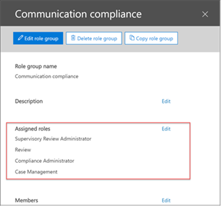

# Configurare la conformità delle comunicazioni in Microsoft 365Configure communication compliance in Microsoft 365

>[!IMPORTANT]
>Questo argomento si applica alla configurazione della conformità di comunicazione in un abbonamento a Microsoft 365.This topic applies to configuring communication compliance in a Microsoft 365 subscription. Se si desidera configurare i criteri di supervisione per una sottoscrizione a Office 365, vedere [Configure supervisioning for office 365](supervision-policies.md).If you want to configure Supervision policies for an Office 365 subscription, see [Configure supervision for Office 365](supervision-policies.md).

Utilizzare i criteri di conformità della comunicazione per acquisire le comunicazioni dei dipendenti per l'esame da revisori interni o esterni.Use communication compliance policies to capture employee communications for examination by internal or external reviewers. Per ulteriori informazioni su come i criteri di conformità della comunicazione consentono di monitorare le comunicazioni nell'organizzazione, vedere [Communication Compliance Policies in Microsoft 365](communication-compliance.md).For more information about how communication compliance policies can help you monitor communications in your organization, see [communication compliance policies in Microsoft 365](communication-compliance.md). Se si desidera esaminare in che modo Contoso ha configurato rapidamente un criterio di conformità della comunicazione per il monitoraggio per la lingua offensiva in Microsoft teams e le comunicazioni di Exchange Online, vedere questo [caso di studio](communication-compliance-case-study.md).If you'd like to review how Contoso quickly configured a communication compliance policy to monitor for offensive language in Microsoft Teams and Exchange Online communications, check out this [case study](communication-compliance-case-study.md).

## Prima di iniziareBefore you begin

Prima di iniziare a utilizzare la conformità alla comunicazione, è necessario confermare la [sottoscrizione Microsoft 365](https://www.microsoft.com/microsoft-365/compare-all-microsoft-365-plans) e i componenti aggiuntivi.Before you get started with communication compliance, you should confirm your [Microsoft 365 subscription](https://www.microsoft.com/microsoft-365/compare-all-microsoft-365-plans) and any add-ons. Per accedere e utilizzare la conformità di comunicazione, è necessario che l'organizzazione disponga di una delle sottoscrizioni o dei componenti aggiuntivi seguenti:To access and use communication compliance, your organization must have one of the following subscriptions or add-ons:

- Sottoscrizione Microsoft 365 E5 (a pagamento o versione di valutazione)Microsoft 365 E5 subscription (paid or trial version)
- Sottoscrizione Microsoft 365 E3 + il componente aggiuntivo Microsoft 365 E5 ComplianceMicrosoft 365 E3 subscription + the Microsoft 365 E5 Compliance add-on
- Sottoscrizione Microsoft 365 E3 + componente aggiuntivo Microsoft 365 E5 Insider Risk ManagementMicrosoft 365 E3 subscription + the Microsoft 365 E5 Insider Risk Management add-on
- Sottoscrizione Microsoft 365 a5 (a pagamento o versione di valutazione)Microsoft 365 A5 subscription (paid or trial version)
- Sottoscrizione Microsoft 365 a3 + componente aggiuntivo Microsoft 365 a5 ComplianceMicrosoft 365 A3 subscription + the Microsoft 365 A5 Compliance add-on
- Sottoscrizione Microsoft 365 a3 + componente aggiuntivo Microsoft 365 a5 Insider Risk ManagementMicrosoft 365 A3 subscription + the Microsoft 365 A5 Insider Risk Management add-on
- Sottoscrizione Microsoft 365 G5 (a pagamento o versione di valutazione)Microsoft 365 G5 subscription (paid or trial version)
- Sottoscrizione Microsoft 365 G5 + componente aggiuntivo Microsoft 365 G5 ComplianceMicrosoft 365 G5 subscription + the Microsoft 365 G5 Compliance add-on
- Microsoft 365 G5 Subscription + Microsoft 365 G5 Insider Risk Management componente aggiuntivoMicrosoft 365 G5 subscription + the Microsoft 365 G5 Insider Risk Management add-on
- Abbonamento a Office 365 Enterprise E5 (a pagamento o versione di valutazione)Office 365 Enterprise E5 subscription (paid or trial version)
- Abbonamento a Office 365 Enterprise E3 + il componente aggiuntivo Office 365 Advanced Compliance (non più disponibile per le nuove sottoscrizioni, vedere note)Office 365 Enterprise E3 subscription + the Office 365 Advanced Compliance add-on (no longer available for new subscriptions, see note)

Gli utenti inclusi nei criteri di conformità della comunicazione devono essere assegnati a una delle licenze sopra riportate.Users included in communication compliance policies must must be assigned one of the licenses above.

>[!IMPORTANT]
>La conformità avanzata di Office 365 non viene più venduta come sottoscrizione autonoma.Office 365 Advanced Compliance is no longer sold as a standalone subscription. Quando le sottoscrizioni correnti scadono, i clienti devono passare a una delle sottoscrizioni precedenti, che contengono le stesse funzionalità di conformità o aggiuntive.When current subscriptions expire, customers should transition to one of the subscriptions above, which contain the same or additional compliance features.

Se non si dispone di un piano Microsoft 365 Enterprise E5 esistente e si desidera tentare la gestione dei rischi Insider, è possibile [aggiungere microsoft 365](https://docs.microsoft.com/office365/admin/try-or-buy-microsoft-365) all'abbonamento a Office 365 esistente oppure [iscriversi a una versione di valutazione](https://www.microsoft.com/microsoft-365/enterprise) di Microsoft 365 Enterprise E5.If you don't have an existing Microsoft 365 Enterprise E5 plan and want to try insider risk management, you can [add Microsoft 365](https://docs.microsoft.com/office365/admin/try-or-buy-microsoft-365) to your existing Office 365 subscription or [sign up for a trial](https://www.microsoft.com/microsoft-365/enterprise) of Microsoft 365 Enterprise E5.

## Passaggio 1 (obbligatorio): abilitare le autorizzazioni per la conformità della comunicazioneStep 1 (required): Enable permissions for communication compliance

>[!Important]
>Per impostazione predefinita, gli amministratori globali non possono accedere alle funzionalità di conformità della comunicazione.By default, Global Administrators do not have access to communication compliance features. I ruoli assegnati a questo passaggio sono necessari prima che vengano accessibili tutte le funzionalità di conformità della comunicazione.The roles assigned in this step are required before any communication compliance features will be accessible.

Per rendere la **conformità di comunicazione** disponibile come opzione di menu in Microsoft 365 Compliance Center, è necessario essere assegnati al ruolo di **amministratore revisione di supervisione** .To make **Communication compliance** available as a menu option in Microsoft 365 compliance center, you must be assigned the **Supervisory Review Administrator** role. È necessario creare un nuovo gruppo di ruoli per i revisori con l' **amministratore revisione di supervisione**, la **gestione dei casi**, l' **amministratore della conformità**e i ruoli di **Revisione** per esaminare e correggere i messaggi con le corrispondenze di criteri.You must create a new role group for reviewers with the **Supervisory Review Administrator**, **Case Management**, **Compliance Administrator**, and **Review** roles to investigate and remediate messages with policy matches.

### Creare un nuovo gruppo di ruoliCreate a new role group

1. Accedere [https://protection.office.com/permissions](https://protection.office.com/permissions) con le credenziali per un account di amministratore nell'organizzazione Microsoft 365.Sign into [https://protection.office.com/permissions](https://protection.office.com/permissions) using credentials for an admin account in your Microsoft 365 organization.

2. Nel centro sicurezza e conformità di Microsoft Office 365 accedere a **autorizzazioni**.In the Microsoft Office 365 security and compliance center, go to **Permissions**. Selezionare il collegamento per visualizzare e gestire i ruoli in Office 365.Select the link to view and manage roles in Office 365.

3. Selezionare **Crea**.Select **Create**.

4. Nel campo **nome** assegnare un nome descrittivo al nuovo gruppo di ruoli.In the **Name** field, give the new role group a friendly name. Scegliere **Avanti**.Select **Next**.

5. Selezionare **Scegli ruoli** e quindi **Aggiungi**.Select **Choose roles** and then select **Add**. Selezionare la casella di controllo per l' **amministratore della revisione di supervisione**, la **gestione dei casi**, l' **amministratore della conformità**e la **Revisione**, quindi selezionare **Aggiungi** e **Chiudi**.Select the checkbox for **Supervisory Review Administrator**, **Case Management**, **Compliance Administrator**, and **Review**, then select **Add** and **Done**. Scegliere **Avanti**.Select **Next**.

    

6. Selezionare **Scegli membri** e quindi **Aggiungi**.Select **Choose members** and then select **Add**. Selezionare la casella di controllo per tutti gli utenti e i gruppi che si desidera creare criteri e gestire i messaggi con le corrispondenze di criteri, quindi fare clic su **Aggiungi** e **Chiudi**.Select the checkbox for all the users and groups you want create policies and manage messages with policy matches, then select **Add** and **Done**. Scegliere **Avanti**.Select **Next**.

7. Selezionare **Crea gruppo di ruoli** per terminare.Select **Create role group** to finish.

Per ulteriori informazioni sui gruppi di ruoli e sulle autorizzazioni, vedere [Permissions in the Compliance Center](../security/office-365-security/protect-against-threats.md).For more information about role groups and permissions, see [Permissions in the Compliance Center](../security/office-365-security/protect-against-threats.md).

## Passaggio 2 (obbligatorio): abilitare il log di controllo di Office 365Step 2 (required): Enable the Office 365 audit log

La conformità alla comunicazione richiede i registri di controllo per visualizzare gli avvisi e tenere presenti le azioni di correzione eseguite dai revisori.Communication compliance requires audit logs to show alerts and track remediation actions taken by reviewers. I registri di controllo sono un riepilogo di tutte le attività associate a un criterio organizzativo definito o in qualsiasi momento di un criterio di conformità comunicazione modifiche.The audit logs are a summary of all activities associated with a defined organizational policy or anytime a communication compliance policy changes.

Per istruzioni dettagliate su come abilitare il controllo, vedere [attivazione o disattivazione della ricerca del registro di controllo di Office 365](turn-audit-log-search-on-or-off.md).For step-by-step instructions to turn on auditing, see [Turn Office 365 audit log search on or off](turn-audit-log-search-on-or-off.md). Dopo aver attivato il controllo, viene visualizzato un messaggio che indica che il registro di controllo viene preparato e che è possibile eseguire una ricerca in un paio d'ore dopo il completamento della preparazione.After you turn on auditing, a message is displayed that says the audit log is being prepared and that you can run a search in a couple of hours after the preparation is complete. È sufficiente eseguire questa operazione una sola volta.You only have to do this action once. Per ulteriori informazioni sull'utilizzo del log di controllo, vedere [Search the audit log](search-the-audit-log-in-security-and-compliance.md).For more information about the using the audit log, see [Search the audit log](search-the-audit-log-in-security-and-compliance.md).

## Passaggio 3 (facoltativo): configurare i gruppi per la conformità della comunicazioneStep 3 (optional): Set up groups for communication compliance

 Quando si crea un criterio di conformità della comunicazione, è possibile definire gli utenti che hanno esaminato le comunicazioni e che eseguono le revisioni.When you create a communication compliance policy, you define who has their communications reviewed and who performs reviews. Nei criteri si utilizzeranno gli indirizzi di posta elettronica per identificare singoli o gruppi di persone.In the policy, you'll use email addresses to identify individuals or groups of people. Per semplificare la configurazione, è possibile creare gruppi per gli utenti che hanno la propria comunicazione riesaminata e i gruppi per gli utenti che esaminano tali comunicazioni.To simplify your setup, you can create groups for people who have their communication reviewed and groups for people who review those communications. Se si utilizzano i gruppi, potrebbero essere necessari diversi.If you're using groups, you may need several. Ad esempio, se si desidera monitorare le comunicazioni tra due gruppi distinti di persone o se si desidera specificare un gruppo che non verrà controllato.For example, if you want to monitor communications between two distinct groups of people or if you want to specify a group that isn't going to be supervised.

Utilizzare il seguente grafico per facilitare la configurazione dei gruppi nell'organizzazione per i criteri di conformità della comunicazione:Use the following chart to help you configure groups in your organization for communication compliance policies:

| **Membro del criterio****Policy Member** | **Gruppi supportati****Supported Groups** | **Gruppi non supportati****Unsupported Groups** |
|:-----|:-----|:-----|
|Utenti controllatiSupervised users   Utenti non controllatiNon-supervised users | Gruppi di distribuzioneDistribution groups   Gruppi di Office 365Office 365 groups | Gruppi di distribuzione dinamiciDynamic distribution groups |
| RevisoriReviewers | NessunoNone | Gruppi di distribuzioneDistribution groups   Gruppi di distribuzione dinamiciDynamic distribution groups   Gruppi di sicurezza abilitati alla posta elettronicaMail-enabled security groups |
  
Quando si seleziona un gruppo di Office 365 per gli utenti controllati, il criterio monitora il contenuto della cassetta postale di Office 365 condivisa e dei canali Microsoft teams associati al gruppo.When you select an Office 365 group for supervised users, the policy monitors the content of the shared Office 365 mailbox and the Microsoft Teams channels associated with the group. Quando si seleziona una lista di distribuzione, il criterio monitora le singole cassette postali degli utenti.When you select a distribution list, the policy monitors individual user mailboxes.

Per ulteriori informazioni sulla configurazione dei gruppi, vedere:For more information about setting up groups, see:

- [Creazione e gestione dei gruppi di distribuzioneCreate and manage distribution groups](https://docs.microsoft.com/Exchange/recipients-in-exchange-online/manage-distribution-groups/manage-distribution-groups)
- [Panoramica dei gruppi di Office 365Overview of Office 365 Groups](https://docs.microsoft.com/office365/admin/create-groups/office-365-groups?view=o365-worldwide)

## Passaggio 4 (obbligatorio): creare un criterio di conformità della comunicazioneStep 4 (required): Create a communication compliance policy
  
>[!Important]
>L'utilizzo di PowerShell per la creazione e la gestione di criteri di conformità della comunicazione non è supportato.Using PowerShell to create and manage communication compliance policies is not supported. Per creare e gestire questi criteri, è necessario utilizzare i controlli di gestione dei criteri nella [soluzione Microsoft 365 Communication Compliance](https://compliance.microsoft.com/supervisoryreview).To create and manage these policies, you must use the policy management controls in the [Microsoft 365 communication compliance solution](https://compliance.microsoft.com/supervisoryreview).

1. Accedere [https://compliance.microsoft.com](https://compliance.microsoft.com) con le credenziali per un account di amministratore nell'organizzazione Microsoft 365.Sign into [https://compliance.microsoft.com](https://compliance.microsoft.com) using credentials for an admin account in your Microsoft 365 organization.

2. Nel centro conformità di Microsoft 365 selezionare **conformità comunicazione**.In the Microsoft 365 compliance center, select **Communication compliance**.
  
3. Selezionare la scheda **criteri** .Select the **Policies** tab.

4. Selezionare **create Policy** per creare e configurare un nuovo criterio da un modello o per creare e configurare un criterio personalizzato.Select **Create policy** to create and configure a new policy from a template or to create and configure a custom policy.

    Se si sceglie un modello di criteri per creare un criterio, sarà necessario:If you choose a policy template to create a policy, you will:

    - Confermare o aggiornare il nome del criterio.Confirm or update the policy name. Non è possibile modificare i nomi dei criteri dopo la creazione del criterio.Policy names cannot be changed once the policy is created.
    - Scegliere gli utenti o i gruppi da controllare, inclusa la scelta degli utenti o dei gruppi che si desidera escludere.Choose the users or groups to supervise, including choosing users or groups you'd like to exclude.
    - Scegliere i revisori per il criterio.Choose the reviewers for the policy. I revisori sono utenti singoli e tutti i revisori devono disporre di cassette postali ospitate in Exchange Online.Reviewers are individual users and all reviewers must have mailboxes hosted on Exchange Online. Revisori aggiunti qui sono i revisori che è possibile scegliere quando si effettua l'escalation di un avviso nel flusso di lavoro di analisi e correzione.Reviewers added here are the reviewers that you can choose from when escalating an alert in the investigation and remediation workflow.
    - Scegliere un campo di condizioni limitate, in genere un tipo di informazioni riservate o un dizionario di parole chiave da applicare al criterio.Choose a limited condition field, usually a sensitive info type or keyword dictionary to apply to the policy.

    Se si sceglie di utilizzare la procedura guidata dei criteri per creare un criterio personalizzato, sarà necessario:If you choose to use the policy wizard to create a custom policy, you will:

    - Assegnare al criterio un nome e una descrizione.Give the policy a name and description. Non è possibile modificare i nomi dei criteri dopo la creazione del criterio.Policy names can't be changed once the policy is created.
    - Scegliere gli utenti o i gruppi da controllare, inclusi tutti gli utenti dell'organizzazione, utenti e gruppi specifici o altri utenti e gruppi che si desidera escludere.Choose the users or groups to supervise, including all users in your organization, specific users and groups, or other users and groups you'd like to exclude.
    - Scegliere i revisori per il criterio.Choose the reviewers for the policy. I revisori sono utenti singoli e tutti i revisori devono disporre di cassette postali ospitate in Exchange Online.Reviewers are individual users and all reviewers must have mailboxes hosted on Exchange Online.
    - Scegliere i canali di comunicazione da analizzare, tra cui Exchange, Microsoft teams o Skype for business.Choose the communication channels to scan, including Exchange, Microsoft Teams, or Skype for Business. Se si è configurato un connettore in Microsoft 365, è inoltre possibile scegliere di eseguire l'analisi delle origini di terze parti.You'll also choose to scan third-party sources if you've configured a connector in Microsoft 365.
    - Scegliere la direzione di comunicazione da monitorare, incluse le comunicazioni in ingresso, in uscita o interne.Choose the communication direction to monitor, including inbound, outbound, or internal communications.
    - Definire le [condizioni](communication-compliance-feature-reference.md#ConditionalSettings)dei criteri di conformità della comunicazione.Define the communication compliance policy [conditions](communication-compliance-feature-reference.md#ConditionalSettings). È possibile scegliere tra l'indirizzo del messaggio, la parola chiave, i tipi di file e le condizioni di corrispondenza delle dimensioni.You can choose from message address, keyword, file types, and size match conditions.
    - Scegliere se si desidera includere tipi di informazioni riservate.Choose if you'd like to include sensitive information types. In questo passaggio è possibile selezionare i tipi di informazioni riservate predefinite e personalizzate.This step is where you can select default and custom sensitive info types. Scegliere tra tipi di informazioni riservate personalizzate esistenti o dizionari di parole chiave personalizzati nella procedura guidata criteri di conformità della comunicazione.Pick from existing custom sensitive information types or custom keyword dictionaries in the communication compliance policy wizard. È possibile creare questi elementi prima di eseguire la procedura guidata, se necessario.You can create these items before running the wizard if needed. È inoltre possibile creare nuovi tipi di informazioni riservate dall'interno della procedura guidata criteri di conformità della comunicazione.You can also create new sensitive information types from within the communication compliance policy wizard.
    - Scegliere se si desidera abilitare il classificatore di lingua offensivo.Choose if you'd like to enable the offensive language classifier. Questo classificatore rileva la lingua inappropriata inviata o ricevuta nel corpo dei messaggi di posta elettronica.This  classifier detects inappropriate language sent or received in the body of email messages.
    - Definire la percentuale di comunicazioni da esaminare.Define the percentage of communications to review.
    - Esaminare le selezioni dei criteri e creare il criterio.Review your policy selections and create the policy.

5. Selezionare **Crea criterio** quando si utilizzano i modelli o **Invia** quando si utilizza la procedura guidata per i criteri personalizzati.Select **Create policy** when using the templates or **Submit** when using the custom policy wizard.

6. La pagina **criteri è stata creata** viene visualizzata con linee guida su quando verranno attivati i criteri e quali comunicazioni verranno acquisite.The **Your policy was created** page is displayed with guidelines on when policy will be activated and which communications will be captured.

## Passaggio 5 (facoltativo): creare modelli di avviso per i dipendentiStep 5 (optional): Create employee notice templates

Se si desidera avere la possibilità di rispondere a un avviso di criteri inviando un avviso di sollecito al dipendente associato, è necessario creare almeno un modello di avviso nell'organizzazione.If you want to have the option of responding to a policy alert by sending a reminder notice to the associated employee, you'll need to create at least one notice template in your organization. I campi del modello di avviso sono modificabili prima di essere inviati come parte del processo di correzione degli avvisi e la creazione di un modello di avviso personalizzato per ogni criterio di conformità della comunicazione è consigliata.The notice template fields are editable before they're sent as part of the alert remediation process, and creating a customized notice template for each communication compliance policy is recommended.

1. Accedere [https://compliance.microsoft.com](https://compliance.microsoft.com) con le credenziali per un account di amministratore nell'organizzazione Microsoft 365.Sign into [https://compliance.microsoft.com](https://compliance.microsoft.com) using credentials for an admin account in your Microsoft 365 organization.

2. Nel centro conformità di Microsoft 365, passare a **conformità comunicazione**.In the Microsoft 365 compliance center, go to **Communication compliance**.

3. Selezionare la scheda **modelli di avviso** e quindi fare clic su **Crea modello di avviso**.Select the **Notice templates** tab and then select **Create notice template**.

4. Nella pagina **modifica modello di avviso** completare i seguenti campi:On the **Modify a notice template** page, complete the following fields:

    - Nome del modello di avviso (obbligatorio)Notice template name (required)
    - Invia da (obbligatorio)Send from (required)
    - CC e Ccn (facoltativo)Cc and Bcc (optional)
    - Subject (obbligatorio)Subject (required)
    - Corpo del messaggio (obbligatorio)Message body (required)

5. Selezionare **Salva** per creare e salvare il modello di avviso.Select **Save** to create and save the notice template.

## Passaggio 6 (facoltativo): testare i criteri di conformità della comunicazioneStep 6 (optional): Test your communication compliance policy

Dopo aver creato un criterio di conformità della comunicazione, è consigliabile testarlo per assicurarsi che le condizioni definite vengano applicate correttamente dal criterio.After you create a communication compliance policy, it's a good idea to test it to make sure that the conditions you defined are being properly enforced by the policy. È inoltre possibile [testare i criteri di prevenzione della perdita di dati (DLP)](create-test-tune-dlp-policy.md) se i criteri di conformità della comunicazione includono tipi di informazioni riservate.You may also want to [test your data loss prevention (DLP) policies](create-test-tune-dlp-policy.md) if your communication compliance policies include sensitive information types. Assicurarsi di fornire i criteri per l'attivazione in modo che le comunicazioni che si desidera testare vengano acquisite.Make sure you give your policies time to activate so that the communications you want to test are captured.

Eseguire la procedura seguente per testare i criteri di conformità della comunicazione:Follow these steps to test your communication compliance policy:

1. Aprire un client di posta elettronica o Microsoft teams mentre è stato eseguito l'accesso come utente controllato definito nel criterio che si desidera sottoporre a test.Open an email client or Microsoft Teams while signed in as a supervised user defined in the policy you want to test.
2. Inviare un messaggio di posta elettronica o Microsoft teams chat che soddisfi i criteri definiti nel criterio di conformità della comunicazione.Send an email or Microsoft Teams chat that meets the criteria you've defined in the communication compliance policy. Questo test può essere una parola chiave, le dimensioni degli allegati, il dominio e così via. Assicurarsi di determinare se le impostazioni condizionali configurate nel criterio sono troppo restrittive o troppo indulgenti.This test can be a keyword, attachment size, domain, etc. Make sure you determine if your configured conditional settings in the policy are too restrictive or too lenient.

    > [!NOTE]
    > Le comunicazioni in tutti i canali di origine possono richiedere fino a 24 ore per il processo completo in un criterio.Communications in all source channels can take up to 24 hours to fully process in a policy.

3. Accedere a Microsoft 365 come un revisore designato nei criteri di conformità della comunicazione.Sign in to Microsoft 365 as a reviewer designated in the communication compliance policy. Passare a > **avvisi** **conformità comunicazione**per visualizzare gli avvisi per i criteri.Navigate to **Communication compliance** > **Alerts** to view the alerts for your policies.

4. Correggere l'avviso utilizzando i controlli di correzione e verificare che l'avviso sia stato risolto correttamente.Remediate the alert using the remediation controls and verify that the alert is properly resolved.
