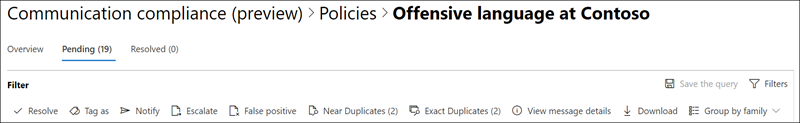

# Esaminare e correggere gli avvisi di conformità della comunicazioneInvestigate and remediate communication compliance alerts

Dopo aver configurato i criteri di conformità della comunicazione, si inizierà a ricevere avvisi nel centro conformità di Microsoft 365 per i problemi dei messaggi che soddisfano le condizioni di criteri.After you've configured your communication compliance policies, you'll start to receive alerts in the Microsoft 365 compliance center for message issues that match your policy conditions. Seguire le istruzioni del flusso di lavoro qui per esaminare e correggere i problemi di avviso.Follow the workflow instructions here to investigate and remediate alert issues.

## Esaminare gli avvisiInvestigate alerts

Il primo passaggio per esaminare i problemi rilevati dai criteri consiste nell'esaminare gli avvisi generati nel centro conformità di Microsoft 365.The first step to investigate issues detected by your policies is to review generated alerts in the Microsoft 365 compliance center. Nel centro conformità sono presenti diverse aree che consentono di esaminare rapidamente gli avvisi, a seconda di come si preferisce visualizzare il raggruppamento degli avvisi:There are several areas in the compliance center to help you to quickly investigate alerts, depending on how you prefer to view alert grouping:

- **Home page Compliance Communication**: quando si accede all' [https://compliance.microsoft.com](https://compliance.microsoft.com) utilizzo delle credenziali per un account di amministratore nell'organizzazione Microsoft 365, selezionare > **Overview** **Compliance Communication**per visualizzare la Home page conformità comunicazione.**Communication compliance home page**: When you sign in to [https://compliance.microsoft.com](https://compliance.microsoft.com) using credentials for an admin account in your Microsoft 365 organization, select **Communication compliance** > **Overview** to display the communication compliance home page. Di seguito vengono visualizzate le informazioni seguenti:Here you'll see:
    - Avvisi che richiedono la revisione elencata dalla gravità elevata a quella bassa.Alerts needing review listed from high to low severity. Selezionare un avviso per avviare la pagina dei dettagli dell'avviso e avviare le azioni di correzione.Select an alert to launch the alert details page and to start remediation actions.
    - Corrispondenze di criteri recenti elencate in base al nome del criterio.Recent policy matches listed by policy name.
    - Elementi risolti elencati in base al nome del criterio.Resolved items listed by policy name.
    - Escalation elencate in base al nome del criterio.Escalations listed by policy name.
    - Utenti con la maggior parte delle corrispondenze di criteri, elencate tra la maggior parte e il minor numero di corrispondenze.Users with the most policy matches, listed from the most to the least number of matches.
- **Scheda avvisi**: passare a \*\*\*\* > **avvisi** di conformità della comunicazione per visualizzare gli avvisi raggruppati in base al criterio di conformità della comunicazione corrispondente.**Alerts tab**: Navigate to **Communication compliance** > **Alerts** to display alerts grouped by matched communication compliance policy. Questa visualizzazione consente di visualizzare rapidamente quali criteri di conformità della comunicazione stanno generando la maggior parte degli avvisi ordinati per gravità.This view allows you to quickly see which communication compliance policies are generating the most alerts ordered by severity.  Per avviare le azioni di correzione, espandere un criterio per selezionare un avviso specifico e avviare la pagina dei dettagli dell'avviso.To start remediation actions, expand a policy to select a specific alert and to launch the alert details page.
- **Scheda criteri**: passare ai \*\*\*\* > **criteri** di conformità della comunicazione per visualizzare i criteri di conformità della comunicazione configurati per l'organizzazione Microsoft 365.**Policies tab**: Navigate to **Communication compliance** > **Policies** to display communication compliance policies configured for your Microsoft 365 organization. Ogni criterio elencato include il numero di avvisi che devono essere esaminati.Each policy listed includes the count of alerts that need review. Se si seleziona un criterio, vengono visualizzati tutti gli avvisi in sospeso per le corrispondenze al criterio, selezionare un avviso specifico per avviare la pagina dei dettagli del criterio e avviare le azioni di correzione.Selecting a policy displays all the pending alerts for matches to the policy, select a specific alert to launch the policy details page and to start remediation actions.

### Utilizzo di filtriUsing filters

Il passaggio successivo consiste nell'ordinare i messaggi in modo che sia più facile esaminare gli avvisi.The next step is to sort the messages so that it's easier for you to investigate alerts. La conformità alla comunicazione supporta il filtro a più livelli per diversi campi dei messaggi che consentono di analizzare e rivedere rapidamente i messaggi con le corrispondenze di criteri.Communication compliance supports multi-level filtering for several message fields to help you quickly investigate and review messages with policy matches. Il filtro è disponibile per gli elementi in sospeso e risolti per ogni criterio configurato.Filtering is available for pending and resolved items for each configured policy. È possibile configurare le query di filtro per un criterio o configurare e salvare query di filtro personalizzate e predefinite per l'utilizzo in ogni criterio specifico.You can configure filter queries for a policy or configure and save custom and default filter queries for use in each specific policy. Dopo aver configurato i campi per un filtro, verranno visualizzati i campi del filtro visualizzato nella parte superiore della coda dei messaggi di avviso che è possibile configurare per i valori di filtro specifici.After configuring fields for a filter, you'll see the filter fields displayed on the top of the alert message queue that you can configure for specific filter values.

Per un elenco completo dei filtri e dettagli sul campo, vedere [Filters](communication-compliance-feature-reference.md#filters) in the feature reference topic.For a complete list of filters and field details, see [Filters](communication-compliance-feature-reference.md#filters) in the feature reference topic.

#### Per configurare un filtroTo configure a filter

1. Accedere [https://compliance.microsoft.com](https://compliance.microsoft.com) con le credenziali per un account di amministratore nell'organizzazione Microsoft 365.Sign into [https://compliance.microsoft.com](https://compliance.microsoft.com) using credentials for an admin account in your Microsoft 365 organization.

2. Nel centro conformità di Microsoft 365, passare a **conformità comunicazione**.In the Microsoft 365 compliance center, go to **Communication compliance**.

3. Selezionare la scheda **criteri** e quindi selezionare un criterio per l'analisi, fare doppio clic per aprire la pagina **criteri** .Select the **Policies** tab and then select a policy for investigation, double-click to open the **Policy** page.

4. Nella pagina **criterio** selezionare la scheda **in sospeso** o **risolta** per visualizzare gli elementi per il filtro.On the **Policy** page, select either the **Pending** or **Resolved** tab to display the items for filtering.

5. Selezionare il controllo **filtri** per aprire la pagina dei dettagli sui **filtri** .Select the **Filters** control to open the **Filters** details page.

6. Selezionare una o più caselle di controllo per abilitare i filtri per questi avvisi.Select one or more checkboxes to enable filters for these alerts. È possibile scegliere tra numerosi filtri, tra cui *Data*, *mittente*, *oggetto/titolo*, *classificatori*e altro ancora.You can choose from numerous filters, including *Date*, *Sender*, *Subject/Title*, *Classifiers*, and more.

7. Se si desidera salvare il filtro selezionato come filtro predefinito, fare clic su **Salva con nome predefinito**.If you'd like to save the filter selected as the default filter, select **Save as default**. Se si desidera utilizzare questo filtro come filtro salvato, fare clic su **fine**.If you want to use this filter as a saved filter, select **Done**.

8. Se si desidera salvare i filtri selezionati come query di filtro, fare clic su **Salva il controllo query** dopo aver configurato almeno un valore di filtro.If you'd like to save the selected filters as a filter query, select **Save the query** control after you've configured at least one filter value. Immettere un nome per la query del filtro e selezionare **Salva**.Enter a name for the filter query and select **Save**. Questo filtro è disponibile per essere utilizzato solo per questo criterio ed è elencato nella sezione **query di filtro salvate** della pagina dei dettagli sui **filtri** .This filter is available to use for only this policy and is listed in the **Saved filter queries** section of the **Filters** details page.

    

### Utilizzo dell'analisi duplicata vicina ed esattaUsing near and exact duplicate analysis

I criteri di conformità della comunicazione analizzano e pregruppo i duplicati del messaggio vicino ed esatto senza ulteriori passaggi di configurazione.Communication compliance policies automatically scan and pre-group near and exact message duplicates without any additional configuration steps. Questa visualizzazione consente di correggere rapidamente i messaggi simili uno per uno o come gruppo, riducendo il carico di indagine dei messaggi per i revisori.This view allows you to quickly remediate similar messages one-by-one or as a group, reducing the message investigation burden for reviewers. Quando vengono rilevati duplicati, **i duplicati e/** o i controlli **duplicati esatti** vengono visualizzati nella barra degli strumenti azione di correzione.As duplicates are detected, the **Near Duplicates** and/or the **Exact Duplicates** controls are displayed in the remediation action toolbar.

#### Per correggere i duplicatiTo remediate duplicates

1. Accedere [https://compliance.microsoft.com](https://compliance.microsoft.com) con le credenziali per un account di amministratore nell'organizzazione Microsoft 365.Sign into [https://compliance.microsoft.com](https://compliance.microsoft.com) using credentials for an admin account in your Microsoft 365 organization.

2. Nel centro conformità di Microsoft 365, passare a **conformità comunicazione**.In the Microsoft 365 compliance center, go to **Communication compliance**.

3. Selezionare la scheda **criteri** e quindi selezionare un criterio per l'analisi, fare doppio clic per aprire la pagina **criteri** .Select the **Policies** tab and then select a policy for investigation, double-click to open the **Policy** page.

4. Nella pagina **criterio** selezionare la scheda **in sospeso** o **risolta** per visualizzare i messaggi duplicati.On the **Policy** page, select either the **Pending** or **Resolved** tab to display duplicate messages.

5. Selezionare i controlli **quasi** duplicati o **duplicati esatti** per aprire la pagina dei dettagli duplicati.Select the **Near Duplicates** or **Exact Duplicates** controls to open the duplicates details page.

6. Selezionare uno o più messaggi per i controlli azione di correzione per questi messaggi.Select one or more messages to remediation action controls for these messages.

7. Selezionare **Risolvi**, **notifica**, **Inoltra**o **Scarica** per applicare l'azione ai messaggi duplicati selezionati. eletta come filtro predefinito.Select **Resolve**, **Notify**, **Escalate**, or **Download** to apply the action to the selected duplicate messages.elected as the default filter.

8. Selezionare **Chiudi** dopo aver completato le operazioni di correzione dei messaggi.Select **Close** after completing the remediation actions on the messages.

    

## Correggere gli avvisiRemediate alerts

Indipendentemente dal punto in cui si inizia a esaminare gli avvisi o il filtro configurato, il passaggio successivo consiste nell'intervenire per correggere l'avviso.No matter where you start to review alerts or the filtering you configure, the next step is to take action to remediate the alert. Avviare la correzione degli avvisi utilizzando il flusso di lavoro seguente nelle pagine dei **criteri** o degli **avvisi** :Start your alert remediation using the following workflow on the **Policy** or **Alerts** pages:

1. **Esaminare le nozioni di base sui messaggi**: a volte risulta evidente dall'origine o dall'oggetto che un messaggio può essere immediatamente rimediato.**Examine the message basics**: Sometimes it's obvious from the source or subject that a message can be immediately remediated. Potrebbe essere che il messaggio sia falso o erroneamente corrispondente a un criterio e che sia necessario risolverlo come falsi positivi.It may be that the message is spurious or incorrectly matched to a policy and it should be resolved as a false positive. Selezionare il controllo **false positive** per risolvere immediatamente l'avviso e rimuoverlo dalla coda degli avvisi in sospeso.Select the **False Positive** control to immediately resolve the alert and remove from the pending alert queue. Dalle informazioni di origine o mittente, potrebbe essere già possibile sapere in che modo il messaggio deve essere instradato o gestito in queste circostanze.From the source or sender information, you may already know how the message should be routed or handled in these circumstances. Considerare l'utilizzo del **tag come** o l' **escalation** dei controlli per assegnare un tag ai messaggi applicabili o per inviare messaggi a un revisore designato.Consider using the **Tag as** or **Escalate** controls to assign a tag to applicable messages or to send messages to a designated reviewer.

    

2. **Esaminare i dettagli del messaggio**: dopo aver esaminato le nozioni di base del messaggio, è necessario aprire un messaggio per esaminare i dettagli e determinare ulteriori azioni di correzione.**Examine the message details**: After reviewing the message basics, it's time to open a message to examine the details and to determine further remediation actions. Selezionare un messaggio per visualizzare le informazioni complete sull'intestazione e sul corpo del messaggio.Select a message to view the complete message header and body information. Sono disponibili diverse visualizzazioni per facilitare la scelta del corso di azione appropriato:Several different views are available to help you decide the proper course of action:

    - **Visualizzazione origine**: questa visualizzazione è la visualizzazione standard dei messaggi comunemente visualizzata nella maggior parte delle piattaforme di messaggistica basate sul Web.**Source view**: This view is the standard message view commonly seen in most web-based messaging platforms. Le informazioni di intestazione sono formattate nello stile normale e il corpo del messaggio supporta i file grafici incorporati e il testo con wrapping di Word.The header information is formatted in the normal style and the message body supports imbedded graphic files and word-wrapped text.
    - **Visualizzazione testo**: la visualizzazione del testo Visualizza una visualizzazione di solo testo numerato in linea del messaggio e include l'evidenziazione delle parole chiave per i termini corrispondenti nei criteri di conformità della comunicazione associati.**Text view**: Text view displays a line-numbered text-only view of the message and includes keyword highlighting for terms matched in the associated communication compliance policy. L'evidenziazione delle parole chiave può essere utile per l'analisi rapida dei messaggi lunghi per l'area di interesse.Keyword highlighting can help you quickly scan long messages for the area of interest. I file incorporati non vengono visualizzati e la numerazione delle righe questa visualizzazione è utile per fare riferimento ai dettagli pertinenti tra più revisori.Embedded files aren't displayed and the line numbering this view is helpful for referencing pertinent details among multiple reviewers.
    - **Visualizzazione annotazioni**: questa visualizzazione consente ai revisori di aggiungere annotazioni direttamente sul messaggio salvato nella visualizzazione del messaggio.**Annotate view**: This view allows reviewers to add annotations directly on the message that are saved to the view of the message.
    - **Cronologia utenti**: visualizzazione cronologia utenti Visualizza tutti gli altri avvisi generati da tutti i criteri di conformità della comunicazione per l'utente che invia il messaggio.**User history**: User history view displays all other alerts generated by any communication compliance policy for the user sending the message.

    

3. **Decidere in merito a un'azione di correzione**: dopo aver esaminato i dettagli del messaggio per l'avviso, è possibile scegliere diverse azioni correttive:**Decide on a remediation action**: Now that you've reviewed the details of the message for the alert, you can choose several remediation actions:

    - **Risoluzione**: se si seleziona il controllo **Risolvi** , il messaggio viene rimosso immediatamente dalla coda degli **avvisi in sospeso** e non è possibile eseguire altre operazioni sul messaggio.**Resolve**: Selecting the **Resolve** control immediately removes the message from the **Pending alerts** queue and no further action can be taken on the message. Selezionando **Risolvi**, l'avviso è stato sostanzialmente chiuso senza ulteriore classificazione e non può essere riaperto per ulteriori azioni.By selecting **Resolve**, you've essentially closed the alert without further classification and it can't be reopened for further actions. Tutti i messaggi risolti vengono visualizzati nella scheda **risolti** .All resolved messages are displayed in the **Resolved** tab.
    - **False positive**: è sempre possibile risolvere un messaggio come falso positivo in qualsiasi momento durante il flusso di lavoro per la revisione dei messaggi.**False Positive**: You can always resolve a message as a false positive at any point during the message review workflow. Il messaggio non può essere riaperto e tutti i messaggi falsi positivi sono visualizzati nella scheda **risolti** .The message cannot be reopened and all false positive messages are displayed in the **Resolved** tab.
    - **Tag As**: contrassegnare il messaggio come *conforme*, *non conforme*o come *discutibile* in relazione ai criteri e agli standard per l'organizzazione.**Tag as**: Tag the message as *compliant*, *non-compliant*, or as *questionable* as it relates to the policies and standards for your organization. L'aggiunta di tag e commenti di tagging può aiutare a filtrare gli avvisi per i criteri per le escalation o come parte di altri processi di revisione interni.Adding tags and tagging comments can help you micro-filter policy alerts for escalations or as part of other internal review processes. Dopo aver completato il tagging, è anche possibile scegliere di risolvere il messaggio per spostarlo fuori dalla coda di revisione in sospeso.After tagging is complete, you can also choose to resolve the message to move it out of the pending review queue.
    - **Notify**: è possibile utilizzare il controllo **Notify** per assegnare un modello di avviso personalizzato all'avviso e per inviare un avviso all'utente.**Notify**: You can use the **Notify** control to assign a custom notice template to the alert and to send a warning notice to the user. Scegliere il modello di avviso appropriato e quindi fare clic su **Invia** alla posta elettronica un promemoria per il dipendente che ha inviato il messaggio e per risolvere il problema.Choose the appropriate notice template, and select **Send** to email a reminder to the employee that sent the message and to resolve the issue.
    - **Escalation**: se si utilizza il controllo **escalation** , è possibile scegliere chi altro nell'organizzazione deve esaminare il messaggio.**Escalate**: Using the **Escalate** control, you can choose who else in your organization should review the message. Scegliere da un elenco di revisori configurati per inviare una notifica tramite posta elettronica che richiede ulteriori riesami dell'avviso del messaggio.Choose from a list of configured reviewers to send an email notification requesting additional review of the message alert. Il revisore selezionato può utilizzare un collegamento nella notifica di posta elettronica per passare direttamente agli elementi che sono stati escalati per la revisione.The selected reviewer can use a link in the email notification to go directly to items escalated to them for review.
    - **Creare un caso**: utilizzando il controllo **Create a case** , è possibile creare un nuovo [caso di eDiscovery avanzato](overview-ediscovery-20.md) per singoli o più messaggi.**Create a case**: Using the **Create a case** control, you can create a new [Advanced eDiscovery case](overview-ediscovery-20.md) for single or multiple messages. Verranno forniti un nome e note per il nuovo caso e l'utente che ha inviato il messaggio che corrisponde al criterio viene automaticamente assegnato come custode del caso.You'll provide a name and notes for the new case, and user who sent the message matching the policy is automatically assigned as the case custodian. Non sono necessarie ulteriori autorizzazioni per gestire il caso.You don't need any additional permissions to manage the case. La creazione di un caso non risolve o crea un nuovo tag per il messaggio.Creating a case does not resolve or create a new tag for the message.

4. **Determinare se i dettagli dei messaggi devono essere archiviati all'esterno della conformità di comunicazione**: i dettagli del messaggio possono essere esportati o scaricati se è necessario archiviarli in una soluzione di archiviazione separata.**Determine if message details should be archived outside of communication compliance**: Message details can be exported or downloaded if you need to archive the messages in a separate storage solution. Se si seleziona il controllo **download** , vengono aggiunti automaticamente i messaggi selezionati a un. File ZIP che può essere salvato nello spazio di archiviazione all'esterno di Microsoft 365.Selecting the **Download** control automatically adds selected messages to a .ZIP file that can be saved to storage outside of Microsoft 365.
