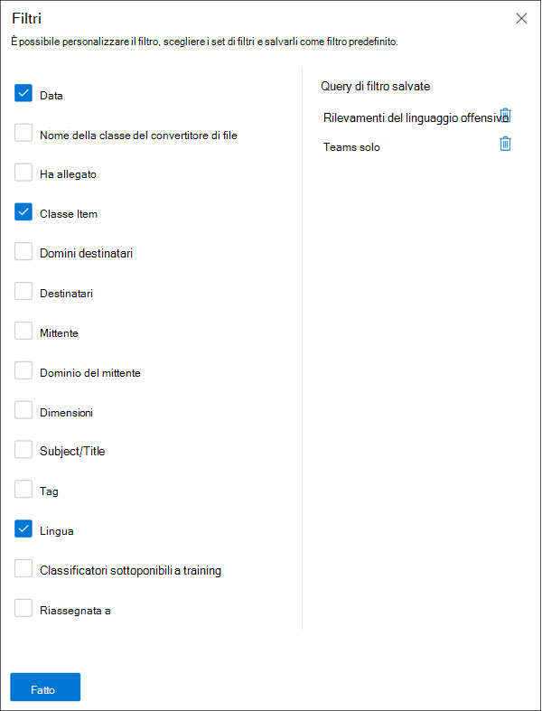

# Esaminare e correggere gli avvisi di conformità delle comunicazioni

Dopo aver configurato i criteri di conformità delle comunicazioni, si inizierà a ricevere avvisi nel Centro conformità Microsoft 365 per i problemi relativi ai messaggi che soddisfano le condizioni dei criteri. Seguire le istruzioni del flusso di lavoro qui per analizzare e risolvere i problemi di avviso.

## Esaminare gli avvisi

Il primo passaggio per analizzare i problemi rilevati dai criteri consiste nell'esaminare gli avvisi di conformità delle comunicazioni nel Centro conformità Microsoft 365. Nell'area della soluzione di conformità delle comunicazioni sono disponibili diverse aree che consentono di analizzare rapidamente gli avvisi, a seconda di come si preferisce visualizzare il raggruppamento degli avvisi:

- **Pagina dei criteri** di conformità delle comunicazioni: quando si accede utilizzando le credenziali per un account amministratore nell'organizzazione [https://compliance.microsoft.com](https://compliance.microsoft.com) di Microsoft 365, selezionare Conformità comunicazioni per visualizzare la pagina Dei criteri di conformità **delle** comunicazioni.  In questa pagina vengono visualizzati i criteri di conformità delle comunicazioni configurati per l'organizzazione di Microsoft 365 e i collegamenti ai modelli di criteri consigliati. Ogni criterio elencato include il numero di avvisi che devono essere esaminati, il numero di elementi inoltrati e risolti, lo stato del criterio e la data e l'ora dell'ultima analisi dei criteri. Se si seleziona un criterio, vengono visualizzati tutti gli avvisi in sospeso per le corrispondenze al criterio, selezionare un avviso specifico per avviare la pagina dei dettagli del criterio e avviare le azioni correttive.
- **Alerts:** navigate to **Communication compliance**  >  **Alerts** to display the last 30 days of alerts grouped by policy matches. Questa visualizzazione consente di vedere rapidamente quali criteri di conformità delle comunicazioni generano il maggior numero di avvisi ordinati in base alla gravità. Per avviare le azioni di correzione, selezionare il criterio associato all'avviso per avviare la **pagina dei dettagli del** criterio. Dalla  pagina Dei dettagli dei criteri è possibile  esaminare un riepilogo delle attività nella  pagina Panoramica, esaminare e intervenire sui messaggi di avviso nella pagina In sospeso oppure esaminare la cronologia degli avvisi chiusi nella pagina Risolto. 
- **Report:** passare a **Report di conformità**  >  **delle** comunicazioni per visualizzare i widget dei report di conformità delle comunicazioni. Ogni widget offre una panoramica delle attività e degli stati di conformità delle comunicazioni, incluso l'accesso a informazioni più approfondite sulle corrispondenze dei criteri e sulle azioni di correzione.

### Utilizzo dei filtri

Il passaggio successivo consiste nell'ordinare i messaggi in modo che sia più semplice analizzare gli avvisi. Dalla pagina **Dei dettagli dei criteri,** la conformità delle comunicazioni supporta il filtro multi-livello per diversi campi dei messaggi, per consentire di analizzare ed esaminare rapidamente i messaggi con corrispondenze ai criteri. Il filtro è disponibile per gli elementi in sospeso e risolti per ogni criterio configurato. È possibile configurare le query di filtro per un criterio oppure configurare e salvare query di filtro personalizzate e predefinite da utilizzare in ogni criterio specifico. Dopo aver configurato i campi per un filtro, i campi di filtro verranno visualizzati nella parte superiore della coda dei messaggi di avviso che è possibile configurare per valori di filtro specifici.

Per un elenco completo dei filtri e dei dettagli dei campi, vedere [Filtri](communication-compliance-feature-reference.md#filters) nell'articolo di riferimento sulle funzionalità.

#### Per configurare un filtro

1. Accedere con [https://compliance.microsoft.com](https://compliance.microsoft.com) le credenziali di un account amministratore nell'organizzazione di Microsoft 365.

2. Nel Centro conformità Microsoft 365 passare a **Conformità delle comunicazioni.**

3. Seleziona la **scheda Criteri** e quindi seleziona un criterio per l'analisi, fai doppio clic per aprire la **pagina** Criteri.

4. Nella pagina **Criteri selezionare** la scheda In sospeso **o** **Risolto** per visualizzare gli elementi da filtrare.

5. Selezionare il **controllo Filtri** per aprire la pagina **dei dettagli** dei filtri.

6. Selezionare una o più caselle di controllo per abilitare i filtri per questi avvisi. È possibile scegliere tra numerosi filtri, tra cui *Data,* Mittente, *Oggetto/Titolo,* *Classificatori* e altro ancora.

7. Se si desidera salvare il filtro selezionato come predefinito, selezionare **Salva come predefinito.** Se si desidera utilizzare questo filtro come filtro salvato, selezionare **Fine.**

8. Se si desidera salvare i filtri selezionati come query di filtro, selezionare Salva il controllo **query** dopo aver configurato almeno un valore di filtro. Immettere un nome per la query di filtro e selezionare **Salva.** Questo filtro è disponibile per l'utilizzo solo per questo criterio ed è elencato nella sezione **Query di filtro** salvate della pagina Dei **dettagli** dei filtri.

    

### Utilizzo di un'analisi duplicata vicina ed esatta

I criteri di conformità delle comunicazioni analizzano e pre-raggruppano automaticamente i duplicati dei messaggi vicini ed esatti senza ulteriori passaggi di configurazione. Questa visualizzazione consente di agire rapidamente su messaggi simili uno alla volta o come gruppo, riducendo il carico di analisi dei messaggi per i revisori. Quando vengono rilevati duplicati, i controlli Near **Duplicates** e/o **Exact Duplicates** vengono visualizzati nella barra degli strumenti delle azioni di correzione. Questa visualizzazione non è disponibile se non vengono trovati duplicati vicini o esatti.

#### Per correggere i duplicati

1. Accedere con [https://compliance.microsoft.com](https://compliance.microsoft.com) le credenziali di un account amministratore nell'organizzazione di Microsoft 365.

2. Nel Centro conformità Microsoft 365 passare a **Conformità delle comunicazioni.**

3. Seleziona la **scheda Criteri** e quindi seleziona un criterio per l'analisi, fai doppio clic per aprire la **pagina** Criteri.

4. Nella pagina **Criteri selezionare** la scheda In sospeso **o** **Risolto** per visualizzare i messaggi duplicati.

5. Selezionare i **controlli Near Duplicates** o **Exact Duplicates** per aprire la pagina dei dettagli dei duplicati.

6. Selezionare uno o più messaggi per i controlli delle azioni di correzione per questi messaggi.

7. Selezionare **Risolvi,** **Notifica,** **Escalation** o **Scarica** per applicare l'azione ai messaggi duplicati selezionati come filtro predefinito.

8. Selezionare **Chiudi** dopo aver completato le azioni di correzione sui messaggi.

    

## Correggere gli avvisi

Indipendentemente da dove si inizia a esaminare gli avvisi o il filtro configurato, il passaggio successivo consiste nell'eseguire un'azione per correggere l'avviso. Avviare la correzione degli avvisi usando il flusso di lavoro seguente nelle **pagine Criteri** **o** Avvisi.

### Passaggio 1: Esaminare le nozioni di base dei messaggi

 A volte dall'origine o dall'oggetto risulta evidente che un messaggio può essere immediatamente corretti. È possibile che il messaggio sia errato o che corrisponda erroneamente a un criterio e debba essere risolto come falso positivo. Selezionare il **controllo Falsi positivi** per risolvere immediatamente l'avviso e rimuoverlo dalla coda di avviso in sospeso. Dalle informazioni sull'origine o sul mittente, si potrebbe già sapere come il messaggio deve essere instradato o gestito in queste circostanze. Prendere in considerazione **l'uso dei** controlli Tag as o Escalate per **assegnare** un tag ai messaggi applicabili o per inviare messaggi a un revisore designato.

### Passaggio 2: Esaminare i dettagli del messaggio

Dopo aver esaminato le nozioni di base del messaggio, è il momento di aprire un messaggio per esaminare i dettagli e determinare ulteriori azioni correttive. Selezionare un messaggio per visualizzare l'intestazione completa del messaggio e le informazioni sul corpo. Sono disponibili diverse visualizzazioni che consentono di decidere il corso corretto dell'azione:

- **Visualizzazione origine:** questa è la visualizzazione dei messaggi standard comunemente visualizzata nella maggior parte delle piattaforme di messaggistica basate sul Web. Le informazioni dell'intestazione sono formattate con lo stile normale e il corpo del messaggio supporta i file grafici e il testo con ritorno a capo automatico.
- **Visualizzazione testo:** la visualizzazione testo visualizza una visualizzazione di solo testo con numerazione delle righe del messaggio e include l'evidenziazione delle parole chiave nei messaggi e negli allegati per i termini corrispondenti nel criterio di conformità della comunicazione associato. L'evidenziazione delle parole chiave consente di analizzare rapidamente i messaggi e gli allegati lunghi per individuare l'area di interesse. In alcuni casi, il testo evidenziato può essere presente solo negli allegati dei messaggi che corrispondono alle condizioni dei criteri. I file incorporati non vengono visualizzati e la numerazione delle righe di questa visualizzazione è utile per fare riferimento a dettagli pertinenti tra più revisori.
- **Visualizzazione note:** questa visualizzazione consente ai revisori di aggiungere annotazioni direttamente al messaggio salvato nella visualizzazione del messaggio.
- **Cronologia utenti:** nella visualizzazione cronologia utenti vengono visualizzati tutti gli altri avvisi generati da qualsiasi criterio di conformità delle comunicazioni per l'utente che invia il messaggio.
- **Visualizzazione dettagli messaggio**: visualizzazione avanzata dei metadati dei messaggi e delle informazioni di configurazione.
- **Notifica pattern detected:** molte azioni di molesto e bullismo nel tempo e implicano la ripetizione di istanze dello stesso comportamento da parte di un utente. La *notifica rilevata* dal modello viene visualizzata nei dettagli dell'avviso e fa attenzione all'avviso. Il rilevamento dei modelli è in base ai criteri e valuta il comportamento degli ultimi 30 giorni quando almeno due messaggi vengono inviati allo stesso destinatario da un mittente. Gli investigatori e i revisori possono usare questa notifica per identificare il comportamento ripetuto per valutare l'avviso in base alle esigenze.
- **Mostra visualizzazione** Traduci: questa visualizzazione converte automaticamente  il testo del messaggio di avviso nella lingua configurata nell'impostazione Lingua visualizzata nell'abbonamento a Microsoft 365 per ogni revisore. La visualizzazione Traduci consente di ampliare il supporto investigativo per le organizzazioni con utenti multilingue ed elimina la necessità di servizi di traduzione aggiuntivi al di fuori del processo di revisione della conformità delle comunicazioni. Con i servizi di Traduzione Microsoft, la visualizzazione Traduci può essere attivata e disattivata in base alle esigenze e supporta un'ampia gamma di lingue. Per un elenco completo delle lingue supportate, vedere [Lingue di Microsoft Translator.](https://www.microsoft.com/translator/business/languages/) Le lingue elencate *nell'elenco delle lingue* del traduttore sono supportate nella visualizzazione Traduci.

    

### Passaggio 3: decidere un'azione correttiva

Dopo aver esaminato i dettagli del messaggio per l'avviso, è possibile scegliere diverse azioni di correzione:

- **Soluzione:** selezionando il **controllo Risolvi,**  il messaggio viene rimosso immediatamente dalla coda degli avvisi in sospeso e non è possibile eseguire ulteriori azioni sul messaggio. Selezionando **Risolvi,** l'avviso è stato essenzialmente chiuso senza ulteriori classificazioni e non può essere riaperto per ulteriori azioni. Tutti i messaggi risolti vengono visualizzati nella **scheda Risolto.**
- **Falso positivo:** è sempre possibile risolvere un messaggio come falso positivo in qualsiasi momento durante il flusso di lavoro di revisione dei messaggi. Il falso positivo indica che l'avviso non è stato attivato o che l'avviso è stato generato in modo errato dal processo di avviso. Il messaggio non può essere riaperto e tutti i messaggi falsi positivi vengono visualizzati nella **scheda** Risolto.
- **Power Automate (anteprima):** usare un flusso power automate per automatizzare le attività di processo per un messaggio di avviso. Per impostazione predefinita,  la conformità delle comunicazioni include il responsabile delle notifiche quando un utente dispone di un modello di flusso di avviso di conformità delle comunicazioni che i revisori possono utilizzare per automatizzare il processo di notifica per gli utenti con avvisi messaggio. Per ulteriori informazioni sulla creazione e la gestione dei flussi di Power Automate nella conformità delle comunicazioni, vedere l'articolo di riferimento sulle funzionalità [di conformità delle](communication-compliance-feature-reference.md#power-automate-flows) comunicazioni.
- **Contrassegna come**: contrassegna il messaggio come  *conforme,* *non* conforme o come discutibile in relazione ai criteri e agli standard per l'organizzazione. L'aggiunta di tag e commenti di tagging consente di visualizzare avvisi per i criteri di micro-filtro per escalation o come parte di altri processi di revisione interna. Una volta completato il tagging, è anche possibile scegliere di risolvere il messaggio per spostarlo fuori dalla coda di revisione in sospeso.
- **Notifica:** è possibile utilizzare il **controllo Notifica** per assegnare un modello di avviso personalizzato all'avviso e inviare un avviso all'utente. Scegliere il modello di avviso appropriato configurato  **nell'area** Impostazioni conformità comunicazioni e selezionare Invia a un promemoria tramite posta elettronica all'utente che ha inviato il messaggio e per risolvere il problema.
- **Escalation:** usando il **controllo Escalation,** è possibile scegliere chi altro nell'organizzazione deve esaminare il messaggio. Scegliere da un elenco di revisori configurati nei criteri di conformità delle comunicazioni per inviare una notifica tramite posta elettronica che richiede una revisione aggiuntiva dell'avviso del messaggio. Il revisore selezionato può usare un collegamento nella notifica di posta elettronica per passare direttamente agli elementi inoltrati a loro per la revisione.
- **Escalation per l'indagine:** utilizzando l'escalation per il controllo **delle** indagini, è possibile creare un nuovo caso [di Advanced eDiscovery](overview-ediscovery-20.md) per uno o più messaggi. Verranno forniti un nome e note per il nuovo caso e l'utente che ha inviato il messaggio corrispondente al criterio viene assegnato automaticamente come responsabile del caso. Non sono necessarie autorizzazioni aggiuntive per gestire il caso. La creazione di un caso non risolve o crea un nuovo tag per il messaggio. È possibile selezionare un totale di 100 messaggi durante la creazione di un caso di Advanced eDiscovery durante il processo di correzione. I messaggi in tutti i canali di comunicazione monitorati dalla conformità delle comunicazioni sono supportati. Ad esempio, è possibile selezionare 50 chat di Microsoft Teams, 25 messaggi di posta elettronica di Exchange Online e 25 messaggi di Yammer quando si apre un nuovo caso di Advanced eDiscovery per un utente.
- **Migliorare la classificazione (anteprima):** gli avvisi creati dalle corrispondenze del tipo di classificatore potrebbero avere bisogno di feedback per ridurre al minimo i falsi positivi nell'organizzazione. Usare il **controllo migliora classificazione** per fornire feedback su se la classificazione di conformità della comunicazione è valida o per suggerire altri classificatori sotto forma di training per questo tipo di corrispondenza. È possibile confermare che i  classificatori siano corrispondenti o non corrispondenti oppure suggerire altri classificatori formabili da associare *a* questo tipo di attività di avviso in futuro.

    1. Selezionare un messaggio dall'elenco degli avvisi.
    2. Scegliere i puntini di sospensione e selezionare **Migliora classificazione.**
    3. Nel riquadro **Feedback dettagliato classificatore,** se l'elemento è un vero positivo, scegliere **Corrispondenza.**  Se l'elemento è stato erroneamente incluso nella categoria come falso positivo, scegliere **Non corrisponde a.**
    4. Se è presente un altro classificatore più appropriato per l'elemento, sceglierlo nell'elenco **Suggerisci altri classificatori trainabili.** Questo feedback attiva l'altro classificatore per valutare l'elemento.

    > [!TIP]
    > Puoi inviare commenti e suggerimenti su più elementi contemporaneamente scegliendoli tutti e quindi scegliendo Fornisci **feedback dettagliato** nella barra dei comandi.

    5. Choose **Send feedback** to send your evaluation of the **Match** and Not **a match** classifications and suggest other trainable classifiers. Quando hai fornito 30 istanze di feedback a un classificatore, viene automaticamente riqualificata. Il completamento della riqualificazione può richiedere da 1 a 4 ore. I classificatori possono essere addestrati solo due volte al giorno.

    > [!IMPORTANT]
    > Queste informazioni passano al classificatore nel tenant, **non tornano a Microsoft.**

    Per ulteriori informazioni sulla riqualificazione del classificatore per la conformità delle comunicazioni, vedere l'articolo come riesificare un classificatore [nell'articolo sulla conformità delle](classifier-how-to-retrain-comms-compliance.md) comunicazioni.

    

- Rimuovere il messaggio **in Teams:** usando il controllo Rimuovi messaggio nel controllo **di Teams,** è possibile bloccare i messaggi inappropriati e i contenuti identificati negli avvisi dai canali di Microsoft Teams e dalle chat di gruppo e 1:1. I messaggi e il contenuto rimossi vengono sostituiti con un suggerimento per i criteri che spiega che è bloccato e il criterio che si applica alla rimozione dalla visualizzazione. Ai destinatari viene fornito un collegamento nel suggerimento per i criteri per saperne di più sui criteri applicabili e sul processo di revisione. Il mittente riceve un suggerimento per i criteri per il messaggio e il contenuto bloccati, ma può esaminare i dettagli del messaggio e del contenuto bloccati per il contesto relativo alla rimozione.

    

### Passaggio 4: Determinare se i dettagli del messaggio devono essere archiviati al di fuori della conformità delle comunicazioni

I dettagli dei messaggi possono essere esportati o scaricati se è necessario archiviare i messaggi in una soluzione di archiviazione separata. Se si seleziona **il controllo Download,** i messaggi selezionati vengono aggiunti automaticamente a un oggetto . File ZIP che può essere salvato in un archivio esterno a Microsoft 365.
