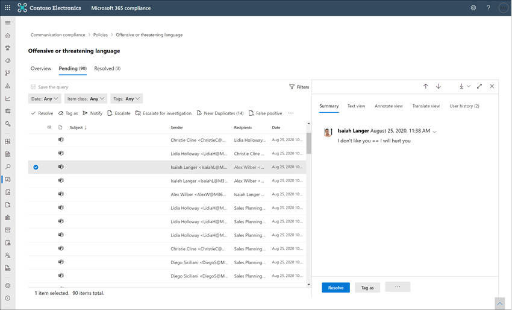

# Esaminare e correggere gli avvisi di conformità delle comunicazioni

Dopo aver configurato i criteri di conformità delle comunicazioni, inizierai a ricevere avvisi nel Centro conformità Microsoft 365 per i problemi relativi ai messaggi che soddisfano le condizioni dei criteri. Seguire le istruzioni del flusso di lavoro qui per analizzare e correggere i problemi di avviso.

## Esaminare gli avvisi

Il primo passaggio per analizzare i problemi rilevati dai criteri consiste nell'esaminare gli avvisi di conformità delle comunicazioni nel Centro Microsoft 365 conformità. Nell'area della soluzione di conformità delle comunicazioni sono disponibili diverse aree che consentono di analizzare rapidamente gli avvisi, a seconda di come si preferisce visualizzare il raggruppamento degli avvisi:

- **Pagina Criteri di** conformità della comunicazione : quando si accede utilizzando le credenziali per un account amministratore nell'organizzazione di Microsoft 365, selezionare Conformità comunicazione per visualizzare la pagina Criteri di conformità [https://compliance.microsoft.com](https://compliance.microsoft.com) **delle** comunicazioni.  In questa pagina vengono visualizzati i criteri di conformità delle comunicazioni configurati Microsoft 365'organizzazione e i collegamenti ai modelli di criteri consigliati. Ogni criterio elencato include il numero di avvisi che devono essere esaminati, il numero di elementi inoltrati e risolti, lo stato del criterio e la data e l'ora dell'ultima analisi dei criteri. Selezionando un criterio vengono visualizzati tutti gli avvisi in sospeso per le corrispondenze al criterio; selezionare un avviso specifico per avviare la pagina dei dettagli del criterio e per avviare azioni correttive.
- **Avvisi**: passare a **Avvisi di conformità** delle comunicazioni per visualizzare gli ultimi 30 giorni di avvisi  >   raggruppati in base alle corrispondenze dei criteri. Questa visualizzazione consente di vedere rapidamente quali criteri di conformità delle comunicazioni generano la maggior parte degli avvisi ordinati in base al livello di gravità. Per avviare le azioni di correzione, selezionare il criterio associato all'avviso per avviare la **pagina Dettagli** criterio. Dalla pagina Dettagli **criterio** è possibile esaminare un  riepilogo delle attività nella pagina Panoramica, esaminare e agire sui messaggi di avviso nella pagina In sospeso oppure esaminare la cronologia degli avvisi chiusi nella pagina **Risolto.** 
- **Report**: accedere a **Report di conformità**  >  **delle** comunicazioni per visualizzare i widget dei report di conformità delle comunicazioni. Ogni widget fornisce una panoramica delle attività e degli stati di conformità delle comunicazioni, incluso l'accesso a informazioni più approfondite sulle corrispondenze dei criteri e sulle azioni di correzione.

### Uso dei filtri

Il passaggio successivo consiste nell'ordinare i messaggi in modo da semplificare l'analisi degli avvisi. Dalla pagina **Dettagli criterio,** la conformità delle comunicazioni supporta il filtro a più livelli per diversi campi dei messaggi per facilitare l'analisi e l'analisi rapida dei messaggi con corrispondenze dei criteri. Il filtro è disponibile per gli elementi in sospeso e risolti per ogni criterio configurato. È possibile configurare le query di filtro per un criterio oppure configurare e salvare query di filtro personalizzate e predefinite da usare in ogni criterio specifico. Dopo aver configurato i campi per un filtro, i campi del filtro verranno visualizzati nella parte superiore della coda dei messaggi di avviso, che è possibile configurare per specifici valori di filtro.

Per un elenco completo dei filtri e dei dettagli dei campi, vedere [Filtri](communication-compliance-feature-reference.md#filters) nell'articolo di riferimento sulle funzionalità.

#### Per configurare un filtro

1. Accedere usando [https://compliance.microsoft.com](https://compliance.microsoft.com) le credenziali per un account amministratore nell'Microsoft 365 aziendale.

2. Nel Centro Microsoft 365 conformità passare a **Conformità delle comunicazioni**.

3. Seleziona la **scheda Criteri** e quindi seleziona un criterio per l'analisi, fai doppio clic per aprire la **pagina** Criteri.

4. Nella pagina **Criteri** selezionare la scheda In sospeso **o** **Risolto** per visualizzare gli elementi da filtrare.

5. Selezionare il **controllo Filtri** per aprire la pagina **Dei dettagli** filtri.

6. Selezionare una o più caselle di controllo per abilitare i filtri per questi avvisi. È possibile scegliere tra numerosi filtri, tra cui *Data,* *Mittente,* *Oggetto/Titolo,* *Classificatori,* *Lingua* e altro ancora.

7. Se si desidera salvare il filtro selezionato come filtro predefinito, selezionare **Salva come predefinito.** Se si desidera utilizzare questo filtro come filtro salvato, selezionare **Fatto.**

8. Se si desidera salvare i filtri selezionati come query di filtro, selezionare Salva il controllo **query** dopo aver configurato almeno un valore di filtro. Immettere un nome per la query di filtro e selezionare **Salva**. Questo filtro è disponibile per l'utilizzo solo per questo criterio ed è elencato nella sezione **Query di filtro** salvate della pagina Dei **dettagli** filtri.

    

### Uso dell'analisi di documenti simili e duplicati identici

I criteri di conformità delle comunicazioni analizzano e pre-raggruppano automaticamente documenti simili e duplicati identici senza ulteriori passaggi di configurazione. Questa visualizzazione consente di agire rapidamente su messaggi simili uno per uno o come gruppo, riducendo il carico di analisi dei messaggi per i revisori. Quando vengono rilevati i duplicati, nella barra degli strumenti per le azioni correttive vengono visualizzati i controlli **Documenti simili** e/o **Duplicati identici**. Questa visualizzazione non è disponibile se non vengono trovati duplicati prossimi o esatti.

#### Per correggere i duplicati

1. Accedere usando [https://compliance.microsoft.com](https://compliance.microsoft.com) le credenziali per un account amministratore nell'Microsoft 365 aziendale.

2. Nel Centro Microsoft 365 conformità passare a **Conformità delle comunicazioni**.

3. Seleziona la **scheda Criteri** e quindi seleziona un criterio per l'analisi, fai doppio clic per aprire la **pagina** Criteri.

4. Nella pagina **Criteri** selezionare la scheda In sospeso **o** **Risolto** per visualizzare i messaggi duplicati.

5. Selezionare i **controlli Quasi duplicati** o Duplicati **esatti** per aprire la pagina dei dettagli dei duplicati.

6. Selezionare uno o più messaggi per correggere i controlli delle azioni per questi messaggi.

7. Selezionare **Risolvi,** **Notifica,** **Escalation** o **Scarica** per applicare l'azione ai messaggi duplicati selezionati come filtro predefinito.

8. Selezionare **Chiudi** dopo aver completato le azioni di correzione sui messaggi.

    

## Correggere gli avvisi

Indipendentemente da dove si inizia a esaminare gli avvisi o i filtri configurati, il passaggio successivo consiste nell'eseguire le azioni necessarie per correggere l'avviso. Avviare la correzione degli avvisi usando il flusso di lavoro seguente **nelle pagine Criteri** **o** Avvisi.

### Passaggio 1: Esaminare le nozioni di base dei messaggi

 A volte dall'origine o dall'oggetto risulta evidente che un messaggio può essere immediatamente corretti. È possibile che il messaggio sia falso o non corrisponda correttamente a un criterio e che debba essere risolto come falso positivo. Selezionare il controllo **Falso positivo** per risolvere immediatamente l'avviso e rimuoverlo dalla coda degli avvisi in sospeso. Dalle informazioni sull'origine o sul mittente, si potrebbe già sapere come deve essere instradato o gestito il messaggio in questi casi. Valutare l'utilizzo dei controlli **Contrassegna come** o **Riassegna** per contrassegnare i messaggi applicabili o per inoltrare i messaggi a un revisore designato.

### Passaggio 2: Esaminare i dettagli del messaggio

Dopo aver esaminato le nozioni di base del messaggio, è il momento di aprire un messaggio per esaminare i dettagli e determinare ulteriori azioni di correzione. Selezionare un messaggio per visualizzare le informazioni complete sul corpo e sull'intestazione del messaggio. Sono disponibili diverse visualizzazioni per decidere la procedura appropriata da attuare:

- **Visualizzazione origine**: questa è la visualizzazione dei messaggi standard comunemente usata nella maggior parte delle piattaforme di messaggistica basate sul Web. Le informazioni dell'intestazione sono formattate nello stile normale e il corpo del messaggio supporta i file grafici imbedded e il testo con ritorno a capo automatico. Se il riconoscimento ottico dei caratteri [(OCR)](communication-compliance-feature-reference.md#optical-character-recognition-ocr) è abilitato per il criterio, le immagini contenenti testo stampato o scritto a mano che corrispondono al criterio condizionale vengono visualizzate come elemento figlio per il messaggio associato in questa visualizzazione.
- **Visualizzazione testo**: la visualizzazione testo visualizza una visualizzazione solo testo con numeri di riga del messaggio e include l'evidenziazione delle parole chiave nei messaggi e negli allegati per i termini del tipo di informazioni riservate o le parole chiave corrispondenti nel criterio di conformità della comunicazione associato. L'evidenziazione delle parole chiave consente di analizzare rapidamente i messaggi e gli allegati lunghi per l'area di interesse. In alcuni casi, il testo evidenziato può essere presente solo negli allegati per i messaggi che corrispondono alle condizioni dei criteri. L'evidenziazione delle parole chiave non è supportata per i termini identificati dai classificatori incorporati assegnati a un criterio. I file incorporati non vengono visualizzati e la numerazione delle righe di questa visualizzazione è utile per fare riferimento a dettagli pertinenti tra più revisori.
- **Visualizzazione annotazione**: questa visualizzazione consente di aggiungere annotazioni direttamente nel messaggio, che vengono salvate nella visualizzazione del messaggio. Se [l'OCR](communication-compliance-feature-reference.md#optical-character-recognition-ocr) è abilitato per il criterio, le immagini contenenti testo stampato o scritto a mano che corrispondono al criterio condizionale vengono visualizzate come elemento figlio per il messaggio associato in questa visualizzazione e possono essere annotate.
- **Visualizzazione conversazione (anteprima):** disponibile per i messaggi di chat di Microsoft Teams, questa visualizzazione visualizza fino a cinque messaggi prima e dopo un messaggio di avviso per consentire ai revisori di visualizzare l'attività nel contesto di conversazione. Questo contesto consente ai revisori di valutare rapidamente i messaggi e prendere decisioni più informate sulla risoluzione dei messaggi. Vengono visualizzate le aggiunte di messaggi in tempo reale alle conversazioni, incluse tutte le immagini in linea, le emoji e gli adesivi disponibili in Teams. L'immagine o i file di testo allegati ai messaggi non vengono visualizzati. Le notifiche vengono visualizzate automaticamente per i messaggi che sono stati modificati o per i messaggi che sono stati eliminati dalla finestra di conversazione. Quando un messaggio viene risolto, i messaggi conversazionali associati non vengono conservati con il messaggio risolto. I messaggi di conversazione sono disponibili fino a 60 giorni dopo l'identificazione del messaggio di avviso.
- **Cronologia utenti**: questa visualizzazione mostra tutti gli altri avvisi generati dai criteri di conformità delle comunicazioni per l'utente che invia il messaggio.
- **Notifica rilevata** dal modello: molte azioni di molesto e bullismo nel tempo comportano la ripetizione di istanze dello stesso comportamento da parte di un utente. La *notifica rilevata* dal modello viene visualizzata nei dettagli dell'avviso e solleva l'attenzione sull'avviso. Il rilevamento dei modelli è basato su criteri e valuta il comportamento negli ultimi 30 giorni quando almeno due messaggi vengono inviati allo stesso destinatario da un mittente. Gli investigatori e i revisori possono utilizzare questa notifica per identificare il comportamento ripetuto per valutare l'avviso nel modo appropriato.
- **Mostra visualizzazione Traduci**: questa visualizzazione converte automaticamente il testo del messaggio di avviso nella lingua configurata nell'impostazione Lingua visualizzata nella sottoscrizione Microsoft 365 per ogni revisore.  La visualizzazione Traduci consente di ampliare il supporto investigativo per le organizzazioni con utenti multilingue ed elimina la necessità di servizi di traduzione aggiuntivi al di fuori del processo di revisione della conformità delle comunicazioni. Utilizzando i servizi Di traduzione Microsoft, la visualizzazione Traduci può essere attivata e disattivata in base alle esigenze e supporta un'ampia gamma di lingue. Per un elenco completo delle lingue supportate, vedere [Microsoft Translator Lingue](https://www.microsoft.com/translator/business/languages/). Le lingue elencate *nell'Translator lingua sono* supportate nella visualizzazione Traduci.

    

### Passaggio 3: Decidere un'azione di correzione

Dopo aver esaminato i dettagli del messaggio per l'avviso, è possibile scegliere diverse azioni di correzione:

- **Risolvi**: selezionando il **controllo Risolvi**  il messaggio viene rimosso immediatamente dalla coda degli avvisi in sospeso e non è possibile eseguire ulteriori operazioni sul messaggio. Selezionando **Risolvi,** l'avviso è stato essenzialmente chiuso senza ulteriori classificazioni e non è possibile riaprirlo per ulteriori azioni. Tutti i messaggi risolti vengono visualizzati nella **scheda Risolto.**
- **False Positive**: è sempre possibile risolvere un messaggio come falso positivo in qualsiasi momento durante il flusso di lavoro di revisione dei messaggi. Il falso positivo indica che l'avviso non è utilizzabile o che l'avviso è stato generato in modo errato dal processo di avviso. Il messaggio non può essere riaperto e tutti i messaggi falsi positivi vengono visualizzati nella **scheda Risolto.**
- **Power Automate (anteprima):** utilizzare un flusso Power Automate per automatizzare le attività di elaborazione per un messaggio di avviso. Per impostazione predefinita,  la conformità delle comunicazioni include il responsabile delle notifiche quando un utente dispone di un modello di flusso di avviso di conformità della comunicazione che i revisori possono utilizzare per automatizzare il processo di notifica per gli utenti con avvisi di messaggio. Per ulteriori informazioni sulla creazione e sulla gestione dei Power Automate di comunicazione, vedere l'articolo di riferimento sulle funzionalità di conformità [delle](communication-compliance-feature-reference.md#power-automate-flows) comunicazioni.
- **Tag as**: Contrassegna il messaggio come  *conforme,* *non* conforme o come discutibile in relazione ai criteri e agli standard per l'organizzazione. L'aggiunta di tag e commenti di tagging consente di visualizzare avvisi di criteri di micro-filtro per escalation o come parte di altri processi di revisione interni. Al termine del tagging, è anche possibile scegliere di risolvere il messaggio per spostarlo fuori dalla coda di revisione in sospeso.
- **Notifica:** è possibile utilizzare il **controllo Notify** per assegnare un modello di avviso personalizzato all'avviso e per inviare un avviso all'utente. Scegliere il modello di avviso appropriato configurato  **nell'area** Impostazioni di conformità della comunicazione e selezionare Invia a un promemoria tramite posta elettronica all'utente che ha inviato il messaggio e per risolvere il problema.
- **Escalation:** utilizzando il **controllo Escalation,** è possibile scegliere gli altri utenti dell'organizzazione che devono esaminare il messaggio. Scegliere da un elenco di revisori configurati nei criteri di conformità delle comunicazioni per inviare una notifica tramite posta elettronica che richiede un'ulteriore revisione dell'avviso del messaggio. Il revisore selezionato può usare un collegamento nella notifica tramite posta elettronica per passare direttamente agli elementi inoltrati loro per la revisione.
- **Escalation per l'indagine**: utilizzando **il** controllo Escalation per l'indagine, è possibile creare un nuovo Advanced eDiscovery [caso](overview-ediscovery-20.md) per uno o più messaggi. Verranno forniti un nome e note per il nuovo caso e l'utente che ha inviato il messaggio corrispondente al criterio viene assegnato automaticamente come responsabile del caso. Non sono necessarie autorizzazioni aggiuntive per gestire il caso. La creazione di un caso non risolve o crea un nuovo tag per il messaggio. È possibile selezionare un totale di 100 messaggi quando si crea un caso Advanced eDiscovery durante il processo di correzione. I messaggi in tutti i canali di comunicazione monitorati dalla conformità alle comunicazioni sono supportati. Ad esempio, è possibile selezionare 50 Microsoft Teams chat, 25 messaggi di posta elettronica Exchange Online e 25 messaggi Yammer quando si apre un nuovo caso Advanced eDiscovery per un utente.
- **Rimuovi messaggio in Teams**: utilizzando il controllo Rimuovi messaggio **in Teams,** è possibile bloccare i messaggi inappropriati e il contenuto identificato negli avvisi dai canali di Microsoft Teams e dalle chat 1:1 e di gruppo. I messaggi e il contenuto rimossi vengono sostituiti con un suggerimento per i criteri che spiega che è bloccato e il criterio che si applica alla rimozione dalla visualizzazione. Ai destinatari viene fornito un collegamento nel suggerimento per i criteri per ulteriori informazioni sui criteri applicabili e sul processo di revisione. Il mittente riceve un suggerimento per i criteri per il messaggio e il contenuto bloccati, ma può esaminare i dettagli del messaggio e del contenuto bloccati per il contesto relativo alla rimozione.

    

### Passaggio 4: Determinare se i dettagli del messaggio devono essere archiviati al di fuori della conformità delle comunicazioni

I dettagli dei messaggi possono essere esportati o scaricati se è necessario archiviare i messaggi in una soluzione di archiviazione separata. Selezionando il controllo **Scarica**, i messaggi selezionati vengono automaticamente aggiunti a un file .ZIP che è possibile salvare in un archivio al di fuori di Microsoft 365.
