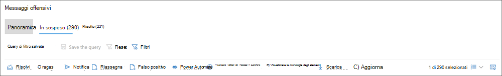

# Esaminare e correggere gli avvisi di conformità delle comunicazioniInvestigate and remediate communication compliance alerts

Dopo aver configurato i criteri di conformità delle comunicazioni, si inizierà a ricevere avvisi nel Centro conformità Microsoft 365 per i problemi relativi ai messaggi che soddisfano le condizioni dei criteri.After you've configured your communication compliance policies, you'll start to receive alerts in the Microsoft 365 compliance center for message issues that match your policy conditions. Seguire le istruzioni del flusso di lavoro qui per analizzare e risolvere i problemi di avviso.Follow the workflow instructions here to investigate and remediate alert issues.

## Esaminare gli avvisiInvestigate alerts

Il primo passaggio per analizzare i problemi rilevati dai criteri consiste nell'esaminare gli avvisi di conformità delle comunicazioni nel Centro conformità Microsoft 365.The first step to investigate issues detected by your policies is to review communication compliance alerts in the Microsoft 365 compliance center. Nell'area della soluzione di conformità delle comunicazioni sono disponibili diverse aree che consentono di analizzare rapidamente gli avvisi, a seconda di come si preferisce visualizzare il raggruppamento degli avvisi:There are several areas in the communication compliance solution area to help you to quickly investigate alerts, depending on how you prefer to view alert grouping:

- **Pagina dei criteri** di conformità delle comunicazioni: quando si accede utilizzando le credenziali per un account amministratore nell'organizzazione [https://compliance.microsoft.com](https://compliance.microsoft.com) di Microsoft 365, selezionare Conformità comunicazioni per visualizzare la pagina Dei criteri di conformità **delle** comunicazioni. **Communication compliance policy page**: When you sign in to [https://compliance.microsoft.com](https://compliance.microsoft.com) using credentials for an admin account in your Microsoft 365 organization, select **Communication compliance** to display the communication compliance **Policy** page. In questa pagina vengono visualizzati i criteri di conformità delle comunicazioni configurati per l'organizzazione di Microsoft 365 e i collegamenti ai modelli di criteri consigliati.This page displays communication compliance policies configured for your Microsoft 365 organization and links to recommended policy templates. Ogni criterio elencato include il numero di avvisi che devono essere esaminati, il numero di elementi inoltrati e risolti, lo stato del criterio e la data e l'ora dell'ultima analisi dei criteri.Each policy listed includes the count of alerts that need review, the number of escalated and resolved items, status of the policy, and the date and time of the last policy scan. Se si seleziona un criterio, vengono visualizzati tutti gli avvisi in sospeso per le corrispondenze al criterio, selezionare un avviso specifico per avviare la pagina dei dettagli del criterio e avviare le azioni correttive.Selecting a policy displays all the pending alerts for matches to the policy, select a specific alert to launch the policy details page and to start remediation actions.
- **Alerts:** navigate to **Communication compliance**  >  **Alerts** to display the last 30 days of alerts grouped by policy matches.**Alerts**: Navigate to **Communication compliance** > **Alerts** to display the last 30 days of alerts grouped by policy matches. Questa visualizzazione consente di vedere rapidamente quali criteri di conformità delle comunicazioni generano il maggior numero di avvisi ordinati in base alla gravità.This view allows you to quickly see which communication compliance policies are generating the most alerts ordered by severity. Per avviare le azioni di correzione, selezionare il criterio associato all'avviso per avviare la **pagina dei dettagli del** criterio.To start remediation actions, select the policy associated with the alert to launch the **Policy details** page. Dalla  pagina Dei dettagli dei criteri è possibile  esaminare un riepilogo delle attività nella  pagina Panoramica, esaminare e intervenire sui messaggi di avviso nella pagina In sospeso oppure esaminare la cronologia degli avvisi chiusi nella pagina Risolto. From the **Policy details** page, you can review a summary of the activities on the **Overview** page, review and act on alert messages on the **Pending** page, or review the history of closed alerts on the **Resolved** page.
- **Report:** passare a **Report di conformità**  >  **delle** comunicazioni per visualizzare i widget dei report di conformità delle comunicazioni.**Reports**: Navigate to **Communication compliance** > **Reports** to display communication compliance report widgets. Ogni widget offre una panoramica delle attività e degli stati di conformità delle comunicazioni, incluso l'accesso a informazioni più approfondite sulle corrispondenze dei criteri e sulle azioni di correzione.Each widget provides an overview of communication compliance activities and statuses, including access to deeper insights about policy matches and remediation actions.

### Utilizzo dei filtriUsing filters

Il passaggio successivo consiste nell'ordinare i messaggi in modo che sia più facile analizzare gli avvisi.The next step is to sort the messages so that it's easier for you to investigate alerts. Dalla pagina **Dei dettagli dei criteri,** la conformità delle comunicazioni supporta il filtro a più livelli per diversi campi dei messaggi per facilitare l'analisi e l'analisi rapida dei messaggi con corrispondenze dei criteri.From the **Policy details** page, communication compliance supports multi-level filtering for several message fields to help you quickly investigate and review messages with policy matches. Il filtro è disponibile per gli elementi in sospeso e risolti per ogni criterio configurato.Filtering is available for pending and resolved items for each configured policy. È possibile configurare le query di filtro per un criterio oppure configurare e salvare query di filtro personalizzate e predefinite da utilizzare in ogni criterio specifico.You can configure filter queries for a policy or configure and save custom and default filter queries for use in each specific policy. Dopo aver configurato i campi per un filtro, i campi di filtro verranno visualizzati nella parte superiore della coda dei messaggi di avviso che è possibile configurare per valori di filtro specifici.After configuring fields for a filter, you'll see the filter fields displayed on the top of the alert message queue that you can configure for specific filter values.

Per un elenco completo dei filtri e dei dettagli dei campi, vedere [Filtri](communication-compliance-feature-reference.md#filters) nell'articolo di riferimento sulle funzionalità.For a complete list of filters and field details, see [Filters](communication-compliance-feature-reference.md#filters) in the feature reference article.

#### Per configurare un filtroTo configure a filter

1. Accedere con [https://compliance.microsoft.com](https://compliance.microsoft.com) le credenziali di un account amministratore nell'organizzazione di Microsoft 365.Sign into [https://compliance.microsoft.com](https://compliance.microsoft.com) using credentials for an admin account in your Microsoft 365 organization.

2. Nel Centro conformità Microsoft 365 passare a **Conformità delle comunicazioni.**In the Microsoft 365 compliance center, go to **Communication compliance**.

3. Seleziona la **scheda Criteri** e quindi seleziona un criterio per l'analisi, fai doppio clic per aprire la **pagina** Criteri.Select the **Policies** tab and then select a policy for investigation, double-click to open the **Policy** page.

4. Nella pagina **Criteri selezionare** la scheda In sospeso **o** **Risolto** per visualizzare gli elementi da filtrare.On the **Policy** page, select either the **Pending** or **Resolved** tab to display the items for filtering.

5. Selezionare il **controllo Filtri** per aprire la pagina **dei dettagli** dei filtri.Select the **Filters** control to open the **Filters** details page.

6. Selezionare una o più caselle di controllo per abilitare i filtri per questi avvisi.Select one or more checkboxes to enable filters for these alerts. È possibile scegliere tra numerosi filtri, tra cui *Data,* Mittente, *Oggetto/Titolo,* *Classificatori* e altro ancora.You can choose from numerous filters, including *Date*, *Sender*, *Subject/Title*, *Classifiers*, and more.

7. Se si desidera salvare il filtro selezionato come filtro predefinito, selezionare **Salva come predefinito.**If you'd like to save the filter selected as the default filter, select **Save as default**. Se si desidera utilizzare questo filtro come filtro salvato, selezionare **Fine.**If you want to use this filter as a saved filter, select **Done**.

8. Se si desidera salvare i filtri selezionati come query di filtro, selezionare Salva il controllo **query** dopo aver configurato almeno un valore di filtro.If you'd like to save the selected filters as a filter query, select **Save the query** control after you've configured at least one filter value. Immettere un nome per la query di filtro e selezionare **Salva.**Enter a name for the filter query and select **Save**. Questo filtro è disponibile per l'utilizzo solo per questo criterio ed è elencato nella sezione **Query di filtro** salvate della pagina Dei **dettagli** dei filtri.This filter is available to use for only this policy and is listed in the **Saved filter queries** section of the **Filters** details page.

    

### Utilizzo di un'analisi duplicata vicina ed esattaUsing near and exact duplicate analysis

I criteri di conformità delle comunicazioni analizzano e pre-raggruppano automaticamente i duplicati dei messaggi vicini ed esatti senza ulteriori passaggi di configurazione.Communication compliance policies automatically scan and pre-group near and exact message duplicates without any additional configuration steps. Questa visualizzazione consente di agire rapidamente su messaggi simili uno alla volta o come gruppo, riducendo il carico di analisi dei messaggi per i revisori.This view allows you to quickly act on similar messages one-by-one or as a group, reducing the message investigation burden for reviewers. Quando vengono rilevati duplicati, i controlli Near **Duplicates** e/o **Exact Duplicates** vengono visualizzati nella barra degli strumenti delle azioni di correzione.As duplicates are detected, the **Near Duplicates** and/or the **Exact Duplicates** controls are displayed in the remediation action toolbar. Questa visualizzazione non è disponibile se non vengono trovati duplicati vicini o esatti.This view isn't available if near or exact duplicates aren't found.

#### Per correggere i duplicatiTo remediate duplicates

1. Accedere con [https://compliance.microsoft.com](https://compliance.microsoft.com) le credenziali di un account amministratore nell'organizzazione di Microsoft 365.Sign into [https://compliance.microsoft.com](https://compliance.microsoft.com) using credentials for an admin account in your Microsoft 365 organization.

2. Nel Centro conformità Microsoft 365 passare a **Conformità delle comunicazioni.**In the Microsoft 365 compliance center, go to **Communication compliance**.

3. Seleziona la **scheda Criteri** e quindi seleziona un criterio per l'analisi, fai doppio clic per aprire la **pagina** Criteri.Select the **Policies** tab and then select a policy for investigation, double-click to open the **Policy** page.

4. Nella pagina **Criteri** selezionare la scheda In sospeso **o** **Risolto** per visualizzare i messaggi duplicati.On the **Policy** page, select either the **Pending** or **Resolved** tab to display duplicate messages.

5. Selezionare i **controlli Near Duplicates** o **Exact Duplicates** per aprire la pagina dei dettagli dei duplicati.Select the **Near Duplicates** or **Exact Duplicates** controls to open the duplicates details page.

6. Selezionare uno o più messaggi per i controlli delle azioni di correzione per questi messaggi.Select one or more messages to remediation action controls for these messages.

7. Selezionare **Risolvi,** **Notifica,** **Escalation** o **Scarica** per applicare l'azione ai messaggi duplicati selezionati come filtro predefinito.Select **Resolve**, **Notify**, **Escalate**, or **Download** to apply the action to the selected duplicate messages as the default filter.

8. Selezionare **Chiudi** dopo aver completato le azioni di correzione sui messaggi.Select **Close** after completing the remediation actions on the messages.

    

## Correggere gli avvisiRemediate alerts

Indipendentemente da dove si inizia a esaminare gli avvisi o il filtro configurato, il passaggio successivo consiste nell'eseguire un'azione per correggere l'avviso.No matter where you start to review alerts or the filtering you configure, the next step is to take action to remediate the alert. Avviare la correzione degli avvisi usando il flusso di lavoro seguente nelle **pagine Criteri** **o** Avvisi.Start your alert remediation using the following workflow on the **Policy** or **Alerts** pages.

### Passaggio 1: Esaminare le nozioni di base dei messaggiStep 1: Examine the message basics

 A volte dall'origine o dall'oggetto risulta evidente che un messaggio può essere immediatamente corretti.Sometimes it's obvious from the source or subject that a message can be immediately remediated. È possibile che il messaggio sia errato o che corrisponda erroneamente a un criterio e debba essere risolto come falso positivo.It may be that the message is spurious or incorrectly matched to a policy and it should be resolved as a false positive. Selezionare il **controllo Falsi positivi** per risolvere immediatamente l'avviso e rimuoverlo dalla coda di avviso in sospeso.Select the **False Positive** control to immediately resolve the alert and remove from the pending alert queue. Dalle informazioni sull'origine o sul mittente, si potrebbe già sapere come il messaggio deve essere instradato o gestito in queste circostanze.From the source or sender information, you may already know how the message should be routed or handled in these circumstances. Prendere in considerazione **l'uso dei** controlli Tag as o Escalate per **assegnare** un tag ai messaggi applicabili o per inviare messaggi a un revisore designato.Consider using the **Tag as** or **Escalate** controls to assign a tag to applicable messages or to send messages to a designated reviewer.

### Passaggio 2: Esaminare i dettagli del messaggioStep 2: Examine the message details

Dopo aver esaminato le nozioni di base del messaggio, è il momento di aprire un messaggio per esaminare i dettagli e determinare ulteriori azioni correttive.After reviewing the message basics, it's time to open a message to examine the details and to determine further remediation actions. Selezionare un messaggio per visualizzare l'intestazione completa del messaggio e le informazioni sul corpo.Select a message to view the complete message header and body information. Sono disponibili diverse visualizzazioni che consentono di decidere il corso corretto dell'azione:Several different views are available to help you decide the proper course of action:

- **Visualizzazione origine:** questa è la visualizzazione standard dei messaggi comunemente visualizzata nella maggior parte delle piattaforme di messaggistica basate sul Web.**Source view**: This view is the standard message view commonly seen in most web-based messaging platforms. Le informazioni dell'intestazione sono formattate con lo stile normale e il corpo del messaggio supporta i file grafici e il testo con ritorno a capo automatico.The header information is formatted in the normal style and the message body supports imbedded graphic files and word-wrapped text. Se il riconoscimento ottico dei caratteri [(OCR)](communication-compliance-feature-reference.md#optical-character-recognition-ocr-preview) è abilitato per il criterio, le immagini contenenti testo stampato o scritto a mano che corrispondono al criterio condizionale vengono visualizzate come elemento figlio per il messaggio associato in questa visualizzazione.If [optical character recognition (OCR)](communication-compliance-feature-reference.md#optical-character-recognition-ocr-preview) is enabled for the policy, images containing printed or handwritten text that match policy conditional are viewed as a child item for the associated message in this view.
- **Visualizzazione testo:** la visualizzazione testo visualizza una visualizzazione solo testo numerata a riga del messaggio e include l'evidenziazione delle parole chiave nei messaggi e negli allegati per i termini corrispondenti nel criterio di conformità della comunicazione associato.**Text view**: Text view displays a line-numbered text-only view of the message and includes keyword highlighting in messages and attachments for terms matched in the associated communication compliance policy. L'evidenziazione delle parole chiave consente di analizzare rapidamente i messaggi e gli allegati lunghi per individuare l'area di interesse.Keyword highlighting can help you quickly scan long messages and attachments for the area of interest. In alcuni casi, il testo evidenziato può essere presente solo negli allegati dei messaggi che corrispondono alle condizioni dei criteri.In some cases, highlighted text may be only in attachments for messages matching policy conditions. I file incorporati non vengono visualizzati e la numerazione delle righe di questa visualizzazione è utile per fare riferimento a dettagli pertinenti tra più revisori.Embedded files aren't displayed and the line numbering this view is helpful for referencing pertinent details among multiple reviewers.
- **Visualizzazione note:** questa visualizzazione consente ai revisori di aggiungere annotazioni direttamente al messaggio salvato nella visualizzazione del messaggio.**Annotate view**: This view allows reviewers to add annotations directly on the message that are saved to the view of the message. Se la funzione [di](communication-compliance-feature-reference.md#optical-character-recognition-ocr-preview) riconoscimento vocale automatico è abilitata per il criterio, le immagini contenenti testo stampato o scritto a mano che corrispondono al criterio condizionale vengono visualizzate come elemento figlio per il messaggio associato in questa visualizzazione e possono essere annotate.If [OCR is enabled](communication-compliance-feature-reference.md#optical-character-recognition-ocr-preview) for the policy, images containing printed or handwritten text that match policy conditional are viewed as a child item for the associated message in this view and may be annotated.
- **Cronologia utenti:** nella visualizzazione cronologia utenti vengono visualizzati tutti gli altri avvisi generati da qualsiasi criterio di conformità delle comunicazioni per l'utente che invia il messaggio.**User history**: User history view displays all other alerts generated by any communication compliance policy for the user sending the message.
- **Visualizzazione dettagli messaggio**: visualizzazione avanzata dei metadati dei messaggi e delle informazioni di configurazione.**Message detail view**: Advanced view of message metadata and configuration information.
- **Notifica rilevata** dallo schema: molte azioni di molestamento e bullismo nel tempo e implicano la ripetizione di istanze dello stesso comportamento da parte di un utente.**Pattern detected notification**: Many harassing and bullying actions over time and involve reoccurring instances of the same behavior by a user. La *notifica rilevata* dal modello viene visualizzata nei dettagli dell'avviso e fa attenzione all'avviso.The *Pattern detected* notification is displayed in the alert details and raises attention to the alert. Il rilevamento dei modelli è in base ai criteri e valuta il comportamento degli ultimi 30 giorni quando almeno due messaggi vengono inviati allo stesso destinatario da un mittente.Detection of patterns is on a per-policy basis and evaluates behavior over the last 30 days when at least two messages are sent to the same recipient by a sender. Gli investigatori e i revisori possono usare questa notifica per identificare il comportamento ripetuto per valutare l'avviso in base alle esigenze.Investigators and reviewers can use this notification to identify repeated behavior to evaluate the alert as appropriate.
- **Mostra visualizzazione** Traduci: questa visualizzazione converte automaticamente  il testo del messaggio di avviso nella lingua configurata nell'impostazione Lingua visualizzata nell'abbonamento a Microsoft 365 per ogni revisore.**Show Translate view**: This view automatically converts alert message text to the language configured in the *Displayed language* setting in the Microsoft 365 subscription for each reviewer. La visualizzazione Traduci consente di ampliare il supporto investigativo per le organizzazioni con utenti multilingue ed elimina la necessità di servizi di traduzione aggiuntivi al di fuori del processo di revisione della conformità delle comunicazioni.The Translate view helps broaden investigative support for organizations with multilingual users and eliminates the need for additional translation services outside of the communication compliance review process. Con i servizi Di traduzione Microsoft, la visualizzazione Traduci può essere attivata e disattivata in base alle esigenze e supporta un'ampia gamma di lingue.Using Microsoft Translate services, the Translate view can be turned on and off as needed and supports a wide range of languages. Per un elenco completo delle lingue supportate, vedere [Lingue di Microsoft Translator.](https://www.microsoft.com/translator/business/languages/)For a complete list of supported languages, see [Microsoft Translator Languages](https://www.microsoft.com/translator/business/languages/). Le lingue elencate *nell'elenco delle lingue* del traduttore sono supportate nella visualizzazione Traduci.Languages listed in the *Translator Language List* are supported in the Translate view.

    

### Passaggio 3: decidere un'azione correttivaStep 3: Decide on a remediation action

Dopo aver esaminato i dettagli del messaggio per l'avviso, è possibile scegliere diverse azioni di correzione:Now that you've reviewed the details of the message for the alert, you can choose several remediation actions:

- **Soluzione:** selezionando il **controllo Risolvi,**  il messaggio viene rimosso immediatamente dalla coda degli avvisi in sospeso e non è possibile eseguire ulteriori azioni sul messaggio.**Resolve**: Selecting the **Resolve** control immediately removes the message from the **Pending alerts** queue and no further action can be taken on the message. Selezionando **Risolvi,** l'avviso è stato essenzialmente chiuso senza ulteriori classificazioni e non può essere riaperto per ulteriori azioni.By selecting **Resolve**, you've essentially closed the alert without further classification and it can't be reopened for further actions. Tutti i messaggi risolti vengono visualizzati nella **scheda Risolto.**All resolved messages are displayed in the **Resolved** tab.
- **Falso positivo:** è sempre possibile risolvere un messaggio come falso positivo in qualsiasi momento durante il flusso di lavoro di revisione dei messaggi.**False Positive**: You can always resolve a message as a false positive at any point during the message review workflow. Il falso positivo indica che l'avviso non è stato attivato o che l'avviso è stato generato in modo errato dal processo di avviso.False positive signifies that the alert was non-actionable or that the alert was incorrectly generated by the alerting process. Il messaggio non può essere riaperto e tutti i messaggi falsi positivi vengono visualizzati nella **scheda** Risolto.The message cannot be reopened and all false positive messages are displayed in the **Resolved** tab.
- **Power Automate (anteprima):** usare un flusso power automate per automatizzare le attività di processo per un messaggio di avviso.**Power Automate (preview)**: Use a Power Automate flow to automate process tasks for an alert message. Per impostazione predefinita,  la conformità delle comunicazioni include il responsabile delle notifiche quando un utente dispone di un modello di flusso di avviso di conformità delle comunicazioni che i revisori possono utilizzare per automatizzare il processo di notifica per gli utenti con avvisi messaggio.By default, communication compliance includes the *Notify manager when a user has a communication compliance alert* flow template that reviewers can use to automate the notification process for users with message alerts. Per ulteriori informazioni sulla creazione e la gestione dei flussi di Power Automate nella conformità delle comunicazioni, vedere l'articolo di riferimento sulle funzionalità [di conformità delle](communication-compliance-feature-reference.md#power-automate-flows) comunicazioni.For more information about creating and managing Power Automate flows in communication compliance, see the [Communication compliance feature reference](communication-compliance-feature-reference.md#power-automate-flows) article.
- **Tag as**: Contrassegna il messaggio come  *conforme,* *non* conforme o come discutibile in relazione ai criteri e agli standard per l'organizzazione.**Tag as**: Tag the message as *compliant*, *non-compliant*, or as *questionable* as it relates to the policies and standards for your organization. L'aggiunta di tag e commenti di tagging consente di visualizzare avvisi per i criteri di micro-filtro per escalation o come parte di altri processi di revisione interna.Adding tags and tagging comments helps you micro-filter policy alerts for escalations or as part of other internal review processes. Una volta completato il tagging, è anche possibile scegliere di risolvere il messaggio per spostarlo fuori dalla coda di revisione in sospeso.After tagging is complete, you can also choose to resolve the message to move it out of the pending review queue.
- **Notifica:** è possibile utilizzare il **controllo Notifica** per assegnare un modello di avviso personalizzato all'avviso e inviare un avviso all'utente.**Notify**: You can use the **Notify** control to assign a custom notice template to the alert and to send a warning notice to the user. Scegliere il modello di avviso appropriato configurato  **nell'area** Impostazioni conformità comunicazioni e selezionare Invia a un promemoria tramite posta elettronica all'utente che ha inviato il messaggio e per risolvere il problema.Choose the appropriate notice template configured in the **Communication compliance settings** area and select **Send** to email a reminder to the user that sent the message and to resolve the issue.
- **Escalation:** usando il **controllo Escalation,** è possibile scegliere chi altro nell'organizzazione deve esaminare il messaggio.**Escalate**: Using the **Escalate** control, you can choose who else in your organization should review the message. Scegliere da un elenco di revisori configurati nei criteri di conformità delle comunicazioni per inviare una notifica tramite posta elettronica che richiede una revisione aggiuntiva dell'avviso del messaggio.Choose from a list of reviewers configured in the communication compliance policy to send an email notification requesting additional review of the message alert. Il revisore selezionato può usare un collegamento nella notifica di posta elettronica per passare direttamente agli elementi inoltrati a loro per la revisione.The selected reviewer can use a link in the email notification to go directly to items escalated to them for review.
- **Escalation per l'indagine:** utilizzando l'escalation per il controllo **delle** indagini, è possibile creare un nuovo caso [di Advanced eDiscovery](overview-ediscovery-20.md) per uno o più messaggi.**Escalate for investigation**: Using the **Escalate for investigation** control, you can create a new [Advanced eDiscovery case](overview-ediscovery-20.md) for single or multiple messages. Verranno forniti un nome e note per il nuovo caso e l'utente che ha inviato il messaggio corrispondente al criterio viene assegnato automaticamente come responsabile del caso.You'll provide a name and notes for the new case, and user who sent the message matching the policy is automatically assigned as the case custodian. Non sono necessarie autorizzazioni aggiuntive per gestire il caso.You don't need any additional permissions to manage the case. La creazione di un caso non risolve o crea un nuovo tag per il messaggio.Creating a case does not resolve or create a new tag for the message. È possibile selezionare un totale di 100 messaggi durante la creazione di un caso di Advanced eDiscovery durante il processo di correzione.You can select a total of 100 messages when creating an Advanced eDiscovery case during the remediation process. I messaggi in tutti i canali di comunicazione monitorati dalla conformità delle comunicazioni sono supportati.Messages in all communication channels monitored by communication compliance are supported. Ad esempio, è possibile selezionare 50 chat di Microsoft Teams, 25 messaggi di posta elettronica di Exchange Online e 25 messaggi di Yammer quando si apre un nuovo caso di Advanced eDiscovery per un utente.For example, you could select 50 Microsoft Teams chats, 25 Exchange Online email messages, and 25 Yammer messages when you open a new Advanced eDiscovery case for a user.
- **Migliorare la classificazione (anteprima):** gli avvisi creati dalle corrispondenze del tipo di classificatore potrebbero avere bisogno di feedback per ridurre al minimo i falsi positivi nell'organizzazione.**Improve classification (preview)**: Alerts created from classifier type matches may need feedback to help minimize false positives in your organization. Usare il **controllo Migliora classificazione** per fornire feedback su se la classificazione di conformità della comunicazione è valida o per suggerire altri classificatori sotto forma di training per questo tipo di corrispondenza.Use the **Improve classification** control to provide feedback on if the communication compliance classification is valid or to suggest other trainable classifiers for this type of match. È possibile verificare che i classificatori siano corrispondenti o non corrispondenti oppure suggerire altri classificatori formabili da associare *a* questo tipo di attività di avviso in futuro. You can confirm that the classifiers are either a *Match* or *Not a match*, or suggest other trainable classifiers to associate with this type of alert activity in the future.

    1. Selezionare un messaggio dall'elenco degli avvisi.Select a message from the alert list.
    2. Scegliere i puntini di sospensione e selezionare **Migliora classificazione.**Choose the ellipsis and select **Improve classification**.
    3. Nel riquadro **Feedback dettagliato classificatore,** se l'elemento è un vero positivo, scegliere **Corrispondenza.**In the **Detailed classifier feedback** pane, if the item is a true positive, choose **Match**.  Se l'elemento è stato erroneamente incluso nella categoria come falso positivo, scegliere **Non corrisponde a.**If the item was incorrectly included in the category as a false positive, choose **Not a match**.
    4. Se è presente un altro classificatore più appropriato per l'elemento, sceglierlo nell'elenco **Suggerisci altri classificatori trainabili.**If there is another classifier that would be more appropriate for the item, choose it from the **Suggest other trainable classifiers** list. Questo feedback attiva l'altro classificatore per valutare l'elemento.This feedback triggers the other classifier to evaluate the item.

    > [!TIP]
    > Puoi fornire feedback su più elementi contemporaneamente scegliendoli tutti e quindi scegliendo Fornire **feedback dettagliato** nella barra dei comandi.You can provide feedback on multiple items simultaneously by choosing them all and then choosing **Provide detailed feedback** in the command bar.

    5. Choose **Send feedback** to send your evaluation of the **Match** and Not **a match** classifications and suggest other trainable classifiers.Choose **Send feedback** to send your evaluation of the **Match** and **Not a match** classifications and suggest other trainable classifiers. Quando hai fornito 30 istanze di feedback a un classificatore, viene automaticamente riqualificata.When you've provided 30 instances of feedback to a classifier, it automatically retrains. Il completamento della riqualificazione può richiedere da 1 a 4 ore.Retraining may take 1-4 hours to complete. I classificatori possono essere addestrati solo due volte al giorno.Classifiers can only be retrained twice per day.

    > [!IMPORTANT]
    > Queste informazioni passano al classificatore nel tenant, **non tornano a Microsoft.**This information goes to the classifier in your tenant, **it does not go back to Microsoft**.

    Per ulteriori informazioni sulla riqualificazione del classificatore per la conformità delle comunicazioni, vedere l'articolo come riesificare un classificatore [nell'articolo sulla conformità delle](classifier-how-to-retrain-comms-compliance.md) comunicazioni.To learn more about retraining classifier for communication compliance, see the [How to retrain a classifier in communications compliance](classifier-how-to-retrain-comms-compliance.md) article.

    

- Rimuovere il messaggio **in Teams:** usando il controllo Rimuovi messaggio nel controllo **di Teams,** è possibile bloccare i messaggi inappropriati e i contenuti identificati negli avvisi dai canali di Microsoft Teams e dalle chat di gruppo e 1:1.**Remove message in Teams**: Using the **Remove message in Teams** control, you can block inappropriate messages and content identified in alerts from Microsoft Teams channels and 1:1 and group chats. I messaggi e il contenuto rimossi vengono sostituiti con un suggerimento per i criteri che spiega che è bloccato e il criterio che si applica alla rimozione dalla visualizzazione.Removed messages and content are replaced with a policy tip that explains that it is blocked and the policy that applies to its removal from view. Ai destinatari viene fornito un collegamento nel suggerimento per i criteri per saperne di più sui criteri applicabili e sul processo di revisione.Recipients are provided a link in the policy tip to learn more about the applicable policy and the review process. Il mittente riceve un suggerimento per i criteri per il messaggio e il contenuto bloccati, ma può esaminare i dettagli del messaggio e del contenuto bloccati per il contesto relativo alla rimozione.The sender receives a policy tip for the blocked message and content but can review the details of the blocked message and content for context regarding the removal.

    

### Passaggio 4: Determinare se i dettagli del messaggio devono essere archiviati al di fuori della conformità delle comunicazioniStep 4: Determine if message details should be archived outside of communication compliance

I dettagli dei messaggi possono essere esportati o scaricati se è necessario archiviare i messaggi in una soluzione di archiviazione separata.Message details can be exported or downloaded if you need to archive the messages in a separate storage solution. Se si **seleziona il controllo Download,** i messaggi selezionati vengono aggiunti automaticamente a un oggetto . File ZIP che può essere salvato in un archivio esterno a Microsoft 365.Selecting the **Download** control automatically adds selected messages to a .ZIP file that can be saved to storage outside of Microsoft 365.
