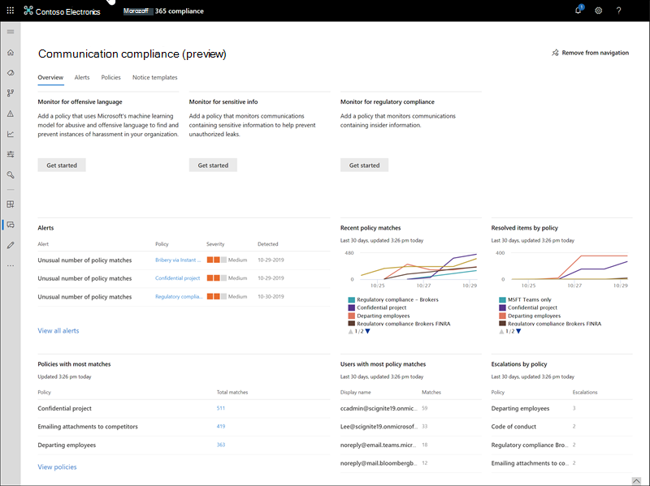
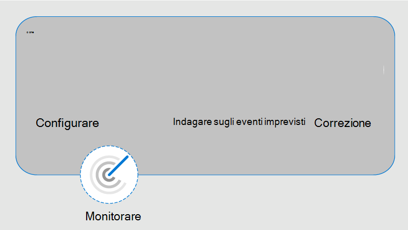

# Conformità della comunicazione in Microsoft 365

La conformità alla comunicazione è parte integrante della nuova soluzione di rischio Insider impostata in Microsoft 365 che consente di ridurre al minimo i rischi di comunicazione aiutandoli a rilevare, acquisire e intraprendere azioni correttive per i messaggi inappropriati nell'organizzazione. I criteri predefiniti e personalizzati consentono di analizzare le comunicazioni interne ed esterne per le corrispondenze dei criteri in modo che possano essere esaminate da revisori designati. I revisori possono esaminare la posta elettronica digitalizzata, Microsoft teams o le comunicazioni di terze parti nell'organizzazione e intraprendere le azioni correttive appropriate per assicurarsi che siano conformi agli standard dei messaggi dell'organizzazione.

I criteri di conformità della comunicazione in Microsoft 365 consentono di superare molte sfide moderne associate alla conformità e alle comunicazioni interne ed esterne, tra cui:

- Analisi dei tipi di canali di comunicazione in aumento
- Volume crescente di dati dei messaggi
- Applicazione di regolamentazione e rischio di ammende

In alcune organizzazioni può verificarsi una separazione dei compiti tra il supporto IT e il gruppo di gestione della conformità. Microsoft 365 supporta la separazione tra la configurazione della conformità della comunicazione e la configurazione dei criteri per l'analisi delle comunicazioni. Ad esempio, il gruppo IT di un'organizzazione potrebbe essere responsabile dell'impostazione delle autorizzazioni e dei gruppi di ruoli per supportare i criteri di conformità della comunicazione configurati e gestiti dal team di conformità dell'organizzazione.

Per una breve panoramica della conformità della comunicazione, vedere il [rilevamento delle molestie sul posto di lavoro e rispondere con la conformità della comunicazione in microsoft 365](https://youtu.be/z33ji7a7Zho) video sul [canale Microsoft Mechanics](https://www.youtube.com/user/OfficeGarageSeries).

## Scenari per la conformità della comunicazione

I criteri di conformità della comunicazione possono fornire assistenza per la revisione dei messaggi nell'organizzazione in diverse aree di conformità importanti:

- **Criteri aziendali**

    I dipendenti devono essere conformi all'uso accettabile, agli standard etici e ad altri criteri aziendali in tutte le comunicazioni relative alle aziende. I criteri di conformità della comunicazione consentono di rilevare le corrispondenze dei criteri e di eseguire azioni correttive che consentono di attenuare questi tipi di incidenti. Ad esempio, è possibile analizzare le comunicazioni dei dipendenti nell'organizzazione per individuare potenziali problemi di risorse umane, come molestie o utilizzo di un linguaggio inappropriato o offensivo.

- **Gestione dei rischi**

    Le organizzazioni sono responsabili di tutte le comunicazioni distribuite nell'infrastruttura e nei sistemi di rete aziendale. L'utilizzo dei criteri di supervisione delle comunicazioni per identificare e gestire potenziali esposizione e rischi legali può contribuire a minimizzare i rischi prima che possano danneggiare le operazioni aziendali. Ad esempio, è possibile analizzare i messaggi nell'organizzazione per comunicazioni non autorizzate su progetti riservati, come acquisizioni imminenti, fusioni, divulgazioni di guadagni, riorganizzazioni o modifiche del team di leadership.

- **Conformità alle normative**

    La maggior parte delle organizzazioni deve soddisfare alcuni tipi di standard di conformità normativi nell'ambito delle normali procedure operative. Queste normative richiedono spesso che le organizzazioni implementino un qualche tipo di processo di supervisione o sorveglianza per la messaggistica appropriata per il proprio settore. La regola FINRA (Financial Industry Regulatory Authority) 3110 è un buon esempio di un requisito che consente alle organizzazioni di disporre di procedure di supervisione per analizzare le comunicazioni dei dipendenti e i tipi di attività in cui si impegna. Un altro esempio potrebbe essere la necessità di esaminare le comunicazioni del broker-dealer nell'organizzazione per salvaguardare le attività relative a possibili operazioni di riciclaggio, insider trading, collusioni o tangenti. I criteri di conformità della comunicazione consentono all'organizzazione di soddisfare questi requisiti fornendo una procedura per l'analisi e il report sulle comunicazioni aziendali. Per ulteriori informazioni sul supporto per le organizzazioni finanziarie, vedere [Key Compliance and Security Considerations for US Banking and Capital Markets](../solutions/financial-services-secure-collaboration.md).

## Nuovi miglioramenti

La conformità alla comunicazione in Microsoft 365 si basa sulle caratteristiche dei [criteri di supervisione in Office 365](supervision-policies.md) con diversi nuovi miglioramenti:

- Modelli personalizzabili intelligenti
- Flussi di lavoro di correzione flessibili
- Approfondimenti di azione

### Modelli personalizzabili intelligenti

I modelli personalizzabili intelligenti in conformità alla comunicazione consentono di applicare l'apprendimento automatico per rilevare in modo intelligente le violazioni della comunicazione nell'organizzazione.

- **Modelli preconfigurati personalizzabili**: i nuovi modelli di criteri consentono di risolvere i rischi di comunicazione più comuni. La creazione di criteri iniziali e l'aggiornamento di follow-up sono ora più rapidi con i modelli predefiniti di Antimolestie e offensive, informazioni riservate e conformità alle normative.
- **Nuovo supporto per l'apprendimento automatico**: minacce incorporate, molestie e [classificatori](classifier-getting-started-with.md) blasfemi consentono di ridurre i falsi positivi nei messaggi analizzati, salvando i revisori durante il processo di analisi e correzione.
- **Generatore di condizioni migliorato**: la configurazione delle condizioni dei criteri è ora snella in una singola esperienza integrata nella procedura guidata per i criteri, riducendo la confusione nel modo in cui vengono applicate le condizioni per i criteri.

### Flussi di lavoro di correzione flessibili

I flussi di lavoro di correzione incorporati consentono di identificare e intervenire rapidamente nei messaggi con corrispondenze di criteri nell'organizzazione. Le seguenti nuove funzionalità aumentano l'efficienza per le attività di analisi e correzione:

- **Flusso di lavoro di correzione flessibile**: il nuovo flusso di lavoro di correzione consente di intervenire rapidamente sulle corrispondenze di criteri, incluse le nuove opzioni per inoltrare i messaggi ad altri revisori e inviare notifiche di posta elettronica agli utenti con corrispondenze di criteri.
- **Threading di conversazione**: i messaggi sono ora raggruppati visivamente dal messaggio originale e da tutti i messaggi di risposta associati, fornendo un contesto migliore durante le operazioni di analisi e correzione.
- **Evidenziazione delle parole chiave**: i termini che corrispondono alle condizioni dei criteri sono evidenziati nella visualizzazione del testo del messaggio per consentire ai revisori di individuare e correggere rapidamente gli avvisi dei criteri.
- **Rilevazione esatta e quasi duplicata**: oltre alla scansione dei termini esatti corrispondenti ai criteri di conformità della comunicazione, vicino ai gruppi di rilevamento duplicati, i termini e i messaggi analoghi sono insieme per velocizzare il processo di revisione.
- **Nuovi filtri**: indagare e correggere gli avvisi di criteri più velocemente con i filtri dei messaggi per diversi campi, tra cui il mittente, il destinatario, la data, i domini e molto altro ancora.
- **Visualizzazioni dei messaggi migliorate**: le azioni di analisi e correzione sono ora più rapide con le nuove visualizzazioni origine messaggio, testo e annotazioni. Gli allegati dei messaggi ora sono visualizzabili per fornire un contesto completo quando si eseguono operazioni di correzione.
- **Visualizzazione cronologia utenti**: visualizzazione cronologica di tutte le attività di correzione dei messaggi degli utenti, ad esempio le notifiche e le escalation precedenti per le corrispondenze di criteri, ora vengono forniti revisori con più contesto durante il processo di correzione del flusso di lavoro. Le istanze di criteri per la prima volta o la ripetizione di corrispondenze per gli utenti sono ora archiviate e facilmente visualizzabili.

### Approfondimenti di azione

I nuovi dashboard interattivi per gli avvisi, le corrispondenze di criteri, le azioni e le tendenze consentono di visualizzare rapidamente lo stato degli avvisi in sospeso e risolti nell'organizzazione.

- **Avvisi intelligenti proattivi**: gli avvisi per le corrispondenze di criteri che richiedono attenzione immediata includono nuovi dashboard per gli elementi in sospeso ordinati in base alla gravità e alle nuove notifiche di posta elettronica automatiche inviate ai revisori designati.
- **Dashboard interattivi**: i nuovi dashboard visualizzano le corrispondenze di criteri, le azioni in sospeso e risolte e le tendenze degli utenti e dei criteri.
- **Supporto**per il controllo: un registro completo delle attività relative ai criteri e alle riesami è facilmente esportato dal centro conformità di Microsoft 365 per supportare le richieste di revisione di controllo.

## Integrazione con i servizi Microsoft 365

I criteri di conformità della comunicazione consentono di analizzare e acquisire i messaggi su diversi canali di comunicazione per esaminare e correggere rapidamente i problemi di conformità:

- **Microsoft teams**: Chat Communications per i canali [Microsoft](https://docs.microsoft.com/MicrosoftTeams/Teams-overview) pubblici e privati e le chat individuali sono supportate nella conformità della comunicazione come origine canale autonoma o con altri servizi Microsoft 365. I criteri ora analizzano automaticamente tutti i canali e i team di Microsoft teams per utenti specifici definiti in un criterio, eliminando la necessità di mantenere un elenco di mapping separato per le assegnazioni di Microsoft teams.
- **Exchange Online**: tutte le cassette postali ospitate in [Exchange Online](https://docs.microsoft.com/Exchange/exchange-online) nell'organizzazione Microsoft 365 sono idonee per l'analisi. Messaggi di posta elettronica e allegati corrispondenti alle condizioni dei criteri di conformità della comunicazione sono immediatamente disponibili per il monitoraggio e nei report di supervisione Exchange Online è ora un canale di origine facoltativo e non è più necessario nei criteri di conformità della comunicazione.
- **Skype for business online**: i criteri di conformità della comunicazione supportano l'analisi delle comunicazioni chat e degli allegati associati in [Skype for business online](https://docs.microsoft.com/SkypeForBusiness/skype-for-business-online).
- **Origini**di terze parti: è possibile eseguire l'analisi dei messaggi provenienti da origini di terze [parti](archiving-third-party-data.md) per i dati importati nelle cassette postali dell'organizzazione Microsoft 365. La conformità alla comunicazione supporta le connessioni a diverse piattaforme popolari, tra cui Instant Bloomberg, Facebook, Twitter e altri.

Per ulteriori informazioni sul supporto dei canali di messaggistica nei criteri di conformità della comunicazione, vedere [supported Communication types](communication-compliance-feature-reference.md#supported-communication-types).

## Flusso di lavoro

La conformità alla comunicazione consente di risolvere i punti di dolore comuni associati all'ottemperanza ai criteri interni e ai requisiti di conformità alle normative. Con i modelli di criteri mirati e un flusso di lavoro flessibile, è possibile utilizzare informazioni utili per risolvere rapidamente i problemi di conformità rilevati.

L'identificazione e la risoluzione dei problemi di conformità con la conformità della comunicazione in Microsoft 365 utilizza il flusso di lavoro seguente:

### Configurare

In questo passaggio del flusso di lavoro vengono identificati i requisiti di conformità e vengono configurati i criteri di conformità della comunicazione. I modelli di criteri rappresentano un ottimo modo per non solo configurare rapidamente un nuovo criterio di conformità, ma anche per modificare e aggiornare rapidamente i criteri in base alle modifiche apportate ai requisiti. Ad esempio, potrebbe essere necessario testare rapidamente un criterio per la lingua offensiva e l'antimolestia sulle comunicazioni per un piccolo gruppo di utenti prima di configurare un criterio per tutti gli utenti dell'organizzazione.

>[!Important]
>Per impostazione predefinita, gli amministratori globali non possono accedere alle funzionalità di conformità della comunicazione. Per abilitare le autorizzazioni per le funzionalità di conformità della comunicazione, vedere [make Communication Compliance available in Your Organization](communication-compliance-configure.md#step-1-required-enable-permissions-for-communication-compliance).

È possibile scegliere tra i seguenti modelli di criteri nel centro conformità di Microsoft 365:

- **Linguaggio offensivo e antimolestia**: utilizzare questo modello per creare rapidamente un criterio che utilizza il classificatore incorporato per rilevare automaticamente il contenuto che può essere considerato abusivo o offensivo.
- **Informazioni riservate**: utilizzare questo modello per creare un criterio per l'analisi delle comunicazioni contenenti tipi di informazioni riservate definite o parole chiave per garantire che i dati importanti non siano condivisi con utenti che non devono avere accesso.
- **Conformità alle normative**: utilizzare questo modello per creare un criterio per l'analisi delle comunicazioni per i riferimenti ai termini finanziari standard associati agli standard normativi.
- **Criteri personalizzati**: utilizzare questo modello per configurare i canali di comunicazione specifici, le condizioni di rilevamento individuali e la quantità di contenuto da esaminare per la supervisione nell'organizzazione.

### Analizzare

In questo passaggio, si esaminano i problemi rilevati come corrispondenti ai criteri di conformità della comunicazione. In questo passaggio sono incluse le azioni seguenti disponibili nel centro conformità di Microsoft 365:

- **Avvisi**: quando un messaggio corrisponde a un criterio di supervisione, viene generato automaticamente un avviso. Per ogni avviso, è possibile visualizzare lo stato, la gravità, il tempo rilevato e se viene assegnato un caso e il relativo stato. I nuovi avvisi vengono visualizzati nella Home page conformità comunicazione e nella pagina **avvisi** e sono elencati in ordine di gravità.
- **Gestione dei problemi**: per ogni avviso, è possibile intraprendere azioni investigative per contribuire a correggere il problema rilevato nel messaggio.
- **Revisione del documento**: durante l'analisi di un problema, è possibile utilizzare diverse visualizzazioni del messaggio per valutare adeguatamente il problema rilevato. Le visualizzazioni includono un riepilogo delle conversazioni, visualizzazioni di solo testo, annotazioni e dettagli della conversazione di comunicazione.
- Revisione della **cronologia delle attività degli utenti**: visualizzare la cronologia delle attività dei messaggi degli utenti e le azioni di correzione, ad esempio le notifiche e le escalation precedenti, per le corrispondenze di criteri.
- **Filtri**: utilizzare filtri quali il mittente, il destinatario, la data e l'oggetto per limitare rapidamente gli avvisi del messaggio che si desidera esaminare.

### Correzione

Il passaggio successivo consiste nel correggere i problemi di conformità della comunicazione analizzati utilizzando le opzioni seguenti:

- **Resolve**: dopo la revisione di un problema, è possibile risolvere i problemi risolvendo l'avviso. La risoluzione di un avviso lo rimuove dalla coda degli avvisi in sospeso e l'azione viene mantenuta come voce nella coda risolta per i criteri di corrispondenza. Gli avvisi vengono risolti automaticamente dopo aver segnato l'avviso come falso positivo, inviando un avviso a un dipendente sull'avviso o aprendo un nuovo caso per l'avviso.
- **Tag un messaggio**: nell'ambito della risoluzione di un problema, è possibile contrassegnare il messaggio rilevato come conforme, non conforme, o come discutibile come si riferisce ai criteri e agli standard per l'organizzazione. Il tagging può aiutare a filtrare gli avvisi per i criteri per le escalation o come parte di altri processi di revisione interni.
- **Notifica all'utente**: spesso gli utenti violano accidentalmente o inavvertitamente un criterio di conformità della comunicazione. È possibile utilizzare la funzionalità Notify per fornire un avviso all'utente e per risolvere il problema.
- **Escalation a un altro revisore**: a volte, il revisore iniziale di un problema deve essere inserito da altri revisori per contribuire alla risoluzione dell'evento. È possibile inoltrare facilmente i problemi dei messaggi ai revisori in altre aree dell'organizzazione nell'ambito del processo di risoluzione.
- **Contrassegna come falso positivo**: i messaggi rilevati erroneamente come corrispondenze di criteri di conformità passano occasionalmente al processo di revisione. È possibile contrassegnare questi tipi di avvisi come falsi positivi e risolvere automaticamente il problema.
- **Creare un caso**: nelle situazioni più gravi potrebbe essere necessario condividere le informazioni di conformità della comunicazione con altri revisori nell'organizzazione. La conformità alla comunicazione è strettamente integrata con altre funzionalità di conformità di Microsoft 365 che consentono di risolvere i rischi end-to-end. L'escalation di un caso di indagine consente di trasferire i dati e la gestione del caso in Advanced eDiscovery in Microsoft 365. Advanced eDiscovery offre un flusso di lavoro end-to-end per conservare, raccogliere, rivedere, analizzare ed esportare contenuti rispondenti alle indagini interne ed esterne dell'organizzazione. Consente ai team legali di gestire l'intero flusso di lavoro di notifica della conservazione legale. Per ulteriori informazioni sui casi di eDiscovery avanzati, vedere [Overview of Advanced eDiscovery in Microsoft 365](overview-ediscovery-20.md).

### Monitorare

Tenere tenere conto e gestire i problemi di conformità identificati dai criteri di conformità della comunicazione si estende sull'intero processo del flusso di lavoro. Quando vengono generati avvisi e vengono implementate azioni di analisi e correzione, i criteri esistenti potrebbero richiedere revisione e aggiornamenti e potrebbe essere necessario creare nuovi criteri.

- **Monitor and report**: utilizzare dashboard di conformità della comunicazione, report, registri di esportazione ed eventi registrati nei registri di controllo di Office 365 per valutare e migliorare continuamente la postura di conformità.

## Pronti per iniziare?

Per configurare la conformità di comunicazione per l'organizzazione Microsoft 365, vedere [Configure Communication Compliance for microsoft 365](communication-compliance-configure.md) o check-out the [Case Study for Contoso](communication-compliance-case-study.md) e how they configurati rapidamente un criterio di conformità della comunicazione per il monitoraggio per la lingua offensiva in Microsoft teams e Exchange Online Communications.
