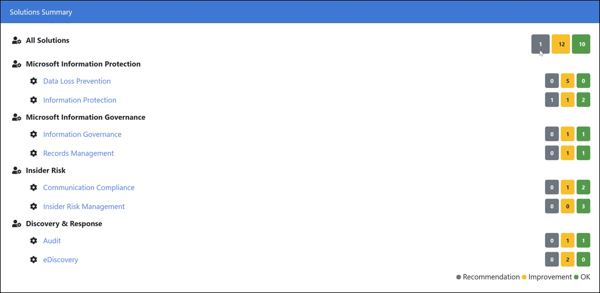

# <a name="microsoft-compliance-configuration-analyzer-for-compliance-manager"></a>Analizzatore della configurazione della conformità di Microsoft per Compliance Manager

**In questo articolo:** Informazioni su come installare ed eseguire Microsoft Compliance Configure Analyzer Tool per iniziare rapidamente con Microsoft Compliance Manager.

## <a name="microsoft-compliance-configuration-analyzer-mcca-overview"></a>Panoramica di Microsoft Compliance Configuration Analyzer (MCCA)

Microsoft Compliance Configuration Analyzer (MCCA) è uno strumento che consente di iniziare a utilizzare [Microsoft Compliance Manager](compliance-manager.md). MCCA è un'utilità basata su PowerShell che recupererà le configurazioni correnti dell'organizzazione e le convaliderà con le procedure consigliate di Microsoft 365. Queste procedure consigliate si basano su un insieme di controlli che includono le normative fondamentali e gli standard per la protezione dei dati e la governance dei dati.

MCCA consente di visualizzare rapidamente quali azioni di miglioramento in Gestione conformità vengono applicate all'ambiente Microsoft 365 corrente. Ogni azione identificata da MCCA fornirà suggerimenti per l'implementazione, con collegamenti diretti a Compliance Manager e la soluzione applicabile per iniziare a intraprendere azioni correttive.

Una risorsa aggiuntiva per la comprensione di MCCA è quella di visitare le [istruzioni Readme su GitHub](https://github.com/OfficeDev/MCCA#overview). In questa pagina vengono fornite informazioni dettagliate sui prerequisiti e vengono fornite istruzioni per l'installazione complete. Per accedere a questa pagina non è necessario un account GitHub.

## <a name="install-mcca-and-run-a-report"></a>Installare MCCA ed eseguire un report

È possibile installare lo strumento MCCA tramite Windows PowerShell. Dopo aver scaricato e installato lo strumento, non è necessario ripetere tali passaggi per eseguire i report. Ogni volta che si apre MCCA, verrà chiesto di specificare le credenziali di accesso e verrà generato un nuovo report aggiornato.

#### <a name="step-1-install-windows-powershell"></a>Passaggio 1: installazione di Windows PowerShell
Per iniziare, è necessario il modulo di PowerShell di Exchange Online (v 2.0.3 o versione successiva) disponibile nella raccolta di PowerShell. [Ottenere le istruzioni di installazione](https://www.powershellgallery.com/packages/ExchangeOnlineManagement/2.0.3).

#### <a name="step-2-install-mcca"></a>Passaggio 2: installare MCCA

Per installare MCCA, iniziare a utilizzare PowerShell in modalità amministratore. Attenersi alla procedura seguente:

1. Selezionare il pulsante **Start** di Windows.
2. Digitare **PowerShell** , fare clic con il pulsante destro del mouse su **Windows PowerShell** e quindi scegliere **Esegui come amministratore**.
1. Al prompt dei comandi digitare:

    ```powershell
    Install-Module -Name MCCAPreview
    ```

#### <a name="step-3-run-a-report"></a>Passaggio 3: esecuzione di un report

Dopo l'installazione di MCCA, è possibile eseguire MCCA e generare un report. Per eseguire un report:

1. Aprire PowerShell
2. Eseguire il cmdlet:

    ```powershell
    Get-MCCAReport
    ```
3. Dopo l'esecuzione di MCCA, il controllo della versione iniziale richiede le credenziali. Nella finestra di input il prompt dei nomi utente, accedere con l'indirizzo di posta elettronica Microsoft 365 account ([vedere i ruoli idonei per creare report](#role-based-reporting)). Immettere quindi la password al prompt della password.

Il report richiederà circa 2-5 minuti per la generazione. Al termine, viene visualizzata una finestra del browser e viene visualizzato il report HTML. Ogni volta che si esegue lo strumento, viene richiesto di specificare le credenziali e generare un nuovo report. Questo report è archiviato localmente nella directory seguente:

C:\Users \<username> \AppData\Local\Microsoft\MCCA. 

È possibile accedere a report generati in precedenza da questa directory.

## <a name="understanding-your-report"></a>Informazioni sul report

Il report riflette i dati in base alla data e all'ora in cui è stato generato. Nella sezione superiore sono disponibili informazioni dettagliate su quando è stata generata, il nome dell'organizzazione e l'ID tenant.

#### <a name="geolocation-based-reporting"></a>Report basati su Geolocation

La sezione **Note** indica che il report è personalizzato in base alla posizione geografica del tenant. Le raccomandazioni elencate nello strumento saranno specifiche per il proprio paese o area geografica.

La selezione di Geolocation viene utilizzata per valutare i tipi di informazioni riservate che sono rilevanti per tale Geolocation e generare un report che si allinea al paese o all'area geografica. Scegliere geolocations in base ai dati presenti nel tenant.

Per modificare le informazioni sulla posizione del report, è necessario fornire un parametro di input Geolocation (-GEO). È possibile scegliere una o più geolocazioni valide per il tenant.

Seguire le istruzioni riportate di seguito per eseguire un report in base a una posizione specifica:

1. Aprire PowerShell
2. Per specificare una determinata area geografica, è possibile eseguire un cmdlet utilizzando i numeri della tabella seguente che corrispondono al paese o all'area geografica. Immettere più numeri separandoli con una virgola. Ad esempio, il cmdlet riportato di seguito eseguirà un report personalizzato per Asia-Pacific e Giappone:

    ```powershell
    Get-MCCAReport -Geo @(1,7)
    ```
  | Input |  Paese | 
  | :------------- | :------------: |
  | 1  | Asia-Pacifico |
  | 2  | Australia |
  | 3 | Canada |
  | 4  | Europa (esclusa la Francia)/Medio Oriente/Africa |
  | 5  | Francia |
  | 6  | India |
  | 7  | Giappone |
  | 8  | Corea del Sud |
  | 9  | Nord America (escluso il Canada) |
  | 10   | Sud America |
  | 11  | Sudafrica |
  | 12  | Svizzera |
  | 13  | Emirati Arabi Uniti |
  | 14  | Regno Unito |


 > [!NOTE]
> Il report includerà sempre i tipi di informazioni riservate internazionali supportate da MCCA, ad esempio codice SWIFT, numero di carta di credito e così via.

#### <a name="role-based-reporting"></a>Reporting basato sui ruoli

Il report verrà personalizzato anche in base al ruolo.

Nella tabella seguente vengono illustrati i ruoli che hanno accesso alle sezioni del report. Gli altri ruoli all'interno dell'organizzazione (non elencati nella tabella seguente) potrebbero non essere in grado di eseguire lo strumento oppure possono eseguire lo strumento e avere accesso limitato alle informazioni nel report finale.


Eccezioni:
1. L'utente non sarà in grado di generare report per IP oltre alla sezione "utilizzo di IRM per Exchange Online".
2. L'utente sarà in grado di generare report per IP oltre alla sezione "utilizzo di IRM per Exchange Online".
3. L'utente sarà in grado di generare report per IP oltre alla sezione "Abilita conformità alla comunicazione in O365".
4. L'utente non sarà in grado di generare report per IP oltre alla sezione "attivazione del controllo in Office 365".
5. L'utente sarà in grado di generare report per IP oltre alla sezione "attivare il controllo in Office 365".

#### <a name="solutions-summary-section"></a>Sezione Riepilogo soluzioni

La sezione **soluzioni di riepilogo** del rapporto fornisce una panoramica delle azioni di miglioramento che l'organizzazione può eseguire in Compliance Manager per migliorare la posizione di conformità.



MCCA valuta le configurazioni correnti rispetto alle azioni di miglioramento consigliate in Compliance Manager. In questa sezione vengono elencate tutte le azioni di miglioramento identificate dallo strumento MCCA.

Accanto a ogni soluzione Microsoft sono presenti caselle con codice a colori che indicano il numero di elementi che corrispondono a azioni di miglioramento in Compliance Manager. Le azioni vengono suddivise in tre stati di stato:

- **OK** : le azioni che soddisfano le condizioni consigliate e non hanno bisogno di attenzioni in questo momento
- **Miglioramento** : azioni che richiedono attenzione
- **Raccomandazione** : azioni che non richiedono attenzione, ma per le quali si consiglia di utilizzare le procedure consigliate
 
Selezionare una casella per visualizzare miglioramenti e suggerimenti.

**Elementi con stato miglioramento**

Selezionare l'elenco a discesa accanto all'etichetta **miglioramento** a destra dell'azione di miglioramento. Verrà visualizzato un riepilogo rapido e i dettagli relativi alle impostazioni correnti e alle azioni di miglioramento consigliate. Il riepilogo include collegamenti diretti in Compliance Manager, la soluzione applicabile nel centro conformità di Microsoft 365 e la documentazione pertinente.

Se si fa clic sul collegamento Compliance Manager, viene visualizzata una visualizzazione filtrata di tutte le azioni di miglioramento all'interno di tale soluzione che non sono state ancora implementate. Da qui, è possibile visualizzare il numero di punti che è possibile ottenere per aumentare il [Punteggio di conformità](compliance-score-calculation.md)e le valutazioni a cui si applicano, nonché le normative e le certificazioni applicabili.

Per DLP, è disponibile un pulsante **script di correzione** che consente di creare uno script di PowerShell pregenerato in base a ciò che è consigliato. È possibile copiarlo e incollarlo direttamente nella console di PowerShell. Verrà creato un criterio DLP in modalità di test

**Elementi con stato del suggerimento**

Selezionare l'elenco a discesa accanto all'etichetta di **raccomandazione** a destra dell'azione di miglioramento. Verrà visualizzato un riepilogo dell'ambiente Microsoft 365 corrente dell'organizzazione relativo all'azione di miglioramento, oltre alle procedure consigliate riportate di seguito.

## <a name="resources"></a>Risorse

Per informazioni più dettagliate sull'installazione, la configurazione e l'utilizzo di MCCA, vedere le [istruzioni Readme su GitHub](https://github.com/OfficeDev/MCCA#overview) (nessun account github obbligatorio).

Per ulteriori informazioni su Windows PowerShell, iniziare a [utilizzare la documentazione di PowerShell](https://docs.microsoft.com/powershell/scripting/how-to-use-docs?view=powershell-7). Vedere anche [avvio di Windows PowerShell](https://docs.microsoft.com/powershell/scripting/windows-powershell/starting-windows-powershell?view=powershell-7).
