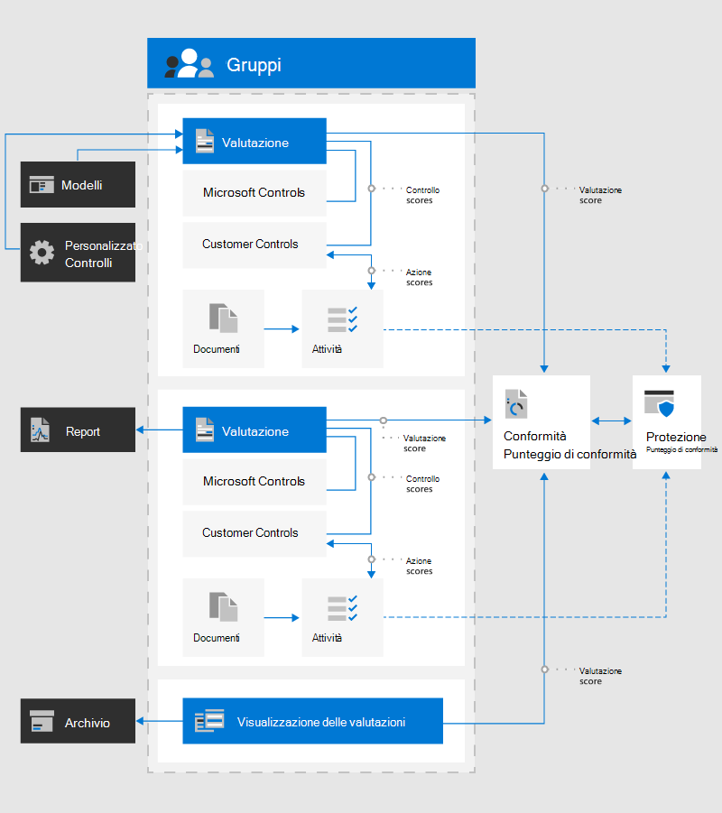

# Microsoft Compliance Manager (anteprima)Microsoft Compliance Manager (Preview)

> [!IMPORTANT]
> Compliance Manager non è disponibile in Office 365 gestito da 21Vianet, Office 365 Germany, Office 365 U.S. Government Community High (GCC High) o Office 365 Dipartimento della Difesa.Compliance Manager isn't available in Office 365 operated by 21Vianet, Office 365 Germany, Office 365 U.S. Government Community High (GCC High), or Office 365 Department of Defense.

[Microsoft Compliance Manager (Preview)](https://servicetrust.microsoft.com/ComplianceManager) è uno strumento di valutazione dei rischi basato su flussi di lavoro gratuito che consente di monitorare, assegnare e verificare le attività di conformità alle normative relative ai servizi cloud Microsoft.[Microsoft Compliance Manager (Preview)](https://servicetrust.microsoft.com/ComplianceManager) is a free workflow-based risk assessment tool that lets you track, assign, and verify regulatory compliance activities related to Microsoft cloud services. Parte dell'abbonamento a Microsoft 365, Office 365 o Azure Active Directory, Compliance Manager consente di gestire la conformità normativa all'interno del modello di responsabilità condivisa per i servizi cloud Microsoft.Part of your Microsoft 365, Office 365, or Azure Active Directory subscription, Compliance Manager helps you manage regulatory compliance within the shared responsibility model for Microsoft cloud services. Compliance Manager offre un Dashboard centralizzato per la visualizzazione di standard, normative e dettagli sull'implementazione dei controlli e sui risultati dei test per le valutazioni del servizio Microsoft.Compliance Manager offers a centralized dashboard for viewing standards, regulations, and control implementation details and test results for Microsoft service assessments. Include anche strumenti che consentono di gestire le implementazioni dei controlli personalizzati e la verifica della conformità specifiche per l'organizzazione.It also includes tools allowing you to manage custom control implementations and compliance tracking specific to your organization.

Con Compliance Manager, l'organizzazione può:With Compliance Manager, your organization can:
  
- Combinare informazioni dettagliate sulla conformità fornite ai revisori e ai regolatori dei servizi cloud con l'autovalutazione di conformità per gli standard e le normative applicabili alla propria organizzazione.Combine detailed compliance information Microsoft provided to auditors and regulators about its cloud services with your compliance self-assessment for standards and regulations applicable for your organization. Sono inclusi gli standard e le normative delineati dall'organizzazione internazionale per la standardizzazione (ISO), dall'Istituto nazionale per gli standard e la tecnologia (NIST), dalla portabilità di assicurazione malattia e dalla legge sulla responsabilità (HIPAA), i dati generali Protection Regulation (GDPR) e molte altre.These include standards and regulations outlined by the International Organization for Standardization (ISO), the National Institute of Standards and Technology (NIST), the Health Insurance Portability and Accountability Act (HIPAA), the General Data Protection Regulation (GDPR), and many others.
- Consentono di assegnare, monitorare e registrare le attività relative alla conformità e alla valutazione, che consentono all'organizzazione di superare le barriere del team per raggiungere gli obiettivi di conformità.Enable you to assign, track, and record compliance and assessment-related activities, which can help your organization cross team barriers to achieve your compliance goals.
- Fornire un punteggio di conformità che consenta di monitorare lo stato di avanzamento e la priorità dei controlli di controllo che consentono di ridurre l'esposizione ai rischi dell'organizzazione.Provide a Compliance Score to help you track your progress and prioritize auditing controls that help reduce your organization's exposure to risk.
- Fornire un repository sicuro per l'upload e la gestione di evidenze e altri elementi correlati alle attività di conformità.Provide a secure repository for you to upload and manage evidence and other artifacts related to your compliance activities.
- Produrre rapporti di Microsoft Excel riccamente dettagliati che documentano le attività di conformità eseguite da Microsoft e dalla propria organizzazione per i revisori, i regolatori e altri revisori di conformità.Produce richly detailed Microsoft Excel reports that document compliance activities performed by Microsoft and your organization for auditors, regulators, and other compliance reviewers.

> [!NOTE]
> Le azioni dei clienti fornite in Compliance Manager sono raccomandazioni. spetta alla propria organizzazione valutare l'efficacia di tali raccomandazioni nei rispettivi ambienti normativi prima dell'implementazione.The customer actions provided in Compliance Manager are recommendations; it is up to your organization to evaluate the effectiveness of these recommendations in their respective regulatory environment prior to implementation. Le indicazioni rilevate in Compliance Manager non devono essere interpretate come garanzia di conformità.Recommendations found in Compliance Manager should not be interpreted as a guarantee of compliance.

## Relazioni di Compliance ManagerCompliance Manager relationships

Compliance Manager utilizza diversi componenti che consentono di eseguire le attività di gestione della conformità.Compliance Manager uses several components to help you with your compliance management activities. Questi componenti interagiscono per fornire un flusso di lavoro di gestione completo e rapporti di conformità senza problemi per i revisori.These components work together to provide a complete management work flow and hassle-free compliance reports for auditors.

Nel diagramma vengono illustrate le relazioni tra i componenti principali di Compliance Manager:The diagram shows the relationships between the primary components of Compliance Manager:

## GruppiGroups

I [gruppi](working-with-compliance-manager.md#groups) sono contenitori che consentono di organizzare valutazioni e condividere le informazioni comuni e le attività del flusso di lavoro tra le valutazioni che dispongono dello stesso o dei controlli gestiti dal cliente.[Groups](working-with-compliance-manager.md#groups) are containers that allow you to organize Assessments and share common information and workflow tasks between Assessments that have the same or related customer-managed controls. Quando due diverse valutazioni nello stesso gruppo condividono il controllo gestito dal cliente, il completamento dei dettagli dell'implementazione, il testing e lo stato del controllo vengono sincronizzati automaticamente allo stesso controllo in qualsiasi altra valutazione del gruppo.When two different Assessments in the same group share customer-managed control, the completion of implementation details, testing, and status for the control automatically synchronize to the same control in any other Assessment in the Group. Questo unifica gli elementi di azione assegnati per ogni controllo nel gruppo e riduce il lavoro di duplicazione.This unifies the assigned Action Items for each control across the group and reduces duplicating work. È inoltre possibile scegliere di utilizzare i gruppi da organizzare.You can also choose to use groups to organize. Valutazioni per anno, area, standard di conformità o altri raggruppamenti per facilitare l'organizzazione del lavoro di conformità.Assessments by year, area, compliance standard, or other groupings to help organize your compliance work.

## ValutazioniAssessments

Le [valutazioni](working-with-compliance-manager.md#assessments) sono contenitori che consentono di organizzare i controlli in base alle responsabilità condivise tra Microsoft e l'organizzazione per valutare i rischi per la sicurezza e la conformità dei servizi cloud.[Assessments](working-with-compliance-manager.md#assessments) are containers that allow you to organize controls based on responsibilities shared between Microsoft and your organization for assessing cloud service security and compliance risks. Le valutazioni consentono di implementare le misure di salvaguardia della protezione dei dati specificate da standard di conformità e standard di protezione dei dati applicabili, regolamenti o leggi.Assessments help you implement data protection safeguards specified by a compliance standard and applicable data protection standards, regulations, or laws. Consentono di discernere la protezione dei dati e la posizione di conformità rispetto allo standard del settore selezionato per il servizio cloud Microsoft selezionato.They help you discern your data protection and compliance posture against the selected industry standard for the selected Microsoft cloud service. Le valutazioni sono state completate dall'implementazione dei controlli inclusi nella valutazione che corrispondono a uno standard di certificazione.Assessments are completed by the implementation of controls included in the Assessment that map to a certification standard.

Per impostazione predefinita, Compliance Manager crea le seguenti valutazioni per l'organizzazione:By default, Compliance Manager creates the following Assessments for your organization:

- Office 365 ISO 27001Office 365 ISO 27001
- Office 365 NIST 800-53Office 365 NIST 800-53
- Office 365 GDPROffice 365 GDPR

Le valutazioni includono diversi componenti:Assessments include several components:
  
- **Servizi nell'ambito**: ogni valutazione si applica a un set specifico di servizi Microsoft.**In-Scope Services**: Each assessment applies to a specific set of Microsoft services.
- **Controlli gestiti Microsoft**: per ogni servizio cloud, Microsoft implementa e gestisce un insieme di controlli di conformità per gli standard e le normative applicabili.**Microsoft-managed controls**: For each cloud service, Microsoft implements and manages a set of compliance controls for applicable standards and regulations.
- **Controlli gestiti dal cliente**: è l'insieme dei controlli implementati dall'organizzazione quando si eseguono azioni per ogni controllo.**Customer-managed controls**: This is the collection of controls implemented by your organization when you take actions for each control.
- **Punteggio di valutazione**: la percentuale del punteggio totale possibile per i controlli gestiti dal cliente nella valutazione.**Assessment Score**: The percentage of the total possible score for customer-managed controls in the Assessment. In questo modo è possibile monitorare l'implementazione delle azioni assegnate a ogni controllo.This helps you track the implementation of the Actions assigned to each control.

## ControlliControls

I [controlli](working-with-compliance-manager.md#controls-and-actions) sono contenitori dei processi di conformità in Compliance Manager che definiscono la modalità di gestione delle attività di conformità.[Controls](working-with-compliance-manager.md#controls-and-actions) are compliance process containers in Compliance Manager that define how you manage compliance activities. Questi controlli sono organizzati in famiglie di controllo che si allineano con la struttura di valutazione per le certificazioni o le normative corrispondenti.These controls are organized into control families that align with the Assessment structure for corresponding certifications or regulations.

- **ID di controllo**: il nome del controllo selezionato dalla certificazione o dal regolamento corrispondente.**Control ID**: The name of the selected control from the corresponding certification or regulation.
- **Titolo di controllo**: il titolo dell'ID di controllo della certificazione o del regolamento corrispondente.**Control Title**: The title for the Control ID from the corresponding certification or regulation.
- **ID articolo**: questo campo è solo per le valutazioni di GDPR e specifica il numero dell'articolo GDPR corrispondente.**Article ID**: This field is only for GDPR assessments and specifies the corresponding GDPR article number.
- **Descrizione**: testo del controllo dalla certificazione o dalla regolamentazione corrispondente.**Description**: Text of control from the corresponding certification or regulation. A causa di limitazioni del copyright, un collegamento alle informazioni rilevanti è elencato per gli standard ISO.Due to copyright restrictions, a link to relevant information is listed for ISO standards.

Sono disponibili tre tipi di controlli in Compliance Manager, **controlli gestiti da Microsoft**, controlli **gestiti dal cliente**e **controlli di gestione condivisi**There are three types of controls in Compliance Manager, **Microsoft-managed controls**, **customer-managed controls**, and **Shared management controls**

### Controlli gestiti da MicrosoftMicrosoft-managed controls

Per ogni servizio cloud, Microsoft implementa e gestisce un insieme di controlli come parte della conformità di Microsoft con vari standard e normative.For each cloud service, Microsoft implements and manages a set of controls as part of Microsoft's compliance with various standards and regulations. Ogni controllo fornisce informazioni dettagliate sul modo in cui Microsoft ha implementato il controllo e su come e quando tale implementazione è stata testata e convalidata da Microsoft e/o da un revisore di terze parti indipendente.Each control provides details about how Microsoft implemented the control, and how and when that implementation was tested and validated by Microsoft and/or by an independent third-party auditor.

### Controlli gestiti dal clienteCustomer-managed controls

Questo è l'insieme di controlli gestiti dall'organizzazione.This is the collection of controls managed by your organization. L'organizzazione è responsabile dell'implementazione del controllo gestito dal cliente nell'ambito del processo di conformità per un determinato standard o regolamentazione.Your organization is responsible for customer-managed control implementation as part of your compliance process for a given standard or regulation. I controlli gestiti dal cliente sono organizzati in famiglie di controllo per la certificazione o regolamentazione corrispondente.Customer-managed controls are organized into control families for the corresponding certification or regulation. Utilizzare i controlli gestiti dal cliente per implementare le azioni consigliate suggerite da Microsoft come parte delle attività di conformità.Use the customer-managed controls to implement the recommended actions suggested by Microsoft as part of your compliance activities. L'organizzazione può utilizzare le istruzioni e le azioni dei clienti consigliate in ogni controllo gestito dal cliente per gestire il processo di implementazione e valutazione per tale controllo.Your organization can use the prescriptive guidance and recommended customer actions in each customer-managed control to manage the implementation and assessment process for that control.

I controlli gestiti dal cliente nelle valutazioni dispongono anche di funzionalità di gestione dei flussi di lavoro incorporate che è possibile utilizzare per gestire e monitorare i progressi compiuti verso il completamento della valutazione.Customer-managed controls in Assessments also have built-in workflow management functionality that you can use to manage and track your progress towards Assessment completion. Con questa funzionalità del flusso di lavoro, è possibile:With this workflow functionality, you can:

- Assegnare elementi azione per ogni controlloAssign Action Items for each control
- Registrare gli elementi di azione assegnatiTrack assigned Action Items
- Caricare la prova dell'implementazione del controlloUpload evidence of the implementation of the control
- Documentare il testing e la convalida del controlloDocument the testing and validation of the control
- Contrassegnare gli elementi di azione come implementato e testatoMark the Action Items as implemented and tested

Ad esempio, un responsabile della conformità nell'organizzazione assegna un elemento di azione a un amministratore IT con la responsabilità e le autorizzazioni necessarie per eseguire l'azione consigliata.For example, a Compliance Officer in your organization assigns an Action Item to an IT admin with the responsibility and necessary permissions to perform the recommended action. L'amministratore IT carica la prova delle attività di implementazione (schermate delle impostazioni di configurazione o dei criteri) e assegna la voce di azione al responsabile della conformità al termine dell'operazione.The IT admin uploads evidence of the implementation tasks (screenshots of configuration or policy settings) and assigns the Action Item back to the Compliance Officer when completed. Il responsabile della conformità valuta l'evidenza raccolta, verifica l'implementazione del controllo e registra la data di implementazione e i risultati dei test in Compliance Manager.The Compliance Officer evaluates the collected evidence, tests the implementation of the control, and records the implementation date and test results in Compliance Manager.

### Controlli di gestione condivisiShared management controls

Un controllo condiviso si riferisce a qualsiasi controllo in cui Microsoft e i clienti condividono le responsabilità per l'implementazione.A shared control refers to any control where Microsoft and customers both share responsibilities for implementation. Ad esempio, i controlli relativi alla selezione del personale, alla gestione degli account e delle password e alla crittografia richiedono azioni sia di Microsoft che dei clienti.For example, controls related to personnel screening, account and password management, and encryption require actions by both Microsoft and customers.

## AttivitàAction Items

[Gli elementi Actions](working-with-compliance-manager.md#controls-and-actions) sono inclusi nei controlli gestiti dal cliente come parte della funzionalità di gestione dei flussi di lavoro incorporata che è possibile utilizzare per gestire e monitorare i progressi compiuti verso il completamento della valutazione.[Actions Items](working-with-compliance-manager.md#controls-and-actions) are included in customer-managed controls as part of the built-in workflow management functionality that you can use to manage and track your progress towards Assessment completion.

Gli utenti dell'organizzazione possono utilizzare Compliance Manager per esaminare i controlli gestiti dal cliente da tutte le valutazioni per cui sono stati assegnati.People in your organization can use Compliance Manager to review the customer-managed controls from all Assessments for which they're assigned. Quando un utente accede a Responsabile Conformità e apre la dashboard **Azioni**, viene visualizzato un elenco delle attività assegnate all'utente stesso.When a user signs in to Compliance Manager and opens the **Action Items** dashboard, a list of Action Items assigned to them is displayed. In base al ruolo di Compliance Manager assegnatogli, l'utente può fornire dettagli relativi all'implementazione o al test, aggiornare lo stato o assegnare attività.Depending on the Compliance Manager role assigned to the user, they can provide implementation or test details, update the Status, or assign Action Items.

I controlli di certificazione vengono in genere implementati da una persona e testati da un altro.Certification controls are usually implemented by one person and tested by another. Ad esempio, dopo aver completato gli elementi dell'azione inizialmente assegnati a una persona per l'implementazione, gli elementi di azione vengono assegnati alla persona successiva per testare e caricare la prova.For example, after Action Items initially assigned to one person for implementation are completed, those Action Items are assigned to the next person to test and upload evidence. Gli utenti che dispongono di autorizzazioni sufficienti per le assegnazioni di controllo possono assegnare e riassegnare gli elementi di azione.Any user with sufficient permissions for control assignments can assign and reassign Action Items. In questo modo è possibile gestire in modo centralizzato le assegnazioni dei controlli e il routing decentralizzato degli elementi di azione tra gli implementatori e i tester.This enables central management of control assignments and decentralized routing of Action Items between implementors and testers.

## AutorizzazioniPermissions

Compliance Manager usa un modello di autorizzazione di controllo dell'accesso basato sui ruoli.Compliance Manager uses a role-based access control permission model. Solo agli utenti a cui è stato assegnato il ruolo utente è consentito di accedere a Compliance Manager e le azioni consentite da ogni utente sono limitate in base al tipo di ruolo.Only users who are assigned a user role may access Compliance Manager, and the actions allowed by each user are restricted by role type. [Visualizzare una tabella](working-with-compliance-manager.md#permissions) in cui sono riportate le azioni consentite per ogni autorizzazione.[View a table](working-with-compliance-manager.md#permissions) showing the actions allowed for each permission.

L'amministratore del portale per Compliance Manager può impostare le autorizzazioni per gli altri utenti all'interno di Compliance Manager attenendosi alla procedura seguente:The portal admin for Compliance Manager can set permissions for other users in within Compliance Manager by following these steps:

1. Dal menu a discesa **in alto,** selezionare **amministratore**, quindi **Impostazioni**.From the top **More** drop-down menu, select **Admin**, then **Settings**.
2. Selezionare il ruolo che si desidera assegnare e quindi aggiungere il dipendente che si desidera assegnare a quel ruolo.From here, select the role you want to assign, and then add the employee you want to assign to that role. Gli utenti saranno quindi in grado di eseguire determinate azioni.Users will then be able to perform certain actions.

Inoltre, gli utenti a cui è assegnato il [ruolo di lettore globale in Azure Active Directory (Azure ad)](https://docs.microsoft.com/azure/active-directory/users-groups-roles/directory-assign-admin-roles#global-reader) dispongono dell'autorizzazione di sola lettura per accedere a Compliance Manager.In addition, users who are assigned the [Global Reader role in Azure Active Directory (Azure AD)](https://docs.microsoft.com/azure/active-directory/users-groups-roles/directory-assign-admin-roles#global-reader) have read-only permission to access Compliance Manager. Tuttavia, non sono in grado di modificare i dati o di eseguire azioni all'interno di Compliance Manager.However, they cannot edit data or perform any actions within Compliance Manager.

Non esiste più un ruolo di **accesso Guest** predefinito.There is no longer a default **Guest access** role. A ogni utente deve essere assegnato un ruolo per poter accedere e lavorare in Compliance Manager.Each user must be assigned a role in order to access and work within Compliance Manager.
  
## Gestione delle evidenzeManage evidence

Compliance Manager è in grado di archiviare la prova delle attività di implementazione relative al testing e alla convalida dei controlli gestiti dal cliente.Compliance Manager can store evidence of your implementation tasks around testing and validation of customer-managed controls. Evidence include documenti, fogli di calcolo, schermate, immagini, script, file di output dello script e altri file.Evidence includes documents, spreadsheets, screenshots, images, scripts, script output files, and other files. Compliance Manager riceve automaticamente anche la telemetria e crea un record di prova per gli elementi azione integrati con il Punteggio sicuro.Compliance Manager also automatically receives telemetry and creates an evidence record for Action Items that are integrated with Secure Score. Tutti i dati caricati come elementi di prova in Compliance Manager sono archiviati negli Stati Uniti nei siti di archiviazione cloud Microsoft.Any data uploaded as evidence into Compliance Manager is stored in the United States on Microsoft Cloud Storage sites. Questi dati vengono replicati tra le aree di Azure situate nel sudest asiatico e nell'Europa occidentale.This data is replicated across Azure regions located in Southeast Asia and Western Europe.

## ModelliTemplates

Compliance Manager fornisce [modelli](working-with-compliance-manager.md#templates) preconfigurati per le valutazioni e consente di creare modelli personalizzati per i controlli gestiti dal cliente per soddisfare i requisiti di conformità.Compliance Manager provides pre-configured [templates](working-with-compliance-manager.md#templates) for Assessments and allows you to create customized templates for customer-managed controls for your compliance needs. I nuovi modelli vengono creati importando le informazioni sui controlli da un file di Excel oppure è possibile creare un modello da una copia di un modello esistente.New templates are created by importing controls information from an Excel file, or you can create a template from a copy of an existing template.

I modelli preconfigurati inclusi in Compliance Manager sono i seguenti:The pre-configured templates included with Compliance Manager are:

1. [ISO 27001:2013ISO 27001:2013](https://go.microsoft.com/fwlink/?linkid=2109073)
2. [ISO 27018:2014ISO 27018:2014](https://go.microsoft.com/fwlink/?linkid=2109074)
3. [ISO 27701:2019ISO 27701:2019](https://go.microsoft.com/fwlink/?linkid=2113025)
4. [NIST 800-53 Rev. 4NIST 800-53 Rev. 4](https://go.microsoft.com/fwlink/?linkid=2109075)
5. [NIST 800-171NIST 800-171](https://go.microsoft.com/fwlink/?linkid=2108867)
6. [NIST Cybersecurity Framework (CSF)NIST Cybersecurity Framework (CSF)](https://go.microsoft.com/fwlink/?linkid=2108868)
7. [Matrice dei controlli cloud di Cloud Security Alliance (CSA) (CCM) 3.0.1Cloud Security Alliance (CSA) Cloud Controls Matrix (CCM) 3.0.1](https://go.microsoft.com/fwlink/?linkid=2109076)
8. [Opuscolo sulla sicurezza delle istituzioni finanziarie federali (FFIEC)Federal Financial Institutions Examination Council (FFIEC) Information Security Booklet](https://go.microsoft.com/fwlink/?linkid=2109077) 
9. [HIPAA](https://go.microsoft.com/fwlink/?linkid=2109078) / [Hitech](https://go.microsoft.com/fwlink/?linkid=2109079) HIPAA[HIPAA](https://go.microsoft.com/fwlink/?linkid=2109078) / [HITECH](https://go.microsoft.com/fwlink/?linkid=2109079)
10. [FedRAMP moderatoFedRAMP Moderate](https://go.microsoft.com/fwlink/?linkid=2108869)
11. [GDPR Unione europeaEuropean Union GDPR](https://go.microsoft.com/fwlink/?linkid=2108870)
12. [California Consumer Privacy Act (CCPA)](https://go.microsoft.com/fwlink/?linkid=2108871) (anteprima)[California Consumer Privacy Act (CCPA)](https://go.microsoft.com/fwlink/?linkid=2108871) (Preview)
13. [IRAP](https://go.microsoft.com/fwlink/?linkid=2113709) / ISM (anteprima) del[governo australiano](https://go.microsoft.com/fwlink/?linkid=2113024) di IRAP[IRAP](https://go.microsoft.com/fwlink/?linkid=2113709) / [Australian Government ISM](https://go.microsoft.com/fwlink/?linkid=2113024) (Preview)
14. [Linea di base per la protezione dei dati di Microsoft 365Microsoft 365 Data Protection Baseline](compliance-score-methodology.md#initial-score-based-on-microsoft-365-data-protection-baseline)

## Punteggio di conformitàCompliance Score

[Microsoft Compliance Score (Preview)](compliance-score.md) è una funzionalità del centro conformità di Microsoft 365 che consente di comprendere la posizione di conformità dell'organizzazione.[Microsoft Compliance Score (Preview)](compliance-score.md) is a feature in the Microsoft 365 compliance center that helps you understand your organization’s compliance posture. Calcola un punteggio basato sui rischi misurando lo stato di avanzamento del processo di completamento delle azioni che consentono di ridurre i rischi per la protezione dei dati e gli standard normativi.It calculates a risk-based score measuring your progress in completing actions that help reduce risks around data protection and regulatory standards. La conoscenza del Punteggio di conformità globale aiuta l'organizzazione a comprendere e gestire la conformità.Knowing your overall compliance score helps your organization understand and manage compliance. Capire in [che modo viene calcolato il Punteggio di conformità](compliance-score-methodology.md).Understand [how your compliance score is calculated](compliance-score-methodology.md).
  
> [!IMPORTANT]
> Il Punteggio di conformità non esprime una misura assoluta di conformità organizzativa rispetto a una norma o a un regolamento particolari.Compliance Score does not express an absolute measure of organizational compliance with any particular standard or regulation. Esprime la misura in cui sono stati adottati controlli che possono ridurre i rischi per i dati personali e la privacy individuale.It expresses the extent to which you have adopted controls which can reduce the risks to personal data and individual privacy. Nessun servizio può garantire che l'utente sia conforme a una norma o a una regolamentazione e che il Punteggio di conformità non debba essere interpretato come garanzia in alcun modo.No service can guarantee that you are compliant with a standard or regulation, and the Compliance Score should not be interpreted as a guarantee in any way.

## Integrazione del Punteggio sicuroSecure Score integration

Compliance Manager è integrato con [Microsoft Secure Score](../security/mtp/microsoft-secure-score.md) per applicare automaticamente il credito al Punteggio sicuro al Punteggio di conformità per gli elementi di azione sincronizzati.Compliance Manager is integrated with [Microsoft Secure Score](../security/mtp/microsoft-secure-score.md) to automatically apply Secure Score credit to the Compliance Score for synced Action Items. Questa operazione è configurabile per singoli elementi azione o tutte le azioni a livello globale e fornisce gli aggiornamenti da un punteggio sicuro.This is configurable for individual Action Items or all actions globally, and provides updates from Secure Score.

Ad esempio, si dispone di un requisito relativo alla sicurezza per l'attivazione di Azure Rights Management nell'organizzazione che si applica anche a un elemento di azione correlato alla conformità.For example, you have a security-related requirement for activating Azure Rights Management in your organization that also applies to a compliance-related Action Item. Quando Azure Rights Management viene attivato ed elaborato dal punteggio sicuro, Compliance Manager riceve la notifica dell'aggiornamento e il punteggio dell'azione viene aggiornato automaticamente con il credito di completamento.When Azure Rights Management is activated and processed by Secure Score, Compliance Manager receives notification of the update, and the score for the Action Item automatically updates with completion credit.

## Pronti per iniziare?Ready to get started?

Iniziare a [lavorare con Compliance Manager](working-with-compliance-manager.md) per gestire le attività di conformità alle normative per l'organizzazione.Start [working with Compliance Manager](working-with-compliance-manager.md) to manage regulatory compliance activities for your organization.

## RisorseResources

- [Guida interattiva: valutare e migliorare i controlli di protezione dei dati con Compliance ManagerInteractive guide: Assess and enhance your data protection controls with Compliance Manager](https://content.cloudguides.com/guides/Compliance%20Manager)
- [Microsoft sicurezza, privacy e conformità Tech communityMicrosoft Security, Privacy, and Compliance Tech Community](https://techcommunity.microsoft.com/t5/Security-Privacy-Compliance/ct-p/SecurityPrivacyCompliance)
