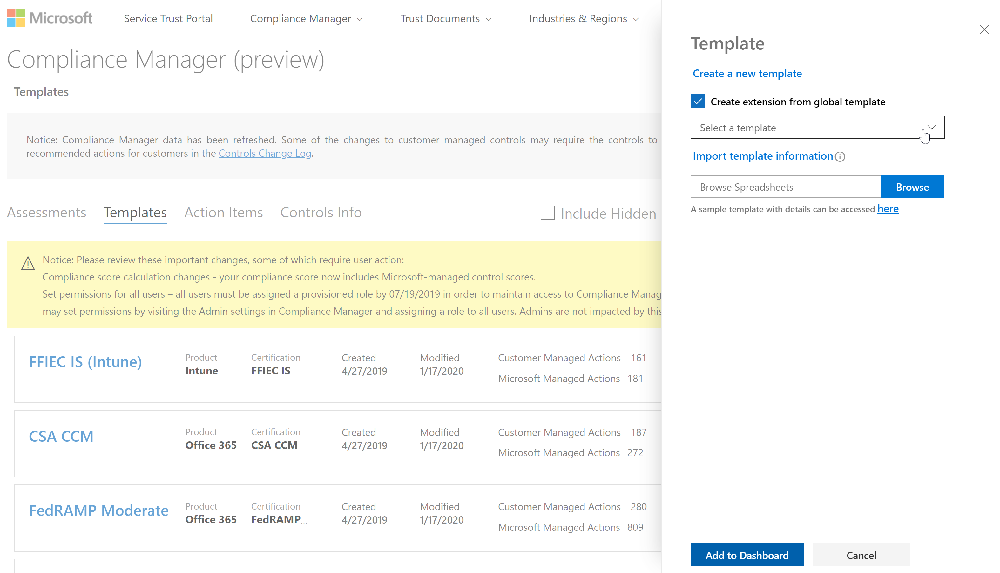

# Microsoft Compliance Score (anteprima) aggiornamentiMicrosoft Compliance Score (Preview) updates

 In questo articolo vengono fornite informazioni dettagliate sugli aggiornamenti futuri di Microsoft Compliance [Score](compliance-score.md) e [Microsoft Compliance Manager](compliance-manager-overview.md).This article provides details about future updates to [Microsoft Compliance Score](compliance-score.md) and [Microsoft Compliance Manager](compliance-manager-overview.md). Ulteriori informazioni sulla [relazione](compliance-score-release-notes.md#compliance-score-relationship-to-compliance-manager).Learn more about their [relationship](compliance-score-release-notes.md#compliance-score-relationship-to-compliance-manager).

## Processi di creazione e aggiornamento dei modelli miglioratiImproved template creation and update processes

Il processo di importazione, esportazione e modifica dei modelli per le valutazioni è semplificato.We're simplifying the process for importing, exporting, and modifying templates for assessments. La nuova esperienza renderà più facile portare le proprie valutazioni nel punteggio di conformità e mantenerle aggiornate.The new experience will make it easier for you to bring your own assessments into Compliance Score and keep them updated.

### Il processo correnteThe current process

Esistono due modi per creare un modello in Compliance Manager.There are two ways to create a template in Compliance Manager. È possibile copiare un modello esistente oppure importare i dati dei modelli da un foglio di calcolo di Excel in un nuovo modello.You can copy an existing template, or you can import template data from an Excel spreadsheet into a new template. Dalla pagina **modelli** è possibile selezionare **+ Aggiungi modello** per creare un nuovo modello immettendo un nome, selezionando dimensioni e caricando un file di Excel con un formato e uno schema specifici.From your **Templates** page, you select **+ Add template** to create a brand new template by entering a name, selecting dimensions, and uploading an Excel file with a specific format and schema. In alternativa, è possibile controllare la **copia da una casella modello esistente** , selezionare un modello da copiare e verificare le dimensioni, come illustrato nell'immagine riportata di seguito.Or you can check the **Copy from an existing template** box, select a template to copy, and verify dimensions, as shown in the image below. La personalizzazione del modello richiede un [processo](working-with-compliance-manager.md#templates) in più passaggi che inizia con la selezione di **Aggiungi controllo personalizzato** dopo la creazione del modello.Customizing your template requires a [multi-step process](working-with-compliance-manager.md#templates) that begins by selecting **Add custom control** after creating your template.

### Cosa cambiaWhat's changing

Per creare nuovi modelli è più facile.We're making it easier for you to create new templates. In un processo di **estensione** a un solo passaggio, è possibile aggiungere un foglio di calcolo con le azioni e i controlli a un modello Microsoft esistente per rendere la propria versione personalizzata.In a one-step **extension** process, you can add a spreadsheet with your actions and controls to an existing Microsoft template to make your own customized version. Nel riquadro a comparsa **modello** selezionare la casella di controllo **Crea estensione da modello globale** , come illustrato nell'immagine seguente.On the **Template** flyout pane, select the **Create extension from global template** checkbox, as shown in the image below. Verranno quindi aggiunte le personalizzazioni utilizzando un nuovo formato di Excel meno complesso rispetto a quello corrente.You'll then add customizations using a new Excel format that is less complex than the current one. Questo nuovo processo sostituisce la **copia corrente da un modello esistente** e **aggiunge funzioni di controllo personalizzate** .This new process replaces the current **Copy from an existing template** and **Add custom control** functions.

Ogni volta che la valutazione originale viene aggiornata tramite il processo di controllo delle versioni descritto di seguito, la valutazione personalizzata erediterà tali aggiornamenti e manterrà i controlli personalizzati.Each time the original assessment is updated through the versioning process outlined below, your customized assessment will inherit those updates and keep your custom controls.

È inoltre possibile semplificare la modifica dei modelli esistenti.We're also making it easier to modify your own existing templates. È possibile esportare il modello, modificare la stessa cartella di lavoro e quindi importarlo con le modifiche salvate.You can export your template, make changes in the same workbook, then import it with your edits saved.

## Avviso per il controllo delle versioniVersioning notice and control

L'organizzazione riceverà valutazioni aggiornate nella prossima versione di Score compliance e Compliance Manager per aiutarti a allineare gli aggiornamenti relativi alla certificazione e alle normative.Your organization will receive updated assessments in the next release of Compliance Score and Compliance Manager to help you align with certification and regulation updates.

In futuro, ogni volta che un aggiornamento è disponibile per il modello di una valutazione o per un'azione di miglioramento, un'icona di avviso informa che è pronto un aggiornamento.Going forward, whenever an update is available for an assessment's template or an improvement action, an alert icon notifies you that an update is ready. Quando si fa clic su quell'icona, viene visualizzata una finestra popup che spiega l'aggiornamento e chiede di accettare.When you click on that icon, a pop-up window explains the update and prompts you to accept. Di seguito è riportato un esempio di avviso per il controllo delle versioni per una valutazione:Below is an example of the versioning alert for an assessment:

Se si seleziona l'icona di avviso, viene illustrato un riquadro a comparsa che illustra l'aggiornamento e viene richiesto di accettare:Selecting the alert icon reveals a flyout pane explaining the update and prompting you to accept:

## Azioni comuni lo stato di sincronizzazione tra i gruppiCommon actions will synch status across groups

Se l'organizzazione dispone di più gruppi di valutazioni, il comportamento delle azioni **tecniche** (ovvero azioni che interessano l'intera organizzazione) cambierà.If your organization has multiple groups of assessments, the behavior of **Technical** actions (that is, actions affecting your entire organization) will change. Tutte le azioni duplicate tra i gruppi verranno combinate in un'unica azione.Any duplicate actions across groups will be combined into one single action. Tale azione singola conterrà tutte le note e le evidenze caricate dalle versioni duplicate.That single action will contain all uploaded notes and evidence from the duplicate versions. Con questa modifica, le azioni tecniche si comporteranno come attualmente fanno quando appartengono allo stesso gruppo.With this change, technical actions will behave as they currently do when they belong to the same group. Tutte le modifiche apportate all'azione in un gruppo o in una valutazione verranno riflesse in tutte le istanze.Any change made to the action in one group or assessment will now be reflected in all instances. Lo **stato di implementazione**, l' **implementazione dat**, **lo stato del test**e la **Data** di test rispecchiano gli aggiornamenti più recenti.The **Implementation Status**, **Implementation Dat**, **Test Status**, and **Test Date** will reflect the most recent updates.

## Supporto lingueLanguage support

Il Punteggio di conformità sarà ora disponibile nelle seguenti lingue oltre all'inglese: cinese (semplificato), cinese (tradizionale), francese, tedesco, italiano, giapponese, coreano, portoghese (Brasile), russo e spagnolo.Compliance Score will now be available in the following languages in addition to English: Chinese (Simplified), Chinese (Traditional), French, German, Italian, Japanese, Korean, Portuguese (Brazil), Russian, and Spanish.
