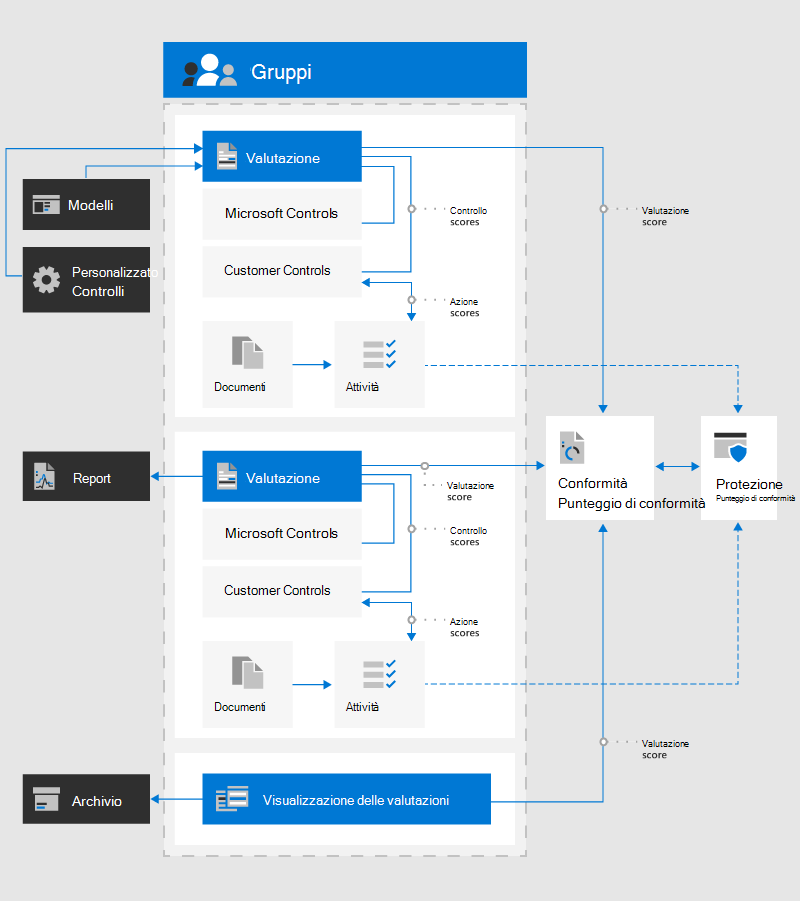

# Punteggio di conformità Microsoft (anteprima)Microsoft Compliance Score (Preview)

Il Punteggio di conformità di Microsoft contribuisce a semplificare il modo in cui gestire la conformità e ridurre i rischi di conformità tramite un'esperienza facile da usare.Microsoft Compliance Score helps to simplify the way you manage compliance and reduce compliance risks through a user-friendly experience. Il Punteggio di conformità è ora disponibile per l'anteprima pubblica nel [centro conformità di Microsoft 365](microsoft-365-compliance-center.md).Compliance Score is now available for public preview in the  [Microsoft 365 compliance center](microsoft-365-compliance-center.md).

**In questo articolo:** Leggere questo articolo per comprendere quale punteggio di conformità è e come configurarlo per l'organizzazione.**In this article:** Read this article to understand what Compliance Score is and how to set it up for your organization.

Informazioni **sugli aggiornamenti:** Andare alla note sulla versione del [Punteggio di conformità](compliance-score-release-notes.md) per visualizzare i problemi nuovi e noti con la versione di anteprima del Punteggio di conformità.**Learn about updates:** Go to the [Compliance Score release notes](compliance-score-release-notes.md) to see what's new and known issues with the preview version of Compliance Score.

## Che cos'è il Punteggio di conformitàWhat is Compliance Score

Microsoft Compliance Score è una funzionalità di anteprima del centro conformità di Microsoft 365 che consente di comprendere la posizione di conformità dell'organizzazione.Microsoft Compliance Score is a preview feature in the Microsoft 365 compliance center to help you understand your organization’s compliance posture. Calcola un punteggio basato sui rischi misurando lo stato di avanzamento del processo di completamento delle azioni che consentono di ridurre i rischi per la protezione dei dati e gli standard normativi.It calculates a risk-based score measuring your progress in completing actions that help reduce risks around data protection and regulatory standards.

È possibile utilizzare il Punteggio di conformità come strumento per monitorare tutte le valutazioni dei rischi.You can use Compliance Score as a tool to track all of your risk assessments. Offre funzionalità di flusso di lavoro che consentono di completare efficacemente le valutazioni dei rischi tramite uno strumento comune.It provides workflow capabilities to help you efficiently complete your risk assessments through a common tool.

Se attualmente si utilizza [Compliance Manager](compliance-manager-overview.md), si noterà che il Punteggio di conformità è ora una funzionalità autonoma con una progettazione più semplice e più facile da usare per gestire più facilmente la conformità.If you currently use [Compliance Manager](compliance-manager-overview.md), you’ll notice that Compliance Score is now a standalone feature with a simpler, more user-friendly design to help you manage compliance more easily. 

La pagina principale del Punteggio di conformità è il dashboard personalizzato.The main Compliance Score page is your custom dashboard. Mostra il tuo punteggio corrente, ti aiuta a vedere cosa ha bisogno di attenzioni e ti guida alle azioni per migliorare il tuo punteggio.It shows your current score, helps you see what needs attention, and guides you to actions to improve your score. Il dashboard del Punteggio di conformità avrà l'aspetto seguente:Your Compliance Score dashboard will look like this:

### Gestione della conformità semplificataSimplified compliance management

Il Punteggio di conformità consente di semplificare la gestione della conformità fornendo:Compliance Score helps simplify compliance management by providing:

- **Valutazioni continue**: consente di analizzare automaticamente gli ambienti Microsoft 365 per rilevare e monitorare l'efficacia dei controlli di protezione dei dati nel sistema**Continuous assessments**: automatically scans through your Microsoft 365 environments to detect and monitor the effectiveness of data protection controls in your system
- **Azioni consigliate**: fornisce consigli e istruzioni dettagliate su come implementare i controlli per massimizzare il Punteggio**Recommended actions**: provides recommendations and step-by-step guidance for how to implement controls to maximize your score
-  **Mapping di controllo incorporato**: consente di rimanere aggiornati con il paesaggio di conformità in evoluzione fornendo un Framework di controllo comune incorporato.**Built-in control mapping**: helps you stay current with the evolving compliance landscape by providing a built-in common control framework

> [!IMPORTANT] 
> Il Punteggio di conformità non esprime una misura assoluta di conformità organizzativa rispetto a una norma o a un regolamento particolari.Compliance Score does not express an absolute measure of organizational compliance with any particular standard or regulation. Esprime la misura in cui sono stati adottati controlli che possono ridurre i rischi per i dati personali e la privacy individuale.It expresses the extent to which you have adopted controls which can reduce the risks to personal data and individual privacy. Le raccomandazioni del Punteggio di conformità e del Compliance Manager non devono essere interpretate come garanzia di conformità.Recommendations from Compliance Score and Compliance Manager should not be interpreted as a guarantee of compliance. Questo servizio è attualmente in anteprima ed è soggetto ai termini e alle condizioni nelle condizioni dei [servizi online](https://go.microsoft.com/fwlink/?linkid=2108910).This service is currently in preview and is subject to the terms and conditions in the [Online Services Terms](https://go.microsoft.com/fwlink/?linkid=2108910).

## Relazione con Compliance ManagerRelationship to Compliance Manager

Considerare la conformità score come versione semplificata di Compliance Manager.Think of Compliance Score as a simplified version of Compliance Manager. Mentre i due esistono come strumenti distinti ma integrati, il Punteggio di conformità rende più facile monitorare la postura di conformità globale e adottare misure per migliorarla.While the two exist as distinct yet integrated tools, Compliance Score makes it easier to monitor your overall compliance posture and take steps to improve it.

Punteggio di conformità condivide lo stesso backend con Compliance Manager, quindi qualsiasi dato che potrebbe essere già presente in Compliance Manager mostrerà il Punteggio di conformità.Compliance Score shares the same backend with Compliance Manager, so any data you may already have in Compliance Manager will show in Compliance Score.

Durante l'anteprima pubblica, alcune funzionalità rimangono solo in Compliance Manager, ad esempio la gestione delle valutazioni e la creazione di modelli.During public preview, some functionality remains solely in Compliance Manager, such as managing assessments and creating templates. Si consiglia di iniziare tutte le attività di gestione della conformità in Score Compliance.We recommend beginning all of your compliance management activities in Compliance Score. Quando si accede a funzioni gestite da Compliance Manager, si verrà guidati a tale strumento.When you come to functions handled by Compliance Manager, you will be guided to that tool. Per questo motivo, alcuni di questi documenti indirizzano gli argomenti di Compliance Manager.For that reason, some of this documentation directs you to Compliance Manager topics.

Ulteriori informazioni sulla relazione tra Score compliance e Compliance Manager nelle [Note sulla versione del Punteggio di conformità](compliance-score-release-notes.md).Learn more about the relationship between Compliance Score and Compliance Manager in the [Compliance Score release notes](compliance-score-release-notes.md).

## Informazioni sul PunteggioUnderstanding your score

Punteggio di conformità fornisce un punteggio iniziale basato sulla linea di base per la protezione dei dati di Microsoft 365.Compliance Score gives you an initial score based on the Microsoft 365 data protection baseline. Questa linea di base è un insieme di controlli che include normative e standard industriali comuni.This baseline is a set of controls that includes common industry regulations and standards. Anche se questo punteggio è un buon punto di partenza per valutare la postura di conformità, il Punteggio di conformità diventa più potente dopo aver aggiunto valutazioni più rilevanti per la propria organizzazione.While this score is a good starting point for assessing your compliance posture, Compliance Score becomes more powerful once you add assessments that are more relevant to your organization.

Ad esempio, se l'organizzazione appartiene al settore dei servizi finanziari, potrebbe essere necessario aggiungere la valutazione di FFIEC.For example, if your organization belongs to the financial services industry, you may want to add the FFIEC assessment. Se l'organizzazione appartiene all'industria del settore sanitario, è possibile aggiungere la valutazione HIPAA/HITECH.If your organization belongs to the healthcare industry, you can add the HIPAA/HITECH assessment. Informazioni su come [aggiungere valutazioni in Compliance Manager](working-with-compliance-manager.md#assessments).Learn how to [add assessments in Compliance Manager](working-with-compliance-manager.md#assessments).

Per ulteriori informazioni [, vedere Calcolo del Punteggio di conformità e monitoraggio continuo](compliance-score-methodology.md).Learn more about [how your compliance score is calculated and continuously monitored](compliance-score-methodology.md).

## Componenti principali: controlli, valutazioni, modelli, gruppiKey components: controls, assessments, templates, groups

Il Punteggio di conformità utilizza diversi componenti per facilitare la gestione delle attività di conformità.Compliance Score uses several components to help you manage your compliance activities. Quando si utilizza il Punteggio di conformità per assegnare, testare e monitorare le attività di conformità, è utile avere una conoscenza di base di questi componenti chiave.As you use Compliance Score to assign, test, and monitor compliance activities, it’s helpful to have a basic understanding of these key components. In questo diagramma vengono illustrate le relazioni tra di essi:This diagram shows the relationships among them:

### ControlliControls

Un controllo definisce come valutare e gestire la configurazione del sistema, il processo organizzativo e la responsabilità degli utenti per rispondere a un requisito specifico di un criterio normativo, standard o interno.A control defines how you assess and manage system configuration, organizational process, and people accountability to meet a specific requirement of a regulation, standard, or internal policy.

Il Punteggio di conformità tiene traccia di due tipi di controlli:Compliance Score tracks two types of controls:

1. **Controlli gestiti da Microsoft**: controlli per i servizi cloud Microsoft, che Microsoft è responsabile dell'implementazione**Microsoft-managed controls**: controls for Microsoft cloud services, which Microsoft is responsible for implementing
2. **Controlli gestiti dal cliente**: controlli gestiti dall'organizzazione, che sono responsabili dell'implementazione**Customer-managed controls**: controls managed by your organization, which you are responsible for implementing
 
### ValutazioniAssessments

Una valutazione è una valutazione di un modello che avvia il processo di punteggio per la propria organizzazione.An assessment is an evaluation of a template that initiates the scoring process for your organization. Le valutazioni raggruppano le azioni necessarie per soddisfare i requisiti di una norma, di una normativa o di una legge.Assessments group the actions necessary to meet the requirements of a standard, regulation, or law. Ad esempio, si può avere una valutazione che, quando si completano tutte le azioni all'interno di esso, porta le impostazioni di Office 365 in linea con i requisiti ISO 27001.For example, you may have an assessment that, when you complete all actions within it, brings your Office 365 settings in line with ISO 27001 requirements.

Per impostazione predefinita, il Punteggio di conformità fornisce alla propria organizzazione una valutazione basata sulla linea di base per la protezione dei dati di Microsoft 365, una raccomandazione per la riduzione dei rischi di protezione e conformità ai dati (ulteriori[informazioni](compliance-score-methodology.md#initial-score-based-on-microsoft-365-data-protection-baseline)).By default, Compliance Score provides your organization with an assessment based on the Microsoft 365 data protection baseline, a recommendation for reducing your data protection and compliance risks ([learn more](compliance-score-methodology.md#initial-score-based-on-microsoft-365-data-protection-baseline)).

Le valutazioni includono diversi componenti:Assessments include several components:

- **Servizi nell'ambito**: l'insieme specifico di servizi Microsoft applicabile alla valutazione**In-scope services**: the specific set of Microsoft services applicable to the assessment
- **Controlli gestiti da Microsoft**: controlli che Microsoft ha implementato e testato**Microsoft-managed controls**: controls that Microsoft implemented and tested
- **Controlli gestiti dal cliente**: controlli da gestire**Customer-managed controls**: controls that you manage
- **Punteggio di valutazione**: la percentuale dei punti ottenuti completando le azioni all'interno di tale valutazione**Assessment score**: the percentage of the points achieved by completing actions within that assessment

> [!NOTE]
> Punteggio di conformità consente di visualizzare le valutazioni e la modalità di factoring nel punteggio generale.Compliance Score displays your assessments and how they factor into your overall score. Tuttavia, durante l'anteprima pubblica si verrà indirizzati a Compliance Manager per gestire le proprie valutazioni.However, during public preview you will be directed to Compliance Manager to manage your assessments.

Visualizzare istruzioni dettagliate per l' [utilizzo di valutazioni in Compliance Manager](working-with-compliance-manager.md#assessments).View detailed instructions for [working with assessments in Compliance Manager](working-with-compliance-manager.md#assessments).

### ModelliTemplates

Il Punteggio di conformità fornisce modelli preconfigurati per le valutazioni.Compliance Score provides pre-configured templates for assessments. Il Punteggio di conformità consente inoltre di creare modelli per le proprie valutazioni per soddisfare le proprie esigenze.Compliance Score also allows you to create templates for your own assessments to suit your needs. Ad esempio, è possibile creare un modello per il controllo del processo aziendale oppure un modello per uno standard di protezione dei dati o di conformità regionale non incluso in uno dei modelli già configurati.For example, you can create a template for your business process control, or a template for a regional data protection or compliance standard that isn’t covered by one of the pre-configured templates.  Creando modelli personalizzati, è possibile creare valutazioni personalizzate per garantire che il Punteggio di conformità ricerchi non solo le valutazioni cloud di Microsoft, ma anche altre valutazioni dei rischi nell'ambito della propria organizzazione.By creating your own templates, you can create custom assessments to ensure that Compliance Score tracks not only Microsoft cloud assessments, but also any other risk assessments in scope for your organization.

È possibile creare nuovi modelli copiando un modello esistente o importando le informazioni sui controlli da un file di Excel.You can create new templates by copying an existing template, or by importing controls information from an Excel file. Visualizzare istruzioni dettagliate per la [creazione di modelli in Compliance Manager](working-with-compliance-manager.md#templates).View detailed instructions for [creating templates in Compliance Manager](working-with-compliance-manager.md#templates).

I modelli preconfigurati per il Punteggio di conformità sono:The pre-configured templates for Compliance Score are:

1. [Legge generale sulla protezione dei dati (LGPD) in BrasileBrazil General Data Protection Law (LGPD)](https://go.microsoft.com/fwlink/?linkid=2115387)
2. [California Consumer Privacy Act (CCPA)](https://go.microsoft.com/fwlink/?linkid=2108871) (anteprima)[California Consumer Privacy Act (CCPA)](https://go.microsoft.com/fwlink/?linkid=2108871) (Preview)
3. [Matrice dei controlli cloud di Cloud Security Alliance (CSA) (CCM) 3.0.1Cloud Security Alliance (CSA) Cloud Controls Matrix (CCM) 3.0.1](https://go.microsoft.com/fwlink/?linkid=2109076)
4. [GDPR Unione europeaEuropean Union GDPR](https://go.microsoft.com/fwlink/?linkid=2108870)
5. [Opuscolo sulla sicurezza delle istituzioni finanziarie federali (FFIEC)Federal Financial Institutions Examination Council (FFIEC) Information Security Booklet](https://go.microsoft.com/fwlink/?linkid=2109077)
6. [FedRAMP moderatoFedRAMP Moderate](https://go.microsoft.com/fwlink/?linkid=2108869)
7. [HIPAA](https://go.microsoft.com/fwlink/?linkid=2109078) / [Hitech](https://go.microsoft.com/fwlink/?linkid=2109079) HIPAA[HIPAA](https://go.microsoft.com/fwlink/?linkid=2109078) / [HITECH](https://go.microsoft.com/fwlink/?linkid=2109079)
8. [IRAP](https://go.microsoft.com/fwlink/?linkid=2113709) / ISM (anteprima) del[governo australiano](https://go.microsoft.com/fwlink/?linkid=2113024) di IRAP[IRAP](https://go.microsoft.com/fwlink/?linkid=2113709) / [Australian Government ISM](https://go.microsoft.com/fwlink/?linkid=2113024) (Preview)
9. [ISO 27001:2013ISO 27001:2013](https://go.microsoft.com/fwlink/?linkid=2109073)
10. [ISO 27018:2014ISO 27018:2014](https://go.microsoft.com/fwlink/?linkid=2109074)
11. [ISO 27701:2019ISO 27701:2019](https://go.microsoft.com/fwlink/?linkid=2113025)
12. [Linea di base per la protezione dei dati di Microsoft 365Microsoft 365 Data Protection Baseline](compliance-score-methodology.md#initial-score-based-on-microsoft-365-data-protection-baseline)
13. [NIST 800-53 Rev. 4NIST 800-53 Rev. 4](https://go.microsoft.com/fwlink/?linkid=2109075)
14. [NIST 800-171NIST 800-171](https://go.microsoft.com/fwlink/?linkid=2108867)
15. [NIST Cybersecurity Framework (CSF)NIST Cybersecurity Framework (CSF)](https://go.microsoft.com/fwlink/?linkid=2108868)
16. [SOC 1SOC 1](https://go.microsoft.com/fwlink/?linkid=2115184)
17. [SOC 2SOC 2](https://go.microsoft.com/fwlink/?linkid=2115184)

> [!NOTE]
> Durante l'anteprima pubblica, passare a Compliance Manager per creare e gestire i modelli.During public preview, go to Compliance Manager to create and manage your templates.

### GruppiGroups

I gruppi consentono di organizzare valutazioni in modo logico.Groups allow you to organize assessments in a way that is logical to you. Ad esempio, è possibile scegliere di raggruppare le valutazioni per anno, standard di conformità, servizi, team all'interno dell'organizzazione o in qualche altro modo.For example, you may choose to group assessments by year, compliance standard, service, teams within your organization, or some other way.

Quando due diverse valutazioni nello stesso gruppo condividono azioni gestite dal cliente, il completamento dei dettagli dell'implementazione, il testing e lo stato dell'azione in una valutazione vengono sincronizzati automaticamente alla stessa azione in qualsiasi altra valutazione del gruppo.When two different assessments in the same group share customer-managed actions, the completion of implementation details, testing, and status for the action in one assessment automatically synchronizes to the same action in any other assessment in the group. Questo unisce le azioni di miglioramento assegnate all'interno del gruppo e riduce il lavoro di duplicazione.This unifies the assigned improvement actions across the group and reduces duplicating work.

Informazioni su come [creare i gruppi in Compliance Manager](working-with-compliance-manager.md#groups).Learn how to [create groups in Compliance Manager](working-with-compliance-manager.md#groups). Dopo aver creato i gruppi, è possibile [filtrare il dashboard del Punteggio di conformità](compliance-score-setup.md#filtering-your-dashboard-view) per visualizzare il Punteggio di uno o più gruppi.Once you create groups, you can [filter you Compliance Score dashboard](compliance-score-setup.md#filtering-your-dashboard-view) to view your score by one or more groups.

## Passaggio successivo: avviare l'installazioneNext step: begin setup

Informazioni su come eseguire l'accesso, impostare le autorizzazioni e configurare gli aggiornamenti e le visualizzazioni del dashboard all' [installazione del Punteggio di conformità](compliance-score-setup.md).Learn how to sign in, set up permissions, and configure updates and dashboard views at [Compliance Score setup](compliance-score-setup.md).
