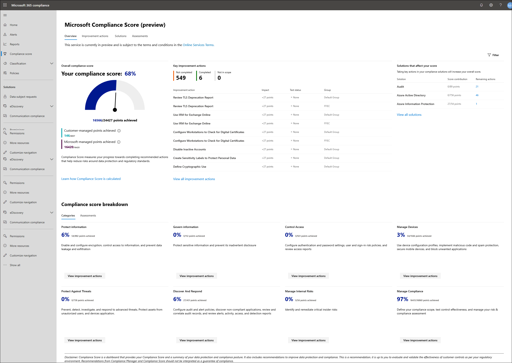

# Punteggio di conformità Microsoft (anteprima)

Il Punteggio di conformità di Microsoft contribuisce a semplificare il modo in cui gestire la conformità e ridurre i rischi di conformità tramite un'esperienza facile da usare. Il Punteggio di conformità è ora disponibile per l'anteprima pubblica nel [centro conformità di Microsoft 365](microsoft-365-compliance-center.md).

**In questo articolo:** Leggere questo articolo per comprendere quale punteggio di conformità è e come configurarlo per l'organizzazione.

Informazioni **sugli aggiornamenti:** Andare alla note sulla versione del [Punteggio di conformità](compliance-score-release-notes.md) per visualizzare i problemi nuovi e noti con la versione di anteprima del Punteggio di conformità.

## Che cos'è il Punteggio di conformità

Microsoft Compliance Score è una funzionalità di anteprima del centro conformità di Microsoft 365 che consente di comprendere la posizione di conformità dell'organizzazione. Calcola un punteggio basato sui rischi misurando lo stato di avanzamento del processo di completamento delle azioni che consentono di ridurre i rischi per la protezione dei dati e gli standard normativi.

È possibile utilizzare il Punteggio di conformità come strumento per monitorare tutte le valutazioni dei rischi. Offre funzionalità di flusso di lavoro che consentono di completare efficacemente le valutazioni dei rischi tramite uno strumento comune.

Se attualmente si utilizza [Compliance Manager](compliance-manager-overview.md), si noterà che il Punteggio di conformità è ora una funzionalità autonoma con una progettazione più semplice e più facile da usare per gestire più facilmente la conformità. 

La pagina principale del Punteggio di conformità è il dashboard personalizzato. Mostra il tuo punteggio corrente, ti aiuta a vedere cosa ha bisogno di attenzioni e ti guida alle azioni per migliorare il tuo punteggio. Il dashboard del Punteggio di conformità avrà l'aspetto seguente:

### Gestione della conformità semplificata

Il Punteggio di conformità consente di semplificare la gestione della conformità fornendo:

- **Valutazioni continue**: consente di analizzare automaticamente gli ambienti Microsoft 365 per rilevare e monitorare l'efficacia dei controlli di protezione dei dati nel sistema
- **Azioni consigliate**: fornisce consigli e istruzioni dettagliate su come implementare i controlli per massimizzare il Punteggio
-  **Mapping di controllo incorporato**: consente di rimanere aggiornati con il paesaggio di conformità in evoluzione fornendo un Framework di controllo comune incorporato.

> [!IMPORTANT] 
> Il Punteggio di conformità non esprime una misura assoluta di conformità organizzativa rispetto a una norma o a un regolamento particolari. Esprime la misura in cui sono stati adottati controlli che possono ridurre i rischi per i dati personali e la privacy individuale. Le raccomandazioni del Punteggio di conformità e del Compliance Manager non devono essere interpretate come garanzia di conformità. Questo servizio è attualmente in anteprima ed è soggetto ai termini e alle condizioni nelle condizioni dei [servizi online](https://go.microsoft.com/fwlink/?linkid=2108910).

## Relazione con Compliance Manager

Considerare la conformità score come versione semplificata di Compliance Manager. Mentre i due esistono come strumenti distinti ma integrati, il Punteggio di conformità rende più facile monitorare la postura di conformità globale e adottare misure per migliorarla.

Punteggio di conformità condivide lo stesso backend con Compliance Manager, quindi qualsiasi dato che potrebbe essere già presente in Compliance Manager mostrerà il Punteggio di conformità.

Durante l'anteprima pubblica, alcune funzionalità rimangono solo in Compliance Manager, ad esempio la gestione delle valutazioni e la creazione di modelli. Si consiglia di iniziare tutte le attività di gestione della conformità in Score Compliance. Quando si accede a funzioni gestite da Compliance Manager, si verrà guidati a tale strumento. Per questo motivo, alcuni di questi documenti indirizzano gli argomenti di Compliance Manager.

Ulteriori informazioni sulla relazione tra Score compliance e Compliance Manager nelle [Note sulla versione del Punteggio di conformità](compliance-score-release-notes.md).

## Informazioni sul Punteggio

Punteggio di conformità fornisce un punteggio iniziale basato sulla linea di base per la protezione dei dati di Microsoft 365. Questa linea di base è un insieme di controlli che include normative e standard industriali comuni. Anche se questo punteggio è un buon punto di partenza per valutare la postura di conformità, il Punteggio di conformità diventa più potente dopo aver aggiunto valutazioni più rilevanti per la propria organizzazione.

Ad esempio, se l'organizzazione appartiene al settore dei servizi finanziari, potrebbe essere necessario aggiungere la valutazione di FFIEC. Se l'organizzazione appartiene all'industria del settore sanitario, è possibile aggiungere la valutazione HIPAA/HITECH. Informazioni su come [aggiungere valutazioni in Compliance Manager](working-with-compliance-manager.md#assessments).

Per ulteriori informazioni [, vedere Calcolo del Punteggio di conformità e monitoraggio continuo](compliance-score-methodology.md).

## Componenti principali: controlli, valutazioni, modelli, gruppi

Il Punteggio di conformità utilizza diversi componenti per facilitare la gestione delle attività di conformità. Quando si utilizza il Punteggio di conformità per assegnare, testare e monitorare le attività di conformità, è utile avere una conoscenza di base di questi componenti chiave. In questo diagramma vengono illustrate le relazioni tra di essi:

### Controlli

Un controllo definisce come valutare e gestire la configurazione del sistema, il processo organizzativo e la responsabilità degli utenti per rispondere a un requisito specifico di un criterio normativo, standard o interno.

Il Punteggio di conformità tiene traccia di due tipi di controlli:

1. **Controlli gestiti da Microsoft**: controlli per i servizi cloud Microsoft, che Microsoft è responsabile dell'implementazione
2. **Controlli gestiti dal cliente**: controlli gestiti dall'organizzazione, che sono responsabili dell'implementazione
 
### Valutazioni

Una valutazione è una valutazione di un modello che avvia il processo di punteggio per la propria organizzazione. Le valutazioni raggruppano le azioni necessarie per soddisfare i requisiti di una norma, di una normativa o di una legge. Ad esempio, si può avere una valutazione che, quando si completano tutte le azioni all'interno di esso, porta le impostazioni di Office 365 in linea con i requisiti ISO 27001.

Per impostazione predefinita, il Punteggio di conformità fornisce alla propria organizzazione una valutazione basata sulla linea di base per la protezione dei dati di Microsoft 365, una raccomandazione per la riduzione dei rischi di protezione e conformità ai dati (ulteriori[informazioni](compliance-score-methodology.md#initial-score-based-on-microsoft-365-data-protection-baseline)).

Le valutazioni includono diversi componenti:

- **Servizi nell'ambito**: l'insieme specifico di servizi Microsoft applicabile alla valutazione
- **Controlli gestiti da Microsoft**: controlli che Microsoft ha implementato e testato
- **Controlli gestiti dal cliente**: controlli da gestire
- **Punteggio di valutazione**: la percentuale dei punti ottenuti completando le azioni all'interno di tale valutazione

> [!NOTE]
> Punteggio di conformità consente di visualizzare le valutazioni e la modalità di factoring nel punteggio generale. Tuttavia, durante l'anteprima pubblica si verrà indirizzati a Compliance Manager per gestire le proprie valutazioni.

Visualizzare istruzioni dettagliate per l' [utilizzo di valutazioni in Compliance Manager](working-with-compliance-manager.md#assessments).

### Modelli

Il Punteggio di conformità fornisce modelli preconfigurati per le valutazioni. Il Punteggio di conformità consente inoltre di creare modelli per le proprie valutazioni per soddisfare le proprie esigenze. Ad esempio, è possibile creare un modello per il controllo del processo aziendale oppure un modello per uno standard di protezione dei dati o di conformità regionale non incluso in uno dei modelli già configurati.  Creando modelli personalizzati, è possibile creare valutazioni personalizzate per garantire che il Punteggio di conformità ricerchi non solo le valutazioni cloud di Microsoft, ma anche altre valutazioni dei rischi nell'ambito della propria organizzazione.

È possibile creare nuovi modelli copiando un modello esistente o importando le informazioni sui controlli da un file di Excel. Visualizzare istruzioni dettagliate per la [creazione di modelli in Compliance Manager](working-with-compliance-manager.md#templates).

I modelli preconfigurati per il Punteggio di conformità sono:

1. [ISO 27001:2013](https://go.microsoft.com/fwlink/?linkid=2109073)
2. [ISO 27018:2014](https://go.microsoft.com/fwlink/?linkid=2109074)
3. [ISO 27701:2019](https://go.microsoft.com/fwlink/?linkid=2113025)
4. [NIST 800-53 Rev. 4](https://go.microsoft.com/fwlink/?linkid=2109075)
5. [NIST 800-171](https://go.microsoft.com/fwlink/?linkid=2108867)
6. [NIST Cybersecurity Framework (CSF)](https://go.microsoft.com/fwlink/?linkid=2108868)
7. [Matrice dei controlli cloud di Cloud Security Alliance (CSA) (CCM) 3.0.1](https://go.microsoft.com/fwlink/?linkid=2109076)
8. [Opuscolo sulla sicurezza delle istituzioni finanziarie federali (FFIEC)](https://go.microsoft.com/fwlink/?linkid=2109077) 
9.  / [Hitech](https://go.microsoft.com/fwlink/?linkid=2109079) HIPAA
10. [FedRAMP moderato](https://go.microsoft.com/fwlink/?linkid=2108869)
11. [GDPR Unione europea](https://go.microsoft.com/fwlink/?linkid=2108870)
12. [California Consumer Privacy Act (CCPA)](https://go.microsoft.com/fwlink/?linkid=2108871) (anteprima)
13.  / ISM (anteprima) del[governo australiano](https://go.microsoft.com/fwlink/?linkid=2113024) di IRAP
14. [Linea di base per la protezione dei dati di Microsoft 365](compliance-score-methodology.md#initial-score-based-on-microsoft-365-data-protection-baseline)

> [!NOTE]
> Durante l'anteprima pubblica, passare a Compliance Manager per creare e gestire i modelli.

### Gruppi

I gruppi consentono di organizzare valutazioni in modo logico. Ad esempio, è possibile scegliere di raggruppare le valutazioni per anno, standard di conformità, servizi, team all'interno dell'organizzazione o in qualche altro modo.

Quando due diverse valutazioni nello stesso gruppo condividono azioni gestite dal cliente, il completamento dei dettagli dell'implementazione, il testing e lo stato dell'azione in una valutazione vengono sincronizzati automaticamente alla stessa azione in qualsiasi altra valutazione del gruppo. Questo unisce le azioni di miglioramento assegnate all'interno del gruppo e riduce il lavoro di duplicazione.

Informazioni su come [creare i gruppi in Compliance Manager](working-with-compliance-manager.md#groups). Dopo aver creato i gruppi, è possibile [filtrare il dashboard del Punteggio di conformità](compliance-score-setup.md#filtering-your-dashboard-view) per visualizzare il Punteggio di uno o più gruppi.

## Passaggio successivo: avviare l'installazione

Accedere, configurare le autorizzazioni e informazioni sul dashboard del Punteggio di conformità all' [installazione del Punteggio di conformità](compliance-score-setup.md).
