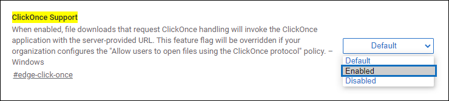
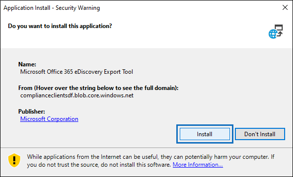

# Utilizzare lo strumento di esportazione di eDiscovery di Office 365 in Microsoft EdgeUse the Office 365 eDiscovery Export Tool in Microsoft Edge

A seguito delle recenti modifiche apportate a Microsoft Edge, il supporto ClickOnce non è più abilitato per impostazione predefinita.As a result of recent changes to Microsoft Edge, ClickOnce support is no longer enabled by default. Per continuare a utilizzare lo strumento di esportazione di Microsoft Office 365 eDiscovery per scaricare i risultati della ricerca di contenuto o eDiscovery, è necessario utilizzare [Microsoft Internet Explorer](https://support.microsoft.com/help/17621/internet-explorer-downloads) o abilitare il supporto di ClickOnce in Microsoft Edge.To continue using the Microsoft Office 365 eDiscovery Export Tool to download Content Search or eDiscovery search results, you either need to use [Microsoft Internet Explorer](https://support.microsoft.com/help/17621/internet-explorer-downloads) or enable ClickOnce support in Microsoft Edge.

## Come abilitare il supporto ClickOnce in Microsoft EdgeHow to enable ClickOnce support in Microsoft Edge

1. In Microsoft Edge, passare a **edge://flags/#edge-fare clic-una volta**.In Microsoft Edge, navigate to **edge://flags/#edge-click-once**.

2. Se il valore esistente è impostato su **predefinito** o **disabilitato** nell'elenco a discesa, impostarlo su **abilitato**.If the existing value is set to **Default** or **Disabled** in the dropdown list, change it to **Enabled**.
    
   

3. Scorrere verso il basso fino alla parte inferiore della finestra del browser e fare clic su **Riavvia** per riavviare Edge.Scroll down to the bottom of the browser window and click **Restart** to restart Edge.

   

**Nota:** Le organizzazioni possono utilizzare criteri di gruppo per disabilitare il supporto ClickOnce.**Note:** Organizations can use Group Policy to disable ClickOnce support. Per verificare se è presente un criterio di organizzazione per il supporto di ClickOnce, passare a **Edge://Policy**.To check if there is an organizational policy for ClickOnce support, navigate to **edge://policy**. Nella schermata seguente viene mostrato che ClickOnce è abilitata all'interno dell'intera organizzazione.The following screenshot shows that ClickOnce is enabled across the entire organization. Se il valore di questo criterio è impostato su **false**, sarà necessario contattare un amministratore dell'organizzazione.If this policy value is set to **false**, you will need to contact an admin in your organization.

## Installare ed eseguire lo strumento di esportazione di eDiscovery di Office 365Install and run the Office 365 eDiscovery Export Tool

1. Fare clic su **Scarica risultati** nella pagina a comparsa di un'esportazione in ricerca contenuto o in un caso di eDiscovery.Click **Download results** on the flyout page of an export in Content Search or an eDiscovery case.

   

2. Verrà visualizzata la richiesta di conferma per l'avvio dello strumento, fare clic su **Apri**.You will be prompted with a confirmation to launch the tool, Click **Open**.

   

   Se lo strumento di esportazione di Microsoft Office 365 eDiscovery non è installato, verrà visualizzato un avviso di sicurezza,If the Microsoft Office 365 eDiscovery Export Tool isn't installed, you will be prompted with a Security Warning, 

   

3. Fare clic su **Installa**.Click **Install**. Dopo l'installazione, lo strumento di esportazione verrà avviato automaticamente.After it's installed, the export tool will launch automatically.

Per ulteriori informazioni, vedere i seguenti argomenti:For more information, see the following topics:

- [Esportare i risultati della Ricerca contenutoExport Content Search results](export-search-results.md)

- [Come abilitare i flag degli esperimenti in Microsoft EdgeHow to enable experiment flags in Microsoft Edge](https://microsoftedgesupport.microsoft.com/hc/articles/360034075294-How-to-enable-experiment-flags-in-Microsoft-Edge-Insider-channels)
