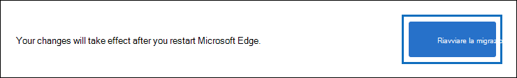
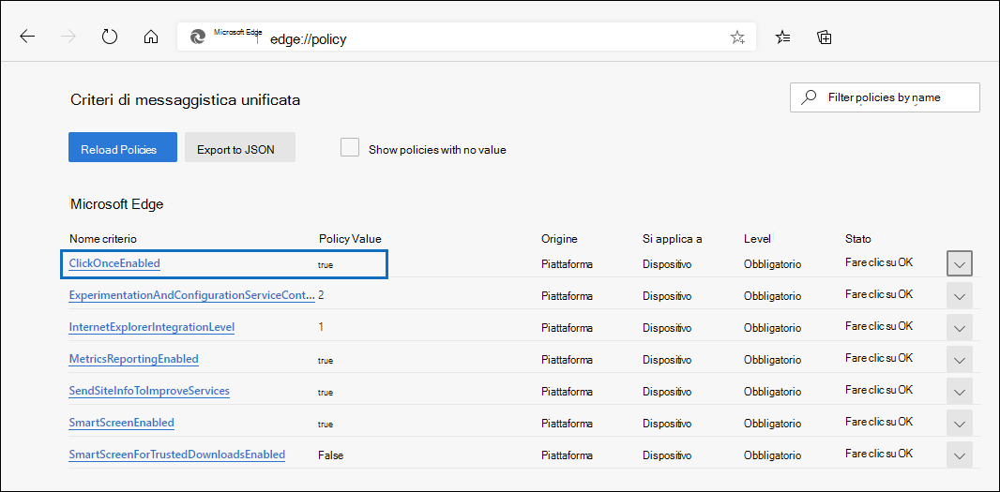
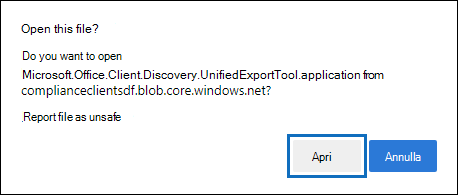

# Utilizzare lo strumento di esportazione di eDiscovery in Microsoft Edge

A seguito delle recenti modifiche apportate alla versione più recente di Microsoft Edge, il supporto ClickOnce non è più abilitato per impostazione predefinita. Per continuare a utilizzare lo strumento di esportazione di eDiscovery per scaricare i risultati della ricerca di contenuto o di eDiscovery, è necessario utilizzare [Microsoft Internet Explorer](https://support.microsoft.com/help/17621/internet-explorer-downloads) o abilitare il supporto di ClickOnce nella versione più recente di Microsoft Edge.

## Abilitare il supporto ClickOnce in Microsoft Edge

1. In Microsoft Edge, passare a **edge://flags/#edge-fare clic su-una volta**.

2. Se il valore esistente è impostato su **predefinito** o **disabilitato** nell'elenco a discesa, impostarlo su **abilitato**.

   

3. Scorrere verso il basso fino alla parte inferiore della finestra del browser e fare clic su **Riavvia** per riavviare Edge.

   

**Nota:** Le organizzazioni possono utilizzare criteri di gruppo per disabilitare il supporto ClickOnce. Per verificare se è presente un criterio di organizzazione per il supporto di ClickOnce, accedere a **Edge://Policy**. Nella schermata seguente viene mostrato che ClickOnce è abilitata all'interno dell'intera organizzazione. Se il valore di questo criterio è impostato su **false**, sarà necessario contattare un amministratore dell'organizzazione.

## Installare ed eseguire lo strumento di esportazione di eDiscovery

1. Fare clic su **Scarica risultati** nella pagina a comparsa di un'esportazione in ricerca contenuto o in un caso di eDiscovery.

   

2. Verrà visualizzata la richiesta di conferma per l'avvio dello strumento, fare clic su **Apri**.

   

   Se lo strumento di esportazione di eDiscovery non è installato, verrà visualizzato un avviso di sicurezza, 

   

3. Fare clic su **Installa**. Dopo l'installazione, lo strumento di esportazione verrà avviato automaticamente.

Per ulteriori informazioni, vedere i seguenti argomenti:

- [Esportare i risultati della Ricerca contenuto](export-search-results.md)

- [Come abilitare i flag degli esperimenti in Microsoft Edge](https://microsoftedgesupport.microsoft.com/hc/articles/360034075294-How-to-enable-experiment-flags-in-Microsoft-Edge-Insider-channels)
