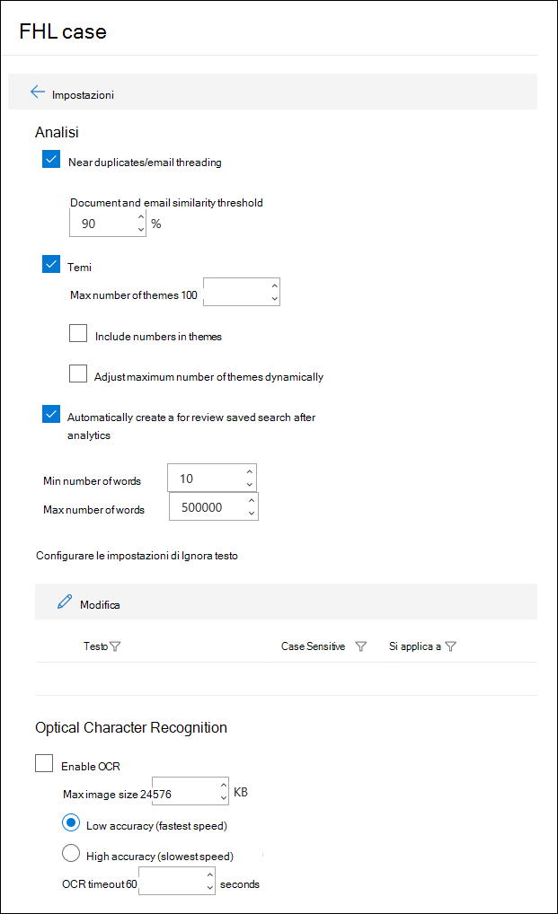

# Configurare le impostazioni di ricerca e analisi in Advanced eDiscovery

È possibile configurare le impostazioni per ogni caso eDiscovery avanzato per controllare la funzionalità seguente.

- Quasi duplicati e threading della posta elettronica

- Temi

- Query set di revisione generata automaticamente

- Ignora testo

- Riconoscimento ottico del carattere

Per configurare le impostazioni di ricerca e analisi per un caso:

1. Nella pagina **Advanced eDiscovery** selezionare il caso.

2. Nella scheda **Impostazioni** , in **Search & Analytics**, fare clic su **Seleziona**.

   Viene visualizzata la pagina Impostazioni case. Queste impostazioni vengono applicate a tutti i set di revisione in un caso.

   

## Quasi duplicati e threading della posta elettronica

In questa sezione, è possibile impostare parametri per il rilevamento duplicati, vicino al rilevamento duplicati e al threading tramite posta elettronica. Per ulteriori informazioni, vedere [near duplicate detection](near-duplicate-detection-in-advanced-ediscovery.md) and [email Threading](email-threading-in-advanced-ediscovery.md).

- **Quasi duplicati/threading della posta elettronica:** Quando si esegue l'analisi dei dati in un set di revisione, quando si attiva il rilevamento duplicati, vicino al rilevamento duplicati e al threading della posta elettronica, vengono inclusi come parte del flusso di lavoro.

- **Soglia di somiglianza tra documenti e messaggi di posta elettronica:** Se il livello di somiglianza per due documenti è superiore alla soglia, entrambi i documenti vengono inseriti nello stesso set di duplicati vicino.

- **Numero minimo/massimo di parole:** Queste impostazioni specificano che l'analisi nei pressi dei duplicati e del threading della posta elettronica viene eseguita solo sui documenti che hanno almeno il numero minimo di parole e al massimo il numero di parole.

## Temi

In questa sezione, è possibile impostare parametri per i temi. Per ulteriori informazioni, vedere [Themes](themes-in-advanced-ediscovery.md).

- **Temi:** Quando si attiva l'operazione, il clustering dei temi viene eseguito come parte del flusso di lavoro quando si esegue l'analisi dei dati in un set di revisione.

- **Numero massimo di temi:** Specifica il numero massimo di temi che possono essere generati quando si esegue l'analisi dei dati in un set di revisione.

- **Includere numeri nei temi:** Quando si attivano i numeri (che identificano un tema) vengono inclusi durante la generazione di temi. 

- **Modificare dinamicamente il numero massimo di temi:** In determinate situazioni, potrebbe non essere disponibile un numero sufficiente di documenti in un set di riesame per ottenere i numeri di temi desiderati. Quando questa impostazione è abilitata, Advanced eDiscovery regola in modo dinamico il numero massimo di temi anziché tentare di applicare il numero massimo di temi.

## Verifica set di query

Se si seleziona la casella **di controllo crea automaticamente una richiesta di ricerca salvata dopo l'analisi** , la query Advanced eDiscovery autogenerates Review set viene chiamata per la **revisione.** 

Questa query sostanzialmente filtra gli elementi duplicati dal set di revisione. In questo modo è possibile esaminare gli elementi univoci nel set di revisione. La query viene creata solo quando si esegue analisi per un set di revisione nel caso. Per ulteriori informazioni, vedere [query sui dati di un](review-set-search.md)set di revisione.

## Ignora testo

Vi sono situazioni in cui un determinato testo diminuirà la qualità dell'analisi, ad esempio le dichiarazioni di non responsabilità lunghe che vengono aggiunte ai messaggi di posta elettronica indipendentemente dal contenuto del messaggio di posta elettronica. Se si conosce il testo che deve essere ignorato, è possibile escluderlo da analisi specificando la stringa di testo e la funzionalità di analisi (quasi duplicati, Threading di posta elettronica, temi e pertinenza) in base alla quale il testo dovrebbe essere escluso. Anche l'utilizzo di espressioni regolari (RegEx) come testo ignorato è supportato. 

## Riconoscimento ottico caratteri (OCR)

Quando questa impostazione è attivata, l'elaborazione OCR verrà eseguita nei file di immagine. L'elaborazione OCR viene eseguita nelle situazioni seguenti:

- Quando i depositari e le [origini dati non detentive](non-custodial-data-sources.md) vengono aggiunti a un caso. L'elaborazione OCR viene eseguita durante il processo di indicizzazione avanzato. Questo significa che il testo nei file di immagine che soddisfano i criteri di ricerca verrà restituito in una ricerca di raccolta.

- Quando il contenuto proveniente da altre origini dati (che non sono associate a un custode e aggiunto al caso in un'origine dati non affidatario) viene aggiunto a un set di revisione.

Dopo aver aggiunto i dati a un set di revisione, il testo dell'immagine può essere esaminato, cercato, contrassegnato e analizzato. È possibile visualizzare il testo estratto nel Visualizzatore di testo del file di immagine selezionato nel set di revisione. Per altre informazioni, vedere:

- [Indicizzazione avanzata dei dati dei responsabili](indexing-custodian-data.md)

- [Aggiungere i risultati della ricerca a un insieme da rivedere](add-data-to-review-set.md#optical-character-recognition)

- [Tipi di file di immagine supportati](supported-filetypes-ediscovery20.md#image)
