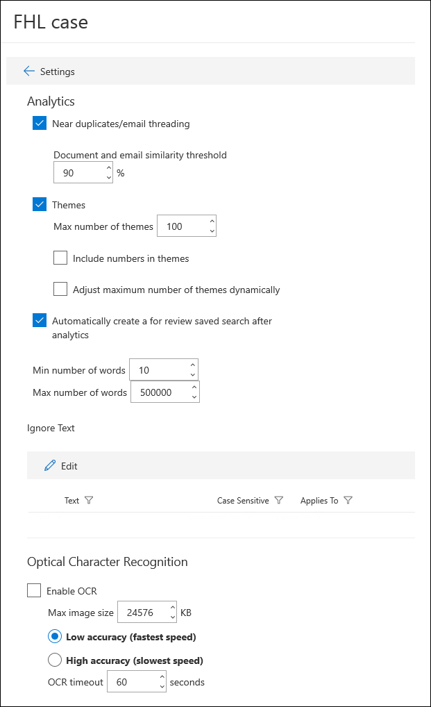

# Configurare le impostazioni di ricerca e analisi in Advanced eDiscoveryConfigure search and analytics settings in Advanced eDiscovery

È possibile configurare le impostazioni per ogni Advanced eDiscovery caso per controllare le funzionalità seguenti.You can configure settings for each Advanced eDiscovery case to control the following functionality.

- Documenti simili e threading posta elettronicaNear duplicates and email threading

- TemiThemes

- Query dell'insieme da rivedere automaticaAutogenerated review set query

- Testo da ignorareIgnore text

- Riconoscimento ottico dei caratteriOptical character recognition

Per configurare le impostazioni di ricerca e analisi per un caso:To configure search and analytics settings for a case:

1. Nella pagina **Advanced eDiscovery** selezionare il caso.On the **Advanced eDiscovery** page, select the case.

2. Nella scheda **Impostazioni** in **Ricerca e analisi**, fare clic su **Seleziona**.On the **Settings** tab, under **Search & analytics**, click **Select**.

   Viene visualizzata la pagina delle impostazioni del caso.The case settings page is displayed. Queste impostazioni vengono applicate a tutti i set di revisione in un caso.These settings are applied to all review sets in a case.

   

## Documenti simili e threading posta elettronicaNear duplicates and email threading

In questa sezione è possibile impostare i parametri per il rilevamento duplicati, il rilevamento quasi duplicato e il threading della posta elettronica.In this section, you can set parameters for duplicate detection, near duplicate detection, and email threading. Per ulteriori informazioni, vedere [Rilevamento quasi duplicato](near-duplicate-detection-in-advanced-ediscovery.md) e [Threading della posta elettronica.](email-threading-in-advanced-ediscovery.md)For more information, see [Near duplicate detection](near-duplicate-detection-in-advanced-ediscovery.md) and [Email threading](email-threading-in-advanced-ediscovery.md).

- **Threading near duplicates/email:** Se attivato, il rilevamento duplicati, il rilevamento quasi duplicato e il threading della posta elettronica vengono inclusi come parte del flusso di lavoro quando si esegue l'analisi dei dati in un set di revisione.**Near duplicates/email threading:** When turned on, duplicate detection, near duplicate detection, and email threading are included as part of the workflow when you run analytics on the data in a review set.

- **Soglia di somiglianza tra documenti e messaggi di posta elettronica:** Se il livello di somiglianza per due documenti è superiore alla soglia, entrambi i documenti vengono inseriti nello stesso set di duplicati quasi duplicato.**Document and email similarity threshold:** If the similarity level for two documents is above the threshold, both documents are put in the same near duplicate set.

- **Numero minimo/massimo di parole:** Queste impostazioni specificano che quasi i duplicati e l'analisi del threading della posta elettronica vengono eseguite solo su documenti con almeno il numero minimo di parole e al massimo il numero massimo di parole.**Minimum/maximum number of words:** These settings specify that near duplicates and email threading analysis are performed only on documents that have at least the minimum number of words and at most the maximum number of words.

## TemiThemes

In questa sezione è possibile impostare i parametri per i temi.In this section, you can set parameters for themes. Per ulteriori informazioni, vedere [Temi](themes-in-advanced-ediscovery.md).For more information, see [Themes](themes-in-advanced-ediscovery.md).

- **Temi:** Se attivato, il clustering dei temi viene eseguito come parte del flusso di lavoro quando si esegue l'analisi dei dati in un set di revisione.**Themes:** When turned on, themes clustering is performed as part of the workflow when you run analytics on the data in a review set.

- **Numero massimo di temi:** Specifica il numero massimo di temi che possono essere generati quando si esegue l'analisi dei dati in un set di revisioni.**Maximum number of themes:** Specifies the maximum number of themes that can be generated when you run analytics on the data in a review set.

- **Includi numeri nei temi:** Quando è attivata, i numeri (che identificano un tema) vengono inclusi durante la generazione di temi.**Include numbers in themes:** When turned on, numbers (that identify a theme) are included when generating themes. 

- **Regolare dinamicamente il numero massimo di temi:** In alcune situazioni, potrebbe non essere disponibile un numero sufficiente di documenti in un set di revisioni per produrre il numero desiderato di temi.**Adjust maximum number of themes dynamically:** In certain situations, there may not be enough documents in a review set to produce the desired number of themes. Quando questa impostazione è abilitata, Advanced eDiscovery modifica il numero massimo di temi dinamicamente, invece di tentare di applicare il numero massimo di temi.When this setting is enabled, Advanced eDiscovery adjusts the maximum number of themes dynamically rather than attempting to enforce the maximum number of themes.

## Query dell'insieme da rivedereReview set query

Se si seleziona la **casella** di controllo Crea automaticamente una ricerca salvata per revisione dopo l'analisi, Advanced eDiscovery automaticamente la query del set di revisione denominata **Per revisione.**If you select the **Automatically create a For Review saved search after analytics** checkbox, Advanced eDiscovery autogenerates review set query named **For Review.** 

Questa query filtra fondamentalmente gli elementi duplicati dal set di revisioni.This query basically filters out duplicate items from the review set. In questo modo è possibile esaminare gli elementi univoci nel set di revisioni.This lets you review the unique items in the review set. Questa query viene creata solo quando si eseguono analisi per un insieme da rivedere nel caso.This query is created only when you run analytics for a review set in the case. Per ulteriori informazioni sulle query di set di revisione, vedere [Query the data in a review set](review-set-search.md).For more information, about review set queries, see [Query the data in a review set](review-set-search.md).

## Testo da ignorareIgnore text

Esistono situazioni in cui determinati testi diminuiscono la qualità dell'analisi, ad esempio dichiarazioni di non responsabilità lunghe che vengono aggiunte ai messaggi di posta elettronica indipendentemente dal contenuto del messaggio di posta elettronica.There are situations where certain text will diminish the quality of analytics, such as lengthy disclaimers that get added to email messages regardless of the content of the email. È possibile escludere la parte di testo da ignorare dall'analisi specificando la stringa di testo e la funzionalità di analisi (Documenti simili, Threading posta elettronica, Temi e Rilevanza) per cui escludere il testo.If you know of text that should be ignored, you can exclude it from analytics by specifying the text string and the analytics functionality (Near-duplicates, Email threading, Themes, and Relevance) that the text should be excluded for. È inoltre supportato l'utilizzo di espressioni regolari (RegEx) come testo ignorato.Using regular expressions (RegEx) as ignored text is also supported. 

## Riconoscimento ottico dei caratteri (OCR)Optical character recognition (OCR)

Quando questa impostazione è attivata, l'elaborazione OCR verrà eseguita sui file di immagine.When this setting is turned on, OCR processing will be run on image files. L'elaborazione OCR viene eseguita nelle situazioni seguenti:OCR processing is run in the following situations:

- Quando i custodi e le origini dati [non depositario](non-custodial-data-sources.md) vengono aggiunti a un caso.When custodians and [non-custodial data sources](non-custodial-data-sources.md) are added to a case. L'elaborazione OCR viene eseguita durante [il processo di indicizzazione](indexing-custodian-data.md) avanzata.OCR processing is performed during the [Advanced indexing](indexing-custodian-data.md) process. L'OCR viene eseguito solo sugli elementi elaborati durante l'indicizzazione avanzata.OCR is only run on items that are processed during Advanced indexing. Ad esempio, se durante l'indicizzazione avanzata viene elaborato un file PDF di grandi dimensioni parzialmente indicizzato o con altri errori di indicizzazione, verrà applicato anche il riconoscimento OCR.For example, if a large PDF file that is partially indexed or had other indexing errors is processed during Advanced indexing, the file will also have OCR applied. In altre parole, l'elaborazione OCR si verifica solo sui file che vengono indicizzati di nuovo durante il processo di indicizzazione avanzata.In other words, OCR processing only occurs on files that are re-indexed during the Advanced indexing process. Ciò significa che le situazioni in cui i custodi vengono aggiunti a un caso, alcuni allegati di posta elettronica non verranno elaborati per L'OCR perché tali file non vengono elaborati durante l'indicizzazione avanzata.This means are will situations that when custodians are added to a case, some email attachments won't be processed for OCR because those files are not processed during Advanced indexing. Quando vengono applicati file di immagine OCR, il testo in tali file di immagine sarà disponibile per la ricerca durante una raccolta.When OCR is applied image files, the text in those image files will be searchable during a collection.

- Quando il contenuto di altre origini dati (che non sono associate a un responsabile e che vengono aggiunti al caso in un'origine dati non depositale) viene aggiunto a un set di revisione.When content from other data sources (that aren't associated with a custodian and added to the case in a non-custodial data source) is added to a review set.

Dopo l'aggiunta dei dati a un set di recensioni, il testo dell'immagine può essere esaminato, cercato, taggato e analizzato.After data is added to a review set, image text can be reviewed, searched, tagged, and analyzed. È possibile visualizzare il testo estratto nel visualizzatore di testo del file di immagine selezionato nel set di revisioni.You can view the extracted text in the Text viewer of the selected image file in the review set. Per ulteriori informazioni, vedere:For more information, see:

- [Indicizzazione avanzata dei dati dei responsabiliAdvanced indexing of custodian data](indexing-custodian-data.md)

- [Aggiungere i risultati della ricerca a un insieme da rivedereAdd search results to a review set](add-data-to-review-set.md#optical-character-recognition)

- [Tipi di file di immagine supportatiSupported image file types](supported-filetypes-ediscovery20.md#image)
