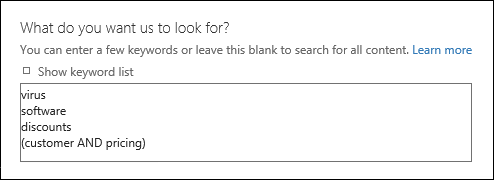
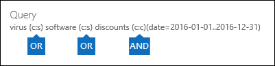
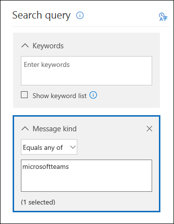
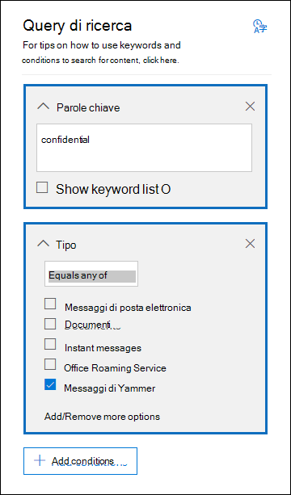

# <a name="feature-reference-for-content-search"></a><span data-ttu-id="13190-103">Riferimento funzionalità per Ricerca contenuto</span><span class="sxs-lookup"><span data-stu-id="13190-103">Feature reference for Content search</span></span>

<span data-ttu-id="13190-104">Questo articolo descrive funzionalità e funzioni di Ricerca contenuto.</span><span class="sxs-lookup"><span data-stu-id="13190-104">This article describes features and functionality of Content search.</span></span>

## <a name="content-search-limits"></a><span data-ttu-id="13190-105">Limiti di Ricerca contenuto</span><span class="sxs-lookup"><span data-stu-id="13190-105">Content search limits</span></span>

- <span data-ttu-id="13190-106">Per una descrizione dei limiti applicati alla Ricerca contenuto, vedere [Limiti per la Ricerca contenuto](limits-for-content-search.md).</span><span class="sxs-lookup"><span data-stu-id="13190-106">For a description of the limits that are applied to content searches, see [Limits for Content search](limits-for-content-search.md).</span></span>
  
- <span data-ttu-id="13190-107">Microsoft raccoglie informazioni sulle prestazioni per la Ricerca contenuto eseguite da tutte le organizzazioni nel servizio.</span><span class="sxs-lookup"><span data-stu-id="13190-107">Microsoft collects performance information for Content searches run by all organizations in the service.</span></span> <span data-ttu-id="13190-108">Sebbene la complessità della query di ricerca possa influire sui tempi di ricerca, il fattore principale che influisce sul tempo necessario per una ricerca è il numero di cassette postali in cui la ricerca viene eseguita.</span><span class="sxs-lookup"><span data-stu-id="13190-108">While the complexity of the search query can impact search times, the biggest factor that affects how long searches take is the number of mailboxes searched.</span></span> <span data-ttu-id="13190-109">Sebbene Microsoft non fornisca un contratto di servizio per i tempi di ricerca, la tabella seguente elenca i tempi di ricerca medi per un'operazione di Ricerca contenuto in base al numero di cassette postali incluse nella ricerca.</span><span class="sxs-lookup"><span data-stu-id="13190-109">Although Microsoft doesn't provide a Service Level Agreement for search times, the following table lists average search times for a Content Search based on the number of mailboxes included in the search.</span></span>
  
  |<span data-ttu-id="13190-110">**Numero di cassette postali**</span><span class="sxs-lookup"><span data-stu-id="13190-110">**Number of mailboxes**</span></span>|<span data-ttu-id="13190-111">**Tempo medio di ricerca**</span><span class="sxs-lookup"><span data-stu-id="13190-111">**Average search time**</span></span>|
  |:-----|:-----|
  |<span data-ttu-id="13190-112">100</span><span class="sxs-lookup"><span data-stu-id="13190-112">100</span></span>  <br/> |<span data-ttu-id="13190-113">30 secondi</span><span class="sxs-lookup"><span data-stu-id="13190-113">30 seconds</span></span>  <br/> |
  |<span data-ttu-id="13190-114">1.000</span><span class="sxs-lookup"><span data-stu-id="13190-114">1,000</span></span>  <br/> |<span data-ttu-id="13190-115">45 secondi</span><span class="sxs-lookup"><span data-stu-id="13190-115">45 seconds</span></span>  <br/> |
  |<span data-ttu-id="13190-116">10.000</span><span class="sxs-lookup"><span data-stu-id="13190-116">10,000</span></span>  <br/> |<span data-ttu-id="13190-117">4 minuti</span><span class="sxs-lookup"><span data-stu-id="13190-117">4 minutes</span></span>  <br/> |
  |<span data-ttu-id="13190-118">25.000</span><span class="sxs-lookup"><span data-stu-id="13190-118">25,000</span></span>  <br/> |<span data-ttu-id="13190-119">10 minuti</span><span class="sxs-lookup"><span data-stu-id="13190-119">10 minutes</span></span>  <br/> |
  |<span data-ttu-id="13190-120">50.000</span><span class="sxs-lookup"><span data-stu-id="13190-120">50,000</span></span>  <br/> |<span data-ttu-id="13190-121">20 minuti</span><span class="sxs-lookup"><span data-stu-id="13190-121">20 minutes</span></span>  <br/> |
  |<span data-ttu-id="13190-122">100.000</span><span class="sxs-lookup"><span data-stu-id="13190-122">100,000</span></span>  <br/> |<span data-ttu-id="13190-123">25 minuti</span><span class="sxs-lookup"><span data-stu-id="13190-123">25 minutes</span></span>  <br/> |
  |||
  
## <a name="building-a-search-query"></a><span data-ttu-id="13190-124">Creare una query di ricerca</span><span class="sxs-lookup"><span data-stu-id="13190-124">Building a search query</span></span>

<span data-ttu-id="13190-125">Per informazioni dettagliate sulla creazione di una query di ricerca, l'uso di operatori di ricerca booleani e di condizioni di ricerca e la ricerca di tipi di informazioni riservate e contenuti condivisi con utenti esterni all'organizzazione, vedere [Query con parole chiave e condizioni di ricerca per Ricerca contenuto](keyword-queries-and-search-conditions.md).</span><span class="sxs-lookup"><span data-stu-id="13190-125">For detailed information about creating a search query, using Boolean search operators and search conditions, and searching for sensitive information types and content shared with users outside your organization, see [Keyword queries and search conditions for Content Search ](keyword-queries-and-search-conditions.md).</span></span>
  
<span data-ttu-id="13190-126">Tenere presente quanto segue quando si usa l'elenco di parole chiave per creare una query di ricerca.</span><span class="sxs-lookup"><span data-stu-id="13190-126">Keep the following things in mind when using the keyword list to create a search query.</span></span>
  
- <span data-ttu-id="13190-127">È necessario selezionare la casella di controllo **Mostra elenco di parole chiave** e digitare le singole parole chiave in righe separate per creare una query di ricerca in cui le parole o le frasi chiave di ogni riga siano collegate dall'operatore **OR**.</span><span class="sxs-lookup"><span data-stu-id="13190-127">You have to select the **Show keyword list** checkbox and then type each keyword in a separate row to create a search query where the keywords (or keyword phrases) in each row are connected by the **OR** operator.</span></span> <span data-ttu-id="13190-128">Se si incolla un elenco di parole chiave nella casella delle parole chiave oppure si preme **INVIO** dopo aver digitato una parola chiave, l'operatore **OR** non eseguirà il collegamento.</span><span class="sxs-lookup"><span data-stu-id="13190-128">If you paste a list of keywords in the keyword box or press the **Enter** key after typing a keyword, they won't be connected by the **OR** operator.</span></span> <span data-ttu-id="13190-129">Ecco un esempio non valido e uno valido di come aggiungere un elenco di parole chiave.</span><span class="sxs-lookup"><span data-stu-id="13190-129">Here are incorrect and correct examples of how to add a list of keywords.</span></span>
    
    <span data-ttu-id="13190-130">**Non valido**</span><span class="sxs-lookup"><span data-stu-id="13190-130">**Incorrect**</span></span>
    
    
  
    <span data-ttu-id="13190-132">**Valido**</span><span class="sxs-lookup"><span data-stu-id="13190-132">**Correct**</span></span>
    
    
  
- <span data-ttu-id="13190-134">È anche possibile preparare un elenco di parole o frasi chiave in un file di Excel o in un file di testo normale, quindi copiare e incollare l'elenco nell'elenco di parole chiave.</span><span class="sxs-lookup"><span data-stu-id="13190-134">You can also prepare a list of keywords or keyword phrases in an Excel file or a plain text file, and then copy and paste your list into the keyword list.</span></span> <span data-ttu-id="13190-135">A questo scopo, è necessario selezionare la casella di controllo **Mostra elenco di parole chiave**.</span><span class="sxs-lookup"><span data-stu-id="13190-135">To do this, you have to select the **Show keyword list** check box.</span></span> <span data-ttu-id="13190-136">Quindi, fare clic sulla prima riga dell'elenco di parole chiave e incollare l'elenco.</span><span class="sxs-lookup"><span data-stu-id="13190-136">Then, click the first row in the keyword list and paste your list.</span></span> <span data-ttu-id="13190-137">Ogni riga del file di testo o di Excel verrà incollata in righe separate nell'elenco di parole chiave.</span><span class="sxs-lookup"><span data-stu-id="13190-137">Each line from the Excel or text file is pasted into separate row in the keyword list.</span></span> 
    
- <span data-ttu-id="13190-138">Dopo aver creato una query con l'elenco di parole chiave, è consigliabile verificare la sintassi della query di ricerca per verificare che la query di ricerca sia quella prevista.</span><span class="sxs-lookup"><span data-stu-id="13190-138">After you create a query using the keyword list, it's a good idea to verify the search query syntax to make the search query is what you intended.</span></span> <span data-ttu-id="13190-139">Nella query di ricerca visualizzata in **Query** nel riquadro dei dettagli, le parole chiave sono separate dal testo **(c:s)**.</span><span class="sxs-lookup"><span data-stu-id="13190-139">In the search query that's displayed under **Query** in the details pane, the keywords are separated by the text **(c:s)**.</span></span> <span data-ttu-id="13190-140">Questo indica che le parole chiave sono connesse da un operatore logico con funzionalità simili all'operatore **OR**.</span><span class="sxs-lookup"><span data-stu-id="13190-140">This indicates that the keywords are connected by a logical operator similar in functionality to the **OR** operator.</span></span> <span data-ttu-id="13190-141">Analogamente, se la query di ricerca include condizioni, le parole chiave e le condizioni sono separate dal testo **(c:c)**.</span><span class="sxs-lookup"><span data-stu-id="13190-141">Similarly, if your search query includes conditions, the keywords and the conditions are separated by the text **(c:c)**.</span></span> <span data-ttu-id="13190-142">Questo indica che le parole chiave sono connesse alle condizioni da un operatore logico con funzionalità simili all'operatore **AND**.</span><span class="sxs-lookup"><span data-stu-id="13190-142">This indicates that the keywords are connected to the conditions with a logical operator similar in functionality to the **AND** operator.</span></span> <span data-ttu-id="13190-143">Ecco un esempio della query di ricerca, visualizzata nel riquadro dei dettagli, restituita quando si usa l'elenco di parole chiave e una condizione.</span><span class="sxs-lookup"><span data-stu-id="13190-143">Here's an example of the search query (displayed in the Details pane) that results when using the keyword list and a condition.</span></span> 
    
    
  
- <span data-ttu-id="13190-145">Durante l'esecuzione di una ricerca di contenuto, Microsoft 365 controlla automaticamente la query di ricerca per individuare caratteri non supportati e operatori booleani che potrebbero non essere scritti in maiuscolo.</span><span class="sxs-lookup"><span data-stu-id="13190-145">When you run a content search, Microsoft 365 automatically checks your search query for unsupported characters and for Boolean operators that may not be capitalized.</span></span> <span data-ttu-id="13190-146">I caratteri non supportati sono spesso nascosti e in genere causano un errore di ricerca o la restituzione di risultati indesiderati.</span><span class="sxs-lookup"><span data-stu-id="13190-146">Unsupported characters are often hidden and typically cause a search error or return unintended results.</span></span> <span data-ttu-id="13190-147">Per altre informazioni sui caratteri non supportati controllati, vedere [Verificare la presenza di errori nella query Ricerca contenuto](check-your-content-search-query-for-errors.md).</span><span class="sxs-lookup"><span data-stu-id="13190-147">For more information about the unsupported characters that are checked, see [Check your Content Search query for errors](check-your-content-search-query-for-errors.md).</span></span>
    
- <span data-ttu-id="13190-148">Se si dispone di una query di ricerca che contiene parole chiave per i caratteri non italiani (come i caratteri cinesi), è possibile fare clic su **Lingua - paese/area geografica della query** e selezionare un valore di codice per la lingua - paese per la ricerca.</span><span class="sxs-lookup"><span data-stu-id="13190-148">If you have a search query that contains keywords for non-English characters (such as Chinese characters), you can click **Query language-country/region** and select a language-country culture code value for the search.</span></span> <span data-ttu-id="13190-149">La lingua/area geografica predefinita è neutrale.</span><span class="sxs-lookup"><span data-stu-id="13190-149">The default language/region is neutral.</span></span> <span data-ttu-id="13190-150">Come è possibile stabilire se è necessario cambiare l'impostazione della lingua per una ricerca contenuto?</span><span class="sxs-lookup"><span data-stu-id="13190-150">How can you tell if you need to change the language setting for a content search?</span></span> <span data-ttu-id="13190-151">Se si è certi che i percorsi di contenuto contengano i caratteri non italiani che si stanno cercando, ma la ricerca non restituisce risultati, l'impostazione della lingua potrebbe essere la causa.</span><span class="sxs-lookup"><span data-stu-id="13190-151">If you're certain content locations contain the non-English characters you're searching for, but the search returns no results, the language setting may be the cause.</span></span> 
  
## <a name="partially-indexed-items"></a><span data-ttu-id="13190-152">Elementi parzialmente indicizzati</span><span class="sxs-lookup"><span data-stu-id="13190-152">Partially indexed items</span></span>

- <span data-ttu-id="13190-153">Gli elementi parzialmente indicizzati nelle cassette postali sono inclusi nei risultati della ricerca stimati.</span><span class="sxs-lookup"><span data-stu-id="13190-153">Partially indexed items in mailboxes are included in the estimated search results.</span></span> <span data-ttu-id="13190-154">Gli elementi parzialmente indicizzati di SharePoint e OneDrive non vengono inclusi nei risultati della ricerca stimati.</span><span class="sxs-lookup"><span data-stu-id="13190-154">Partially indexed items from SharePoint and OneDrive aren't included in the estimated search results.</span></span> <span data-ttu-id="13190-155">Per altre informazioni, vedere [Elementi parzialmente indicizzati in eDiscovery](partially-indexed-items-in-content-search.md).</span><span class="sxs-lookup"><span data-stu-id="13190-155">For more information, see [Partially indexed items in eDiscovery](partially-indexed-items-in-content-search.md).</span></span>

## <a name="searching-onedrive-accounts"></a><span data-ttu-id="13190-156">Eseguire una ricerca negli account di OneDrive</span><span class="sxs-lookup"><span data-stu-id="13190-156">Searching OneDrive accounts</span></span>

- <span data-ttu-id="13190-157">Per ottenere un elenco degli URL dei siti di OneDrive nell'organizzazione, vedere [Creare un elenco di tutti i percorsi di OneDrive nell'organizzazione](/onedrive/list-onedrive-urls).</span><span class="sxs-lookup"><span data-stu-id="13190-157">To collect a list of the URLs for the OneDrive sites in your organization, see [Create a list of all OneDrive locations in your organization](/onedrive/list-onedrive-urls).</span></span> <span data-ttu-id="13190-158">Lo script in questo articolo crea un file di testo che contiene un elenco di tutti i siti di OneDrive.</span><span class="sxs-lookup"><span data-stu-id="13190-158">This script in this article creates a text file that contains a list of all OneDrive sites.</span></span> <span data-ttu-id="13190-159">Per eseguire questo script, è necessario installare e usare SharePoint Online Management Shell.</span><span class="sxs-lookup"><span data-stu-id="13190-159">To run this script, you have to install and use the SharePoint Online Management Shell.</span></span> <span data-ttu-id="13190-160">Assicurarsi di aggiungere l'URL del dominio MySite dell'organizzazione a ogni sito OneDrive che si desidera includere nella ricerca.</span><span class="sxs-lookup"><span data-stu-id="13190-160">Be sure to append the URL for your organization's MySite domain to each OneDrive site that you want to search.</span></span> <span data-ttu-id="13190-161">Si tratta del dominio che contiene tutti i siti di OneDrive, ad esempio, `https://contoso-my.sharepoint.com`.</span><span class="sxs-lookup"><span data-stu-id="13190-161">This is the domain that contains all your OneDrive; for example,  `https://contoso-my.sharepoint.com`.</span></span> <span data-ttu-id="13190-162">Di seguito viene riportato un esempio di sito OneDrive di un utente: `https://contoso-my.sharepoint.com/personal/sarad_contoso_onmicrosoft.com`.</span><span class="sxs-lookup"><span data-stu-id="13190-162">Here's an example of a URL for a user's OneDrive site:  `https://contoso-my.sharepoint.com/personal/sarad_contoso_onmicrosoft.com`.</span></span>
    
    <span data-ttu-id="13190-163">Nei rari casi in cui il nome dell'entità utente (UPN) di una persona viene modificato, l'URL per il relativo percorso OneDrive viene modificato in modo da incorporare il nuovo UPN.</span><span class="sxs-lookup"><span data-stu-id="13190-163">In the rare case of a person's user principal name (UPN) being changed, the URL for their OneDrive location is changed to incorporate the new UPN.</span></span> <span data-ttu-id="13190-164">Se ciò si verifica, è necessario modificare la ricerca contenuto aggiungendo il nuovo URL di OneDrive dell'utente e rimuovendo quello precedente.</span><span class="sxs-lookup"><span data-stu-id="13190-164">If this happens, you have to modify a content search by adding the user's new OneDrive URL and removing the old one.</span></span> <span data-ttu-id="13190-165">Per altre informazioni, vedere [Come le modifiche UPN influiscono sull'URL di OneDrive](/onedrive/upn-changes).</span><span class="sxs-lookup"><span data-stu-id="13190-165">For more information, see [How UPN changes affect the OneDrive URL](/onedrive/upn-changes).</span></span>
  
## <a name="searching-microsoft-teams-and-microsoft-365-groups"></a><span data-ttu-id="13190-166">Eseguire una ricerca nei Gruppi di Microsoft 365 e Microsoft Teams</span><span class="sxs-lookup"><span data-stu-id="13190-166">Searching Microsoft Teams and Microsoft 365 Groups</span></span>

<span data-ttu-id="13190-167">È anche possibile eseguire una ricerca nella cassetta postale associata a un team di Microsoft Teams o a un gruppo di Microsoft 365.</span><span class="sxs-lookup"><span data-stu-id="13190-167">You can search the mailbox that's associated with a Microsoft Team or Microsoft 365 Group.</span></span> <span data-ttu-id="13190-168">Poiché Microsoft Teams è basato su Gruppi di Microsoft 365, la ricerca è simile.</span><span class="sxs-lookup"><span data-stu-id="13190-168">Because Microsoft Teams is built on Microsoft 365 Groups, searching them is similar.</span></span> <span data-ttu-id="13190-169">In entrambi i casi, la ricerca viene eseguita solo nella cassetta postale del gruppo o del team.</span><span class="sxs-lookup"><span data-stu-id="13190-169">In both cases, only the group or team mailbox is searched.</span></span> <span data-ttu-id="13190-170">La ricerca non verrà eseguita nelle cassette postali dei membri del gruppo o del team.</span><span class="sxs-lookup"><span data-stu-id="13190-170">The mailboxes of the group or team members aren't searched.</span></span> <span data-ttu-id="13190-171">Per cercare in queste cassette postali, è necessario aggiungerle specificamente alla ricerca.</span><span class="sxs-lookup"><span data-stu-id="13190-171">To search them, you have to specifically add them to the search.</span></span>
  
<span data-ttu-id="13190-172">Tenere presente quanto segue quando si cerca contenuto in Microsoft Teams e nei Gruppi di Microsoft 365.</span><span class="sxs-lookup"><span data-stu-id="13190-172">Keep the following things in mind when searching for content in Microsoft Teams and Microsoft 365 Groups.</span></span>
  
- <span data-ttu-id="13190-173">Per cercare contenuti in Teams e nei Gruppi di Microsoft 365, è necessario specificare la cassetta postale e il sito di SharePoint associati a un gruppo o a un team.</span><span class="sxs-lookup"><span data-stu-id="13190-173">To search for content located in Teams and Microsoft 365 Groups, you have to specify the mailbox and SharePoint site that are associated with a team or group.</span></span>

- <span data-ttu-id="13190-174">Il contenuto dei canali privati è archiviato nella cassetta postale di ogni utente, non nella cassetta postale del team.</span><span class="sxs-lookup"><span data-stu-id="13190-174">Content from private channels is stored in each user's mailbox, not the team mailbox.</span></span> <span data-ttu-id="13190-175">Per cercare contenuto nei canali privati, vedere [eDiscovery di canali privati](/microsoftteams/ediscovery-investigation#ediscovery-of-private-channels).</span><span class="sxs-lookup"><span data-stu-id="13190-175">To search for content in private channels, see [eDiscovery of private channels](/microsoftteams/ediscovery-investigation#ediscovery-of-private-channels).</span></span>
    
- <span data-ttu-id="13190-176">Eseguire il cmdlet **Get-UnifiedGroup** in Exchange Online per visualizzare le proprietà di un team o di un gruppo di Microsoft 365.</span><span class="sxs-lookup"><span data-stu-id="13190-176">Run the **Get-UnifiedGroup** cmdlet in Exchange Online to view properties for a team or a Microsoft 365 Group.</span></span> <span data-ttu-id="13190-177">È un buon modo per ottenere l'URL del sito associato a un team o a un gruppo.</span><span class="sxs-lookup"><span data-stu-id="13190-177">This is a good way to get the URL for the site that's associated with a team or a group.</span></span> <span data-ttu-id="13190-178">Ad esempio, il comando seguente consente di visualizzare le proprietà selezionate per un gruppo di Microsoft 365 denominato Senior Leadership Team:</span><span class="sxs-lookup"><span data-stu-id="13190-178">For example, the following command displays selected properties for a Microsoft 365 Group named Senior Leadership Team:</span></span> 
    
  ```text
  Get-UnifiedGroup "Senior Leadership Team" | FL DisplayName,Alias,PrimarySmtpAddress,SharePointSiteUrl
  DisplayName            : Senior Leadership Team
  Alias                  : seniorleadershipteam
  PrimarySmtpAddress     : seniorleadershipteam@contoso.onmicrosoft.com
  SharePointSiteUrl      : https://contoso.sharepoint.com/sites/seniorleadershipteam
  ```

    > [!NOTE]
    > <span data-ttu-id="13190-179">Per eseguire il cmdlet **Get-UnifiedGroup**, è necessario avere il ruolo Destinatari di sola lettura in Exchange Online o essere membri di un gruppo di ruoli assegnato al ruolo Destinatari di sola lettura.</span><span class="sxs-lookup"><span data-stu-id="13190-179">To run the **Get-UnifiedGroup** cmdlet, you have to be assigned the View-Only Recipients role in Exchange Online or be a member of a role group that's assigned the View-Only Recipients role.</span></span> 
  
- <span data-ttu-id="13190-180">Quando viene eseguita la ricerca in una cassetta postale dell'utente, qualsiasi team o gruppo di Microsoft 365 di cui fa parte l'utente viene escluso dalla ricerca.</span><span class="sxs-lookup"><span data-stu-id="13190-180">When a user's mailbox is searched, any team or Microsoft 365 Group that the user is a member of won't be searched.</span></span> <span data-ttu-id="13190-181">Analogamente, quando si esegue una ricerca in un team o in un gruppo di Microsoft 365, la ricerca viene eseguita solo nella cassetta postale e nel sito del gruppo specificati.</span><span class="sxs-lookup"><span data-stu-id="13190-181">Similarly, when you search a team or a Microsoft 365 Group, only the group mailbox and group site that you specify is searched.</span></span> <span data-ttu-id="13190-182">La ricerca non viene effettuata nelle cassette postali e negli account di OneDrive for Business dei membri del gruppo, a meno che non li si aggiunga esplicitamente alla ricerca.</span><span class="sxs-lookup"><span data-stu-id="13190-182">The mailboxes and OneDrive for Business accounts of group members aren't searched unless you explicitly add them to the search.</span></span>

- <span data-ttu-id="13190-183">Per ottenere un elenco dei membri di un gruppo di Microsoft 365 o di un team, è possibile visualizzare le proprietà nella pagina **Home \>Gruppi** nell'interfaccia di amministrazione di Microsoft 365.</span><span class="sxs-lookup"><span data-stu-id="13190-183">To get a list of the members of a team or a Microsoft 365 Group, you can view the properties on the **Home \> Groups** page in the Microsoft 365 admin center.</span></span> <span data-ttu-id="13190-184">In alternativa, è possibile eseguire il comando seguente in PowerShell di Exchange Online:</span><span class="sxs-lookup"><span data-stu-id="13190-184">Alternatively, you can run the following command in Exchange Online PowerShell:</span></span> 

  ```powershell
  Get-UnifiedGroupLinks <group or team name> -LinkType Members | FL DisplayName,PrimarySmtpAddress
  ```

    > [!NOTE]
    > <span data-ttu-id="13190-185">Per eseguire il cmdlet **Get-UnifiedGroupLinks**, è necessario avere il ruolo Destinatari di sola lettura in Exchange Online o essere membri di un gruppo di ruoli assegnato al ruolo Destinatari di sola lettura.</span><span class="sxs-lookup"><span data-stu-id="13190-185">To run the **Get-UnifiedGroupLinks** cmdlet, you have to be assigned the View-Only Recipients role in Exchange Online or be a member of a role group that's assigned the View-Only Recipients role.</span></span> 
  
- <span data-ttu-id="13190-186">Le conversazioni che fanno parte di un canale di Teams vengono archiviate nella cassetta postale associata al team.</span><span class="sxs-lookup"><span data-stu-id="13190-186">Conversations that are part of a Teams channel are stored in the mailbox that's associated with the team.</span></span> <span data-ttu-id="13190-187">Allo stesso modo, i file che i membri del team condividono in un canale vengono archiviati nel sito di SharePoint del team.</span><span class="sxs-lookup"><span data-stu-id="13190-187">Similarly, files that team members share in a channel are stored on the team's SharePoint site.</span></span> <span data-ttu-id="13190-188">È quindi necessario aggiungere la cassetta postale del team e il sito di SharePoint come percorso di contenuto per cercare le conversazioni e i file in un canale.</span><span class="sxs-lookup"><span data-stu-id="13190-188">Therefore, you have to add the team mailbox and SharePoint site as a content location to search conversations and files in a channel.</span></span>
    
- <span data-ttu-id="13190-189">In alternativa, le conversazioni che fanno parte dell'elenco di chat in Teams vengono archiviate nella cassetta postale di Exchange Online degli utenti che partecipano alla chat,</span><span class="sxs-lookup"><span data-stu-id="13190-189">Alternatively, conversations that are part of the Chat list in Teams are stored in the Exchange Online mailbox of the users who participate in the chat.</span></span> <span data-ttu-id="13190-190">mentre i file che un utente condivide nelle conversazioni via chat vengono archiviati nell’account di OneDrive for Business dell'utente stesso.</span><span class="sxs-lookup"><span data-stu-id="13190-190">And files that a user shares in Chat conversations are stored in the OneDrive for Business account of the user who shares the file.</span></span> <span data-ttu-id="13190-191">È quindi necessario aggiungere le singole cassette postali utente e gli account di OneDrive for Business come percorsi di contenuto per cercare le conversazioni e i file nell'elenco di chat.</span><span class="sxs-lookup"><span data-stu-id="13190-191">Therefore, you have to add the individual user mailboxes and OneDrive for Business accounts as content locations to search conversations and files in the Chat list.</span></span>
    
    > [!NOTE]
    > <span data-ttu-id="13190-192">In una distribuzione ibrida di Exchange, gli utenti con una cassetta postale locale potrebbero partecipare a conversazioni che fanno parte dell'elenco di chat in Teams.</span><span class="sxs-lookup"><span data-stu-id="13190-192">In an Exchange hybrid deployment, users with an on-premises mailbox might participate in conversations that are part of the Chat list in Teams.</span></span> <span data-ttu-id="13190-193">In questo caso, anche il contenuto di queste conversazioni è disponibile per la ricerca, perché viene salvato in un'area di archiviazione basata sul cloud, chiamata *cassetta postale basata sul cloud per gli utenti locali*, per gli utenti che dispongono di una cassetta postale locale.</span><span class="sxs-lookup"><span data-stu-id="13190-193">In this case, content from these conversations is also searchable because it's saved to a cloud-based storage area (called a *cloud-based mailbox for on-premises users*) for users who have an on-premises mailbox.</span></span> <span data-ttu-id="13190-194">Per altre informazioni, vedere [Cercare i dati delle chat di Teams degli utenti locali](search-cloud-based-mailboxes-for-on-premises-users.md).</span><span class="sxs-lookup"><span data-stu-id="13190-194">For more information, see [Search for Teams chat data for on-premises users](search-cloud-based-mailboxes-for-on-premises-users.md).</span></span>
  
- <span data-ttu-id="13190-195">Ogni team o canale del team contiene un Wiki per la creazione di note e la collaborazione.</span><span class="sxs-lookup"><span data-stu-id="13190-195">Every team or team channel contains a Wiki for note-taking and collaboration.</span></span> <span data-ttu-id="13190-196">Il contenuto Wiki viene salvato automaticamente in un file con formato MHT.</span><span class="sxs-lookup"><span data-stu-id="13190-196">The Wiki content is automatically saved to a file with a .mht format.</span></span> <span data-ttu-id="13190-197">Il file è archiviato nella raccolta documenti di dati Wiki di Teams nel sito di SharePoint del team.</span><span class="sxs-lookup"><span data-stu-id="13190-197">This file is stored in the Teams Wiki Data document library on the team's SharePoint site.</span></span> <span data-ttu-id="13190-198">È possibile usare lo strumento Ricerca contenuto per eseguire ricerche nel Wiki specificando il sito di SharePoint del team come percorso di contenuto in cui eseguire la ricerca.</span><span class="sxs-lookup"><span data-stu-id="13190-198">You can use the Content Search tool to search the Wiki by specifying the team's SharePoint site as the content location to search.</span></span>

    > [!NOTE]
    > <span data-ttu-id="13190-199">La possibilità di eseguire ricerche nel Wiki di un team o di un canale, quando si esegue una ricerca nel sito di SharePoint del team, è stata rilasciata il 22 giugno 2017.</span><span class="sxs-lookup"><span data-stu-id="13190-199">The capability to search the Wiki for a team or channel (when you search the team's SharePoint site) was released on June 22, 2017.</span></span> <span data-ttu-id="13190-200">Le pagine Wiki salvate o aggiornate in tale data o in seguito sono disponibili per la ricerca.</span><span class="sxs-lookup"><span data-stu-id="13190-200">Wiki pages that were saved or updated on that date or after are available to be searched.</span></span> <span data-ttu-id="13190-201">Le pagine Wiki salvate o aggiornate prima di questa data non sono disponibili per la ricerca.</span><span class="sxs-lookup"><span data-stu-id="13190-201">Wiki pages last saved or updated before that date aren't available for search.</span></span>

- <span data-ttu-id="13190-202">Anche le informazioni di riepilogo per le riunioni e le chiamate in un canale di Teams vengono archiviate nelle cassette postali degli utenti che hanno partecipato alla riunione o alla chiamata.</span><span class="sxs-lookup"><span data-stu-id="13190-202">Summary information for meetings and calls in a Teams channel are also stored in the mailboxes of users who dialed into the meeting or call.</span></span> <span data-ttu-id="13190-203">Ciò significa che è possibile usare Ricerca contenuto per eseguire ricerche nei record di riepilogo.</span><span class="sxs-lookup"><span data-stu-id="13190-203">This means you can use Content Search to search these summary records.</span></span> <span data-ttu-id="13190-204">Tali informazioni di riepilogo includono:</span><span class="sxs-lookup"><span data-stu-id="13190-204">Summary information includes:</span></span>
  
  - <span data-ttu-id="13190-205">Data, ora di inizio, ora di fine e durata di una riunione o una chiamata</span><span class="sxs-lookup"><span data-stu-id="13190-205">Date, start time, end time, and duration of a meeting or call</span></span>

  - <span data-ttu-id="13190-206">La data e l'ora in cui ogni partecipante si è unito a o ha lasciato la riunione o la chiamata</span><span class="sxs-lookup"><span data-stu-id="13190-206">The date and time when each participant joined or left the meeting or call</span></span>

  - <span data-ttu-id="13190-207">Chiamate inviate alla casella vocale</span><span class="sxs-lookup"><span data-stu-id="13190-207">Calls sent to voice mail</span></span>

  - <span data-ttu-id="13190-208">Chiamate senza risposta o perse</span><span class="sxs-lookup"><span data-stu-id="13190-208">Missed or unanswered calls</span></span>

  - <span data-ttu-id="13190-209">Trasferimenti di chiamate, rappresentati come due chiamate separate</span><span class="sxs-lookup"><span data-stu-id="13190-209">Call transfers, which are represented as two separate calls</span></span>

  <span data-ttu-id="13190-210">Possono essere necessarie fino a 8 ore di tempo prima che la ricerca nei record di riepilogo di riunioni e chiamate sia disponibile.</span><span class="sxs-lookup"><span data-stu-id="13190-210">It can take up to 8 hours for meeting and call summary records to be available to be searched.</span></span>

  <span data-ttu-id="13190-211">Nei risultati della ricerca, i riepiloghi delle riunioni vengono identificati come **Riunione** nel **campo Tipo** e i riepiloghi delle chiamate vengono identificati come **Chiamata**.</span><span class="sxs-lookup"><span data-stu-id="13190-211">In the search results, meeting summaries are identified as **Meeting** in the **Type field**, and call summaries are identified as **Call**.</span></span> <span data-ttu-id="13190-212">Inoltre, le conversazioni che fanno parte di un canale di Teams e le chat di 1xN vengono identificate come **Messaggistica istantanea** nel campo **Tipo**.</span><span class="sxs-lookup"><span data-stu-id="13190-212">Also, conversations that are part of a Teams channel and 1xN chats are identified as **IM** in the **Type** field.</span></span>
  
  

   <span data-ttu-id="13190-214">Per altre informazioni, vedere [Microsoft Teams lancia eDiscovery per chiamate e riunioni](https://techcommunity.microsoft.com/t5/microsoft-teams-blog/microsoft-teams-launches-ediscovery-for-calling-and-meetings/ba-p/210947).</span><span class="sxs-lookup"><span data-stu-id="13190-214">For more information, see [Microsoft Teams launches eDiscovery for calls and meetings](https://techcommunity.microsoft.com/t5/microsoft-teams-blog/microsoft-teams-launches-ediscovery-for-calling-and-meetings/ba-p/210947).</span></span>

- <span data-ttu-id="13190-215">Il contenuto della scheda generato dalle app nei canali di Teams, nelle chat tra due persone e nelle chat 1xN viene archiviato nelle cassette postali e può fare l’oggetto di una ricerca.</span><span class="sxs-lookup"><span data-stu-id="13190-215">Card content generated by apps in Teams channels, 1:1 chats, and 1xN chats is stored in mailboxes and can be searched.</span></span> <span data-ttu-id="13190-216">Una *scheda* è un contenitore di interfaccia utente per piccole parti di contenuto.</span><span class="sxs-lookup"><span data-stu-id="13190-216">A *card* is a UI container for short pieces of content.</span></span> <span data-ttu-id="13190-217">Le schede possono avere più proprietà e allegati e possono includere pulsanti per attivare azioni della scheda.</span><span class="sxs-lookup"><span data-stu-id="13190-217">Cards can have multiple properties and attachments, and can include buttons that can trigger card actions.</span></span> <span data-ttu-id="13190-218">Per altre informazioni, vedere [Schede](/microsoftteams/platform/task-modules-and-cards/what-are-cards).</span><span class="sxs-lookup"><span data-stu-id="13190-218">For more information, see [Cards](/microsoftteams/platform/task-modules-and-cards/what-are-cards)</span></span>

  <span data-ttu-id="13190-219">Come nel caso di altri contenuti di Teams, il luogo di archiviazione del contenuto delle schede dipende da dove è stata usata la scheda.</span><span class="sxs-lookup"><span data-stu-id="13190-219">Like other Teams content, where card content is stored is based on where the card was used.</span></span> <span data-ttu-id="13190-220">Il contenuto delle schede usate in un canale di Teams viene archiviato nella cassetta postale di gruppo di Teams.</span><span class="sxs-lookup"><span data-stu-id="13190-220">Content for cards used in a Teams channel is stored in the Teams group mailbox.</span></span> <span data-ttu-id="13190-221">Il contenuto delle schede per chat tra due persone e 1xN viene archiviato nelle cassette postali dei partecipanti alla chat.</span><span class="sxs-lookup"><span data-stu-id="13190-221">Card content for 1:1 and 1xN chats are stored in the mailboxes of the chat participants.</span></span>

  <span data-ttu-id="13190-222">Per cercare contenuti delle schede, è possibile usare le condizioni di ricerca `kind:microsoftteams` o `itemclass:IPM.SkypeTeams.Message`.</span><span class="sxs-lookup"><span data-stu-id="13190-222">To search for card content, you can use the `kind:microsoftteams` or `itemclass:IPM.SkypeTeams.Message` search conditions.</span></span> <span data-ttu-id="13190-223">Quando si esaminano i risultati della ricerca, la proprietà di posta elettronica **Mittente/Autore** del contenuto della scheda generato da bot in un canale di Teams è `<appname>@teams.microsoft.com`, dove `appname` è il nome dell’app che ha generato il contenuto della scheda.</span><span class="sxs-lookup"><span data-stu-id="13190-223">When reviewing search results, card content generated by bots in a Teams channel have the **Sender/Author** email property as `<appname>@teams.microsoft.com`, where `appname` is the name of the app that generated the card content.</span></span> <span data-ttu-id="13190-224">Se il contenuto della scheda è stato generato da un utente, il valore di **Mittente/Autore** identifica l'utente.</span><span class="sxs-lookup"><span data-stu-id="13190-224">If card content was generated by a user, the value of **Sender/Author** identifies the user.</span></span>

  <span data-ttu-id="13190-225">Quando si visualizza il contenuto della scheda nei risultati della Ricerca contenuto, questo appare come allegato al messaggio.</span><span class="sxs-lookup"><span data-stu-id="13190-225">When viewing card content in Content search results, the content appears as an attachment to the message.</span></span> <span data-ttu-id="13190-226">L’allegato è denominato `appname.html`, dove `appname` è il nome dell’app che ha generato il contenuto della scheda.</span><span class="sxs-lookup"><span data-stu-id="13190-226">The attachment is named `appname.html`, where `appname` is the name of the app that generated the card content.</span></span> <span data-ttu-id="13190-227">Gli screenshot seguenti mostrano come viene visualizzato il contenuto della scheda (per un’app chiamata Asana) in Teams e nei risultati di una ricerca.</span><span class="sxs-lookup"><span data-stu-id="13190-227">The following screenshots show how card content (for an app named Asana) appears in Teams and in the results of a search.</span></span>

  <span data-ttu-id="13190-228">**Contenuto della scheda in Teams**</span><span class="sxs-lookup"><span data-stu-id="13190-228">**Card content in Teams**</span></span>

  

  <span data-ttu-id="13190-230">**Contenuto della scheda nei risultati della ricerca**</span><span class="sxs-lookup"><span data-stu-id="13190-230">**Card content in search results**</span></span>
  
  

  > [!NOTE]
  > <span data-ttu-id="13190-232">Per visualizzare immagini del contenuto della scheda nei risultati della ricerca a questo punto (ad esempio i segni di spunta nella schermata precedente), è necessario essere connessi a Teams (in https://teams.microsoft.com) in una scheda diversa all’interno della stessa sessione del browser utilizzata per visualizzare i risultati della ricerca.</span><span class="sxs-lookup"><span data-stu-id="13190-232">To display images from card content in search results at this time (such as the checkmarks in the previous screenshot), you have to be signed into Teams (at https://teams.microsoft.com) in a different tab in the same browser session that you use to view the search results.</span></span> <span data-ttu-id="13190-233">In caso contrario, verranno visualizzati dei segnaposti per le immagini.</span><span class="sxs-lookup"><span data-stu-id="13190-233">Otherwise, image placeholders are displayed.</span></span>

- <span data-ttu-id="13190-234">È possibile usare la proprietà di posta elettronica **Tipologia** o la condizione di ricerca **Tipo di messaggio** per la ricerca specifica di contenuto in Teams.</span><span class="sxs-lookup"><span data-stu-id="13190-234">You can use the **Kind** email property or the **Message kind** search condition to search specifically for content in Teams.</span></span>
  
  - <span data-ttu-id="13190-235">Per usare la proprietà **Tipologia** come parte della query di ricerca con parole chiave, nella casella **Parole chiave** di una query di ricerca, digitare `kind:microsoftteams`.</span><span class="sxs-lookup"><span data-stu-id="13190-235">To use the **Kind** property as part of the keyword search query, in the **Keywords** box of a search query, type `kind:microsoftteams`.</span></span>

    
  
  - <span data-ttu-id="13190-237">Per usare una condizione di ricerca, aggiungere la condizione **Tipo di messaggio** e usare il valore `microsoftteams`.</span><span class="sxs-lookup"><span data-stu-id="13190-237">To use a search condition, add the **Message kind** condition and use the value `microsoftteams`.</span></span>

    

   <span data-ttu-id="13190-239">Le condizioni sono connesse logicamente alla query con parole chiave dall'operatore **AND**.</span><span class="sxs-lookup"><span data-stu-id="13190-239">Conditions are logically connected to the keyword query by the **AND** operator.</span></span> <span data-ttu-id="13190-240">Ciò significa che un elemento deve corrispondere sia alla query con parole chiave che alle condizioni di ricerca che devono essere restituite nei risultati della ricerca.</span><span class="sxs-lookup"><span data-stu-id="13190-240">That means an item must match both the keyword query and the search condition to be returned in the search results.</span></span> <span data-ttu-id="13190-241">Per altre informazioni, vedere la sezione Linee guida per l’uso di condizioni” in [Query con parole chiave e condizioni di ricerca per Ricerca contenuto](keyword-queries-and-search-conditions.md#guidelines-for-using-conditions).</span><span class="sxs-lookup"><span data-stu-id="13190-241">For more information, see the "Guidelines for using conditions" section in [Keyword queries and search conditions for Content Search.](keyword-queries-and-search-conditions.md#guidelines-for-using-conditions)</span></span>
  
## <a name="searching-yammer-groups"></a><span data-ttu-id="13190-242">Eseguire una ricerca nei gruppi di Yammer</span><span class="sxs-lookup"><span data-stu-id="13190-242">Searching Yammer Groups</span></span>

<span data-ttu-id="13190-243">È possibile usare la proprietà di posta elettronica **ItemClass** o la condizione di ricerca **Tipo** per la ricerca specifica di elementi della conversazione nei gruppi di Yammer.</span><span class="sxs-lookup"><span data-stu-id="13190-243">You can use the **ItemClass** email property or the **Type** search condition to search specifically for conversation items in Yammer Groups.</span></span>

  - <span data-ttu-id="13190-244">Per usare la proprietà **ItemClass** come parte della query di ricerca con parole chiave, nella casella **Parole chiave** di una query di ricerca, digitare una o tutte le seguenti coppie property:value:</span><span class="sxs-lookup"><span data-stu-id="13190-244">To use the **ItemClass** property as part of the keyword search query, in the **Keywords** box of a search query, you can type one (or all) of the following property:value pairs:</span></span>

     - <span data-ttu-id="13190-245">ItemClass:IPM.Yammer.message</span><span class="sxs-lookup"><span data-stu-id="13190-245">ItemClass:IPM.Yammer.message</span></span>
     - <span data-ttu-id="13190-246">ItemClass:IPM.Yammer.poll</span><span class="sxs-lookup"><span data-stu-id="13190-246">ItemClass:IPM.Yammer.poll</span></span>
     - <span data-ttu-id="13190-247">ItemClass:IPM.Yammer.praise</span><span class="sxs-lookup"><span data-stu-id="13190-247">ItemClass:IPM.Yammer.praise</span></span>
     - <span data-ttu-id="13190-248">ItemClass:IPM.Yammer.question</span><span class="sxs-lookup"><span data-stu-id="13190-248">ItemClass:IPM.Yammer.question</span></span>
  
    <span data-ttu-id="13190-249">È ad esempio possibile usare la query di ricerca seguente per ottenere messaggi e complimenti di Yammer:</span><span class="sxs-lookup"><span data-stu-id="13190-249">For example, you can use the following search query to return Yammer messages and Yammer praise items:</span></span>

    
  
  - <span data-ttu-id="13190-251">In alternativa, è possibile usare la condizione di posta elettronica **Tipo** e selezionare **Messaggi di Yammer** per ottenere elementi di Yammer.</span><span class="sxs-lookup"><span data-stu-id="13190-251">Alternatively, you can use the **Type** email condition and select **Yammer messages** to return Yammer items.</span></span> <span data-ttu-id="13190-252">Ad esempio, la query di ricerca seguente restituirà tutti gli elementi della conversazione di Yammer che contengono la parola chiave "riservato".</span><span class="sxs-lookup"><span data-stu-id="13190-252">For example, the following search query will return all Yammer conversation items that contain the keyword "confidential".</span></span> 

    

## <a name="searching-inactive-mailboxes"></a><span data-ttu-id="13190-254">Eseguire una ricerca in una cassetta postale inattiva</span><span class="sxs-lookup"><span data-stu-id="13190-254">Searching inactive mailboxes</span></span>

<span data-ttu-id="13190-255">È possibile eseguire ricerche nelle cassette postali inattive in una ricerca contenuto.</span><span class="sxs-lookup"><span data-stu-id="13190-255">You can search inactive mailboxes in a content search.</span></span> <span data-ttu-id="13190-256">Per ottenere un elenco delle cassette postali inattive nell'organizzazione, eseguire il comando `Get-Mailbox -InactiveMailboxOnly` in PowerShell di Exchange Online.</span><span class="sxs-lookup"><span data-stu-id="13190-256">To get a list of the inactive mailboxes in your organization, run the command  `Get-Mailbox -InactiveMailboxOnly` in Exchange Online PowerShell.</span></span> <span data-ttu-id="13190-257">In alternativa, è possibile passare a **Governance delle informazioni**\>**Conservazione** nel Centro sicurezza e conformità e quindi fare clic su **Altro**\>**Cassette postali inattive**.</span><span class="sxs-lookup"><span data-stu-id="13190-257">Alternatively, you can go to **Information governance** \> **Retention** in the Security & Compliance Center, and then click **More** \> **Inactive mailboxes**.</span></span>
  
<span data-ttu-id="13190-258">Ecco alcuni aspetti da tenere presenti quando si eseguono ricerche nelle cassette postali inattive.</span><span class="sxs-lookup"><span data-stu-id="13190-258">Here are a few things to keep in mind when searching inactive mailboxes.</span></span>

- <span data-ttu-id="13190-259">Se una ricerca di contenuto esistente include una cassetta postale dell'utente che viene resa inattiva, quando si esegue nuovamente la ricerca, questa continuerà a venire eseguita nella cassetta postale inattiva.</span><span class="sxs-lookup"><span data-stu-id="13190-259">If an existing content search includes a user mailbox and that mailbox is made inactive, the content search will continue to search the inactive mailbox when you rerun the search after it becomes inactive.</span></span>

- <span data-ttu-id="13190-260">A volte un utente potrebbe avere una cassetta postale attiva e una cassetta postale inattiva con lo stesso indirizzo SMTP.</span><span class="sxs-lookup"><span data-stu-id="13190-260">Sometimes a user may have an active mailbox and an inactive mailbox that have the same SMTP address.</span></span> <span data-ttu-id="13190-261">In questo caso, la ricerca verrà eseguita solo nella cassetta postale selezionata come percorso per una ricerca di contenuto.</span><span class="sxs-lookup"><span data-stu-id="13190-261">In this case, only the specific mailbox that you select as a location for a content search is searched.</span></span> <span data-ttu-id="13190-262">In altre parole, se si aggiunge una cassetta postale di un utente a una ricerca, non è possibile supporre che la ricerca venga eseguita sia nella cassetta postale attiva che in quella inattiva.</span><span class="sxs-lookup"><span data-stu-id="13190-262">In other words, if you add a user's mailbox to a search, you can't assume that both their active and inactive mailboxes are searched.</span></span> <span data-ttu-id="13190-263">La ricerca viene eseguita solo nella cassetta postale aggiunta esplicitamente alla ricerca.</span><span class="sxs-lookup"><span data-stu-id="13190-263">Only the mailbox that you explicitly add to the search is searched.</span></span>

- <span data-ttu-id="13190-264">Per creare una ricerca contenuto per eseguire ricerche in una cassetta postale inattiva, è possibile usare PowerShell nel Centro sicurezza e conformità.</span><span class="sxs-lookup"><span data-stu-id="13190-264">You can use Security & Compliance Center PowerShell to create a content search to search an inactive mailbox.</span></span> <span data-ttu-id="13190-265">A tal fine, è necessario pre-accodare un punto ( .</span><span class="sxs-lookup"><span data-stu-id="13190-265">To do this, you have to pre-append a period ( .</span></span> <span data-ttu-id="13190-266">) all'indirizzo di posta elettronica della cassetta postale inattiva.</span><span class="sxs-lookup"><span data-stu-id="13190-266">) to the email address of the inactive mailbox.</span></span> <span data-ttu-id="13190-267">Ad esempio, il comando seguente crea una ricerca di contenuto che esegue la ricerca in una cassetta postale inattiva con l'indirizzo di posta elettronica pavelb@contoso.onmicrosoft.com:</span><span class="sxs-lookup"><span data-stu-id="13190-267">For example, the following command creates a content search that searches an inactive mailbox with the email address pavelb@contoso.onmicrosoft.com:</span></span>

   ```powershell
   New-ComplianceSearch -Name InactiveMailboxSearch -ExchangeLocation .pavelb@contoso.onmicrosoft.com -AllowNotFoundExchangeLocationsEnabled $true
   ```

- <span data-ttu-id="13190-268">È consigliabile evitare di avere una cassetta postale attiva e una cassetta postale inattiva con lo stesso indirizzo SMTP.</span><span class="sxs-lookup"><span data-stu-id="13190-268">We strongly recommend that you avoid having an active mailbox and inactive mailbox with the same SMTP address.</span></span> <span data-ttu-id="13190-269">Se è necessario riutilizzare l'indirizzo SMTP assegnato a una cassetta postale inattiva, è consigliabile ripristinare la cassetta postale inattiva o ripristinarne il contenuto in una cassetta postale attiva, o nell'archivio della cassetta postale attiva, quindi eliminare la cassetta postale inattiva.</span><span class="sxs-lookup"><span data-stu-id="13190-269">If you need to reuse the SMTP address that is assigned to an inactive mailbox, we recommend that you recover the inactive mailbox or restore the contents of an inactive mailbox to an active mailbox (or the archive of an active mailbox), and then delete the inactive mailbox.</span></span> <span data-ttu-id="13190-270">Per ulteriori informazioni, vedere uno degli argomenti seguenti:</span><span class="sxs-lookup"><span data-stu-id="13190-270">For more information, see one of the following topics:</span></span>

  - [<span data-ttu-id="13190-271">Recuperare una cassetta postale inattiva in Office 365</span><span class="sxs-lookup"><span data-stu-id="13190-271">Recover an inactive mailbox in Office 365</span></span>](recover-an-inactive-mailbox.md)

  - [<span data-ttu-id="13190-272">Ripristinare una cassetta postale inattiva in Office 365</span><span class="sxs-lookup"><span data-stu-id="13190-272">Restore an inactive mailbox in Office 365</span></span>](restore-an-inactive-mailbox.md)

  - [<span data-ttu-id="13190-273">Eliminare una cassetta postale inattiva in Office 365</span><span class="sxs-lookup"><span data-stu-id="13190-273">Delete an inactive mailbox in Office 365</span></span>](delete-an-inactive-mailbox.md)

## <a name="searching-disconnected-or-de-licensed-mailboxes"></a><span data-ttu-id="13190-274">Eseguire una ricerca in cassette postali disconnesse o con licenza rimossa</span><span class="sxs-lookup"><span data-stu-id="13190-274">Searching disconnected or de-licensed mailboxes</span></span>

<span data-ttu-id="13190-275">Se la licenza di Exchange Online, o l'intera licenza di Microsoft 365, viene rimossa da un account utente o in Azure Active Directory, la cassetta postale dell'utente diventa una *cassetta postale disconnessa*.</span><span class="sxs-lookup"><span data-stu-id="13190-275">If the Exchange Online license (or the entire Microsoft 365 license) is removed from a user account or in Azure Active Directory, the user's mailbox becomes a *disconnected* mailbox.</span></span> <span data-ttu-id="13190-276">Ciò significa che la cassetta postale non è più associata all'account utente.</span><span class="sxs-lookup"><span data-stu-id="13190-276">This means that the mailbox is no longer associated with the user account.</span></span> <span data-ttu-id="13190-277">Ecco cosa succede quando si eseguono ricerche nelle cassette postali disconnesse:</span><span class="sxs-lookup"><span data-stu-id="13190-277">Here's what happens when searching disconnected mailboxes:</span></span>

- <span data-ttu-id="13190-278">Se la licenza viene rimossa da una cassetta postale, la cassetta postale non è più disponibile per la ricerca.</span><span class="sxs-lookup"><span data-stu-id="13190-278">If the license is removed from a mailbox, the mailbox is no longer searchable.</span></span> 

- <span data-ttu-id="13190-279">Se una ricerca contenuto esistente include una cassetta postale in cui è stata rimossa la licenza, non verranno restituiti risultati della ricerca dalla cassetta postale disconnessa se si esegue di nuovo la ricerca contenuto.</span><span class="sxs-lookup"><span data-stu-id="13190-279">If an existing content search includes a mailbox in which the license is removed, no search results from the disconnected mailbox will be returned if you rerun the content search.</span></span>

- <span data-ttu-id="13190-280">Se si usa il cmdlet **New-ComplianceSearch** per creare una ricerca contenuto e si specifica una cassetta postale disconnessa come percorso di contenuto di Exchange in cui eseguire la ricerca, la ricerca contenuto non restituirà risultati della ricerca dalla cassetta postale disconnessa.</span><span class="sxs-lookup"><span data-stu-id="13190-280">If you use the **New-ComplianceSearch** cmdlet to create a content search and specify a disconnected mailbox as the Exchange content location to search, the content search won't return any search results from the disconnected mailbox.</span></span>

<span data-ttu-id="13190-281">Se è necessario conservare i dati in una cassetta postale disconnessa in modo che sia disponibile per la ricerca, è necessario applicare un blocco alla cassetta postale prima di rimuovere la licenza.</span><span class="sxs-lookup"><span data-stu-id="13190-281">If you need to preserve the data in a disconnected mailbox so that it's searchable, you must place a hold on the mailbox before removing the license.</span></span> <span data-ttu-id="13190-282">In questo modo i dati vengono mantenuti e le cassette postali disconnesse sono disponibili per la ricerca finché non viene rimosso il blocco.</span><span class="sxs-lookup"><span data-stu-id="13190-282">This preserves the data and keeps the disconnected mailbox searchable until the hold is removed.</span></span> <span data-ttu-id="13190-283">Per altre informazioni sui blocchi, vedere [Come identificare il tipo di blocco applicato a una cassetta postale di Exchange Online](identify-a-hold-on-an-exchange-online-mailbox.md).</span><span class="sxs-lookup"><span data-stu-id="13190-283">For more information about holds, see [How to identify the type of hold placed on an Exchange Online mailbox](identify-a-hold-on-an-exchange-online-mailbox.md).</span></span>

## <a name="searching-for-content-in-a-sharepoint-multi-geo-environment"></a><span data-ttu-id="13190-284">Ricerca di contenuto in un ambiente SharePoint Multi-Geo</span><span class="sxs-lookup"><span data-stu-id="13190-284">Searching for content in a SharePoint Multi-Geo environment</span></span>

<span data-ttu-id="13190-285">Se un manager di eDiscovery deve cercare contenuto in aree diverse in SharePoint e OneDrive in un [ambiente SharePoint Multi-Geo](../enterprise/multi-geo-capabilities-in-onedrive-and-sharepoint-online-in-microsoft-365.md), è necessario eseguire le operazioni seguenti:</span><span class="sxs-lookup"><span data-stu-id="13190-285">If it's necessary for an eDiscovery manager to search for content in SharePoint and OneDrive in different regions in a [SharePoint multi-geo environment](../enterprise/multi-geo-capabilities-in-onedrive-and-sharepoint-online-in-microsoft-365.md), then you need to do the following things to make that happen:</span></span>

1. <span data-ttu-id="13190-286">Creare un account utente distinto per ogni posizione geografica satellite i cui il manager di eDiscovery deve eseguire la ricerca.</span><span class="sxs-lookup"><span data-stu-id="13190-286">Create a separate user account for each satellite geo location that the eDiscovery manager needs to search.</span></span> <span data-ttu-id="13190-287">Per cercare contenuto in siti in tale posizione geografica, il manager di eDiscovery deve accedere all'account creato per la posizione e quindi eseguire una ricerca di contenuto.</span><span class="sxs-lookup"><span data-stu-id="13190-287">To search for content in sites in that geo location, the eDiscovery manager must sign in to the account you created for that location and then run a content search.</span></span>

2. <span data-ttu-id="13190-288">Creare un filtro delle autorizzazioni di ricerca per ogni posizione geografica satellite (e l'account utente corrispondente) in cui il manager di eDiscovery deve eseguire la ricerca.</span><span class="sxs-lookup"><span data-stu-id="13190-288">Create a search permissions filter for each satellite geo location (and corresponding user account) the eDiscovery manager needs to search.</span></span> <span data-ttu-id="13190-289">Ognuno di questi filtri delle autorizzazioni di ricerca limita l'ambito della ricerca di contenuto a una specifica posizione geografica quando il manager di eDiscovery è connesso all'account utente associato a quella posizione.</span><span class="sxs-lookup"><span data-stu-id="13190-289">Each of these search permissions filters limits the scope of the content search to a specific geo location when the eDiscovery manager is signed in to the user account associated with that location.</span></span>

> [!TIP]
> <span data-ttu-id="13190-290">Quando si usa lo strumento di ricerca in [Advanced eDiscovery](overview-ediscovery-20.md), non è necessario usare questa strategia.</span><span class="sxs-lookup"><span data-stu-id="13190-290">You don't have to use this strategy when using the search tool in [Advanced eDiscovery](overview-ediscovery-20.md).</span></span> <span data-ttu-id="13190-291">Il motivo è che quando si esegue una ricerca in siti di SharePoint e account di OneDrive in Advanced eDiscovery, la ricerca viene eseguita in tutti i data center.</span><span class="sxs-lookup"><span data-stu-id="13190-291">That's because all datacenters are searched when you search SharePoint sites and OneDrive accounts in Advanced eDiscovery.</span></span> <span data-ttu-id="13190-292">È necessario usare questa strategia basata sugli account utente specifici dell'area geografica e sui filtri delle autorizzazioni di ricerca solo quando si usa lo strumento Ricerca contenuto e si eseguono ricerche associate a [casi di eDiscovery](./get-started-core-ediscovery.md).</span><span class="sxs-lookup"><span data-stu-id="13190-292">You have to use this strategy of region-specific user accounts and search permissions filters only when using the Content Search tool and running searches associated with [eDiscovery cases](./get-started-core-ediscovery.md).</span></span>

<span data-ttu-id="13190-293">Si supponga, ad esempio, che un manager di eDiscovery debba cercare contenuto di SharePoint e OneDrive in posizioni satellite del Nord America, dell’Europa e dell’Asia Pacifico.</span><span class="sxs-lookup"><span data-stu-id="13190-293">For example, let's say that an eDiscovery manager needs to search for SharePoint and OneDrive content in satellite locations in North American, Europe, and Asia Pacific.</span></span> <span data-ttu-id="13190-294">Il primo passaggio consiste nel creare tre account utente, uno per ogni posizione.</span><span class="sxs-lookup"><span data-stu-id="13190-294">The first step is to create three users accounts, one for each location.</span></span> <span data-ttu-id="13190-295">Il passaggio successivo consiste nel creare tre filtri delle autorizzazioni di ricerca, uno per ogni posizione *e* account utente corrispondente.</span><span class="sxs-lookup"><span data-stu-id="13190-295">The next step is to create three search permissions filters, one for each location *and* corresponding user account.</span></span> <span data-ttu-id="13190-296">Ecco alcuni esempi dei tre filtri delle autorizzazioni di ricerca per questo scenario.</span><span class="sxs-lookup"><span data-stu-id="13190-296">Here are examples of the three search permissions filters for this scenario.</span></span> <span data-ttu-id="13190-297">In ognuno di questi esempi il parametro **Area** specifica la posizione del datacenter di SharePoint per quell'area geografica e il parametro **Utenti** specifica l'account utente corrispondente.</span><span class="sxs-lookup"><span data-stu-id="13190-297">In each of these examples, the **Region** specifies the SharePoint datacenter location for that geo and the **Users** parameter specifies the corresponding user account.</span></span>

<span data-ttu-id="13190-298">**Nord America**</span><span class="sxs-lookup"><span data-stu-id="13190-298">**North America**</span></span>

```powershell
New-ComplianceSecurityFilter -FilterName "SPMultiGeo-NAM" -Users ediscovery-nam@contoso.com -Region NAM -Action ALL
```

<span data-ttu-id="13190-299">**Europa**</span><span class="sxs-lookup"><span data-stu-id="13190-299">**Europe**</span></span>

```powershell
New-ComplianceSecurityFilter -FilterName "SPMultiGeo-EUR" -Users ediscovery-eur@contoso.com -Region EUR -Action ALL
```

<span data-ttu-id="13190-300">**Asia Pacifico**</span><span class="sxs-lookup"><span data-stu-id="13190-300">**Asia Pacific**</span></span>

```powershell
New-ComplianceSecurityFilter -FilterName "SPMultiGeo-APC" -Users ediscovery-apc@contoso.com -Region APC -Action ALL
```

<span data-ttu-id="13190-301">Tenere presente quanto segue quando si usano i filtri delle autorizzazioni di ricerca per cercare contenuto in ambienti Multi-Geo:</span><span class="sxs-lookup"><span data-stu-id="13190-301">Keep the following things in mind when using search permissions filters to search for content in multi-geo environments:</span></span>

- <span data-ttu-id="13190-302">Il parametro **Area** indirizza le ricerche alla posizione satellite specificata.</span><span class="sxs-lookup"><span data-stu-id="13190-302">The **Region** parameter directs searches to the specified satellite location.</span></span> <span data-ttu-id="13190-303">Se un manager di eDiscovery esegue la ricerca solo in siti di SharePoint e OneDrive esterni all'area geografica specificata nel filtro delle autorizzazioni di ricerca, non viene restituito alcun risultato della ricerca.</span><span class="sxs-lookup"><span data-stu-id="13190-303">If an eDiscovery manager only searches SharePoint and OneDrive sites outside of the region specified in the search permissions filter, no search results are returned.</span></span> 

- <span data-ttu-id="13190-304">Il parametro **Area** non controlla le ricerche nelle cassette postali di Exchange.</span><span class="sxs-lookup"><span data-stu-id="13190-304">The **Region** parameter doesn't control searches of Exchange mailboxes.</span></span> <span data-ttu-id="13190-305">Quando eseguono ricerche nelle cassette postali, la ricerca viene estesa a tutti i datacenter.</span><span class="sxs-lookup"><span data-stu-id="13190-305">All datacenters are searched when you search mailboxes.</span></span>

<span data-ttu-id="13190-306">Per altre informazioni sull'uso dei filtri delle autorizzazioni di ricerca in un ambiente Multi-Geo, vedere la sezione "Ricerca ed esportazione di contenuto in ambienti Multi-Geo" in [Impostare i limiti di conformità per le indagini eDiscovery](set-up-compliance-boundaries.md#searching-and-exporting-content-in-multi-geo-environments).</span><span class="sxs-lookup"><span data-stu-id="13190-306">For more information about using search permissions filters in a multi-geo environment, see the "Searching and exporting content in Multi-Geo environments" section in [Set up compliance boundaries for eDiscovery investigations](set-up-compliance-boundaries.md#searching-and-exporting-content-in-multi-geo-environments).</span></span>
