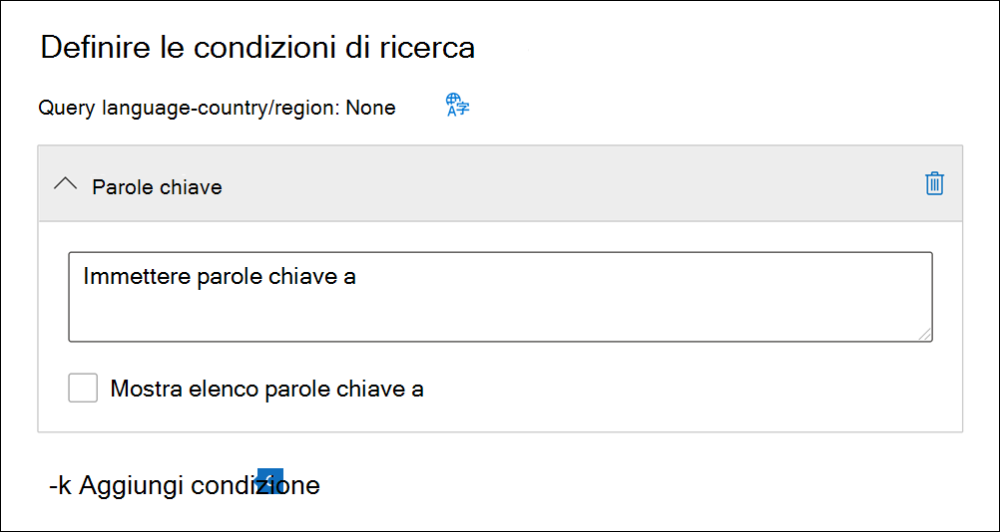

# Creare una ricerca contenutoCreate a content search

È possibile usare lo strumento ricerca contenuto di eDiscovery nel Centro conformità Microsoft 365 per cercare elementi sul posto, come messaggi di posta elettronica, documenti e conversazioni di messaggistica istantanea nell'organizzazione.You can use the Content search eDiscovery tool in the Microsoft 365 compliance center to search for in-place content such as email, documents, and instant messaging conversations in your organization. Usare questo strumento per cercare contenuto nelle origini dati di Microsoft 365 seguenti:Use this tool to search for content in these Microsoft 365 data sources:
  
- Cassette postali di Exchange OnlineExchange Online mailboxes

- Siti di SharePoint Online e account di OneDrive for BusinessSharePoint Online sites and OneDrive for Business accounts

- Microsoft TeamsMicrosoft Teams

- Gruppi di Microsoft 365Microsoft 365 Groups

- Gruppi di YammerYammer Groups

Dopo aver eseguito una ricerca, il numero di percorsi dei contenuti e il numero stimato dei risultati della ricerca vengono visualizzati nella pagina con riquadro a comparsa della ricerca.After you run a search, the number of content locations and an estimated number of search results are displayed on the search flyout page. È anche possibile visualizzare rapidamente le statistiche, come i percorsi di contenuto che contengono la maggior parte degli elementi corrispondenti alla query di ricerca.You can quickly view statistics, such as the content locations that have the most items that match the search query. Dopo l'esecuzione di una ricerca, è possibile visualizzare in anteprima i risultati o esportarli in un computer locale.After you run a search, you can preview the results or export them to a local computer.

## Creare ed eseguire una ricercaCreate and run a search

Per potere accedere alla pagina **Ricerca contenuto** nel Centro conformità Microsoft 365 (per eseguire ricerche, visualizzare in anteprima i risultati ed esportare i risultati), un amministratore, un responsabile della conformità o un responsabile di eDiscovery deve essere membro del gruppo di ruoli Responsabile di eDiscovery nel Centro sicurezza e conformità.To access to the **Content search** page in the Microsoft 365 compliance center (to run searches and preview results and export results), an administrator, compliance officer, or eDiscovery manager must be a member of the eDiscovery Manager role group in Security & Compliance Center. Per altre informazioni, vedere [Assegnare autorizzazioni di eDiscovery](assign-ediscovery-permissions.md).For more information, see [Assign eDiscovery permissions](assign-ediscovery-permissions.md).
  
1. Passare a <https://compliance.microsoft.com> e accedere con le credenziali di un account a cui sono state assegnate le autorizzazioni appropriate.Go to <https://compliance.microsoft.com> and sign in using the credentials of an account that's been assigned the appropriate permissions.

2. Nel riquadro di spostamento sinistro del Centro conformità Microsoft 365, fare clic su **Mostra tutto**, quindi su **Ricerca contenuto**.In the left navigation pane of the Microsoft 365 compliance center, click **Show all**, and then click **Content search**.

3. Nella pagina **Ricerca contenuto** fare clic su **Nuova ricerca**.On the **Content search** page, click **New search**.

   > [!NOTE]
   > L’opzione **Cerca per elenco ID** consente di cercare messaggi di posta elettronica specifici e altri elementi della cassetta postale tramite un elenco di ID di Exchange.The **Search by ID list** option lets you search for specific email messages and other mailbox items using a list of Exchange IDs. Per creare un elenco ID di ricerca, è necessario inviare un file con valori delimitati da virgole (CSV) che identifica gli elementi della cassetta postale specifici da cercare.To create an ID list search, you submit a comma-separated value (CSV) file that identifies the specific mailbox items to search for. Per istruzioni, vedere [Preparare un file CSV per un elenco ID di ricerca](csv-file-for-an-id-list-content-search.md).For instructions, see [Prepare a CSV file for an ID list search](csv-file-for-an-id-list-content-search.md).

4. Digitare un nome per la ricerca, una descrizione facoltativa che aiuta a identificare la ricerca.Type a name for the search, an optional description that helps identify the search. Il nome della ricerca deve essere univoco nell'organizzazione.The name of the search must be unique in your organization.

5. Nella pagina **Posizioni** scegliere le posizioni di contenuto in cui eseguire la ricerca.On the **Locations** page, choose the content locations that you want to search. È possibile cercare cassette postali, siti e cartelle pubbliche.You can search mailboxes, sites, and public folders.

    
  
   1. **Cassette postali di Exchange**: impostare l'interruttore su **Attivato** e quindi fare clic su **Scegliere utenti, gruppi o team** per specificare le cassette postali da mettere in attesa.**Exchange mailboxes**: Set the toggle to **On** and then click **Choose users, groups, or teams** to specify the mailboxes to place on hold. Utilizzare la casella di ricerca per trovare le cassette postali degli utenti e i gruppi di distribuzione da mettere in attesa (per mettere in attesa le cassette postali dei membri del gruppo).Use the search box to find user mailboxes and distribution groups (to place a hold on the mailboxes of group members) to place on hold. È anche possibile eseguire ricerche nella cassetta postale associata a un team di Microsoft Team (per i messaggi di canale), al gruppo di Office 365 e al gruppo di Yammer.You can also search the mailbox associated with a Microsoft Team (for channel messages), Office 365 Group, and Yammer Group. Per altre informazioni sui dati dell'applicazione archiviati nelle cassette postali, vedere [contenuto archiviato nelle cassette postali per eDiscovery](what-is-stored-in-exo-mailbox.md).For more information about the application data stored in mailboxes, see [Content stored in mailboxes for eDiscovery](what-is-stored-in-exo-mailbox.md).

   2. **Siti di SharePoint**: impostare l'interruttore su **Attivato** quindi fare clic su **Scegli siti** per specificare i siti di SharePoint e gli account di OneDrive da mettere in blocco.**SharePoint sites**: Set the toggle to **On** and then click **Choose sites** to specify SharePoint sites and OneDrive accounts to place on hold. Digitare l'URL per ogni sito che si desidera mettere in blocco.Type the URL for each site that you want to place on hold. È anche possibile aggiungere l'URL del sito di SharePoint per un team di Microsoft Team, un gruppo di Office 365 o un gruppo di Yammer.You can also add the URL for the SharePoint site for a Microsoft Team, Office 365 Group, or Yammer Group.
  
   3. **Cartelle pubbliche di Exchange**: impostare l'interruttore su **attivato** per mettere in stato di blocco tutte le cartelle pubbliche nell'organizzazione di Exchange Online.**Exchange public folders**: Set the toggle to **On** to put all public folders in your Exchange Online organization on hold. Non è possibile scegliere cartelle pubbliche specifiche da mettere in blocco.You can't choose specific public folders to put on hold. Lasciare l'interruttore disattivato se non si vuole impostare un blocco sulle cartelle pubbliche.Leave the toggle switch off if you don't want to put a hold on public folders.
  
   4. Mantenere selezionata questa casella di controllo per cercare contenuto di Teams per gli utenti locali.Keep this checkbox selected to search for Teams content for on-premises users. Ad esempio, se si esegue una ricerca in tutte le cassette postali di Exchange nell'organizzazione e si seleziona questa casella di controllo, la risorsa di archiviazione basata sul cloud usata per archiviare i dati chat di Teams per gli utenti locali verrà inclusa nell'ambito della ricerca.For example, if you search all Exchange mailboxes in the organization and this checkbox is selected, the cloud-based storage used to store Teams chat data for on-premises users will be included in the scope of the search. Per altre informazioni, vedere [Cercare i dati delle chat di Teams degli utenti locali](search-cloud-based-mailboxes-for-on-premises-users.md).For more information, see [Search for Teams chat data for on-premises users](search-cloud-based-mailboxes-for-on-premises-users.md).

6. Nella pagina **Definisci le tue condizioni di ricerca** digitare una query con parole chiave e, se necessario, aggiungere condizioni alla query di ricerca.On the **Define your search conditions** page, type a keyword query and add conditions to the search query if necessary.

   

   1. È possibile specificare parole chiave, proprietà dei messaggi come le date di invio o ricezione o proprietà dei documenti come il nome file o la data dell'ultima modifica apportata.Specify keywords, message properties such as sent and received dates, or document properties such as file names or the date that a document was last changed. È anche possibile usare query più complesse che usano un operatore booleano, come ad esempio **AND**, **OR**, **NOT** o **NEAR**.You can use more complex queries that use a Boolean operator, such as **AND**, **OR**, **NOT**, and **NEAR**. Se si lascia vuota la casella delle parole chiave, nei risultati della ricerca verrà incluso tutto il contenuto disponibile nelle posizioni specificate.If you leave the keyword box empty, all content located in the specified content locations is included in the search results. Per altre informazioni, vedere [Query con parola chiave e condizioni di ricerca per eDiscovery](keyword-queries-and-search-conditions.md).For more information, see [Keyword queries and search conditions for eDiscovery](keyword-queries-and-search-conditions.md).

   2. È anche possibile fare clic sulla casella di controllo **Mostra elenco di parole chiave** e digitare una parola chiave in ogni riga.Alternatively, you can click the **Show keyword list** checkbox and the type a keyword in each row. Se si esegue questa operazione, le parole chiave in ogni riga sono collegate da un operatore logico (**c:s**) con funzionalità simili all’operatore **OR** nella query di ricerca creata.If you do this, the keywords on each row are connected by a logical operator (**c:s**) that is similar in functionality to the **OR** operator in the search query that's created.

      Perché usare l'elenco di parole chiave?Why use the keyword list? È possibile ottenere statistiche che mostrano il numero di elementi che corrispondono a ogni parola chiave.You can get statistics that show how many items match each keyword. Questo è utile per identificare rapidamente le parole chiave più e meno efficaci.This can help you quickly identify which keywords are the most (and least) effective. È possibile usare anche una frase chiave, racchiusa tra parentesi, in una riga.You can also use a keyword phrase (surrounded by parentheses) in a row. Per altre informazioni sulla lista delle parole chiave e sulle statistiche di ricerca, vedere [Visualizzare statistiche delle parole chiave](view-keyword-statistics-for-content-search.md#get-keyword-statistics-for-searches).For more information about the keyword list and search statistics, see [Get keyword statistics for searches](view-keyword-statistics-for-content-search.md#get-keyword-statistics-for-searches).

      > [!NOTE]
      > Per ridurre i problemi causati dai grandi elenchi di parole chiave, è consentito un massimo di 20 righe nell'elenco di parole chiave.To help reduce issues caused by large keyword lists, you're limited to a maximum of 20 rows in the keyword list.

   3. È possibile aggiungere delle condizioni di ricerca per circoscrivere una ricerca e ottenere un insieme di risultati più preciso.You can add search conditions to narrow a search and return a more refined set of results. Ogni condizione aggiunge una clausola alla query di ricerca creata ed eseguita all'avvio della ricerca.Each condition adds a clause to the search query that is created and run when you start the search. Una condizione è collegata logicamente alla query con parole chiave, specificata nell'apposita casella, dall'operatore logico (**c:c**) che ha funzionalità simili all’operatore **AND**.A condition is logically connected to the keyword query (specified in the keyword box) by a logical operator (**c:c**) that is similar in functionality to the **AND** operator. Ciò significa che, per essere inclusi nei risultati, gli elementi devono soddisfare sia la query con parola chiave, sia una o più condizioni.That means that items have to satisfy both the keyword query and one or more conditions to be included in the results. Ecco in che modo le condizioni aiutano a limitare i risultati.This is how conditions help to narrow your results. Per un elenco e una descrizione delle condizioni che è possibile usare in una query di ricerca, vedere [Condizioni di ricerca](keyword-queries-and-search-conditions.md#search-conditions).For a list and description of conditions that you can use in a search query, see [Search conditions](keyword-queries-and-search-conditions.md#search-conditions).

7. Esaminare le impostazioni di ricerca (e modificarle se necessario) e quindi inviare la ricerca per avviarla.Review the search settings (and edit if necessary), and then submit the search to start it.
  
Per accedere nuovamente alla ricerca contenuto o accedere ad altre ricerche contenuto elencate nella pagina **Ricerca contenuto**, selezionare la ricerca e quindi fare clic su **Apri**.To access this content search again or access other content searches listed on the **Content search** page, select the search and then click **Open**.

## Passaggi successiviNext steps

Ecco un elenco dei passaggi successivi da eseguire dopo la creazione e l'esecuzione di una ricerca contenuto.Here's a list of next steps to perform after you create and run a Content search.

- [Visualizzare l'anteprima dei risultati della ricercaPreview search results](preview-ediscovery-search-results.md)

- [Visualizzare le statistiche per i risultati della ricercaView statistics for search results](view-keyword-statistics-for-content-search.md)

- [Esportare i risultati della ricercaExport search results](export-search-results.md)

- [Esportare un report sulle ricercheExport a search report](export-a-content-search-report.md)

## Altre informazioniMore information

Per altre informazioni sulla Ricerca contenuto, come la ricerca di contenuti in vari servizi di Microsoft 365, vedere [Riferimento funzionalità per Ricerca contenuto](content-search-reference.md).For more information about Content search, such as searching for content in different Microsoft 365 services, see [Feature reference for Content search](content-search-reference.md).
