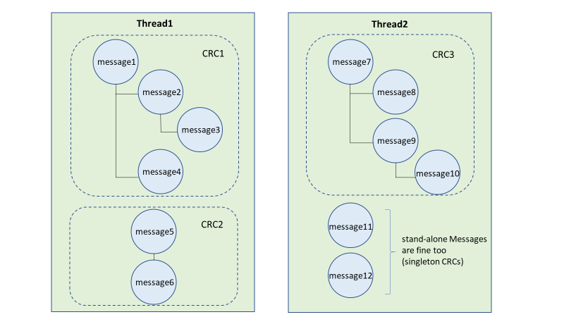

# Threading delle conversazioni in Advanced eDiscoveryConversation threading in Advanced eDiscovery

La messaggistica istantanea è un modo pratico per porre domande, condividere idee o comunicare rapidamente tra gruppi di destinatari di grandi dimensioni.Instant messaging is a convenient way to ask questions, share ideas, or quickly communicate across large audiences. Poiché le piattaforme di messaggistica istantanea, come i gruppi Microsoft Teams e Yammer, diventano fondamentali per la collaborazione aziendale, le organizzazioni devono valutare il modo in cui il flusso di lavoro di eDiscovery affronta queste nuove forme di comunicazione e collaborazione.As instant messaging platforms, like Microsoft Teams and Yammer groups, become core to enterprise collaboration, organizations must evaluate how their eDiscovery workflow addresses these new forms of communication and collaboration.

La funzionalità ricostruzione conversazioni in Advanced eDiscovery è progettata per consentire di identificare il contenuto contestuale e produrre visualizzazioni di conversazione distinte.The Conversation Reconstruction feature in Advanced eDiscovery is designed to help you identify contextual content and produce distinct conversation views. Questa funzionalità consente di esaminare in modo efficiente e rapido conversazioni complete di messaggistica istantanea (denominate anche conversazioni a *thread)* generate in piattaforme come Microsoft Teams.This capability allows you to efficiently and rapidly review complete instant message conversations (also called *threaded conversations*) that are generated in platforms like Microsoft Teams.

Con la ricostruzione delle conversazioni, puoi usare le funzionalità integrate per ricostruire, rivedere ed esportare conversazioni a thread.With Conversation Reconstruction, you can use built-in capabilities to reconstruct, review, and export threaded conversations. Utilizzare Advanced eDiscovery ricostruzione della conversazione per:Use Advanced eDiscovery Conversation Reconstruction to:

- Conservare metadati univoci a livello di messaggio in tutti i messaggi all'interno di una conversazione.Preserve unique message-level metadata across all messages within a conversation.

- Raccogliere i messaggi contestuali relativi ai risultati della ricerca.Collect contextual messages around your search results.

- Rivedere, annotare e redigere conversazioni in thread.Review, annotate, and redact threaded conversations.

- Esportare singoli messaggi o conversazioni in threadExport individual messages or threaded conversations

## TerminologiaTerminology

Ecco alcune definizioni utili per iniziare a usare la ricostruzione delle conversazioni.Here are few definitions to help you get start using Conversation Reconstruction.

- **Messaggi:** Rappresenta l'unità più piccola di una conversazione.**Messages:** Represent the smallest unit of a conversation. I messaggi possono variare in base alle dimensioni, alla struttura e ai metadati.Messages may vary in size, structure, and metadata.

- **Conversazione:** Rappresenta un raggruppamento di uno o più messaggi.**Conversation:** Represents a grouping of one or more messages. In diverse applicazioni, le conversazioni possono essere rappresentate in modi diversi.Across different applications, conversations may be represented in different ways. In alcune applicazioni esiste un'azione esplicita che deriva dalla risposta a un messaggio esistente.In some applications, there is an explicit action that results from replying to an existing message. Le conversazioni vengono formate in modo esplicito a seguito di questa azione dell'utente.Conversations are formed explicitly as a result of this user action. Ad esempio, ecco uno screenshot di una conversazione di canale in Microsoft Teams.For example, here is a screenshot of a channel conversation in Microsoft Teams.

   

   In altre app (ad esempio i messaggi di chat 1xN in Teams), non esiste una catena di risposta formale e i messaggi vengono invece visualizzati come un "fiume piatto di messaggi" all'interno di un singolo thread.In other apps (such as 1xN chat messages in Teams), there is not a formal reply chain and instead messages appear as a "flat river of messages" within a single thread. In questi tipi di app, le conversazioni vengono dedotto da un gruppo di messaggi che si verificano entro un determinato periodo di tempo.In these types apps, conversations are inferred from a group of messages that occur within a certain time. Questo "raggruppamento soft" dei messaggi (anziché una catena di risposte) rappresenta la conversazione "avanti e indietro" su un argomento specifico di interesse.This "soft-grouping" of messages (as opposed to a reply chain) represent the "back and forth" conversation about a specific topic of interest.

## Passaggio 1: Creare una raccolta di bozzeStep 1: Create a draft collection

Dopo aver identificato i custodi e le posizioni dei contenuti rilevanti, è possibile creare una ricerca per trovare contenuto potenzialmente pertinente.After you have identified relevant custodians and content locations, you can create a search to find potentially relevant content. Nella scheda **Raccolte** del caso Advanced eDiscovery, è possibile creare una raccolta facendo clic su **Nuova raccolta** e seguendo la procedura guidata.On the **Collections** tab in the Advanced eDiscovery case, you can create a collection by clicking **New collection** and following the wizard. Per informazioni su come creare una raccolta, creare una query di ricerca e visualizzare in anteprima i risultati della ricerca, vedere [Create a draft collection.](create-draft-collection.md)For information about how you can create a collection, build a search query, and preview the search results, see [Create a draft collection](create-draft-collection.md).

## Passaggio 2: Eseguire il commit di una bozza di raccolta in un set di revisioneStep 2: Commit a draft collection to a review set

Dopo aver esaminato e finalizzato la query di ricerca in una raccolta, è possibile aggiungere i risultati della ricerca a un set di revisione.After you have reviewed and finalized the search query in a collection, you can add the search results to a review set. Quando si aggiungono i risultati della ricerca in un set di revisione, i dati originali vengono copiati in un'area Archiviazione di Azure per facilitare il processo di revisione e analisi.When you add your search results into a review set, the original data is copied to an Azure Storage area to facilitate the review and analysis process. Per ulteriori informazioni sull'aggiunta dei risultati di ricerca a un set di revisione, vedere [Commit di una raccolta di bozze in un set di revisione.](commit-draft-collection.md)For more information about adding search results to a review set, see [Commit a draft collection to a review set](commit-draft-collection.md).

Quando aggiungi elementi dalle conversazioni a un set di recensioni, puoi usare l'opzione conversazioni a thread per raccogliere messaggi contestuali dalle conversazioni che contengono elementi che corrispondono ai criteri di ricerca della raccolta.When you add items from conversations to a review set, you can use the threaded conversations option to collect contextual messages from conversations that contain items that match the search criteria of the collection. Dopo aver selezionato l'opzione conversazioni di thread, possono verificarsi le operazioni seguenti:After you select the thread conversations option, the following things can happen:

  

1. Utilizzando una parola chiave e una query di intervallo di date, la ricerca ha restituito un risultato *nel messaggio 3.*Using a keyword and date range query, the search returned a hit on *Message 3*. Questo messaggio fa parte di una conversazione più ampia, illustrata da *CRC1.*This message was part of a larger conversation, illustrated by *CRC1*.

2. Quando aggiungi i dati in un set di recensioni e abiliti le opzioni di recupero della conversazione, Advanced eDiscovery torna indietro e raccogli altri elementi in *CRC1.*When you add the data into a review set and enable the conversation retrieval options, Advanced eDiscovery will go back and collect other items in *CRC1*.

3. Dopo aver aggiunto gli elementi al set di revisione, è possibile esaminare tutti i singoli messaggi di *CRC1.*After the items have been added to the review set, you can review all the individual messages from *CRC1*.

Per abilitato l'opzione conversazioni in thread, vedere [Commit di una bozza di raccolta in un set di revisione.](commit-draft-collection.md#commit-a-draft-collection-to-a-review-set)To enabled the threaded conversations option, see [Commit a draft collection to a review set](commit-draft-collection.md#commit-a-draft-collection-to-a-review-set).

## Passaggio 3: esaminare ed esportare conversazioni in threadStep 3: Review and export threaded conversations

Dopo che il contenuto è stato elaborato e aggiunto al set di recensioni, puoi iniziare a esaminare i dati nel set di recensioni.After the content has been processed and added to the review set, you can start reviewing the data in the review set. Le funzionalità di revisione sono diverse a seconda che il contenuto sia stato aggiunto a un set di revisione standard o a un set di recensioni di conversazione.The review capabilities are different depending on whether the content was added to a standard review set or a conversation review set.

### Revisione delle conversazioni in un set di recensioni standardReviewing conversations in a standard review set

In un set di revisione standard, i messaggi vengono elaborati e visualizzati come singoli elementi, in modo analogo a come vengono archiviati in una cartella delle cassette postali.In a standard review set, messages are processed and displayed as individual items, similar to how they're stored in a mailbox folder. In questo flusso di lavoro, ogni messaggio viene elaborato come elemento separato.In this workflow, each message is processed as a separate item. Di conseguenza, le opzioni di riepilogo ed esportazione a thread non sono disponibili in un set di revisione standard.As a result, the threaded summary and export options aren't available in a standard review set.

  

### Revisione delle conversazioni in un set di revisione delle conversazioniReviewing conversations in a conversation review set

In un set di revisione delle conversazioni, i singoli messaggi vengono threadati e presentati come conversazioni.In a conversation review set, individual messages are threaded together and presented as conversations. In questo modo è possibile esaminare ed esportare conversazioni contestuali.This lets you review and export contextual conversations.

  

Le sezioni seguenti descrivono la revisione e l'esportazione di conversazioni in un set di revisione delle conversazioni.The following sections describe reviewing and exporting conversations in a conversation review set.

#### Revisione delle conversazioniReviewing conversations

In un set di revisione delle conversazioni, puoi usare le opzioni seguenti per facilitare il processo di revisione.In a conversation review set, you can use the following options to facilitate the review process.

- **Raggruppa per conversazione:** Raggruppa i messaggi all'interno della stessa conversazione per aiutare gli utenti a semplificare e accelerare il processo di revisione.**Group by conversation:** Groups messages within the same conversation together to help users simplify and expedite their review process.

- **Visualizzazione riepilogo:** Visualizza la conversazione a thread.**Summary view:** Displays the threaded conversation. In questa visualizzazione è possibile visualizzare l'intera conversazione e accedere ai metadati per ogni singolo messaggio.In this view, you can see the entire conversation and also access the metadata for each individual message.

   - Visualizzare i metadati per i singoli messaggiView metadata for individual messages

   - Scaricare singoli messaggiDownload individual messages

- **Visualizzazione testo:** Fornisce il testo estratto per l'intera conversazione.**Text view:** Provides the extracted text for the entire conversation.

- **Annotate view:** Consente di aggiungere un markup a una visualizzazione a thread della conversazione.**Annotate view:** Lets you markup a threaded view of the conversation. Tutti i messaggi della conversazione condividono lo stesso documento annotato.All messages in the conversation share the same annotated document.

- **Tagging:** Quando visualizzi le conversazioni in un set di recensioni, puoi visualizzare e applicare i tag facendo clic sul **pannello Tagging** nel pannello Codifica.**Tagging:** When viewing conversations in a review set, you can view and apply tags by clicking **Tagging panel** in the Coding panel.

- **Eseguire di nuovo la conversione della conversazione:** Quando i messaggi vengono aggiunti a un set di revisione delle conversazioni, viene eseguito automaticamente un processo di conversione per creare il riepilogo a thread e annotare le visualizzazioni.**Rerun conversation conversion:** When messages are added to a conversation review set, a conversion job is automatically run to create the threaded summary and annotate views. Se il processo di ricostruzione della conversazione ha esito negativo, è possibile rieseguire il processo facendo clic su Azione **> Creare PDF** di conversazione nel set di revisioni.If the Conversation Reconstruction job fails, you can rerun this job by clicking **Action > Create conversation PDFs** in the review set.

#### Esportazione di conversazioniExporting conversations

In un set di revisione delle conversazioni, puoi impostare le opzioni seguenti per esportare le conversazioni:In a conversation review set, you can set the following options to export conversations:

1. Opzioni metadati:Metadata options:
   - **Carica file:** I metadati sono inclusi per ogni singolo messaggio, messaggio di posta elettronica e documento.**Load file:** Metadata is included for each individual message, email, and document. In una conversazione è presente una riga per ogni messaggio.There is one row for each message in a conversation.
   - **Tag:** I tag del processo di revisione sono inclusi nel file di metadati.**Tags:** Tags from your review process are included in the metadata file. I messaggi di una conversazione condividono gli stessi tag.Messages in a conversation share the same tags.

2. Opzioni di conversazione:Conversation options:
   - **File di conversazione:** Quando si esportano file di conversazione, la visualizzazione con annotazioni viene convertita in un file PDF e scaricata nella cartella di esportazione.**Conversation files:** When you export conversation files, the annotated view is converted to a PDF file and downloaded to the export folder. I messaggi in un file di conversazione puntano alla versione PDF dello stesso file di conversazione.Messages in one conversation file point to the PDF version of the same conversation file.
   - **Singoli messaggi di chat:** Quando si esportano singoli messaggi, ogni messaggio univoco nella conversazione viene esportato come elemento autonomo.**Individual chat messages:** When you export individual messages, each unique message in the conversation is exported as a standalone item. Il file viene esportato nello stesso formato in cui è stato salvato nella cassetta postale.The file is exported in the same format that it was saved as in the mailbox. Per una conversazione specifica, si ricevono più file msg.For a specific conversation, you receive multiple .msg files.

     > [!NOTE]
     > Se sono state applicate annotazioni al file di conversazione, queste annotazioni non verranno trasferite ai singoli messaggi.If you applied annotations to the conversation file, these annotations won't be transferred to the individual messages.

3. Altre opzioni:Other options:
   - **Generare file di testo per tutto il contenuto esportato:** Genera un file di testo per ogni conversazione esportata dal set di recensioni.**Generate text files for all exported content:** Generates a text file for each conversation exported from the review set.
   - **Sostituisci il contenuto esportato con PDF redatti:** Se i file di conversazione redatti vengono generati durante il processo di revisione, questi file sono disponibili durante l'esportazione.**Replace exported content with redacted PDFs:** If redacted conversation files are generated during the review process, then these files are available during export. Puoi decidere se esportare solo i file nativi (non selezionando questa opzione) o sostituire i file nativi con le versioni rievocate dei file nativi (selezionando questa opzione), che vengono esportati come file PDF.You can decided whether to export only the native files (by not selecting this option) or to replace the native files with the redacted versions of the native files (by selecting this option), which are exported as PDF files.

## Ulteriori informazioniMore information

Per ulteriori informazioni su come esaminare i dati dei casi in Advanced eDiscovery, vedere gli articoli seguenti:To learn more about how to review case data in Advanced eDiscovery, see the following articles:

- [Visualizzare i dati del casoView case data](view-documents-in-review-set.md)
- [Analizzare i dati del casoAnalyze case data](analyzing-data-in-review-set.md)
- [Esportare i dati del casoExport case data](exporting-data-ediscover20.md)
