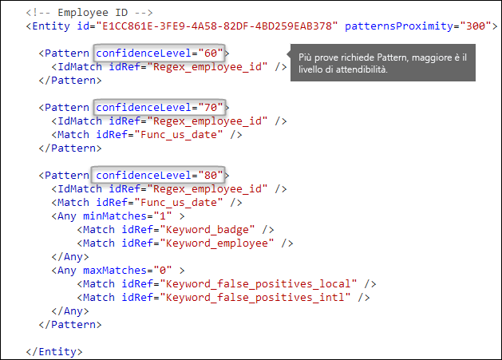

# <a name="create-a-custom-sensitive-information-type-using-powershell"></a><span data-ttu-id="16a10-103">Creare tipi di informazioni sensibili personalizzati usando PowerShell</span><span class="sxs-lookup"><span data-stu-id="16a10-103">Create a custom sensitive information type using PowerShell</span></span>

<span data-ttu-id="16a10-104">Questo argomento mostra come usare PowerShell per creare un *pacchetto di regole* XML che definisce un [tipo di informazione sensibile](sensitive-information-type-entity-definitions.md) personalizzato.</span><span class="sxs-lookup"><span data-stu-id="16a10-104">This topic shows you how to use PowerShell to create an XML *rule package* file that defines your own custom [sensitive information types](sensitive-information-type-entity-definitions.md).</span></span> <span data-ttu-id="16a10-105">È necessario sapere come si creano le espressioni regolari.</span><span class="sxs-lookup"><span data-stu-id="16a10-105">You need to know how to create a regular expression.</span></span> <span data-ttu-id="16a10-106">Ad esempio, in questo argomento viene creato un tipo di informazioni riservate personalizzato che identifica un ID dipendente.</span><span class="sxs-lookup"><span data-stu-id="16a10-106">As an example, this topic creates a custom sensitive information type that identifies an employee ID.</span></span> <span data-ttu-id="16a10-107">È possibile usare questo file XML di esempio come punto di partenza per il proprio file XML.</span><span class="sxs-lookup"><span data-stu-id="16a10-107">You can use this example XML as a starting point for your own XML file.</span></span> <span data-ttu-id="16a10-108">Se non hai familiarità con i tipi di informazioni sensibili, leggi [Altre informazioni sui tipi di informazioni sensibili](sensitive-information-type-learn-about.md).</span><span class="sxs-lookup"><span data-stu-id="16a10-108">If you are new to sensitive information types, see [Learn about sensitive information types](sensitive-information-type-learn-about.md).</span></span>

<span data-ttu-id="16a10-p102">Dopo aver creato un file XML ben formato, è possibile caricarlo in Microsoft 365 con PowerShell di Microsoft 365. A questo punto è possibile utilizzare il tipo di informazioni sensibili personalizzato nei criteri e verificare che stia rilevando le informazioni sensibili come previsto.</span><span class="sxs-lookup"><span data-stu-id="16a10-p102">After you've created a well-formed XML file, you can upload it to Microsoft 365 by using Microsoft 365 PowerShell. Then you're ready to use your custom sensitive information type in your policies and test that it's detecting the sensitive information as you intended.</span></span>

> [!NOTE]
> <span data-ttu-id="16a10-111">Se i comandi di PowerShell non sono necessari, si possono creare dei tipi di informazioni sensibili personalizzati nel Centro conformità. </span><span class="sxs-lookup"><span data-stu-id="16a10-111">If you don't need the fine grained control that PowerShell provides, you can create custom sensitive information types in the Compliance center.</span></span> <span data-ttu-id="16a10-112">Per altre informazioni, vedere [Creare un tipo di informazione sensibile personalizzato](create-a-custom-sensitive-information-type.md).</span><span class="sxs-lookup"><span data-stu-id="16a10-112">For more information, see [Create a custom sensitive information type](create-a-custom-sensitive-information-type.md).</span></span>

## <a name="important-disclaimer"></a><span data-ttu-id="16a10-113">Dichiarazione di non responsabilità importante</span><span class="sxs-lookup"><span data-stu-id="16a10-113">Important disclaimer</span></span>

<span data-ttu-id="16a10-p104"> A causa degli scostamenti negli ambienti dei clienti e dei requisiti di corrispondenza del contenuto, il supporto tecnico Microsoft non può dare assistenza nella fornitura di definizioni di corrispondenza del contenuto personalizzate, ad esempio definizione di classificazioni personalizzate o modelli di espressioni regolari (noti anche come RegEx). Per lo sviluppo personalizzato di corrispondenza del contenuto, test e debug, i clienti di Microsoft 365 dovranno fare affidamento su risorse IT interne o utilizzare una risorsa di consulenza esterna come Microsoft Consulting Services (MCS). I tecnici del supporto possono fornire supporto limitato per la funzionalità, ma non possono garantire che qualsiasi sviluppo personalizzato di corrispondenza del contenuto soddisfi i requisiti o gli obblighi del cliente. Come esempio del tipo di supporto che può essere fornito, è possibile fornire esempi di modelli di espressioni regolari a scopo di test. In alternativa, il supporto può aiutare nella risoluzione dei problemi di un pattern RegEx esistente che non si attiva come previsto con un singolo esempio di contenuto specifico.</span><span class="sxs-lookup"><span data-stu-id="16a10-p104">Due to the variances in customer environments and content match requirements, Microsoft Support cannot assist in providing custom content-matching definitions; e.g., defining custom classifications or regular expression (also known as RegEx) patterns. For custom content-matching development, testing, and debugging, Microsoft 365 customers will need to rely upon internal IT resources, or use an external consulting resource such as Microsoft Consulting Services (MCS). Support engineers can provide limited support for the feature, but cannot provide assurances that any custom content-matching development will fulfill the customer's requirements or obligations.  As an example of the type of support that can be provided, sample regular expression patterns may be provided for testing purposes. Or, support can assist with troubleshooting an existing RegEx pattern which is not triggering as expected with a single specific content example.</span></span>

<span data-ttu-id="16a10-119">Vedere [Possibili problemi di convalida da tenere presenti](#potential-validation-issues-to-be-aware-of) in questo argomento.</span><span class="sxs-lookup"><span data-stu-id="16a10-119">See [Potential validation issues to be aware of](#potential-validation-issues-to-be-aware-of) in this topic.</span></span>

<span data-ttu-id="16a10-120">Per ulteriori informazioni sul motore Boost.RegEx (in precedenza noto come RegEx++) utilizzato per l'elaborazione del testo, vedere [Boost.Regex 5.1.3](https://www.boost.org/doc/libs/1_68_0/libs/regex/doc/html/).</span><span class="sxs-lookup"><span data-stu-id="16a10-120">For more information about the Boost.RegEx (formerly known as RegEx++) engine that's used for processing the text, see [Boost.Regex 5.1.3](https://www.boost.org/doc/libs/1_68_0/libs/regex/doc/html/).</span></span>

## <a name="sample-xml-of-a-rule-package"></a><span data-ttu-id="16a10-121">Esempio di XML di un pacchetto di regole</span><span class="sxs-lookup"><span data-stu-id="16a10-121">Sample XML of a rule package</span></span>

<span data-ttu-id="16a10-p105">Di seguito viene mostrato il codice XML del pacchetto di regole che verrà creato in questo argomento. Nelle sezioni seguenti vengono illustrati gli elementi e gli attributi.</span><span class="sxs-lookup"><span data-stu-id="16a10-p105">Here's the sample XML of the rule package that we'll create in this topic. Elements and attributes are explained in the sections below.</span></span>
  
```xml
<?xml version="1.0" encoding="UTF-16"?>
<RulePackage xmlns="http://schemas.microsoft.com/office/2011/mce">
<RulePack id="DAD86A92-AB18-43BB-AB35-96F7C594ADAA">
    <Version build="0" major="1" minor="0" revision="0"/>
    <Publisher id="619DD8C3-7B80-4998-A312-4DF0402BAC04"/>
    <Details defaultLangCode="en-us">
        <LocalizedDetails langcode="en-us">
            <PublisherName>Contoso</PublisherName>
            <Name>Employee ID Custom Rule Pack</Name>
            <Description>
            This rule package contains the custom Employee ID entity.
            </Description>
        </LocalizedDetails>
    </Details>
</RulePack>
<Rules>
<!-- Employee ID -->
    <Entity id="E1CC861E-3FE9-4A58-82DF-4BD259EAB378" patternsProximity="300" recommendedConfidence="75">
        <Pattern confidenceLevel="65">
            <IdMatch idRef="Regex_employee_id"/>
        </Pattern>
        <Pattern confidenceLevel="75">
            <IdMatch idRef="Regex_employee_id"/>
            <Match idRef="Func_us_date"/>
        </Pattern>
        <Pattern confidenceLevel="85">
            <IdMatch idRef="Regex_employee_id"/>
            <Match idRef="Func_us_date"/>
            <Any minMatches="1">
                <Match idRef="Keyword_badge" minCount="2"/>
                <Match idRef="Keyword_employee"/>
            </Any>
            <Any minMatches="0" maxMatches="0">
                <Match idRef="Keyword_false_positives_local"/>
                <Match idRef="Keyword_false_positives_intl"/>
            </Any>
        </Pattern>
    </Entity>
    <Regex id="Regex_employee_id">(\s)(\d{9})(\s)</Regex>
    <Keyword id="Keyword_employee">
        <Group matchStyle="word">
            <Term>Identification</Term>
            <Term>Contoso Employee</Term>
        </Group>
    </Keyword>
    <Keyword id="Keyword_badge">
        <Group matchStyle="string">
            <Term>card</Term>
            <Term>badge</Term>
            <Term caseSensitive="true">ID</Term>
        </Group>
    </Keyword>
    <Keyword id="Keyword_false_positives_local">
        <Group matchStyle="word">
            <Term>credit card</Term>
            <Term>national ID</Term>
        </Group>
    </Keyword>
    <Keyword id="Keyword_false_positives_intl">
        <Group matchStyle="word">
            <Term>identity card</Term>
            <Term>national ID</Term>
            <Term>EU debit card</Term>
        </Group>
    </Keyword>
    <LocalizedStrings>
        <Resource idRef="E1CC861E-3FE9-4A58-82DF-4BD259EAB378">
            <Name default="true" langcode="en-us">Employee ID</Name>
            <Description default="true" langcode="en-us">
            A custom classification for detecting Employee IDs.
            </Description>
            <Description default="false" langcode="de-de">
            Description for German locale.
            </Description>
        </Resource>
    </LocalizedStrings>
</Rules>
</RulePackage>
```

## <a name="what-are-your-key-requirements-rule-entity-pattern-elements"></a><span data-ttu-id="16a10-p106">Quali sono i requisiti principali? [elementi regola, entità, motivo]</span><span class="sxs-lookup"><span data-stu-id="16a10-p106">What are your key requirements? [Rule, Entity, Pattern elements]</span></span>

<span data-ttu-id="16a10-126">Prima di iniziare, è utile comprendere la struttura di base dello schema XML per una regola e come è possibile utilizzare questa struttura per definire il tipo di informazioni riservate personalizzato in modo che identifichi il contenuto corretto.</span><span class="sxs-lookup"><span data-stu-id="16a10-126">Before you get started, it's helpful to understand the basic structure of the XML schema for a rule, and how you can use this structure to define your custom sensitive information type so that it will identify the right content.</span></span>
  
<span data-ttu-id="16a10-p107">Una regola (Rule) definisce una o più entità (tipi di informazioni sensibili), mentre ogni entità (Entity) definisce uno o più modelli. Un modello (Pattern) è l'elemento cercato da un criterio quando valuta contenuti come messaggi di posta elettronica e documenti.</span><span class="sxs-lookup"><span data-stu-id="16a10-p107">A rule defines one or more entities (sensitive information types), and each entity defines one or more patterns. A pattern is what a policy looks for when it evaluates content such as email and documents.</span></span>

<span data-ttu-id="16a10-p108">In questo argomento, il markup XML usa il termine regola per indicare i modelli che definiscono un'entità, nota anche come tipo di informazioni sensibili. Quindi, in questo argomento il termine regola viene usato per indicare un'entità o un tipo di informazioni sensibili, non condizioni e azioni.</span><span class="sxs-lookup"><span data-stu-id="16a10-p108">In this topic, the XML markup uses rule to mean the patterns that define an entity, also known as a sensitive information type. So in this topic, when you see rule, think entity or sensitive information type, not conditions and actions.</span></span>
  
### <a name="simplest-scenario-entity-with-one-pattern"></a><span data-ttu-id="16a10-131">Scenario più semplice: entità con un solo modello</span><span class="sxs-lookup"><span data-stu-id="16a10-131">Simplest scenario: entity with one pattern</span></span>

<span data-ttu-id="16a10-p109">Si tratta dello scenario più semplice. Si desidera utilizzare il criterio per identificare il contenuto che include l'ID dipendente dell'organizzazione, formattato come un numero di nove cifre. Pertanto, il modello fa riferimento a un'espressione regolare contenuta nella regola che identifica i numeri di nove cifre. Qualsiasi contenuto includa un numero di nove cifre soddisfa il modello.</span><span class="sxs-lookup"><span data-stu-id="16a10-p109">Here's the simplest scenario. You want your policy to identify content that contains your organization's employee ID, which is formatted as a nine-digit number. So the pattern refers to a regular expression contained in the rule that identifies nine-digit numbers. Any content containing a nine-digit number satisfies the pattern.</span></span>
  

  
<span data-ttu-id="16a10-137">Tuttavia, sebbene semplici, questo modello può rilevare molti falsi positivi confrontando il contenuto che include un numero di nove cifre che non è necessariamente un ID dipendente.</span><span class="sxs-lookup"><span data-stu-id="16a10-137">However, while simple, this pattern may identify many false positives by matching content that contains any nine-digit number that is not necessarily an employee ID.</span></span>
  
### <a name="more-common-scenario-entity-with-multiple-patterns"></a><span data-ttu-id="16a10-138">Scenario più comune: entità con più modelli</span><span class="sxs-lookup"><span data-stu-id="16a10-138">More common scenario: entity with multiple patterns</span></span>

<span data-ttu-id="16a10-139">Per questo motivo, è più comune per definire un'entità con più modelli, laddove i modelli identificano prove a supporto (ad esempio, una parola chiave o una data) oltre all'entità (ad esempio un numero a nove cifre).</span><span class="sxs-lookup"><span data-stu-id="16a10-139">For this reason, it's more common to define an entity by using more than one pattern, where the patterns identify supporting evidence (such as a keyword or date) in addition to the entity (such as a nine-digit number).</span></span>
  
<span data-ttu-id="16a10-140">Ad esempio, per aumentare le probabilità di identificazione di contenuto che include un ID dipendente, è possibile definire anche la data di assunzione e definire un altro modello che identifica sia la data di assunzione che una parola chiave (ad esempio "ID dipendente"), oltre al numero di nove cifre.</span><span class="sxs-lookup"><span data-stu-id="16a10-140">For example, to increase the likelihood of identifying content that contains an employee ID, you can define another pattern that also identifies a hire date, and define yet another pattern that identifies both a hire date and a keyword (such as "employee ID"), in addition to the nine-digit number.</span></span>
  

  
<span data-ttu-id="16a10-142">Tenere presente alcuni aspetti importanti di questa struttura:</span><span class="sxs-lookup"><span data-stu-id="16a10-142">Note a couple of important aspects of this structure:</span></span>
  
- <span data-ttu-id="16a10-p110">I criteri che richiedono altre prove hanno un livello di confidenza più alto. Questo è utile perché, quando si userà questo tipo di informazioni sensibili in un criterio in un secondo momento, sarà possibile usare azioni più restrittive, ad esempio il blocco del contenuto, solo per le corrispondenze con confidenza più alta, mentre per quelle con confidenza più bassa si potranno usare azioni meno restrittive, come l'invio di una notifica.</span><span class="sxs-lookup"><span data-stu-id="16a10-p110">Patterns that require more evidence have a higher confidence level. This is useful because when you later use this sensitive information type in a policy, you can use more restrictive actions (such as block content) with only the higher-confidence matches, and you can use less restrictive actions (such as send notification) with the lower-confidence matches.</span></span>

- <span data-ttu-id="16a10-p111">Gli elementi di supporto IdMatch e Match fanno riferimento a regex e a parole chiave che in realtà sono elementi figlio di Rule, non di Pattern. Tali elementi di supporto sono utilizzati come riferimento da Pattern, ma sono inclusi in Rule. Questo significa che una singola definizione di un elemento di supporto, come un'espressione regolare o un elenco di parole chiave può funzionare da riferimento per più entità e criteri.</span><span class="sxs-lookup"><span data-stu-id="16a10-p111">The supporting IdMatch and Match elements reference regexes and keywords that are actually children of the Rule element, not the Pattern. These supporting elements are referenced by the Pattern but included in the Rule. This means that a single definition of a supporting element, like a regular expression or a keyword list, can be referenced by multiple entities and patterns.</span></span>

## <a name="what-entity-do-you-need-to-identify-entity-element-id-attribute"></a><span data-ttu-id="16a10-p112">Quale entità è necessario identificare? [Elemento entità, attributo ID]</span><span class="sxs-lookup"><span data-stu-id="16a10-p112">What entity do you need to identify? [Entity element, id attribute]</span></span>

<span data-ttu-id="16a10-p113">Un'entità è un tipo di informazione riservata, ad esempio un numero di carta di credito, con un criterio ben definito. Ogni entità ha un GUID che funziona da ID.</span><span class="sxs-lookup"><span data-stu-id="16a10-p113">An entity is a sensitive information type, such as a credit card number, that has a well-defined pattern. Each entity has a unique GUID as its ID.</span></span>
  
### <a name="name-the-entity-and-generate-its-guid"></a><span data-ttu-id="16a10-152">Assegnare un nome all'entità e creare il relativo GUID</span><span class="sxs-lookup"><span data-stu-id="16a10-152">Name the entity and generate its GUID</span></span>

1. <span data-ttu-id="16a10-153">Nel proprio editor XML, aggiungere gli elementi Rules ed Entity.</span><span class="sxs-lookup"><span data-stu-id="16a10-153">In your XML editor of choice, add the Rules and Entity elements.</span></span>
2. <span data-ttu-id="16a10-p114">Aggiungere un commento contenente il nome dell'entità personalizzata, in questo esempio, Employee ID. In un secondo momento, verrà aggiunto il nome dell'entità alla sezione delle stringhe localizzate e tale nome verrà visualizzato nell'interfaccia utente quando si crea un criterio.</span><span class="sxs-lookup"><span data-stu-id="16a10-p114">Add a comment that contains the name of your custom entity — in this example, Employee ID. Later, you'll add the entity name to the localized strings section, and that name is what appears in the UI when you create a policy.</span></span>
3. <span data-ttu-id="16a10-156">Generare un GUID per l'entità.</span><span class="sxs-lookup"><span data-stu-id="16a10-156">Generate a GUID for your entity.</span></span> <span data-ttu-id="16a10-157">Esistono diversi modi per generare i GUID, ma la soluzione più semplice consiste nell'usare PowerShell digitando **[guid]::NewGuid()**.</span><span class="sxs-lookup"><span data-stu-id="16a10-157">There are several ways to generate GUIDs, but you can do it easily in PowerShell by typing **[guid]::NewGuid()**.</span></span> <span data-ttu-id="16a10-158">In seguito, il GUID dell'entità verrà aggiunto anche alla sezione delle stringhe localizzate.</span><span class="sxs-lookup"><span data-stu-id="16a10-158">Later, you'll also add the entity GUID to the localized strings section.</span></span>
  

  
## <a name="what-pattern-do-you-want-to-match-pattern-element-idmatch-element-regex-element"></a><span data-ttu-id="16a10-p116">Quali criteri si desidera associare? [Elemento pattern, elemento IdMatch, elemento Regex]</span><span class="sxs-lookup"><span data-stu-id="16a10-p116">What pattern do you want to match? [Pattern element, IdMatch element, Regex element]</span></span>

<span data-ttu-id="16a10-p117">Il criterio contiene l'elenco degli elementi cercati dal tipo di informazioni riservate. Può trattarsi di Regex, parole chiave e funzioni integrate (che eseguono attività quali l'esecuzione di Regex per trovare date o indirizzi). I tipi di informazioni riservate possono avere più criteri con probabilità univoche.</span><span class="sxs-lookup"><span data-stu-id="16a10-p117">The pattern contains the list of what the sensitive information type is looking for. This can include regexes, keywords, and built-in functions (which perform tasks like running regexes to find dates or addresses). Sensitive information types can have multiple patterns with unique confidences.</span></span>
  
<span data-ttu-id="16a10-p118">Tutti i criteri seguenti hanno in comune il fatto che fanno tutti riferimento alla stessa espressione regolare, che consente di cercare un numero di nove cifre (\d{9}) racchiuso da spazi bianchi (\s) … (\s). Questa espressione regolare è oggetto di riferimento da parte dell'IdMatch ed è il requisito comune per tutti i criteri che cercano l'entità ID dipendente. IdMatch è l'identificatore che il criterio sta tentando di associare, ad esempio l'ID dipendente, il numero di carta di credito o il tesserino della previdenza sociale. Un elemento Pattern deve avere esattamente un elemento IdMatch.</span><span class="sxs-lookup"><span data-stu-id="16a10-p118">What all of the below patterns have in common is that they all reference the same regular expression, which looks for a nine-digit number (\d{9}) surrounded by white space (\s) … (\s). This regular expression is referenced by the IdMatch element and is the common requirement for all patterns that look for the Employee ID entity. IdMatch is the identifier that the pattern is to trying to match, such as Employee ID or credit card number or social security number. A Pattern element must have exactly one IdMatch element.</span></span>
  

  
<span data-ttu-id="16a10-p119">Quando viene soddisfatto, un modello restituisce un numero e un livello di confidenza che è possibile usare nelle condizioni del criterio. Quando si aggiunge una condizione per il rilevamento di un tipo di informazioni sensibili a un criterio, è possibile modificare il numero e il livello di confidenza, come illustrato qui. Il livello di confidenza (altrimenti detto accuratezza della corrispondenza) è illustrato più avanti in questo argomento.</span><span class="sxs-lookup"><span data-stu-id="16a10-p119">When satisfied, a pattern returns a count and confidence level, which you can use in the conditions in your policy. When you add a condition for detecting a sensitive information type to a policy, you can edit the count and confidence level as shown here. Confidence level (also called match accuracy) is explained later in this topic.</span></span>
  

  
<span data-ttu-id="16a10-p120">Quando si crea l'espressione regolare, tenere presente che esistono problemi da tenere presenti. Ad esempio, se si scrive e si carica un Regex che identifica una quantità eccessiva di contenuto, le prestazioni possono risentirne. Per ulteriori informazioni su questi problemi potenziali, vedere la sezione successiva [Possibili problemi di convalida da tenere presenti](#potential-validation-issues-to-be-aware-of).</span><span class="sxs-lookup"><span data-stu-id="16a10-p120">When you create your regular expression, keep in mind that there are potential issues to be aware of. For example, if you write and upload a regex that identifies too much content, this can impact performance. To learn more about these potential issues, see the later section [Potential validation issues to be aware of](#potential-validation-issues-to-be-aware-of).</span></span>
  
## <a name="do-you-want-to-require-additional-evidence-match-element-mincount-attribute"></a><span data-ttu-id="16a10-p121">Si desidera richiedere altre prove? [elemento Match, attributo minCount]</span><span class="sxs-lookup"><span data-stu-id="16a10-p121">Do you want to require additional evidence? [Match element, minCount attribute]</span></span>

<span data-ttu-id="16a10-180">Oltre a IdMatch, un criterio può utilizzare l'elemento Match per richiedere un'altra prova di supporto, ad esempio una parola chiave, un Regex, una data o un indirizzo.</span><span class="sxs-lookup"><span data-stu-id="16a10-180">In addition to the IdMatch, a pattern can use the Match element to require additional supporting evidence, such as a keyword, regex, date, or address.</span></span>
  
<span data-ttu-id="16a10-p122">Un criterio può contenere più elementi Match; tali elementi possono essere inclusi direttamente nell'elemento Pattern o combinati mediante l'elemento Any. Gli elementi Match sono uniti da un operatore AND implicito. Affinché il criterio sia corrispondente, tutti gli elementi Match devono essere soddisfatti. È possibile utilizzare l'elemento Any per introdurre gli operatori AND e OR (ulteriori informazioni vengono fornite in una sezione successiva).</span><span class="sxs-lookup"><span data-stu-id="16a10-p122">A Pattern can include multiple Match elements; they can be included directly in the Pattern element or combined by using the Any element. Match elements are joined by an implicit AND operator; all Match elements must be satisfied for the pattern to be matched. You can use the Any element to introduce AND or OR operators (more on that in a later section).</span></span>
  
<span data-ttu-id="16a10-p123">È possibile usare l'attributo facoltativo minCount per specificare il numero di istanze di una corrispondenza che è necessario trovare per ognuno degli elementi Match. Ad esempio, è possibile specificare che un criterio è soddisfatto solo quando vengono trovate almeno due parole chiave di un elenco di parole chiave.</span><span class="sxs-lookup"><span data-stu-id="16a10-p123">You can use the optional minCount attribute to specify how many instances of a match need to be found for each of the Match elements. For example, you can specify that a pattern is satisfied only when at least two keywords from a keyword list are found.</span></span>
  

  
### <a name="keywords-keyword-group-and-term-elements-matchstyle-and-casesensitive-attributes"></a><span data-ttu-id="16a10-187">Parole chiave [elementi Keyword, Group e Term, attributi matchStyle e caseSensitive]</span><span class="sxs-lookup"><span data-stu-id="16a10-187">Keywords [Keyword, Group, and Term elements, matchStyle and caseSensitive attributes]</span></span>

<span data-ttu-id="16a10-p124">Quando si identificano informazioni riservate, ad esempio un ID dipendente, spesso si desidera richiedere parole chiave come prove. Ad esempio, oltre ad associare un numero di nove cifre, è consigliabile cercare parole come "carta", "badge" o "ID". A tal fine, si utilizza l'elemento Keyword. L'elemento Keyword presenta un attributo ID che può essere utilizzato come riferimento da più elementi Match in più criteri o entità.</span><span class="sxs-lookup"><span data-stu-id="16a10-p124">When you identify sensitive information, like an employee ID, you often want to require keywords as corroborative evidence. For example, in addition to matching a nine-digit number, you may want to look for words like "card", "badge", or "ID". To do this, you use the Keyword element. The Keyword element has an ID attribute that can be referenced by multiple Match elements in multiple patterns or entities.</span></span>
  
<span data-ttu-id="16a10-p125">Le parola chiave sono incluse come elenco di elementi Term in un elemento Group. L'elemento Group presenta un attributo matchStyle con due valori possibili:</span><span class="sxs-lookup"><span data-stu-id="16a10-p125">Keywords are included as a list of Term elements in a Group element. The Group element has a matchStyle attribute with two possible values:</span></span>
  
- <span data-ttu-id="16a10-p126">**matchStyle = "word"** La corrispondenza di parole identifica le parole intere racchiuse da spazi o altri delimitatori. È consigliabile usare sempre una parola, a meno che non sia necessario associare parti di parole o parole nelle lingue asiatiche.</span><span class="sxs-lookup"><span data-stu-id="16a10-p126">**matchStyle="word"** Word match identifies whole words surrounded by white space or other delimiters. You should always use word unless you need to match parts of words or match words in Asian languages.</span></span> 
    
- <span data-ttu-id="16a10-p127">**matchStyle = "string"** La corrispondenza di stringhe identifica le stringhe a prescindere da quello da cui sono circondate. Ad esempio, "id" corrisponde a "bidone" e "idea". Usare l'opzione string solo quando è necessario associare parole asiatiche o se la parola chiave può essere inclusa come parte di altre stringhe.</span><span class="sxs-lookup"><span data-stu-id="16a10-p127">**matchStyle="string"** String match identifies strings no matter what they're surrounded by. For example, "id" will match "bid" and "idea". Use string only when you need to match Asian words or if your keyword may be included as part of other strings.</span></span> 
    
<span data-ttu-id="16a10-199">Infine, è possibile utilizzare l'attributo caseSensitive di un elemento Term per specificare che il contenuto deve corrispondere esattamente alla parola chiave, incluse le lettere minuscole e maiuscole.</span><span class="sxs-lookup"><span data-stu-id="16a10-199">Finally, you can use the caseSensitive attribute of the Term element to specify that the content must match the keyword exactly, including lower- and upper-case letters.</span></span>
  

  
### <a name="regular-expressions-regex-element"></a><span data-ttu-id="16a10-201">Espressioni regolari [elemento Regex]</span><span class="sxs-lookup"><span data-stu-id="16a10-201">Regular expressions [Regex element]</span></span>

<span data-ttu-id="16a10-p128">In questo esempio l'entità ID dipendente usa già l'elemento IdMatch per fare riferimento a un regex per il criterio, un numero di nove cifre racchiuso da spazi. Inoltre, un criterio può utilizzare un elemento Match per fare riferimento a un altro elemento Regex per identificare una prova, ad esempio un numero di cinque o nove cifre nel formato di codice postale ZIP degli Stati Uniti.</span><span class="sxs-lookup"><span data-stu-id="16a10-p128">In this example, the employee ID entity already uses the IdMatch element to reference a regex for the pattern — a nine-digit number surrounded by whitespace. In addition, a pattern can use a Match element to reference an additional Regex element to identify corroborative evidence, such as a five- or nine-digit number in the format of a US zip code.</span></span>
  
### <a name="additional-patterns-such-as-dates-or-addresses-built-in-functions"></a><span data-ttu-id="16a10-204">Altri criteri, ad esempio date o indirizzi [funzioni predefinite]</span><span class="sxs-lookup"><span data-stu-id="16a10-204">Additional patterns such as dates or addresses [built-in functions]</span></span>

<span data-ttu-id="16a10-p129">Oltre ai tipi di informazioni sensibili predefinite, i tipi di informazioni sensibili possono usare funzioni predefinite che consentono di identificare prove corroborative, ad esempio una data degli Stati Uniti, una data dell'Unione europea, una data di scadenza o un indirizzo degli Stati Uniti. Microsoft 365 non supporta il caricamento di funzioni personalizzate, ma quando si crea un tipo di informazioni sensibili personalizzato, l'entità può fare riferimento alle funzioni predefinite.</span><span class="sxs-lookup"><span data-stu-id="16a10-p129">In addition to the built-in sensitive information types, sensitive information types can also use built-in functions that can identify corroborative evidence such as a US date, EU date, expiration date, or US address. Microsoft 365 does not support uploading your own custom functions, but when you create a custom sensitive information type, your entity can reference the built-in functions.</span></span>
  
<span data-ttu-id="16a10-207">Ad esempio, un badge ID dipendente riporta la data di assunzione, in modo che l'entità personalizzata possa usare la funzione predefinita `Func_us_date` per identificare una data nel formato usato comunemente negli Stati Uniti.</span><span class="sxs-lookup"><span data-stu-id="16a10-207">For example, an employee ID badge has a hire date on it, so this custom entity can use the built-in function  `Func_us_date` to identify a date in the format commonly used in the US.</span></span> 
  
<span data-ttu-id="16a10-208">Per ulteriori informazioni, vedere [Elementi ricercati tramite le funzioni DLP](what-the-dlp-functions-look-for.md).</span><span class="sxs-lookup"><span data-stu-id="16a10-208">For more information, see [What the DLP functions look for](what-the-dlp-functions-look-for.md).</span></span>
  

  
## <a name="different-combinations-of-evidence-any-element-minmatches-and-maxmatches-attributes"></a><span data-ttu-id="16a10-210">Diverse combinazioni di prove [elemento Any, attributi minMatches e maxMatches]</span><span class="sxs-lookup"><span data-stu-id="16a10-210">Different combinations of evidence [Any element, minMatches and maxMatches attributes]</span></span>

<span data-ttu-id="16a10-p130">In un elemento Pattern tutti gli elementi IdMatch e Match vengono uniti da un operatore implicito AND: affinché il criterio sia soddisfatto, tutte le corrispondenze devono essere soddisfatte. Tuttavia, è possibile creare una logica di corrispondenza più flessibile usando l'elemento Any per raggruppare gli elementi Match. Ad esempio, è possibile usare l'elemento Any per associare tutti, nessuno o uno specifico sottoinsieme di elementi Match figlio.</span><span class="sxs-lookup"><span data-stu-id="16a10-p130">In a Pattern element, all IdMatch and Match elements are joined by an implicit AND operator — all of the matches must be satisfied before the pattern can be satisfied. However, you can create more flexible matching logic by using the Any element to group Match elements. For example, you can use the Any element to match all, none, or an exact subset of its children Match elements.</span></span>
  
<span data-ttu-id="16a10-p131">L'elemento Any dispone degli attributi facoltativi minMatches e maxMatches che è possibile utilizzare per definire il numero di elementi figlio Match che devono essere soddisfatti prima della corrispondenza del criterio. Tenere presente che questi attributi definiscono il numero di elementi Match che devono essere soddisfatti, non il numero di istanze di prova trovate per le corrispondenze. Per definire un numero minimo di istanze di una corrispondenza specifica, ad esempio due parole chiave da un elenco, usare l'attributo minCount per un elemento Match (vedere sopra).</span><span class="sxs-lookup"><span data-stu-id="16a10-p131">The Any element has optional minMatches and maxMatches attributes that you can use to define how many of the children Match elements must be satisfied before the pattern is matched. Note that these attributes define the number of Match elements that must be satisfied, not the number of instances of evidence found for the matches. To define a minimum number of instances for a specific match, such as two keywords from a list, use the minCount attribute for a Match element (see above).</span></span>
  
### <a name="match-at-least-one-child-match-element"></a><span data-ttu-id="16a10-217">Corrispondenza con almeno un elemento Match figlio</span><span class="sxs-lookup"><span data-stu-id="16a10-217">Match at least one child Match element</span></span>

<span data-ttu-id="16a10-p132">Se si desidera richiedere che venga associato solo un numero minimo di elementi Match, è possibile usare l'attributo minMatches. In effetti, questi elementi Match sono uniti da un operatore OR implicito. Questo elemento Any viene soddisfatto se in un elenco viene trovata una data con formato Stati Uniti o un parola chiave.</span><span class="sxs-lookup"><span data-stu-id="16a10-p132">If you want to require that only a minimum number of Match elements must be met, you can use the minMatches attribute. In effect, these Match elements are joined by an implicit OR operator. This Any element is satisfied if a US-formatted date or a keyword from either list is found.</span></span>

```xml
<Any minMatches="1" >
     <Match idRef="Func_us_date" />
     <Match idRef="Keyword_employee" />
     <Match idRef="Keyword_badge" />
</Any>
```
    
### <a name="match-an-exact-subset-of-any-children-match-elements"></a><span data-ttu-id="16a10-221">Associa un sottoinsieme esatto di elementi Match figlio simili</span><span class="sxs-lookup"><span data-stu-id="16a10-221">Match an exact subset of any children Match elements</span></span>

<span data-ttu-id="16a10-p133">Se si desidera richiedere che venga soddisfatto un numero esatto di elementi Match, è possibile impostare minMatches e maxMatches sullo stesso valore. Questo elemento Any viene soddisfatto solo se viene trovata esattamente una data o una parola chiave; se no vengono trovate più di una, il criterio non sarà soddisfatto.</span><span class="sxs-lookup"><span data-stu-id="16a10-p133">If you want to require that an exact number of Match elements must be met, you can set minMatches and maxMatches to the same value. This Any element is satisfied only if exactly one date or keyword is found — any more than that, and the pattern won't be matched.</span></span>

```xml
<Any minMatches="1" maxMatches="1" >
     <Match idRef="Func_us_date" />
     <Match idRef="Keyword_employee" />
     <Match idRef="Keyword_badge" />
</Any>
```
  
### <a name="match-none-of-children-match-elements"></a><span data-ttu-id="16a10-224">Corrispondenza con nessuno degli elementi figlio Match</span><span class="sxs-lookup"><span data-stu-id="16a10-224">Match none of children Match elements</span></span>

<span data-ttu-id="16a10-p134">Se si desidera richiedere l'assenza di prove specifiche affinché venga soddisfatto un criterio, è possibile impostare minMatches e maxMatches entrambi su 0. Ciò può essere utile se si dispone di un elenco di parole chiave o di un'altra prova che probabilmente indichi un falso positivo.</span><span class="sxs-lookup"><span data-stu-id="16a10-p134">If you want to require the absence of specific evidence for a pattern to be satisfied, you can set both minMatches and maxMatches to 0. This can be useful if you have a keyword list or other evidence that are likely to indicate a false positive.</span></span>
  
<span data-ttu-id="16a10-p135">Ad esempio, l'entità ID dipendente cerca la parola chiave "carta" perché potrebbe fare riferimento a "carta di identità". Tuttavia, se la parola carta viene visualizzata solo in "carta di credito", è improbabile che significhi "carta di identità". Pertanto, è possibile aggiungere "carta di credito" come parola chiave a un elenco di termini che si desidera escludere da quelli che soddisfano il criterio.</span><span class="sxs-lookup"><span data-stu-id="16a10-p135">For example, the employee ID entity looks for the keyword "card" because it might refer to an "ID card". However, if card appears only in the phrase "credit card", "card" in this content is unlikely to mean "ID card". So you can add "credit card" as a keyword to a list of terms that you want to exclude from satisfying the pattern.</span></span>
  
```xml
<Any minMatches="0" maxMatches="0" >
    <Match idRef="Keyword_false_positives_local" />
    <Match idRef="Keyword_false_positives_intl" />
</Any>
```

### <a name="match-a-number-of-unique-terms"></a><span data-ttu-id="16a10-230">Trovare la corrispondenza di un numero di termini univoci</span><span class="sxs-lookup"><span data-stu-id="16a10-230">Match a number of unique terms</span></span>

<span data-ttu-id="16a10-231">Se si vuole trovare la corrispondenza di un numero di termini univoci, usare il parametro *uniqueResults*, impostato su *true*, come mostrato nell'esempio seguente:</span><span class="sxs-lookup"><span data-stu-id="16a10-231">If you want to match a number of unique terms, use the *uniqueResults* parameter, set to *true*, as shown in the following example:</span></span>

```xml
<Pattern confidenceLevel="75">
    <IdMatch idRef="Salary_Revision_terms" />
    <Match idRef=" Salary_Revision_ID " minCount="3" uniqueResults="true" />
</Pattern>
```

<span data-ttu-id="16a10-232">In questo esempio viene definito un criterio per la revisione dello stipendio, con almeno tre corrispondenza univoche.</span><span class="sxs-lookup"><span data-stu-id="16a10-232">In this example, a pattern is defined for salary revision using at least three unique matches.</span></span> 
  
## <a name="how-close-to-the-entity-must-the-other-evidence-be-patternsproximity-attribute"></a><span data-ttu-id="16a10-p136">Quanto deve essere vicina all'entità l'altra prova? [attributo patternsProximity]</span><span class="sxs-lookup"><span data-stu-id="16a10-p136">How close to the entity must the other evidence be? [patternsProximity attribute]</span></span>

<span data-ttu-id="16a10-p137">Il tipo di informazioni riservate cerca un criterio che rappresenta un ID dipendente e come parte di tale criterio cerca anche una prova come una parola chiave, ad esempio, ID". È ovvio che la probabilità che il criterio sia un ID dipendente effettivo è superiore se la prova è ravvicinata. È possibile determinare quale debba essere la vicinanza dell'altra prova all'entità nel criterio utilizzando l'attributo patternsProximity dell'elemento Entity.</span><span class="sxs-lookup"><span data-stu-id="16a10-p137">Your sensitive information type is looking for a pattern that represents an employee ID, and as part of that pattern it's also looking for corroborative evidence like a keyword such as "ID". It makes sense that the closer together this evidence is, the more likely the pattern is to be an actual employee ID. You can determine how close other evidence in the pattern must be to the entity by using the required patternsProximity attribute of the Entity element.</span></span>
  

  
<span data-ttu-id="16a10-p138">Per ciascun criterio nell'entità, il valore dell'attributo patternsProximity definisce la distanza (in caratteri Unicode) dalla posizione IdMatch per tutte le altre corrispondenze specificate per il criterio. La finestra di prossimità viene ancorata mediante la posizione IdMatch e si estende a sinistra e a destra di IdMatch.</span><span class="sxs-lookup"><span data-stu-id="16a10-p138">For each pattern in the entity, the patternsProximity attribute value defines the distance (in Unicode characters) from the IdMatch location for all other Matches specified for that Pattern. The proximity window is anchored by the IdMatch location, with the window extending to the left and right of the IdMatch.</span></span>
  

  
<span data-ttu-id="16a10-p139">L'esempio seguente mostra l'effetto della finestra di prossimità sulla corrispondenza dei criteri dove l'elemento IdMatch per l'entità personalizzata dell'ID dipendente richiede almeno una corrispondenza corroborativa della parola chiave o della data. Solo ID1 corrisponde perché per ID2 e ID3 non viene trovata alcuna prova o solo una prova parziale all'interno della finestra di prossimità.</span><span class="sxs-lookup"><span data-stu-id="16a10-p139">The example below illustrates how the proximity window affects the pattern matching where IdMatch element for the employee ID custom entity requires at least one corroborating match of keyword or date. Only ID1 matches because for ID2 and ID3, either no or only partial corroborating evidence is found within the proximity window.</span></span>
  

  
<span data-ttu-id="16a10-p140">Si noti che per la posta elettronica, il corpo del messaggio e ciascun allegato vengono trattati come elementi separati. Questo significa che la finestra di prossimità non si estende oltre la fine di ciascuno di essi. Per ogni elemento (allegato o corpo), sia idMatch che la prova devono risiedere nell'elemento.</span><span class="sxs-lookup"><span data-stu-id="16a10-p140">Note that for email, the message body and each attachment are treated as separate items. This means that the proximity window does not extend beyond the end of each of these items. For each item (attachment or body), both the idMatch and corroborative evidence needs to reside in that item.</span></span>
  
## <a name="what-are-the-right-confidence-levels-for-different-patterns-confidencelevel-attribute-recommendedconfidence-attribute"></a><span data-ttu-id="16a10-p141">Quali sono i livelli di probabilità giusti per i diversi criteri? [attributo confidenceLevel, attributo recommendedConfidence]</span><span class="sxs-lookup"><span data-stu-id="16a10-p141">What are the right confidence levels for different patterns? [confidenceLevel attribute, recommendedConfidence attribute]</span></span>

<span data-ttu-id="16a10-p142">Maggiore è la prova richiesta da un criterio, maggiore è la probabilità che un'entità effettiva (ad esempio un ID dipendente) sia stata identificata quando si verifica la corrispondenza al criterio. Ad esempio, un criterio che richiede un numero ID di nove cifre, una data di assunzione e una parole chiave in posizioni molto vicine, rispetto ai criteri che richiedono solo un numero ID di nove cifre hanno una maggiore probabilità.</span><span class="sxs-lookup"><span data-stu-id="16a10-p142">The more evidence that a pattern requires, the more confidence you have that an actual entity (such as employee ID) has been identified when the pattern is matched. For example, you have more confidence in a pattern that requires a nine-digit ID number, hire date, and keyword in close proximity, than you do in a pattern that requires only a nine-digit ID number.</span></span>
  
<span data-ttu-id="16a10-p143">L'elemento Pattern ha un attributo confidenceLevel obbligatorio. Il valore di confidenceLevel, ovvero un numero intero compreso tra 1 e 100, può essere considerato come un ID univoco per ogni modello in un'entità. Ai modelli in un'entità devono essere assegnati livelli di confidenza diversi. Il valore esatto del numero intero non ha importanza, basta selezionare numeri significativi per il proprio team di conformità. Dopo aver caricato il tipo di informazioni sensibili personalizzato e aver creato un criterio, è possibile fare riferimento a questi livelli di confidenza nelle condizioni delle regole create.</span><span class="sxs-lookup"><span data-stu-id="16a10-p143">The Pattern element has a required confidenceLevel attribute. You can think of the value of confidenceLevel (an integer between 1 and 100) as a unique ID for each pattern in an entity — the patterns in an entity must have different confidence levels that you assign. The precise value of the integer doesn't matter — simply pick numbers that make sense to your compliance team. After you upload your custom sensitive information type and then create a policy, you can reference these confidence levels in the conditions of the rules that you create.</span></span>
  

  
<span data-ttu-id="16a10-257">Oltre all'attributo confidenceLevel per ogni elemento Pattern, l'elemento Entity ha un attributo recommendedConfidence.</span><span class="sxs-lookup"><span data-stu-id="16a10-257">In addition to confidenceLevel for each Pattern, the Entity has a recommendedConfidence attribute.</span></span> <span data-ttu-id="16a10-258">L'attributo recommendedConfidence può essere considerato come il livello di confidenza predefinito per la regola.</span><span class="sxs-lookup"><span data-stu-id="16a10-258">The recommended confidence attribute can be thought of as the default confidence level for the rule.</span></span> <span data-ttu-id="16a10-259">Quando si crea una regola nei criteri, se non si specifica un livello di confidenza per la regola, la corrispondenza per questa regola verrà basata sul livello di confidenza consigliato per l'entità.</span><span class="sxs-lookup"><span data-stu-id="16a10-259">When you create a rule in a policy, if you don't specify a confidence level for the rule to use, that rule will match based on the recommended confidence level for the entity.</span></span> <span data-ttu-id="16a10-260">Tenere presente che l'attributo recommendedConfidence è obbligatorio per ogni ID entità nel pacchetto di regole, se non è possibile salvare i criteri che usano il tipo di informazioni sensibili.</span><span class="sxs-lookup"><span data-stu-id="16a10-260">Please note that the recommendedConfidence attribute is mandatory for each Entity ID in the Rule Package, if missing you won't be able to save policies that use the Sensitive Information Type.</span></span> 
  
## <a name="do-you-want-to-support-other-languages-in-the-ui-of-the-compliance-center-localizedstrings-element"></a><span data-ttu-id="16a10-p145">Si vogliono supportare altre lingue nell'interfaccia utente del Centro conformità? [elemento LocalizedStrings]</span><span class="sxs-lookup"><span data-stu-id="16a10-p145">Do you want to support other languages in the UI of the Compliance center? [LocalizedStrings element]</span></span>

<span data-ttu-id="16a10-p146">Se il team di conformità usa il Centro conformità Microsoft 365 per creare criteri in diverse impostazioni locali e in diverse lingue, è possibile fornire versioni localizzate del nome e della descrizione del tipo di informazioni sensibili personalizzato. Quando il team di conformità usa Microsoft 365 in una lingua supportata, nell'interfaccia utente verrà visualizzato il nome localizzato.</span><span class="sxs-lookup"><span data-stu-id="16a10-p146">If your compliance team uses the Microsoft 365 Compliance center to create polices policies in different locales and in different languages, you can provide localized versions of the name and description of your custom sensitive information type. When your compliance team uses Microsoft 365 in a language that you support, they'll see the localized name in the UI.</span></span>
  

  
<span data-ttu-id="16a10-p147">L'elemento Rules deve contenere un elemento LocalizedStrings, che contiene un elemento Resource che fa riferimento al GUID dell'entità personalizzata. A sua volta, ciascun elemento Resource contiene uno o più elementi Name e Description che usano l'attributo langcode per fornire una stringa localizzata per una lingua specifica.</span><span class="sxs-lookup"><span data-stu-id="16a10-p147">The Rules element must contain a LocalizedStrings element, which contains a Resource element that references the GUID of your custom entity. In turn, each Resource element contains one or more Name and Description elements that each use the langcode attribute to provide a localized string for a specific language.</span></span>
  

  
<span data-ttu-id="16a10-p148">Le stringhe localizzate vengono usate solo per determinare in che modo viene visualizzato il tipo di informazioni sensibili personalizzato nell'interfaccia utente del Centro conformità. Non è possibile usare stringhe localizzate per fornire diverse versioni localizzate di un elenco di parole chiave o di espressioni regolari.</span><span class="sxs-lookup"><span data-stu-id="16a10-p148">Note that you use localized strings only for how your custom sensitive information type appears in the UI of the Compliance center. You can't use localized strings to provide different localized versions of a keyword list or regular expression.</span></span>
  
## <a name="other-rule-package-markup-rulepack-guid"></a><span data-ttu-id="16a10-271">Altri markup del pacchetto di regole [GUID RulePack]</span><span class="sxs-lookup"><span data-stu-id="16a10-271">Other rule package markup [RulePack GUID]</span></span>

<span data-ttu-id="16a10-p149">Infine, l'inizio di ogni RulePackage contiene alcune informazioni generali che è necessario compilare. È possibile usare il markup seguente come modello e sostituire i segnaposto "..." con le proprie informazioni.</span><span class="sxs-lookup"><span data-stu-id="16a10-p149">Finally, the beginning of each RulePackage contains some general information that you need to fill in. You can use the following markup as a template and replace the ". . ." placeholders with your own info.</span></span>
  
<span data-ttu-id="16a10-p150">Cosa ancora più importante, è necessario generare un GUID per RulePack. In precedenza, è stato generato un GUID per l'entità; si tratta di un secondo GUID per RulePack. Esistono diversi modi per generare i GUID, ma è possibile farlo facilmente in PowerShell digitando [guid]::NewGuid().</span><span class="sxs-lookup"><span data-stu-id="16a10-p150">Most importantly, you'll need to generate a GUID for the RulePack. Above, you generated a GUID for the entity; this is a second GUID for the RulePack. There are several ways to generate GUIDs, but you can do it easily in PowerShell by typing [guid]::NewGuid().</span></span>
  
<span data-ttu-id="16a10-p151">Anche l'elemento Version è importante. Quando si carica il pacchetto di regole per la prima volta, Microsoft 365 annota il numero di versione. In un secondo momento, se si aggiorna il pacchetto di regole e si carica una nuova versione, assicurarsi di aggiornare il numero di versione, altrimenti Microsoft 365 non riuscirà a distribuire il pacchetto di regole.</span><span class="sxs-lookup"><span data-stu-id="16a10-p151">The Version element is also important. When you upload your rule package for the first time, Microsoft 365 notes the version number. Later, if you update the rule package and upload a new version, make sure to update the version number or Microsoft 365 won't deploy the rule package.</span></span>
  
```xml
<?xml version="1.0" encoding="utf-16"?>
<RulePackage xmlns="http://schemas.microsoft.com/office/2011/mce">
  <RulePack id=". . .">
    <Version major="1" minor="0" build="0" revision="0" />
    <Publisher id=". . ." /> 
    <Details defaultLangCode=". . .">
      <LocalizedDetails langcode=" . . . ">
         <PublisherName>. . .</PublisherName>
         <Name>. . .</Name>
         <Description>. . .</Description>
      </LocalizedDetails>
    </Details>
  </RulePack>
  
 <Rules>
    . . .
 </Rules>
</RulePackage>

```

<span data-ttu-id="16a10-283">Una volta completato, l'elemento RulePack dovrebbe avere l'aspetto seguente.</span><span class="sxs-lookup"><span data-stu-id="16a10-283">When complete, your RulePack element should look like this.</span></span>
  

  
## <a name="changes-for-exchange-online"></a><span data-ttu-id="16a10-285">Modifiche per Exchange Online</span><span class="sxs-lookup"><span data-stu-id="16a10-285">Changes for Exchange Online</span></span>

<span data-ttu-id="16a10-p152">Nelle versioni precedenti era possibile usare PowerShell per Exchange Online per importare i tipi di informazioni sensibili personalizzati per DLP. Ora i tipi di informazioni sensibili personalizzati possono essere usati sia nell'interfaccia di amministrazione di Exchange che nel Centro conformità. Nell'ambito di questo miglioramento, è necessario usare PowerShell nel Centro conformità per importare i tipi di informazioni sensibili personalizzati: non è più possibile importarli da Exchange PowerShell. Nell'ambito di questo miglioramento, è consigliabile usare il Centro di sicurezza e conformità PowerShell per importare i tipi di informazioni riservate personalizzati; non è più possibile importare tali informazioni da Exchange PowerShell. I tipi di informazioni sensibili personalizzati continueranno a funzionare come prima; tuttavia, per visualizzare le modifiche apportate ai tipi di informazioni sensibili personalizzati nel Centro conformità all'interno dell'interfaccia di amministrazione di Exchange è necessario attendere fino a un'ora.</span><span class="sxs-lookup"><span data-stu-id="16a10-p152">Previously, you might have used Exchange Online PowerShell to import your custom sensitive information types for DLP. Now your custom sensitive information types can be used in both the Exchange admin center and the Compliance center. As part of this improvement, you should use Compliance center PowerShell to import your custom sensitive information types — you can't import them from the Exchange PowerShell anymore. Your custom sensitive information types will continue to work just like before; however, it may take up to one hour for changes made to custom sensitive information types in the Compliance center to appear in the Exchange admin center.</span></span>
  
<span data-ttu-id="16a10-290">Notare che, nel Centro conformità, bisogna usare il cmdlet **[New-DlpSensitiveInformationTypeRulePackage](/powershell/module/exchange/new-dlpsensitiveinformationtyperulepackage)** per caricare un pacchetto di regole.</span><span class="sxs-lookup"><span data-stu-id="16a10-290">Note that in the Compliance center, you use the **[New-DlpSensitiveInformationTypeRulePackage](/powershell/module/exchange/new-dlpsensitiveinformationtyperulepackage)** cmdlet to upload a rule package.</span></span> <span data-ttu-id="16a10-291">(In precedenza, nell'interfaccia di amministrazione di Exchange di Exchange, veniva usato il cmdlet **ClassificationRuleCollection**)</span><span class="sxs-lookup"><span data-stu-id="16a10-291">(Previously, in the Exchange admin center, you used the  **ClassificationRuleCollection**\` cmdlet.)</span></span> 
  
## <a name="upload-your-rule-package"></a><span data-ttu-id="16a10-292">Caricare il pacchetto di regole</span><span class="sxs-lookup"><span data-stu-id="16a10-292">Upload your rule package</span></span>


<span data-ttu-id="16a10-293">Per caricare il pacchetto di regole, eseguire i passaggi seguenti:</span><span class="sxs-lookup"><span data-stu-id="16a10-293">To upload your rule package, do the following steps:</span></span>
  
1. <span data-ttu-id="16a10-294">Salvarlo come file XML con codifica Unicode.</span><span class="sxs-lookup"><span data-stu-id="16a10-294">Save it as an .xml file with Unicode encoding.</span></span>
    
2. [<span data-ttu-id="16a10-295">Connettersi a PowerShell nel Centro conformità</span><span class="sxs-lookup"><span data-stu-id="16a10-295">Connect to Compliance center PowerShell</span></span>](/powershell/exchange/exchange-online-powershell)
    
3. <span data-ttu-id="16a10-296">Utilizzare la sintassi seguente:</span><span class="sxs-lookup"><span data-stu-id="16a10-296">Use the following syntax:</span></span>

   ```powershell
   New-DlpSensitiveInformationTypeRulePackage -FileData (Get-Content -Path "PathToUnicodeXMLFile" -Encoding Byte -ReadCount 0)
   ```

   <span data-ttu-id="16a10-297">In questo esempio, viene caricato il file XML Unicode denominato MyNewRulePack.xml da C:\Documenti.</span><span class="sxs-lookup"><span data-stu-id="16a10-297">This example uploads the Unicode XML file named MyNewRulePack.xml from C:\My Documents.</span></span>

   ```powershell
   New-DlpSensitiveInformationTypeRulePackage -FileData (Get-Content -Path "C:\My Documents\MyNewRulePack.xml" -Encoding Byte -ReadCount 0)
   ```

   <span data-ttu-id="16a10-298">Per informazioni dettagliate su sintassi e parametri, vedere [New-DlpSensitiveInformationTypeRulePackage](/powershell/module/exchange/new-dlpsensitiveinformationtyperulepackage).</span><span class="sxs-lookup"><span data-stu-id="16a10-298">For detailed syntax and parameter information, see [New-DlpSensitiveInformationTypeRulePackage](/powershell/module/exchange/new-dlpsensitiveinformationtyperulepackage).</span></span>

   > [!NOTE]
   > <span data-ttu-id="16a10-299">Il numero massimo di pacchetti di regole supportati è 10, ma ogni pacchetto può contenere la definizione di più tipi di informazioni riservate.</span><span class="sxs-lookup"><span data-stu-id="16a10-299">The maximum number of rule packages supported is 10, but each package can contain the definition of multiple sensitive information types.</span></span>

4. <span data-ttu-id="16a10-300">Per verificare che sia stato creato correttamente un nuovo tipo di informazioni riservate, eseguire uno dei passaggi seguenti:</span><span class="sxs-lookup"><span data-stu-id="16a10-300">To verify that you've successfully created a new sensitive information type, do any of the following steps:</span></span>

   - <span data-ttu-id="16a10-301">Eseguire il cmdlet [Get-DlpSensitiveInformationTypeRulePackage](/powershell/module/exchange/get-dlpsensitiveinformationtyperulepackage) per verificare che sia elencato il nuovo pacchetto di regole:</span><span class="sxs-lookup"><span data-stu-id="16a10-301">Run the [Get-DlpSensitiveInformationTypeRulePackage](/powershell/module/exchange/get-dlpsensitiveinformationtyperulepackage) cmdlet to verify the new rule package is listed:</span></span>

     ```powershell
     Get-DlpSensitiveInformationTypeRulePackage
     ``` 

   - <span data-ttu-id="16a10-302">Eseguire il cmdlet [Get-DlpSensitiveInformationType](/powershell/module/exchange/get-dlpsensitiveinformationtype) per verificare che sia elencato il tipo di informazioni riservate:</span><span class="sxs-lookup"><span data-stu-id="16a10-302">Run the [Get-DlpSensitiveInformationType](/powershell/module/exchange/get-dlpsensitiveinformationtype) cmdlet to verify the sensitive information type is listed:</span></span>

     ```powershell
     Get-DlpSensitiveInformationType
     ``` 

     <span data-ttu-id="16a10-303">Per i tipi personalizzati di informazioni sensibili, il valore proprietà Publisher sarà diverso da Microsoft Corporation.</span><span class="sxs-lookup"><span data-stu-id="16a10-303">For custom sensitive information types, the Publisher property value will be something other than Microsoft Corporation.</span></span>

   - <span data-ttu-id="16a10-304">Sostituire \<Name\> con il valore nome del tipo di informazioni riservate (ad esempio, l'ID del dipendente) ed eseguire il cmdlet [Get-DlpSensitiveInformationType](/powershell/module/exchange/get-dlpsensitiveinformationtype):</span><span class="sxs-lookup"><span data-stu-id="16a10-304">Replace \<Name\> with the Name value of the sensitive information type (example: Employee ID) and run the [Get-DlpSensitiveInformationType](/powershell/module/exchange/get-dlpsensitiveinformationtype) cmdlet:</span></span>

     ```powershell
     Get-DlpSensitiveInformationType -Identity "<Name>"
     ```
    
## <a name="potential-validation-issues-to-be-aware-of"></a><span data-ttu-id="16a10-305">Possibili problemi di convalida da tenere presenti</span><span class="sxs-lookup"><span data-stu-id="16a10-305">Potential validation issues to be aware of</span></span>

<span data-ttu-id="16a10-p154">Quando si carica il file XML del pacchetto di regole, il sistema convalida l'XML e verifica la presenza di criteri noti non corretti noti e problemi di prestazioni evidenti. Di seguito vengono forniti alcuni problemi noti che il processo di convalida controlla in un'espressione regolare:</span><span class="sxs-lookup"><span data-stu-id="16a10-p154">When you upload your rule package XML file, the system validates the XML and checks for known bad patterns and obvious performance issues. Here are some known issues that the validation checks for — a regular expression:</span></span>
  
- <span data-ttu-id="16a10-308">Non può iniziare o terminare con l'alternatore "|", che associa qualsiasi elemento in quanto viene considerato come una corrispondenza vuota.</span><span class="sxs-lookup"><span data-stu-id="16a10-308">Cannot begin or end with alternator "|", which matches everything because it's considered an empty match.</span></span>
    
  <span data-ttu-id="16a10-309">Ad esempio, "|a" o "b |" non superano la convalida.</span><span class="sxs-lookup"><span data-stu-id="16a10-309">For example, "|a" or "b|" will not pass validation.</span></span>
    
- <span data-ttu-id="16a10-310">Non può iniziare o terminare con un criterio ".{0, m}", che non ha alcuno scopo funzionale e influisce solo negativamente sulle prestazioni.</span><span class="sxs-lookup"><span data-stu-id="16a10-310">Cannot begin or end with a ".{0,m}" pattern, which has no functional purpose and only impairs performance.</span></span>
    
  <span data-ttu-id="16a10-311">Ad esempio, ".{0,50}ASDF" o "ASDF.{0,50}" non supereranno la convalida.</span><span class="sxs-lookup"><span data-stu-id="16a10-311">For example, ".{0,50}ASDF" or "ASDF.{0,50}" will not pass validation.</span></span>
    
- <span data-ttu-id="16a10-312">Non può contenere ".{0,m}" o ".{1,m}" nei gruppi e non può contenere ".\*" o ".+" nei gruppi.</span><span class="sxs-lookup"><span data-stu-id="16a10-312">Cannot have ".{0,m}" or ".{1,m}" in groups, and cannot have ".\*" or ".+" in groups.</span></span>
    
  <span data-ttu-id="16a10-313">Ad esempio, "(.{0,50000})" non supererà la convalida.</span><span class="sxs-lookup"><span data-stu-id="16a10-313">For example, "(.{0,50000})" will not pass validation.</span></span>
    
- <span data-ttu-id="16a10-314">Non può contenere alcun carattere con i ripetitori "{0, m}" o "{1, m}" nei gruppi.</span><span class="sxs-lookup"><span data-stu-id="16a10-314">Cannot have any character with "{0,m}" or "{1,m}" repeaters in groups.</span></span>
    
  <span data-ttu-id="16a10-315">Ad esempio, "(a\*)" non supererà la convalida.</span><span class="sxs-lookup"><span data-stu-id="16a10-315">For example, "(a\*)" will not pass validation.</span></span>
    
- <span data-ttu-id="16a10-316">Non può iniziare o terminare con ".{1,m}"; utilizzare solo "."</span><span class="sxs-lookup"><span data-stu-id="16a10-316">Cannot begin or end with ".{1,m}"; instead, use just "."</span></span>
    
  <span data-ttu-id="16a10-317">Ad esempio, ".{1,m}asdf" non supererà la convalida; utilizzare solo ".asdf".</span><span class="sxs-lookup"><span data-stu-id="16a10-317">For example, ".{1,m}asdf" will not pass validation; instead, use just ".asdf".</span></span>
    
- <span data-ttu-id="16a10-318">Non può contenere un ripetitore non delimitato (ad esempio "\*" o "+") in un gruppo.</span><span class="sxs-lookup"><span data-stu-id="16a10-318">Cannot have an unbounded repeater (such as "\*" or "+") on a group.</span></span>
    
  <span data-ttu-id="16a10-319">Ad esempio, "(xx)\*" e "(xx)+" non supereranno la convalida.</span><span class="sxs-lookup"><span data-stu-id="16a10-319">For example, "(xx)\*" and "(xx)+" will not pass validation.</span></span>
  
- <span data-ttu-id="16a10-320">Le parole chiave hanno una lunghezza massima di 50 caratteri.</span><span class="sxs-lookup"><span data-stu-id="16a10-320">Keywords have a maximum of 50 characters in Length.</span></span>  <span data-ttu-id="16a10-321">Se in un gruppo è presente una parola chiave che supera questa lunghezza, è consigliabile creare il Gruppo di termini come [Dizionario di parole chiave](./create-a-keyword-dictionary.md) e fare riferimento al GUID del Dizionario di parole chiave nella struttura XML come parte dell’entità per Match o idMatch nel file.</span><span class="sxs-lookup"><span data-stu-id="16a10-321">If you have a keyword within a Group exceeding this, a suggested solution is to create the Group of terms as a [Keyword Dictionary](./create-a-keyword-dictionary.md) and reference the GUID of the Keyword Dictionary within the XML structure as part of the Entity for Match or idMatch in the file.</span></span>

- <span data-ttu-id="16a10-322">Ogni Tipo di informazioni sensibili personalizzato può avere un massimo di 2048 parole chiave in totale.</span><span class="sxs-lookup"><span data-stu-id="16a10-322">Each Custom Sensitive Information Type can have a maximum of 2048 keywords total.</span></span>

- <span data-ttu-id="16a10-323">La dimensione massima consentita per i dizionari di parole chiave in un singolo tenant è di 1 MB compresso.</span><span class="sxs-lookup"><span data-stu-id="16a10-323">The maximum size of Keyword Dictionaries in a single tenant is 1 MB compressed.</span></span> <span data-ttu-id="16a10-324">Quando si creano tipi di informazioni sensibili personalizzati, fare riferimento allo stesso dizionario tutte le volte necessarie.</span><span class="sxs-lookup"><span data-stu-id="16a10-324">Reference the same dictionary as many times as necessary when creating custom sensitive information types.</span></span> <span data-ttu-id="16a10-325">Iniziare creando elenchi di parole chiave personalizzati nel tipo di informazioni sensibili e usare dizionari di parole chiave se un elenco di parole chiave contiene più di 2048 parole chiave oppure se la lunghezza di una parola chiave supera i 50 caratteri.</span><span class="sxs-lookup"><span data-stu-id="16a10-325">Start with creating custom keyword lists in the sensitive information type and use keyword dictionaries if you have more than 2048 keywords in a keyword list or a keyword is larger than 50 characters in length.</span></span>

- <span data-ttu-id="16a10-326">In un tenant è consentito un massimo di 50 tipi di informazioni sensibili basati su dizionario di parole chiave.</span><span class="sxs-lookup"><span data-stu-id="16a10-326">A maximum of 50 keyword dictionary based sensitive information types are allowed in a tenant.</span></span>

- <span data-ttu-id="16a10-327">Verificare che ogni elemento Entity contenga un attributo recommendedConfidence.</span><span class="sxs-lookup"><span data-stu-id="16a10-327">Ensure each Entity element contains a recommendedConfidence attribute.</span></span>

- <span data-ttu-id="16a10-328">Quando si usa il cmdlet di PowerShell la dimensione restituita massima per i dati deserializzati è di circa 1 megabyte.</span><span class="sxs-lookup"><span data-stu-id="16a10-328">When using the PowerShell Cmdlet there is a maximum return size of the Deserialized Data of approximately 1 megabyte.</span></span>   <span data-ttu-id="16a10-329">Questo influirà sulle dimensioni del file XML per il pacchetto delle regole.</span><span class="sxs-lookup"><span data-stu-id="16a10-329">This will affect the size of your rule pack XML file.</span></span> <span data-ttu-id="16a10-330">Mantenere il file caricato entro un massimo di 770 kilobyte come limite suggerito per ottenere risultati coerenti senza errori durante l'elaborazione.</span><span class="sxs-lookup"><span data-stu-id="16a10-330">Keep the uploaded file limited to a 770 kilobyte maximum as a suggested limit for consistent results without error when processing.</span></span>

- <span data-ttu-id="16a10-331">La struttura XML non richiede la formattazione di caratteri come spazi, tabulazioni o elementi di ritorno a capo/avanzamento riga.</span><span class="sxs-lookup"><span data-stu-id="16a10-331">The XML structure does not require formatting characters such as spaces, tabs, or carriage return/linefeed entries.</span></span>  <span data-ttu-id="16a10-332">Tenere a mente questo fattore quando si ottimizza lo spazio per i caricamenti.</span><span class="sxs-lookup"><span data-stu-id="16a10-332">Take note of this when optimizing for space on uploads.</span></span> <span data-ttu-id="16a10-333">Strumenti come Microsoft Visual Code forniscono funzionalità di unione righe per compattare il file XML.</span><span class="sxs-lookup"><span data-stu-id="16a10-333">Tools such as Microsoft Visual Code provide join line features to compact the XML file.</span></span>
    
<span data-ttu-id="16a10-334">Se un tipo di informazioni riservate personalizzato contiene un problema che può influire sulle prestazioni, non verrà caricato e potrebbe essere visualizzato uno di questi messaggi di errore:</span><span class="sxs-lookup"><span data-stu-id="16a10-334">If a custom sensitive information type contains an issue that may affect performance, it won't be uploaded and you may see one of these error messages:</span></span>
  
- <span data-ttu-id="16a10-335">**Quantificatori generici che associano maggiore contenuto del previsto (ad esempio, '+', '\*')**</span><span class="sxs-lookup"><span data-stu-id="16a10-335">**Generic quantifiers which match more content than expected (e.g., '+', '\*')**</span></span>
    
- <span data-ttu-id="16a10-336">**Asserzioni Lookaround**</span><span class="sxs-lookup"><span data-stu-id="16a10-336">**Lookaround assertions**</span></span>
    
- <span data-ttu-id="16a10-337">**Raggruppamento complesso in combinazione con i quantificatori generali**</span><span class="sxs-lookup"><span data-stu-id="16a10-337">**Complex grouping in conjunction with general quantifiers**</span></span>
    
## <a name="recrawl-your-content-to-identify-the-sensitive-information"></a><span data-ttu-id="16a10-338">Effettuare una nuova ricerca per indicizzazione del contenuto per identificare le informazioni riservate</span><span class="sxs-lookup"><span data-stu-id="16a10-338">Recrawl your content to identify the sensitive information</span></span>

<span data-ttu-id="16a10-p159">Microsoft 365 usa il crawler di ricerca per identificare e classificare le informazioni riservate nel contenuto del sito. Il contenuto in SharePoint Online e OneDrive for Business viene sottoposto di nuovo a ricerca per indicizzazione automaticamente ogni volta che viene aggiornato. Tuttavia, per identificare il nuovo tipo di informazioni sensibili personalizzato in tutto il contenuto esistente, è necessario ripetere la ricerca per indicizzazione del contenuto.</span><span class="sxs-lookup"><span data-stu-id="16a10-p159">Microsoft 365 uses the search crawler to identify and classify sensitive information in site content. Content in SharePoint Online and OneDrive for Business sites is recrawled automatically whenever it's updated. But to identify your new custom type of sensitive information in all existing content, that content must be recrawled.</span></span>
  
<span data-ttu-id="16a10-342">In Microsoft 365 è possibile richiedere manualmente l'esecuzione di una nuova ricerca per indicizzazione di un intero tenant, ma tale operazione è possibile per una raccolta siti, un elenco o una raccolta. Vedere [Richiedere manualmente l'esecuzione di una nuova ricerca per indicizzazione e la reindicizzazione di un sito, una raccolta o un elenco](/sharepoint/crawl-site-content).</span><span class="sxs-lookup"><span data-stu-id="16a10-342">In Microsoft 365, you can't manually request a recrawl of an entire tenant, but you can do this for a site collection, list, or library — see [Manually request crawling and re-indexing of a site, a library or a list](/sharepoint/crawl-site-content).</span></span>
  
## <a name="remove-a-custom-sensitive-information-type"></a><span data-ttu-id="16a10-343">Rimuovere un tipo di informazioni riservate personalizzato</span><span class="sxs-lookup"><span data-stu-id="16a10-343">Remove a custom sensitive information type</span></span>

> [!NOTE]
> <span data-ttu-id="16a10-344">Prima di eliminare un tipo di informazioni sensibili personalizzato, verificare che nessun criterio DLP o regola del flusso di posta di Exchange (nota anche come regola di trasporto) faccia ancora riferimento al tipo di informazioni sensibili.</span><span class="sxs-lookup"><span data-stu-id="16a10-344">Before your remove a custom sensitive information type, verify that no DLP policies or Exchange mail flow rules (also known as transport rules) still reference the sensitive information type.</span></span>

<span data-ttu-id="16a10-345">PowerShell nel Centro conformità offre due metodi per rimuovere i tipi di informazioni sensibili personalizzati:</span><span class="sxs-lookup"><span data-stu-id="16a10-345">In Compliance center PowerShell, there are two methods to remove custom sensitive information types:</span></span>

- <span data-ttu-id="16a10-p160">**Rimuovere i singoli tipi di informazioni riservate personalizzati**: usare il metodo descritto in [Modificare un tipo di informazioni riservate personalizzato](#modify-a-custom-sensitive-information-type). Esportare il pacchetto di regole personalizzato contenente il tipo di informazioni riservate personalizzato, rimuovere il tipo di informazioni riservate dal file XML e importare nuovamente il file XML aggiornato nel pacchetto di regole personalizzato esistente.</span><span class="sxs-lookup"><span data-stu-id="16a10-p160">**Remove individual custom sensitive information types**: Use the method documented in [Modify a custom sensitive information type](#modify-a-custom-sensitive-information-type). You export the custom rule package that contains the custom sensitive information type, remove the sensitive information type from the XML file, and import the updated XML file back into the existing custom rule package.</span></span>

- <span data-ttu-id="16a10-348">**Rimuovere un pacchetto di regole personalizzato e tutti i tipi di informazioni riservate personalizzati che questo contiene**: questo metodo è descritto in questa sezione.</span><span class="sxs-lookup"><span data-stu-id="16a10-348">**Remove a custom rule package and all custom sensitive information types that it contains**: This method is documented in this section.</span></span>

1. [<span data-ttu-id="16a10-349">Connettersi a PowerShell nel Centro conformità</span><span class="sxs-lookup"><span data-stu-id="16a10-349">Connect to Compliance center PowerShell</span></span>](/powershell/exchange/exchange-online-powershell)

2. <span data-ttu-id="16a10-350">Per rimuovere un pacchetto di regole personalizzato, usare il cmdlet [Remove -DlpSensitiveInformationTypeRulePackage](/powershell/module/exchange/remove-dlpsensitiveinformationtyperulepackage):</span><span class="sxs-lookup"><span data-stu-id="16a10-350">To remove a custom rule package, use the [Remove-DlpSensitiveInformationTypeRulePackage](/powershell/module/exchange/remove-dlpsensitiveinformationtyperulepackage) cmdlet:</span></span>

   ```powershell
   Remove-DlpSensitiveInformationTypeRulePackage -Identity "RulePackageIdentity"
   ```

   <span data-ttu-id="16a10-351">È possibile utilizzare il valore Nome (per qualsiasi lingua) o il valore `RulePack id` (GUID) per identificare il pacchetto di regole.</span><span class="sxs-lookup"><span data-stu-id="16a10-351">You can use the Name value (for any language) or the `RulePack id` (GUID) value to identify the rule package.</span></span>

   <span data-ttu-id="16a10-352">In questo esempio viene rimosso il pacchetto di regole denominato "Pacchetto di regole personalizzate ID dipendente".</span><span class="sxs-lookup"><span data-stu-id="16a10-352">This example removes the rule package named "Employee ID Custom Rule Pack".</span></span>

   ```powershell
   Remove-DlpSensitiveInformationTypeRulePackage -Identity "Employee ID Custom Rule Pack"
   ```

   <span data-ttu-id="16a10-353">Per informazioni dettagliate su sintassi e parametri, vedere [Remove-DlpSensitiveInformationTypeRulePackage](/powershell/module/exchange/remove-dlpsensitiveinformationtyperulepackage).</span><span class="sxs-lookup"><span data-stu-id="16a10-353">For detailed syntax and parameter information, see [Remove-DlpSensitiveInformationTypeRulePackage](/powershell/module/exchange/remove-dlpsensitiveinformationtyperulepackage).</span></span>

3. <span data-ttu-id="16a10-354">Per verificare che sia stato rimosso correttamente un tipo di informazioni riservate personalizzato, eseguire uno dei passaggi seguenti:</span><span class="sxs-lookup"><span data-stu-id="16a10-354">To verify that you've successfully removed a custom sensitive information type, do any of the following steps:</span></span>

   - <span data-ttu-id="16a10-355">Eseguire il cmdlet [Get-DlpSensitiveInformationTypeRulePackage](/powershell/module/exchange/get-dlpsensitiveinformationtyperulepackage) per verificare che il nuovo pacchetto di regole non sia più elencato:</span><span class="sxs-lookup"><span data-stu-id="16a10-355">Run the [Get-DlpSensitiveInformationTypeRulePackage](/powershell/module/exchange/get-dlpsensitiveinformationtyperulepackage) cmdlet and verify the rule package is no longer listed:</span></span>

     ```powershell
     Get-DlpSensitiveInformationTypeRulePackage
     ```

   - <span data-ttu-id="16a10-356">Eseguire il cmdlet [Get-DlpSensitiveInformationType](/powershell/module/exchange/get-dlpsensitiveinformationtype) per verificare che i tipi di informazioni riservate nel pacchetto di regole rimosse non siano più elencati:</span><span class="sxs-lookup"><span data-stu-id="16a10-356">Run the [Get-DlpSensitiveInformationType](/powershell/module/exchange/get-dlpsensitiveinformationtype) cmdlet to verify the sensitive information types in the removed rule package are no longer listed:</span></span>

     ```powershell
     Get-DlpSensitiveInformationType
     ```

     <span data-ttu-id="16a10-357">Per i tipi di informazioni riservate personalizzati, il valore proprietà Publisher sarà diverso da Microsoft Corporation.</span><span class="sxs-lookup"><span data-stu-id="16a10-357">For custom sensitive information types, the Publisher property value will be something other than Microsoft Corporation.</span></span>

   - <span data-ttu-id="16a10-358">Sostituire \<Name\> con il valore nome del tipo di informazioni riservate (ad esempio, l'ID del dipendente) ed eseguire il cmdlet [Get-DlpSensitiveInformationType](/powershell/module/exchange/get-dlpsensitiveinformationtype) per verificare che il tipo di informazioni riservate non sia più elencato:</span><span class="sxs-lookup"><span data-stu-id="16a10-358">Replace \<Name\> with the Name value of the sensitive information type (for example, Employee ID) and run the [Get-DlpSensitiveInformationType](/powershell/module/exchange/get-dlpsensitiveinformationtype) cmdlet to verify the sensitive information type is no longer listed:</span></span>

     ```powershell
     Get-DlpSensitiveInformationType -Identity "<Name>"
     ```

## <a name="modify-a-custom-sensitive-information-type"></a><span data-ttu-id="16a10-359">Modificare un tipo di informazioni riservate personalizzato</span><span class="sxs-lookup"><span data-stu-id="16a10-359">Modify a custom sensitive information type</span></span>

<span data-ttu-id="16a10-360">In PowerShell nel Centro conformità, la modifica di un tipo di informazioni riservate personalizzato richiede di:</span><span class="sxs-lookup"><span data-stu-id="16a10-360">In Compliance center PowerShell, modifying a custom sensitive information type requires you to:</span></span>

1. <span data-ttu-id="16a10-361">Esportare il pacchetto di regole esistente contenente il tipo di informazioni riservate personalizzato in un file XML (oppure utilizzare il file XML esistente, se disponibile).</span><span class="sxs-lookup"><span data-stu-id="16a10-361">Export the existing rule package that contains the custom sensitive information type to an XML file (or use the existing XML file if you have it).</span></span>

2. <span data-ttu-id="16a10-362">Modificare il tipo di informazioni riservate personalizzato nel file XML esportato.</span><span class="sxs-lookup"><span data-stu-id="16a10-362">Modify the custom sensitive information type in the exported XML file.</span></span>

3. <span data-ttu-id="16a10-363">Importare nuovamente il file XML aggiornato nel pacchetto di regole esistente.</span><span class="sxs-lookup"><span data-stu-id="16a10-363">Import the updated XML file back into the existing rule package.</span></span>

<span data-ttu-id="16a10-364">Per connettersi a PowerShell nel Centro conformità, vedere [Connettersi a PowerShell nel Centro conformità](/powershell/exchange/exchange-online-powershell).</span><span class="sxs-lookup"><span data-stu-id="16a10-364">To connect to Compliance Center PowerShell, see [Connect to Compliance Center PowerShell](/powershell/exchange/exchange-online-powershell).</span></span>

### <a name="step-1-export-the-existing-rule-package-to-an-xml-file"></a><span data-ttu-id="16a10-365">Passaggio 1: esportare il pacchetto di regole esistente in un file XML</span><span class="sxs-lookup"><span data-stu-id="16a10-365">Step 1: Export the existing rule package to an XML file</span></span>

> [!NOTE]
> <span data-ttu-id="16a10-366">Se si possiede una copia del file XML (ad esempio, se lo si è appena creato e importato), è possibile andare al passaggio successivo per modificare il file XML.</span><span class="sxs-lookup"><span data-stu-id="16a10-366">If you have a copy of the XML file (for example, you just created and imported it), you can skip to the next step to modify the XML file.</span></span>

1. <span data-ttu-id="16a10-367">Se non lo si conosce già, eseguire il cmdlet [Get-DlpSensitiveInformationTypeRulePackage](/powershell/module/exchange/get-dlpsensitiveinformationtype) per trovare il nome del pacchetto di regole personalizzato:</span><span class="sxs-lookup"><span data-stu-id="16a10-367">If you don't already know it, run the [Get-DlpSensitiveInformationTypeRulePackage](/powershell/module/exchange/get-dlpsensitiveinformationtype) cmdlet to find the name of the custom rule package:</span></span>

   ```powershell
   Get-DlpSensitiveInformationTypeRulePackage
   ```

   > [!NOTE]
   > <span data-ttu-id="16a10-p161">Nota: il pacchetto di regole predefinite che contiene i tipi di informazioni sensibili predefinito è denominato Pacchetto di regole di Microsoft. Il pacchetto di regole che contiene i tipi di informazioni sensibili personalizzato creato nell'interfaccia utente del Centro conformità è denominato Microsoft.SCCManaged.CustomRulePack.</span><span class="sxs-lookup"><span data-stu-id="16a10-p161">The built-in rule package that contains the built-in sensitive information types is named Microsoft Rule Package. The rule package that contains the custom sensitive information types that you created in the Compliance center UI is named Microsoft.SCCManaged.CustomRulePack.</span></span>

2. <span data-ttu-id="16a10-370">Usare il cmdlet [Get- DlpSensitiveInformationTypeRulePackage](/powershell/module/exchange/get-dlpsensitiveinformationtyperulepackage) per archiviare il pacchetto di regole personalizzato in una variabile:</span><span class="sxs-lookup"><span data-stu-id="16a10-370">Use the [Get-DlpSensitiveInformationTypeRulePackage](/powershell/module/exchange/get-dlpsensitiveinformationtyperulepackage) cmdlet to store the custom rule package to a variable:</span></span>

   ```powershell
   $rulepak = Get-DlpSensitiveInformationTypeRulePackage -Identity "RulePackageName"
   ```

   <span data-ttu-id="16a10-371">Ad esempio, se il nome del pacchetto di regole è "Pacchetto di regole personalizzate ID dipendente", eseguire il cmdlet seguente:</span><span class="sxs-lookup"><span data-stu-id="16a10-371">For example, if the name of the rule package is "Employee ID Custom Rule Pack", run the following cmdlet:</span></span>

   ```powershell
   $rulepak = Get-DlpSensitiveInformationTypeRulePackage -Identity "Employee ID Custom Rule Pack"
   ```

3. <span data-ttu-id="16a10-372">Usare il cmdlet [Set-Content](/powershell/module/microsoft.powershell.management/set-content?view=powershell-6) per esportare il pacchetto di regole personalizzato in un file XML:</span><span class="sxs-lookup"><span data-stu-id="16a10-372">Use the [Set-Content](/powershell/module/microsoft.powershell.management/set-content?view=powershell-6) cmdlet to export the custom rule package to an XML file:</span></span>

   ```powershell
   Set-Content -Path "XMLFileAndPath" -Encoding Byte -Value $rulepak.SerializedClassificationRuleCollection
   ```

   <span data-ttu-id="16a10-373">In questo esempio, il pacchetto di regole viene esportato in un file denominato ExportedRulePackage.xml nella cartella C:\Documenti.</span><span class="sxs-lookup"><span data-stu-id="16a10-373">This example export the rule package to the file named ExportedRulePackage.xml in the C:\My Documents folder.</span></span>

   ```powershell
   Set-Content -Path "C:\My Documents\ExportedRulePackage.xml" -Encoding Byte -Value $rulepak.SerializedClassificationRuleCollection
   ```

#### <a name="step-2-modify-the-sensitive-information-type-in-the-exported-xml-file"></a><span data-ttu-id="16a10-374">Passaggio 2: modificare il tipo di informazioni riservate nel file XML esportato</span><span class="sxs-lookup"><span data-stu-id="16a10-374">Step 2: Modify the sensitive information type in the exported XML file</span></span>

<span data-ttu-id="16a10-375">I tipi di informazioni riservate nel file XML e altri elementi nel file sono descritti precedenza in questo argomento.</span><span class="sxs-lookup"><span data-stu-id="16a10-375">Sensitive information types in the XML file and other elements in the file are described earlier in this topic.</span></span>

#### <a name="step-3-import-the-updated-xml-file-back-into-the-existing-rule-package"></a><span data-ttu-id="16a10-376">Passaggio 3: importare nuovamente il file XML aggiornato nel pacchetto di regole esistente</span><span class="sxs-lookup"><span data-stu-id="16a10-376">Step 3: Import the updated XML file back into the existing rule package</span></span>

<span data-ttu-id="16a10-377">Per importare nuovamente il file XML aggiornato nel pacchetto di regole esistente, usare il cmdlet [Set-DlpSensitiveInformationTypeRulePackage](/powershell/module/exchange/set-dlpsensitiveinformationtyperulepackage):</span><span class="sxs-lookup"><span data-stu-id="16a10-377">To import the updated XML back into the existing rule package, use the [Set-DlpSensitiveInformationTypeRulePackage](/powershell/module/exchange/set-dlpsensitiveinformationtyperulepackage) cmdlet:</span></span>

```powershell
Set-DlpSensitiveInformationTypeRulePackage -FileData ([Byte[]]$(Get-Content -Path "C:\My Documents\External Sensitive Info Type Rule Collection.xml" -Encoding Byte -ReadCount 0))
```

<span data-ttu-id="16a10-378">Per informazioni dettagliate su sintassi e parametri, vedere [Set-DlpSensitiveInformationTypeRulePackage](/powershell/module/exchange/set-dlpsensitiveinformationtyperulepackage).</span><span class="sxs-lookup"><span data-stu-id="16a10-378">For detailed syntax and parameter information, see [Set-DlpSensitiveInformationTypeRulePackage](/powershell/module/exchange/set-dlpsensitiveinformationtyperulepackage).</span></span>

## <a name="reference-rule-package-xml-schema-definition"></a><span data-ttu-id="16a10-379">Riferimento: XML Schema Definition del pacchetto di regole</span><span class="sxs-lookup"><span data-stu-id="16a10-379">Reference: Rule package XML schema definition</span></span>

<span data-ttu-id="16a10-380">È possibile copiare questo markup, salvarlo come file XSD e usarlo per convalidare il file XML del pacchetto di regole.</span><span class="sxs-lookup"><span data-stu-id="16a10-380">You can copy this markup, save it as an XSD file, and use it to validate your rule package XML file.</span></span>
  
```xml
<?xml version="1.0" encoding="utf-8"?>
<xs:schema xmlns:mce="http://schemas.microsoft.com/office/2011/mce"
           targetNamespace="http://schemas.microsoft.com/office/2011/mce"
           xmlns:xs="https://www.w3.org/2001/XMLSchema"
           elementFormDefault="qualified"
           attributeFormDefault="unqualified"
           id="RulePackageSchema">
  <!-- Use include if this schema has the same target namespace as the schema being referenced, otherwise use import -->
  <xs:element name="RulePackage" type="mce:RulePackageType"/>
  <xs:simpleType name="LangType">
    <xs:union memberTypes="xs:language">
      <xs:simpleType>
        <xs:restriction base="xs:string">
          <xs:enumeration value=""/>
        </xs:restriction>
      </xs:simpleType>
    </xs:union>
  </xs:simpleType>
  <xs:simpleType name="GuidType" final="#all">
    <xs:restriction base="xs:token">
      <xs:pattern value="[0-9a-fA-F]{8}\-([0-9a-fA-F]{4}\-){3}[0-9a-fA-F]{12}"/>
    </xs:restriction>
  </xs:simpleType>
  <xs:complexType name="RulePackageType">
    <xs:sequence>
      <xs:element name="RulePack" type="mce:RulePackType"/>
      <xs:element name="Rules" type="mce:RulesType">
        <xs:key name="UniqueRuleId">
          <xs:selector xpath="mce:Entity|mce:Affinity|mce:Version/mce:Entity|mce:Version/mce:Affinity"/>
          <xs:field xpath="@id"/>
        </xs:key>
        <xs:key name="UniqueProcessorId">
          <xs:selector xpath="mce:Regex|mce:Keyword|mce:Fingerprint"></xs:selector>
          <xs:field xpath="@id"/>
        </xs:key>
        <xs:key name="UniqueResourceIdRef">
          <xs:selector xpath="mce:LocalizedStrings/mce:Resource"/>
          <xs:field xpath="@idRef"/>
        </xs:key>
        <xs:keyref name="ReferencedRuleMustExist" refer="mce:UniqueRuleId">
          <xs:selector xpath="mce:LocalizedStrings/mce:Resource"/>
          <xs:field xpath="@idRef"/>
        </xs:keyref>
        <xs:keyref name="RuleMustHaveResource" refer="mce:UniqueResourceIdRef">
          <xs:selector xpath="mce:Entity|mce:Affinity|mce:Version/mce:Entity|mce:Version/mce:Affinity"/>
          <xs:field xpath="@id"/>
        </xs:keyref>
      </xs:element>
    </xs:sequence>
  </xs:complexType>
  <xs:complexType name="RulePackType">
    <xs:sequence>
      <xs:element name="Version" type="mce:VersionType"/>
      <xs:element name="Publisher" type="mce:PublisherType"/>
      <xs:element name="Details" type="mce:DetailsType">
        <xs:key name="UniqueLangCodeInLocalizedDetails">
          <xs:selector xpath="mce:LocalizedDetails"/>
          <xs:field xpath="@langcode"/>
        </xs:key>
        <xs:keyref name="DefaultLangCodeMustExist" refer="mce:UniqueLangCodeInLocalizedDetails">
          <xs:selector xpath="."/>
          <xs:field xpath="@defaultLangCode"/>
        </xs:keyref>
      </xs:element>
      <xs:element name="Encryption" type="mce:EncryptionType" minOccurs="0" maxOccurs="1"/>
    </xs:sequence>
    <xs:attribute name="id" type="mce:GuidType" use="required"/>
  </xs:complexType>
  <xs:complexType name="VersionType">
    <xs:attribute name="major" type="xs:unsignedShort" use="required"/>
    <xs:attribute name="minor" type="xs:unsignedShort" use="required"/>
    <xs:attribute name="build" type="xs:unsignedShort" use="required"/>
    <xs:attribute name="revision" type="xs:unsignedShort" use="required"/>
  </xs:complexType>
  <xs:complexType name="PublisherType">
    <xs:attribute name="id" type="mce:GuidType" use="required"/>
  </xs:complexType>
  <xs:complexType name="LocalizedDetailsType">
    <xs:sequence>
      <xs:element name="PublisherName" type="mce:NameType"/>
      <xs:element name="Name" type="mce:RulePackNameType"/>
      <xs:element name="Description" type="mce:OptionalNameType"/>
    </xs:sequence>
    <xs:attribute name="langcode" type="mce:LangType" use="required"/>
  </xs:complexType>
  <xs:complexType name="DetailsType">
    <xs:sequence>
      <xs:element name="LocalizedDetails" type="mce:LocalizedDetailsType" maxOccurs="unbounded"/>
    </xs:sequence>
    <xs:attribute name="defaultLangCode" type="mce:LangType" use="required"/>
  </xs:complexType>
  <xs:complexType name="EncryptionType">
    <xs:sequence>
      <xs:element name="Key" type="xs:normalizedString"/>
      <xs:element name="IV" type="xs:normalizedString"/>
    </xs:sequence>
  </xs:complexType>
  <xs:simpleType name="RulePackNameType">
    <xs:restriction base="xs:token">
      <xs:minLength value="1"/>
      <xs:maxLength value="64"/>
    </xs:restriction>
  </xs:simpleType>
  <xs:simpleType name="NameType">
    <xs:restriction base="xs:normalizedString">
      <xs:minLength value="1"/>
      <xs:maxLength value="256"/>
    </xs:restriction>
  </xs:simpleType>
  <xs:simpleType name="OptionalNameType">
    <xs:restriction base="xs:normalizedString">
      <xs:minLength value="0"/>
      <xs:maxLength value="256"/>
    </xs:restriction>
  </xs:simpleType>
  <xs:simpleType name="RestrictedTermType">
    <xs:restriction base="xs:string">
      <xs:minLength value="1"/>
      <xs:maxLength value="100"/>
    </xs:restriction>
  </xs:simpleType>
  <xs:complexType name="RulesType">
    <xs:sequence>
      <xs:choice maxOccurs="unbounded">
        <xs:element name="Entity" type="mce:EntityType"/>
        <xs:element name="Affinity" type="mce:AffinityType"/>
        <xs:element name="Version" type="mce:VersionedRuleType"/>
      </xs:choice>
      <xs:choice minOccurs="0" maxOccurs="unbounded">
        <xs:element name="Regex" type="mce:RegexType"/>
        <xs:element name="Keyword" type="mce:KeywordType"/>
        <xs:element name="Fingerprint" type="mce:FingerprintType"/>
        <xs:element name="ExtendedKeyword" type="mce:ExtendedKeywordType"/>
      </xs:choice>
      <xs:element name="LocalizedStrings" type="mce:LocalizedStringsType"/>
    </xs:sequence>
  </xs:complexType>
  <xs:complexType name="EntityType">
    <xs:sequence>
      <xs:element name="Pattern" type="mce:PatternType" maxOccurs="unbounded"/>
      <xs:element name="Version" type="mce:VersionedPatternType" minOccurs="0" maxOccurs="unbounded" />
    </xs:sequence>
    <xs:attribute name="id" type="mce:GuidType" use="required"/>
    <xs:attribute name="patternsProximity" type="mce:ProximityType" use="required"/>
    <xs:attribute name="recommendedConfidence" type="mce:ProbabilityType"/>
    <xs:attribute name="workload" type="mce:WorkloadType"/>
  </xs:complexType>
  <xs:complexType name="PatternType">
    <xs:sequence>
      <xs:element name="IdMatch" type="mce:IdMatchType"/>
      <xs:choice minOccurs="0" maxOccurs="unbounded">
        <xs:element name="Match" type="mce:MatchType"/>
        <xs:element name="Any" type="mce:AnyType"/>
      </xs:choice>
    </xs:sequence>
    <xs:attribute name="confidenceLevel" type="mce:ProbabilityType" use="required"/>
  </xs:complexType>
  <xs:complexType name="AffinityType">
    <xs:sequence>
      <xs:element name="Evidence" type="mce:EvidenceType" maxOccurs="unbounded"/>
      <xs:element name="Version" type="mce:VersionedEvidenceType" minOccurs="0" maxOccurs="unbounded" />
    </xs:sequence>
    <xs:attribute name="id" type="mce:GuidType" use="required"/>
    <xs:attribute name="evidencesProximity" type="mce:ProximityType" use="required"/>
    <xs:attribute name="thresholdConfidenceLevel" type="mce:ProbabilityType" use="required"/>
    <xs:attribute name="workload" type="mce:WorkloadType"/>
  </xs:complexType>
  <xs:complexType name="EvidenceType">
    <xs:sequence>
      <xs:choice maxOccurs="unbounded">
        <xs:element name="Match" type="mce:MatchType"/>
        <xs:element name="Any" type="mce:AnyType"/>
      </xs:choice>
    </xs:sequence>
    <xs:attribute name="confidenceLevel" type="mce:ProbabilityType" use="required"/>
  </xs:complexType>
  <xs:complexType name="IdMatchType">
    <xs:attribute name="idRef" type="xs:string" use="required"/>
  </xs:complexType>
  <xs:complexType name="MatchType">
    <xs:attribute name="idRef" type="xs:string" use="required"/>
    <xs:attribute name="minCount" type="xs:positiveInteger" use="optional"/>
    <xs:attribute name="uniqueResults" type="xs:boolean" use="optional"/>
  </xs:complexType>
  <xs:complexType name="AnyType">
    <xs:sequence>
      <xs:choice maxOccurs="unbounded">
        <xs:element name="Match" type="mce:MatchType"/>
        <xs:element name="Any" type="mce:AnyType"/>
      </xs:choice>
    </xs:sequence>
    <xs:attribute name="minMatches" type="xs:nonNegativeInteger" default="1"/>
    <xs:attribute name="maxMatches" type="xs:nonNegativeInteger" use="optional"/>
  </xs:complexType>
  <xs:simpleType name="ProximityType">
    <xs:union>
      <xs:simpleType>
        <xs:restriction base='xs:string'>
          <xs:enumeration value="unlimited"/>
        </xs:restriction>
      </xs:simpleType>
      <xs:simpleType>
        <xs:restriction base="xs:positiveInteger">
          <xs:minInclusive value="1"/>
        </xs:restriction>
      </xs:simpleType>
    </xs:union>
  </xs:simpleType>
  <xs:simpleType name="ProbabilityType">
    <xs:restriction base="xs:integer">
      <xs:minInclusive value="1"/>
      <xs:maxInclusive value="100"/>
    </xs:restriction>
  </xs:simpleType>
  <xs:simpleType name="WorkloadType">
    <xs:restriction base="xs:string">
      <xs:enumeration value="Exchange"/>
      <xs:enumeration value="Outlook"/>
    </xs:restriction>
  </xs:simpleType>
  <xs:simpleType name="EngineVersionType">
    <xs:restriction base="xs:token">
      <xs:pattern value="^\d{2}\.01?\.\d{3,4}\.\d{1,3}$"/>
    </xs:restriction>
  </xs:simpleType>
  <xs:complexType name="VersionedRuleType">
    <xs:choice maxOccurs="unbounded">
      <xs:element name="Entity" type="mce:EntityType"/>
      <xs:element name="Affinity" type="mce:AffinityType"/>
    </xs:choice>
    <xs:attribute name="minEngineVersion" type="mce:EngineVersionType" use="required" />
  </xs:complexType>
  <xs:complexType name="VersionedPatternType">
    <xs:sequence>
      <xs:element name="Pattern" type="mce:PatternType" maxOccurs="unbounded"/>
    </xs:sequence>
    <xs:attribute name="minEngineVersion" type="mce:EngineVersionType" use="required" />
  </xs:complexType>
  <xs:complexType name="VersionedEvidenceType">
    <xs:sequence>
      <xs:element name="Evidence" type="mce:EvidenceType" maxOccurs="unbounded"/>
    </xs:sequence>
    <xs:attribute name="minEngineVersion" type="mce:EngineVersionType" use="required" />
  </xs:complexType>
  <xs:simpleType name="FingerprintValueType">
    <xs:restriction base="xs:string">
      <xs:minLength value="2732"/>
      <xs:maxLength value="2732"/>
    </xs:restriction>
  </xs:simpleType>
  <xs:complexType name="FingerprintType">
    <xs:simpleContent>
      <xs:extension base="mce:FingerprintValueType">
        <xs:attribute name="id" type="xs:token" use="required"/>
        <xs:attribute name="threshold" type="mce:ProbabilityType" use="required"/>
        <xs:attribute name="shingleCount" type="xs:positiveInteger" use="required"/>
        <xs:attribute name="description" type="xs:string" use="optional"/>
      </xs:extension>
    </xs:simpleContent>
  </xs:complexType>
  <xs:complexType name="RegexType">
    <xs:simpleContent>
      <xs:extension base="xs:string">
        <xs:attribute name="id" type="xs:token" use="required"/>
      </xs:extension>
    </xs:simpleContent>
  </xs:complexType>
  <xs:complexType name="KeywordType">
    <xs:sequence>
      <xs:element name="Group" type="mce:GroupType" maxOccurs="unbounded"/>
    </xs:sequence>
    <xs:attribute name="id" type="xs:token" use="required"/>
  </xs:complexType>
  <xs:complexType name="GroupType">
    <xs:sequence>
      <xs:choice>
        <xs:element name="Term" type="mce:TermType" maxOccurs="unbounded"/>
      </xs:choice>
    </xs:sequence>
    <xs:attribute name="matchStyle" default="word">
      <xs:simpleType>
        <xs:restriction base="xs:NMTOKEN">
          <xs:enumeration value="word"/>
          <xs:enumeration value="string"/>
        </xs:restriction>
      </xs:simpleType>
    </xs:attribute>
  </xs:complexType>
  <xs:complexType name="TermType">
    <xs:simpleContent>
      <xs:extension base="mce:RestrictedTermType">
        <xs:attribute name="caseSensitive" type="xs:boolean" default="false"/>
      </xs:extension>
    </xs:simpleContent>
  </xs:complexType>
  <xs:complexType name="ExtendedKeywordType">
    <xs:simpleContent>
      <xs:extension base="xs:string">
        <xs:attribute name="id" type="xs:token" use="required"/>
      </xs:extension>
    </xs:simpleContent>
  </xs:complexType>
  <xs:complexType name="LocalizedStringsType">
    <xs:sequence>
      <xs:element name="Resource" type="mce:ResourceType" maxOccurs="unbounded">
      <xs:key name="UniqueLangCodeUsedInNamePerResource">
        <xs:selector xpath="mce:Name"/>
        <xs:field xpath="@langcode"/>
      </xs:key>
      <xs:key name="UniqueLangCodeUsedInDescriptionPerResource">
        <xs:selector xpath="mce:Description"/>
        <xs:field xpath="@langcode"/>
      </xs:key>
    </xs:element>
    </xs:sequence>
  </xs:complexType>
  <xs:complexType name="ResourceType">
    <xs:sequence>
      <xs:element name="Name" type="mce:ResourceNameType" maxOccurs="unbounded"/>
      <xs:element name="Description" type="mce:DescriptionType" minOccurs="0" maxOccurs="unbounded"/>
    </xs:sequence>
    <xs:attribute name="idRef" type="mce:GuidType" use="required"/>
  </xs:complexType>
  <xs:complexType name="ResourceNameType">
    <xs:simpleContent>
      <xs:extension base="xs:string">
        <xs:attribute name="default" type="xs:boolean" default="false"/>
        <xs:attribute name="langcode" type="mce:LangType" use="required"/>
      </xs:extension>
    </xs:simpleContent>
  </xs:complexType>
  <xs:complexType name="DescriptionType">
    <xs:simpleContent>
      <xs:extension base="xs:string">
        <xs:attribute name="default" type="xs:boolean" default="false"/>
        <xs:attribute name="langcode" type="mce:LangType" use="required"/>
      </xs:extension>
    </xs:simpleContent>
  </xs:complexType>
</xs:schema>
```

## <a name="more-information"></a><span data-ttu-id="16a10-381">Ulteriori informazioni</span><span class="sxs-lookup"><span data-stu-id="16a10-381">More information</span></span>

- [<span data-ttu-id="16a10-382">Informazioni sulla prevenzione della perdita dei dati</span><span class="sxs-lookup"><span data-stu-id="16a10-382">Learn about data loss prevention</span></span>](dlp-learn-about-dlp.md)

- [<span data-ttu-id="16a10-383">Definizioni delle entità tipo di informazioni sensibili</span><span class="sxs-lookup"><span data-stu-id="16a10-383">Sensitive information type entity definitions</span></span>](sensitive-information-type-entity-definitions.md)

- [<span data-ttu-id="16a10-384">Cosa individuano le funzioni di prevenzione della perdita dei dati</span><span class="sxs-lookup"><span data-stu-id="16a10-384">What the DLP functions look for</span></span>](what-the-dlp-functions-look-for.md)
