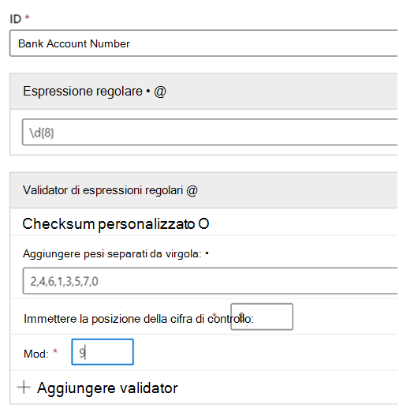
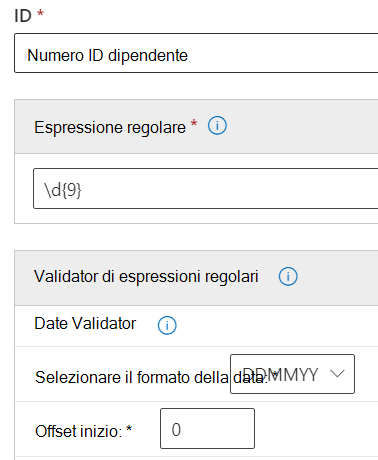

# <a name="get-started-with-custom-sensitive-information-types"></a><span data-ttu-id="9eddd-103">Introduzione ai tipi di informazione sensibile personalizzati</span><span class="sxs-lookup"><span data-stu-id="9eddd-103">Get started with custom sensitive information types</span></span>

<span data-ttu-id="9eddd-104">Se i tipi di informazione sensibile preconfigurati non soddisfano le tue esigenze, puoi creare il tuoi tipi di informazione sensibile personalizzati, definendoli completamente oppure copiando e modificando uno dei tipi preconfigurati.</span><span class="sxs-lookup"><span data-stu-id="9eddd-104">If the pre-configured sensitive information types don't meet your needs, you can create your own custom sensitive information types that you fully define or you can copy one of the pre-configured ones and modify it.</span></span>

<span data-ttu-id="9eddd-105">I tipi di informazione sensibile personalizzati creati con questo metodo vengono aggiunti al pacchetto di regole denominato `Microsoft.SCCManaged.CustomRulePack`.</span><span class="sxs-lookup"><span data-stu-id="9eddd-105">The custom sensitive information types that you create by using this method are added to the rule package named `Microsoft.SCCManaged.CustomRulePack`.</span></span>

<span data-ttu-id="9eddd-106">È possibile creare un nuovo tipo di informazione sensibile in due modi:</span><span class="sxs-lookup"><span data-stu-id="9eddd-106">There are two ways to create a new sensitive information type:</span></span>

- [<span data-ttu-id="9eddd-107">iniziando da zero e definendo completamente tutti gli elementi</span><span class="sxs-lookup"><span data-stu-id="9eddd-107">from scratch where you fully define all elements</span></span>](#create-a-custom-sensitive-information-type)
- [<span data-ttu-id="9eddd-108">copiando e modificando un tipo di informazione sensibile esistente</span><span class="sxs-lookup"><span data-stu-id="9eddd-108">copy and modify an existing sensitive information type</span></span>](#copy-and-modify-a-sensitive-information-type)


## <a name="before-you-begin"></a><span data-ttu-id="9eddd-109">Prima di iniziare</span><span class="sxs-lookup"><span data-stu-id="9eddd-109">Before you begin</span></span>

- <span data-ttu-id="9eddd-110">Bisogna avere preso familiarità con i tipi di informazione sensibile e con i loro elementi.</span><span class="sxs-lookup"><span data-stu-id="9eddd-110">You should be familiar with sensitive information types and what they are composed of.</span></span> <span data-ttu-id="9eddd-111">Vedere, [Informazioni sui tipi di informazione sensibile](sensitive-information-type-learn-about.md).</span><span class="sxs-lookup"><span data-stu-id="9eddd-111">See, [Learn about sensitive information types](sensitive-information-type-learn-about.md).</span></span> <span data-ttu-id="9eddd-112">È fondamentale comprendere i ruoli di:</span><span class="sxs-lookup"><span data-stu-id="9eddd-112">It is critical to understand the roles of:</span></span>
    - <span data-ttu-id="9eddd-113">[espressioni regolari](https://www.boost.org/doc/libs/1_68_0/libs/regex/doc/html/) - i tipi di informazione sensibile di Microsoft 365 usano il motore Boost.RegEx 5.1.3</span><span class="sxs-lookup"><span data-stu-id="9eddd-113">[regular expressions](https://www.boost.org/doc/libs/1_68_0/libs/regex/doc/html/) - Microsoft 365 sensitive information types uses the Boost.RegEx 5.1.3 engine</span></span>
    - <span data-ttu-id="9eddd-114">elenchi di parole chiave - è possibile creare il proprio elenco definendo un tipo di informazione sensibile personalizzato o scegliendone uno dall'elenco delle parole chiave</span><span class="sxs-lookup"><span data-stu-id="9eddd-114">keyword lists - you can create your own as you define your sensitive information type or choose from existing keyword lists</span></span>
    - [<span data-ttu-id="9eddd-115">dizionario di parole chiave</span><span class="sxs-lookup"><span data-stu-id="9eddd-115">keyword dictionary</span></span>](create-a-keyword-dictionary.md)
    - [<span data-ttu-id="9eddd-116">funzioni</span><span class="sxs-lookup"><span data-stu-id="9eddd-116">functions</span></span>](what-the-dlp-functions-look-for.md)
    - [<span data-ttu-id="9eddd-117">livello di confidenza</span><span class="sxs-lookup"><span data-stu-id="9eddd-117">confidence levels</span></span>](sensitive-information-type-learn-about.md#more-on-confidence-levels)
 
- <span data-ttu-id="9eddd-118">È necessario avere le autorizzazioni di amministrazione globale o di amministrazione della conformità per creare, collaudare e distribuire un tipo personalizzato di informazione riservata tramite l'interfaccia utente.</span><span class="sxs-lookup"><span data-stu-id="9eddd-118">You must have Global admin or Compliance admin permissions to create, test, and deploy a custom sensitive information type through the UI.</span></span> <span data-ttu-id="9eddd-119">Vedere [Informazioni sui ruoli di amministratore](/office365/admin/add-users/about-admin-roles) di Office 365.</span><span class="sxs-lookup"><span data-stu-id="9eddd-119">See [About admin roles](/office365/admin/add-users/about-admin-roles) in Office 365.</span></span>

- <span data-ttu-id="9eddd-120">L'organizzazione deve disporre di un abbonamento, ad esempio Office 365 Enterprise, che includa le funzionalità per la prevenzione della perdita dei dati (DLP).</span><span class="sxs-lookup"><span data-stu-id="9eddd-120">Your organization must have a subscription, such as Office 365 Enterprise, that includes Data Loss Prevention (DLP).</span></span> <span data-ttu-id="9eddd-121">Vedere la descrizione del servizio [Criteri di messaggistica e conformità](/office365/servicedescriptions/exchange-online-protection-service-description/messaging-policy-and-compliance-servicedesc).</span><span class="sxs-lookup"><span data-stu-id="9eddd-121">See [Messaging Policy and Compliance ServiceDescription](/office365/servicedescriptions/exchange-online-protection-service-description/messaging-policy-and-compliance-servicedesc).</span></span> 


> [!IMPORTANT]
> <span data-ttu-id="9eddd-122">Il Supporto tecnico Microsoft non può dare assistenza con la creazione di classificazioni personalizzate o modelli di espressioni regolari.</span><span class="sxs-lookup"><span data-stu-id="9eddd-122">Microsoft Customer Service & Support can't assist with creating custom classifications or regular expression patterns.</span></span> <span data-ttu-id="9eddd-123">I tecnici del supporto possono fornire supporto limitato per la funzionalità, ad esempio fornire esempi di modelli di espressioni regolari a scopo di test o aiutare nella risoluzione dei problemi di un modello di espressione regolare esistente che non si attiva come previsto. Non possono garantire che qualsiasi sviluppo personalizzato di corrispondenza del contenuto soddisfi i requisiti o gli obblighi del cliente.</span><span class="sxs-lookup"><span data-stu-id="9eddd-123">Support engineers can provide limited support for the feature, such as, providing sample regular expression patterns for testing purposes, or assisting with troubleshooting an existing regular expression pattern that's not triggering as expected, but can't provide assurances that any custom content-matching development will fulfill your requirements or obligations.</span></span>

## <a name="create-a-custom-sensitive-information-type"></a><span data-ttu-id="9eddd-124">Creare un tipo di informazione sensibile personalizzato</span><span class="sxs-lookup"><span data-stu-id="9eddd-124">Create a custom sensitive information type</span></span>

<span data-ttu-id="9eddd-125">Segui questa procedura per creare un nuovo tipo di informazione sensibile che puoi definire completamente.</span><span class="sxs-lookup"><span data-stu-id="9eddd-125">Use this procedure to create a new sensitive information type that you fully define.</span></span> 

1. <span data-ttu-id="9eddd-126">Nel Centro conformità, vai a **Classificazione dati** \> **Tipi di informazione sensibile** e scegli **Crea tipo di informazione**.</span><span class="sxs-lookup"><span data-stu-id="9eddd-126">In the Compliance Center, go to **Data classification** \> **Sensitive info types** and choose **Create info type**.</span></span>
2. <span data-ttu-id="9eddd-127">Compila i campi **Nome** e **Descrizione** e seleziona **Avanti**.</span><span class="sxs-lookup"><span data-stu-id="9eddd-127">Fill in values for **Name** and **Description** and choose **Next**.</span></span>
3. <span data-ttu-id="9eddd-128">Seleziona **Crea configurazione**.</span><span class="sxs-lookup"><span data-stu-id="9eddd-128">Choose **Create pattern**.</span></span> <span data-ttu-id="9eddd-129">Puoi creare più configurazioni, ciascuna con differenti elementi e livelli di confidenza, mentre definisci il tuo nuovo tipo di informazione sensibile.</span><span class="sxs-lookup"><span data-stu-id="9eddd-129">You can create multiple patterns, each with different elements and confidence levels, as you define your new sensitive information type.</span></span>
4. <span data-ttu-id="9eddd-130">Scegli il livello di confidenza predefinito per la configurazione.</span><span class="sxs-lookup"><span data-stu-id="9eddd-130">Choose the default confidence level for the pattern.</span></span> <span data-ttu-id="9eddd-131">I valori sono **Bassa confidenza**, **Media confidenza**, e **Alta confidenza**.</span><span class="sxs-lookup"><span data-stu-id="9eddd-131">The values are **Low confidence**, **Medium confidence**, and **High confidence**.</span></span>
5. <span data-ttu-id="9eddd-132">Scegli e definisci l'**elemento primario**.</span><span class="sxs-lookup"><span data-stu-id="9eddd-132">Choose and define **Primary element**.</span></span> <span data-ttu-id="9eddd-133">L'elemento primario può essere una **espressione regolare** con una convalida facoltativa, un **elenco di parole chiave**, un **dizionario di parole chiave**, oppure una delle **funzioni** preconfigurate.</span><span class="sxs-lookup"><span data-stu-id="9eddd-133">The primary element can be a **Regular expression** with an optional validator, a **Keyword list**, a **Keyword dictionary**, or one of the pre-configured **Functions**.</span></span> <span data-ttu-id="9eddd-134">Per altre informazioni sulle funzioni DLP, vedere [Elementi cercati dalle funzioni dei criteri di prevenzione della perdita dei dati](what-the-dlp-functions-look-for.md).</span><span class="sxs-lookup"><span data-stu-id="9eddd-134">For more information on DLP functions, see [What the DLP functions look for](what-the-dlp-functions-look-for.md).</span></span> <span data-ttu-id="9eddd-135">Per ulteriori informazioni sulla data e sui validator di checksum, vedere [More information on regular expression validators](#more-information-on-regular-expression-validators).</span><span class="sxs-lookup"><span data-stu-id="9eddd-135">For more information on the date and the checksum validators, see [More information on regular expression validators](#more-information-on-regular-expression-validators).</span></span>
6. <span data-ttu-id="9eddd-136">Immetti un valore per **Prossimità caratteri**.</span><span class="sxs-lookup"><span data-stu-id="9eddd-136">Fill in a value for **Character proximity**.</span></span>
7. <span data-ttu-id="9eddd-137">(Facoltativo) Aggiungi gli elementi di supporto, se disponibili.</span><span class="sxs-lookup"><span data-stu-id="9eddd-137">(Optional) Add supporting elements if you have any.</span></span> <span data-ttu-id="9eddd-138">Gli elementi di supporto possono essere espressioni regolari con una convalida facoltativa, elenchi o dizionari di parole chiave, oppure una delle funzioni preconfigurate.</span><span class="sxs-lookup"><span data-stu-id="9eddd-138">Supporting elements can be a regular expression with an optional validator, a keyword list, a keyword dictionary or one of the pre-defined functions.</span></span> <span data-ttu-id="9eddd-139">Gli elementi di supporto possono avere una propria **configurazione di prossimità del** carattere.</span><span class="sxs-lookup"><span data-stu-id="9eddd-139">Supporting elements can have their own **Character proximity** configuration.</span></span> 
8. <span data-ttu-id="9eddd-140">(Facoltativo) Aggiungi eventuali [**altri controlli**](#more-information-on-additional-checks) dall'elenco dei controlli disponibili.</span><span class="sxs-lookup"><span data-stu-id="9eddd-140">(Optional) Add any [**additional checks**](#more-information-on-additional-checks) from the list of available checks.</span></span>
9. <span data-ttu-id="9eddd-141">Scegli **Crea**.</span><span class="sxs-lookup"><span data-stu-id="9eddd-141">Choose **Create**.</span></span>
10. <span data-ttu-id="9eddd-142">Scegli **Avanti**.</span><span class="sxs-lookup"><span data-stu-id="9eddd-142">Choose **Next**.</span></span>
11. <span data-ttu-id="9eddd-143">Scegli il **livello di confidenza consigliato** per questo tipo di informazione sensibile.</span><span class="sxs-lookup"><span data-stu-id="9eddd-143">Choose the **recommended confidence level** for this sensitive information type.</span></span>
12. <span data-ttu-id="9eddd-144">Verifica le tue impostazioni e scegli **Invia**.</span><span class="sxs-lookup"><span data-stu-id="9eddd-144">Check your setting and choose **Submit**.</span></span>

> [!IMPORTANT]
> <span data-ttu-id="9eddd-145">Microsoft 365 usa il crawler di ricerca per identificare e classificare le informazioni sensibili nei siti di SharePoint Online e OneDrive for Business.</span><span class="sxs-lookup"><span data-stu-id="9eddd-145">Microsoft 365 uses the search crawler to identify and classify sensitive information in SharePoint Online and OneDrive for Business sites.</span></span> <span data-ttu-id="9eddd-146">Per identificare il nuovo tipo di informazioni sensibili personalizzato nel contenuto esistente, è necessario ripetere la ricerca per indicizzazione del contenuto.</span><span class="sxs-lookup"><span data-stu-id="9eddd-146">To identify your new custom sensitive information type in existing content, the content must be re-crawled.</span></span> <span data-ttu-id="9eddd-147">Il contenuto viene sottoposto a ricerca per indicizzazione in base a una pianificazione, ma è possibile ripetere manualmente la ricerca per indicizzazione del contenuto per una raccolta siti, un elenco o una raccolta.</span><span class="sxs-lookup"><span data-stu-id="9eddd-147">Content is crawled based on a schedule, but you can manually re-crawl content for a site collection, list, or library.</span></span> <span data-ttu-id="9eddd-148">Per altre informazioni, vedere [Richiedere manualmente la ricerca per indicizzazione e la reindicizzazione di un sito, di una raccolta o di un elenco](/sharepoint/crawl-site-content).</span><span class="sxs-lookup"><span data-stu-id="9eddd-148">For more information, see [Manually request crawling and re-indexing of a site, a library or a list](/sharepoint/crawl-site-content).</span></span>

13. <span data-ttu-id="9eddd-149">Nella pagina **Classificazione dati** saranno mostrate tutti i tipi di informazione sensibile inclusi nell'elenco.</span><span class="sxs-lookup"><span data-stu-id="9eddd-149">On the **Data classification** page, you'll see all the sensitive information types listed.</span></span> <span data-ttu-id="9eddd-150">Scegli **Aggiorna**, quindi cerca oppure usa lo strumento di ricerca per trovare il tipo di informazione sensibili creato.</span><span class="sxs-lookup"><span data-stu-id="9eddd-150">Choose **Refresh** and then browse for or use the search tool to find the sensitive information type you created.</span></span>

## <a name="test-a-sensitive-information-type"></a><span data-ttu-id="9eddd-151">Collaudare i tipi di informazione sensibile</span><span class="sxs-lookup"><span data-stu-id="9eddd-151">Test a sensitive information type</span></span>

<span data-ttu-id="9eddd-152">Puoi collaudare qualsiasi tipo di informazione sensibile dell'elenco.</span><span class="sxs-lookup"><span data-stu-id="9eddd-152">You can test any sensitive information type in the list.</span></span> <span data-ttu-id="9eddd-153">Ti suggeriamo di collaudare ogni tipo di informazione sensibile che hai creato prima di usarlo in un criterio.</span><span class="sxs-lookup"><span data-stu-id="9eddd-153">We suggest that you test every sensitive information type that you create before using it in a policy.</span></span>

1. <span data-ttu-id="9eddd-154">Prepara due file, come un documento Word.</span><span class="sxs-lookup"><span data-stu-id="9eddd-154">Prepare two files, like a Word document.</span></span> <span data-ttu-id="9eddd-155">Uno con un contenuto che corrisponda agli elementi specificati nel tipi di informazione sensibile, e uno che non gli corrisponde.</span><span class="sxs-lookup"><span data-stu-id="9eddd-155">One with content that matches the elements you specified in your sensitive information type and one that doesn't match.</span></span>
2. <span data-ttu-id="9eddd-156">Nel Centro conformità, vai a **Classificazione dati** \> **Tipi di informazione sensibile** e scegli il tipo di informazione sensibile dall'elenco per aprire il riquadro dei dettagli, e seleziona **Test**.</span><span class="sxs-lookup"><span data-stu-id="9eddd-156">In the Compliance Center, go to **Data classification** \> **Sensitive info types** and choose the sensitive information type from the list to open the details pane and choose **Test**.</span></span>
3. <span data-ttu-id="9eddd-157">Carica un file e seleziona **Test**.</span><span class="sxs-lookup"><span data-stu-id="9eddd-157">Upload a file and choose **Test**.</span></span>
4. <span data-ttu-id="9eddd-158">Nella pagina **Risultati abbinamenti**, rivedi i risultati e seleziona **Fine**.</span><span class="sxs-lookup"><span data-stu-id="9eddd-158">On the **Matches results** page, review the results and choose **Finish**.</span></span>

## <a name="modify-custom-sensitive-information-types-in-the-compliance-center"></a><span data-ttu-id="9eddd-159">Modificare tipi di informazione sensibile personalizzati nel Centro conformità</span><span class="sxs-lookup"><span data-stu-id="9eddd-159">Modify custom sensitive information types in the Compliance Center</span></span>

1. <span data-ttu-id="9eddd-160">Nel Centro conformità, vai a **Classificazione dati** \> **Tipi di informazione sensibile**, scegli il tipo di informazione sensibile che vuoi rimuovere dall'elenco e seleziona **Modifica**.</span><span class="sxs-lookup"><span data-stu-id="9eddd-160">In the Compliance Center, go to **Data classification** \> **Sensitive info types** and choose the sensitive information type from the list that you want to modify choose **Edit**.</span></span>
2. <span data-ttu-id="9eddd-161">Puoi aggiungere altre configurazioni, con elementi principali e di supporto, livelli di confidenza, prossimità dei caratteri e [**controlli aggiuntivi specifici**](#more-information-on-additional-checks), oppure modificare/rimuovere quelle esistenti.</span><span class="sxs-lookup"><span data-stu-id="9eddd-161">You can add other patterns, with unique primary and supporting elements, confidence levels, character proximity, and [**additional checks**](#more-information-on-additional-checks) or edit/remove the existing ones.</span></span>

## <a name="remove-custom-sensitive-information-types-in-the-compliance-center"></a><span data-ttu-id="9eddd-162">Rimuovere tipi di informazione sensibile personalizzati nel Centro conformità</span><span class="sxs-lookup"><span data-stu-id="9eddd-162">Remove custom sensitive information types in the Compliance Center</span></span> 

> [!NOTE]
> <span data-ttu-id="9eddd-163">È possibile rimuovere i tipi di informazioni sensibili personalizzati; non è possibile rimuovere quelli predefiniti.</span><span class="sxs-lookup"><span data-stu-id="9eddd-163">You can only remove custom sensitive information types; you can't remove built-in sensitive information types.</span></span>

> [!IMPORTANT]
> <span data-ttu-id="9eddd-164">Prima di eliminare un tipo di informazioni sensibili personalizzato, verificare che nessun criterio DLP o regola del flusso di posta di Exchange (nota anche come regola di trasporto) faccia ancora riferimento al tipo di informazioni sensibili.</span><span class="sxs-lookup"><span data-stu-id="9eddd-164">Before your remove a custom sensitive information type, verify that no DLP policies or Exchange mail flow rules (also known as transport rules) still reference the sensitive information type.</span></span>

1. <span data-ttu-id="9eddd-165">Nel Centro conformità, vai a **Classificazione dati** \> **Tipi di informazione sensibile** e scegli il tipo di informazione sensibile che vuoi rimuovere dall'elenco.</span><span class="sxs-lookup"><span data-stu-id="9eddd-165">In the Compliance Center, go to **Data classification** \> **Sensitive info types** and choose the sensitive information type from the list that you want to remove.</span></span>
2. <span data-ttu-id="9eddd-166">Seleziona **Elimina** nel riquadro a comparsa che si apre.</span><span class="sxs-lookup"><span data-stu-id="9eddd-166">In the fly-out that opens, choose **Delete**.</span></span>

## <a name="copy-and-modify-a-sensitive-information-type"></a><span data-ttu-id="9eddd-167">Copiare e modificare un tipo di informazione sensibile</span><span class="sxs-lookup"><span data-stu-id="9eddd-167">Copy and modify a sensitive information type</span></span>

<span data-ttu-id="9eddd-168">Usa questa procedura per creare un nuovo tipo di informazione sensibile basato su un tipo esistente.</span><span class="sxs-lookup"><span data-stu-id="9eddd-168">Use this procedure to create a new sensitive information type that is based on an existing sensitive information type.</span></span> 

1. <span data-ttu-id="9eddd-169">Nel Centro conformità, vai a **Classificazione dati** \> **Tipi di informazione sensibile**, e scegli il tipo di informazione sensibile che vuoi copiare.</span><span class="sxs-lookup"><span data-stu-id="9eddd-169">In the Compliance Center, go to **Data classification** \> **Sensitive info types** and choose the sensitive information type that you want to copy.</span></span>
2. <span data-ttu-id="9eddd-170">Seleziona **Copia** nel riquadro a comparsa.</span><span class="sxs-lookup"><span data-stu-id="9eddd-170">In the flyout, choose **Copy**.</span></span>
3. <span data-ttu-id="9eddd-171">Seleziona **Aggiorna** nell'elenco dei tipi di informazione sensibile, e cerca la copia che hai appena creato.</span><span class="sxs-lookup"><span data-stu-id="9eddd-171">Choose **Refresh** in the list of sensitive information types and either browse or search for the copy you just made.</span></span> <span data-ttu-id="9eddd-172">La ricerca di stringhe parziali funziona, perciò ti basta cercare `copy`, e la ricerca restituisce tutti i tipi di informazione sensibile che contengono la parola `copy` nel loro nome.</span><span class="sxs-lookup"><span data-stu-id="9eddd-172">Partial sting searches work, so you could just search for `copy` and search would return all the sensitive information types with the word `copy` in the name.</span></span> 
4. <span data-ttu-id="9eddd-173">Compila i campi **Nome** e **Descrizione** e seleziona **Avanti**.</span><span class="sxs-lookup"><span data-stu-id="9eddd-173">Fill in values for **Name** and **Description** and choose **Next**.</span></span>
5. <span data-ttu-id="9eddd-174">Seleziona la copia del tuo tipi di informazione sensibile e fai clic su **Modifica**.</span><span class="sxs-lookup"><span data-stu-id="9eddd-174">Choose your sensitive information type copy and choose **Edit**.</span></span> 
6. <span data-ttu-id="9eddd-175">Assegna al tipo di informazione sensibile un nuovo **Nome** e una nuova **Descrizione**.</span><span class="sxs-lookup"><span data-stu-id="9eddd-175">Give your new sensitive information type a new **Name** and **Description**.</span></span>
7. <span data-ttu-id="9eddd-176">Puoi scegliere di modificare o rimuovere le configurazioni esistenti e aggiungerne di nuove.</span><span class="sxs-lookup"><span data-stu-id="9eddd-176">You can choose to edit or remove the existing patterns and add new ones.</span></span> <span data-ttu-id="9eddd-177">Scegli il livello di confidenza predefinito per la nuova configurazione.</span><span class="sxs-lookup"><span data-stu-id="9eddd-177">Choose the default confidence level for the new pattern.</span></span> <span data-ttu-id="9eddd-178">I valori sono **Bassa confidenza**, **Media confidenza**, e **Alta confidenza**.</span><span class="sxs-lookup"><span data-stu-id="9eddd-178">The values are **Low confidence**, **Medium confidence**, and **High confidence**.</span></span>
8. <span data-ttu-id="9eddd-179">Scegli e definisci l'**elemento primario**.</span><span class="sxs-lookup"><span data-stu-id="9eddd-179">Choose and define **Primary element**.</span></span> <span data-ttu-id="9eddd-180">L'elemento primario può essere una **espressione regolare**, un **elenco di parole chiave**, un **dizionario di parole chiave**, oppure una delle **funzioni** preconfigurate.</span><span class="sxs-lookup"><span data-stu-id="9eddd-180">The primary element can be a **Regular expression**, a **Keyword list**, a **Keyword dictionary**, or one of the pre-configured **Functions**.</span></span> <span data-ttu-id="9eddd-181">Vedi [Elementi cercati dalle funzioni dei criteri di prevenzione della perdita dei dati](what-the-dlp-functions-look-for.md).</span><span class="sxs-lookup"><span data-stu-id="9eddd-181">See, [What the DLP functions look for](what-the-dlp-functions-look-for.md).</span></span>
9. <span data-ttu-id="9eddd-182">Immetti un valore per **Prossimità caratteri**.</span><span class="sxs-lookup"><span data-stu-id="9eddd-182">Fill in a value for **Character proximity**.</span></span>
10. <span data-ttu-id="9eddd-183">(Facoltativo) Se hai **Elementi di supporto** o [**Altri controlli**](#more-information-on-additional-checks), aggiungili.</span><span class="sxs-lookup"><span data-stu-id="9eddd-183">(Optional) If you have **Supporting elements** or any [**Additional checks**](#more-information-on-additional-checks) add them.</span></span> <span data-ttu-id="9eddd-184">Se necessario, puoi raggruppare i tuoi **Elementi di supporto**.</span><span class="sxs-lookup"><span data-stu-id="9eddd-184">If needed you can group your **Supporting elements**.</span></span>
11. <span data-ttu-id="9eddd-185">Scegli **Crea**.</span><span class="sxs-lookup"><span data-stu-id="9eddd-185">Choose **Create**.</span></span>
12. <span data-ttu-id="9eddd-186">Scegli **Avanti**.</span><span class="sxs-lookup"><span data-stu-id="9eddd-186">Choose **Next**.</span></span>
13. <span data-ttu-id="9eddd-187">Scegli il **livello di confidenza consigliato** per questo tipo di informazione sensibile.</span><span class="sxs-lookup"><span data-stu-id="9eddd-187">Choose the **recommended confidence level** for this sensitive information type.</span></span>
14. <span data-ttu-id="9eddd-188">Verifica le tue impostazioni e scegli **Invia**.</span><span class="sxs-lookup"><span data-stu-id="9eddd-188">Check your setting and choose **Submit**.</span></span>

<span data-ttu-id="9eddd-189">È anche possibile creare tipi di informazioni sensibili personalizzati usando PowerShell e le funzionalità del classificatore Exact Data Match.</span><span class="sxs-lookup"><span data-stu-id="9eddd-189">You can also create custom sensitive information types by using PowerShell and Exact Data Match capabilities.</span></span> <span data-ttu-id="9eddd-190">Per altre informazioni su questi metodi, vedere:</span><span class="sxs-lookup"><span data-stu-id="9eddd-190">To learn more about those methods, see:</span></span>
- [<span data-ttu-id="9eddd-191">Creare un tipo di informazioni sensibili personalizzato in PowerShell per Centro sicurezza e conformità</span><span class="sxs-lookup"><span data-stu-id="9eddd-191">Create a custom sensitive information type in Security & Compliance Center PowerShell</span></span>](create-a-custom-sensitive-information-type-in-scc-powershell.md)
- [<span data-ttu-id="9eddd-192">Creare un tipo di informazioni sensibili personalizzato per DLP con Exact Data Match (EDM)</span><span class="sxs-lookup"><span data-stu-id="9eddd-192">Create a custom sensitive information type for DLP with Exact Data Match (EDM)</span></span>](create-custom-sensitive-information-types-with-exact-data-match-based-classification.md)

## <a name="more-information-on-regular-expression-validators"></a><span data-ttu-id="9eddd-193">Ulteriori informazioni sui validator delle espressioni regolari</span><span class="sxs-lookup"><span data-stu-id="9eddd-193">More information on regular expression validators</span></span>

### <a name="checksum-validator"></a><span data-ttu-id="9eddd-194">Checksum validator</span><span class="sxs-lookup"><span data-stu-id="9eddd-194">Checksum validator</span></span>

<span data-ttu-id="9eddd-195">Se è necessario eseguire un checksum su una cifra in un'espressione regolare, è possibile utilizzare *il validator del checksum.*</span><span class="sxs-lookup"><span data-stu-id="9eddd-195">If you need to run a checksum on a digit in a regular expression, you can use the *checksum validator*.</span></span> <span data-ttu-id="9eddd-196">Ad esempio, si supponga di dover creare un codice SIT per un numero di licenza a otto cifre in cui l'ultima cifra è una cifra di checksum convalidata utilizzando un calcolo mod 9.</span><span class="sxs-lookup"><span data-stu-id="9eddd-196">For example, say you need to create a SIT for an eight digit license number where the last digit is a checksum digit that is validated using a mod 9 calculation.</span></span> <span data-ttu-id="9eddd-197">L'algoritmo di checksum è stato configurato in questo modo:</span><span class="sxs-lookup"><span data-stu-id="9eddd-197">You've set up the checksum algorithm like this:</span></span>

<span data-ttu-id="9eddd-198">Sum = digit 1 \* Weight 1 + digit 2 \* weight 2 + digit 3 \* weight 3 + digit 4 \* weight 4 + digit 5 \* weight 5 + digit 6 \* weight 6 + digit 7 \* weight 7 + digit 8 \* weight 8 Mod value = Sum % 9 If Mod value == digit 8 Account number is valid If Mod value != digit 8 Account number is invalid</span><span class="sxs-lookup"><span data-stu-id="9eddd-198">Sum = digit 1 \* Weight 1 + digit 2 \* weight 2 + digit 3 \* weight 3 + digit 4 \* weight 4 + digit 5 \* weight 5 + digit 6 \* weight 6 + digit 7 \* weight 7 + digit 8 \* weight 8 Mod value = Sum % 9 If Mod value == digit 8 Account number is valid If Mod value != digit 8 Account number is invalid</span></span>

1. <span data-ttu-id="9eddd-199">Definisci l'elemento primario con questa espressione regolare:</span><span class="sxs-lookup"><span data-stu-id="9eddd-199">Define the primary element with this regular expression:</span></span>

   ```console
   \d{8}
   ```

2. <span data-ttu-id="9eddd-200">Aggiungi quindi il validator del checksum.</span><span class="sxs-lookup"><span data-stu-id="9eddd-200">Then add the checksum validator.</span></span>
3. <span data-ttu-id="9eddd-201">Aggiungi i valori di peso separati da virgole, la posizione della cifra di controllo e il valore Mod.</span><span class="sxs-lookup"><span data-stu-id="9eddd-201">Add the weight values separated by commas, the position of the check digit and the Mod value.</span></span> <span data-ttu-id="9eddd-202">Per ulteriori informazioni sull'operazione Modulo, vedere [Operazione modulo](https://en.wikipedia.org/wiki/Modulo_operation).</span><span class="sxs-lookup"><span data-stu-id="9eddd-202">For more information on the Modulo operation, see [Modulo operation](https://en.wikipedia.org/wiki/Modulo_operation).</span></span>

> [!NOTE]
> <span data-ttu-id="9eddd-203">Se la cifra di controllo non fa parte del calcolo del checksum, utilizzare 0 come peso per la cifra di controllo.</span><span class="sxs-lookup"><span data-stu-id="9eddd-203">If the check digit is not part of the checksum calculation then use 0 as the weight for the check digit.</span></span> <span data-ttu-id="9eddd-204">Ad esempio, nel caso precedente il peso 8 sarà uguale a 0 se la cifra di controllo non deve essere utilizzata per calcolare la cifra di controllo.</span><span class="sxs-lookup"><span data-stu-id="9eddd-204">For example, in the above case weight 8 will be equal to 0 if the check digit is not to be used for calculating the check digit.</span></span>  <span data-ttu-id="9eddd-205">Modulo_operation).</span><span class="sxs-lookup"><span data-stu-id="9eddd-205">Modulo_operation).</span></span>



### <a name="date-validator"></a><span data-ttu-id="9eddd-207">Convalida data</span><span class="sxs-lookup"><span data-stu-id="9eddd-207">Date validator</span></span>

<span data-ttu-id="9eddd-208">Se un valore di data incorporato nell'espressione regolare fa parte di  un nuovo modello che si sta creando, è possibile utilizzare la convalida della data per verificare che soddisfi i criteri specificati.</span><span class="sxs-lookup"><span data-stu-id="9eddd-208">If a date value that is embedded in regular expression is part of a new pattern you are creating, you can use the *date validator* to test that it meets your criteria.</span></span> <span data-ttu-id="9eddd-209">Ad esempio, si supponga di voler creare un SIT per un numero di identificazione del dipendente di nove cifre.</span><span class="sxs-lookup"><span data-stu-id="9eddd-209">For example, say you want to create a SIT for a nine digit employee identification number.</span></span> <span data-ttu-id="9eddd-210">Le prime sei cifre sono la data di assunzione in formato DDMMYY e le ultime tre sono numeri generati casualmente.</span><span class="sxs-lookup"><span data-stu-id="9eddd-210">The first six digits are the date of hire in DDMMYY format and the last three are randomly generated numbers.</span></span> <span data-ttu-id="9eddd-211">Per verificare che le prime sei cifre siano nel formato corretto.</span><span class="sxs-lookup"><span data-stu-id="9eddd-211">To validate that the first six digits are in the correct format.</span></span>

1. <span data-ttu-id="9eddd-212">Definisci l'elemento primario con questa espressione regolare:</span><span class="sxs-lookup"><span data-stu-id="9eddd-212">Define the primary element with this regular expression:</span></span>

   ```console
   \d{9}
   ```

2. <span data-ttu-id="9eddd-213">Aggiungi quindi il validator della data.</span><span class="sxs-lookup"><span data-stu-id="9eddd-213">Then add the date validator.</span></span>
3. <span data-ttu-id="9eddd-214">Selezionare il formato della data e lo scostamento iniziale.</span><span class="sxs-lookup"><span data-stu-id="9eddd-214">Select the date format and the start offset.</span></span> <span data-ttu-id="9eddd-215">Poiché la stringa della data è la prima sei cifre, l'offset è `0` .</span><span class="sxs-lookup"><span data-stu-id="9eddd-215">Since the date string is the first six digits, the offset is `0`.</span></span>



### <a name="functional-processors-as-validators"></a><span data-ttu-id="9eddd-217">Processori funzionali come validator</span><span class="sxs-lookup"><span data-stu-id="9eddd-217">Functional processors as validators</span></span>

<span data-ttu-id="9eddd-218">È possibile utilizzare i processori di funzioni per alcuni dei SIT più comunemente usati come validator.</span><span class="sxs-lookup"><span data-stu-id="9eddd-218">You can use function processors for some of the most commonly used SITs as validators.</span></span> <span data-ttu-id="9eddd-219">In questo modo è possibile definire un'espressione regolare personalizzata assicurandosi che superino i controlli aggiuntivi richiesti dal sit.</span><span class="sxs-lookup"><span data-stu-id="9eddd-219">This allows you to define your own regular expression while ensuring they pass the additional checks required by the SIT.</span></span> <span data-ttu-id="9eddd-220">Ad esempio, Func_India_Aadhar che l'espressione regolare personalizzata definita dall'utente passi la logica di convalida necessaria per la scheda Aadhar indiana.</span><span class="sxs-lookup"><span data-stu-id="9eddd-220">For example, Func_India_Aadhar will ensure that the custom regular expression defined by you passes the validation logic required for Indian Aadhar card.</span></span> <span data-ttu-id="9eddd-221">Per ulteriori informazioni sulle funzioni DLP che possono essere utilizzate come validator, vedere [What the DLP functions look for](what-the-dlp-functions-look-for.md#what-the-dlp-functions-look-for).</span><span class="sxs-lookup"><span data-stu-id="9eddd-221">For more information on DLP functions that can be used as validators, see [What the DLP functions look for](what-the-dlp-functions-look-for.md#what-the-dlp-functions-look-for).</span></span> 

### <a name="luhn-check-validator"></a><span data-ttu-id="9eddd-222">Convalida controllo Luhn</span><span class="sxs-lookup"><span data-stu-id="9eddd-222">Luhn check validator</span></span>

<span data-ttu-id="9eddd-223">È possibile utilizzare il validator di controllo Luhn se si dispone di un tipo di informazioni riservate personalizzato che include un'espressione regolare che deve passare [l'algoritmo Luhn](https://en.wikipedia.org/wiki/Luhn_algorithm).</span><span class="sxs-lookup"><span data-stu-id="9eddd-223">You can use the Luhn check validator if you have a custom Sensitive information type that includes a regular expression which should pass the [Luhn algorithm](https://en.wikipedia.org/wiki/Luhn_algorithm).</span></span>

## <a name="more-information-on-additional-checks"></a><span data-ttu-id="9eddd-224">Maggiori informazioni sugli altri controlli</span><span class="sxs-lookup"><span data-stu-id="9eddd-224">More information on additional checks</span></span>

<span data-ttu-id="9eddd-225">Ecco le definizioni e alcuni esempi per gli altri controlli disponibili.</span><span class="sxs-lookup"><span data-stu-id="9eddd-225">Here are the definitions and some examples for the available additional checks.</span></span>

<span data-ttu-id="9eddd-226">**Escludi corrispondenze specifiche**: questo controllo consente di definire le parole chiave da escludere quando si rilevano le corrispondenze per i criteri che si stanno modificando.</span><span class="sxs-lookup"><span data-stu-id="9eddd-226">**Exclude specific matches**: This check lets you define keywords to exclude when detecting matches for the pattern you are editing.</span></span> <span data-ttu-id="9eddd-227">Ad esempio, è possibile escludere i numeri di carta di credito di prova come "4111111111111111" in modo che non possano corrispondere a un numero valido.</span><span class="sxs-lookup"><span data-stu-id="9eddd-227">For example, you might exclude test credit card numbers like '4111111111111111' so that they're not matched as a valid number.</span></span>

<span data-ttu-id="9eddd-228">**Inizia o non inizia con caratteri**: questo controllo consente di definire i caratteri con cui gli elementi corrispondenti devono o non devono iniziare.</span><span class="sxs-lookup"><span data-stu-id="9eddd-228">**Starts or doesn't start with characters**: This check lets you define the characters that the matched items must or must not start with.</span></span> <span data-ttu-id="9eddd-229">Ad esempio, se si vuole che i criteri rilevino solo i numeri di carta di credito che iniziano con 41, 42 o 43, selezionare **Inizia con** e aggiungere 41, 42 e 43 all'elenco, separati da virgole.</span><span class="sxs-lookup"><span data-stu-id="9eddd-229">For example, if you want the pattern to detect only credit card numbers that start with 41, 42, or 43, select **Starts with** and add 41, 42, and 43 to the list, separated by commas.</span></span> 

<span data-ttu-id="9eddd-230">**Termina o non termina con caratteri**: questo controllo consente di definire i caratteri con cui gli elementi corrispondenti devono o non devono terminare.</span><span class="sxs-lookup"><span data-stu-id="9eddd-230">**Ends or doesn't end with characters**: This check lets you define the characters that the matched items must or must not end with.</span></span> <span data-ttu-id="9eddd-231">Ad esempio, se il numero ID del dipendente non può terminare con 0 o 1, selezionare **Non termina con** e aggiungere 0 e 1 all'elenco, separati da virgole.</span><span class="sxs-lookup"><span data-stu-id="9eddd-231">For example, if your Employee ID number cannot end with 0 or 1, select **Doesn't end with** and add 0 and 1 to the list, separated by commas.</span></span>

<span data-ttu-id="9eddd-232">**Escludi caratteri duplicati**: questo controllo consente di ignorare le corrispondenze in cui tutte le cifre sono uguali.</span><span class="sxs-lookup"><span data-stu-id="9eddd-232">**Exclude duplicate characters**: This check lets you ignore matches in which all the digits are the same.</span></span> <span data-ttu-id="9eddd-233">Ad esempio, se il numero ID del dipendente a sei cifre non può avere tutte le stesse cifre uguali, è possibile selezionare **Escludi caratteri duplicati** per escludere 111111, 222222, 333333, 444444, 555555, 666666, 777777, 888888, 999999 e 000000 dall'elenco delle corrispondenze valide per l'ID dipendente.</span><span class="sxs-lookup"><span data-stu-id="9eddd-233">For example, if the six digit employee ID number cannot have all the digits be the same, you can select **Exclude duplicate characters** to exclude 111111, 222222, 333333, 444444, 555555, 666666, 777777, 888888, 999999, and 000000 from the list of valid matches for the employee ID.</span></span>

<span data-ttu-id="9eddd-234">**Includi o escludi i prefissi**: questo controllo consente di definire le parole chiave che devono o non devono trovarsi immediatamente prima dell'entità corrispondente.</span><span class="sxs-lookup"><span data-stu-id="9eddd-234">**Include or exclude prefixes**: This check lets you define the keywords that must or must not be found immediately before the matching entity.</span></span> <span data-ttu-id="9eddd-235">In base all'opzione selezionata, le entità saranno o meno considerate corrispondenze se sono precedute dai prefissi inclusi qui.</span><span class="sxs-lookup"><span data-stu-id="9eddd-235">Depending on your selection, entities will be matched or not matched if they're preceded by the prefixes you include here.</span></span> <span data-ttu-id="9eddd-236">Ad esempio, se si **esclude** il prefisso **GUID:**, qualsiasi entità preceduta da **GUID:** non verrà considerata una corrispondenza.</span><span class="sxs-lookup"><span data-stu-id="9eddd-236">For example, if you **Exclude** the prefix **GUID:**, any entity that's preceded by **GUID:** won't be considered a match.</span></span>

<span data-ttu-id="9eddd-237">**Includi o escludi suffissi**: questo controllo consente di definire le parole chiave che devono o non devono trovarsi immediatamente dopo l'entità corrispondente.</span><span class="sxs-lookup"><span data-stu-id="9eddd-237">**Include or exclude suffixes** This check lets you define the keywords that must or must not be found immediately after the matching entity.</span></span> <span data-ttu-id="9eddd-238">In base all'opzione selezionata, le entità saranno o meno considerate corrispondenze se sono seguite dai suffissi inclusi qui.</span><span class="sxs-lookup"><span data-stu-id="9eddd-238">Depending on your selection, entities will be matched or not matched if they're followed by the suffixes you include here.</span></span> <span data-ttu-id="9eddd-239">Ad esempio, se si **esclude** il suffisso **:GUID**, qualunque testo seguito da **:GUID** non sarà considerato una corrispondenza.</span><span class="sxs-lookup"><span data-stu-id="9eddd-239">For example, if you **Exclude** the suffix **:GUID**, any text that's followed by **:GUID** won't be matched.</span></span>


> [!NOTE]
> <span data-ttu-id="9eddd-240">Microsoft 365 Information Protection supporta i set di caratteri a due byte nelle seguenti lingue:</span><span class="sxs-lookup"><span data-stu-id="9eddd-240">Microsoft 365 Information Protection supports double byte character set languages for:</span></span>
> - <span data-ttu-id="9eddd-241">Cinese (semplificato)</span><span class="sxs-lookup"><span data-stu-id="9eddd-241">Chinese (simplified)</span></span>
> - <span data-ttu-id="9eddd-242">Cinese (tradizionale)</span><span class="sxs-lookup"><span data-stu-id="9eddd-242">Chinese (traditional)</span></span>
> - <span data-ttu-id="9eddd-243">Coreano</span><span class="sxs-lookup"><span data-stu-id="9eddd-243">Korean</span></span>
> - <span data-ttu-id="9eddd-244">Giapponese</span><span class="sxs-lookup"><span data-stu-id="9eddd-244">Japanese</span></span>
>
><span data-ttu-id="9eddd-245">Il supporto è disponibile per i tipi di informazioni sensibili.</span><span class="sxs-lookup"><span data-stu-id="9eddd-245">This support is available for sensitive information types.</span></span> <span data-ttu-id="9eddd-246">Per altre informazioni, vedere [Note sulla versione del supporto della protezione delle informazioni per i set di caratteri a due byte (anteprima)](mip-dbcs-relnotes.md).</span><span class="sxs-lookup"><span data-stu-id="9eddd-246">See, [Information protection support for double byte character sets release notes (preview)](mip-dbcs-relnotes.md) for more information.</span></span>

> [!TIP]
> <span data-ttu-id="9eddd-247">Per rilevare modelli contenenti caratteri cinesi/giapponesi e caratteri a byte singolo o per rilevare modelli contenenti caratteri cinesi/giapponesi e inglesi, definire due varianti della parola chiave o dell'espressione regolare.</span><span class="sxs-lookup"><span data-stu-id="9eddd-247">To detect patterns containing Chinese/Japanese characters and single byte characters or to detect patterns containing Chinese/Japanese and English, define two variants of the keyword or regex.</span></span> 
>
> <span data-ttu-id="9eddd-248">Ad esempio, per rilevare una parola chiave come "机密的document", usare due varianti della parola chiave: una con uno spazio tra il testo giapponese e quello inglese e un'altra senza spazio tra il testo giapponese e quello inglese.</span><span class="sxs-lookup"><span data-stu-id="9eddd-248">For example, to detect a keyword like "机密的document", use two variants of the keyword; one with a space between the Japanese and English text and another without a space between the Japanese and English text.</span></span> <span data-ttu-id="9eddd-249">Quindi, le parole chiave da aggiungere nel SIT devono essere "机密的 document" e "机密的document".</span><span class="sxs-lookup"><span data-stu-id="9eddd-249">So, the keywords to be added in the SIT should be "机密的 document" and "机密的document".</span></span> <span data-ttu-id="9eddd-250">Analogamente, per rilevare la frase "東京オリンピック2020", devono essere usate due varianti: "東京オリンピック 2020" e "東京オリンピック2020".</span><span class="sxs-lookup"><span data-stu-id="9eddd-250">Similarly, to detect a phrase "東京オリンピック2020", two variants should be used; "東京オリンピック 2020" and "東京オリンピック2020".</span></span>
>
> <span data-ttu-id="9eddd-251">Quando si crea un'espressione regolare usando un trattino a byte doppio o un punto a byte doppio, assicurarsi di eseguire l'escape di entrambi i caratteri come si farebbe con un trattino o un punto in un'espressione regolare.</span><span class="sxs-lookup"><span data-stu-id="9eddd-251">While creating a regex using a double byte hyphen or a double byte period, make sure to escape both the characters like one would escape a hyphen or period in a regex.</span></span> <span data-ttu-id="9eddd-252">Di seguito è riportata un'espressione regolare di esempio per riferimento:</span><span class="sxs-lookup"><span data-stu-id="9eddd-252">Here is a sample regex for reference:</span></span>
>
>    - <span data-ttu-id="9eddd-253">(?<!\d)([４][０-９]{3}[\-?\－\t]\*[０-９]{4}</span><span class="sxs-lookup"><span data-stu-id="9eddd-253">(?<!\d)([４][０-９]{3}[\-?\－\t]\*[０-９]{4}</span></span>
>
> <span data-ttu-id="9eddd-254">È consigliabile usare una corrispondenza di stringhe anziché una corrispondenza di parole in un elenco di parole chiave.</span><span class="sxs-lookup"><span data-stu-id="9eddd-254">We recommend using a string match instead of a word match in a keyword list.</span></span>
