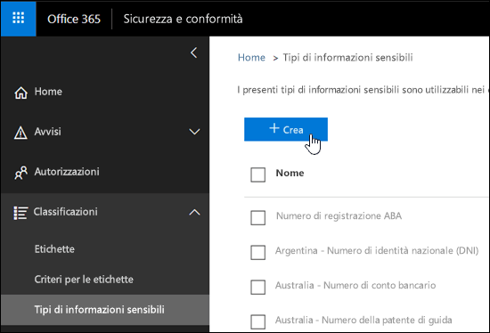
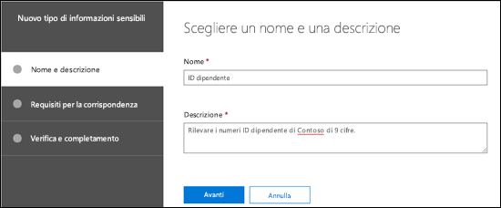
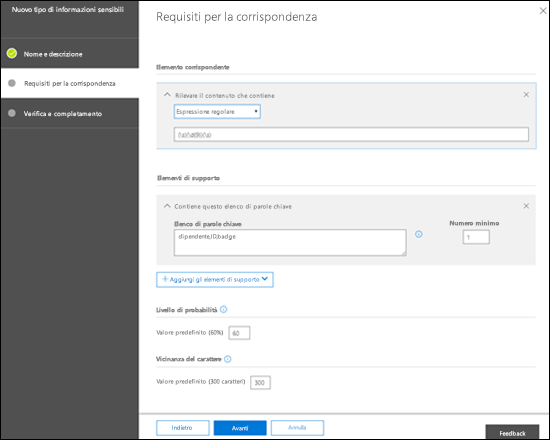
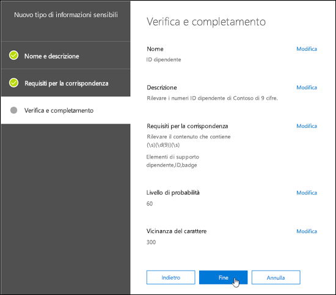
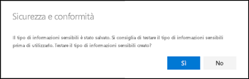
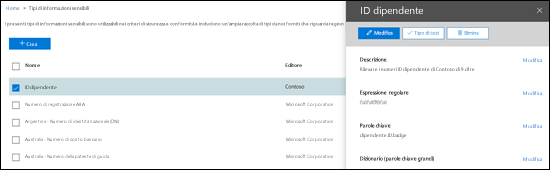
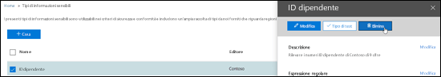
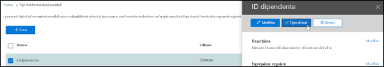
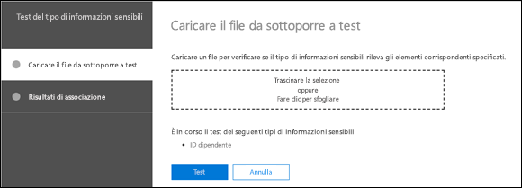
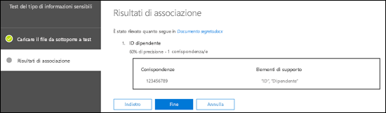

<!-- rename md file to match the display name -->
# Creare un tipo di informazioni sensibili personalizzato nel Centro sicurezza e conformità

Leggere questo articolo per creare un [tipo di informazioni sensibili personalizzato](custom-sensitive-info-types.md) nel Centro sicurezza e conformità ([https://protection.office.com](https://protection.office.com)). I tipi di informazioni sensibili personalizzati creati con questo metodo vengono aggiunti al pacchetto di regole denominato `Microsoft.SCCManaged.CustomRulePack`.

È anche possibile creare tipi di informazioni sensibili personalizzati usando PowerShell e le funzionalità del classificatore Exact Data Match. Per altre informazioni su questi metodi, vedere:
- [Creare un tipo di informazioni sensibili personalizzato in PowerShell per Centro sicurezza e conformità](create-a-custom-sensitive-information-type-in-scc-powershell.md)
- [Creare un tipo di informazioni sensibili personalizzato per DLP con Exact Data Match (EDM)](create-custom-sensitive-information-types-with-exact-data-match-based-classification.md)

## Prima di iniziare

> [!NOTE]
> È necessario avere le autorizzazioni di amministratore globale o di amministratore della conformità per creare, testare e distribuire un tipo personalizzato di informazioni riservate tramite l'interfaccia utente. Vedere [Informazioni sui ruoli di amministratore](https://docs.microsoft.com/office365/admin/add-users/about-admin-roles?view=o365-worldwide) di Office 365.

- L'organizzazione deve disporre di un abbonamento, ad esempio Office 365 Enterprise, che includa le funzionalità per la prevenzione della perdita dei dati (DLP). Vedere la descrizione del servizio [Criteri di messaggistica e conformità](https://docs.microsoft.com/office365/servicedescriptions/exchange-online-protection-service-description/messaging-policy-and-compliance-servicedesc). 

- Custom sensitive information types require familiarity with regular expressions (RegEx). For more information about the Boost.RegEx (formerly known as RegEx++) engine that's used for processing the text, see [Boost.Regex 5.1.3](https://www.boost.org/doc/libs/1_68_0/libs/regex/doc/html/).

  Il Supporto tecnico Microsoft non può dare assistenza con la creazione di classificazioni personalizzate o modelli di espressioni regolari. I tecnici del supporto possono fornire supporto limitato per la funzionalità, ad esempio fornire esempi di modelli di espressioni regolari a scopo di test o aiutare nella risoluzione dei problemi di un modello di espressione regolare esistente che non si attiva come previsto. Non possono garantire che qualsiasi sviluppo personalizzato di corrispondenza del contenuto soddisfi i requisiti o gli obblighi del cliente.

- La prevenzione della perdita dei dati usa il crawler di ricerca per identificare e classificare le informazioni sensibili nei siti di SharePoint Online e OneDrive for Business. Per identificare il nuovo tipo di informazioni sensibili personalizzato nel contenuto esistente, è necessario ripetere la ricerca per indicizzazione del contenuto. Il contenuto viene sottoposto a ricerca per indicizzazione in base a una pianificazione, ma è possibile ripetere manualmente la ricerca per indicizzazione del contenuto per una raccolta siti, un elenco o una raccolta. Per altre informazioni, vedere [Richiedere manualmente la ricerca per indicizzazione e la reindicizzazione di un sito, di una raccolta o di un elenco](https://docs.microsoft.com/sharepoint/crawl-site-content).

## Creare tipi di informazioni sensibili personalizzati nel Centro sicurezza e conformità

Nel Centro sicurezza e conformità, accedere a **Classificazioni** \> **Tipi di informazioni sensibili** e fare clic su **Crea**.

Le impostazioni sono abbastanza chiare e vengono spiegate nella pagina della procedura guidata associata:

- **Nome**

- **Descrizione**

- **Prossimità**

- **Livello di probabilità**

- **Elemento pattern principale** (parole chiave, espressione regolare o dizionario)

- Facoltativo **Elementi pattern di supporto** (parole chiave, espressione regolare o dizionario) e un valore di **costo minimo** corrispondente.

Here's a scenario: You want a custom sensitive information type that detects 9-digit employee numbers in content, along with the keywords "employee" "ID" and "badge". To create this custom sensitive information type, do the following steps:

1. Nel Centro sicurezza e conformità, accedere a **Classificazioni** \> **Tipi di informazioni sensibili** e fare clic su **Crea**.

    

2. Nella pagina **Scegliere un nome e una descrizione** che viene visualizzata, immettere i valori seguenti:

  - **Nome**: ID dipendente.

  - **Descrizione**: Rilevare i numeri ID dipendente di Contoso di 9 cifre.

    

    Al termine dell'operazione, fare clic su **Avanti**.

3. Nella pagina **Requisiti per la corrispondenza** che viene visualizzata, fare clic su **Aggiungi un elemento** e configurare le impostazioni seguenti:

    - **Rilevare il contenuto che contiene**:
 
      a. Click **Any of these** and select **Regular expression**.

      b. In the regular expression box, enter `(\s)(\d{9})(\s)` (nine-digit numbers surrounded by white space).
  
    - **Elementi di supporto**: fare clic su **Aggiungi gli elementi di supporto** e selezionare **Contiene questo elenco di parole chiave**.

    - Nell'area **Contiene questo elenco di parole chiave** che viene visualizzata, configurare le impostazioni seguenti:

      - **Elenco di parole chiave**: immettere il valore seguente: dipendente,ID,badge.

      - **Numero minimo**: lasciare il valore predefinito 1.

    - Lasciare il valore 60 del **Livello di probabilità** predefinito. 

    - Lasciare il valore 300 della **Prossimità dei caratteri** predefinito.

    

    Al termine dell'operazione, fare clic su **Avanti**.

4. Nella pagina **Verifica e completamento** che viene visualizzata, controllare le impostazioni e fare clic su **Fine**.

    

5. The next page encourages you to test the new custom sensitive information type by clicking **Yes**. For more information, see [Test custom sensitive information types in the Security & Compliance Center](#test-custom-sensitive-information-types-in-the-security--compliance-center). To test the rule later, click **No**.

    

### Come verificare se l'operazione ha avuto esito positivo

Per verificare che sia stato creato correttamente un nuovo tipo di informazioni sensibili, eseguire uno dei passaggi seguenti:

  - Accedere a **Classificazioni** \> **Tipi di informazioni sensibili** e verificare che sia presente il nuovo tipo di informazioni sensibili personalizzato.

  - Test the new custom sensitive information type. For more information, see [Test custom sensitive information types in the Security & Compliance Center](#test-custom-sensitive-information-types-in-the-security--compliance-center).

## Modificare tipi di informazioni sensibili personalizzati nel Centro sicurezza e conformità

**Note**:
<!-- check to see if this note contradicts the guidance in "customize a built in sensitive information type customize-a-built-in-sensitive-information-type it sure seems like it does-->
- You can only modify custom sensitive information types; you can't modify built-in sensitive information types. But you can use PowerShell to export built-in custom sensitive information types, customize them, and import them as custom sensitive information types. For more information, see [Customize a built-in sensitive information type](customize-a-built-in-sensitive-information-type.md).

- You can only modify custom sensitive information types that you created in the UI. If you used the [PowerShell procedure](create-a-custom-sensitive-information-type-in-scc-powershell.md) to import a custom sensitive information type rule package, you'll get an error.

Nel Centro sicurezza e conformità, accedere a **Classificazioni** \> **Tipi di informazioni sensibili**, selezionare il tipo di informazioni sensibili personalizzato da modificare e quindi fare clic su **Modifica**.

  

The same options are available here as when you created the custom sensitive information type in the Security & Compliance Center. For more information, see [Create custom sensitive information types in the Security & Compliance Center](#create-custom-sensitive-information-types-in-the-security--compliance-center).

### Come verificare se l'operazione ha avuto esito positivo

Per verificare che sia stato modificato correttamente un tipo di informazioni sensibili, eseguire uno dei passaggi seguenti:

  - Accedere a **Classificazioni** \> **Tipi di informazioni sensibili** per verificare le proprietà del tipo di informazioni sensibili personalizzato modificato. 

  - Test the modified custom sensitive information type. For more information, see [Test custom sensitive information types in the Security & Compliance Center](#test-custom-sensitive-information-types-in-the-security--compliance-center).

## Rimuovere tipi di informazioni sensibili personalizzati nel Centro sicurezza e conformità 

**Note**:

- È possibile rimuovere i tipi di informazioni sensibili personalizzati; non è possibile rimuovere quelli predefiniti.

- Prima di eliminare un tipo di informazioni sensibili personalizzato, verificare che nessun criterio DLP o regola del flusso di posta di Exchange (nota anche come regola di trasporto) faccia ancora riferimento al tipo di informazioni sensibili.

1. Nel Centro sicurezza e conformità, accedere a **Classificazioni** \> **Tipi di informazioni sensibili** e selezionare uno o più tipi di informazioni sensibili personalizzati da rimuovere.

2. Nel menu a comparsa che viene visualizzato, fare clic su **Elimina** (o **Eliminare i tipi di informazioni sensibili** se ne sono stati selezionati più di uno).

    

3. Nel messaggio di avviso che viene visualizzato, fare clic su **Sì**.

### Come verificare se l'operazione ha avuto esito positivo

Per accertarsi di aver rimosso correttamente un tipo di informazioni sensibili personalizzato, accedere a **Classificazioni** \> **Tipi di informazioni sensibili** per verificare che il tipo di informazioni sensibili personalizzato non sia più presente.

## Testare tipi di informazioni sensibili personalizzati nel Centro sicurezza e conformità

1. Nel Centro sicurezza e conformità, accedere a **Classificazioni** \> **Tipi di informazioni sensibili**.

2. Select one or more custom sensitive information types to test. In the fly-out that opens, click **Test type** (or **Test sensitive info types** if you selected more than one).

    

3. Nella pagina **Carica file da testare** che viene visualizzata, caricare un documento per il test trascinando e rilasciando un file o facendo clic su **Sfoglia** e selezionando un file.

    

4. Fare clic sul pulsante **Test** per testare il documento per individuare le corrispondenze al criterio nel file.

5. Nella pagina **Risultati corrispondenza** fare clic su **Fine**.

    
