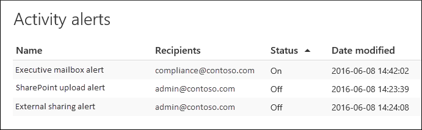

# Creare avvisi attivitàCreate activity alerts

È possibile creare un avviso attività che invierà una notifica tramite posta elettronica quando gli utenti eseguono attività specifiche in Office 365.You can create an activity alert that will send you an email notification when users perform specific activities in Office 365. Gli avvisi attività sono simili alla ricerca di eventi nel log di controllo, con la differenza che verrà inviato un messaggio di posta elettronica quando si verifica un evento per un'attività per cui è stato creato un avviso.Activity alerts are similar to searching for events in the audit log, except that you'll be sent an email message when an event for an activity that you've created an alert for happens. 
  
 **Perché usare gli avvisi attività invece di eseguire ricerche nel log di controllo?****Why use activity alerts instead of searching the audit log?** È possibile che alcuni tipi di attività o attività eseguite da utenti specifici siano effettivamente da conoscere.There might be certain kinds of activity or activity performed by specific users that you really want to know about. Anziché ricordare di cercare tali attività nel log di controllo, è possibile usare gli avvisi attività per fare in modo che Microsoft 365 invii un messaggio di posta elettronica quando gli utenti eseguono tali attività.Instead of having to remember to search the audit log for those activities, you can use activity alerts to have Microsoft 365 send you an email message when users perform those activities. Ad esempio, è possibile creare un avviso attività per notificare quando un utente elimina i file in SharePoint oppure è possibile creare un avviso per informare l'utente quando un utente elimina definitivamente i messaggi dalla propria cassetta postale.For example, you can create an activity alert to notify you when a user deletes files in SharePoint or you can create an alert to notify you when a user permanently deletes messages from their mailbox. La notifica tramite posta elettronica inviata include informazioni sull'attività eseguita e sull'utente che l'ha eseguita.The email notification sent to you includes information about which activity was performed and the user who performed it.

> [!NOTE]
> Gli avvisi attività sono deprecati.Activity alerts are being deprecated. È consigliabile iniziare a usare i criteri di avviso nel Centro sicurezza e conformità invece di creare nuovi avvisi attività.We recommend that you start using alert policies in the security and compliance center instead of creating new activity alerts. I criteri di avviso forniscono funzionalità aggiuntive, ad esempio la possibilità di creare un criterio di  avviso che attiva un avviso quando un utente esegue un'attività specificata e di visualizzare avvisi nella pagina Visualizza avvisi nel Centro sicurezza e conformità.Alert policies provide addition functionality such as the ability to create an alert policy that triggers an alert when any user performs a specified activity, and displaying alerts on the **View alerts** page in the security and compliance center. Per ulteriori informazioni, vedere [Criteri di avviso.](alert-policies.md)For more information, see [Alert policies](alert-policies.md).
  
## Verificare i ruoli e configurare la registrazione di controlloConfirm roles and configure audit logging

- Per gestire gli avvisi di attività, è necessario disporre del ruolo Configurazione organizzazione nel Centro sicurezza & conformità.You must be assigned the Organization Configuration role in the Security & Compliance Center to manage activity alerts. Per impostazione predefinita, questo ruolo viene assegnato ai gruppi di ruoli Amministratore conformità e Gestione organizzazione.By default, this role is assigned to the Compliance Administrator and Organization Management role groups. Per ulteriori informazioni sull'aggiunta di membri ai gruppi di ruoli, vedere Concedere agli utenti l'accesso al [Centro sicurezza & conformità.](../security/office-365-security/grant-access-to-the-security-and-compliance-center.md)For more information about adding members to role groups, see [Give users access to the Security & Compliance Center](../security/office-365-security/grant-access-to-the-security-and-compliance-center.md).
    
- Prima di iniziare a usare gli avvisi attività, è necessario che tu o un altro amministratore attivi la registrazione di controllo per l'organizzazione.You (or another admin) must first turn on audit logging for your organization before you can start using activity alerts. A tale scopo, è sufficiente fare clic su **Avvia registrazione attività** utente e amministratore nella pagina **Avvisi** attività.To do this, just click **Start recording user and admin activity** on the **Activity alerts** page. Se questo collegamento non è visualizzato, il controllo è già stato attivato per l'organizzazione. È anche possibile attivare il controllo nella pagina di ricerca del **log** di controllo nel Centro sicurezza & conformità (andare **a Ricerca** log \> **di controllo**).(If you don't see this link, auditing has already been turned on for your organization.) You can also turn on auditing on the **Audit log search** page in the Security & Compliance Center (go to **Search** \> **Audit log search**). È necessario eseguire questa operazione solo una volta per l'organizzazione.You only have to do this once for your organization.
  
- È possibile creare avvisi per le stesse attività che è possibile cercare nel log di controllo.You can create alerts for the same activities that you can search for in the audit log. Vedi la [sezione Altre informazioni](#more-information) per un elenco degli scenari comuni (e dell'attività specifica da monitorare) per cui puoi creare avvisi.See the [More information](#more-information) section for a list of common scenarios (and the specific activity to monitor) that you can create alerts for. 
    
- È possibile utilizzare **la** pagina Avvisi attività nel Centro sicurezza & conformità per creare avvisi solo per le attività eseguite dagli utenti elencati nella rubrica dell'organizzazione.You can use the **Activity alerts** page in the Security & Compliance Center to create alerts only for activity performed by users who are listed in your organization's address book. Non è possibile utilizzare questa pagina per creare avvisi per attività eseguite da utenti esterni non elencati nella rubrica.You can't use this page to create alerts for activity performed by external users who aren't listed in the address book. 
    
## Creare un avviso attivitàCreate an activity alert

1. Passare a [https://protection.office.com/managealerts](https://protection.office.com/managealerts).Go to [https://protection.office.com/managealerts](https://protection.office.com/managealerts).
    
2. Accedere usando l'account di lavoro o della scuola.Sign in using your work or school account.
    
3. Nella pagina **Avvisi attività fare** clic su Aggiungi icona  **Nuovo.**On the **Activity alerts** page, click  **New**.

   Viene visualizzata la pagina del riquadro a comparsa per creare un avviso attività.The flyout page to create an activity alert is displayed.

    
    
  
4. Completare i campi seguenti per creare un avviso attività:Complete the following fields to create an activity alert:
    
    a.a. **Nome:** digitare un nome per l'avviso.**Name** - Type a name for the alert. I nomi degli avvisi devono essere univoci all'interno dell'organizzazione.Alert names must be unique within your organization.
    
    b.b. **Descrizione** (facoltativo): descrivere l'avviso, ad esempio le attività e gli utenti monitorati e gli utenti a cui vengono inviate notifiche tramite posta elettronica.**Description** (Optional) - Describe the alert, such as the activities and users being tracked, and the users that email notifications are sent to. Le descrizioni forniscono un modo semplice e rapido per descrivere lo scopo dell'avviso ad altri amministratori.Descriptions provide a quick and easy way to describe the purpose of the alert to other admins.
    
    c.c. **Tipo di** avviso: verifica che **l'opzione** Personalizzata sia selezionata.**Alert type** - Make sure the **Custom** option is selected. 

    d.d. **Invia questo avviso quando** - Fai clic su **Invia questo avviso quando** e quindi configura questi due campi:**Send this alert when** - Click **Send this alert when** and then configure these two fields:
    
    - **Attività:** fare clic sull'elenco a discesa per visualizzare le attività per cui è possibile creare un avviso.**Activities** - Click the drop-down list to display the activities that you can create an alert for. Si tratta dello stesso elenco di attività visualizzato quando si esegue una ricerca nel log di controllo.This is the same activities list that's displayed when you search the audit log. È possibile selezionare una o più attività specifiche oppure fare clic sul nome del gruppo di attività per selezionare tutte le attività nel gruppo.You can select one or more specific activities or you can click the activity group name to select all activities in the group. Per una descrizione di queste attività, vedere la sezione "Attività verificate" in [Ricerca nel log di controllo.](search-the-audit-log-in-security-and-compliance.md#audited-activities)For a description of these activities, see the "Audited activities" section in [Search the audit log](search-the-audit-log-in-security-and-compliance.md#audited-activities). Quando un utente esegue una qualsiasi delle attività aggiunte all'avviso, viene inviata una notifica tramite posta elettronica.When a user performs any of the activities that you've added to the alert, an email notification is sent. 
    
     - **Utenti:** fare clic su questa casella e quindi selezionare uno o più utenti.**Users** - Click this box and then select one or more users. Se gli utenti in questa casella eseguono  le attività aggiunte alla casella Attività, verrà inviato un avviso.If the users in this box perform the activities that you added to the **Activities** box, an alert will be sent. Lasciare vuota **la casella** Utenti per inviare un avviso quando un utente dell'organizzazione esegue le attività specificate dall'avviso.Leave the **Users** box blank to send an alert when any user in your organization performs the activities specified by the alert. 

    e.e. Invia questo avviso  **a:** fare clic su  Invia questo avviso, quindi fare clic nella casella Destinatari e digitare un nome per aggiungere un  utente che riceverà una notifica tramite posta elettronica quando un utente (specificato nella casella Utenti) esegue un'attività (specificata nella casella Attività). **Send this alert to** - Click **Send this alert**, and then click in the **Recipients** box and type a name to add a users who will receive an email notification when a user (specified in the **Users** box) performs an activity (specified in the **Activities** box). Si noti che l'utente viene aggiunto all'elenco dei destinatari per impostazione predefinita.Note that you are added to the list of recipients by default. È possibile rimuovere il proprio nome dall'elenco.You can remove your name from this list.
    
5. Fare **clic su** Salva per creare l'avviso.Click **Save** to create the alert. 
    
    Il nuovo avviso viene visualizzato nell'elenco nella **pagina Avvisi** attività.The new alert is displayed in the list on the **Activity alerts** page. 
    
    
  
    Lo stato dell'avviso è impostato su **Attivato.**The status of the alert is set to **On**. Si noti che vengono elencati anche i destinatari che riceveranno una notifica tramite posta elettronica quando viene inviato un avviso.Note that the recipients who will received an email notification when an alert is sent are also listed. 
  
## Disattivare un avviso attivitàTurn off an activity alert

È possibile disattivare un avviso attività in modo che non sia inviata una notifica tramite posta elettronica.You can turn off an activity alert so that an email notification isn't sent. Dopo aver disattivato l'avviso attività, questo viene comunque visualizzato nell'elenco degli avvisi attività per l'organizzazione ed è comunque possibile visualizzarne le proprietà.After you turn off the activity alert, it's still displayed in the list of activity alerts for your organization, and you can still view its properties.
  
1. Passare a [https://protection.office.com/managealerts](https://protection.office.com/managealerts) .Go to Go to [https://protection.office.com/managealerts](https://protection.office.com/managealerts).
    
2. Accedere usando l'account aziendale o dell'istituto di istruzione.Sign in using your work or school account.
    
3. Nell'elenco degli avvisi attività per l'organizzazione fare clic sull'avviso che si desidera disattivare.In the list of activity alerts for your organization, click the alert that you want to turn off.
    
4. Nella pagina **Modifica avviso** fare clic **sull'interruttore** Attiva per impostare lo stato su **Disattivato** e quindi su **Salva.**On the **Edit alert** page, click the **On** toggle switch to change the status to **Off**, and then click **Save**.
    
    Lo stato dell'avviso nelle pagine **Avvisi** attività è impostato su **Disattivato.**The status of the alert on the **Activity alerts** pages is set to **Off**. 
    
Per riattivare un avviso attività, ripeti questi passaggi e fai clic sull'interruttore **Disattiva** per impostare lo stato su **Attivato.**To turn an activity alert back on, just repeat these steps and click the **Off** toggle switch to change the status to **On**.
  
## Altre informazioniMore information

- Ecco un esempio di notifica tramite posta elettronica inviata agli utenti specificati nel campo Invia  questo  avviso a (ed elencati in Destinatari nella pagina Avvisi attività) nel Centro sicurezza & conformità.Here's an example of the email notification that is sent to the users that are specified in the Sent this alert to field (and listed under **Recipients** on the **Activity alerts** page ) in the Security & Compliance Center. 
    
    
  
- Ecco alcune attività comuni relative a documenti e messaggi di posta elettronica per cui è possibile creare avvisi attività.Here's are some common document and email activities that you can create an activity alerts for. Le tabelle descrivono l'attività, il nome dell'attività per cui creare un avviso e il  nome del gruppo di attività in cui l'attività è elencata nell'elenco a discesa Attività.The tables describes the activity, the name of the activity to create an alert for, and the name of the activity group that the activity is listed under in the **Activities** drop-down list. Per visualizzare un elenco completo delle attività per cui è possibile creare avvisi attività, vedere la sezione "Attività verificate" nel log [di controllo.](search-the-audit-log-in-security-and-compliance.md#audited-activities)To see a complete list of the activities that you can create activity alerts for, see the "Audited activities" section in [Search the audit log](search-the-audit-log-in-security-and-compliance.md#audited-activities).
    
    > [!TIP]
    > È possibile creare un avviso attività per una sola attività eseguita da qualsiasi utente.You might want to create an activity alert for just one activity that's performed by any user. In caso di creazione di un avviso attività che tiene traccia di più attività eseguite da uno o più utenti.Or you might want to create an activity alert that track multiple activities performed by one or mores users. 
  
    Nella tabella seguente sono elencate alcune attività comuni relative ai documenti in SharePoint o OneDrive for Business.The following table lists some common document-related activities in SharePoint or OneDrive for Business.
    
    |**Quando un utente esegue questa operazione...****When a user does this...**|**Creare un avviso per questa attività****Create an alert for this activity**|**Gruppo attività****Activity group**|
    |:-----|:-----|:-----|
    |Visualizza un documento in un sito.Views a document on a site.    |File apertoAccessed file    |Attività su file e cartelleFile and folder activities    |
    |Modifica o modifica un documento.Edits or changes a document.    |File modificatoModified file    |Attività su file e cartelleFile and folder activities    |
    |Condivide un documento con un utente esterno all'organizzazione.Shares a document with a user outside of your organization.    |Condividere file, cartella o sitoShare file, folder, or site    EAnd    Invito alla condivisione creatoCreated sharing invitation    Per altre informazioni, vedere [Usare il controllo della condivisione nel log di controllo](use-sharing-auditing.md).For more information, see [Use sharing auditing in the audit log](use-sharing-auditing.md).    |Attività di richiesta di accesso e condivisioneSharing and access request activities    |
    |Carica o scarica un documento.Uploads or downloads a document.    |File caricatoUploaded file    E/oAnd/or    File scaricatoDownloaded file    |Attività su file e cartelleFile and folder activities    |
    |Modifica le autorizzazioni di accesso a un sito.Changes the access permissions to a site.    |Autorizzazioni sito modificateModified site permissions    |Attività di amministrazione sitiSite administration activities    |

    Nella tabella seguente sono elencate alcune attività comuni relative alla posta elettronica in Exchange Online.The following table lists some common email-related activities in Exchange Online.

    |**Quando un utente esegue questa operazione...****When a user does this...**|**Creare un avviso per questa attività****Create an alert for this activity**|**Gruppo attività****Activity group**|
    |:-----|:-----|:-----|
    |Elimina definitivamente (elimina) un messaggio di posta elettronica dalla propria cassetta postale.Permanently deletes (purges) an email message from their mailbox.    |Messaggi eliminati dalla cassetta postalePurged messages from mailbox    | Attività su cassette postali di ExchangeExchange mailbox activities    |
    |Invia un messaggio di posta elettronica da una cassetta postale condivisa.Sends an email message from a shared mailbox.    |Messaggio inviato con autorizzazioni Invia comeSent message using Send As permissions    EAnd    Messaggio inviato con autorizzazioni Invia per conto diSent message using Send On Behalf permissions    | Attività su cassette postali di ExchangeExchange mailbox activities    |
   
- È inoltre possibile utilizzare i cmdlet **New-ActivityAlert** e **Set-ActivityAlert** in PowerShell per Centro sicurezza & conformità per creare e modificare avvisi attività.You can also use the **New-ActivityAlert** and **Set-ActivityAlert** cmdlets in Security & Compliance Center PowerShell to create and edit activity alerts. Tenere presente quanto segue se si utilizzano questi cmdlet per creare o modificare avvisi attività:Keep the following things in mind if you use these cmdlets to create or edit activity alerts: 
    
  - Se si utilizza un cmdlet per aggiungere un'attività all'avviso non elencato nell'elenco a discesa Attività, nella pagina delle proprietà viene visualizzato un messaggio per l'avviso "Questo avviso contiene operazioni personalizzate non elencate nella selezione". If you use a cmdlet to add an activity to the alert that isn't listed in the **Activities** drop-down list, a message is displayed in on the property page for the alert that says, "This alert has custom operations not listed in the picker." 
    
  - Un buon motivo per utilizzare i cmdlet per creare o modificare un avviso attività è l'invio di notifiche tramite posta elettronica a un utente esterno all'organizzazione.A good reason to use the cmdlets to create or edit an activity alert is to send email notifications to someone outside of your organization. Questo utente esterno verrà elencato nell'elenco dei destinatari per l'avviso.This external user will be listed in the list of recipients for the alert. Tuttavia, se si rimuove questo utente esterno dall'avviso, tale utente non può essere aggiunto di nuovo all'avviso utilizzando la **pagina Modifica** avviso.But if you remove this external user from the alert, that user can't be re-added to the alert by using the **Edit alert** page. Sarà necessario aggiungere nuovamente l'utente esterno utilizzando il cmdlet **Set-ActivityAlert** oppure utilizzare il cmdlet **New-ActivityAlert** per aggiungere lo stesso (o diverso) utente esterno a un nuovo avviso.You'll have to re-add the external user using the **Set-ActivityAlert** cmdlet, or use the **New-ActivityAlert** cmdlet to add the same (or different) external user to a new alert. 
