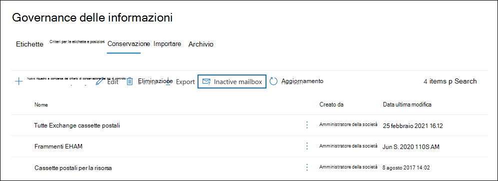
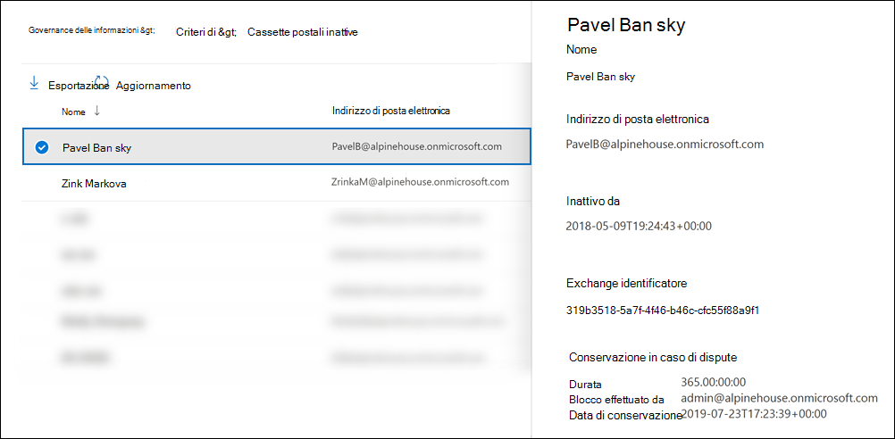

# <a name="create-and-manage-inactive-mailboxes"></a>Creare e gestire le cassette postali inattive

Microsoft 365 consente di conservare il contenuto delle cassette postali eliminate. Questa funzionalità è denominata [cassette postali inattive](inactive-mailboxes-in-office-365.md). Inactive mailboxes allow you to retain former employees' email after they leave your organization. Una cassetta postale diventa inattiva quando alla cassetta postale viene applicata una conservazione per controversia legale o un criterio di conservazione (creato nel Centro sicurezza e conformità in Office 365 o Microsoft 365) prima dell'eliminazione dell'account utente corrispondente. I contenuti di una cassetta postale inattiva vengono mantenuti per tutta la durata del blocco applicato alla cassetta postale prima che fosse resa inattiva. In questo modo gli amministratori, i responsabili della conformità e i responsabili dei record possono utilizzare Ricerca contenuto per cercare ed esportare il contenuto di una cassetta postale inattiva. Le cassette postali inattive non possono ricevere posta elettronica e non vengono visualizzate nella rubrica condivisa o in altri elenchi dell'organizzazione.
  
> [!IMPORTANT]
> Continuando a investire in modi diversi per conservare il contenuto delle cassette postali, stiamo annunciando il ritiro dei blocchi In-Place nell'interfaccia di amministrazione di Exchange locale. Ciò significa che è consigliabile utilizzare i blocchi per controversia legale e i criteri di conservazione per creare una cassetta postale inattiva. A partire dal 1° luglio 2020 non sarà possibile creare nuove esenzioni In-Place in Exchange Online. Tuttavia, sarà comunque possibile modificare la durata del blocco di un'In-Place di archiviazione posta su una cassetta postale inattiva. Tuttavia, a partire dal 1° ottobre 2020, non sarà possibile modificare la durata del blocco. Sarà possibile eliminare una cassetta postale inattiva solo rimuovendo l'In-Place blocco. Le cassette postali inattive esistenti In-Place conservazione verranno mantenute finché il blocco non viene rimosso. Per ulteriori informazioni sul ritiro delle In-Place, vedere [Ritiro degli strumenti di eDiscovery legacy.](legacy-ediscovery-retirement.md)
  
## <a name="preparations-before-creating-an-inactive-mailbox"></a>Preparazioni prima di creare una cassetta postale inattiva

- Per rendere inattiva una cassetta postale, è necessario assegnare una licenza di Exchange Online Piano 2 in modo che sia possibile applicare un blocco per controversia legale o un criterio di conservazione alla cassetta postale prima che venga eliminata. Exchange Online Le licenze del piano 2 fanno parte di un Office 365 Enterprise E3 ed E5. Se a una cassetta postale viene assegnata una licenza di Exchange Online Piano 1 o Chiosco Exchange Online (che fanno parte rispettivamente di una sottoscrizione Office 365 E1 e F1), è necessario assegnarle una licenza Archiviazione Exchange Online separata in modo che sia possibile applicare un blocco alla cassetta postale prima di essere eliminata. Per ulteriori informazioni, vedere [Archiviazione Exchange Online](https://go.microsoft.com/fwlink/p/?LinkId=286153).

- Le licenze associate alla cassetta postale Exchange Online eliminata saranno disponibili dopo l'eliminazione dell'account utente corrispondente. È quindi possibile [assegnare tali licenze a un altro utente.](../admin/manage/assign-licenses-to-users.md)

- Se un blocco per controversia legale o un criterio di conservazione (configurato per conservare o conservare ed eliminare il contenuto) non viene applicato a una cassetta postale prima che venga eliminata, il contenuto della cassetta postale non verrà conservato o individuabile. Tuttavia, è possibile recuperare la cassetta postale eliminata entro 30 giorni dall'eliminazione; se non viene recuperata entro 30 giorni, la cassetta postale e il suo contenuto vengono eliminati definitivamente.

- Per ulteriori informazioni sul blocco per controversia legale, vedere [Conservazione per controversia legale.](/exchange/security-and-compliance/in-place-and-litigation-holds) Per ulteriori informazioni sui criteri di conservazione, vedere [Informazioni sui criteri di conservazione e sulle etichette di conservazione.](retention.md)
  
## <a name="create-an-inactive-mailbox"></a>Creare una cassetta postale inattiva

Per rendere inattiva una cassetta postale, è necessario eseguire due passaggi: 1) applicare un blocco per controversia legale o applicare un criterio di conservazione e 2) eliminare la cassetta postale o l'account utente corrispondente. Quando la cassetta postale è inattiva, il contenuto viene conservato finché non vengono rimossi i criteri di conservazione o il blocco.
  
### <a name="step-1-place-a-mailbox-on-litigation-hold-or-apply-a-retention-policy"></a>Passaggio 1: Applicare un criterio di conservazione a una cassetta postale in blocco per controversia legale

L'applicazione di un criterio di conservazione (configurato per conservare o conservare ed eliminare il contenuto) di una cassetta postale per controversia legale mantiene il contenuto nella cassetta postale prima che venga eliminata. Con entrambi i tipi di blocchi viene conservato tutto il contenuto della cassetta postale, compresi gli elementi eliminati e le versioni originali degli elementi modificati. Gli elementi eliminati e modificati vengono conservati nella cassetta postale inattiva per un determinato periodo oppure finché non viene eliminata definitivamente la cassetta postale inattiva rimuovendo il blocco o i criteri di conservazione applicati alla cassetta postale inattiva.
  
Se un blocco è già applicato a una cassetta postale o se un criterio di conservazione è già applicato a una cassetta postale, è necessario eliminare l'account utente corrispondente, come illustrato nel passaggio 2.
  
Per le procedure dettagliate per applicare un criterio di conservazione o il blocco per controversia legale a una cassetta postale, vedere:
  
- [Applicare un blocco per controversia legale a una cassetta postale](create-a-litigation-hold.md)

- [Informazioni sui criteri e sulle etichette di conservazione](retention.md)

> [!NOTE]
> Per i blocchi per controversia legale e i criteri di conservazione, è possibile creare un blocco indefinito o in base al tempo. In caso di un blocco indefinito, il contenuto della cassetta postale inattiva viene conservato per sempre, finché il blocco non viene rimosso o finché la durata del blocco non viene modificata. Dopo la rimozione del criterio di conservazione o di conservazione (presupponendo che la cassetta postale sia stata eliminata più di 183 giorni fa), la cassetta postale inattiva verrà contrassegnata per l'eliminazione definitiva e il contenuto della cassetta postale non verrà più conservato o individuabile. In un criterio di conservazione o di conservazione basato sul tempo, è necessario specificare la durata del blocco. La durata si applica ai singoli elementi e viene calcolata a partire dalla data in cui ciascun elemento è stato ricevuto o creato. Dopo che il blocco per un elemento della cassetta postale scade e che tale elemento viene spostato o si trova nella cartella Elementi ripristinabili nella cassetta postale inattiva, l'elemento viene definitivamente eliminato (cancellato) dalla cassetta postale inattiva dopo la scadenza del periodo di conservazione dell'elemento eliminato. 
  
### <a name="step-2-delete-the-mailbox"></a>Passaggio 2: Eliminare la cassetta postale

Dopo l'archiviazione della cassetta postale o l'applicazione di un criterio di conservazione, il passaggio successivo consiste nell'eliminare la cassetta postale. Il modo migliore per eliminare una cassetta postale è eliminare l'account utente corrispondente nell'Microsoft 365 di amministrazione. Per informazioni sull'eliminazione di account utente, vedere [Delete a user from your organization](../admin/add-users/delete-a-user.md).
  
> [!NOTE]
> È inoltre possibile eliminare la cassetta postale utilizzando il cmdlet **Remove-Mailbox** in PowerShell di Exchange Online. Per ulteriori informazioni, vedere [Eliminare o ripristinare le cassette postali utente in Exchange Online](/exchange/recipients-in-exchange-online/delete-or-restore-mailboxes). 
  
## <a name="view-a-list-of-inactive-mailboxes"></a>Visualizzare un elenco di cassette postali inattive

Per visualizzare un elenco delle cassette postali inattive nell'organizzazione:

1. Passare a <https://compliance.microsoft.com> e accedere con le credenziali di un account amministratore dell'organizzazione.

2. Nel riquadro di spostamento sinistro del Centro Microsoft 365 conformità fare clic su **Mostra** tutto e quindi su Governance delle informazioni > **conservazione**.

   

3. Nella pagina **Conservazione** fare clic su **Cassetta postale inattiva** per visualizzare un elenco delle cassette postali inattive.

4. Selezionare una cassetta postale inattiva per visualizzare una pagina a comparsa con informazioni sulla cassetta postale inattiva.

     

È possibile fare clic su Esporta l'icona Esporta risultati di ricerca per visualizzare o scaricare un file CSV contenente informazioni aggiuntive sulle cassette postali   inattive nell'organizzazione.

In alternativa, è possibile eseguire il comando seguente in Exchange Online PowerShell per visualizzare l'elenco delle cassette postali inattive.

```powershell
 Get-Mailbox -InactiveMailboxOnly | FT DisplayName,PrimarySMTPAddress,WhenSoftDeleted
```

È inoltre possibile eseguire il comando seguente per esportare l'elenco delle cassette postali inattive e altre informazioni in un file CSV. In questo esempio il file CSV viene creato nella directory corrente.

```powershell
Get-Mailbox -InactiveMailboxOnly | Select Displayname,PrimarySMTPAddress,DistinguishedName,ExchangeGuid,WhenSoftDeleted | Export-Csv InactiveMailboxes.csv -NoType
```

> [!NOTE]
> È possibile che una cassetta postale inattiva abbia lo stesso indirizzo SMTP di una cassetta postale utente attiva. In questo caso, il valore della proprietà **DistinguishedName** o **ExchangeGuid** può essere utilizzato per identificare in modo univoco una cassetta postale inattiva.
  
## <a name="search-and-export-the-contents-of-an-inactive-mailbox"></a>Ricerca ed esportazione del contenuto di una cassetta postale inattiva

È possibile accedere al contenuto della cassetta postale inattiva utilizzando lo strumento Ricerca contenuto nel Centro sicurezza & conformità. When you search an inactive mailbox, you can create a keyword search query to search for specific items or you can return the entire contents of the inactive mailbox. You can preview the search results or export the search results to an Outlook Data (PST) file or as individual email messages. For step-by-step procedures for searching mailboxes and exporting search results, see the following topics:
  
- [Ricerca contenuto](content-search.md)

- [Esportare i risultati della ricerca](export-search-results.md)

Ecco alcuni aspetti da tenere presenti quando si eseguono ricerche nelle cassette postali inattive.
  
- Se una ricerca di contenuto include una cassetta postale utente e tale cassetta postale viene resa inattiva, la ricerca di contenuto continuerà a cercare nella cassetta postale inattiva quando si esegue di nuovo la ricerca dopo che diventa inattiva.

- In alcuni casi, un utente può avere una cassetta postale attiva e una cassetta postale inattiva con lo stesso indirizzo SMTP. In questo caso, verrà cercata solo la cassetta postale specifica selezionata come posizione per una ricerca di contenuto. In altre parole, se si aggiunge la cassetta postale di un utente a una ricerca, non è possibile presupporre che la ricerca sia nelle cassette postali attive che inattive. verrà cercata solo la cassetta postale aggiunta in modo esplicito alla ricerca.

- È consigliabile evitare di avere una cassetta postale attiva e una cassetta postale inattiva con lo stesso indirizzo SMTP. Se è necessario riutilizzare l'indirizzo SMTP attualmente assegnato a una cassetta postale inattiva, è consigliabile ripristinare la cassetta postale inattiva o ripristinare il contenuto di una cassetta postale inattiva in una cassetta postale attiva (o nell'archivio di una cassetta postale attiva), quindi eliminare la cassetta postale inattiva.

## <a name="change-the-hold-duration-for-an-inactive-mailbox"></a>Modificare la durata del blocco per una cassetta postale inattiva

Dopo aver reso inattiva una cassetta postale, è possibile modificare la durata del blocco o il criterio di conservazione applicato alla cassetta postale inattiva. Per le procedure dettagliate, vedere [Change the hold duration for an inactive mailbox in Office 365](change-the-hold-duration-for-an-inactive-mailbox.md).
  
## <a name="recover-an-inactive-mailbox"></a>Recuperare una cassetta postale inattiva

Se l'ex dipendente torna nell'organizzazione oppure se un nuovo dipendente viene assunto per ricoprire il ruolo del dipendente rimosso, è possibile recuperare i contenuti della cassetta postale inattiva. Quando si recupera una cassetta postale inattiva, la cassetta postale viene convertita in una nuova cassetta postale, il contenuto e la struttura della cassetta postale vengono conservati e la cassetta postale viene collegata a un nuovo account utente. Dopo essere stata recuperata, la cassetta postale inattiva non esiste più. Per procedure dettagliate e ulteriori informazioni su come eseguire il ripristino di una cassetta postale inattiva, vedere [Recover an inactive mailbox in Office 365](recover-an-inactive-mailbox.md).
  
## <a name="restore-the-contents-of-an-inactive-mailbox-to-another-mailbox"></a>Ripristinare il contenuto di una cassetta postale inattiva in un'altra cassetta postale

Se un altro dipendente assume le responsabilità di un ex dipendente o se un'altra persona deve accedere al contenuto della cassetta postale inattiva, è possibile ripristinare (o unire) il contenuto della cassetta postale inattiva in una cassetta postale esistente. Quando si ripristina una cassetta postale inattiva, il contenuto viene copiato in un'altra cassetta postale. La cassetta postale inattiva viene conservata e rimane inattiva. La cassetta postale inattiva può comunque essere cercata utilizzando eDiscovery, i suoi contenuti possono essere ripristinati in un'altra cassetta postale oppure può essere recuperata o eliminata in un secondo momento. Per le procedure dettagliate, vedere [Restore an inactive mailbox in Office 365](restore-an-inactive-mailbox.md).
  
## <a name="delete-an-inactive-mailbox"></a>Eliminare una cassetta postale inattiva

Se non è più necessario conservare il contenuto di una cassetta postale inattiva, è possibile eliminare definitivamente la cassetta postale inattiva rimuovendo il blocco o rimuovendo il criterio di conservazione applicato alla cassetta postale inattiva. La cassetta postale verrà conservata per 183 giorni dopo la rimozione del blocco o del criterio di conservazione. Dopo 183 giorni, la cassetta postale verrà contrassegnata per l'eliminazione definitiva e la cassetta postale diventerà non ripristinabile. Se la cassetta postale inattiva è stata eliminata negli ultimi 183 giorni, è comunque possibile ripristinarla. Per le procedure dettagliate per la rimozione di un blocco o di un criterio di conservazione per eliminare definitivamente una cassetta postale inattiva, vedere [Delete an inactive mailbox](delete-an-inactive-mailbox.md).
